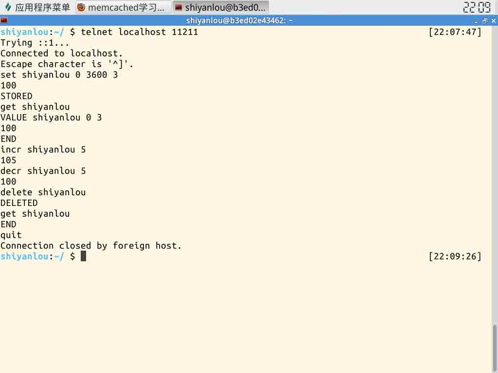
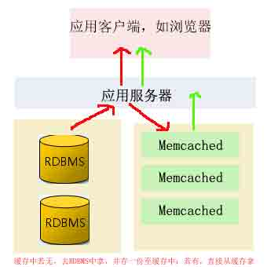

# 第 1 节 Memcached 简介

## 1.Memcached 是什么

Memcached 是一套高性能的、**分布式内存**对象缓存系统。

> 它**不是**数据库

许多 Web 应用将数据保存到关系型数据库( RDBMS，如 MySQL )中，服务器从中读取数据并显示在浏览器中。 随着数据量的增大、访问的集中，就会出现 RDBMS 负担加重、数据库响应恶化、 网站显示延迟等不良问题。这样，LiveJournal 的 Brad Fitzpatrick 开发了 Memcached，设计用于加速动态应用程序（比如 Web），减轻数据库负载。

它是一款开源软件，以 BSD license 授权协议发布。它由 C 写成,它以 key/value 的方式将数据储存在**内存**中, 熟悉 C 又喜欢钻研源码的童鞋可以好好看看。

* * *

## 2.Memcached 有什么特征

Memcached 作为高速运行的分布式缓存服务器，具有以下的特点：

**协议简单**

1.  Memcached 的服务端客户端通信使用简单的文本协议，而不是笨重的 XML 等格式，因此，通过 telnet 也能在 memcached 上存取数据。[官方文本协议](http://github.com/memcached/memcached/blob/master/doc/protocol.txt)
2.  官方还提供二进制协议（Binary Protocol），不需要解析文本，还能减少文本协议的漏洞，使得原本高速的 memcached 的性能更上一层楼。[官方二进制协议](http://code.google.com/p/memcached/wiki/BinaryProtocolRevamped)

**基于 libevent 的事件处理**

1.  libevent 是个程序库，它将 Linux 的 epoll、BSD 类操作系统的 kqueue 等事件处理功能封装成统一的接口。即使对服务器的连接数增加，也能发挥 O(1)的性能。Memcached 使用这个 libevent 库，因此能在 Linux、BSD、Solaris 等操作系统上发挥其高性能。[libevent 官网](http://libevent.org/)

**内置内存存储方式**

1.  Memcached 中保存的数据都存储在 Memcached 内置的内存存储空间中。由于数据仅存在于内存中，因此重启 Memcached、重启操作系统会导致全部**数据丢失**。另外，内容容量达到指定值（启动时可通过-m 参数配置）之后，就基于 LRU(Least Recently Used，顾名思义：最近最少使用)算法自动删除不使用的缓存，不用担心，这个功能是可以配置的，Memcached 启动时通过“-M”参数可以**禁止 LRU**。不过，Memcached 本身是为缓存而设计的，建议开启 LRU。

**Memcached 不互相通信的分布式**

1.  Memcached 虽然称为“分布式”缓存服务器，但服务器端并没有“分布式”功能。互不通信，怎么实现分布式？事实上，Memcached 的分布式是完全由客户端程序库实现的。这种分布式是 Memcached 的**最大特点**。通过这种方式，Memcached server 之间的数据不需要同步，也就不需要互相通信了。
2.  函数库通过与数据保存时相同的算法（一种是求余 Hash，另一种是 Consistent Hashing)，根据“键”选择服务器。使用的算法相同，就能选中与保存时相同的服务器。只要数据还在，就能获得之前保存的值。
3.  上述两种算法各有千秋，求余 Hash 分布式算法会导致 Cache 命中率（这个是缓存很重要的指标之一）降低，而 consistent hash 算法，会影响新加入的 server 逆时针方向的 server 节点的命中率。
4.  这样，Memcached 服务器增多后，键就会分散，即使一台 Memcached 服务器发生故障无法连接，也不会影响其他的缓存，系统依然能继续运行，cool！

* * *

## 3\. Memcached 能做什么

看它自己怎么说，Memcached is an in-memory key-value store for small chunks of arbitrary data (strings, objects) from results of database calls, API calls, or page rendering.

做缓存系统，具体可以缓存哪些数据呢？Memcached 可以存储各种格式的数据，包括图像、视频、文件等。要知道各种数据在存储设备（如磁盘）上都长一样，都是 0 和 1 组成的二进制数序列。

> 哦，那这么说它是万能的哦? > 金无赤足，人无完人!

> 软件也一样，都有优缺点。绝大多数大型项目都是由多种技术，多种软件融合而成，取长补短，当然可能我们自己练手的小项目就不一定了。

### 适用场景

1.  网站包含了访问量很大（什么叫很大，那是多大？）的动态网页，因而数据库的负载将会很高, 且大部分数据库请求都是读操作；
2.  数据库服务器的负载比较低，CPU 使用率却很高；
3.  小型需要共享的数据，如 session 等临时数据；
4.  缓存一些很小但是被频繁访问的文件。图片这种大点儿的文件就由 CDN（内容分发网络）来处理了。

### 不适用场景

1.  缓存对象的大小大于 1 MB, Memcached 本身就不是为了处理庞大的多媒体和巨大的二进制块而设计的，如果你任性，要存这么大的数据，可以自己修改源代码，它是开源的，不过请慎改；
2.  key 的长度大于 250 字符（硬性要求）；
3.  环境不允许运行 memcached 服务，如虚拟主机；
4.  应用运行在不安全的环境中，Memcached 未提供任何安全策略，仅仅通过 telnet 就可以访问到 memcached。数据安全越来越重要了，so，请把它放在防火墙后；
5.  业务需要的是持久化数据时请使用数据库。

官网的一幅介绍图，讲得很直白。直接上图


*   注：Memcached 的缓存是一种分布式的，可以让不同主机上的多个用户同时访问，也就想当于把内存变大了。

> 扯了大半天，怎么用呢？的确，作为用户，得先学会怎么用，再去理解工作原理。

* * *

## 4.Memcached 怎么用

看这段伪代码：

```
'''prefix 缓存的 key 前缀
id 数据 Id，一般是根据一定规则生成数据的 id
'''
def get_data(prefix = "key", id):
    data = memcached_get(prefix + id) #看缓存里有没有，有，拿到缓存，立即返回
    return data if data

    data = get_date_from_database(id) #缓存没有，去数据库拿，并存入缓存，后返回
    memcached_set(prefix + id, data)
return data 
```

有图更形象



下面这些是通过 telnet 来测试 Memcached



Memcached 的 Telnet 使用接口文档

1.存储命令格式：

1.  <data block>```（注意换行！协议要求）

```
参数|描述
:---------------|:---------------
<command>    |set/add/replace
<key>        |查找关键字（可直接理解为 key-value 结构中的 key）
<flags>      |整型参数，客户端可用它存储关于键值对的额外信息，比如判断数据是否被压缩
<exptime>    |该数据的存活时间（以秒为单位，0 表示永远） 
<bytes>      |存储字节数
<data block> |存储的数据块（可直接理解为 key-value 结构中的 value）
```

```
命令|描述
:---------------|:---------------
set        |  |Set a key unconditionally（无条件设置某键的值） 例：set mykey 0 60 3
add          |Add a new key（添加一个新的键，键不存在才可以添加）例：add newkey 0 30 5
replace      |Overwrite existing key(键存在才可以替换它的值)  例：replace key 0 60 5
append       |Append data to existing key(在已存在的缓存数据后添加缓存数据)   例：append key 0 60 15
prepend      |Prepend data to existing key(在已存在的缓存数据前添加缓存数据) 例：prepend key 0 60 15
cas          |Check And Set (or Compare And Swap). An operation that stores data, but only if no one else has updated the data since you read it last. Useful for resolving race conditions on updating cache data.(即 checked and set 的意思，只有当最后一个参数和 gets 所获取的参数匹配时才能存储。对解决竞争条件上更新缓存数据很有帮助。)
```

2.读取命令 格式：

```
命令|描述
:---------------|:---------------
get  |        Takes one or more keys and returns all found items.(获取一个或多个键的值，多个请用空格隔开) 例：get hello, get hello hi
gets |        An alternative get command for using with CAS. Returns a CAS identifier (a unique 64 bit number) with the item. Return this value with the cas command. If the item's CAS value has changed since you gets it, it will not be stored.(gets 命令比普通的 get 命令多返回了一个数字。这个数字可以检查数据是否发生改变。当 key 对应的数据改变时，这个多返回的数字也会改变。常与 cas 命令配合使用)

3.增加/减少
Memcached 支持的整数型数值范围：0~18446744073709551615
格式： 
```

<command name> <key>```

```
命令|描述
:---------------|:---------------
incr |         Increments numerical key value by given number（在存在的整数值上增加给定值，对非整数值操作，会出错） incr mykey 2
decr |         Decrements numerical key value by given number（在存在的整数值上减少给定值，对非整数值操作，会出错） decr mykey 5
```

4.删除 格式： `<command name> <key>`

```
命令|描述
:---------------|:---------------
delete  |      Deletes an existing key(删除一个已存在的键)    例：delete mykey
```

5.批量清理

```
命令|描述
:---------------|:---------------
flush*all    | Invalidate specific items immediately(清理缓存中的所有 key/value 对)
flush*all n   |Invalidate all items in n seconds(清理生存时间在 n 秒内的所有 key/value 对)    例：flush_all 900
```

6.统计

```
命令|描述
:---------------|:---------------
stats [args]     |    可选参数 statsslabs，malloc，items，detail，sizes，reset
返回当前连接的 Memcached 实例的状态信息
```

7.其他

```
命令|描述
:---------------|:---------------
version   |    Prints server version（打印版本信息）
verbosity |    Increases log level（提高日志级别）
quit      |    Terminate telnet session(退出当前连接，退出有点儿问题，先按 ] + Ctrl 键，再输入 quit，回车，方能退出)
```

#### 客户端支持

> 很幸运的是，目前已有众多语言（如 C/C++, Java, Python, PHP, Ruby）客户端支持。

具体语言的开发文档请谷歌或百度

* * *

### 5\. 哪些公司在用？

Memcached 的知名用户 >LiveJournal, Wikipedia, Flickr, Twitter, Youtube, WordPress.com 等

* * *

### 6\. 参考词汇

分布式：

*   分布式系统（distributed system）是建立在网络之上的软件系统。正是因为软件的特性，所以分布式系统具有高度的**内聚性**和**透明性**。内聚性是指每一个节点都是高度自治的，有本地的管理系统。透明性是指每一个分布节点对用户的应用来说都是透明的。

Telnet：

*   Telnet 协议是 TCP/IP 协议簇中的一员，是 Internet 远程登陆服务的标准协议和主要方式。它为用户提供了在本地计算机上完成远程主机工作的能力。在终端使用者的电脑上使用 telnet 程序，用它连接到服务器。

* * *

### 7.相关链接

*   [Memcached 官网](http://memcached.org/)
*   [项目源码](https://github.com/memcached/memcached)
*   [Memcached 的分布式算法](http://kb.cnblogs.com/page/42734/)
*   [Memcached 的删除机制](http://kb.cnblogs.com/page/42733/)

> 关于截图中看到的一些不熟悉的 shell 命令，强烈建议先去学习本网站的相关课程。

[1-01]:/img/01.jpg "1+1=1?" [1-02]:/img/02.jpg "Memcached 的用途" [1-03]:/img/03.jpg "部分命令使用示例，请大家多动手敲"