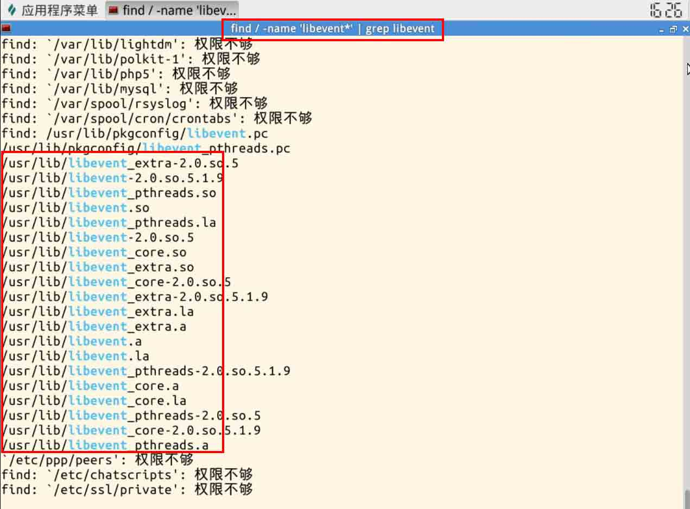
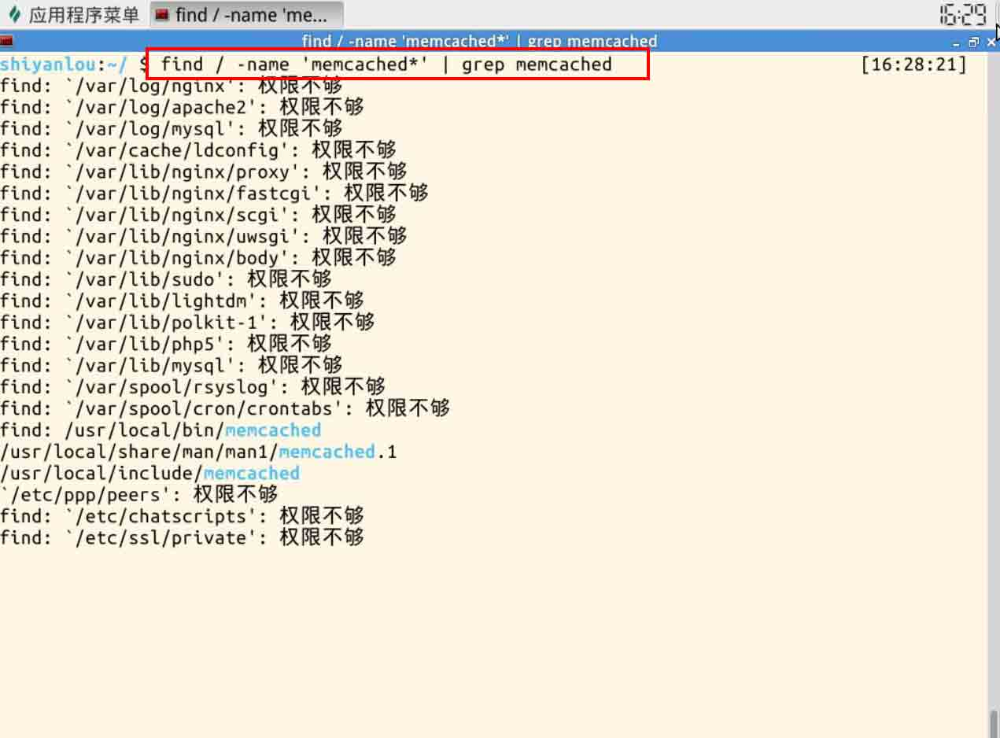

# 第 2 节 Memcached 的安装与配置

## 一.安装

### 1.linux 下安装

> 第一节中讲到，由于 Memcached 在 linux 下是基于 libevent 的，因此需要安装 libevent 和 Memcached。

安装方式有两种：一、包管理工具安装（适合新手，刚开始建议使用这种方式），二、源码安装。

* * *

### 1.1 包管理工具安装

著名的 linux 系统基本上分为两大类：

1.  RedHat 系列：Redhat、Centos、Fedora 等 其常见的安装包格式 rpm, 安装 rpm 包的命令是“rpm -参数” ，包管理工具 yum。

2.  Debian 系列：Debian、Ubuntu 等 其常见的安装包格式 deb, 安装 deb 包的命令是“dpkg -参数”，包管理工具 apt-get。 本课程环境为 Ubuntu，所以可以下载对应的 deb 包或者直接通过 apt-get 工具安装。这里采用 apt-get 方式安装，最简单。

```
$ sudo apt-get install memcached 
```

题外话，可以玩玩其他系统，配置允许的话，装个[虚拟机](http://baike.baidu.com/view/1132.htm)玩玩。


注意看，libevent 和 Memcached 一起被安装，无需另行安装 libevent。 安装过程很快，如果没有错误信息的话，就安装成功了。

再次确认一下 libevent：

`sh $ find / -name 'libevent*' | grep libevent`



memcached：

```
$ find / -name 'memcached*' | grep memcached 
```




> Tips: 如果你跟着课程使用了包管理工具安装，又想体验源码安装的乐趣，那就暂时先卸载 Memcached 和 libevent 。

命令在这里：

### Memcached 的卸载

`sh $ sudo apt-get --purge remove <programname>`

(注：--purge 卸载软件的同时删除配置文件）


### 1.2 源码安装（很好玩的哦）

1.第一步，准备好需要安装的软件的源码

> 所谓开源开源，实际就是开放源代码。这也是 linux 的一大魅力所在吧。系统内核代码都可以看到。。

先来看看 libevent 是否已经安装。由于它是 Memcached 的依赖包， 所以必须在 Memcached 之前装好。

```


从图中，我们可以看到没有安装。

这样，我们试试直接编译安装 Memcached，不管 libevent。

> 软件的版本周期有很多，具体可看[软件版本周期-维基百科][2_07]，从学习角度来讲，请选择**稳定版**源码。

**1.2.1  Memcached 的安装**
源码地址：[Memcached-1.4.22][2_08]

 ```sh
$ wget http://labfile.oss.aliyuncs.com/memcached-1.4.22.tar.gz
 ```


源码是以压缩包的形式解压的，使用前得解压。 
```

$ tar -zxvf memcached-1.4.22.tar.gz

```


编译安装
- 进入到 memcached-1.4.22 文件夹 ```cd memcached-1.4.22```，不确定自己在哪里，可以使用```pwd```查看当前所在目录，终端左边就有所在目录。
- 编译 
```

$ ./configure && make && sudo make install

```

"&amp;&amp;"符   即 and，顺序执行一系列指令，如果上一步成功，则执行下一步，反之停止之后的指令。是不是很方便

命令详解： 

第一步：'./configure'，一般源码目录中会有 configure 文件，来确定机器是否安装了所需的依赖库，然后配置编译器，告诉系统安装目录等等。用户可以在这一步使用附加选项选择需要编译的模块；
第二步：make，编译源码，打包成“安装包”；
第三步：make install，编译“安装包”，形成可执行的二进制文件，完成安装；

报错了，没有提前安装 libevent 被发现了


还是老老实实先安装 libevent 吧
**1.2.2  libevent 的安装**

*  源码地址：[libevent-2.0.21-stable][2_13]
下载编译安装的步骤与 Memcached 的相同。
* 解压 &amp;&amp; 编译安装 
```

$ wget http://labfile.oss.aliyuncs.com/libevent-2.0.21-stable.tar.gz $ cd libevent-2.0.21-stable $ ./configure --prefix=/usr && make test && sudo make install

```


* 注意！配置一行加了 prefix 参数，作用：软件将被安装到/usr 目录下（可查看，```find / -name "libevent*"```, 实际目录为/usr/lib）, 而且该软件任何的文档都被复制到这个目录。为了以后的维护方便。
如不提供此参数，则会影响 memcached 安装。会提示，找不到 libevent 库

**现在 libevent 已经装好了，回头去安装 Memcached 吧**
> 学习在于折腾，学习就是这样一步一步摸索的过程 : )

*  安装出错中已经提示过，如果已经安装 libevent，请附上它的路径 
```

$ ./configure --with-libevent=/usr && make test && sudo make install

```

###安装成功了耶！！！

> linux 更多相关内容，请学习[《Linux 基础入门（新版）》][2_18]

**1.2.3 你也许会问，采用源码安装有什么好处？**

* 获得最新的软件版本，及时修复 bug
    a.   根据用户需要，灵活定制软件功能

* 应用场合举例
    a.安装较新版本的应用程序时
    - 自由软件的最新版本大都以源码的形式最先发布

    b. 当前安装的程序无法满足需要时
    - 编译安装可由用户自行修改、定制功能

    c. 需要为应用程序添加新的功能时
    - 用户可以重新配置、自由修改源代码，加入新的功能

###2.windows 下安装
* 这里以 win7 举例，据说微软不再提供 win7 重大重大更新了。。
源码地址：[win7-64 位 memcached][2_19]

* 安装配置请参考[ windows 下 memcached 安装与配置][2_20]

###3.Mac 下安装
* 源码
libevent 源码地址：[Memcached-1.4.22][2_08]
memcached 源码地址：[libevent-2.0.21-stable][2_13]

* 安装配置请参考[Install Memcached on Mac OS X][2_21]
看完是不是感觉过程差不多，linux 和 mac 还是有些渊源的。

> Tips：如遇到问题，请勤查。

---

##二.配置
* 启动 Memcached ：```memcached -d -m 256 -u root -l localhost -p 11210 -c 256 -P /tmp/memcached.pid```


* 查看帮助文档： ```memcached -h```


启动参数说明：

args|des 
:---------------|:--------------- 
```

-p```| 指定端口号（默认值：11211）

```
```-s <file>```| 用于监听的 UNIX 套接字路径（禁用网络支持） 
```

-a <mask>``` |UNIX 套接字访问掩码，八进制数字（默认值：0700）

```
```-d``` | 启动一个守护进程 
```

-r``` |最大化核心文件限制

```
```-m``` |指定最大使用内存大小（默认值：64 MB） 
```

-M``` |内存耗尽时返回错误，而不是删除项

```
```-c```  |最大同时连接数（默认是 1024） 
```

-m`|最大内存使用，单位 MB。（默认值：64 MB）` -k``` |锁定所有内存页。注意你可以锁定的内存上限。试图分配更多内存会失败的，所以留意启动守护进程时所用的用户可分配的内存上限。（不是前面的 -u <username> 参数；在 sh 下，使用命令"ulimit -S -l NUM_KB"来设置。）

```
```-vv``` | 详细信息（并且打印客户端命令/响应） 
```

-vvv``` | 超详细信息（并且打印内部状态的变化）

```
```-i``` | 打印 memcached 和 libevent 的许可。 
```

-P <file>``` | 将 PID 写入文件<file>，这样可以使得后边进行快速进程终止, 需要与-d 一起使用

```
```-n <bytes>``` |最小分配空间，key+value+flags（默认值：48） 
```

-L```| 尝试使用大内存页（如果可用的话）。提高内存页尺寸可以减少"页表缓冲（TLB）"丢失次数，提高运行效率

```
```-t <num>```|  使用的线程数（默认：4） 
```

-R```| 每个连接可处理的最大请求数。

```
```-b``` | 设置后台日志队列的长度（默认：1024） 
```

-B``` |绑定协议 - 可能值：ascii,binary,auto（默认值）

```
```-S```  |启用 sasl 安全验证功能,开启后，客户端需要提供用户名密码才能访问 memcached 
```

-o``` |(慎用)逗号分隔的扩展或实验性的选项列表 -（实验） maxconns*fast| 立即关闭新的连接，如果超过大并发限制 -hashpower| 整数乘法器为哈希表应该是多大。在运行时，如果不是足够大，可以种植。设置在重新启动之前基于"STAT hash*power_level"。

命令那么多，头都晕了。其实常用的就那么多，不知道的可以通过-h 来查，边学边查 **常用**的启动命令 -d -m -u -l -p -c -P -h

这样 memcached 的安装并可以成功启动了，不过你现在只能用 telnet 去使用它。想在你的应用中使用它，还得安装对应模块，如 PHP 应用，需要安装 php-php 的扩展 memcache(少个 d)。

* * *

### 3.参考文章

1.  [Linux 下源代码的编译安装](http://criss.blog.51cto.com/1048459/464581)

[2*02]: url "命令行安装" [2*03]: url "查看 libevent 是否安装成功" [2*04]: url "查看 memcached 是否安装成功*01" [2*05]: url "查看 memcached 是否安装成功*02" [2*06]: url "查看 libevent 是否已安装" [2*09]: url "下载 memcached-1.4.22 源码" [2*10]: url "解压 memcached-1.4.22" [2*11]: url "编译安装 memcached" [2*12]: url "编译安装 memcached, 出错" [2*14]: url "下载 libevent-2.0.21 源码" [2*15]: url "解压 libevent" [2*16]: url "编译安装 libevent" [2*17]: url "再次编译安装 libevent，附上 libevent 路径" [2*18]: http://www.shiyanlou.com/courses/1 "实验楼《Linux 基础入门（新版）》课程" [2*22]: url "启动 memcached" [2*23]: url "memcached 帮助文档*01" [2*24]: url "memcached 帮助文档 _02"