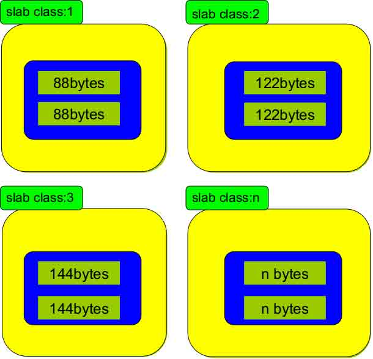
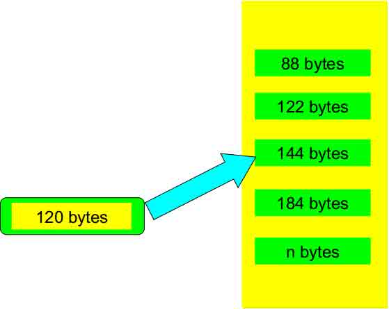
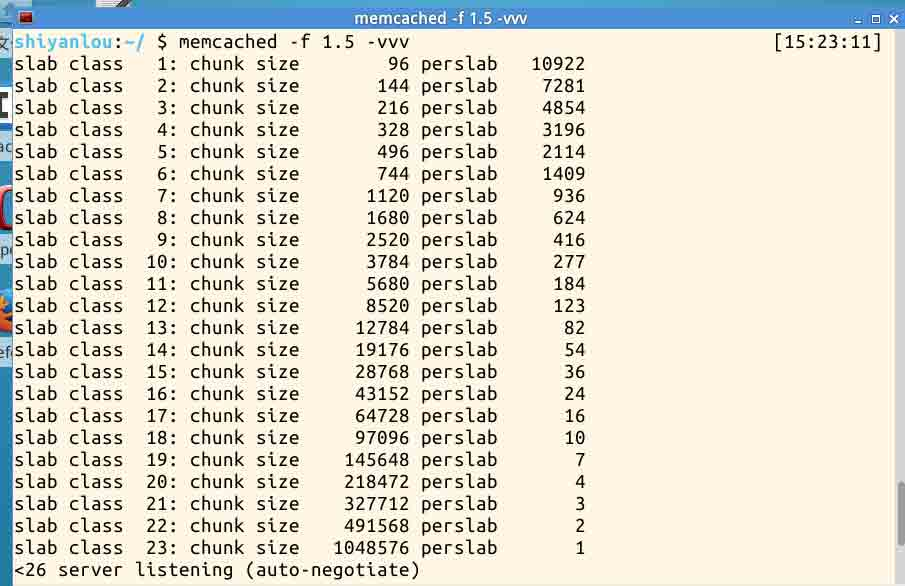
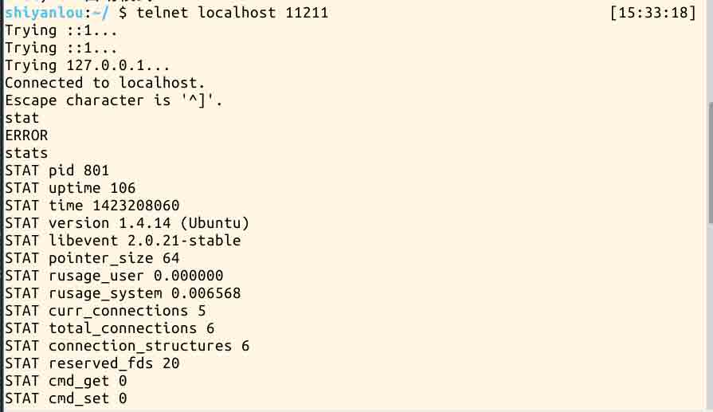

# 第 3 节 memcached 特性实战

>memcached 的四大特性已经在第一章指出，分别是协议简单、基于 libevent 事件处理、基于内置内存的存储方式、还有就是 memcached 不相互通信的分布式。前面两个特性不做具体讲解，分布式的算法可以参考：[Memcached 的分布式算法](http://kb.cnblogs.com/page/42734/),那么这一章我们就一起来学习一下 memcached 的内存存储。

## memcached 的内存存储

**slab allocator 缓存内存碎片化**

相信大家都知道 c 语言直接利用 malloc 和 free 等来向操作系统索取和释放内存的时候，会产生很小量的内存碎片，在碎片量很小的时候还能接受，但是随着数量的增加，这些内存碎片的空闲会占据大量空间无法利用，这就会降低内存的利用率，导致服务器的性能下降。而 memcached 采用的是 slab allocator 缓存碎片化的机制来管理内存。这里先介绍几个专业术语： **Page**:分配给 Slab 的内存空间,默认是 1 MB。分配给 Slab 之后根据 slab 的大小切分成 chunk。 **Chunk**:用于缓存记录的内存空间。 **Slab class**:特定大小的 chunk 的组。 slab allocator 可以用图解表示：如下图所示：



什么意思呢，也就是 slab allocator 预先按照规定的大小，将内存分为多个分割为多个特定长度的块以解决内存存储的问题。当需要申请内存的时候，再按需判断内存的大小，选择合适的 Chunk 进行存储。这样就避免了碎片化。那么 memcached 是如何选择 chunk 的呢，memcached 保存了 slab 空闲 chunk 表，当需要内存的时候通过判断依据 chunk 列表选择进行存储，将数据缓存起来，参考下图：



但是，可能机智的你已经看出来 memcached 的内存机制的缺点所在了，虽然减少了碎片化，但是却会造成内存浪费，如上图所示的，120 bytes 的 item 放进 144 bytes 的 chunk，造成了 24 bytes 的浪费，可能这一 item 浪费的是一小部分，但积少成多嘛，只会积累的越来越多。来看看官方的原文吧： The most efficient way to reduce the waste is to use a list of size classes that closely matches (if that's at all possible) common sizes of objects that the clients of this particular installation of memcached are likely to store. 也就是告诉我们最有效率去减少浪费的方法是预先知道客户端发送数据的公用大小，或者仅缓存大小相同的情况下，使用适合数据大小的组的列表。 但是我们可以调节 slab class 的大小，现在开始介绍通过调整 grow factor 的方式来调节。 memcached 在启动时可以指定特定的 grow factor（-f），其默认值是 1.25,指定的大小是 1-2 之间。

```
memcached -f 1.5 -vvv 
```

 改变 grow factor 的值为 1.8,对比一下：

```
memcached -f 1.8 -vvv 
```


执行完之后，朋友们可以做一下对比。在 memcached 默认启动之时，grow factor 都是以默认大小 1.25 启动的，但是内存毕竟宝贵，在将 memcached 引入内存的时候，记得计算好相应的 grow factor 以免出现内存浪费的现象。 现在我们来查看一下 memcached 的内部状态，这里可以使用 telnet 来执行 stats 命令来查看，

```
telnet localhost 11211
stats 
```



讲到这里，也不知道朋友们对 memcached 的内存机制理解了多少呢？

在 memcached 中，数据是不会消失的，memcached 不会自己释放已经分配的内存，而且不会监视该内存是否过期，那应该怎么办呢？从 get 命令入手，get 可以查看记录的时间戳，检查该分配内存是否过期，这被称为 memcached 的 Lazy expiration 机制，这样做有什么好处呢，节约 cpu 的检查时间，降低成本。memcached 会优先使用已超时的记录的空间,但即使如此,也会发生追加新记录时空间不足的情况,此时就要使用名为 Least Recently Used(LRU)机制来分配空间。顾名思义,这是删除“最近最少使用”的记录的机制。因此,当 memcached 的内存空间不足时(无法从 slab class 获取到新的空间时),就从最近未被使用的记录中搜索,并将其空间分配给新的记录。从缓存的实用角度来看,该模型十分理想。