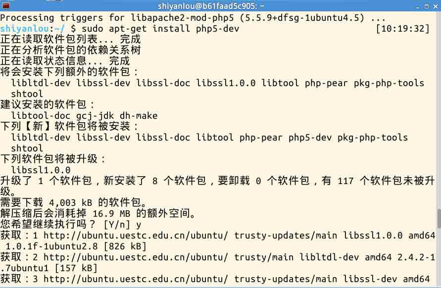
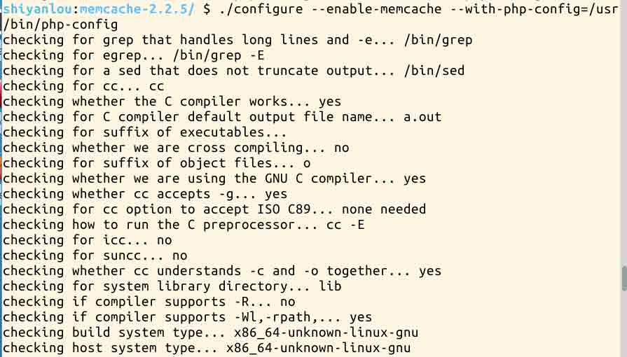
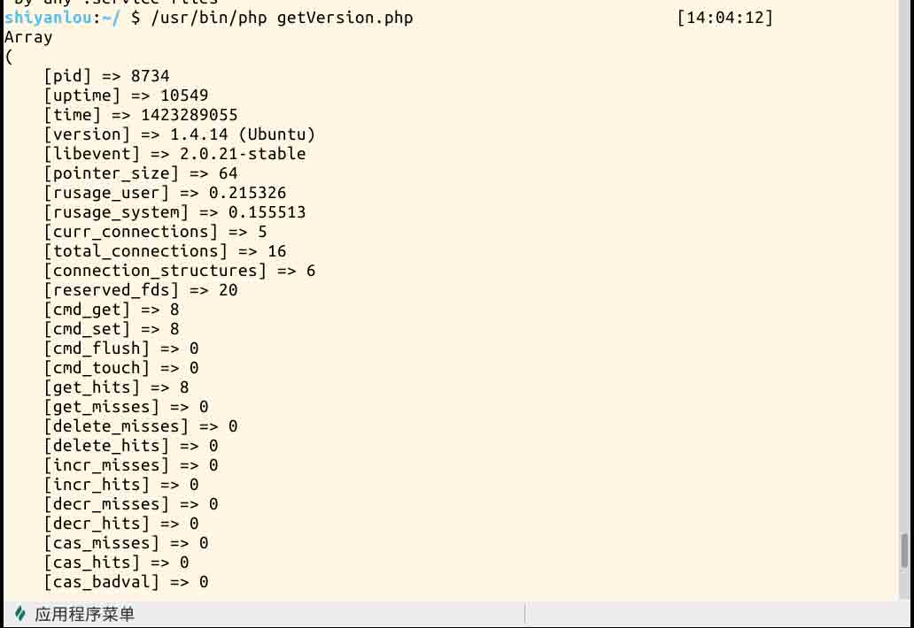

# 第 4 节 Memcache PHP 实战

>前面三章讲了 memcached 的一些相关内容，相信很多人都做了学习，大家都注意到，Memcached 支持各种语言编写的客户端 API，目前包括 Perl、PHP、Python、Ruby、Java、C#和 C 等。这里我们讲 PHP 配置 memcache、memcached 的方法，以及一些 memcache PHP 的实战。

## PHP5 安装

要想将 memcached 与 PHP 结合起来使用，那么 PHP 是必不可少的。工欲善其事必先利其器嘛。首先用 apt-get 安装 php5.

```
sudo apt-get install php5 
```


再安装 phpize 为了后面安装 php 扩展用

```
sudo apt-get install php5-dev 
```



## PHP 扩展 memcache

好了，准备工作也做好了，现在我们来一起安装 php 的 memcache 扩展，当然还有 memcached 扩展，memcached 要比 memcache 高级一些。先讲 memcache。这里我们采用好玩点的方式，源码安装。 百度一下 memcache 的扩展包在哪个网站呢？这儿：http://pecl.php.net/package/memcache ，好了，选择一个你倾向的版本来安装就好了，这里选择 memcache-2.2.5 这个版本来讲解。运行命令：

```
sudo wget -b http://labfile.oss.aliyuncs.com/memcache-2.2.5.tgz 
```

得到  诶，这又是区别与之前安装 memcached 时候的不同的源码安装方法，学习嘛就是要多多尝试，条条大路通实验楼嘛。 再怎么办呢？这样：

```
tail -5 wget-log | sed '/^$/d' 
```

 解压 memcache-2.2.5.tgz 并且进入该文件夹内部。

```
tar zxf memcache-2.2.5.tgz
cd memcache-2.2.5
ls 
```

 是不是发现了什么，对了没有 configure 文件的存在。困惑了，没有 configure 文件怎么安装呢，这。。。这时，phpize 就派上用场了，先启动之，如果不知道 phpize 在哪个位置可以先用 which 查找一下：

```
/usr/bin/phpize 
```

 然后运行：

```
./configure --enable-memcache --with-php-config=/usr/local/php/bin/php-config  
sudo make
sudo make install 
```



 这样也就安装完成了。并且应该关注的是安装完成之后弹出的： Installing shared extensions: /usr/lib/php5/20121212/

**修改 php.ini**:找到 Php.ini,将里面的 extension*dir='/'修改为 extension*dir='/usr/lib/php5/20121212/并且在后面加上一行：extension=memcache.so。这样 PHP-memcache 就安装完毕了。 好了现在我们来测试一下吧。两种方法简单的看一下：先编写一段简单的 php 程序吧：

```
<?php
$mem = new Memcache;
$mem->connect('127.0.0.1',11211);
$mem->set('test','Hello shiyanlou!',0,12);
$val =$mem->get('test');
echo $val;
?> 
```

如果输出 hello shiyanlou 就是配置完成了。


tips：在做测试的时一定要记得先开启你的 memcached 服务，否则实验是无法完成的！ 传说中低级别点的 memcache 已经配置好了，现在我们来安装一下 php 配置 memcached 吧！

## memcached 配置

memcached 和之前 memcache 配置方法基本是一样的，但是 libmemcached 却必不可少，这里就不讲解如何安装了，还不知道怎么做的请自行百度咯！提醒一下同样也要修改 php.ini。加上 extension='memcached.so'就好了。 还可以通过网页的方式来查看一下 php 的配置信息，编写 php 文档：

```
<?php
phpinfo();
?> 
```

 这是我计算机的情况，大家挑现阶段的版本来安装之后查看哦！

## PHP 实战

本小节将通过一些简单的 PHP 程序，结合 memcache 做一下小实验吧！ 首先我们通过 PHP 来查看 memcached 服务器的版本号：

```
<?php
    $memcache = new Memcache;
    $memcache->connect('localhost', 11211) or die ("Could not connect");
    $version = $memcache->getVersion();
    echo "Server's version: ".$version."\n";
?> 
```

可以发现，其实就是 memcached 中的一些简单函数！通过这个程序就可以输出 memcached 服务器的版本号： 

再来查看一下 memcached 服务器运行情况吧，很相似：

```
<?php
   $memcache = new Memcache;
   $memcache->connect('localhost', 11211) or die ("Could not connect");
   print_r($memcache->getStats());
?> 
```

通过这段程序就可以输出 memcached 服务其的运行情况。  再来使用 memcached 中的一些常用命令吧。这里以 set、get 举例，当然朋友们也可以使用 add、delete、replace 来实现相应的功能：

```
<?php
    $memcache = new Memcache;
    $memcache->connect('localhost', 11211) or die ("Could not connect");
    $memcache->set( 'name', 'shiyanlou', 0, 30);
    $result = $memcache->get( 'name');
    echo "name: ".$result."\n";
?> 
```

来查看一下输出吧：  最后我们来添加服务器吧，通过 addServer 来向指定对象添加服务器。

```
<?php 
    function _callback_memcache_failure($host, $port) { 
        print "memcache '$host:$port' failed"; 
    } 
    $memcache = new Memcache; 
    $memcache->addServer('192.168.1.116', 11211); 
    $memcache->setServerParams('192.168.1.116', 11211, 1, 15, true, '_callback_memcache_failure'); 
    echo $memcache->getServerStatus('192.168.1.116', 11211); 
?> 
```

这里我们会发现，如果最初 memcached 的服务没有开启的时候会返回'ture'。

## 更多函数的使用方法还可以参考[这里](http://php.net/manual/zh/book.memcached.php)

* * *

memcached 的课程就讲到这里了，作者水平有限还望朋友们指正错误，还是那句话：Memcached 支持各种语言编写的客户端 AP