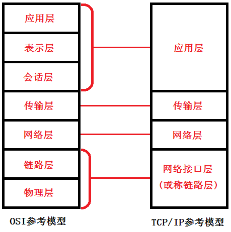
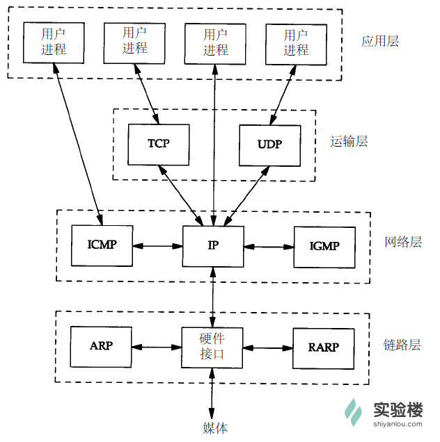
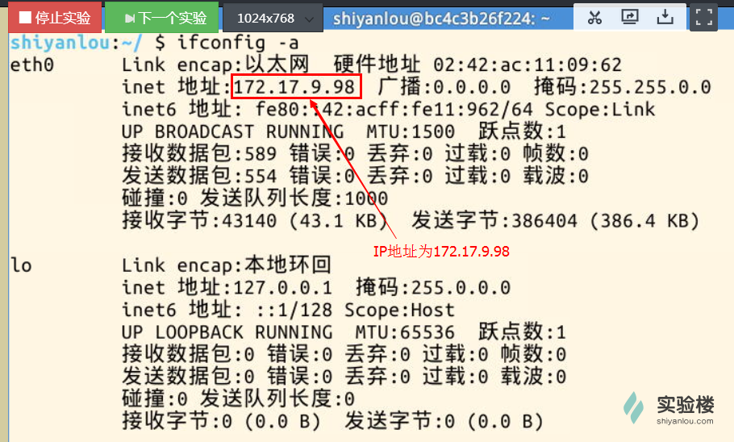
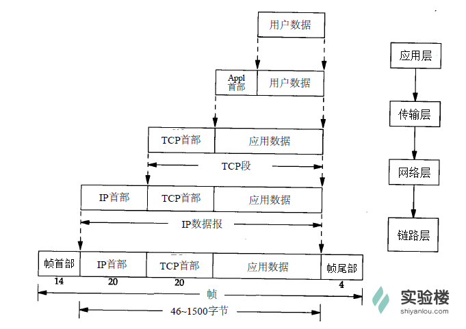

# 第 1 节 TCP/IP 简介

## 一、实验说明

### 1\. 环境登录

无需密码自动登录，系统用户名 shiyanlou

### 2\. 环境介绍

本实验环境采用 Ubuntu Linux 桌面环境，实验中会用到桌面上的程序：

*   1.命令行终端: Linux 命令行终端，打开后会进入 Bash 环境，可以使用 Linux 命令；

*   2.Gedit：简单、便捷的代码编辑器。

### 3\. 环境使用

使用命令行终端运行所需命令进行操作，使用编辑器输入实验所需的代码及文件。

“实验记录”页面可以在“我的主页”中查看，每次实验的截图及笔记，以及有效学习时间（指的是在实验桌面内操作的时间，如果没有操作，系统会记录为发呆时间）。这些都是您在实验楼学习的真实性证明。

## 二、TCP/IP 背景和介绍

上世纪 70 年代，随着计算机技术的发展，计算机使用者意识到：要想发挥计算机更大的作用，就要将世界各地的计算机连接起来。但是简单的连接是远远不够的，因为计算机之间无法沟通。因此设计一种通用的“语言”来交流是必要可少的，这时 TCP/IP 协议就应运而生了。

TCP/IP（Transmission Control Protocol/Internet Protocol）是传输控制协议和网络协议的简称，它定义了电子设备如何连入因特网，以及数据如何在它们之间传输的标准。

TCP/IP 不是一个协议，而是一个协议族的统称，里面包括了 IP 协议、IMCP 协议、TCP 协议、以及 http、ftp、pop3 协议等。网络中的计算机都采用这套协议族进行互联。

### 网络协议栈架构

提到网络协议栈结构，最著名的当属 OSI 七层模型，但是 TCP/IP 协议族的结构则稍有不同，它们之间的层次结构有如图对应关系：



可见 TCP/IP 被分为 4 层，每层承担的任务不一样，各层的协议的工作方式也不一样，每层封装上层数据的方式也不一样：

*   (1)应用层：应用程序通过这一层访问网络，常见 FTP、HTTP、DNS 和 TELNET 协议；

*   (2)传输层：TCP 协议和 UDP 协议；

*   (3)网络层：IP 协议，ARP、RARP 协议，ICMP 协议等；

*   (4)网络接口层：是 TCP/IP 协议的基层，负责数据帧的发送和接收。



本门课程，就是从底向上分层次对 TCP/IP 的各协议做介绍。

## 三、预备知识

### 1、IP 地址

网络上每一个节点都必须有一个独立的 IP 地址，通常使用的 IP 地址是一个 32bit 的数字，被 . 分成 4 组，例如，255.255.255.255 就是一个 IP 地址。有了 IP 地址，用户的计算机就可以发现并连接互联网中的另外一台计算机。

在 Linux 系统中，可以用这样一条命令查看自己的 IP 地址：

```
ifconfig -a 
```



### 2、域名

用 12 位数字组成的 IP 地址很难记忆，在实际应用时，用户一般不需要记住 IP 地址，互联网给每个 IP 地址起了一个别名，习惯上称作域名。

域名与计算机的 IP 地址相对应，并把这种对应关系存储在域名服务系统 DNS(Domain Name Service)中，这样用户只需记住域名就可以与指定的计算机进行通信了。

常见的域名包括 com、net 和 org 三种顶级域名后缀，除此之外每个国家还有自己国家专属的域名后缀（比如我国的域名后缀为 cn）。目前经常使用的域名诸如百度（www.baidu.com）、Linux 组织（www.lwn.net）等等。

我们可以使用命令”nslookup”或者“ping”来查看与域名相对应的 IP 地址，由于实验楼网络限制，我们可以使用`ping git.shiyanlou.com`查看。

例如：


关于域名与 IP 地址的映射关系，以及 IP 地址的路由和发现机制，将在后续章节进行详细的说明。

### 3、MAC 地址

MAC（Media Access Control）地址，或称为物理地址、硬件地址，用来定义互联网中设备的位置。

在 TCP/IP 层次模型中，网络层管理 IP 地址，链路层则负责 MAC 地址。因此每个网络位置会有一个专属于它的 IP 地址，而每个主机会有一个专属于它 MAC 地址。

### 4、端口号

IP 地址是用来发现和查找网络中的地址的，但是不同程序如何互相通信呢，这就需要端口号来识别了。如果把 IP 地址比作一间房子 ，端口就是出入这间房子的门。真正的房子只有几个门，但是端口采用 16 比特的端口号标识，一个 IP 地址的端口可以有 65536（即：2¹⁶）个之多！

服务器的默认程序一般都是通过人们所熟知的端口号来识别的。例如，对于每个 TCP/IP 实现来说，SMTP（简单邮件传输协议）服务器的 TCP 端口号都是 25，FTP（文件传输协议）服务器的 TCP 端口号都是 21，TFTP(简单文件传输协议)服务器的 UDP 端口号都是 69。任何 TCP/IP 实现所提供的服务都用众所周知的 1－1023 之间的端口号。这些人们所熟知的端口号由 Internet 端口号分配机构（Internet Assigned Numbers Authority, IANA）来管理。

### 5、封装和分用

**封装**：当应用程序发送数据的时候，数据在协议层次当中从顶向下通过每一层，每一层都会对数据增加一些首部或尾部信息，如下图所示，传输层传给网络层的数据单元称作 **TCP 报文段**(TCP segment) 或 **UDP**数据报(UDP datagram) 。网络层传给链路层的数据单元称作 **IP 数据报**(IP datagram)。链路层上的传输单元称作**帧**(Frame)。



**分用**：当主机收到一个数据帧时，数据就从协议层底向上升，通过每一层时，检查并去掉对应层次的报文首部或尾部，与封装过程正好相反。

### 6、RFC

RFC（Request for Comment）文档是所有以太网协议的正式标准，并在其官网上面公布，由 IETF 标准协会制定。大量的 RFC 并不是正式的标准，出版的目的只是为了提供信息。RFC 的篇幅不一，从几页到几百页不等。每一种协议都用一个数字来标识，如 RFC 3720 是 iSCSI 协议的标准，数字越大说是 RFC 的内容越新或者是对应的协议（标准）出现的比较晚。

所有的 RFC 文档都可以从网络上找到，其官网为[IETF](http://www.ietf.org/)。在网站上面可以通过分类以及搜索快速找到目标协议的 RFC 文档。目前在 IETF 网站上面的 RFC 文档有数千个，但是我们不需要全部掌握，在工作或学习中如果遇到可以找到对应的解释，理论与实际结合会有更好地效果，单纯阅读 RFC 的效果一般。

## 四、作业

1、查看自己电脑的 IP 地址，并截图。

2、Ping git.shiyanlou.com，查看 IP 地址，并截图。