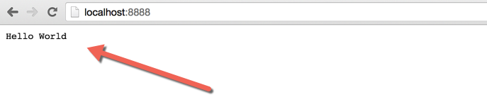
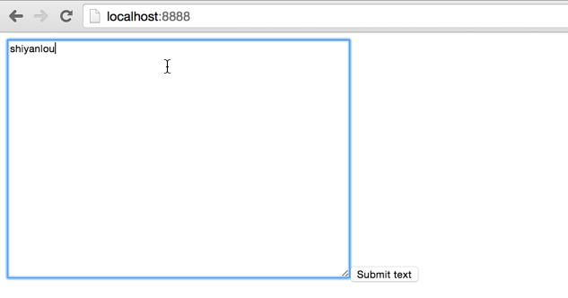
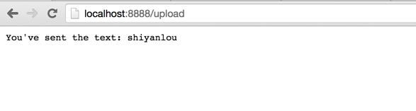
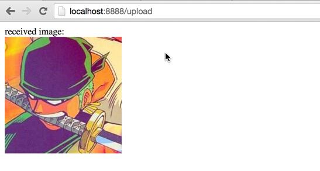

# 轻松创建 NodeJS 服务器

利用 NodeJS 轻松创建一个简单的服务器

## 实验简介

本实验的目的是带领大家使用 Nodejs 的一些常用服务模块来创建一个属于自己的简单服务器。

本实验基于系列博客：

[`www.lai18.com/user/214130.html?cid=183`](http://www.lai18.com/user/214130.html?cid=183)

## 实验准备

在开始实验之前，我们需要将本次课程文件先准备好：

```js
cd Desktop

wget http://labfile.oss.aliyuncs.com/courses/393/nodejs.zip 
```

然后解压：

```js
unzip nodejs.zip 
```

文件说明：我们会得到一个 nodejs 文件夹，你可以直接将这个文件夹拖到 Brackets 里面进行代码编写；至于 nodejs 下的四个 js 文件：它们都是空的，我是处于方便的目的直接建好了对应的文件，你可以根据实验的需要在对应的文件里写代码。对于 tmp/目录，这个是放图片的文件夹，你几乎不用去动它，而 formidable/文件是第三个实验需要用到的第三方模块，不用动它。

Hello World

在开始之前，我们来想想一个最简单的服务器到底应该满足什么样的要求？我觉得至少先得满足下面这两个条件：

1.  接收请求
2.  作出响应

嗯，最简单的服务器大概就是这样了。然后我们来具体实现一下

自从`Hello World`成了编程界学习一个新东西的开始标志之后，我们也来简单的实现一下这个。不用担心你没有 nodejs 基础，也不用把这件事想得很难，其实很简单。



也就是 6 行代码而已。我们在文件夹的目录之下创建一个`server.js`文件，写上下面的 6 行代码：

```js
var http = require("http");
http.createServer(function(request, response) {
    response.writeHead(200, {"Content-Type": "text/plain"});

    response.write("Hello World");

    response.end();

}).listen(8888); 
```

嗯，这样其实就可以完成一个最简单的 nodejs 服务器了。在命令行终端进入到项目目录之后，使用`node server.js`命令执行我们刚刚创建的文件。 然后在浏览器中访问`http://localhost:8888/`，就可以看到浏览器的页面左上角打印出来的`Hello World`了。

一切运行顺利之后，我们来详细说一说代码：

我们首先使用`var http = require("http");`引入了 nodejs 的 http 模块，这个模块是 nodejs 官方就写好的一个模块，我们引用它的目的是为了使用 它的`createServer`方法来创建一个 server，这样我们可以很快地实现我们需要实现的功能。而`createServer`方法返回一个对象，这个返回的对象有一个 可爱的函数叫 listen，这个`listen`就是用来监听端口号的，它接受一个参数，也就是我们上面的代码所显示的那样，直接传入端口号`8888`如果你想修改端口号， 请自行更改，但是本实验希望我们都还是坚守`8888`端口。然后在`createServer`方法里面，我们传入一个函数，这个函数接受两个参数(`request` 和 `response`)， request 在紧接下来的讲解之后会用到，目前为止的例子，我们主要是用到了`response，response`负责受到请求之后作出响应，我们这里通过下面几行代码作出 响应：

```js
response.writeHead(200, {"Content-Type": "text/plain"});
response.write("Hello World");
response.end(); 
```

首先，我们使用`response.writeHead()` 函数发送一个 HTTP 状态 `200` 和 HTTP 头的内容类型（content-type），分别表示请求成功和需要返回的`text`类型

然后使用 `response.write()` 函数在 HTTP 相应主体中发送文本`Hello World`，也就是我们需要显示的文本。

最后就是调用 `response.end()` 完成响应过程。这样完整的响应就做好了，所以，当你访问 http://localhost:8888/的时候，会看到 Hello World 的字样。

## 代码模块化

在开始深入下一步之前，我想首先带领大家将上面的代码重构一下。因为在 nodejs 中，其实很多代码都是模块化的，就像我们上面在第一行 `var http = require("http");` 中的 http 模块一样，所以这一小段实验我们首先来模块化我们的代码。

首先我们需要重构的代码就是`server.js`，因为在这个代码片段之中，我们给`createServer`传入的是一个匿名函数，代码可读性到后来可能就没有那么好了，所以我们 可以写成这样：

```js
var http = require("http");   

function onRequest(request, response) {   

 response.writeHead(200, {"Content-Type": "text/plain"});   

 response.write("Hello World");   

 response.end();  

}   

http.createServer(onRequest).listen(8888); 
```

上面的代码中，我们自己创建了一个`onRequest`方法，然后传给`createServer`方法，这个`onRequest`其实就是替代在第一部分我们传入的匿名函数。

其他的代码其实没有什么大变化，但是这样一看，其实我们的代码逻辑和结构会好很多，这些对于我们后续继续深入非常有好处。到这里，我们在代码结构之前迈进了 一小步，但是这只是对于单个文件的优化而已，一旦我们将视野放到整个项目之后，我们就可以考虑一种更好的代码方式：

1.  我们能不能将`server.js`代码像`var http = require("http");`直接引用呢？因为在很多地方我们可能都会用到这个代码
2.  我们能不能像 PHP 一样统一指定一个单入口文件`index.js`来处理所有进来的请求，然后我们根据请求的类型再去判断执行那一段代码？

带着上面两个问题，我们进行下一步的代码优化：

根据`require("http")`的思路，我们尝试着将`server.js``也封装成一个模块，比如像 http 调用 createServer 的共用方法一样，我们可以将 server.js 代码放在 一个共用方法之中，比如我们在`server.js`创建一个 start 方法：

```js
var http = require("http");   

function start(){

    function onRequest(request, response) {   

     response.writeHead(200, {"Content-Type": "text/plain"});   

     response.write("Hello World");   

     response.end();  

    }
   http.createServer(onRequest).listen(8888);
   //这里的 console.log 只是为了调试
   console.log("Server has started.");     
} 
exports.start = start; 
```

这样的话，我们如果调用`start`方法，我们就可以达到上面一样的效果了。但是我们怎么在外部文件也可以用到这个 start 方法呢？这个问题的解决方法就是 利用 nodejs 的`exports`机制了，我们通过`exports.start = start;` 将代码提供给其他页面引用。

接下来，我们解决第二个一问：`index.js`。我们创建一个`index.js`文件，我们来考虑一下，`index.js`需要做的哪些工作：

1.  肯定是可以处理请求和作出回应

既然我们在 server.js 已经写好了可以`处理请求和作出回应`的服务器代码，我们就可以直接拿来用了，所以，其实现在的`index.js`只需要很简单的两行代码：

```js
var server = require("./server");  
server.start(); 
```

我们首先像`var http = require("http");`一样引入自己编写的 server 代码模块，然后就调用 server 中的`start`方法来处理。在命令行执行 `node index.js`

再次访问`http://localhost:8888/`，你会看到同样的`Hello World`，但是这个时候我们迈进了一大步：我们的代码现在可以很方便地进行管理了。

代码模块化做好之后，我们可以进一步改善我们的服务器，因为目前我们的服务器还是太过简单了，只能返回一个页面(Hello World 的简单页面)； 但是在现实生活中简单的服务器都是可以根据不同 URL 来返回不同的页面，所以在这里我们需要引入`路由`这个功能，也就是用户在请求不同的 URL 之后，我们根据相应的条件返回不同的页面(或者说数据)给用户。

## 实现路由

在开始之前，我们需要考虑一下实现这个需要哪几个关键点：

1.  对于用户输入的 URL，我们可以拿得到
2.  服务器有多个事件处理方法，每个方法可以对应一个或一种 URL 格式
3.  对于无法处理的 URL，抛出相应的错误处理

基于以上三点，我们是找出用户输入的 URL，这个可以使用 nodejs 的官方模块 url 来实现。所以我们首先需要引入 url 模块

```js
var url = require("url"); 
```

引入之后，我们使用 url 模块的`parse`方法来解析，这`parse`方法会返回一个对象，利用该对象的 pathname 属性就可以找出用户输入的 url，大概是这样的：

```js
var pathname = url.parse(request.url).pathname; 
```

这里的`request.url`就是我们传入的参数，我们只需要 request 的 url 部分。所以在`server.js`加上这两行关键代码之后，代码结构是长这样的：

```js
var http = require("http");  

var url = require("url");  

function start() {  

 function onRequest(request, response) {  

  var pathname = url.parse(request.url).pathname;  

  console.log("Request for " + pathname + " received.");  

  // 其他代码

 }  
  //其他代码
}  

exports.start = start; 
```

这个时候如果你使用 node index.js 来重新启动服务器，然后在`http://localhost:8888`后面分别尝试加入 `/upload` 或者 `/login`，

你在命令行将会看到相应的输出：

```js
Request for /upload received. 
```

拿到 url 之后，接下来我们我们来实现我们的路由：编写`router.js`。

首先我们来实现最简单功能，就只打印出请求的 url：

```js
function route(pathname) {  

 console.log("About to route a request for " + pathname);  

}  

exports.route = route; 
```

我们像处理`server.js`一样，也将`router.js`模块化，因为后面我们需要将一些逻辑判断放在这里。这我们不管这些逻辑，我们先来 把路由和服务器整合起来。既然上面的 route 方法接受一个参数，那么我们可以通过在 server 的`start`方法传入参数实现：

```js
function start(route) {  

 function onRequest(request, response) {  
  // 其他代码
  var pathname = url.parse(request.url).pathname;  
  route(pathname);  
  //  其他代码
 } 
```

这样之后，我们也需要相应地修改`index.js`，因为一切地调用都是从这里开始地，我们需要在`index.js`引入我们写的`router`，并且为

start 方法传入参数：

```js
var server = require("./server");  

var router = require("./router");  

server.start(router.route); 
```

引入 router 很熟悉，跟前面地都一样，然后我们将`router`的`route`方法直接传给`server`的`start`方法，也就对于 这我们在 start 方法中使用的`route(pathname)`; 这时候我们重启服务器，再次访问`http://localhost:8888/upload` ，就会看到类似下面这样的输出：

```js
Server has started.
About to route a request for /upload
Request for /upload received. 
```

## 事件处理

前面说到的为不同的请求作出不同的响应是我们的目标，前面做了那么多铺垫，这里我们就来真真切切的写代码实现了。 我们这里的策略也是一样的，将事件处理也作为一个模块，我们可以将其命名为：`requestHandlers.js`。这个文件负责 各种事件处理，所以这里基本就是有相对应方法，像这样：

```js
function start() {  
    console.log("You visit /star");  
}  

function upload() {  
    console.log("You visit /upload");  
}  
exports.start = start;  

exports.upload = upload; 
```

在我们的设想当中，这里的`start`和`upload`分别对应 `/start` 和 `/upload`这两个路径，也就是说，当我们访问 `http://localhost:8888/start`和 `http://localhost:8888/upload`的时候，就执行这两段代码。

但是，考虑到现实中的情况是：请求处理程序的数量会不断增加，我们当然不想每次有一个新的 URL 或请求处理程序时， 都要为了在路由里完成请求而到处理程序重新写方法这样反复折腾

于是，我们可以可以巧妙地引入关联数组地方式来解决：我们将一系列请求处理程序通过一个对象来传递， 然后将中地方法名传给`route()`函数。这里可能你看的有点不明白，没关系，看一下代码，其实你就很清晰了：

我们首先稍微修改一下`index.js`

```js
var requestHandlers = require("./requestHandlers");  

var handle = {};  

handle["/"] = requestHandlers.start;  

handle["/start"] = requestHandlers.start;  

handle["/upload"] = requestHandlers.upload;  

server.start(router.route, handle); 
```

这里我们就将`handle`作为我们地关联数组对象，我们声明以下三个来触发相对应地事件处理程序：

```js
handle["/"] = requestHandlers.start;  
handle["/start"] = requestHandlers.start;  
handle["/upload"] = requestHandlers.upload; 
```

也就是分别对应触发`requestHandlers`中对应地方法，这样做有什么好处呢？其实我们想达到地目的就是：比如我们在 访问`/show`的时候可以这样写：

```js
handle["/show"] requestHandlers.show; 
```

最后我们将 `handle`传给`server`的`start`方法，就是为了 在`server`的`start`方法中使用`route`来处理`handle`，所以我们需要对`server`的`start`方法进行稍微地修改:

```js
function start(route, handle) {  

 function onRequest(request, response) {  

  route(handle, pathname);  

 } 
```

我们得将`start`的参数改为两个`route`, `handle`，然后顺理成章地将`handle`传给`route`方法。那么在`route`方法接受到 `handle`之后，我们就可以对这个关联数组来进行处理了，修改`router.js`：

```js
function route(handle, pathname) {  

 console.log("About to route a request for " + pathname);  

 if (typeof handle[pathname] === 'function') {  

  handle[pathname]();  

 } else {  

  console.log("No request handler found for " + pathname);  

 }  

}  

exports.route = route; 
```

我们将`handle`对象作为参数传给服务器，再由路由接收，最后由路由来判断当前路径对应的请求处理程序存在否， 存在的话就调用对应的函数。

我们可以用从关联数组中获取元素一样的方式从传递的对象中获取请求处理函数， 因此就有了简洁流畅的形如`handle[pathname]();`的表达式

这样一来，我们就可以根据不同请求作出不同的处理了。但是到这里，整条路都通了，但是貌似目前的服务器并没 有给我们返回一些有意义的东西，不过不要担心，我们前面铺的路还是很有用的啊。我们只需要稍稍修改一些代码即可,就是以下两个点：

1、让请求处理程序通过`onRequest`函数直接返回`（return()）`他们要展示给用户的信息。

2、让我们从让请求处理程序返回需要在浏览器中显示的信息开始。

我们需要将`requestHandler.js`修改为如下形式

```js
function start() {  

  console.log("Request handler 'start' was called.");  

  return "Hello Start";  

}  

function upload() {  

  console.log("Request handler 'upload' was called.");  

  return "Hello Upload";  

}  

exports.start = start;  

exports.upload = upload; 
```

我们不在是只单单`console.log`来查看我们的方法是否被调用了，这次我们分别使用`return`来返回相对应的内容。 既然有内容返回，请求路由也需要将请求处理程序返回给它的信息返回给服务器，也是在`router.js`加一个`return`：

```js
function route(handle, pathname) {  

  console.log("About to route a request for " + pathname);  

  if (typeof handle[pathname] === 'function') {  

  return handle[pathname]();  // here

  } else {  

 console.log("No request handler found for " + pathname);  

 return "404 Not found";  // here

  }  

}  

exports.route=route; 
```

从上面代码看到的一样，如果请求路由不存在，我们直接抛给用户一个`404 Not Found`。

最后，我们需要对我们的`server.js`进行重构以使得它能够将请求处理程序通过请求路由返回的内容展示给浏览器：

```js
function start(route, handle) {  

 function onRequest(request, response) {  
  // other codes 
 response.writeHead(200, {"Content-Type": "text/plain"});
 var content = route(handle, pathname);  
  // other codes
 response.write(content);  

  } 
```

其他代码不用修改，我们只是将`route`返回的内容保存到`content`中，再用`response.write(content);`将不同的 返回信息输出。这样之后，我们重启以下服务器，分别访问下面几个 url：

```js
http://localhost:8888/start

http://localhost:8888/upload

http://localhost:8888/foo 
```

见证奇迹吧，这样一个简单的服务器其实就已经大功告成了。

## 阻塞操作

在上一次实验中，我们已经简单实现了一个 nodejs 服务器。但是这个服务器其实还存在一个比较大的隐患，很多时候我们 可能没有注意到由于 nodejs 的特殊性而造成的一些问题，这次实验就是来解决 nodejs 的`阻塞操作`问题。

在开始之前，我们先来看看什么是阻塞操作，它的具体表现是什么？我们通过一个简单的例子来看看：

在`requestHandlers.js`的`start`方法中，我们实现一个`sleep`方法，来模拟`/start`页面延迟 10 秒打印：

```js
function start() {  

  console.log("Request handler 'start' was called.");  

  function sleep(milliSeconds) {  

    var startTime = new Date().getTime();  

    while (new Date().getTime() < startTime + milliSeconds);  

  }  

  sleep(10000);  

  return "Hello Start";  

} 
```

`sleep`方法接受一个毫秒时间参数，`startTime`变量存放了当前`new Date().getTime()`返回的时间， 在 while 中进行条件判断，如果当前的时间比传入的时间加上`startTime`小的话，执行 sleep。最后我们通过`sleep(10000);` 来调用 sleep，并传入 10000 毫秒，也就是 10 秒。

写好 sleep 之后，重新启动服务器，我们首先访问`localhost:8888/upload`，可以看到页面`/upload`马上就返回了； 然后在访问`localhost:8888/start`，可以看到我们需要等待十秒中，start 页面才会返回结果给我们。 这是可以理解的，但是我们要考虑的情况是，如果一个用户在浏览器中同时打开多个 tab 来分别访问`/start` 和 `/upload`呢？ 这个时候会出现什么情况呢？

演示：在访问`/start`的时候，我们马上打开另外一个 tab 来访问`/upload`；你将会看到，`/upload`也出现了延迟十秒的 情况，太怪异了。

我们并没有在 requestHandlers.js 的 upload 方法中实现 sleep 啊，这是什么原因造成的呢？

原因就是 start()包含了阻塞操作。形象的说就是“它阻塞了所有其他的处理工作”，因为 Node.js 是单线程的， 它可以在不新增额外线程的情况下对任务进行并行处理，所以，upload 也受到了影响。

## 解决阻塞操作

因为 nodejs 通过事件轮询`（event loop）`来实现并行操作，我们应该要充分利用这一点： 尽可能的避免阻塞操作，取而代之，多使用非阻塞操作。

现在我们来了解一下 nodejs 实现非阻塞操作的方法。解决这个问题我们得首先修改一下`start`方法的代码， 到目前为止，nodejs 官方有几个很不错的解决方案，这里我们选择使用`child_process`模块来处理，理所当然地， 我们首先引入`child_process`：

```js
var exec = require("child_process").exec; 
//在 requestHandlers.js 文件中引入 
```

因为我们目前就单单使用到`child_process`的 exec 方法，所以我们只要了这一部分。稍后我们会利用`child_process`的 exec 来实现简单又实用的非阻塞操。那么`exec`到底是做了什么事情呢？它其实就是从 nodejs 来执行一个`shell`命令， 然后，当`/start` 请求的时候将文件信息输出到浏览器中。

关于`child_process`的更多信息，可以参考下面的链接：

https://nodejs.org/api/child_process.html

http://blog.fens.me/nodejs-child-process/

我们来看看具体的实现：

```js
 var content = "empty";  

  exec("ls -lah", function (error, stdout, stderr) {  

    content = stdout;  

  }); 
```

这段代码写在`requestHandlers.js`的 start 方法中，创建了一个新的变量`content`（初始值为`empty`），执行`ls -lah`命令 (我们用它来获取当前目录下所有的文件)，将结果赋值给`content`，最后将 content 返回。

我们重新启动服务器，访问`http://localhost:8888/start`我们会发现页面输出的内容是`empty`。这就说明 exec()发挥作用了， 有了它，我们可以执行 shell 操作而无需迫使我们的应用停下来等待该操作，虽然如此，但是页面输出的内容似乎不是我们想要的结果。

为什么会这样呢？我们需要分析一下原因：

```js
我们的代码是同步执行的，这就意味着在调用`exec()`之后，nodejs 会立即执行 `return content` ；

在这个时候，`content`仍然是`empty`，因为传递给`exec()`的回调函数还未执行到――因为`exec()`的操作是异步的 
```

遇到这样的问题之后，我们的解决方案又是什么呢？

我们可以将`response`对象（从服务器的回调函数`onRequest()`获取）通过请求路由传递给请求处理程序。 随后，处理程序就可以采用该对象上的函数来对请求作出响应。所以先修改`server.js`中的`onRequest`的方法：

```js
function onRequest(request, response) {  

 var pathname = url.parse(request.url).pathname;  

 console.log("Request for " + pathname + " received.");   

 route(handle, pathname, response);   

  } 
```

其他代码不变，就把`response`作为第三个参数传给调用的`route`方法。并且，我们将`onRequest()`处理程序中所有有关 `response`的函数调都移除，因为我们希望这部分工作让`route()`函数来完成。紧接着我们修改`router.js`：

```js
function route(handle, pathname, response) {  

  console.log("About to route a request for " + pathname);  

  if (typeof handle[pathname] === 'function') {  

 handlepathname;  

  } else {  

 console.log("No request handler found for " + pathname);  

 response.writeHead(404, {"Content-Type": "text/plain"});  

 response.write("404 Not found");  

 response.end();  

  }  

}  

exports.route = route; 
```

同样的模式：相对此前从请求处理程序中获取返回值，这次取而代之的是直接传递`response`对象。 如果没有对应的请求处理器处理，我们就直接返回`“404”`错误。由`handlepathname`得知 ，我们正常的请求处理就会在`requestHandlers.js`作出相应的修改：

```js
function start(response) {  

  console.log("Request handler 'start' was called.");  

  exec("ls -lah", function (error, stdout, stderr) {  

    response.writeHead(200, {"Content-Type": "text/plain"});  

    response.write(stdout);  

    response.end();  

  });  

} 
```

上面的`start`方法接收`response`参对象数，然后直接处理响应：

```js
response.writeHead(200, {"Content-Type": "text/plain"});  

response.write(stdout);  

response.end(); 
```

之前我们都是直接将这些处理响应的代码放到`server.js`中的，而为了解决操作阻塞，我们将这些响应的 代码放到了 exec 的回调函数了，这样就不会影响到`upload`方法了，当然，我们也需要对`upload`方法进行相应的修改 ,跟 start 方法很类似，需要`response`参数，然后加上类似上面三行的响应处理代码：

```js
function upload(response) {  

  console.log("Request handler 'upload' was called.");  

  response.writeHead(200, {"Content-Type": "text/plain"});  

  response.write("Hello Upload");  

  response.end();  

} 
```

但是这个时候，怎么证明`/start`处理程序中耗时的操作不会阻塞对`/upload`请求作出立即响应。 可以将`requestHandlers.js`的 start 方法修改为如下形式：

```js
function start(response) {  

  console.log("Request handler 'start' was called."); 

  var content = "Hello Start";

  exec("find /",  

      { timeout: 10000, maxBuffer: 20000*1024 },  

      function (error, stdout, stderr) {  

              response.writeHead(200, {"Content-Type": "text/plain"});  

              response.write(content);  

              response.end();  

      }  

  );  

} 
```

这样一来，当请求`http://localhost:8888/start`的时候，会花 10 秒钟的时间才载入， 而当请求`http://localhost:8888/upload`的时候， 会立即响应，纵然这个时候`/start`响应还在处理中。

上面这样写`"find /"`只是为了演示用，在各位的实际开发之中可以根据自己的需要来更改`exec`的代码逻辑。

## 处理表单

对于服务器来说，就像我们经常见到的一样的，它不仅是单单返回一些简单的字符串将其打印在浏览器的页面上，而且需要 做到的对页面提交过来的数据进行处理，而在这些数据中，最常见的莫过于就是表单数据了，所以我们现在来实现一个简单 的表单处理功能。

这个表单处理功能包括：提交表单数据(包括字符串和文件)，在浏览器中返回。

首先我们需要一个表单，里面有一个输入框`(textarea)`，并且表单通过 POST 方式提交数据交给服务器处理。

我们将表单的展示交给`requestHandlers.js`的`start`方法处理，那我们怎么在浏览器中生成一个`form`表单呢？ 我们顺其自然地想到地是：既然`response.write()`可以在浏览器输出字符串，那么我们完全可以将 html 文件当作一个字符串 交给`response.write()`来处理。

所以我们现在来稍微修改一下`requestHandlers.js`的`start`方法：

```js
var body = '<html>'+ '<head>'+  

    '<meta http-equiv="Content-Type" content="text/html; '+  

    'charset=UTF-8" />'+  

    '</head>'+  

    '<body>'+  

    '<form action="/upload" method="post">'+  

    '<textarea name="text" rows="20" cols="60"></textarea>'+  

    '<input type="submit" value="Submit text" />'+  

    '</form>'+  

    '</body>'+  

    '</html>';  

 response.writeHead(200, {"Content-Type": "text/html"});  

 response.write(body); 
```

就像我们预想地一样，变量`body`储存了我们的 html，然后直接使用`response.write(body)`在浏览器打印我们的表单， 不过这里需要注意的是：我们需要通过`{"Content-Type": "text/html"}`来指定返回的文本类型，这里我们希望输出 html 格式的文本，所以指定`text/html`。



> 上一节的操作阻塞代码我们先去掉了。

现在通过在浏览器中访问`http://localhost:8888/start`就可以看到我们简单的表单输入框了。

接下来我们要实现当用户提交表单时，触发/upload 请求处理程序处理 POST 请求。

为了使整个过程非阻塞，nodejs 会将 POST 数据拆分成很多小的数据块，然后通过触发特定的事件，将这些小数据块传递给回调函数。 这里的特定的事件有`data`事件（表示新的小数据块到达了）以及`end`事件（表示所有的数据都已经接收完毕）。

> data 事件和 end 事件都是可以直接拿来用的

我们通过在`request`对象上注册监听器`（listener）` 来实现。 这里的`request`对象是每次接收到 HTTP 请求时候，都会把该对象传递给`onRequest`回调函数

这里我们可以直接将代码放到`server.js`中，所以我们来看看`server.js`的修改：

```js
var pathname = url.parse(request.url).pathname; 
var postData = "";
request.setEncoding("utf8");  

  request.addListener("data", function(postDataChunk) {  

   postData += postDataChunk;  

   console.log("Received POST data chunk '"+ postDataChunk + "'.");  

  });  

  request.addListener("end", function() {  

   route(handle, pathname, response, postData);  

  }); 
```

以上的代码写在`onRequest`方法之中，由于考虑到乱码的问题，我们得将接收数据的编码格式为`UTF-8`；然后就像 我们上面所说得一样，我们需要注册两个特殊事件：`data` 和 `end` 。`data`事件用于收集每次接收到的新数据块， 并将其赋值给`postData` 变量；而`end`事件负责将请求路由的调用移到 end 事件处理程序中，以确保它只会当所有数据接收完毕后才触发， 并且只触发一次。

同时，我们还把 POST 数据传递给请求路由，因为这些数据，请求处理程序会用到。

数据监听和接收做好之后，我们需要在`/upload`中对数据进行处理，因为我们得表单数据就是提交到`/upload`进行处理得。

由于上面我们在请求路由处理得时候：`route(handle, pathname, response, postData);`将`postData`也传给了 route 方法，所以我们首先修改一些`router`的`route`方法，以使得我们可以接收`postData`数据。

```js
function route(handle, pathname, response, postData) {  
  // other codes 
 if (typeof handle[pathname] === 'function') {  

  handlepathname;  

 } else {  
  // other codes , same as before
 }  
} 
```

这里，我们将`postData`通过`handlepathname`传给相应的`Handler`来处理，这里 也就是我们预想的`/upload`来处理。所以，很清晰的，我们需要在`requestHandlers.js`中， 将数据包含在对`upload`请求的响应中：

```js
function upload(response, postData) {  
  // other codes , same as before
 response.write("You've sent: " + postData);  

 response.end();  

} 
```

我们这样其实就可以接收到对应的`postData`数据了，但是这里其实还是没有完全实现我们的目的： 因为这里的`postData`其实包含了很多其他的信息(如`html 文本`)，但是我们只是想对 form 表单的文本`(text)`进行 处理，所以这里又可以使用一个 nodejs 的模块来解析了：`querystring`。关`于 querystring`，其实可以简单理解 为一个 html 的 DOM 树解析器。

引入之：

```js
var querystring = require("querystring"); 
```

然后在 upload 中修改打印语句为下面这种方式：

```js
 response.write("You've sent the text: "+ querystring.parse(postData).text); 
```

这里就直接使用`querystring`的`parse`方法解析传过来的数据`(postData)`，然后只要数据的`text`部分， 这部分才是我们感兴趣的部分。



## 图片上传

在上面实现了文本数据的处理之后，我们可以乘胜追击－－顺便来实现一下服务器的图片上传。

我们现在首先来考虑一个问题：先不管图片上传这一块，我们想想如果一台电脑硬盘上面有一张图片，我们该怎么将它 用浏览器展示出来，也就是我们怎么读取到本地的图片文件？

答案是：我们这里需要使用`fs`模块来将文件读取到服务器中。

当然了，这里的`fs`也是可以像前面的模块那样引入的，我们先来看一个小小的 demo：



```js
fs = require("fs"); 
```

我们写一个`show` 方法来展示图片，对应的 url 路由为 `/show`。该方法直接硬编码将文件`/tmp/test.png`内容展示到浏览器中。 当然了，首先需要将该图片保存到这个位置才行(已经有一张`test.png`图片了，如果没有的话，需要手动创建)

在`requestHandlers.js`写 show 方法；

```js
function show(response) {  

 console.log("Request handler 'show' was called.");  

 fs.readFile("./tmp/test.png", "binary", function(error, file) {  

  if(error) {  

   response.writeHead(500, {"Content-Type": "text/plain"});  

   response.write(error + "\n");  

   response.end();  

  } else {  

   response.writeHead(200, {"Content-Type": "image/png"});  

   response.write(file, "binary");  

   response.end();  

  }  

 });  

} 
```

上面的代码其实很简单，我们首先`fs.readFile`来读取文件，这里的 fs 就是我们前面引入的`fs = require("fs")`

然后，根据不同的情况来进行返回数据给浏览器，如果是在没有错误的情况下，我们通过下面这两个关键语句来现实图片：

```js
 response.writeHead(200, {"Content-Type": "image/png"});  

 response.write(file, "binary"); 
```

首先，我们指定回应数据类型为`"image/png"`，然后跟浏览器说：“嘿，我这是二进制文件”。(也就是这句话：`response.write(file, "binary")`)

最后，我们也不要忘了加上下面这一句来使得外部的 js 文件也可以使用 show 方法：

```js
exports.show = show; 
```

然后，我们还得需要修改`index.js`，为什么呢？因为要在这里注册路由：

```js
handle["/upload"] = requestHandlers.upload;  
handle["/show"] = requestHandlers.show; 
```

我们就像之前那样直接注册路由，让`/show`指向`show`方法。

重启服务器之后，通过访问`http://localhost:8888/show`，就可以看到保存在`/tmp/test.png`的图片了。

实现这个之后，我们再来考虑怎么上传图片的问题，大概需要下面三个步骤：

1.  在`/start`表单中添加一个文件上传元素

2.  将`node-formidable`整合到我们的`upload`请求处理程序中，用于将上传的图片保存到`/tmp/test.png`

3.  将上传的图片内嵌到`/upload`输出的 HTML 中

这里的第二点提到的`formidable`是一个外部模块，该模块在这里做的就是将通过`HTTP POST`请求提交的表单， 在 nodejs 中可以被解析。我们要做的就是创建一个新的`IncomingForm`，它是对提交表单的抽象表示， 之后，就可以用它解析`request`对象，获取表单中需要的数据字段。

> 本实验案例的图片文件存储在 `/tmp`文件夹中

实现第一项很简单。只需要在 HTML 表单中，添加一个`multipart/form-data`的编码类型， 移除此前的文本区，添加一个文件上传组件，并将提交按钮的文案改为`"Upload file"`即可

```js
var body = '<html>'+  

    '<head>'+  

    '<meta http-equiv="Content-Type" '+  

    'content="text/html; charset=UTF-8" />'+  

    '</head>'+  

    '<body>'+  

    '<form action="/upload" enctype="multipart/form-data" '+  

    'method="post">'+  

    '<input type="file" name="upload">'+  

    '<input type="submit" value="Upload file" />'+  

    '</form>'+  

    '</body>'+  

    '</html>'; 
```

我们在`start`方法中，直接修改一下`body`变量就可以了，注意下面这两个：

```js
<form action="/upload" enctype="multipart/form-data method="post">
<input type="file" name="upload"> 
```

这样就可以通过表单上传图片了。


接下来，我们要完成第二步，我们从`server.js`开始 ——移除对 postData 的处理以及`request.setEncoding` （这部分 node-formidable 自身会处理），转而采用将`request`对象传递给请求路由的方式：

```js
function onRequest(request, response) {  

  var pathname = url.parse(request.url).pathname;  

  console.log("Request for " + pathname + " received.");  

  route(handle, pathname, response, request);  

 } 
```

这里的`onRequest`方法又回到了简约风格，不过需要注意的是我们直接将`request`对象传给了`route`方法：

```js
route(handle, pathname, response, request) 
```

既然有`request`传进来，我们就要进行相对应的处理，所以，来到我们的`router.js`中，修改`route`方法：

```js
function route(handle, pathname, response, request) {  

 if (typeof handle[pathname] === 'function') {  

  handlepathname;  

 } else {  

  // other codes 
 }  

} 
```

这里我们将之前的 postData 直接换成`request`对象。 现在，request 对象就可以在我们的`upload`请求处理程序中使用了。 `node-formidable`会处理将上传的文件保存到本地`/tmp`目录中，而我们需要做的是确保该文件保存成`/tmp/test.png`

接下来，我们把处理文件上传以及重命名的操作放到一起，需要修改`requestHandlers.js`:

首先引入`formidable`：

```js
var formidable = require("./formidable"); 
```

这里的`formidable`已经安装好了，就在`formidable/`文件夹之下。

然后再修改 upload 方法，

```js
 var form = new formidable.IncomingForm(); 
   // 实例化一个 formidable.IncomingForm；
 console.log("about to parse");  
 form.uploadDir = "tmp";  
 // 指定上传目录

 form.parse(request, function(error, fields, files) {   
  // parse 负责解析文件
  console.log("parsing done");   

  fs.renameSync(files.upload.path, "./tmp/test.png");   
  // fs 模块的 renameSync 进行重命名
  response.writeHead(200, {"Content-Type": "text/html"});   

  response.write("received image:<br/>");   

  response.write("");   
  // 使用 img 标签来显示图片 ，因为 show 方法会返回一张图片
  response.end();   

 }); 
```

代码的思路和逻辑参看注释。

重新启动服务器，然后访问`http://localhost:8888/`上传图片，如果找不到图片，你可以重命名`tmp/test.png`，然后选择上传。最后再提交就可以看到效果了。

## 作业

修改`requestHandlers.js`的`upload`方法，将得到的数据以 html 的形式输出。