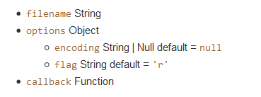

# 第 4 节 Node.js fs 模块

## 实验简介

fs 模块用于对系统文件及目录进行读写操作。

参考链接：http://nodejs.org/api/fs.html

## 一、同步和异步

使用`require('fs')`载入 fs 模块，模块中所有方法都有同步和异步两种形式。

异步方法中回调函数的第一个参数总是留给异常参数（exception），如果方法成功完成，那么这个参数为`null`或者`undefined`。

异步方法实例代码（无需在虚拟机中编写）：

```js
var fs = require('fs'); // 载入 fs 模块

fs.unlink('/tmp/shiyanlou', function(err) {
    if (err) {
        throw err;
    }
    console.log('成功删除了 /tmp/shiyanlou');
}); 
```

同步方法实例代码（无需在虚拟机中编写）：

```js
var fs = require('fs');

fs.unlinkSync('/tmp/shiyanlou'); // Sync 表示是同步方法
console.log('成功删除了 /tmp/shiyanlou'); 
```

同步方法执行完并返回结果后，才能执行后续的代码。而异步方法采用回调函数接收返回结果，可以立即执行后续的代码。

## 二、readFile 读取文件

使用`fs.readFile(filename, [options], callback)`方法读取文件。

readFile 接收三个参数，filename 是文件名；[options]是可选的参数，为一个对象，用于指定文件编码（encoding）及操作方式（flag）；callback 是回调函数。



在虚拟机家目录（/home/shiyanlou）下新建一个文件`text.txt`，文件中的内容如下：

```js
line one
line two 
```

使用 readFile 读取此文件，虚拟机家目录下新建文件`readfile.js`，输入如下代码并保存：

```js
var fs = require('fs'); // 引入 fs 模块

fs.readFile('./test.txt', function(err, data) {
    // 读取文件失败/错误
    if (err) {
        throw err;
    }
    // 读取文件成功
    console.log(data);
}); 
```

readFile 的回调函数接收两个参数，err 是读取文件出错时触发的错误对象，data 是从文件读取的数据。

运行程序：

```js
shiyanlou:~/ $ node readfile.js 
```

会看到输出的内容类似于这样：

```js
<Buffer 6c 69 6e 65 20 6f 6e 65 0a 6c 69 6e 65 20 74 77 6f 0a> 
```

这是原始二进制数据在缓冲区中的内容。要显示文件内容可以使用`toString()`或者设置输出编码，`readFile.js`可以改成这样：

```js
var fs = require('fs'); // 引入 fs 模块

// 使用 toString()
fs.readFile('./test.txt', function(err, data) {
    // 读取文件失败/错误
    if (err) {
        throw err;
    }
    // 读取文件成功
    console.log('toString: ', data.toString());
});

// 设置编码格式
fs.readFile('./test.txt', 'utf-8', function(err, data) {
    // 读取文件失败/错误
    if (err) {
        throw err;
    }
    // 读取文件成功
    console.log('utf-8: ', data.toString());
}); 
```

这样再运行程序就能正常显示出文件中的内容了。

`fs.readFileSync(filename, [options])`是 readFile 的同步方法。

## 三、writeFile 写入文件

使用`fs.writeFile(filename, data, [options], callback)`写入内容到文件。

writeFile 接收四个参数，filename 是文件名称；data 是要写入文件的数据；[options]是一个对象为可选参数，包含编码格式（encoding），模式（mode）以及操作方式（flag）；callback 是回调函数。


在虚拟机家目录下新建`writeFile.js`文件，输入如下代码并保存：

```js
var fs = require('fs'); // 引入 fs 模块

// 写入文件内容（如果文件不存在会创建一个文件）
// 写入时会先清空文件
fs.writeFile('./test2.txt', 'test test', function(err) {
    if (err) {
        throw err;
    }

    console.log('Saved.');

    // 写入成功后读取测试
    fs.readFile('./test2.txt', 'utf-8', function(err, data) {
        if (err) {
            throw err;
        }
        console.log(data);
    });
}); 
```

运行程序：

```js
shiyanlou:~/ $ node writeFile.js 
```

如果要追加数据到文件，可以传递一个`flag`参数，修改代码为如下所示：

```js
var fs = require('fs'); // 引入 fs 模块

// 写入文件内容（如果文件不存在会创建一个文件）
// 传递了追加参数 { 'flag': 'a' }
fs.writeFile('./test2.txt', 'test test', { 'flag': 'a' }, function(err) {
    if (err) {
        throw err;
    }

    console.log('Saved.');

    // 写入成功后读取测试
    fs.readFile('./test2.txt', 'utf-8', function(err, data) {
        if (err) {
            throw err;
        }
        console.log(data);
    });
}); 
```

运行程序：

```js
shiyanlou:~/ $ node writeFile.js 
```

`flag`传递的值，`r`代表读取文件，，`w`代表写入文件，`a`代表追加写入文件，还有其他的值不作详细介绍。

## 四、使用 fs.read 和 fs.write 读写文件

使用`fs.read`和`fs.write`读写文件需要使用`fs.open`打开文件和`fs.close`关闭文件。

### 1、fs.read()

先介绍`fs.open(path, flags, [mode], callback)`方法，此方法用于打开文件，以便 fs.read()读取。path 是文件路径，flags 是打开文件的方式，[mode]是文件的权限（可选参数，默认值是 0666），callback 是回调函数。

`flags`的值：

*   `r` ：读取文件，文件不存在时报错；
*   `r+` ：读取并写入文件，文件不存在时报错；
*   `rs` ：以同步方式读取文件，文件不存在时报错；
*   `rs+` ：以同步方式读取并写入文件，文件不存在时报错；
*   `w` ：写入文件，文件不存在则创建，存在则清空；
*   `wx` ：和`w`一样，但是文件存在时会报错；
*   `w+` ：读取并写入文件，文件不存在则创建，存在则清空；
*   `wx+` ：和`w+`一样，但是文件存在时会报错；
*   `a` ：以追加方式写入文件，文件不存在则创建；
*   `ax` ：和`a`一样，但是文件存在时会报错；
*   `a+` ：读取并追加写入文件，文件不存在则创建；
*   `ax+` ：和`a+`一样，但是文件存在时会报错。

`fs.close(fd, [callback])`用于关闭文件，fd 是所打开文件的文件描述符。

`fs.read(fd, buffer, offset, length, position, callback)`方法接收 6 个参数。

*   `fd`是文件描述符，必须接收`fs.open()`方法中的回调函数返回的第二个参数；
*   `buffer`是存放读取到的数据的 Buffer 对象；
*   `offset`指定向 buffer 中存放数据的起始位置；
*   `length`指定读取文件中数据的字节数；
*   `position`指定在文件中读取文件内容的起始位置；
*   `callback`是回调函数，回调函数的参数：
    *   `err`用于抛出异常；
    *   `bytesRead`是从文件中读取内容的实际字节数；
    *   `buffer`是被读取的缓存区对象。

在家目录中新建文件`testread.txt`在文件中随意输入一些内容，然后新建`read.js`文件，输入如下代码并保存：

```js
var fs = require('fs'); // 引入 fs 模块

// 打开文件
fs.open('./testread.txt', 'r', function(err, fd) {
    if (err) {
        throw err;
    }
    console.log('open file success.');
    var buffer = new Buffer(255);
    // 读取文件
    fs.read(fd, buffer, 0, 10, 0, function(err, bytesRead, buffer) {
        if (err) {
            throw err;
        }
        // 打印出 buffer 中存入的数据
        console.log(bytesRead, buffer.slice(0, bytesRead).toString());

        // 关闭文件
        fs.close(fd);
    });
}); 
```

运行程序：

```js
shiyanlou:~/ $ node read.js 
```

### 2、fs.write()

`fs.write(fd, buffer, offset, length, position, callback)`方法的参数和 fs.read()相同，buffer 是需要写入文件的内容。

在家目录中新建文件`testwrite.txt`，然后新建`write.js`文件，输入如下代码并保存：

```js
var fs = require('fs'); // 引入 fs 模块

// 打开文件
fs.open('./testwrite.txt', `w`, function(err, fd) {
    if (err) {
        throw err;
    }
    console.log('open file success.');
    var buffer = new Buffer('shiyanlou');
    // 读取文件
    fs.write(fd, buffer, 0, 6, 0, function(err, written, buffer) {
        if (err) {
            throw err;
        }

        console.log('write success.');

        // 打印出 buffer 中存入的数据
        var byteLength = buffer.byteLength;
        console.log(byteLength, buffer.slice(0, byteLength).toString());

        // 关闭文件
        fs.close(fd);
    });
}); 
```

运行程序：

```js
shiyanlou:~/ $ node write.js 
```

## 五、目录操作

### 1、创建目录

使用`fs.mkdir(path, [mode], callback)`创建目录，path 是需要创建的目录，[mode]是目录的权限（默认值是 0777），callback 是回调函数。

在家目录下创建`mkdir.js`文件，输入如下代码并保存：

```js
var fs = require('fs'); // 引入 fs 模块

// 创建 newdir 目录
fs.mkdir('./newdir', function(err) {
    if (err) {
        throw err;
    }
    console.log('make dir success.');
}); 
```

运行代码：

```js
shiyanlou:~/ $ node mkdir.js 
```

运行程序后会发现在当前目录下已经创建了 newdir 目录，删除目录可以使用`fs.rmdir(path, callback)`，但是只能删除空目录。

### 2、读取目录

使用`fs.readdir(path, callback)`读取文件目录。

在家目录下新建`readdir.js`文件，输入如下代码并保存：

```js
var fs = require('fs'); // 引入 fs 模块

fs.readdir('./newdir', function(err, files) {
    if (err) {
        throw err;
    }
    // files 是一个数组
    // 每个元素是此目录下的文件或文件夹的名称
    console.log(files);
}); 
```

运行代码：

```js
shiyanlou:~/ $ node readdir.js 
```

## 六、结束

`fs`模块中还有很多其他方法，其使用与前面介绍的方法类似，在此不一一介绍，可自行查阅官方 API 文档。