# 第 1 节 用 node.js 打造一个简单的博客

## 一、实验说明

### 1\. 环境登录

无需密码自动登录，系统用户名 shiyanlou

### 2\. 环境介绍

本实验环境采用带桌面的 Ubuntu Linux 环境，实验中会用到桌面上的程序：

1.  LX 终端（LXTerminal）: Linux 命令行终端，打开后会进入 Bash 环境，可以使用 Linux 命令

2.  Firefox：浏览器，可以用在需要前端界面的课程里，只需要打开环境里写的 HTML/JS 页面即可

3.  GVim：非常好用的编辑器，最简单的用法可以参考课程 [Vim 编辑器](http://www.shiyanlou.com/courses/2)

### 3\. 环境使用

使用 GVim 编辑器输入实验所需的代码及文件，使用 LX 终端（LXTerminal）运行所需命令进行操作。

实验报告页面可以在“我的主页”中查看，其中含有每次实验的截图及笔记，以及每次实验的有效学习时间（指的是在实验桌面内操作的时间，如果没有操作，系统会记录为发呆时间）。这些都是您学习的真实性证明。

本课程中的所有源码可以通过以下方式下载：

```js
http://labfile.oss.aliyuncs.com/kfcdnblog.zip 
```

### 4\. 项目简介

本实验项目会使用到 Express 来完成一个简单的博客（Blog）。Express 是一个简洁而灵活的 node.js Web 应用框架，它提供一系列强大特性帮助我们创建各种 Web 应用。

通过 npm 来创建项目，在命令行中输入：

```js
$ sudo npm install -g express-generator 
```

实验楼现在把 npm 源换成淘宝的了，所以不用担心速度问题

## 二、准备工作

### 1\. 启动

下述 npm/express 操作命令用来创建项目及初始化代码目录 `/home/shiyanlou/blog` ：

```js
 $ express -e ejs blog
    $ cd blog && sudo npm install 
```

安装完成后，输入： `npm start`

打开浏览器，在地址栏中输入：http://localhost:3000/，会出现下图所示的界面。

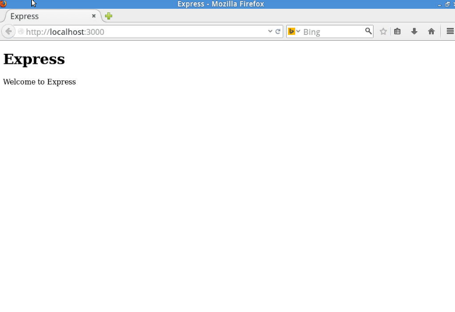

### 2\. 目录结构

安装好后，我们来看一下 Express 的目录结构：

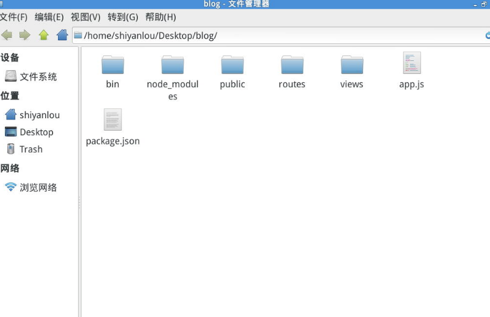

*   app.js：程序启动文件
*   bin：真实的执行程序
*   node_module：存放项目所需要的模块
*   package.json：项目依赖配置及开发者信息，运行`npm install`

可将所需要的包安装到 node_module 目录下：

1.  public：存放静态文件
2.  routes：路由文件
3.  views：页面文件

### 3\. 路由控制

routes(app) 应该是实现路由控制最简单的方式了。下面，我们对 app.js 和路由文件稍作修改。

把它修改成这样：

```js
var express = require('express');
var path = require('path');
var favicon = require('serve-favicon');
var logger = require('morgan');
var cookieParser = require('cookie-parser');
var bodyParser = require('body-parser');
var routes = require('./routes/index');
var app = express();
app.set('port', process.env.PORT || 3000);
app.set('views', path.join(__dirname, 'views'));
app.set('view engine', 'ejs');
//app.use(favicon(__dirname + '/public/favicon.ico'));
app.use(logger('dev'));
app.use(bodyParser.json());
app.use(bodyParser.urlencoded({ extended: true }));
app.use(cookieParser());
app.use(express.static(path.join(__dirname, 'public')));
routes(app);
app.listen(app.get('port'), function() {
console.log('Express server listening on port ' + app.get('port'));
}); 
```

在将 routes 目录下的 index.js 修改成这样:

```js
module.exports = function(app) {
      app.get('/', function (req, res) {
        res.render('index', { title: 'Express' });
      });
    }; 
```

### 4\. 安装所需要的包

在 package.json 下的 dependencies 中添加：

```js
"mongodb":"*",
"express-session": "1.9.1",
"connect-mongo":"0.4.1",
"connect-flash": "0.1.1" 
```

由于实验楼环境无法连网，所以下述 npm 安装的内容都已经在环境中配置好了。如需自己安装，在命令行中输入 `npm install` 完成安装。

### 5\. 了解模板引擎 ejs

ejs 是一种简单的，与 Express 集成良好的模板引擎。是一个将页面模板及数据结合在一起并在服务器解析为 HTML 的工具。在实验中，我们将使用 ejs 来做模板引擎。

我们只要掌握三种标签即可掌握 ejs：

`<% code %>`：用于执行其中 JavaScript 代码 `<%= code %>`会对 code 进行 html 转义，原样显示 `<%- code %>`将不会进行转义

举个例子：`<%=<h1>test</h1>%>`

会显示为 `<h1>test</h1>`

而`<%- test%>` 会把 `test` 放大。

### 6\. 功能分析及路由规划

在动手之前，让我们来分析一下博客的功能。一个多用户博客最重要的功能是信息的发布，所以它需要与数据库进行连接。此外它还需要注册和登录的功能。到这里，一个简单的功能设计就完成了。 根据功能设计，博客的路由应当是这样的：

```js
 / ：首页
    /login ：用户登录
    /reg ：用户注册
    /post ：发表文章
    /logout ：登出 
```

打开路由文件，将其修改成这样：

```js
 module.exports = function(app) {
   app.get('/', function (req, res) {
     res.render('index', { title: '主页' });
     });
   app.get('/reg', function (req, res) {
     res.render('reg', { title: '注册' });
     });
   app.post('/reg', function (req, res) {
     });
   app.get('/login', function (req, res) {
     res.render('login', { title: '登录' });
     });
   app.post('/login', function (req, res) {
     });
   app.get('/post', function (req, res) {
     res.render('post', { title: '发表' });
     });
   app.post('/post', function (req, res) {
     });
   app.get('/logout', function (req, res) {
     });
   }; 
```

### 7\. 连接数据库

在实验中，我们使用 `mongodb` 作为数据库（实验环境中已经安装好 mongodb），并用 `mongod --dbpath ../blog` 来创建名为 blog 的数据库。好了，下一步的实验就是连接数据库了。

在这里，我们用三个包来连接到数据库，它们是 `mongodb`、`express-session` 和 `connect-mongo`。 在 blog 目录下，建立 `settings.js` 文件，来保存博客的配置信息。

代码如下：

```js
 module.exports = { 
      cookieSecret: 'myblog', 
      db: 'blog', 
      host: 'localhost',
      port: 27017
    }; 
```

其中，db 是数据库名，host 及 port 是主机及端口号。 接下来，在 blog 根目录下建立 models 文件夹，并在其中建立 db.js 文件。代码如下：

```js
 var settings = require('../settings'),
            Db = require('mongodb').Db,
            Connection = require('mongodb').Connection,
            Server = require('mongodb').Server;
        module.exports = new Db(settings.db, new Server(settings.host, settings.port),
     {safe: true}); 
```

打开`app.js`，在`var routes = require('./routes/index');` 下添加：

```js
var settings = require('./settings'); 
```

这样 `settings` 文件就被引入了。

在刚才加入的代码下添加来引入 `express-session` 和 `connect-mongo`：

```js
var session = require('express-session');
var MongoStore = require('connect-mongo')(session); 
```

这两个模块可以将 cookie 信息保存到 mongodb 中。

`app.use(cookieParser());` 添加如下代码：

```js
 app.use(session({
      secret: settings.cookieSecret,
      key: settings.db,
      cookie: {maxAge: 1000 * 60 * 60 * 24 * 30},
      store: new MongoStore({
        db: settings.db,
        host: settings.host,
        port: settings.port
      })
    })); 
```

其中，key 为 cookie 的名字，1000 * 60 * 60 * 24 * 30 将 cookie 的生存周期设置为 30 天，参数 `store` 将 cookie 信息储存到数据中。

好了，到这里，准备工作就完成了。下一步我们要做的便是功能实现了。

## 三、设计页面

修改 `views/index.ejs` 为如下：

```js
 <%- include header %>
    <%- include footer %> 
```

新建`header.ejs`，添加如下代码：

```js
 <!DOCTYPE html>
    <html>
    <head>
    <meta charset="UTF-8" />
        <title>blog</title>
    <link rel="stylesheet" href="http://labfile.oss.aliyuncs.com/amazeui/2.2.1/css/amazeui.min.css">
    </head>
    <body>
    <header class="am-topbar am-topbar-fixed-top">
      <div class="am-container">
        <h1 class="am-topbar-brand">
          <a href="#">blog</a>
        </h1>
        <div class="am-collapse am-topbar-collapse" id="collapse-head">
          <ul class="am-nav am-nav-pills am-topbar-nav">
            <li><a href="/">主页</a></li>
            <li><a href="/post">发表</a></li>
            <li><a href="/logout">登出</a></li>
            <li><a href="/login">登录</a></li>
            <li><a href="/reg">注册</a></li>
          </ul>
        </div>
      </div>
    </header>
    <article>
    <br><br><br> 
```

在这里，我们使用了 Amazeui 的 cdn 服务。

新建 `footer.ejs` 文件，添加如下代码：

```js
 </article>
    </body>
    </html> 
```

在命令行中输入：

```js
 npm install -g supervisor
    supervisor app 
```

supervisor 是一个可以自动重启修改后应用的模块，可以省不少力气。

打开 http://localhost:3000/，会有如下界面：

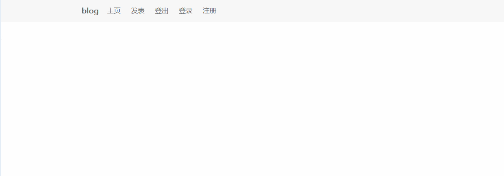

在 views 目录下新建 login.ejs 文件，代码如下：

```js
 <%- include header %>
    <div class="am-g">
      <div class="am-u-lg-6 am-u-sm-centered">
        <form method="post" class="am-form">
          <label for="text">用户名：</label>
          <input type="text" name="name">
          <br>
          <label for="password">密码:</label>
          <input type="password" name="password">
          <br>
          <br />
          <div class="am-cf">
           <input type="submit" value="登录" class="am-btn am-btn-primary am-btn-sm am-fl">        
          </div>
        </form>   
      </div>
    </div>
    <%- include footer %> 
```

其中 `am-g` 和 `am-u-lg-6` 属性引入了网格，`am-u-sm-centered` 可以让内容居中显示。

打开 http://localhost:3000/login 页面如下：

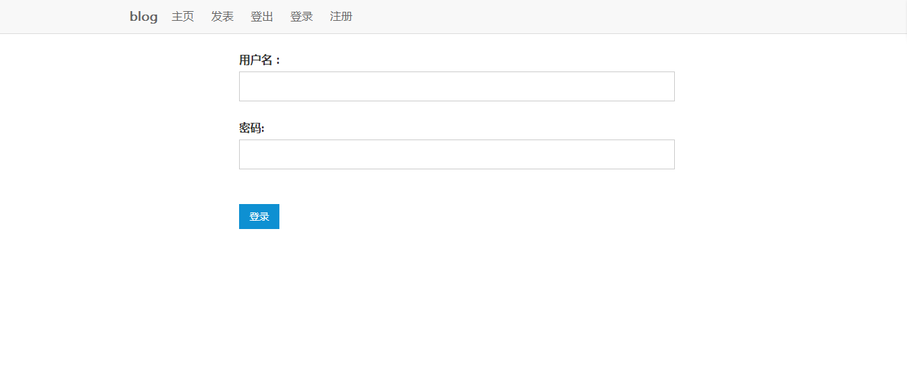

在 views 目录下新建 reg.ejs 文件，代码如下：

```js
 <%- include header %>
    <div class="am-g">
      <div class="am-u-lg-6 am-u-md-8 am-u-sm-centered">
        <form method="post" class="am-form">
          <label for="text">用户名：</label>
           <input type="text" name="name">
          <br>
          <label for="text">邮箱：</label>    
          <input type="email" name="email">
          <br>
          <label for="password">密码:</label>
          <input type="password" name="password">
          <br>
          <label for="password">确认密码：</label>
          <input type="password" name="password-repeat">
          <br>
          <br />
          <div class="am-cf">
            <input type="submit" value="注册" class="am-btn am-btn-primary am-btn-sm am-fl">
          </div>
        </form> 
      </div>
    </div>
    <%- include footer %> 
```

页面如下：

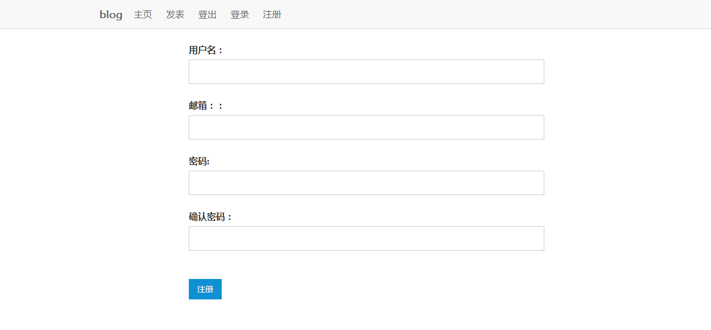

在 views 目录下新建 post.ejs，代码如下:

```js
 <%- include header %>
    <div class="am-g">
      <div class="am-u-lg-8 am-u-sm-centered">
       <form method="post" class="am-form">
        标题:<br/>
        <input type="text" name="title"><br/>
        正文:<br/>
        <textarea name="post" rows="20" cols="90"></textarea><br/>
        <input type="submit" value="发表" class="am-btn am-btn-primary">
        </form>
       </div>
     </div> 
```

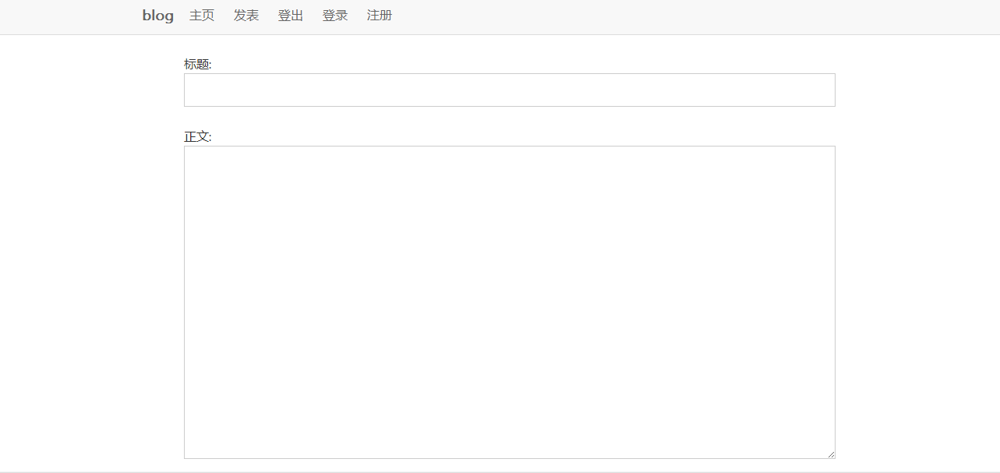

页面设计到这里就完成了。

## 三、页面通知

在这里，我们引入 flash（connect-flash）模块，flash 是一个可以储存特定信息，显示完成后会被清除的模块。

在 `app.js` 文件中的 `var settings = require('./settings');` 后添加：

```js
 var flash = require('connect-flash'); 
```

在 `app.set('view engine', 'ejs');` 后添加：

```js
 app.use(flash()); 
```

这样，flash 模块也引入完毕。

## 四、注册响应

下面，我们来实现注册时的 post 请求。在 models 目录下新建 `user.js`：

```js
 var mongodb = require('./db');
    function User(user) {
      this.name = user.name;
      this.password = user.password;
      this.email = user.email;
    };
    module.exports = User;
    User.prototype.save = function(callback) {
      var user = {
          name: this.name,
          password: this.password,
          email: this.email
      };
      mongodb.open(function (err, db) {
        if (err) {
          return callback(err);
        }
        db.collection('users', function (err, collection) {
          if (err) {
            mongodb.close();
            return callback(err);
          }
          collection.insert(user, {
            safe: true
          }, function (err, user) {
            mongodb.close();
            if (err) {
              return callback(err);
            }
            callback(null, user[0]);
          });
        });
      });
    };
    User.get = function(name, callback) {
      mongodb.open(function (err, db) {
        if (err) {
          return callback(err);
        }
        db.collection('users', function (err, collection) {
          if (err) {
            mongodb.close();
            return callback(err);
          }
          collection.findOne({
            name: name
          }, function (err, user) {
            mongodb.close();
            if (err) {
              return callback(err);
            }
            callback(null, user);
          });
        });
      });
    }; 
```

由于 `node.js` 的自身机制，每做一件事，都要有一个返回值，在这里，我们返回错误信息。

`User.prototype.save` 可以储存用户信息，`User.get` 可以读取用户信息。`mongodb.open` 可以打开数据库，`mongodb.close` 可以关闭数据库。

在 `routes/index.js` 的最开始加入如下代码：

```js
 var crypto = require('crypto'),
        User = require('../models/user.js'); 
```

在这里引入了 user 和 crypto 模块，crypto 是一个可以生成散列值加密密码的模块。

将 `index.js` 中的 `app.post('/reg')` 修改为这样：

```js
 app.post('/reg', function (req, res) {
      var name = req.body.name,
          password = req.body.password,
          password_re = req.body['password-repeat'];
      if (password_re != password) {
        req.flash('error', '两次输入的密码不一致!'); 
        return res.redirect('/reg');
      }
      var md5 = crypto.createHash('md5'),
          password = md5.update(req.body.password).digest('hex');
      var newUser = new User({
          name: name,
          password: password,
          email: req.body.email
      });
      User.get(newUser.name, function (err, user) {
        if (err) {
          req.flash('error', err);
          return res.redirect('/');
        }
        if (user) {
          req.flash('error', '用户已存在!');
          return res.redirect('/reg');
        }
        newUser.save(function (err, user) {
          if (err) {
            req.flash('error', err);
            return res.redirect('/reg');
          }
          req.session.user = user;
          req.flash('success', '注册成功!');
          res.redirect('/');
        });
      });
    }); 
```

其中，`password_re` 可以检测两次密码是否相同，`User.get`可以读取用户信息，`newUser.save`可以新增用户。

现在，我们注册试试：

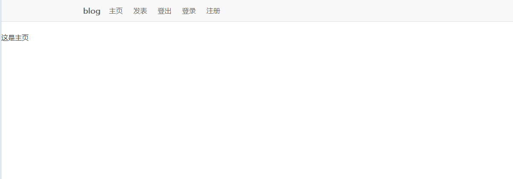

这样就注册成功了，如果注册的用户名已存在，会自动返回注册页。

接下来，我们要添加页面通知。将 `header.ejs` 的导航栏修改成这样：

```js
 <header class="am-topbar am-topbar-fixed-top">
      <div class="am-container">
        <h1 class="am-topbar-brand">
          <a href="#">blog</a>
        </h1>
        <div class="am-collapse am-topbar-collapse" id="collapse-head">
          <ul class="am-nav am-nav-pills am-topbar-nav">
           <li><a href="/">主页</a></li>
    <% if (user) { %>
      <li><a href="/post">发表</a></li>
      <li><a href="/logout">登出</a></li>
    <% } else { %>
      <li><a title="登录" href="/login">登录</a></li>
      <li><a title="注册" href="/reg">注册</a></li>
    <% } %>
          </ul>
        </div>
      </div>
    </header> 
```

在 `<article>` 后的 `<br>` 标签下添加：

```js
 <% if (success) { %>
      <div><%= success %></div>
    <% } %>
    <% if (error) { %>
      <div><%= error %> </div>
    <% } %> 
```

打开 `index.js` ，将 `app.get('/')` 修改成这样：

```js
 app.get('/', function (req, res) {
      res.render('index', {
        title: '主页',
        user: req.session.user,
        success: req.flash('success').toString(),
        error: req.flash('error').toString()
      });
    }); 
```

将 `app.get('reg')` 修改成这样：

```js
 app.get('/reg', function (req, res) {
      res.render('reg', {
        title: '注册',
        user: req.session.user,
        success: req.flash('success').toString(),
        error: req.flash('error').toString()
      });
    }); 
```

注册成功后的页面是这样：

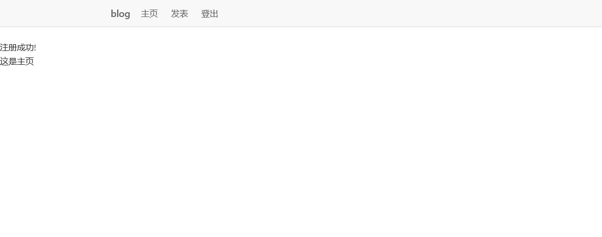

## 五、登录及登出响应

打开 `index.js`，将 `app.post('/login')` 修改成这样（和上一步相似）

```js
 app.post('/login', function (req, res) {
      var md5 = crypto.createHash('md5'),
          password = md5.update(req.body.password).digest('hex');
      User.get(req.body.name, function (err, user) {
        if (!user) {
          req.flash('error', '用户不存在!'); 
          return res.redirect('/login');
        }
        if (user.password != password) {
          req.flash('error', '密码错误!'); 
          return res.redirect('/login');
        }
        req.session.user = user;
        req.flash('success', '登陆成功!');
        res.redirect('/');
      });
    }); 
```

再将 `app.get('/login')` 修改成这样：

```js
 app.get('/login', function (req, res) {
        res.render('login', {
            title: '登录',
            user: req.session.user,
            success: req.flash('success').toString(),
            error: req.flash('error').toString()});
    }); 
```

再将 `app.get('logout')` 修改成这样：

```js
 app.get('/logout', function (req, res) {
      req.session.user = null;
      req.flash('success', '登出成功!');
      res.redirect('/');
    }); 
```

**登出成功：**

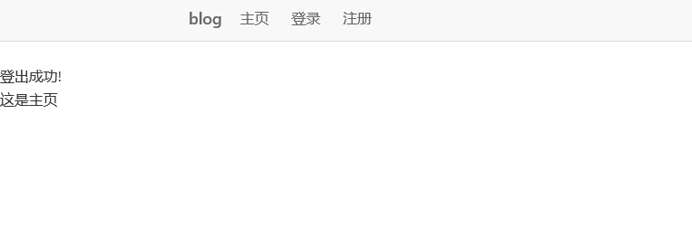

**登陆成功：**

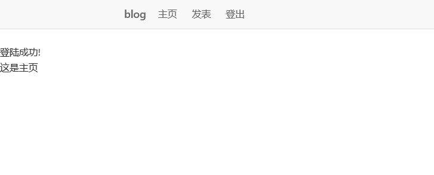

## 六、文章模型及发表文章

在 models 目录下新建 `post.js`，代码如下：

```js
 var mongodb = require('./db');
        function Post(name, title, post) {
          this.name = name;
          this.title = title;
          this.post = post;
        }
        module.exports = Post;
        Post.prototype.save = function(callback) {
          var date = new Date();
          var time = {
              date: date,
              year : date.getFullYear(),
              month : date.getFullYear() + "-" + (date.getMonth() + 1),
              day : date.getFullYear() + "-" + (date.getMonth() + 1) + "-" + date.getDate(),
              minute : date.getFullYear() + "-" + (date.getMonth() + 1) + "-" + date.getDate() + " " + 
              date.getHours() + ":" + (date.getMinutes() < 10 ? '0' + date.getMinutes() : date.getMinutes()) 
          }
          var post = {
              name: this.name,
              time: time,
              title: this.title,
              post: this.post
          };
          mongodb.open(function (err, db) {
            if (err) {
              return callback(err);
            }
            db.collection('posts', function (err, collection) {
              if (err) {
                mongodb.close();
                return callback(err);
              }
              collection.insert(post, {
                safe: true
              }, function (err) {
                mongodb.close();
                if (err) {
                  return callback(err);
                }
                callback(null);
              });
            });
          });
        };
        Post.get = function(name, callback) {
          mongodb.open(function (err, db) {
            if (err) {
              return callback(err);
            }
            db.collection('posts', function(err, collection) {
              if (err) {
                mongodb.close();
                return callback(err);
              }
              var query = {};
              if (name) {
                query.name = name;
              }
              collection.find(query).sort({
                time: -1
              }).toArray(function (err, docs) {
                mongodb.close();
                if (err) {
                  return callback(err);
                }
                callback(null, docs);
              });
            });
          });
        }; 
```

在 `User = require('../models/user.js')`，后添加 `Post = require('../models/post.js');` 将模型引入。

检查登陆

```js
function checkLogin(req, res, next) {
    if (!req.session.user) {
      req.flash('error', '未登录~~~'); 
      res.redirect('/login');
    }
    next();
  } 
```

将 `app.get('post')` 修改成这样：

```js
 app.get('/post', function (req, res) {
        res.render('post', {
          title: '发表',
          user: req.session.user,
          success: req.flash('success').toString(),
          error: req.flash('error').toString()
        });
      }); 
```

将 `app.post('post')` 修改成这样：

```js
 app.post('/post', checkLogin);
    app.post('/post', function (req, res) {
      var currentUser = req.session.user,
          post = new Post(currentUser.name, req.body.title, req.body.post);
      post.save(function (err) {
        if (err) {
          req.flash('error', err); 
          return res.redirect('/');
        }
        req.flash('success', '发布成功!');
        res.redirect('/');
      });
    }); 
```

修改 `index.ejs`，让它在面板中显示文章：

```js
 <%- include header %>
    <div class="am-g">
        <div class="am-u-lg-8 am-u-sm-centered">
    <% posts.forEach(function (post, index) { %>
        <div class="am-panel am-panel-default">
            <div class="am-panel-hd">
            <p>
            <a href="#">
            <%=post.title %>
            </a> | 作者：
            <a href="#">
            <%=post.name %>
            </a> | 日期：
            <%=post.time.minute %>
            </p>
            </div>
            <div class="am-panel-bd">
            <p>
            <%- post.post %>
            </p>
            </div>
        </div>
        <% }) %>
        </div>
    </div>
    <%- include footer %> 
```

将 `app.get('/')` 修改成这样：

```js
 app.get('/', function (req, res) {
      Post.get(null, function (err, posts) {
        if (err) {
          posts = [];
        } 
        res.render('index', {
          title: '主页',
          user: req.session.user,
          posts: posts,
          success: req.flash('success').toString(),
          error: req.flash('error').toString()
        });
      });
    }); 
```

**发表文章测试：**

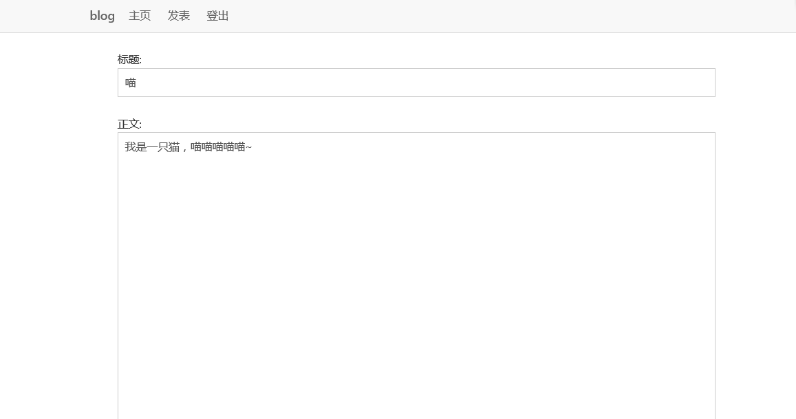

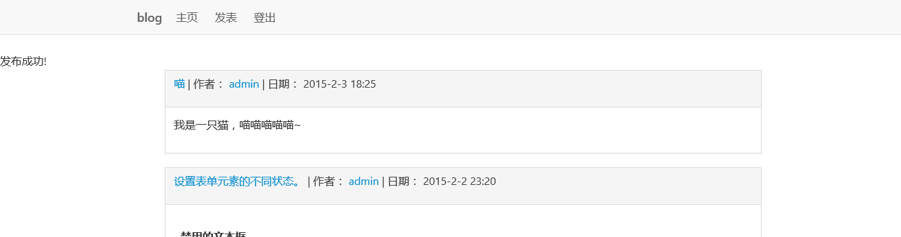

到这里，一个简单的博客就搭建完成了。

## 七、作业思考

整个项目比较复杂，工作量比较大，希望大家多多消化理解，有什么问题欢迎到实验楼 [【问答】](https://www.shiyanlou.com/questions) 中提出。