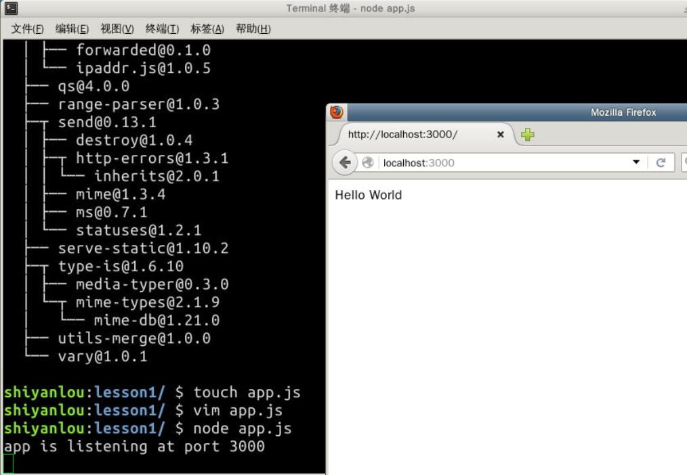

# 第 1 节 《一个最简单的 express 应用》

## 课程说明

本课程来自 alsotang 制作的教程《Node.js 包教不包会》，感谢作者授权实验楼基于该教程制作实验课程，作者主页及课程项目地址如下：

*   作者主页：[`zhuanlan.zhihu.com/alsotang`](http://zhuanlan.zhihu.com/alsotang)
*   课程代码：[`github.com/alsotang/node-lessons`](https://github.com/alsotang/node-lessons)

特别推荐 [CNode 社区](https://cnodejs.org) - Node.js 专业中文社区。

## 目标

建立一个 lesson1 项目，在其中编写代码。当在浏览器中访问 `http://localhost:3000/` 时，输出 `Hello World`。

## 挑战

访问 `http://localhost:3000/` 时，输出 `Hello World`。

## 知识点

1.  包管理器 npm 。使用 npm 安装包，并自动安装所需依赖。
2.  框架 express 。学习新建 express 实例，并定义 routes ，产生输出。

## 课程内容

按照惯例，我们来个 hello world 入门。

### 包管理器 npm

npm 可以自动管理包的依赖. 只需要安装你想要的包, 不必考虑这个包的依赖包.

在 PHP 中, 包管理使用的 `Composer`, python 中，包管理使用 `easy_install` 或者 `pip`，ruby 中我们使用 `gem`。而在 Node.js 中，对应就是 `npm`，npm 是 `Node.js Package Manager` 的意思。

### 框架 Express

express 是 Node.js 应用最广泛的 web 框架，现在是 4.x 版本，它非常薄。跟 Rails 比起来，完全两个极端。

express 的官网是 http://expressjs.com/ ，我常常上去看它的 API。

首先我们需要得到一个 express。

不同于 ruby 的 gem 装在全局，Node.js 的依赖是以项目为单位管理的，直接就安装在项目的 `node_modules` 目录下，而且每个依赖都可以有指定版本的其他依赖，这些依赖像一棵树一样。根据我自己的使用经验来说，npm 的体验在 pip 和 gem 之上。

OK，新建一个文件夹叫 lesson1 的，进去里面安装 express

```js
$ mkdir lesson1 && cd lesson1
$ npm install express 
```

安装完成后，我们的 lesson1 目录下应该会出现一个 `node_modules` 文件夹，`ls` 看看

```js
$ ls node_modules 
```

里面如果出现 express 文件夹则说明安装成功。

或者 npm 命令提供更清晰直观的显示:

```js
$ npm list 
```

我们继续应用程序的编写。

新建一个 app.js 文件

```js
$ touch app.js 
```

copy 进去这些代码，注意实验楼的剪贴板不支持中文，拷贝时候去掉注释：

```js
// 这句的意思就是引入 `express` 模块，并将它赋予 `express` 这个变量等待使用。
var express = require('express');
// 调用 express 实例，它是一个函数，不带参数调用时，会返回一个 express 实例，将这个变量赋予 app 变量。
var app = express();

// app 本身有很多方法，其中包括最常用的 get、post、put/patch、delete，在这里我们调用其中的 get 方法，为我们的 `/` 路径指定一个 handler 函数。
// 这个 handler 函数会接收 req 和 res 两个对象，他们分别是请求的 request 和 response。
// request 中包含了浏览器传来的各种信息，比如 query 啊，body 啊，headers 啊之类的，都可以通过 req 对象访问到。
// res 对象，我们一般不从里面取信息，而是通过它来定制我们向浏览器输出的信息，比如 header 信息，比如想要向浏览器输出的内容。这里我们调用了它的 #send 方法，向浏览器输出一个字符串。
app.get('/', function (req, res) {
  res.send('Hello World');
});

// 定义好我们 app 的行为之后，让它监听本地的 3000 端口。这里的第二个函数是个回调函数，会在 listen 动作成功后执行，我们这里执行了一个命令行输出操作，告诉我们监听动作已完成。
app.listen(3000, function () {
  console.log('app is listening at port 3000');
}); 
```

执行

`$ node app.js`

这时候我们的 app 就跑起来了，终端中会输出 `app is listening at port 3000`。这时我们打开浏览器，访问 `http://localhost:3000/`，会出现 `Hello World`。如果没有出现的话，肯定是上述哪一步弄错了，自己调试一下。



## 补充知识

在这个例子中，node 代码监听了 3000 端口，用户通过访问`http://localhost:3000/` 得到了内容，为什么呢？

### 端口

端口的作用：`通过端口来区分出同一电脑内不同应用或者进程，从而实现一条物理网线(通过分组交换技术-比如 internet)同时链接多个程序` [Port*(computer*networking)](http://en.wikipedia.org/wiki/Port_(computer_networking))

端口号是一个 16 位的 uint, 所以其范围为 1 to 65535 (对 TCP 来说, port 0 被保留，不能被使用. 对于 UDP 来说, source 端的端口号是可选的， 为 0 时表示无端口).

`app.listen(3000)`，进程就被打标，电脑接收到的 3000 端口的网络消息就会被发送给我们启动的这个进程

### URL

[RFC1738](http://www.ietf.org/rfc/rfc1738.txt) 定义的 url 格式笼统版本`<scheme>:<scheme-specific-part>`， scheme 有我们很熟悉的`http`、`https`、`ftp`，以及著名的`ed2k`，`thunder`。

通常我们熟悉的 url 定义成这个样子

```js
<scheme>://<user>:<password>@<host>:<port>/<url-path> 
```

用过 ftp 的估计能体会这么长的，网页上很少带 auth 信息，所以就精简成这样:

```js
<scheme>://<host>:<port>/<url-path> 
```

在上面的例子中, scheme=http, host=localhost, port=3000, url-path=/, 再联想对照一下浏览器端`window.location`对象。 著名的`localhost`，你可以在电脑的 hosts 文件上找到

[在这篇文章中提到](http://en.wikipedia.org/wiki/URI_scheme)： `URI schemes are frequently and incorrectly referred to as "protocols", or specifically as URI protocols or URL protocols, since most were originally designed to be used with a particular protocol, and often have the same name`，比较认同这个观点，尤其是今天移动设备的时代里， android 和 ios 的开发中大量使用 uri 作为跨 app 通讯通道，把 scheme 理解为协议略狭隘了。

### 尾声

在了解完端口和 url 之后，再去看例子代码，相信应该好理解很多。 有必要的话，还可以在解刨一下 express 的 use 逻辑，对峙`http.createServer`，相信还有火花，:)

特别推荐 [CNode 社区](https://cnodejs.org) - Node.js 专业中文社区。