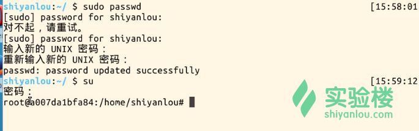
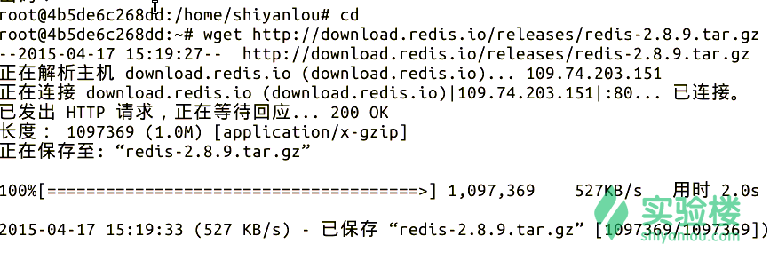
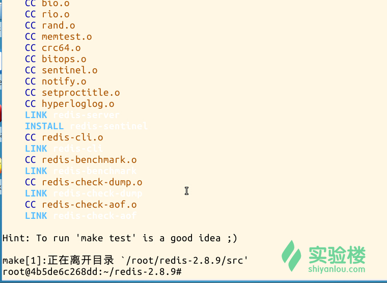
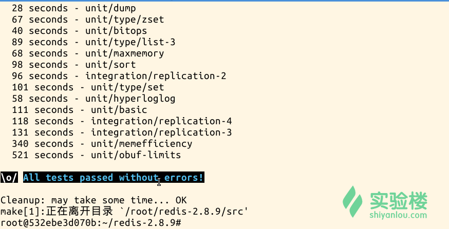
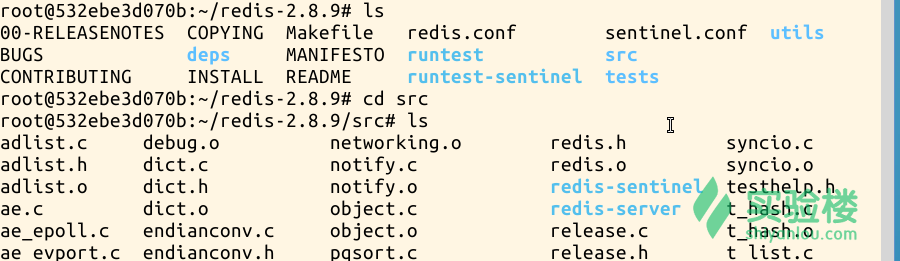
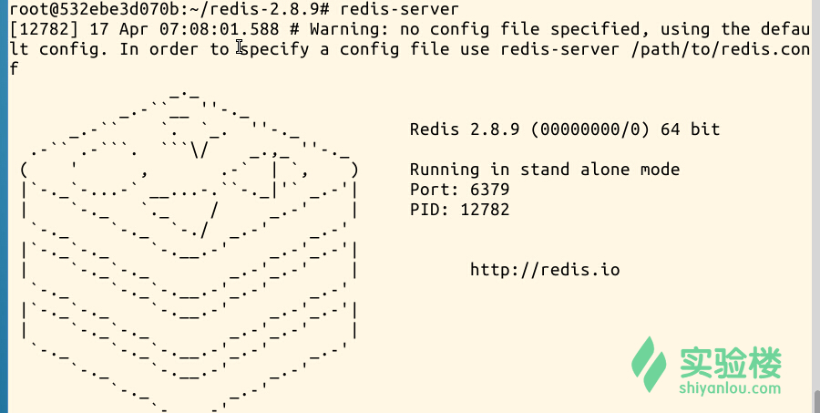
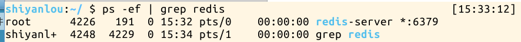
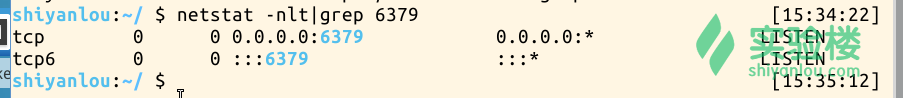
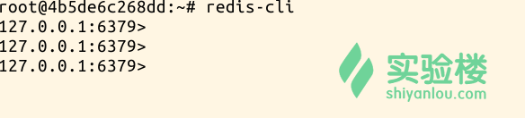

# 第 1 节 Redis 简介与安装

## 实验简介

本节实验是对 Redis 的简介，并介绍 Redis 的安装和启动。

## 1\. Redis 简介

### 1.1 Redis 是什么

REmote DIctionary Server(Redis) 是一个由 Salvatore Sanfilippo 写的 key-value 存储系统。Redis 提供了一些丰富的数据结构，包括 lists, sets, ordered sets 以及 hashes ，当然还有和 Memcached 一样的 strings 结构.Redis 当然还包括了对这些数据结构的丰富操作。

Redis 常被称作是一款数据结构服务器（data structure server）。Redis 的键值可以包括字符串（strings）类型，同时它还包括哈希（hashes）、列表（lists）、集合（sets）和 有序集合（sorted sets）等数据类型。 对于这些数据类型，你可以执行原子操作。例如：对字符串进行附加操作（append）；递增哈希中的值；向列表中增加元素；计算集合的交集、并集与差集等。

### 1.2 Redis 的优点

性能极高 – Redis 能支持超过 100K+ 每秒的读写频率。

丰富的数据类型 – Redis 支持二进制案例的 Strings, Lists, Hashes, Sets 及 Ordered Sets 数据类型操作。

原子 – Redis 的所有操作都是原子性的，同时 Redis 还支持对几个操作全并后的原子性执行。

丰富的特性 – Redis 还支持 publish/subscribe, 通知, key 过期等等特性。

## 2 Redis 安装

### 2.0 前期准备

设置 root 密码

```
 $ sudo passwd (输入 shiyanlou 用户密码，并设置 root 密码)
  $ su (输入 root 密码，进入 root 权限) 
```

操作截图：



### 2.1 系统环境和版本说明

Redis 的版本选取目前的稳定版本 2.8.9。 客户端选用了 Redis 的 Java 版本 jedis 2.4.2。

### 2.2 Redis 的安装步骤

#### a. 进入 root 目录，并下载 Redis 的安装包

```
$ cd

$ wget http://labfile.oss.aliyuncs.com/files0422/redis-2.8.9.tar.gz 
```

操作截图：



#### b. 在目录下，解压按照包，生成新的目录 redis-2.8.9

```
$ tar xvfz redis-2.8.9.tar.gz 
```

#### c. 进入解压之后的目录,进行编译

```
$ cd redis-2.8.9
$ make
$ make install 
```

说明： 如果没有明显的错误，则表示编译成功

操作截图：



#### e. 在安装成功之后，可以运行测试，确认 Redis 的功能是否正常

```
$ make test 
```

操作截图：



## 3 Redis 启动

### 3.1 查看重要文件

在 Redis 安装完成后，注意一些重要的文件，可用 **ls** 命令查看。服务端：src/redis-server，客户端：src/redis-cls，默认配置文件：redis.conf

```
$ ls
$ cd src
$ ls 
```

操作截图：




### 3.2 然后将可执行文件放置在$PATH 环境目录下，便于以后执行程序时可以不用输入完整的路径，

```
$　cp redis-server /usr/local/bin/
$　cp redis-cli /usr/local/bin/ 
```

### 3.3 启动 Redis-server

```
$ redis-server 
```

操作截图：



说明： 从以上的截图中，可以发现启动的端口为缺省的 6379\. 用户可以在启动的时候，指定具体的配置文件，并在其中指定启动的端口。

保持此终端的运行，Ctrl+shift+t 重开一个终端 tab。

### 3.4 查看 Redis

```
$ ps -ef | grep redis 
```

操作截图：



```
# 通过启动命令检查 Redis 服务器状态
$ netstat -nlt|grep 6379 
```

操作截图：



### 3.5 启动 Redis-client

```
$ su    ( 输入 root 密码，进入 root 目录)

$ cd

$ redis-cli 
```

操作截图：



至此，redis 安装完成。

### 参考文档

http://www.linuxidc.com/Linux/2014-05/101544p2.htm