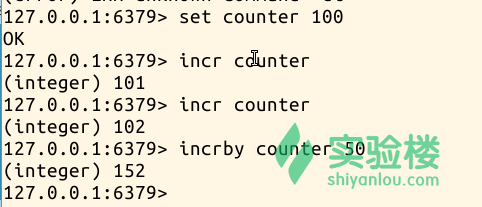

# 第 2 节 Redis 数据类型

## 实验简介

Redis 不仅仅是简单的 key-value 存储器，同时也是一种 data structures server。传统的 key-value 是指支持使用一个 key 字符串来索引 value 字符串的存储，而 Redis 中，value 不仅仅支持字符串，还支持更多的复杂结构，包括列表，集合，哈希表等。现在我们一一讲解：Redis keys 是采用二进制安全，这就意味着你可以使用任何二进制序列作为重点，从像"foo"可以联系一个 JPEG 文件。空字符串也是一个有效的密钥。

## 一、Redis strings

字符串是一种最基本的 Redis 值类型。Redis 字符串是二进制安全的，这意味着一个 Redis 字符串能包含任意类型的数据，例如： 一张 JPEG 格式的图片或者一个序列化的 Ruby 对象。一个字符串类型的值最多能存储 512M 字节的内容。

我们继续上一个实验,启动 redis-cli 来看看 Redis strings 数据类型。

```
$ sudo service redis-server start
$ redis-cli

> set mykey somevalue

> get mykey 
```

操作截图：


如上例所示，可以 SET 和 GET 命令来创建和检索 strings。注意,set 命令将取代现有的任何已经存在的 key。SET 命令还有一个提供附加参数的选项,我们能够让 SET 命令只有在没有相同 key 的情况下成功，反之亦然，可以让 SET 命令在有相同 key 值得情况下成功。

```
> set mykey newval nx

> set mykey newval xx 
```

操作截图;


即使 string 是 Redis 的基本类型，也可以对其进行一些有趣的操作，例如加法器：

```
> set counter 100

> incr counter

> incr counter

> incrby counter 50 
```

操作截图：



INCR 命令让 the value 成为一个整数，运行一次 INCR 便+1。INCRBY 命令便是一个加法运算。类似的命令如减法运算为： DECR and DECRBY。

Redis 可以运用 MSET and MGET 命令完成一次性的完成多个 key-value 的对应关系，使用 MGET 命令，Redis 返回一个 value 数组。

```
> mset a 10 b 20 c 30

> mget a b c 
```

操作截图：


## 二、Redis Lists

Redis 列表是简单的字符串列表，按照插入顺序排序。你可以添加一个元素导列表的头部（左边）或者尾部（右边） LPUSH 命令插入一个新的元素导头部, 而 RPUSH 插入一个新元素导尾部.当一个这两个操作在一个空的 Key 上被执行的时候一个新的列表被创建。相似的，如果一个列表操作清空一个列表那么对应的 key 将被从 key 空间删除。这是非常方便的语义，因为他们被调用使用一个空列表完全就像他们被调用时使用一个不存在的键值（可以）做为参数。

PUSH 一类的命令的返回值为 list 的长度。一些类表操作和结果的例子：

```
> rpush mylist A

> rpush mylist B

> lpush mylist first

> lrange mylist 0 -1 
```

操作截图:


**注意**：LRANGE 利用了两个检索值，0 表示 list 的开头第一个，-1 表示 list 的倒数第一个，即最后一个。-2 则便是 list 的倒数第二个，以此类推。

这些命令都是可变的命令，也就是说你可以一次加入多个元素放入 list。

```
> rpush mylist 1 2 3 4 5 "foo bar"

> lrange mylist 0 -1 
```

操作截图：


在 Redis 的命令操作中，还有一类重要的操作：POP，取出 list 元素。和 PUSH 操作类似，POP 命令可以选择不同的方向取出元素.POP 命令返回值为取出的元素。

```
> del mylist

> rpush mylist a b c

> rpop mylist

> lrange mylist 0 -1

> lpop mylist

 > lrange mylist 0 -1 
```

操作截图：


在 Redis list 中还有很多有用的命令，此处限于篇幅便不在赘述。

## 三、Redis Hashes

Redis Hashes 是字符串字段和字符串值之间的映射,因此他们是展现对象的完美数据类型。 (例如:一个有名，姓，年龄等等属性的用户):一个带有一些字段的 hash 仅仅需要一块很小的空间存储,因此你可以存储数以百万计的对象在一个小的 Redis 实例中。 哈希主要用来表现对象，他们有能力存储很多对象，因此你可以将哈希用于许多其他的任务。

```
> hmset user:1000 username antirez birthyear 1977 verified 1
> hget user:1000 username

> hget user:1000 birthyear

> hgetall user:1000 
```

操作截图：


HMSET 命令设置一个多域的 hash 表，HGET 命令获取指定的单域，HGETALL 命令获取指定 key 的所有信息。HMGET 类似于 HGET，只是返回一个 value 数组。

```
> hmget user:1000 username birthyear no-such-field 
```

操作截图：


同样可以根据需要对 hash 表的表项进行单独的操作，例如 HINCRBY， （原本 birthyear 为 1977，见上一图）

```
> hincrby user:1000 birthyear 10

> hincrby user:1000 birthyear 10 
```

操作截图：


## 四、Redis 无序集合

Redis 集合（Set）是一个无序的字符串集合. 你可以以 O(1)的时间复杂度 (无论集合中有多少元素时间复杂度都是常量)完成添加，删除，以及测试元素是否存在。 Redis 集合拥有令人满意的不允许包含相同成员的属性。多次添加相同的元素，最终在集合里只会有一个元素。 实际上说这些就是意味着在添加元素的时候无须检测元素是否存在。 一个 Redis 集合的非常有趣的事情是他支持一些服务端的命令从现有的集合出发去进行集合运算，因此你可以在非常短的时间内进行合并（unions）, 求交集（intersections）,找出不同的元素（differences of sets）。

```
> sadd myset 1 2 3

> smembers myset 
```

SADD 命令产生一个无序集合，返回集合的元素个数。SMEMBER 用于查看集合。

操作截图：


SISMEMBER 用于查看集合是否存在，匹配项包括集合名和元素个数。匹配成功返回 1，匹配失败返回 0.

```
> sismember myset 3

> sismember myset 30

> sismember mys 3 
```

操作截图：


## 五、Redis 有序集合

Redis 有序集合与普通集合非常相似，是一个没有重复元素的字符串集合。不同之处是有序集合的没有成员都关联了一个评分，这个评分被用来按照从最低分到最高分的方式排序集合中的成员。集合的成员是唯一的，但是评分可以是重复了。 使用有序集合你可以以非常快的速度（O(log(N))）添加，删除和更新元素。因为元素是有序的, 所以你也可以很快的根据评分（score）或者次序（position）来获取一个范围的元素。访问有序集合的中间元素也是非常快的,因此你能够使用有序集合作为一个没有重复成员的智能列表。在有序集合中，你可以很快捷的访问一切你需要的东西：有序的元素，快速的存在性测试，快速访问集合的中间元素！ 简而言之使用有序集合你可以做完成许多对性能有极端要求的任务，而那些任务使用其他类型的数据库真的是很难完成的。

ZADD 与 SADD 类似，但是在元素之前多了一个参数，这个参数便是用于排序的。形成一个有序的集合。

```
> zadd hackers 1940 "Alan Kay"

> zadd hackers 1957 "Sophie Wilson"

> zadd hackers 1953 "Richard Stallman"

> zadd hackers 1949 "Anita Borg"

> zadd hackers 1965 "Yukihiro Matsumoto"

> zadd hackers 1914 "Hedy Lamarr"

> zadd hackers 1916 "Claude Shannon"

> zadd hackers 1969 "Linus Torvalds"

> zadd hackers 1912 "Alan Turing" 
```

查看集合 ZRANGE 是查看正序的集合，ZREVRANGE 是查看反序的集合。0 表示集合第一个元素，-1 表示集合的倒数第一个元素。

```
> zrange hackers 0 -1

> zrevrange hackers 0 -1 
```

操作截图：


使用 WITHSCORES 参数返回记录值。

```
> zrange hackers 0 -1 withscores 
```

操截图：


## 参考文档

http://redis.io/topics/data-types-intro http://www.cnblogs.com/guanjinke/archive/2013/01/21/2870576.html