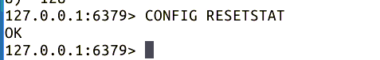

# 第 3 节 Redis 系统管理

## 实验简介

上一节实验讲述了 Redis 的基本数据类型，本实验继续讲解 Redis 相关命令及管理操作。

在 Redis 中，命令大小写不敏感。

## 一、适合全体类型的常用命令

启动 redis 服务和 redis-cli 命令界面继续后续实验：

```
$ sudo service redis-server start
$ redis-cli 
```

### （1）EXISTS and DEL

EXISTS key 判断一个 key 是否存在;存在返回 1;否则返回 0; DEL key 删除某个 key,或是一系列 key;DEL key1 key2 key3 key4。成功返回 1，失败返回 0（key 值不存在）。

```
> set mykey hello

> exists mykey

> del mykey

> exists mykey 
```

操作截图：


### （2）TYPE and KEYS

TYPE key：返回某个 key 元素的数据类型 ( none:不存在,string:字符,list,set,zset,hash)，key 不存在返回空。 KEYS key—pattern ：返回匹配的 key 列表 (KEYS foo*:查找 foo 开头的 keys)

```
> set mykey x

> type mykey

>keys my*

> del mykey

>keys my*

> type mykey 
```

操作截图：


### （3）RANDOMKEY and CLEAR

RANDOMKEY ： 随机获得一个已经存在的 key，如果当前数据库为空，则返回空字符串

```
> randomkey 
```

操作截图：


CLEAR ：清除界面。

```
> clear 
```

### （4）RENAME and RENAMENX

RENAME oldname newname：改 key 的名字，新键如果存在将被覆盖 RENAMENX oldname newname：更改 key 的名字，如果名字存在则更改失败

笔者 randomkey 结果为 mylist，将此 key 值更名为 newlist。

```
> randomkey

> rename mylist newlist

> exists mylist

> exists newlist 
```

操作截图：


### （5） DBSIZE

DBSIZE ：返回当前数据库的 key 的总数

```
> dbsize 
```

操作截图：


## 二、Redis 时间相关命令

### （1）限定 key 生存时间

这同样是一个无视数据类型的命令，对于临时存储很有用处。避免进行大量的 DEL 操作。

EXPIRE：设置某个 key 的过期时间（秒）,(EXPIRE bruce 1000：设置 bruce 这个 key1000 秒后系统自动删除)注意：如果在还没有过期的时候，对值进行了改变，那么那个值会被清除。

```
> set key some-value

> expire key 10

> get key       (马上执行此命令)

> get key       (10s 后执行此命令) 
```

操作截图：


结果显示，执行 EXPIRE 命令后，马上 GET，显示 key 存在。10 秒后再 GET 时，key 已经被自动删除。

### （2）查询 key 剩余生存时间

限时操作可以再 SET 命令中实现，并且可用 TTL 命令查询 key 剩余生存时间。 TTL：查找某个 key 还有多长时间过期,返回时间秒

```
> set key 100 ex 30

> ttl key

> ttl key 
```

操作截图：


### （3）清除 key

FLUSHDB：清空当前数据库中的所有键

FLUSHALL：清空所有数据库中的所有键

```
>flushdb

>flushall 
```

## 三、Redis 设置相关命令

Redis 有其配置文件，可以通过 client-command 窗口查看或者更改相关配置。相关命令介绍如下：

### （1）CONFIG GET and CONFIG SET

CONFIG GET：用来读取运行 Redis 服务器的配置参数。 CONFIG SET：用于更改运行 Redis 服务器的配置参数。 AUTH : 认证密码 下面针对 Redis 密码的示例：

```
> config get requirepass （查看密码）

> config set requirepass test123 （设置密码为 test123 ）

> config get requirepass  （报错，没有认证）

> auth test123

> config get requirepass 
```

操作截图：


由结果可知，刚开始时 Reids 并未设置密码，密码查询结果为空。然后设置密码为 test123，再次查询报错。经过 auth 命令认证后，可正常查询。

可以经过修改 Redis 的配置文件 redis.conf 修改密码。

CONFIG GET 命令是以 list 的 key-value 对显示的，如查询数据类型的最大条目：

```
> config get *max-*-entries* 
```

操作截图：


### （2）重置报告

CONFIG RESETSTAT：重置数据统计报告，通常返回值为'OK"。

```
> CONFIG RESETSTAT 
```

操作截图：



## 四、查询信息

INFO [section] ：查询 Redis 相关信息。 INFO 命令可以查询 Redis 几乎所有的信息，其命令选项有如下：

1.  server: Redis server 的常规信息
2.  clients: Client 的连接选项
3.  memory: 存储占用相关信息
4.  persistence: RDB and AOF 相关信息
5.  stats: 常规统计
6.  replication: Master/slave 请求信息
7.  cpu: CPU 占用信息统计
8.  cluster: Redis 集群信息
9.  keyspace: 数据库信息统计
10.  all: 返回所有信息
11.  default: 返回常规设置信息

若命令参数为空，info 命令返回所有信息。

```
> info keyspace

> info server 
```

操作截图：


## 参考文档

http://redis.io/commands/config-resetstat