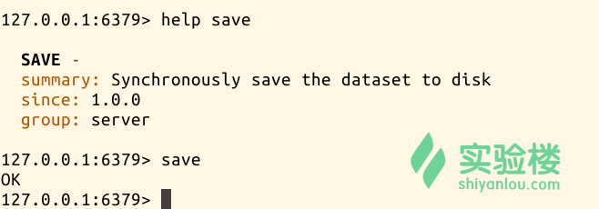

# 第 4 节 Redis 的高级应用

## 实验简介

前面学习了 Redis 的基础知识和基本命令，接下来继续讲解 Redis 的高级应用，包括：安全性设置，主从复制，事务处理， 持久化机制， 虚拟内存的使用。

## 一、安全性

设置在客户端连接是需要指定的密码（由于 redis 速度相当的快，一秒钟可以 150K 次的密码尝试，所以需要设置一个密码强度很大的密码）。

设置密码的方式有两种：

（1） 使用 config set 命令的 requirepass 参数，具体格式为 config set requirepass “password”。 （2） 配置 redis.conf 中设置 requirepass 属性，后面为密码。

输入认证的方式也有两种：

（1） 登录时可以 redis-cli -a password

（2）登录后使用 auth password

### （1）设置密码

第一种密码设置方式在上一个实验中已经提到，（在 CONFIG SET 命令讲解的实例），此处我们来看看第二种方式设置密码。

首先需要进入 Redis 的安装目录，然后修改配置文件 redis.conf。根据 grep 命令的结果，使用 vi 编辑器修改“# requirepass foobared” 为“requirepass test123”，然后保存退出。

```
$ grep -n requirepass /etc/redis/redis.conf
$ sudo vim /etc/redis/redis.conf 
```

编辑 redis.conf 的结果：


### （2）重启 redis-server 与 redis-cli

重启 redis server。

```
$ sudo service redis-server restart 
```

进入到 redis-cli 交互界面进行验证

```
$ redis-cli

> info

> auth test123

> info

> exit 
```

操作截图：


结果表明第一次 info 命令失败，在 auth 认证之后 info 命令正常返回。最后退出 redis-cli。

另外一种密码认证方式：

```
$ redis-cli -a test123

> info 
```

操作截图：


## 二、主从复制

由于环境的原因，在此处笔者大致讲解主从复制的工作流程，不做实验。

Redis 的主从复制配置和使用都比较简单，通过主从复制可以允许多个 slave server 拥有和 master server 相同的数据库副本。

从服务器只能读，不能写。

Redis 主从复制特点：

1、master 可以拥有多个 slave。

2、多个 slave 可以连接同一个 master 外，还可以连接到其他的 slave。（当 master 宕机后，相连的 slave 转变为 master）

3、主从复制不会阻塞 master，再同步数据时，master 可以继续处理 client 请求。

4、提高了系统的可伸缩性。

Redis 主从复制的过程：

1、Slave 与 master 建立连接，发送 sync 同步命令。

2、 Master 会启动一个后台进程，将数据库快照保存到文件中，同时 Master 主进程会开始收集新的写命令并缓存。

3、 后台完成保存后，就将此文件发送给 Slave。

4、 Slave 将此文件保存到磁盘上。

## 三、事务处理

Redis 的事务处理比较简单。只能保证 client 发起的事务中的命令可以连续的执行，而且不会插入其他的 client 命令，当一个 client 在连接中发出 multi 命令时，这个连接就进入一个事务的上下文，该连接后续的命令不会执行，而是存放到一个队列中，当执行 exec 命令时，redis 会顺序的执行队列中的所有命令。如果其中执行出现错误，执行正确的不会回滚，不同于关系型数据库的事务。

```
> multi

> set name a

> set name b

> exec

> get name 
```

操作截图：


## 四、持久化机制

Redis 是一个支持持久化的内存数据库，Redis 需要经常将内存中的数据同步到磁盘来保证持久化。

Redis 支持两种持久化方式：

1、snapshotting（快照），将数据存放到文件里，默认方式。

是将内存中的数据已快照的方式写入到二进制文件中，默认文件 dump.rdb，可以通过配置设置自动做快照持久化的方式。可配置 Redis 在 n 秒内如果超过 m 个 key 被修改就自动保存快照。

save 900 1 #900 秒内如果超过 1 个 key 被修改，则发起快照保存

save 300 10 #300 秒内如果超过 10 个 key 被修改，则快照保存

2、 Append-only file（缩写为 aof），将读写操作存放到文件中。

由于快照方式在一定间隔时间做一次，所以如果 Redis 意外 down 掉的话，就会丢失最后一次快照后的所有修改。

aof 比快照方式有更好的持久化性，是由于使用 aof 时，redis 会将每一个收到的写命令都通过 write 函数写入到文件中当 redis 启动时会通过重新执行文件中保存的写命令来在内存中重新建立整个数据库的内容。

由于 os 会在内核中缓存 write 做的修改，所以可能不是立即写到磁盘上，这样 aof 方式的持久化也还是有可能会丢失一部分数据。可以通过配置文件告诉 redis 我们想要通过 fsync 函数强制 os 写入到磁盘的时机。

配置文件中的可配置参数：

```
appendonly   yes     //启用 aof 持久化方式

#appendfsync  always //收到写命令就立即写入磁盘，最慢，但是保证了数据的完整持久化

appendfsync   everysec  //每秒中写入磁盘一次，在性能和持久化方面做了很好的折中

#appendfsync  no     //完全依赖 os，性能最好，持久化没有保证 
```

在 redis-cli 的命令中，SAVE 命令是将数据写入磁盘中。

```
> help save

>save 
```

操作截图：

> 

## 五、虚拟内存的使用

虚拟内存管理在 2.6 及之上版本取消了，在安装实验中，选择的是 2.8.9 版本的 redis ，所有实验中的配置文件中没有虚拟内存管理功能的配置选项。此处仅为讲解

Redis 的虚拟内存是暂时把不经常访问的数据从内存交换到磁盘中，从而腾出内存空间用于其他的访问数据，尤其对于 redis 这样的内存数据库，内存总是不够用的。除了分隔到多个 redis server 外，提高数据库的容量的方法就是使用虚拟内存，把那些不常访问的数据交换到磁盘上。

通过配置 vm 相关的 redis.config 配置：

```
vm-enable  yes                   #开启 vm 功能

vm-swap-file    /tmp/redis.swap  #交换出来的 value 保存的文件路径

vm-max-memory    10000000        #redis 使用的最大内存上线

 vm-page-size   32       #每个页面的大小 32 字节

vm-pages     123217729    #最多使用多小个页面

vm-max-threads     4        #用于执行 value 对象换入的工作线程数量 
```

## 参考文档

http://m.blog.csdn.net/blog/fengshizty/42936073#