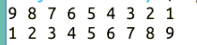

# 第 2 节 Perl 列表与数组

## 一、实验说明

### 1\. 环境登录

无需密码自动登录，系统用户名 shiyanlou

### 2\. 环境介绍

本实验环境采用 Ubuntu Linux 桌面环境，实验中会用到桌面上的程序：

1.  命令行终端: Linux 命令行终端，打开后会进入 Bash 环境，可以使用 Linux 命令
2.  Firefox 及 Opera：浏览器，可以用在需要前端界面的课程里，只需要打开环境里写的 HTML/JS 页面即可
3.  gvim：非常好用的 Vim 编辑器，最简单的用法可以参考课程[Vim 编辑器](http://www.shiyanlou.com/courses/2)
4.  gedit 及 Brackets：如果您对 gvim 的使用不熟悉，可以用这两个作为代码编辑器，其中 Brackets 非常适用于前端代码开发

### 3\. 环境使用

使用编辑器输入实验所需的代码及文件，使用命令行终端运行所需命令进行操作。

“实验记录”页面可以在“我的主页”中查看，每次实验的截图及笔记，以及有效学习时间（指的是在实验桌面内操作的时间，如果没有操作，系统会记录为发呆时间）。这些都是您在实验楼学习的真实性证明。

### 4\. 实验介绍

本节讲解了列表与数组，列表存储于数组变量中，数组变量的名称需要以 `@` 开头，数组有一些常用操作，如 sort 是排序，reverse 是倒序，chop 是去掉数组中每个元素的尾部，join 和 split 是连接和拆分。

## 二、列表

列表是包含在括号里的一序列的值，可以为任何数值，也可为空，注意的是，只含有一个数值的列表与该数值本身是不通的，但他们可以互相转化或赋值。 列表举例：

```pl
(17,$var," a string")
(17,26<<2)
($value,"The answer is $value) 
```

空列表: ()

## 三、数组变量与列表的存储

列表存储于数组变量中，与简单变量不同，数组变量是以 `@` 开头的，如：

```pl
@array = (1,2,3); 
```

注意： （1）数组变量创建时初始值为空列表：（） （2）因为 Perl 中用 `@` 与 `$` 来区分数组和简单变量，所以同一个名字可以同时用于数组变量和简单变量。

例如：

```pl
$var = 1;
@var = (11,27.1,"a string"); 
```

但是这样很容易混淆，所以并不是推荐的做法。

### 1\. 数组的存取

对数组的中的值通过下表存取，第一个元素下标为 0。试图访问不存在的数组元素，则结果为 NULL，但是如果给超过数组大小的元素赋值，则数组会自动增长，原来没有的元素值为 NULL，例如：

```pl
@array = (1,2,3,4);
$scalar = $array[0];      #按索引方式取值
$array[3] = 5;  #给指定的索引位置的元素赋值为 5
$scalar = $array[4];    #超过最大数组索引，所以取值为 NULL
$array[6] = 17; #因为超过了最大数组索引，于是在数组中添加新的值，于是现在的数组为(1,2,3,5,"","",17）,这是与 C 语言的差别 
```

### 2\. 数组间的拷贝

```pl
@destinition = @original;   #将数组 original 的值拷贝到 destinition 数组 
```

### 3\. 数组给列表赋值

```pl
@list = (2,3,4);
@list1 = (1,@list,5);   #list1 为（1,2,3,4,5） 
```

### 4\. 标准输入给变量赋值

```pl
$var = <STDIN>;
@array = <STDIN>;   # Ctr+D 为输入结束 
```

### 5\. 字符串中的方括号和变量替换

"\$var[0]" 为数组@var 的第一个元素 "\$var\[0]" 将字符"["转义，等价于"$var"."[0]"，$var 被变量替换，[0]保持不变 "${var}[0]" 亦等价于"$var"."[0]" "${var}"则取消了大括号的变量替换功能，包含文字：${var}

### 6\. 列表范围

在列表中可以使用..的方式实现变量递增，如：

(1..5) = (1,2,3,4,5); (2,5..7,11) = (2,5,6,7,11); ("aaa".."aad") = ("aaa","aab","aac","aad");

### 7\. 数组的输出

```pl
@array=(1,2,3);
print(@array,"\n");
print("@array\n"); 
```

结果为：

```pl
123
1 2 3 
```

### 8\. 数组和列表的长度

当数组变量出现在预期简单变量出现的地方，则 perl 解释器取其长度。如：@array = (1,2,3); $scalar = @array;此时，$scalar=3，即为数组@array 的长度。另一种方式：($scalar) = @array;此时，$scalar 为 1，取得原数组的第一个元素的值。还可以利用数组的长度控制循环的次数，如：

```pl
$count = 1;
while($count<=@array){
   //some code here
   $count++;               #实现变量自增
} 
```

## 四、数组的操作方法

### 1\. sort - 按字符顺序排序

```pl
@array = ("this","is","a","test");
@array2 = sort(@array);  #则 array2 为("a","is","test","this") 
```

### 2\. reverse - 反转数组值

```pl
@array2 = reverse(@array);
@array2 = reverse sort(@array); 
```

### 3\. chop - 数组去掉结尾

chop 函数可以去掉 STDIN 输入字符串最后一个字符，也就是换行符。而如果它用在数组上，则将数组中每个元素都做一次去尾操作。

```pl
@array=("this","is","test");
chop(@array);   #得到@array=("thi","i","tes"); 
```

### 4\. join/split - 连接和拆分

join 的第一个参数是连接所用的中间字符，其余的则为待连接的字符数组。

```pl
$string = join(" ","this","is","test"); #结果变为"this is test"
@split_str = split(/:/, "Shi:Yan:Lou"); #结果变为("Shi", "Yan", "Lou") 
```

## 五、实践

使用数组实现将一个数组的数据逆置并输出

```pl
$ vim arrayreverse.pl 
```

输入代码：

```pl
#! /usr/bin/perl
@org = (9,8,7,6,5,4,3,2,1);
print "@org\n";
for($i = 0,$j=@org-1;$i<$j;$i++,$j--){
     $temp = $org[$i];
     $org[$i] = $org[$j];
     $org[$j] = $temp;
}
print "@org\n"; 
```

输入结束，ESC 退出命令模式，保存并退出

```pl
:wq 
```

改变文件的可执行权限

```pl
$ chmod +x arrayreverse.pl 
```

执行文件检测运行结果

```pl
$ ./arrayreverse.pl
9 8 7 6 5 4 3 2 1
1 2 3 4 5 6 7 8 9 
```



## 六、作业练习

请实现从键盘输入一组字符串到一个数组，最后拼接这组字符串并输出。

## 七、参考文档

> * 本实验课程基于 flamephoenix 翻译制作的版本教程版本。感谢原作者[flamephoenix]（http://flamephoenix.126.com）