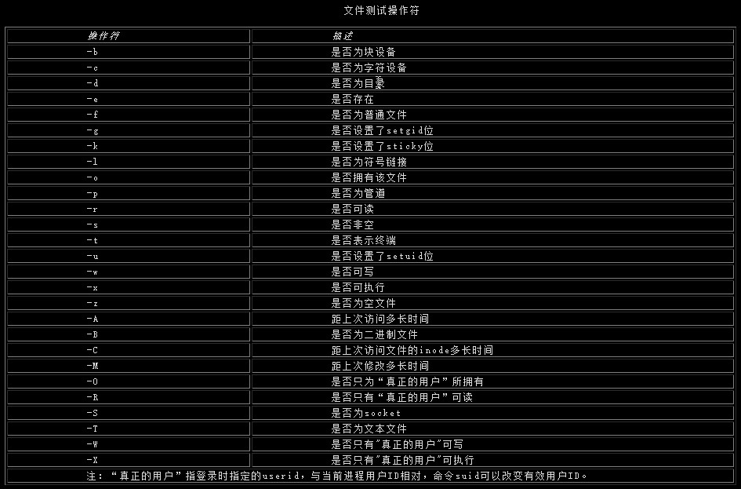
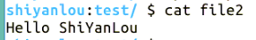

# 第 3 节 Perl 文件读写

## 一、实验说明介绍

### 1\. 环境登录

无需密码自动登录，系统用户名 shiyanlou

### 2\. 环境介绍

本实验环境采用 Ubuntu Linux 桌面环境，实验中会用到桌面上的程序：

1.  命令行终端: Linux 命令行终端，打开后会进入 Bash 环境，可以使用 Linux 命令
2.  Firefox 及 Opera：浏览器，可以用在需要前端界面的课程里，只需要打开环境里写的 HTML/JS 页面即可
3.  gvim：非常好用的 Vim 编辑器，最简单的用法可以参考课程[Vim 编辑器](http://www.shiyanlou.com/courses/2)
4.  gedit 及 Brackets：如果您对 gvim 的使用不熟悉，可以用这两个作为代码编辑器，其中 Brackets 非常适用于前端代码开发

### 3\. 环境使用

使用编辑器输入实验所需的代码及文件，使用命令行终端运行所需命令进行操作。

“实验记录”页面可以在“我的主页”中查看，每次实验的截图及笔记，以及有效学习时间（指的是在实验桌面内操作的时间，如果没有操作，系统会记录为发呆时间）。这些都是您在实验楼学习的真实性证明。

### 4\. 实验介绍

本节讲了 Perl 的文件读写，在 Perl 中有读、写、添加三种打开模式。

## 二、打开和关闭文件

语法为 `open(file,filename)`。file 为文件句柄，filename 是文件名，如 open(FILE1,"file1"); 打开文件时必须确定访问模式，在 perl 中有读、写、添加三种。后两种的用法区别：

```pl
open(file,">outfile"); #直接写源文件，先清空再写模式
open(file,">>outfile");  #在源文件后面添加内容 
```

当文件操作完毕后，用`close(file);`关闭文件。

## 三、读文件

语句 `$line = <FILE>;` 从文件中读取一行数据存储到简单变量 $line 中。`@array = <FILE>;`把文件的全部内容读入数组中；

## 四、写文件

形式：

```pl
open(OUTFILE,">outfile");
print OUTFILE "Here is an output line.\n"; 
```

注意：STDOUT、STDERR 为标准输出和标准错误文件，通常为屏幕，且不需要打开。

## 五、判断文件状态

### 1\. 文件测试操作符

语法：-op expr，如：

```pl
if(-e "/path/file1"){
    print STDERR("File file1 exists.\n");
} 
```



例：

```pl
unless(open(INFILE,"infile")){
    die("Input file infile cannot be opened.\n");
}
if(-e "outfile"){
    die("Output file outfile cannot be opened.\n");
} 
```

等价于：

```pl
open(INFILE,"infile")&&!(-e "outfile") && open(OUTFILE,">outfile")||die("Cannot open files.\n"); 
```

## 六、命令行参数

跟 C 语言一样，Perl 也具有存储命令行参数的数组 @ARGV，可以用来分别处理各个命令行参数；但不同的是，$ARGV[0] 是第一个参数，而不是程序名本身。

```pl
$var = $ARGV[0];        #第一个参数
$numargs = @ARGV;       #参数总个数 
```

在 Perl 中，`<>` 称为钻石操作符，实际上是对数组 @ARGV 的隐含引用，其工作原理为：

1、当 Perl 解释器第一次看到 `<>` 时，打开以 $ARGV[0] 为文件名的文件；

2、执行动作 shift(@ARGV); 即把数组 @ARGV 的元素向前移动一个，其元素数量即减少了一个。

3、`<>` 操作符读取在第一步打开的文件中的所有行。

4、读完后，解释器回到第一步重复。

例：

```pl
@ARGV = ("myfile1", "myfile2"); #实际上由命令行参数赋值
while ($line = <>) {
    print ($line);
} 
```

将把文件 myfile1 和 myfile2 的内容打印出来。

## 七、实验

利用以上知识，将文件 file1 的内容复制到文件 file2 中：

```pl
$ echo "Hello ShiYanLou" > file1
$ touch file2
$ vim copy.pl 
```

输入代码

```pl
#! /usr/bin/perl
open(INFILE,"file1");
open(OUTFILE,">>file2");
while($line = <INFILE>){
    print OUTFILE $line;
} 
```

输入结束，ESC 退出命令模式，保存退出当前文件

```pl
:wq 
```

改变当前文件可执行权限

```pl
$ chmod +x copy.pl 
```

执行当前文件并测试

```pl
$ ./copy.pl
$ cat file2
Hello ShiYanLou 
```



## 八、作业练习

请实现一个功能，输入一个字符串和一个文件路径，如果这个字符串在文件中存在就输出所在的行数，否则输出 -1。

## 九、参考文档

> * 本实验课程基于 flamephoenix 翻译制作的版本教程版本。感谢原作者[flamephoenix]（http://flamephoenix.126.com）