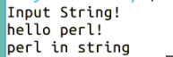

# 第 4 节 Perl 模式匹配

## 一、实验说明

### 1\. 环境登录

无需密码自动登录，系统用户名 shiyanlou

### 2\. 环境介绍

本实验环境采用 Ubuntu Linux 桌面环境，实验中会用到桌面上的程序：

1.  命令行终端: Linux 命令行终端，打开后会进入 Bash 环境，可以使用 Linux 命令
2.  Firefox 及 Opera：浏览器，可以用在需要前端界面的课程里，只需要打开环境里写的 HTML/JS 页面即可
3.  gvim：非常好用的 Vim 编辑器，最简单的用法可以参考课程[Vim 编辑器](http://www.shiyanlou.com/courses/2)
4.  gedit 及 Brackets：如果您对 gvim 的使用不熟悉，可以用这两个作为代码编辑器，其中 Brackets 非常适用于前端代码开发

### 3\. 环境使用

使用编辑器输入实验所需的代码及文件，使用命令行终端运行所需命令进行操作。

“实验记录”页面可以在“我的主页”中查看，每次实验的截图及笔记，以及有效学习时间（指的是在实验桌面内操作的时间，如果没有操作，系统会记录为发呆时间）。这些都是您在实验楼学习的真实性证明。

### 4\. 实验介绍

本节讲解了 Perl 中的模式匹配，它可以方便地对字符串进行操作。

## 二、匹配操作符 `=~`、`！~`

`=~` 检验匹配是否成功：`$result=$var=~/abc/;` 若在字符串中找到了该模式，则返回非零值，即 true，不匹配则返回 0，即 false。`!~` 与 `=~` 相反。这两个操作符适用于条件控制中，如：

```pl
if($question=~/please/){
    print("Thank you for being polite!\n");
}
else{
    print("That was not very polite!\n");
} 
```

## 三、模式中的特殊字符

Perl 在模式中支持一些特殊字符，这些字符往往可以起到一些特殊作用。

### 1\. 字符 `+`

`+` 意味着一个或多个相同的字符，如：/de+f/指 def、deef、deeeef 等。当一行中各单词间的空格多余一个时，可以如下分割：

```pl
@array = split(/ +/,$line); 
```

注：split 函数每次遇到分割模式，总是开始一个新单词，因此若 $line 以空格打头，则 @array 的第一个元素即为空元素。但其可以区分是否真有单词，如若 $line 中只有空格，则 @array 则为空数组。且上例中 TAB 字符被当作一个单词。

### 2.字符 `[]` 和 `[^]`

`[]` 意味着匹配一组字符中的一个，如/a[0123456789]c/将匹配 a 加数字加 c 的字符串。与 `+` 联合使用，例：/d[eE]+f/可以匹配 def, dEf, deef, dEef, dEEEef 等。`^` 表示除其之外的所有字符。如：/d[^eE]f/匹配 d 加非 e 字符字符加 f 组成的字符串。

### 3\. 字符`*` 和 `?`

他们与 `+` 相似，用于修饰匹配前一个字符或字符串的次数。`*` 表示匹配无数多次，而 `?` 表示出现 0 次或 1 次。

### 4\. 转义字符

如果想在模式中包含通常被看作特殊意义的字符，须要在其前加斜线`\`。如：`/\*+/`中`\*`即表示字符`*`，而不是上面提到的一个或多个字符的含义。斜线的表示为`/\\/`。

### 5\. 匹配任意字母或数字

上面提到模式`/a[0123456789]c/`匹配字母 a 加任意数字加 c 的字符串，另一种表示方法为：`/a[0-9]c/`，类似的，`[a-z]`表示任意小写字母，`[A-Z]`表示任意大写字母。任意大小写字母、数字的表示方法为：`/[0-9A-Za-z]/`。

### 6\. 锚模式

^或\A 表示仅匹配串首；$或\Z 仅匹配串尾。\b 匹配单词边界；\B 单词内部匹配；

### 7\. 字符范围转义

\d 匹配任意数字 \D 匹配任意非数字字符

\w 匹配单词字符 \W 匹配任意非单词字符

\s 空白字符 \S 匹配任意非空白字符

. 匹配除换行符以外的所有字符，通常和*合用

### 8\. 模式次序变量

在模式匹配后调用重用部分的结果可用变量$n，全部的结果用变量$&.

## 四、模式匹配选项

g 匹配所有可能的模式 i 忽略大小写

m 将串视为多行 o 只赋值一次

s 将串视为单行 x 忽略模式中的空白

## 五、正则表达式实例

输入一个字符串，检查该字符串中是否存在 “perl” 这个单词

```pl
$ vim testreg.pl 
```

输入代码

```pl
#! /usr/bin/perl
print "Input String!\n";
$string=<STDIN>;  #从标准输入中获取一个字符串
chop($string);   #去掉字符串中的换行符
if($string =~ /perl/){
    print("perl in string\n");
} 
```

输入结束，ESC 键退出命令模式，保存文件

```pl
:wq 
```

改变文件执行权限

```pl
$chmod +x testreg.pl 
```

运行文件执行测试

```pl
$ ./testreg.pl 
```



## 六、作业练习

请实现判断一个字符串是否是电子邮箱的功能。

## 七、参考文档

> * 本实验课程基于 flamephoenix 翻译制作的版本教程版本。感谢原作者[flamephoenix]（http://flamephoenix.126.com）