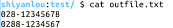

# 第 5 节 Perl 控制结构

## 一、实验说明

### 1\. 环境登录

无需密码自动登录，系统用户名 shiyanlou

### 2\. 环境介绍

本实验环境采用 Ubuntu Linux 桌面环境，实验中会用到桌面上的程序：

1.  命令行终端: Linux 命令行终端，打开后会进入 Bash 环境，可以使用 Linux 命令
2.  Firefox 及 Opera：浏览器，可以用在需要前端界面的课程里，只需要打开环境里写的 HTML/JS 页面即可
3.  gvim：非常好用的 Vim 编辑器，最简单的用法可以参考课程[Vim 编辑器](http://www.shiyanlou.com/courses/2)
4.  gedit 及 Brackets：如果您对 gvim 的使用不熟悉，可以用这两个作为代码编辑器，其中 Brackets 非常适用于前端代码开发

### 3\. 环境使用

使用编辑器输入实验所需的代码及文件，使用命令行终端运行所需命令进行操作。

“实验记录”页面可以在“我的主页”中查看，每次实验的截图及笔记，以及有效学习时间（指的是在实验桌面内操作的时间，如果没有操作，系统会记录为发呆时间）。这些都是您在实验楼学习的真实性证明。

### 4\. 实验介绍

本节讲了 Perl 的控制结构，包括 if...else，while，until，for，foreach 和 do 循环结构。

## 二、控制结构

### 1\. 条件判断

```pl
if(<expression>){
    <statements_block>
}
elsif(<condition>){
    <statement_block>
}
...
else{
    <statement_block>
} 
```

### 2\. 循环

#### （1）while 循环

```pl
while(<condition>){
    <statement_block>
} 
```

#### （2）until 循环

```pl
until(<condition>){
    <statement_block>
} 
```

#### （3）类 C 的 for 循环

```pl
for(var=start;var<end;var++){
    <statement>
} 
```

#### （4）针对列表和数组的循环 foreach

```pl
foreach localvar (list){
    <statement>
} 
```

或：

```pl
foreach $localvar (@array){
    <statement>
} 
```

#### （5）do 循环

```pl
do{
    statement
}while_or_untile(condition); 
```

#### （6）循环控制

退出循环为 last，与 C 中的 break 作用相同；执行下一个循环为 next，与 C 中的 continue 相似。Perl 中还有一个特殊命令 redo，意思是重复此次循环，即循环变量不变，回到循环起始点，但是此命令在 do 中不起作用。

#### （7）单行控制

```pl
print ("This is zero.\n") if ($var == 0);
print ("This is zero.\n") unless ($var != 0);
print ("Not zero yet.\n") while ($var-- > 0);
print ("Not zero yet.\n") until ($var-- == 0); 
```

## 三、实例

从一个文件中一次读入每一行的内容，从中匹配出电话号码`(/d{3}-/d{8}|d{4}-/d{7})`，输出到屏幕显示（可以用正则表达式一次匹配，但是为了结合本课程，采用每行匹配的方式）

```pl
$ echo "028-12345678\n0288-1234567\n028-123456" > control.txt
$ vim control.pl 
```

输入代码

```pl
#! /usr/bin/perl
if(!open(MYFILE,"control.txt")){
    die("Can't open file.");
}
else{
    open(OUTFILE, "+>>outfile.txt") or die "Error:$!\n";
    while($line = <MYFILE>){
        if($line=~/\d{3}-\d{8}|\d{4}-\d{7}/){
            print OUTFILE $line;
        }
    }
    close MYFILE;
} 
```

输入结束，ESC 退出编辑模式，保存并退出文件

```pl
:wq 
```

修改文件操作权限

```pl
$ chmod +x control.pl 
```

#### 执行文件

```pl
$ ./control.pl 
```

查看输出文件结果

```pl
$ cat outfile.txt
028-12345678
0288-1234567 
```



## 四、作业练习

请实现一个功能，输入一个正整数 n，输入 2-n 之间的所有素数。

## 五、参考文档

> * 本实验课程基于 flamephoenix 翻译制作的版本教程版本。感谢原作者[flamephoenix]（http://flamephoenix.126.com）