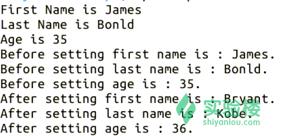

# 第 8 节 Perl 面向对象编程

## 一、实验说明

### 1\. 环境登录

无需密码自动登录，系统用户名 shiyanlou

### 2\. 环境介绍

本实验环境采用 Ubuntu Linux 桌面环境，实验中会用到桌面上的程序：

1.  命令行终端: Linux 命令行终端，打开后会进入 Bash 环境，可以使用 Linux 命令
2.  Firefox 及 Opera：浏览器，可以用在需要前端界面的课程里，只需要打开环境里写的 HTML/JS 页面即可
3.  gvim：非常好用的 Vim 编辑器，最简单的用法可以参考课程[Vim 编辑器](http://www.shiyanlou.com/courses/2)
4.  gedit 及 Brackets：如果您对 gvim 的使用不熟悉，可以用这两个作为代码编辑器，其中 Brackets 非常适用于前端代码开发

### 3\. 环境使用

使用编辑器输入实验所需的代码及文件，使用命令行终端运行所需命令进行操作。

“实验记录”页面可以在“我的主页”中查看，每次实验的截图及笔记，以及有效学习时间（指的是在实验桌面内操作的时间，如果没有操作，系统会记录为发呆时间）。这些都是您在实验楼学习的真实性证明。

### 4\. 课程来源

本节讲解了 Perl 中基本的面向对象编程，模块就是包，在 Perl 中类仅仅是一个包。

## 二、模块

模块就是 perl 包，Perl 中的对象基于对包中数据项的引用。在 Perl 中，类是一个 Perl 包，其中有提供对象方法的类；方法是 Perl 中的子程序，类名作为其第一个参数；对象是对类中数据项的引用。

## 三、类

在 Perl 中类仅仅是一个包，在 Perl4 中用双冒号(::)来标识基本类和继承类(子类)。面向对象的一个重要特性是继承，在 Perl 中的继承只继承方法，必须用自己的机制来实现数据的继承。可以与包的引用相结合，可以用单引号(')操作符来定位类中的变量，类中成员的定位形式如\$classname'$method。在 perl5 中，可以用双冒号来获得引用，如：

```pl
$classname::$method 
```

### 1\. 创建类

首先，创建一个包文件，pm 为包的缺省扩展名，一个模块就是一个包，一个包就是一个类。在做其他事情之前，先加入"1;"，当添加其他行时，始终保持带"1;"的行为最后一行，是 Perl 包的必须条件，否则该包不会被 Perl 处理。结构如下

```pl
package mypac;
#使用 require 语句添加其他的依赖包
#添加该类的代码
1;    #结束行代码 
```

Perl 提供了 bless()函数，用于返回一个引用，并成为一个对象。下面声明一个类名为 Person 的类：

```pl
$ vim Person.pm 
```

输入代码

```pl
#! /usr/bin/perl
package Person;
sub new{      #构造函数
    my $class = shift;
    my $self = {
        _firstName => shift,
        _lastName  => shift,
        _age       => shift,
    };
    # Print all the values just for clarification.           
    print "First Name is $self->{_firstName}\n";
    print "Last Name is $self->{_lastName}\n";
    print "Age is $self->{_age}\n";
    bless $self, $class;    #bless 返回一个引用，并成为对象
    return $self;
}

sub getFirstName{     #获取名字
    my($self) = @_;
    return $self->{_firstName};
}

sub setFirstName{ #设置名字
    my($self,$firstName)=@_;
    $self->{_firstName} = $firstName if defined($firstName);
    return $self->{_firstName};
}

sub getLastName{
    my($self) = @_;
    return $self->{_lastName};
}

sub setLastName{ #设置姓
    my($self,$lastName)=@_;
    $self->{_lastName} = $lastName if defined($lastName);
    return $self->{_lastName};
}

sub getAge{
    my($self) = @_;
    return $self->{_age};
}
sub setAge{
    my($self,$age) = @_;
    $self->{_age} = $age if defined ($age);
    return $self->{_age};
}
1;   #结束标志 
```

输入结束，ESC 退出输入状态，保存并退出

```pl
:wq 
```

改变文件的可执行权限

```pl
$ chmod +x Person.pm 
```

建立 Person 对象的主文件

```pl
$ vim main.pl 
```

输入代码

```pl
#! /usr/bin/perl
use Person;
$object = new Person("James","Bonld","35");
$firstName = $object->getFirstName();
print "Before setting first name is : $firstName.\n";
$lastName = $object->getLastName();
print "Before setting last name is : $lastName.\n";
$age = $object->getAge();
print "Before setting age is : $age.\n";

$object->setFirstName("Bryant");
$object->setLastName("Kobe");
$object->setAge("36");

$firstname = $object->getFirstName();
print "After setting first name is :　$firstname.\n";
$lastname = $object->getLastName();
print "After setting last name is : $lastname.\n";
$age = $object->getAge();
print "After setting age is : $age.\n"; 
```

输入结束，ESC 返回到命令模式，保存并退出当前文件

```pl
:wq 
```

改变文件的执行权限

```pl
$ chmod +x main.pl 
```

执行当前文件并测试

```pl
$ ./main.pl 
```



## 四、作业练习

请编写一个圆类，可以设置它的半径并能得到它的面积和周长。

## 五、参考文档

> * 本实验课程基于 flamephoenix 翻译制作的版本教程版本。感谢原作者[flamephoenix]（http://flamephoenix.126.com）