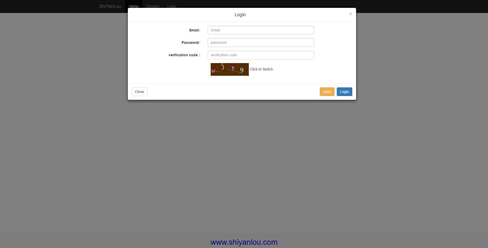

# 第 1 节 前端页面制作

## 一、实验简介

本次实验主要以前端制作为主要内容，使用纯前端知识制作用户注册登录的界面，为后续实验做铺垫。通过本实验的学习，我们可以轻松地制作类似的界面效果。由于这是 PHP 的项目课，所以我们并不需要一行一行的写 html 代码，本次课程的界面制作主要使用前端框架 bootstrap3 的模板和组件来快速搭建大方漂亮的界面，大家也会领略到 bootstrap 框架的方便之处。

如果你对页面制作不感兴趣或者对这方面比较熟悉，可以跳过本次实验，直接下载使用实验文档最后提供的代码文件。

### 1.1 知识点

*   Bootstrap3
*   Jquery
*   Ajax

### 1.2 开发工具

*   sublime，一个方便快速的文本编辑器。点击桌面左下角： 应用程序菜单/开发/sublime。

### 1.3 最终效果图




## 二、页面制作

### 2.1 主页

首先在 `home/Code` 目录下建立一个 `web` 文件夹作为我们的网站根目录，在该目录下建立 `index.php` 作为网站首页。使用 `sublime` 打开`web` 文件夹，对 `index.php` 编辑：

```php
<!DOCTYPE html>
<html>
<head>
    <meta charset="utf-8">
    <meta http-equiv="X-UA-Compatible" content="IE=edge">
    <title>Index</title>
    <link rel="stylesheet" href="">
</head>
<body>
    <h1>hello shiyanlou</h1>
</body>
</html> 
```

接下来启动服务器，自 `PHP5.4`之后 PHP 内置了一个 Web 服务器，因此我们可以很方便地运行服务器，在 web 目录下执行以下命令：

```php
$ php -S localhost:80   #若启动失败，可将端口号换为 8080 
```

不出意外地话，我们的服务器就启动了，打开浏览器，输入 URL ：localhost:80


好了，接下来我们将对这个页面进行精心的制作！

### 2.2 模板挑选

由于我们的课程是 PHP 的项目课，所以我们的重点不是去设计精美的界面，但是也不能太随意应付，毕竟写出来也要给别人欣赏。所以我们可以到网上去寻找好看免费的模板，自己再进行加工，就是自己的作品了。本课程主要使用 bootstrap 框架制作界面，所以首先应该去 bootstrap 官网去看看相关的优秀作品。大家平时开发也可以到上面去寻找一丝创作灵感。


经过一番寻找，我选择了这个模板：


大家也可以选择自己喜欢的模板，制作出自己喜欢的界面。我将会对这个模板页面进行一下改造，首先，先教大家如何使用这个模板。

*   复制源代码：查看该模板的源代码，全部复制并粘贴到我们自己 `index.php` 中(覆盖之前的测试代码)；

*   使用 css：在 web 目录下建立一个 public 文件夹，并在其下建立 img，css，js 文件夹，分别用来放置我们对应的文件。

    我们可以看到模板的源代码的 header 中有这样一段注释：`<!-- Custom styles for this template -->` 下面就是该模板所用的自定义的 css 文件。在网页中单击 css 链接，复制 css 代码，存放到 `public/css/start.css` 文件（自行建立文件）。

*   调整引用位置：在 `index.php` 使用相对路径调整 css 文件的引用路径。

*   标签页图标：自行找一个 ico 文件放到 `public/img` 下，并修改 `<link rel="icon" href="public/img/xxxx.ico">`，调整引用目录

### 2.3 目录结构及修改后代码

目录结构：


`Index.php` 代码：

```php
<!DOCTYPE html>
<html lang="zh-CN">
  <head>
    <meta charset="utf-8">
    <meta http-equiv="X-UA-Compatible" content="IE=edge">
    <meta name="viewport" content="width=device-width, initial-scale=1">
    <!-- 上述 3 个 meta 标签*必须*放在最前面，任何其他内容都*必须*跟随其后！ -->
    <meta name="description" content="">
    <meta name="author" content="">
    <link rel="icon" href="public/img/favicon.ico">

    <title>Index</title>

    <!-- Bootstrap core CSS -->
    <link href="//cdn.bootcss.com/bootstrap/3.3.5/css/bootstrap.min.css" rel="stylesheet">

    <!-- Custom styles for this template -->
    <link href="public/css/start.css" rel="stylesheet">
    <link href="public/css/footer.css" rel="stylesheet">
  </head>

  <body>
    <!-- 导航栏 -->
    <nav class="navbar navbar-inverse navbar-fixed-top">
      <div class="container">
        <div class="navbar-header">
          <button type="button" class="navbar-toggle collapsed" data-toggle="collapse" data-target="#navbar" aria-expanded="false" aria-controls="navbar">
            <span class="sr-only">Toggle navigation</span>
            <span class="icon-bar"></span>
            <span class="icon-bar"></span>
            <span class="icon-bar"></span>
          </button>
          <a class="navbar-brand" href="#">Project name</a>
        </div>
        <div id="navbar" class="collapse navbar-collapse">
          <ul class="nav navbar-nav">
            <!-- 这里做了修改 -->
            <li class="active"><a href="#">Home</a></li>
            <li><a href="#register">Register</a></li>
            <li><a href="#login">Login</a></li>
          </ul>
        </div><!--/.nav-collapse -->
      </div>
    </nav>
    <!-- 页面主体内容 -->
    <div class="container">
            <div class="content">
              <div class="starter-template">
                <!-- 这里做了修改，其他地方自由发挥 -->
                <h1>Welcome To ShiYanLou</h1>
                <p class="lead">Use this document as a way to quickly start any new project.<br> All you get is this text and a mostly barebones HTML document.</p>
              </div>  
            </div>
    </div><!-- /.container -->

    <!-- 网页底部 -->
    <footer class="footer">
        <div class="container">
        <p class="text-muted">
          <h2><a href="http://www.shiyanlou.com" title="www.shiyanlou.com" style="color: blue;">www.shiyanlou.com</a></h2>
        </p>
      </div>
    </footer>

    <!-- Bootstrap core JavaScript
    ================================================== -->
    <!-- Placed at the end of the document so the pages load faster -->
    <script src="//cdn.bootcss.com/jquery/1.11.3/jquery.min.js"></script>
    <script src="//cdn.bootcss.com/bootstrap/3.3.5/js/bootstrap.min.js"></script>
  </body>
</html> 
```

这里我还添加了一个网页的 `footer`，对应的 `footer.css` 文件代码：

```php
/* Sticky footer styles
-------------------------------------------------- */
.footer {
  position: absolute;
  bottom: 0;
  width: 100%;
  /* Set the fixed height of the footer here */
  height: 60px;
  text-align:center;
  background-color: #f5f5f5;
} 
```

现在再次打开 localhost:80 ,应该就可以看到一个漂亮的首页了，而且还是响应式的布局。这里展示我的首页！


### 2.4 注册表单制作

我们将把注册和登陆的表单全部放到 index.php 中。为了美观，我们把表单样式做成模糊框样式的效果。

这里我们要使用到 bootstrap 的模糊框的 js 插件 [modals](http://v3.bootcss.com/javascript/#modals) 。

把模糊框的代码片段放到 container 的 div 中去。将它作为注册的表单。同时修改导航栏的 register 按钮 的相关参数和模糊框的 id，使之与模糊框对应起来。

```php
<li><a href="#Register" data-toggle="modal" data-target="#register">Register</a></li> 
```

注册表单代码：

```php
 <!-- 页面主体内容 -->
    <div class="container">
      <div class="content">
          <div class="starter-template">
                <!-- 这里做了修改，其他地方自由发挥 -->
            <h1>Welcome To ShiYanLou</h1>
            <p class="lead">Use this document as a way to quickly start any new project.<br> All you get is this text and a mostly barebones HTML document.</p>
          </div>  
          <!-- 注册表单 -->
          <div class="modal fade bs-example-modal-lg" tabindex="-1" role="dialog" id="register" aria-labelledby="myLargeModalLabel">
            <div class="modal-dialog modal-lg">
              <div class="modal-content">
              <div class="modal-header">
                <button type="button" class="close" data-dismiss="modal" aria-label="Close"><span aria-hidden="true">&times;</span></button>
                <h4 class="modal-title" id="myModalLabel">Register</h4>
              </div>
              <form action="" method="post" accept-charset="utf-8" class="form-horizontal">
                <div class="modal-body">

                  <div class="form-group">
                    <label for="username" class="col-sm-4 control-label">Name:</label>
                    <div class="col-sm-6">
                      <input type="text" class="form-control" name="username" id="username" minlength="2" maxlength="20" placeholder="username" required="">
                    </div>
                    <!-- 错误提示信息 -->
                    <h6 style="color: red;" id="dis_un"></h6>
                  </div>

                  <div class="form-group">
                    <label for="email" class="col-sm-4 control-label">Email:</label>
                    <div class="col-sm-6">
                      <input type="email" class="form-control" name="email" id="remail" placeholder="Email" required="">
                    </div>
                    <!-- 错误提示信息 -->
                    <h6 style="color: red;" id="dis_em"></h6>
                  </div>

                  <div class="form-group">
                    <label for="password" class="col-sm-4 control-label">Password:</label>
                    <div class="col-sm-6">
                      <input type="password" class="form-control" name="password" id="password" placeholder="password" minlength="6" maxlength="20" required="">
                    </div>
                    <!-- 错误提示信息 -->
                    <h6 style="color: red;" id="dis_pwd"></h6>
                  </div>

                  <div class="form-group">
                    <label for="confirm" class="col-sm-4 control-label">Confirm password:</label>
                    <div class="col-sm-6">
                      <input type="password" class="form-control" name="confirm" id="confirm" placeholder="confirm" minlength="6" maxlength="20" required="">
                    </div>
                    <!-- 错误提示信息 -->
                    <h6 style="color: red;" id="dis_con_pwd"></h6>
                  </div>

                  <div class="form-group">
                    <label for="code" class="col-sm-4 control-label"> verification code :</label>
                    <div class="col-sm-6">
                      <input type="text" class="form-control" name="code" id="code" placeholder="verification code" required="" maxlength="4" size="100">
                    </div>
                  </div>
                  <div class="form-group">
                    <div class="col-sm-12">
                      
                      <a href="#" title="Switch">Click to Switch</a>
                    </div>
                  </div>
                </div>

                <div class="modal-footer">
                  <button type="button" class="btn btn-default" data-dismiss="modal" style="float: left;">Close</button>
                  <input type="reset" class="btn btn-warning" value ="reset" />
                  <button type="submit" class="btn btn-primary" id="reg">register</button>
                </div>
              </form>
              </div>
            </div>
          </div>
      </div><!-- /.content -->

    </div><!-- /.container --> 
```

修改完以上代码，保存之后，再次打开主页，点击 register 按钮，就能看到一个好看的模糊框表单：


### 2.5 登陆表单制作

参照注册表单相似的做法，我们快速搭建一个登录表单

修改导航栏菜单：

```php
<li><a href="#Login" data-toggle="modal" data-target="#login">Login</a></li> 
```

在注册表单之后添加以下登陆表单代码：

```php
 <!-- 登陆表单 -->
          <div class="modal fade bs-example-modal-lg" tabindex="-1" role="dialog" id="login" aria-labelledby="myLargeModalLabel">
            <div class="modal-dialog modal-lg">
              <div class="modal-content">
              <div class="modal-header">
                <button type="button" class="close" data-dismiss="modal" aria-label="Close"><span aria-hidden="true">&times;</span></button>
                <h4 class="modal-title" id="myModalLabel">Login</h4>
              </div>
              <form action="" method="post" accept-charset="utf-8" class="form-horizontal">
                <div class="modal-body">

                  <div class="form-group">
                    <label for="email" class="col-sm-4 control-label">Email:</label>
                    <div class="col-sm-6">
                      <input type="email" class="form-control" name="email" id="email" placeholder="Email" required="">
                    </div>
                  </div>

                  <div class="form-group">
                    <label for="password" class="col-sm-4 control-label">Password:</label>
                    <div class="col-sm-6">
                      <input type="password" class="form-control" name="password" placeholder="password" minlength="6" maxlength="20" required="">
                    </div>
                  </div>
                  <div class="form-group">
                    <label for="code" class="col-sm-4 control-label"> verification code :</label>
                    <div class="col-sm-6">
                      <input type="text" class="form-control" name="code" id="code" placeholder="verification code" required="" maxlength="4">
                    </div>
                  </div>

                  <div class="form-group">
                    <div class="col-sm-12">
                      
                      <span>Click to Switch</span>
                    </div>
                  </div>

                </div>

                <div class="modal-footer">
                  <button type="button" class="btn btn-default" data-dismiss="modal" style="float: left;">Close</button>
                  <input type="reset" class="btn btn-warning" value ="reset" />
                  <button type="submit" class="btn btn-primary" name="login">Login</button>
                </div>
              </form>
              </div>
            </div>
          </div> 
```

现在打开主页，点击登陆按钮。


## 三、Js 脚本制作

### 3.1 分析脚本功能

我们经常会填写各种各样的表单，也经常会有这样的体验：当你输入数据有误或者不符合规范时候，表单页面就会给出各种错误提示，让你去改正。比如让你输入邮箱地址，你却输入了电话号码，这就是不符合规范的。当你填写用户名的时候，如果网站要求用户名具有唯一性，那么就需要对你的用户名进行检测，并给出相关提示，比如 ‘用户名已被注册’等信息。这些功能大部分都是通过前端 js 代码实现的。这样做的原因，一方面是为了让表单输入更人性化，节约输入成本。另一方面也是为了减轻后台服务器的压力。本次实验我们也会带着大家做一些表单的输入检测，如果你细心的话，可能已经注意到了，我在注册表单的输入框之后添加了对应的错误提示代码。由于注册和登陆表单功能类似，为了示范作用，我们这里只做注册表单的 js 代码，登陆部分可以留做作业，大家自己去完善。

我们需要实现的 js 功能：

*   用户名唯一性检测
*   邮箱格式和唯一性检测
*   密码与确认密码输入检测

Javascript 库：Jquery

### 3.2 代码编写

为了目录结构的规范性，我们先在 public/js/ 下建立 check.js。并在 index.php 底部添加引入代码：

```php
 <script src="public/js/check.js"></script> 
```

接下来就开始认真的写 js 代码了！

#### 3.2.1 用户名检测

这里我采用实时的方法对用户名的输入做检测：当用户输入一个字符，就做一次检测，判断合法性和唯一性。因为要检测用户名唯一性，就需要从数据库里去查找用户名，这涉及到后台代码的功能，不过现在我们只关心前台的功能，这里使用 Ajax 与后台交互，实现实时检测。代码如下:

```php
$(document).ready(function() {
    var nameFlag = true;    //准备一个用户名的可用性标识
    $('#username').keyup(function() {  //用户输入一个字符就触发响应
        var length = $(this).val().length; 
        if ( length >= 2 && length <= 20 ) {  //判断用户名长度 2 至 20 位之间
            //发送用户名，检测的类型为 name
            $.post('##', {username: $(this).val(),type:'name'}, function(data, textStatus, xhr) {
                if (textStatus == 'success') {
                    if (data == '1') {  //如果后台返回 1，则表示此用户名已被注册
                        $('#dis_un').text('UserName is already registered');   //给出错误提示
                        nameFlag = false;
                    }else{  //用户名可以使用
                        $('#dis_un').text(''); //去掉错误提示文字
                        nameFlag = true;
                    }
                }
            });
        }else{  //长度不符合则不进行检测
            $('#dis_un').text('');
        }
    });
}); 
```

#### 3.2.2 注册邮箱检测

这里的邮箱输入，我们不仅需要对其做唯一性检测，还需要做格式检测，判断用户输入是否是邮箱格式。我们也需要使用 Ajax 与后台交互确认唯一性，不过不需要像用户名那样实时检测，只需要在其失去焦点之后就开始检测，代码如下：

```php
var emailFlag = true;    //准备一个邮箱的可用性标识
$('#remail').blur(function() {    //注册邮箱失去焦点才检测
        if ($(this).val() != '') { //输入不为空就检测
            var reg = /\w+([-+.]\w+)*@\w+([-.]\w+)*\.\w+([-.]\w+)*/;    //正则表达式判断邮箱格式
            if (reg.test($(this).val())) { //是邮箱格式
                $.post('##', {email: $(this).val(),type: 'email'}, function(data, textStatus, xhr) {
                    if (textStatus == 'success') {
                        if (data == '1') {  //后台返回 1 表示已被注册
                            $('#dis_em').text('E-mail is already registered');
                            emailFlag = false;
                        }else{  //邮箱可用
                            $('#dis_em').text('');
                            emailFlag = true;
                        }
                    }
                });
            }else{  //不是邮箱格式
                $('#dis_em').text('E-mail format is incorrect');
                emailFlag = false;
            }
        }else{  //为空，不显示提示文字
            $('#dis_em').text('');
        }
    }); 
```

#### 3.2.3 密码与确认密码检测

*   密码输入的规则：不能为空，长度至少为 6 位。
*   确认密码规则：不能为空，长度至少 6 位。当上面输入密码不为空，确认密码与输入密码须一致。

基于以上规则，实现代码：

```php
var pwdFlag = true;   //准备一个密码的可行性标识    
$('#password').blur(function(){    //密码检测
        if ($(this).val() == '') {
            $('#dis_pwd').text('Password cannot be empty');
        }else if($(this).val().length < 6){
            $('#dis_pwd').text('Passwords must be at least six');
        }else{
            $('#dis_pwd').text('');
        }
    });

    $('#confirm').blur(function() {    //确认密码检测
        var val = $('#password').val();
        if (val != '') {
            if ($(this).val() == '') {
                $('#dis_con_pwd').text('Please confirm your password');
                pwdFlag = false;
            }else if($(this).val() != val){
                $('#dis_con_pwd').text('Confirm password inconsistent');
                pwdFlag = false;
            }else{
                $('#dis_con_pwd').text('');
                pwdFlag = true;
            }
        }else{
            $('#dis_con_pwd').text('');
            pwdFlag = false;
        }
    }); 
```

#### 3.2.4 提交检测

当点击表单注册按钮时，我们需要判断表单界面是否存在错误，若有误，则提示检测页面信息，否则提交。

```php
 $('#reg').click(function() {
        if (!(nameFlag && emailFlag && pwdFlag)) {  //用户名标识 && 邮箱标识 && 密码标识
            alert('Please check page info!');
            return false;
        }
    }); 
```

至此，注册表单部分的 js 代码就写完了，可能写的不是很完善，但是希望可以抛砖引玉。大家也可以自行编写相关的 js 检测代码。

### 3.2.5 运行效果

当注册表单输入有误时，点击了 register 按钮：


部分需要与后台交互配合的效果需要在后续的实验中才能实现：用户名与邮箱的唯一性检测。

## 四、完善

本次实验主要以制作注册登陆页面为主，让大家学会如何使用免费的模板，以及相应的表单制作。虽然这是 PHP 的项目课，但是作为一名 PHP 程序员，这些简单的前端技术和简单的页面制作也是必须要掌握的。虽然做出来的页面不是很精美，但是也达到了我们想要的效果。如果有兴趣的同学，可以自行设计精美的网页。

## 五、作业

参考注册表单的 js 代码，自行设计编写登陆表单的输入检测 js 脚本。

## 六、源码下载

```php
http://labfile.oss.aliyuncs.com/courses/587/index.php
http://labfile.oss.aliyuncs.com/courses/587/check.js 
```