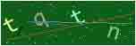
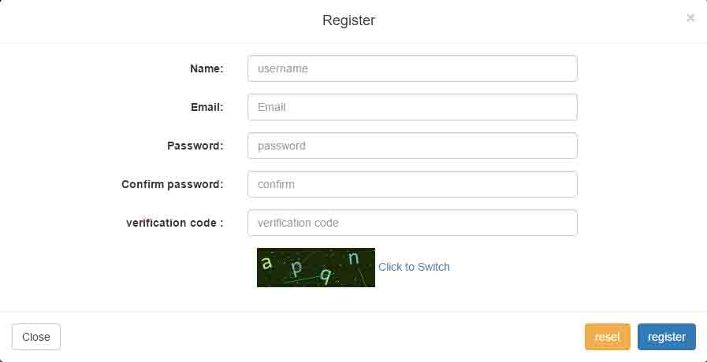
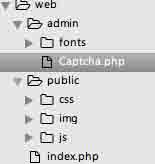
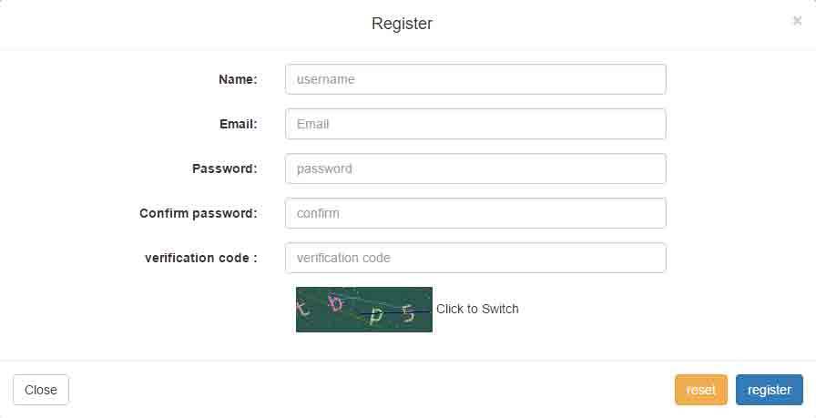

# 第 2 节 验证码制作

## 一、实验简介

本次实验将会带领大家使用面向对象的思想封装一个验证码类。并在注册和登陆界面展示使用。通过本次实验的学习，你将会领悟到 PHP 的 OOP 思想，以及 [GD](http://php.net/manual/zh/book.image.php) 库的使用，验证码生成。

## 1.1 涉及到的知识点

*   PHP
*   GD 库
*   OOP 编程

## 1.2 开发工具

*   sublime，一个方便快速的文本编辑器。点击桌面左下角： 应用程序菜单/开发/sublime

## 1.3 效果图





## 二、封装验证码类

### 2.1 建立目录以及准备字体

在 web 目录下建立一个 `admin` 目录作为我们的后台目录，存放后台代码文件。在 `admin` 下建立一个 `fonts` 目录，用于存放制作验证码所需字体。

在 admin 下新建一个 `Captcha.php` 文件，这就是我们需要编辑的验证码类文件。

当前目录层次结构：



编辑 `Captcha.php` 文件：

```php
<?php 
/**
* Captcha class
*/
class Captcha
{

    function __construct()
    {
        # code...
    }
} 
```

添加该类的私有属性和构造方法：

```php
<?php 
/**
* Captcha class
*/
class Captcha
{
    private $codeNum;  //验证码位数
    private $width;    //验证码图片宽度
    private $height;   //验证码图片高度
    private $img;  //图像资源句柄
    private $lineFlag; //是否生成干扰线条
    private $piexFlag; //是否生成干扰点
    private $fontSize; //字体大小
    private $code; //验证码字符
    private $string;   //生成验证码的字符集
    private $font; //字体
    function __construct($codeNum = 4,$height = 50,$width = 150,$fontSize = 20,$lineFlag = true,$piexFlag = true)
    {
        $this->string = 'qwertyupmkjnhbgvfcdsxa123456789';  //去除一些相近的字符
        $this->codeNum = $codeNum;
        $this->height = $height;
        $this->width = $width;
        $this->lineFlag = $lineFlag;
        $this->piexFlag = $piexFlag;
        $this->font = dirname(__FILE__).'/fonts/consola.ttf';
        $this->fontSize = $fontSize;
    }
} 
```

字体文件可通过以下命令下载到 fonts 目录：

```php
$ wget http://labfile.oss.aliyuncs.com/courses/587/consola.ttf 
```

接下来开始编写具体的方法：

*   创建图像资源句柄

    ```php
    //创建图像资源    
    public function createImage(){
          $this->img = imagecreate($this->width, $this->height);  //创建图像资源
          imagecolorallocate($this->img,mt_rand(0,100),mt_rand(0,100),mt_rand(0,100));    //填充图像背景（使用浅色）
      } 
    ```

    用到的相关函数

    *   [imagecreate](http://php.net/manual/zh/function.imagecreate.php)：新建一个基于调色板的图像
    *   [imagecolorallocate](http://php.net/manual/zh/function.imagecolorallocate.php)：为一幅图像分配颜色
    *   [mt_rand](http://php.net/manual/zh/function.mt-rand.php)：生成更好的随机数
*   创建验证码字符串并输出到图像

    ```php
    //创建验证码    
    public function createCode(){
          $strlen = strlen($this->string)-1;
          for ($i=0; $i < $this->codeNum; $i++) { 
              $this->code .= $this->string[mt_rand(0,$strlen)];  //从字符集中随机取出四个字符拼接
          }
            $_SESSION['code'] = $this->code;   //加入 session 中

    ```
    //计算每个字符间距
      $diff = $this-&gt;width/$this-&gt;codeNum;
      for ($i=0; $i &lt; $this-&gt;codeNum; $i++) { 
                  //为每个字符生成颜色（使用深色）
        $txtColor = imagecolorallocate($this-&gt;img,mt_rand(100,255),mt_rand(100,255),mt_rand(100,255));
        //写入图像
          imagettftext($this-&gt;img, $this-&gt;fontSize, mt_rand(-30,30), $diff*$i+mt_rand(3,8), mt_rand(20,$this-&gt;height-10), $txtColor, $this-&gt;font, $this-&gt;code[$i]);
      } 
    ```php

      } 
    ```

    用到的相关函数：

    *   [imagettftext](http://php.net/manual/zh/function.imagettftext.php)：用 TrueType 字体向图像写入文本
*   创建干扰线条

    ```php
    //创建干扰线条（默认四条）
    public function createLines(){
          for ($i=0; $i < 4; $i++) { 
              $color = imagecolorallocate($this->img,mt_rand(0,155),mt_rand(0,155),mt_rand(0,155));  //使用浅色
              imageline($this->img,mt_rand(0,$this->width),mt_rand(0,$this->height),mt_rand(0,$this->width),mt_rand(0,$this->height),$color); 
          }
      } 
    ```

    用到的相关函数：

    *   [imageline](http://php.net/manual/zh/function.imageline.php)：画一条线段
*   创建干扰点

    ```php
    //创建干扰点    （默认一百个点）
    public function createPiex(){
          for ($i=0; $i < 100; $i++) { 
              $color = imagecolorallocate($this->img,mt_rand(0,255),mt_rand(0,255),mt_rand(0,255));
              imagesetpixel($this->img,mt_rand(0,$this->width),mt_rand(0,$this->height),$color);
          }
      } 
    ```

    使用的相关函数：

    *   [imagesetpixel](http://php.net/manual/zh/function.imagesetpixel.php)：画一个单一像素
*   对外输出图像：

    ```php
     public function show()
      {
          $this->createImage();
          $this->createCode();
          if ($this->lineFlag) {  //是否创建干扰线条
              $this->createLines();
          }
          if ($this->piexFlag) {  //是否创建干扰点
              $this->createPiex();
          }
          header('Content-type:image/png');   //请求页面的内容是 png 格式的图像
          imagepng($this->img);   //以 png 格式输出图像
          imagedestroy($this->img);   //清除图像资源，释放内存
      } 
    ```

    用到的相关函数：

    *   [imagepng](http://php.net/manual/zh/function.imagepng.php)：以 PNG 格式将图像输出到浏览器或文件
    *   [imagedestroy](http://php.net/manual/zh/function.imagedestroy.php)：销毁一图像
*   对外提供验证码：

    ```php
    public function getCode(){
          return $this->code;
      } 
    ```

完整代码如下：

```php
<?php 
/**
* Captcha class
*/
class Captcha
{
    private $codeNum;
    private $width;
    private $height;
    private $img;
    private $lineFlag;
    private $piexFlag;
    private $fontSize;
    private $code;
    private $string;
    private $font;
    function __construct($codeNum = 4,$height = 50,$width = 150,$fontSize = 20,$lineFlag = true,$piexFlag = true)
    {
        $this->string = 'qwertyupmkjnhbgvfcdsxa123456789';
        $this->codeNum = $codeNum;
        $this->height = $height;
        $this->width = $width;
        $this->lineFlag = $lineFlag;
        $this->piexFlag = $piexFlag;
        $this->font = dirname(__FILE__).'/fonts/consola.ttf';
        $this->fontSize = $fontSize;
    }

    public function createImage(){
        $this->img = imagecreate($this->width, $this->height);
        imagecolorallocate($this->img,mt_rand(0,100),mt_rand(0,100),mt_rand(0,100));
    }

    public function createCode(){
        $strlen = strlen($this->string)-1;
        for ($i=0; $i < $this->codeNum; $i++) { 
            $this->code .= $this->string[mt_rand(0,$strlen)];
        }
        $_SESSION['code'] = $this->code;
        $diff = $this->width/$this->codeNum;
        for ($i=0; $i < $this->codeNum; $i++) { 
            $txtColor = imagecolorallocate($this->img,mt_rand(100,255),mt_rand(100,255),mt_rand(100,255));
            imagettftext($this->img, $this->fontSize, mt_rand(-30,30), $diff*$i+mt_rand(3,8), mt_rand(20,$this->height-10), $txtColor, $this->font, $this->code[$i]);
        }
    }

    public function createLines(){
        for ($i=0; $i < 4; $i++) { 
            $color = imagecolorallocate($this->img,mt_rand(0,155),mt_rand(0,155),mt_rand(0,155));
            imageline($this->img,mt_rand(0,$this->width),mt_rand(0,$this->height),mt_rand(0,$this->width),mt_rand(0,$this->height),$color); 
        }
    }

    public function createPiexs(){
        for ($i=0; $i < 100; $i++) { 
            $color = imagecolorallocate($this->img,mt_rand(0,255),mt_rand(0,255),mt_rand(0,255));
            imagesetpixel($this->img,mt_rand(0,$this->width),mt_rand(0,$this->height),$color);
        }
    }

    public function show()
    {
        $this->createImage();
        $this->createCode();
        if ($this->lineFlag) {
            $this->createLines();
        }
        if ($this->piexFlag) {
            $this->createPiexs();
        }
        header('Content-type:image/png');
        imagepng($this->img);
        imagedestroy($this->img);
    }

    public function getCode(){
        return $this->code;
    }
} 
```

以上就是验证码类的全部代码。看起来确实挺简单的，不过用的图像处理函数比较多，上面相关的函数我也做了必要的链接和用途说明。这些函数也不用死记硬背，遇到不清楚的，随时查阅 PHP 官方文档，最重要的是还有中文文档。

### 2.2 使用验证码

既然已经封装完毕，那就可以开始使用了。这里为了方便，直接在 `Captcha` 类的下方调用该类：

```php
session_start(); //开启 session
$captcha = new Captcha();    //实例化验证码类(可自定义参数)
$captcha->show();    //调用输出 
```

## 三、前端展示

后端已经准备好了验证码，前端界面就可以展示了，修改 `index.php` 中的注册与登陆表单的验证码部分：

```php
<div class="form-group">
  <div class="col-sm-12">
      
      <span>Click to Switch</span>
  </div>
</div> 
```

`img` 标签添加了点击事件的 js 代码，这样就可以实现点击更换验证码的功能！

效果图：



## 四、完善

到目前为止，我们的验证码模块基本就完成了。学习到这里，大家应该对面向对象编程有了进一步的理解。也领悟到了一丝 OOP 思想。OOP 的三大特征：封装，继承，多态。我们这里只用到了一点封装的思想。大家可以继续完善和改进这个验证码类，设计出更加完美的类。这个实验也告诉我们，PHP 的函数很多，不要死记硬背，多看官方文档。