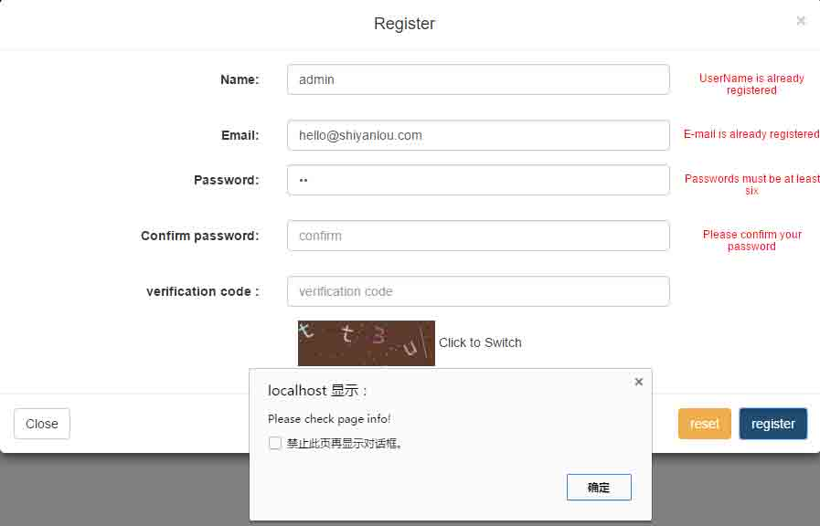
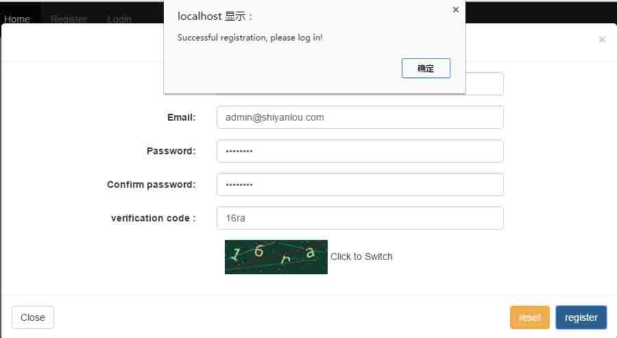
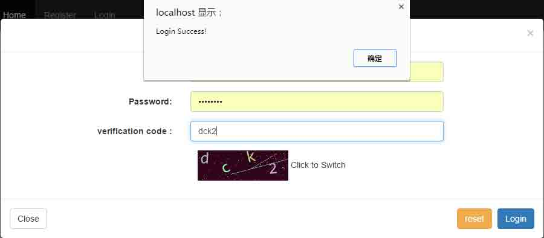

# 第 3 节 实现注册登陆功能

## 一、实验简介

### 1.1 实验目的

本次实验将接着上次实验继续进行。利用 OOP 思想封装注册和登陆的后台逻辑，与前台配合实现注册登陆功能。

### 1.2 涉及到知识点

*   PHP
*   mysqli 扩展
*   session 会话

### 1.3 开发工具

*   sublime，一个方便快速的文本编辑器。点击桌面左下角： 应用程序菜单/开发/sublime。

*   mysql，使用下面的命令开启服务：

    ```php
    $ sudo service mysql start
    # 自行建立 web 数据库，users 表：id，username，email，password
    # 可使用以下 SQL 语句建立数据表:
    CREATE TABLE users(
    id INT NOT NULL PRIMARY KEY AUTO_INCREMENT,
    username VARCHAR(20) NOT NULL,
    email VARCHAR(50) NOT NULL,
    password CHAR(32) NOT NULL
    ); 
    ```

*   开启服务器：

    ```php
    $ php -S localhost:80 #若启动失败，可将端口号换为 8080 
    ```

## 二、实现注册功能

### 2.1 建立文件

在 admin 目录下建立 Register.php 作为后台登陆处理程序，稍后我们将会在其中封装具体的注册逻辑。

同时修改首页中注册表单的提交地址。

```php
<form action="admin/Register.php" method="post" accept-charset="utf-8" class="form-horizontal"> 
```

新建配置文件，因为要使用到数据库，需要使用一些连接参数。我们可以单独建立一个配置文件，把这些参数都定义好。

在 web 目录下建立一个 config.php 文件，这就是我们的配置文件了，先定义一些数据库的连接参数：

```php
<?php
session_start();    //开启 session，在其他位置引用时可以自动开始
define('DB_HOST', '127.0.0.1');
define('DB_NAME', 'web');
define('DB_USER', 'root');
define('DB_PWD', ''); 
```

前提是你在数据库里已经建立好了 `web` 数据库和 `users` 表。

### 2.2 逻辑编码

*   定义类并添加属性和构造方法：

    ```php
    <?php 
    /**
    * register
    */
    class Register
    {
      private $username; //用户名
      private $db;   //数据库实例
      private $email;    //邮箱
      private $pwd;  //密码
      private $con;  //确认密码
      private $code; //验证码
      function __construct()
      {
          if (!isset($_POST['type'])) {  //  若不是通过 post 方式访问，则返回
              echo "<script>alert('You access the page does not exist!');history.go(-1);</script>";
              exit();
          }
          require '../config.php';    //引入配置文件
          $this->db = new mysqli(DB_HOST,DB_USER,DB_PWD,DB_NAME) or die('数据库连接异常');   //实例化 mysqli 连接
      }
    } 
    ```

*   判断用户名唯一性（结合前端 Ajax）

    ```php
     public function uniqueName()
      {
        //判断是否是通过 ajax 方式提交数据
          if(isset($_SERVER['HTTP_X_REQUESTED_WITH']) ) {
              if('xmlhttprequest' == strtolower($_SERVER['HTTP_X_REQUESTED_WITH'])){
                  $this->username = $_POST['username'];  //接受 post 的用户名
                  $sql = "SELECT count(*) FROM users WHERE username = '".$this->username."'";        //构造查询语句
                  $count = mysqli_fetch_row($this->db->query($sql))[0];//获取结果集中索引为 0 的值
                  if ($count) {  //$count 不为 0，则存在相同的用户名
                      echo "1";
                  }else{
                      echo "0";
                  }
              }else{  //不是 ajax 方式
                  echo "hello world";
              }
          }else{  //不是 ajax 方式
              echo "hello world";
          }
      } 
    ```

*   判断邮箱唯一性（结合前端 Ajax）

    ```php
     public function uniqueEmail()
      {
          if(isset($_SERVER['HTTP_X_REQUESTED_WITH']) ) {
              if('xmlhttprequest' == strtolower($_SERVER['HTTP_X_REQUESTED_WITH'])){
                  $this->email = $_POST['email'];
                  $sql = "SELECT count(*) FROM users WHERE email = '".$this->email."'";
                  $count = mysqli_fetch_row($this->db->query($sql))[0];
                  if ($count) {
                      echo "1";
                  }else{
                      echo "0";
                  }
              }else{
                  echo "hello world";
              }
          }else{
              echo "hello world";
          }
      } 
    ```

*   检测验证码

    ```php
     public function checkCode()
      {
        //判断输入的验证码是否与 session 中的验证码一致
          if ($this->code != $_SESSION['code']) {
              echo "<script>alert('Verification code is not correct.please try again!');history.go(-1);</script>";
              exit();
          }
      } 
    ```

*   检测邮箱格式（正则）

    ```php
     public function checkEmailFormat()
      {
          $pattern = "/^([0-9A-Za-z\\-_\\.]+)@([0-9a-z]+\\.[a-z]{2,3}(\\.[a-z]{2})?)$/i";
          if (!preg_match($pattern,$this->email)) {
              echo "<script>alert('Email format incorrect.please try again!');history.go(-1);</script>";
              exit();
          }
      } 
    ```

*   用户名格式（长度）

    ```php
     public function checkNameFormat()
      {
          $length = strlen($this->username);
          if (trim($this->username) == '' || $length < 2 || $length > 20) {
              echo "<script>alert('UserName format incorrect.please try again!');history.go(-1);</script>";
              exit();
          }
      } 
    ```

*   检测密码

    ```php
     public function checkPwd(){
      //密码不能为空格,长度介于 6 至 20 之间
          if (trim($this->pwd) == '' || strlen($this->pwd) < 6 || strlen($this->pwd) > 20) {
              echo "<script>alert('PassWord format incorrect.please try again!');history.go(-1);</script>";
              exit();
          }
        //确认密码必须与密码保持一致
          if ($this->pwd != $this->con) {
              echo "<script>alert('Confirm password do not match.please try again!');history.go(-1);</script>";
              exit();
          }
      //加密密码
          $this->pwd = md5($this->pwd);
      } 
    ```

*   执行注册操作

    ```php
     public function doRegister()
      {
          $this->email = $_POST['email'];        //接受参数
          $this->username = $_POST['username'];
          $this->code = $_POST['code'];
          $this->pwd = $_POST['password'];
          $this->con = $_POST['confirm'];
          $this->checkCode(); //检测数据
          $this->checkPwd();
          $this->checkNameFormat();
          $this->checkEmailFormat();
          $sql = "INSERT INTO users (username, email, password) VALUES ('".$this->username."','".$this->email."','".$this->pwd."')";
          $result = $this->db->query($sql);      //将数据录入数据库
          if ($result) {
              $this->db->close();        //不要忘记关闭数据库连接
              echo "<script>alert('Successful registration, please log in!');location.href = '/';</script>";
              exit();
          }else{
              echo $this->db->error;
              exit();
          }
      } 
    ```

    看到这里，你可能会有些疑惑，前端的输入数据我们已经通过 `js`做了格式检测,，为什么这里还要做相同的检测？

    这涉及到一点网络安全的知识。设计 web 应用时，一定要牢住的一条准则就是：** 永远不要相信客户端的输入 ** ！前端 js 检测设计得再好，在有技术基础的人面前，都形同虚设。所以，不要指望你写的那点 js 能真正对数据过滤有多大的作用，那只适用于普通用户和技术小白而已。

*   判断请求数据类型

    如果你对注册页面还有印象的话，应该知道，我们提交的数据可以有三种类型。其中两种是通过 Ajax 提交，一种是通过表单页面提交，所以在设计的时候，我添加了一个 `type` 的参数以区别是哪种数据的提交。所以我们在执行相关操作之前需要加以判断：

    ```php
    $reg = new Register();    //先实例化注册类
    switch ($_POST['type']) {    //根据传递的 type 执行对应操作
      case 'name':    //ajax 方式提交的用户名唯一性检测
          $reg->uniqueName();
          break;
      case 'email':   //ajax 方式提交的邮箱唯一性检测
          $reg->uniqueEmail();
          break;
      case 'all':     //通过表单提交的注册操作
          $reg->doRegister();
          break;
      default:
          echo "hello world";
          break;
    } 
    ```

### 2.3 前端修改

*   修改 js 脚本

    将用户名和邮箱的 ajax 请求地址稍作修改：

    ```php
    //用户名唯一性检测
    $.post('admin/Register.php', {username: $(this).val(),type:'name'}, function(data, textStatus, xhr) {
    *****
    }
    //邮箱唯一性检测
    $.post('admin/Rregister.php', {email: $(this).val(),type: 'email'}, function(data, textStatus, xhr) {
    *****
    } 
    ```

*   修改注册表单提交地址

    ```php
    <form action="admin/Register.php" method="post" accept-charset="utf-8" class="form-horizontal"> 
    ```

*   向注册表单添加一项 `type` 的输入标签,表示这是注册表单提交：

```php
<input type="hidden" name="type" value="all"> 
```

## 三、实现登陆功能

和注册功能类似，登陆功能也可以封装成为一个登陆类，其中主要的方法有以下几个：

*   检查验证码
*   检查邮箱格式和密码格式
*   检查用户是否存在
*   执行登陆操作

### 3.1 封装登陆类

*   首先在 admin 目录下建立一个 Login.php 作为登陆处理文件。定义类，添加属性和构造方法：

    ```php
    <?php 
    /**
    * login
    */
    class Login
    {
      private $email;    //登陆邮箱
      private $password; //登陆密码
      private $code; //验证码
      function __construct()
      {
          if (!isset($_POST['login'])) { //非 post 方式提交不被接受
              echo "<script>alert('You access the page does not exist!');history.go(-1);</script>";
              exit();
          }
          require '../config.php';    //引入配置文件
          $this->email = $_POST['email'];
          $this->password = $_POST['password'];
          $this->code = $_POST['code'];
      }
    } 
    ```

*   检查登录邮箱格式(同上注册方法)

*   检查密码格式

    ```php
    //验证密码格式
    public function checkPwd()
      {
          if (!trim($this->password) == '') {
              $strlen = strlen($this->password);
              if ($strlen < 6 || $strlen > 20) {
                  echo "<script>alert('Password length of illegal.please try again!');history.go(-1);</script>";
                  exit();
              }else{
                  $this->password = md5($this->password);
              }
          }else{
              echo "<script>alert('Password cannot be blank.please try again!');history.go(-1);</script>";
              exit();
          }
      } 
    ```

*   检查验证码（同上注册）

*   检查用户是否存在

    ```php
    //数据库验证
    public function checkUser()
      {
          $db = new mysqli(DB_HOST,DB_USER,DB_PWD,DB_NAME) or die('数据库连接异常');
          $sql = "SELECT username FROM users WHERE email = '".$this->email."' and password = '".$this->password."'";
          $result = mysqli_fetch_row($db->query($sql))[0];
          if (!$result) {        //不存在，登陆失败
              echo "<script>alert('Email or password is incorrect.please try again!');history.go(-1);</script>";
              exit();
          }else{      //用户存在，登陆成功
              $_SESSION['user'] = $result;  //将用户名保存到 session 会话中
              $db->close();       //不要忘记关闭数据库连接
        //输出登陆成功信息，并跳转到主页（这里暂时为登陆和注册首页）
              echo "<script>alert('Login Success!');location.href = '/index.php'</script>";
              exit();
          }
      } 
    ```

*   执行以上操作：

    ```php
     public function doLogin()
      {
          $this->checkCode();
          $this->checkMail();
          $this->checkPwd();
          $this->checkUser();
      } 
    ```

*   调用登陆类

    ```php
    $login = new Login();
    $login->doLogin(); 
    ```

*   修改登陆表单提交地址

    ```php
    <form action="admin/Login.php" method="post" accept-charset="utf-8" class="form-horizontal"> 
    ```

## 四、功能测试

现在当你在注册页面输入用户名和邮箱时，便可做出动态响应。

**输入有误：**



**注册成功：**



**登陆成功：**



## 五、完善

到目前为止，简单的用户注册登陆功能就基本实现了。不过尚有很多不足。比如跳转的用户主页没有设计，还可以添加一个 **记住我** 的功能，页面查看的权限（是否登录），提高代码复用率等等。我们将会在下一个实验继续完善我们的项目。