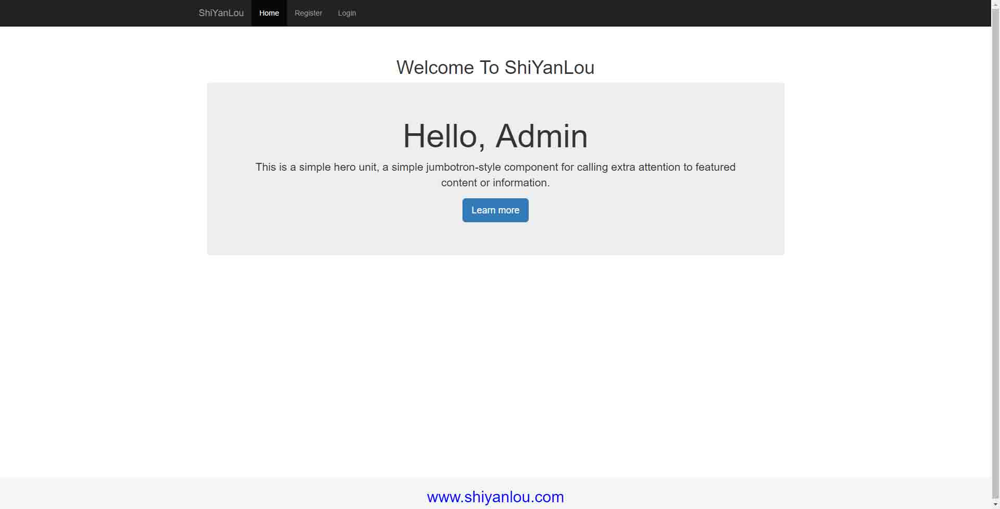
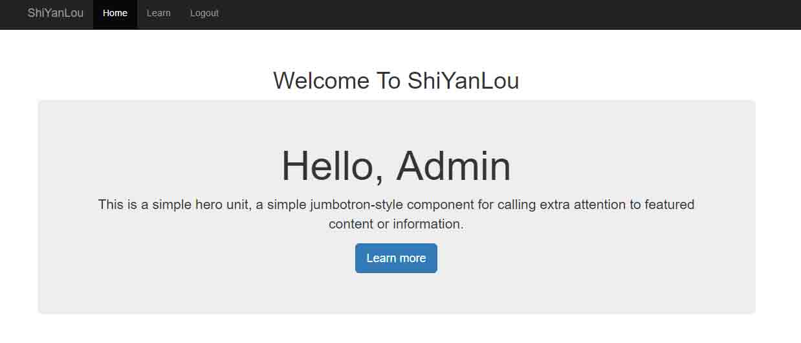
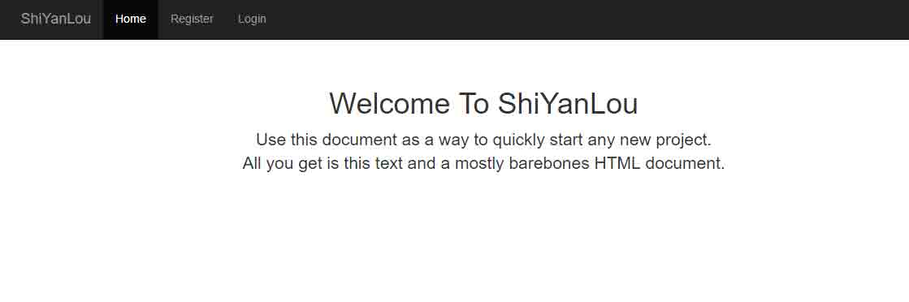

# 第 4 节 功能完善

## 一、实验简介

### 1.1 完善功能

*   html 复用
*   建立用户主页
*   使用 cookie 记住我
*   浏览页面限制

### 1.2 开发工具

*   sublime，一个方便快速的文本编辑器。点击桌面左下角： 应用程序菜单/开发/sublime。

*   mysql，使用下面的命令开启服务：

    ```php
    $ sudo service mysql start        # 使用上一个实验建立的数据库和数据表 
    ```

*   开启服务器：

    ```php
    $ php -S localhost:80 #若不能启动成功，可将端口号换为 8080 
    ```

## 二、前端优化

### 2.1 HTML 复用

查看 index.php 代码，我们可以把整个网页分为三大区域：头部（header）、导航栏（nav）、主体（container）、底部（footer）。其中头部，导航栏和底部基本是每个页面都需要使用到的部分，只有主体的内容会发生变化。所以我们可以想办法把 header nav 和 footer 提取出来，作为单独的部件，index 页面通过引入文件的方式再把他们引入到自身。这样一来，提取出来的 header nav 和 footer 也可以供其他需要的页面使用而不用单独在每个页面上都手写一份。这种方式类似于模板布局。

首先在 public 目录下建立一个 layouts 的目录，用于存放提取出来的部件。在其下建立 header.php ，nav.php， footer.php。

将 index.php 中的相应代码剪切进来：

*   header.php

    ```php
    <head>
      <meta charset="utf-8">
      <meta http-equiv="X-UA-Compatible" content="IE=edge">
      <meta name="viewport" content="width=device-width, initial-scale=1">
      <!-- 上述 3 个 meta 标签*必须*放在最前面，任何其他内容都*必须*跟随其后！ -->
      <meta name="description" content="">
      <meta name="author" content="">
      <link rel="icon" href="public/img/favicon.ico">

      <title>web page</title>

      <!-- Bootstrap core CSS -->
      <link href="//cdn.bootcss.com/bootstrap/3.3.5/css/bootstrap.min.css" rel="stylesheet">

      <!-- Custom styles for this template -->
      <link href= "public/css/start.css" rel="stylesheet">
      <link rel="stylesheet" type="text/css" href="public/css/footer.css">
    </head> 
    ```

*   nav.php

    ```php
     <nav class="navbar navbar-inverse navbar-fixed-top">
        <div class="container">
          <div class="navbar-header">
            <button type="button" class="navbar-toggle collapsed" data-toggle="collapse" data-target="#navbar" aria-expanded="false" aria-controls="navbar">
              <span class="sr-only">Toggle navigation</span>
              <span class="icon-bar"></span>
              <span class="icon-bar"></span>
              <span class="icon-bar"></span>
            </button>
            <a class="navbar-brand" href="#">ShiYanLou</a>
          </div>
          <div id="navbar" class="collapse navbar-collapse">
            <ul class="nav navbar-nav">
              <!-- 这里做了修改 -->
              <li class="active"><a href="#">Home</a></li>
              <li><a href="#Register" data-toggle="modal" data-target="#register">Register</a></li>
              <li><a href="#Register" data-toggle="modal" data-target="#login">Login</a></li>
            </ul>
          </div><!--/.nav-collapse -->
        </div>
      </nav> 
    ```

*   footer.php

    ```php
    <!-- 网页底部 -->
    <footer class="footer">
    <div class="container">
      <p class="text-muted">
      <h2><a href="http://www.shiyanlou.com" title="www.shiyanlou.com" style="color: blue;">www.shiyanlou.com</a></h2>
      </p>
    </div>
    </footer> 
    ```

在 index.php 中引入对应文件：

```php
<!DOCTYPE html>
<html lang="zh-CN">
  <!-- header 部分 -->
  <?php require_once 'public/layouts/header.php' ?>

  <body>
  <!-- 导航栏 -->
  <?php require_once 'public/layouts/nav.php' ?>
  <!-- 页面主体内容 -->
    <div class="container">
        <!-- 表单部分（略） -->
       </div><!-- /.container -->

    <!-- 网页底部 -->
    <?php require_once 'public/layouts/footer.php'; ?>

    <!-- Bootstrap core JavaScript
    ================================================== -->
    <!-- Placed at the end of the document so the pages load faster -->
    <script src="//cdn.bootcss.com/jquery/1.11.3/jquery.min.js"></script>
    <script src="//cdn.bootcss.com/bootstrap/3.3.5/js/bootstrap.min.js"></script>
    <script src="public/js/check.js"></script>
  </body>
</html> 
```

上面用到了一个函数：[require*once*](http://php.net/manual/zh/function.require-once.php) ，那就有必要了解一下 [require](http://php.net/manual/zh/function.require.php)、[requireonce](http://php.net/manual/zh/function.require-once.php)、[include](http://php.net/manual/zh/function.include.php)、[include_once](http://php.net/manual/zh/function.include-once.php) 的区别。

> require： 和 [include](http://php.net/manual/zh/function.include.php) 几乎完全一样，除了处理失败的方式不同之外。**require** 在出错时产生 **E*COMPILE*ERROR** 级别的错误。换句话说将导致脚本中止而 [include](http://php.net/manual/zh/function.include.php) 只产生警告 **E*WARNING***），脚本会继续运行。 > > requireonce：和 [require](http://php.net/manual/zh/function.require.php) 语句完全相同，唯一区别是 PHP 会检查该文件是否已经被包含过，如果是则不会再次包含。 > > include：同上 require。 > > include_once ：在脚本执行期间包含并运行指定文件。此行为和 [include](http://php.net/manual/zh/function.include.php) 语句类似，唯一区别是如果该文件中已经被包含过，则不会再次包含。如同此语句名字暗示的那样，只会包含一次。

再次打开网页，你会发现没有任何变化。说明我们的操作是成功的。

### 2.2 建立用户主页

我们往往更希望把用户的主页作为 index.php ,那我们就把之前那个首页文件重命名为 welcome.php 作为欢迎界面。新建一个 index.php 文件作为用户主页。我们还是可以沿用 welcome.php 的风格样式。所以，把 2.1 中的 index.php 的代码复制到现在的 index.php 中，把表单部分去掉，添加用户首页需要展示的内容：

```php
<?php 
session_start();
?>
<!DOCTYPE html>
***
***
<!-- 页面主体内容 -->
    <div class="container">
      <div class="content">
          <div class="starter-template">
             <!-- 这里做了修改，其他地方自由发挥 -->
            <h1>Welcome To ShiYanLou</h1>
            <div class="jumbotron">
              <!-- 打印用户名 -->
              <h1>Hello, <?php echo $_SESSION['user']; ?>！</h1>
              <p>This is a simple hero unit, a simple jumbotron-style component for calling extra attention to featured content or information.</p>
              <p><a class="btn btn-primary btn-lg" href="http://www.shiyanlou.com" role="button">Learn more</a></p>
            </div>
          </div>  
      </div>
    </div><!-- /.container --> 
```

这里我在主体内容中使用了 bootstrap 中的 [巨幕](http://v3.bootcss.com/components/#jumbotron) 组件，并将登录用户的用户名打印出来，由于使用了 session ,所以我们需要在顶部首先开启 session：



### 2.3 浏览限制与细节处理

index.php 作为我们的用户主页，应该只能允许已登录的用户查看。如果用户未登陆，我们应该将其跳转到 welcome.php 让用户注册或登陆。如果用户已经登陆的，那么只能让他进入主页中去，而不能让他再次进入 welcome.php 中去登陆或者注册。因此我们需要对用户做一些浏览限制：

在 index.php 顶部的 php 代码段单继续添加如下代码：

```php
//未登录，跳转至欢迎界面
if (!isset($_SESSION['user'])) {
  header('location:welcome.php');
  exit();   //防止继续执行
} 
```

在 welcome.php 顶部添加 php 代码：

```php
<?php 
    session_start();    //首先要开始 session
    //已登录，跳转至主页
  if (isset($_SESSION['user'])) {
    header('location:index.php');
    exit();
  }
 ?> 
```

细心的你可能已经注意到了，在我们的用户主页的导航栏上，还有 register 和 login 的按钮，这是不因该在主页上出现的。所以我们需要修改导航栏部分的展示效果。

```php
 <nav class="navbar navbar-inverse navbar-fixed-top">
      <div class="container">
        <div class="navbar-header">
          <button type="button" class="navbar-toggle collapsed" data-toggle="collapse" data-target="#navbar" aria-expanded="false" aria-controls="navbar">
            <span class="sr-only">Menu</span>
            <span class="icon-bar"></span>
            <span class="icon-bar"></span>
            <span class="icon-bar"></span>
          </button>
          <a class="navbar-brand" href="/">ShiYanLou</a>
        </div>
        <div id="navbar" class="collapse navbar-collapse">
          <ul class="nav navbar-nav">
          <li class="active"><a href="#">Home</a></li>
          <?php 
              if (!isset($_SESSION['user'])) {
           ?>
            <li><a href="#Register" data-toggle="modal" data-target="#register">Register</a></li>
            <li><a href="#Register" data-toggle="modal" data-target="#login">Login</a></li>
            <?php
               }else{ 
             ?>
              <li><a href="http://www.shiyanlou.com" >Learn</a></li>
              <li><a href="admin/Logout.php" >Logout</a></li>
            <?php
               } 
             ?>
          </ul>
        </div><!--/.nav-collapse -->
      </div>
    </nav> 
```

我在上面的导航栏部分，添加了判断条件，如果已经登陆进入了用户主页，则像是 Learn 和 Logout 按钮。否则用户现在处于欢迎界面，就应该显示 Register 和 Login 按钮。

这里需要使用登出的方法，所以我们现在应该在 admin 新建一个 Logout.php 文件来完成登出的功能。

Logout.php:

```php
<?php 
session_start();
unset($_SESSION['user']);
echo "<script>alert('You hava logouted!');location.href = '/welcome.php'</script>"; 
```

现在，我们的细节和浏览限制已经完成了。如果你还觉得有什么不足之处，你可以继续完善。





## 三、实现记住我功能

我们经常在登陆的时候会看到这个选项，使用这个选项，只要不清除浏览器数据，下次访问网站时可以自动登陆，这是非常方便的一个功能。之所以这个功能放到这里来实现，是因为这个选项不是必须的，对于一些对安全要求比较高的网站，是不提供这个功能。比如淘宝等。使用 cookie 实现自动登录具有一定的安全风险，如果在真实的项目中对 cookie 的处理一定要谨慎，对于一般的网站则不需要考虑太多。我们之前实现的那些功能都是比较通用的。接下来我们可以把自动登录的功能加入到我们的项目中。

*   首先，在登陆表单添加 Remember Me 选项(默认 yes)：

    ```php
    <div class="form-group">
    <label for="password" class="col-sm-4 control-label">Remember Me:</label>
    <div class="col-sm-3">
      <label class="checkbox-inline">
        <input type="radio" name="rem" id="yes" value="1" checked> Yes
      </label>
      <label class="checkbox-inline">
        <input type="radio" name="rem" id="no" value="0"> No
      </label>
    </div>
    </div> 
    ```

*   其次，修改后台登陆处理程序：

    ```phpphp private $rem; //添加记住我私有属性

* * *

$this->rem = $_POST['rem']; //构造方法中获取记住我参数

//在登陆成功之后，跳转页面之前添加判断，若 记住我，则将标识保存到 session 中 if ($this->rem == 1) { $_SESSION['rem'] = '1'; } ```

这里可能有人会有疑惑，为什么不在这里直接使用 [setcookie()](http://php.net/manual/zh/function.setcookie.php) 函数，而是保存到 session 中。如果你在这里设置了 cookie，打开浏览器，使用开发者工具查看网络请求，你就会发现，从登陆成功再到跳转至用户主页的过程中，访问 `index.php` 的请求 `header` 部分中的 `Request Headers` 中包含了你刚才设置的 cookie ，而不是在 `Response Header` 中,很明显，当我们关闭了浏览器，这个 cookie 就不存在，就不存在了。更多的关于 `response cookie` 和 `request cookie` 的区别，可以到网上去查阅相关的资料。

*   生成 cookie 并自动登陆：

    修改 index.php 上方 php 代码：

    ```php
    if (!isset($_SESSION['user'])) {    //未登录
    if (isset($_COOKIE['user'])) {    //是否存在 cookie
      $_SESSION['user'] = $_COOKIE['user'];    //存在，自动登陆
    }else{
      header('location:welcome.php');     //不存在，跳转至欢迎界面
    }
    }
    if (isset($_SESSION['rem'])) {        //如果 session 中有 记住我 的标识，则在本页面生成用户名的 cookie，有效时间为一个小时（可以调节）
    setcookie('user',$_SESSION['user'],time()+3600);
    unset($_SESSION['rem']);    //清除本条 session
    } 
    ```

*   清除 cookie ：

    既然上面生成了 cookie ，那么当我们进行登出操作时，就应该将其清理掉。所以在 Logout.php 中添加一句代码：

    ```php
    unset($_COOKIE['user']); 
    ```

    OK ！现在我们的项目已经实现了`记住我` 这样一个功能。基本上完成了本次项目的全部功能。

## 四、总结

本课程通过四次实验操作，带领大家从页面制作到最后的功能完善，既学到了前端的知识，也对后端技术有了一定的了解。这也是成为一名合格的 PHP 程序员所必须掌握的本领。相信通过本次课程的学习，大家以后自己搭建网站的时候，可以很轻松的实现用户注册登陆模块的功能。当然，因为作者的能力有限，文档中难免会有这样那样的不足之处，一些构思或者实现方法可能不是最优的，也欢迎各位在课程评论中指出。

## 五、源码下载

```php
http://labfile.oss.aliyuncs.com/courses/587/web.tar 
```