# ThinkPHP 框架实践

ThinkPHP 是国人开发的优秀 PHP 框架，本课将从 ThinkPHP 的入门安装开始，详细讲解 ThinkPHP 的配置，路由，控制器，模型，视图，模版等几大板块，掌握 ThinkPHP 的主要技术点。

## ThinkPHP 的安装和设置

`前提：此教程适用于 ThinkPHP 3.2+`

## 实验简介

本节实验课程主要学习 ThinkPHP 的安装与配置。

## 1.安装

实验楼内下载地址：

```php
http://labfile.oss.aliyuncs.com/courses/352/ThinkPHP.zip 
```

下载完成之后，用 zip 命令行解压：

```php
cd /home/shiyanlou
wget http://labfile.oss.aliyuncs.com/courses/352/ThinkPHP.zip
unzip ThinkPHP.zip 
```

解压后会得到一个叫 ThinkPHP 的文件夹，里面包含了 ThinkPHP 相关的程序文件以及创建数据表所需的 sql 文件：

```php
cd /home/shiyanlou/ThinkPHP
ls -l 
```

启动 mysql 服务，准备好导入数据表：

```php
sudo service mysql start 
```

默认情况下登录 mysql 不需要输入密码：

```php
mysql -u root 
```

创建数据库`think`，在 mysql 提示符下执行：

```php
create database think; 
```

切换到`think`数据库：

```php
use think; 
```

导入数据：

```php
source /home/shiyanlou/ThinkPHP/think.sql; 
```

退出 mysql 提示符状态只需要输入`quit`回车，或按组合键`Ctrl + D`即可

以上几个安装步骤也可以合并起来，通过一句话脚本来完成：

```php
curl -s http://labfile.oss.aliyuncs.com/courses/352/install_thinkphp.sh | sh 
```

至此 ThinkPHP 的安装就已经完成了，且前期数据准备也完毕了，正式进入课程。

**以下的安装方式来自于官方文档，作为用户本地搭建环境的参考（实验楼已配置环境，无需操作）**

安装 ThinkPHP 的方法很多，你可以直接到[ThinkPHP 的官网](http://www.thinkphp.cn/down/framework.html)去下载，下载完之后直接解压就可以了；或者你也可以到 ThinkPHP 官方维护的 Git 地址下载

1.  Github： https://github.com/liu21st/thinkphp
2.  Oschina： http://git.oschina.net/liu21st/thinkphp.git
3.  Code： https://code.csdn.net/topthink2011/ThinkPHP

当然，作为一个流行的 PHP 框架，你也可以直接用 composer 来安装：

```php
composer create-project topthink/thinkphp your-project-name 
```

## 2\. 设置

我们现在开始学习 ThinkPHP 第一步：设置 ThinkPHP。一个框架的原始模样可能无法满足你的开发需求，但你可以通过设置来满足。在学习 ThinkPHP 的配置的时候，首先要明白：ThinkPHP 框架中所有配置文件的定义格式都是采用返回 PHP 数组的方式来定义的。

我们最常操作的是应用配置，默认的就是在`Application/Common/Conf/config.php`文件中：

```php
<?php

return array(
    'URL_ROUTER_ON'   => true,
    'URL_ROUTE_RULES'=>array(

    'blogs/:id'               => array('Index/read'),
    'article/:id'               => array('Article/show')
),
    'URL_MAP_RULES'=>array(
    'new/top' => 'Index/top?type=top'
),

    'DB_TYPE'               =>  'mysql',
    'DB_HOST'               =>  'localhost',
    'DB_NAME'               =>  'think',
    'DB_USER'               =>  'root',
    'DB_PWD'                =>  '',
    'DB_PORT'               =>  '3306',
    'DB_PREFIX'             =>  'think_',

); 
```

说明：ThinkPHP 的配置参数（一级参数）是不区分大小写的，因为不管大写小写，最后都会转为小写。但是为了在编程的过程中更符合规范，建议统一使用大写来设置配置参数。上面的第一个配置`URL_ROUTER_ON`，我们开启了路由重写功能，为后面的 `URL_ROUTE_RULES` 奠定基础（详细的后面我们会在路由章节说到）。最后几个带 DB_ 的设置项是表示设置连接数据库的参数，几乎每一个 web 应用都会用到数据库，这些设置为我们后续进一步学习的基础。

```php
<?php

 return array(
    'USER_CONFIG'        => array(
        'USER_AUTH' => true,
        'USER_TYPE' => 2,
    ),
); 
```

如上面的`USER_CONFIG`下的`USER_AUTH`和`USER_TYPE`是区分大小写的。 这个只是示例，如果在项目中真的需要二级配置，请区分大小写，这些配置也是在`Application/Common/Conf/config.php`中配置的。

了解了 ThinkPHP 的配置格式后，我们再看看 ThinkPHP 的配置加载顺序，理解配置项的加载顺序在开发的时候很重要，因为在同名的配置下，`后加载的配置会覆盖前面加载的顺序，而生效的只有后加载的顺序`。

```php
惯例配置->应用配置->模式配置->调试配置->状态配置->模块配置->扩展配置->动态配置 
```

上面的顺序就是 ThinkPHP 的配置加载顺序，而在一般情况下，这些配置都是自动加载的。我们最常操作的是应用配置，默认的就是在`Application/Common/Conf/config.php`文件中。在开发的时候我们可以在这里设置自己的配置，如果你不熟悉你可以配置什么值，你可以打开`ThinkPHP/Conf/convention.php`文件来查看相对应的配置项

### 3.读取配置

在开发的过程中，我们有时候需要读取应用的配置值，在 ThinkPHP 中统一使用`C('配置参数名')`来读取配置。比如：

```php
$model = C('URL_MODEL'); 
```

或者

```php
$model = C('url_model'); 
```

这两个是等效的，都是可以读取到系统的`URL 访问模式`的设置值，因为在 ThinkPHP 的配置项是不分大小写的。但是建议统一使用大写方式。

`可以利用 config 首字母来记忆 C()方法。`

## 作业：

查看`ThinkPHP/Conf/convention.php`的内容，对其中的配置项进行初步了解

## 参考文档：

本实验课程基于 ThinkPHP 的官方文档：

http://document.thinkphp.cn/manual*3*2.html#start

## 实验简介

本节实验课程主要学习 ThinkPHP 的路由的定义和规则路由，正则路由和静态路由的用法。

### 实验环境初始化

本实验与前一节具有连续性，如果是直接开始本实验，则需要对实验环境进行初始化，部署安装 ThinkPHP。直接执行初始化脚本：

```php
curl -s http://labfile.oss.aliyuncs.com/courses/352/install_thinkphp.sh | sh - 
```

## 路由 (Routes)

有了基本配置，我们就可以来访问我们的应用默认首页了。进入到项目目录，可以直接使用 PHP 内置服务器来开始访问，比如：

```php
cd /home/shiyanlou/ThinkPHP
php -S localhost:8999 
```

浏览器输入 localhost:8999 就可以看到 ThinkPHP 的默认首页了：一个笑脸。

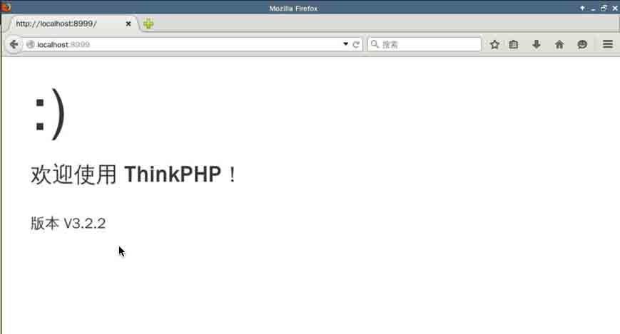

在这里，我们访问到的是 ThinkPHP 自带的默认入口文件`index.php`也就是访问到的是`IndexController`的`index()`方法，这是因为 ThinkPHP 默认设置：

```php
'DEFAULT_CONTROLLER'    =>  'Index' 
```

如果你查看过`ThinkPHP/Conf/convention.php`文件，应该就会明白这个其实就是设置默认的控制器。

`关于控制器(Controller)我们后面会仔细说，控制器的文件位于 Application/Home/Controller` 文件夹之下

了解这些基本知识之后，那么如果我们需要访问其它的页面，访问其他的控制器和方法呢？答案就在本节的路由教程中。

## 路由定义规则

在使用路由之前，确保你的 URL 支持`PATH_INFO`（或者兼容 URL 模式也可以，采用普通 URL 模式的情况下不支持路由功能）并且确认已开启一下的路由设置：

```php
'URL_ROUTER_ON'   => true 
```

这里涉及到两个设置项，`PATH_INFO`和`URL_ROUTER_ON`，这些在`ThinkPHP/Conf/convention.php`文件都可以找到。 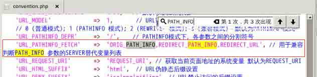 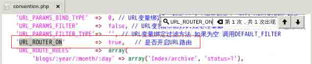

在满足以上两个条件之后，就可以配置路由规则了。在配置文件中使用`URL_ROUTE_RULES`参数进行配置，配置格式是一个数组，其格式为： `'路由表达式'=>'路由地址和传入参数'`每个元素都代表一个路由规则，比如：

```php
'URL_ROUTE_RULES'=>array(
    'blogs/:year/:month/:day' => array('Index/archive', 'status=1'),
    'blogs/:id'               => 'Index/read',
), 
```

如图： 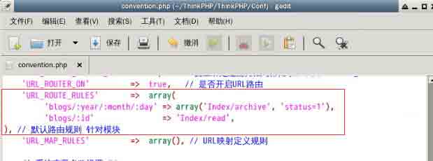 ThinkPHP 按定义的顺序依次匹配路由规则，一旦匹配到的话，就会定位到路由定义中的控制器和操作方法去执行（你可以传入其他的参数），`而后面的规则不会继续匹配`

以上的路由配置说明：在每个路由表达式中，`:`后面跟参数名称，比如上面的`:year`,`:month`,`:id`都是参数名称，以`:id`为例，它指向`Index`控制器的`read`方法，这个方法接受一个`$id`的参数：

```php
public function read($id){
        echo "read page with" .$id;
    } 
```

`你需要在 IndexController 中添加上面的代码，IndexController 位于 Application/Home/Controller 之下`

在浏览器输入`http://localhost:8999/index.php/Home/blogs/2`就可以看到 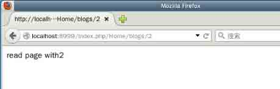

`Home`就代表`Home`模块，你可以简单地将它映射到相应的`Home`目录，这是由于在默认的配置中

```php
'DEFAULT_MODULE'        =>  'Home' 
```

你可以根据自己的需求修改，但本课依旧采用默认的`Home`模块.

如果你还需要传人额外的参数，像第一条的规则`array('Index/archive', 'status=1')`中的`status`一样传入，你看设置多个这样的参数。

如果你尝试在浏览器输入：

```php
http://localhost:8999/index.php/Home/blogs/string 
```

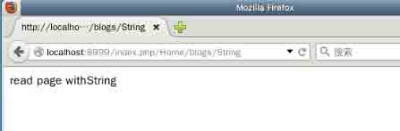

ThinkPHP 也给我们返回了`string`，但在日常的开发中，我们通常需要限制`:id`变量是整数，那该怎么做呢？只需要稍稍改动就可以了，写成

```php
'blogs/:id\d'               => 'Index/read', 
```

以上`\d`表示限制变量`id`只能是数字。

对于可选参数，可以用`[]`包含表示，比如：

```php
'blogs/:year/:month/[:day]' => array('Index/archive', 'status=1'), 
```

上面的`day`现在就是可选参数了，你可以传入，也可以不传。

在 ThinkPHP 中，还支持在限制路由的后缀和使用正则路由。

限制路由后缀，通常使用在平时常见的 html,htm 等后缀，还是以上面的规则为例：

```php
'blogs/:id'               => array('Index/read',array('ext'=>'html')) 
```

你就可以限制这条规则只能在`.html`的路由后缀生效。

## 正则路由

正则本身就是一门很大的学问，在学习 ThinkPHP 的正则路由之前，最好是具备一定的正则表达式的基础。

路由表达式支持的正则定义必须以`/`开头，否则就视为规则表达式，比如：

```php
'#^blog\/(\d+)$#' => 'Index/read' 
```

这会解析为`规则路由`而不是`正则路由`，因为路由表达式并没有以`/`开始，所以，我们需要这样写：

```php
'/^new\/(\d{4})\/(\d{2})$/' => 'Index/achive?year=:1&month=:2', 
```

以上就是一条正确的正则路由。对于正则表达式中的每个正则规则子模式）部分(如`\d{4}`和`\d{2}`)，如果需要在后面的路由地址中引用，可以采用`:1`、`:2`这样的方式，序号就是子模式的序号

## 静态路由

ThinkPHP 框架其实还有一个路由机制叫`静态路由`，这实际上就是规则路由的静态简化版，路由定义中不包含动态参数(如上面的路由规则中`id`参数)，静态路由不需要遍历路由规则而是直接定位，因此执行效率会较高。静态路由采用`URL_MAP_RULES`来定义规则：

```php
'URL_ROUTER_ON'   => true,
'URL_MAP_RULES'=>array(
    'new/top' => 'Index/top?type=top'
) 
```

如图：

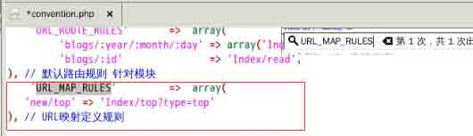

由于`Index/top?type=top`中`Index`表示控制器，第一个`top`表示方法，所以我们需要在`Index`控制器中创建`top()`方法：

```php
public function top(){
        echo "top page </br>";
    } 
```

`你需要在 IndexController 中添加上面的代码，IndexController 位于 Application/Home/Controller 之下`

根据上面这条规则，如果我们访问到

```php
http://localhost:8999/index.php/Home/new/top 
```

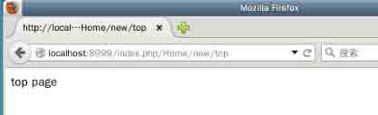

其实我们访问的是：

```php
http://localhost:8999/index.php/Home/index/top/type/top 
```

转译成就是`new/top`对应的是`Index`控制器的`top()`方法，传人的参数为`type`，参数值为`top`，所以就有了`index/top/type/top`

但是，当我们访问`http://localhost:8999/index.php/Home/new/top/var/test`尽管 URL 地址前面也有`new/top`，然而由于静态路由是`完整匹配`的性质，所以不会匹配到`index/top/type/top`

## 作业练习：

```php
'URL_ROUTER_ON'   => true, 
'URL_ROUTE_RULES' => array( 
    'new/:id\d'    => 'Index/read',
    'new/:name'    => 'Index/read',
), 
```

在路由配置如上的情况下，修改`IndexController`的`read()`方法，使得`read()`方法不再绑定参数，使用`$_GET`方式实现访问下面的两个地址都可以正确获取相应的返回结果：

```php
http://localhost:8999/index.php/Home/new/8
http://localhost:8999/index.php/Home/new/hello 
```

## 参考文档：

本试验课程基于 ThinkPHP 官方文档的路由篇，更多知识请查看：

http://document.thinkphp.cn/manual*3*2.html#route_define

## 实验简介

本节实验课程主要学习 ThinkPHP 的控制器的知识，包括定义，伪静态实现，跳转和重定向，前置与后置操作等

### 实验环境初始化

本实验与前一节具有连续性，如果是直接开始本实验，则需要对实验环境进行初始化，部署安装 ThinkPHP。直接执行初始化脚本：

```php
curl -s http://labfile.oss.aliyuncs.com/courses/352/install_thinkphp.sh | sh - 
```

## 控制器 (Controller)

在上一课程中，你可能会对 ThinkPHP 的路由会有一丝丝疑惑，不过没关系，学完本课程，很多事都会豁然开朗。

> `控制器文件命名遵守 IndexController.class.php 的方式`

## 控制器的定义

在开始之前，我们还是需要明确一下控制器的定义：

```php
<?php
namespace Home\Controller;
use Think\Controller;
class IndexController extends Controller {

    public function read($id){
        echo "read page with </br>" .$id;
    }

    public function top(){
        echo "top page </br>";
    }

} 
```

如所见，前面在路由篇提到的控制器就是这么定义的：

1.  使用相应的命名空间，默认是`namespace Home\Controller`
2.  加载`Think\Controller`
3.  新建控制器继承于`Controller`（或子类）
4.  采用驼峰命名法，注意首字母大写

控制器内的公共方法可以看作一个操作，比如上面的`read()`和`top()`方法就可以看作操作，我们在路由篇的时候都验证过了。

```php
http://localhost:8999/index.php/Home/Index/top 
```

就是访问到`top()`方法，会在页面上打印出`top page` ，再次明确`Home`代表的是`Home`模块

>有时候可能会遇到有和系统的关键字冲突的方法，这时候就可以使用设置操作方法后缀来解决了，具体请看官方文档：

http://document.thinkphp.cn/manual*3*2.html#define_controller

## 前置和后置操作

前置和后置操作指的是在执行某个操作方法之前和之后会自动调用的方法，不过`仅`对`访问控制器`有效,如在`IndexController`中为`top()`方法添加前置后置方法：

```php
public function _before_top(){
        echo "before top page </br>";
    }
    public function top(){
        echo "top page </br>";
    }
    public function _after_top(){
        echo "after top page </br>";
    } 
```

访问：http://localhost:8999/index.php/Home/Index/top

就会看到：

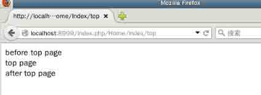

**使用前置和后置操作要注意如下两点：**

1.  如果当前的操作并没有定义操作方法，而是直接渲染模板文件，那么如果定义了前置和后置方法的话，依然会生效。真正有模板输出的可能仅仅是当前的操作，前置和后置操作一般情况是没有任何输出的。

2.  需要注意的是，在有些方法里面使用了`exit`或者错误输出之类的话 有可能不会再执行后置方法了。例如，如果在当前操作里面调用了系统`Action`的`error`方法，那么将不会再执行后置操作，但是不影响`success`方法的后置方法执行

## 参数绑定

参数绑定是通过直接绑定 URL 地址中的变量作为操作方法的参数，可以简化方法的定义甚至路由的解析。

```php
'URL_PARAMS_BIND'       =>  true 
```

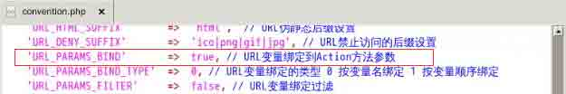

参数绑定功能默认是开启的，其原理是把 URL 中的参数（不包括模块、控制器和操作名）和操作方法中的参数进行绑定。 参数绑定有两种方式：`按照变量名绑定`和`按照变量顺序绑定`，默认使用的是`按照变量名绑定`，比如看下面的例子：

```php
 public function read($id){
        echo "read page with </br>".$id;
    }

 public function archive($year, $month){
        echo "$year </br>".$month;
    } 
```

对，这个就是上一篇路由所涉及的内容，在之前路由的路由设置处

```php
'blogs/:id'               => array('Index/read') 
```

我们将`:id`直接映射给`read()`方法的参数`$id`，所以现在回头再看，其实路由规则就是给了你一个自定义 URL 的功能。如果去掉上面的路由设置，我们正确的访问方式是：

```php
http://localhost:8999/Home/index/read/id/3 
```

上面的 URl 中`id`就是变量名,如果你写成：

```php
 public function read($title){
        echo "read page with </br>".$title;
    } 
```

那么访问地址就是：

```php
http://localhost:8999/index.php/Home/index/read/title/3 
```

对于多个参数绑定的情况，只要将相应的`变量名`和`值`传进来就可以了，不在乎顺序，比如下面两个会返回相同的结果：

```php
http://localhost:8999/index.php/Home/index/archive/year/2012/month/12

http://localhost:8999/index.php/Home/index/archive/month/12/year/2012 
```

需要注意的是，不管那种情况之下，当你访问

```php
http://localhost:8999/index.php/Home/index/read/ 
```

是会报错的：

```php
参数错误或者未定义:id 
```

解决的一个好方法就是，给绑定的参数设置默认值，比如：

```php
 public function read($id＝0){
        echo "read page with </br>".$id;
    } 
```

这样再次访问上面的 URL，页面结果：

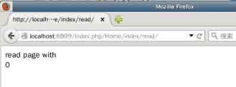

> Tips:给绑定参数设置默认值是一个避免报错的好办法

在实际的开发中，我们其实会见到`没有显示变量名`这样的 URL，如：

```php
http://localhost:8999/index.php/Home/index/read/3 
```

怎么解决呢？这个时候，我们其实就可以用到第二种参数绑定：`按照变量顺序绑定`。要使用这种参数绑定，需要先在设置项中设置：

```php
'URL_PARAMS_BIND_TYPE'  =>  1 
```


一旦设置`变量顺序绑定`，这种情况下 URL 地址中的参数顺序非常重要，不能随意调整。但是这种情况下操作方法的定义不需要改变，只是访问的 URL 变了而已，现在用上面的方式访问就可以正确访问了。

如果在`变量顺序绑定`的情况下，我们访问：

```php
http://localhost:8999/index.php/Home/index/archive/2012/12 
```

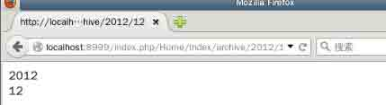

```php
http://localhost:8999/index.php/Home/index/archive/12/2012 
```

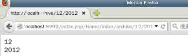

这两个结果显然是不一样，后者并不是我们想要的。所以这种情况需要严格遵守顺序来传值。

## 伪静态

URL 伪静态通常是为了满足更好的 SEO 效果，就是在平时上网的时候你经常会看到很多链接都是`html`结尾的，这对于搜索引擎的收录会更友好，ThinkPHP 支持伪静态 URL 设置，可以通过设置`URL_HTML_SUFFIX`参数随意在 URL 的最后增加你想要的静态后缀，而不会影响当前操作的正常执行，默认情况下，伪静态的设置为`html`。但我们可以自己设置，例如

```php
'URL_HTML_SUFFIX'=>'shtml' 
```

如果希望支持多个伪静态后缀，可以直接设置如下:

```php
'URL_HTML_SUFFIX' => 'html|shtml|xml' 
```

如果此项设置留空则表示可以支持所有的静态后缀。

也可以设置禁止访问的 URL 后缀通过`URL_DENY_SUFFIX`来设置，例如：

```php
'URL_DENY_SUFFIX' => 'pdf|ico|png|gif|jpg', 
```

>注： `URL_DENY_SUFFIX`的优先级比`URL_HTML_SUFFIX`要`高`。

## URL 生成

为了配合所使用的 URL 模式，我们需要能够动态的根据当前的 URL 设置生成对应的 URL 地址，为此，ThinkPHP 内置提供了`U()`方法，用于 URL 的动态生成，可以确保项目在移植过程中不受环境的影响。

**定义规则**

`U()`方法的定义规则如下（方括号内参数根据实际应用决定）： U('地址表达式',['参数'],['伪静态后缀'],['显示域名'])

地址表达式 地址表达式的格式定义如下：

```php
[模块/控制器/操作#锚点@域名]?参数 1=值 1&参数 2=值 2... 
```

如果不定义模块的话 就表示当前模块名称，下面是一些简单的例子：

```php
U('User/add') // 生成 User 控制器的 add 操作的 URL 地址
U('Article/read?id=1') // 生成 Article 控制器的 read 操作 并且 id 为 1 的 URL 地址
U('Admin/User/select') // 生成 Admin 模块的 User 控制器的 select 操作的 URL 地址 
```

**参数**

`U()`方法的第二个参数支持数组和字符串两种定义方式，如果只是字符串方式的参数可以在第一个参数中定义，例如：

```php
U('Article/cate',array('cate_id'=>1,'status'=>1))
U('Article/cate','cate_id=1&status=1')
U('Article/cate?cate_id=1&status=1') 
```

三种方式是等效的，都是生成`Article`控制器的`cate()`操作 并且`cate_id`为 1 `status`为 1 的 URL 地址

但是不允许使用下面的定义方式来传参数：

```php
U('Article/cate/cate_id/1/status/1'); 
```

**生成路由地址**

U 方法还可以支持路由，如果我们定义了一个路由规则为：

```php
'blogs/:id\d'=>'Index/read' 
```

那么可以使用

```php
U('/blogs/1'); 
```

最终生成的 URL 地址是：

```php
http://localhost:8999/index.php/Home/blogs/1 
```

## 跳转和重定向

这应该是在开发中最常用的功能之一。在应用开发中，经常会遇到一些带有提示信息的跳转页面，例如操作成功或者操作错误页面，并且自动跳转到另外一个目标页面。系统的`\Think\Controller`类内置了两个跳转方法`success()`和`error()`，用于页面跳转提示。

### 跳转

这个在实际开发 Web 程序的过程中非常有用，比如一个用户注册之后该怎么跳转等。使用方法很简单，比如我们在`Index`控制器下新建一个方法`user()`，写上下面的内容：

```php
public function user()
   {
       $User = M('User');
       $data['username'] = 'Think';
       $data['email'] = 'Think@gmail.com';
       $result = $User->add($data);
       if($result){
           $this->success('success', '/Home/User/addUser');
       } else {
           $this->error('failed');
       }
   } 
```

`M('User')`表示实例化一个 User 对象，`add()`方法是向数据库添加一条纪录。然后我们需要新建一个`UserController`，在里面写上`addUser()`方法

```php
<?php
namespace Home\Controller;

use Think\Controller;

class UserController extends Controller {

    public function addUser()
    {
        echo 'add user done!';
    }
} 
```

然后在浏览器中访问`http://localhost:8999/Home/Index/user`，就可以看到`add user done!`了，下面详细来说说这两个重定向方法。

`success()`和`error()`方法的第一个参数表示提示信息，第二个参数表示跳转地址，第三个参数是跳转时间（单位为秒），例如：

```php
// redirect to /Article/index after 3 seconds when success
$this->success('done','/Home/Article/index',3);
// redirect to /Article/error after 5 seconds when failed
$this->error('failed','/Home/Article/error',5); 
```

如果不设置跳转时间，默认的等待时间`success()`方法是 1 秒，`error()`方法是 3 秒。看到上面的两个跳转地址前面都带上了`/Home`，如果你想简写为`/Article/index`，你需要在 ThinkPHP 的入口文件（项目目录下的`index.php`）中加上下面一行：

```php
define('BIND_MODULE','Home'); 
```

而且这两个方法都有对应的模板，默认的设置是两个方法对应的模板都是：

```php
'TMPL_ACTION_ERROR' => THINK_PATH . 'Tpl/dispatch_jump.tpl',

'TMPL_ACTION_SUCCESS' => THINK_PATH . 'Tpl/dispatch_jump.tpl', 
```

你可以根据自己的需要来修改模版。

### 重定向

Controller 类的`redirect()`方法可以实现页面的重定向功能。 `redirect()`方法的参数用法和`U()`函数的用法一致（参考上一部分 URL 生成部分），例如：

```php
$this->redirect('/Home/Article/show', array('id' => 2), 3, 'Redirecting...'); 
```

上面的用法是停留 3 秒后跳转到`Article`控制器的`show()`操作，并且显示页面跳转中字样`Redirecting...`，重定向后会改变当前的 URL 地址。

为了成功进行测试，我们在`IndexController`下添加`redirectToArticle()`方法并写上上面那行代码：

```php
public function redirectToArticle()
    {
        $this->redirect('/Home/Article/show', array('id' => 2), 3, 'Redirecting...');
    } 
```

然后我们创建一个`ArticleController`，并且为他添加`show()`方法：

```php
namespace Home\Controller;

use Think\Controller;

class ArticleController extends Controller {

    public function show($id)
    {
        echo 'This is an Article Page';

    }
} 
```

然后在浏览器访问：`http://localhost:8999/Home/Index/redirectToArticle`，等待三秒，你就可以看到跳转之后的页面了。

但是如果你仅仅是想重定向要一个指定的 URL 地址，而不是到某个模块的操作方法，可以直接使用`redirect()`函数重定向，例如

```php
$this->redirect('/Home/Article/show/id/3', 'Redirecting...',3); 
```

如图所示：


由于实验楼暂时不支持中文，实际的运行结果页面会出现乱码。

>注：控制器的`redirect()`方法和`redirect()`函数的区别在于前者是用 URL 规则定义跳转地址，后者是一个纯粹的 URL 地址

注：好像官方文档是像下面这样写的但我测试并没有成功，成功的是上面的写法。

```php
$this->redirect('/New/category/cate_id/2', 5, '页面跳转中...'); 
```

官方文档可能是出于疏忽的原因有误，参见：

http://document.thinkphp.cn/manual*3*2.html#page*jump*redirect

## 作业

```php
U('Article/cate',array('cate_id'=>1,'status'=>1))
U('Article/cate','cate_id=1&status=1')
U('Article/cate?cate_id=1&status=1') 
```

分别打印输出以上`U()`方法生成的 url，考虑我们可以在控制器的方法中可以通过哪些方式来获取`cate_id`和`status`变量的值。

对于控制器的更多内容，请仔细查看文档，了解更多

http://document.thinkphp.cn/manual*3*2.html#define_controller

## 参考文档：

本实验课程基于 ThinkPHP 官方文档控制器篇：

http://document.thinkphp.cn/manual*3*2.html#define_controller

## 实验简介

本节实验课程主要学习 ThinkPHP 的模型知识，从定义开始，涵盖模型的配置，CURD，ActiveRecord，字段验证和关联模型等。本节课中的数据库表已经创建好了，里面也会有相应的数据记录。

### 实验环境初始化

本实验与前一节具有连续性，如果是直接开始本实验，则需要对实验环境进行初始化，部署安装 ThinkPHP。直接执行初始化脚本：

```php
curl -s http://labfile.oss.aliyuncs.com/courses/352/install_thinkphp.sh | sh - 
```

## 模型定义

默认情况下，ThinkPHP 的模型类是位于`/Home/Model/`目录之下，模型类通常需要继承系统的`\Think\Model`类或其子类，下面是一个`Home\Model\UserModel`类的定义：

`文件命名遵守 UserModel.class.php 的方式，跟控制器的命名一样`

```php
<?php
namespace Home\Model;

use Think\Model;

class UserModel extends Model {
} 
```

模型类的作用大多数情况是操作数据表的，如果按照系统的规范来命名模型类的话，大多数情况下是可以自动对应数据表，但你可以根据自己的需求来定制自己的数据表设置和操作。

首先我们需要在配置文件设置我们的数据库连接信息：

```php
 'DB_TYPE'               =>  'mysql',     
    'DB_HOST'               =>  'localhost', 
    'DB_NAME'               =>  'database',   
    'DB_USER'               =>  'username',      
    'DB_PWD'                =>  'password',    
    'DB_PORT'               =>  '3306', 
```

这些配置信息是在`/Home/Conf/config.php`文件里设置，我们第一课的时候就看到过这些配置。

### 指定数据表前缀

指定标前缀，我们在第一课的配置项已经指定，以下有关数据表前缀的课程只是为了说明`你可以灵活配置你的数据表`。

```php
protected $tablePrefix = 'top_'; 
```

1.  列表项. 列表项. 如果数据库的表没有表前缀，使用空字符串代替

```php
protected $tablePrefix = ''; 
```

1.  列表项. 列表项. 指定数据表，此处的指定的数据表的不需要添加表前缀：

```php
protected $tableName = 'user'; 
```

举个例子说，比如说你的数据库中有一个没有表前缀的，名为`users`的数据表，可以用以下的两种方法在模型中进行下面的定义：

第一，直接根据`系统的规范来命名模型类`来命名模型，比如说就命名为`UsersModel`那么只需要在这个类里面加上下面的设置就可以了：

```php
protected $tablePrefix = ''; 
```

ThinkPHP 系统就会自动定位到`users`表了。

第二种情况时，如果你的模型类没有按照系统规范来命名，比如说不小心命名为`UserModel`，这种情况下可以同时指定表前缀和表名，比如：

```php
protected $tablePrefix = '';

protected $tableName = 'users'; 
```

或者你直接指定`trueTableName`:

```php
protected $trueTableName = 'users'; 
```

既然模型通常是用来操作数据表，那么我们来看看模型的基本 CURD:

>注：为了方便演示，我们在`UserController`中定义一个`testDemo()`方法用于演示

```php
public function testDemo()
    {

    } 
```

以下的代码将会一段一段在这个方法里演示，你可以通过访问`http://localhost:8999/index.php/Home/User/testDemo`来看到实际效果。

### 添加记录

```php
$user = M('User');
$data['username'] = 'ThinkPHP';
$data['email'] = 'ThinkPHP@gmail.com';
$user->create($data);
$record = $user->add();
dump($record); 
```

`add()`返回的是插入数据的`id`,对于不存在的表字段，`add()`方法会自动过滤。

## 读取记录

在 ThinkPHP 中读取数据的方式很多，通常分为读取数据、读取数据集和读取字段值

```php
$user = M('User');

$record = $user->where('username="ThinkPHP"')->find();

dump($record); 
```

## 读取字段值

```php
$user = M('User');

$record = $user->where('id=3')->getField('username');

dump($record); 
```

默认情况下，当只有一个字段的时候，返回满足条件的数据表中的该字段的第一行的值.如果`getField()`传入多个字段，返回值将是一个关联数组：

```php
$user = M('User');

$record = $user->getField('username,email');

dump($record); 
```

这个数组总是以传入的第一个第一个字段为键值的。如果修改为：

```php
$user = M('User');

$record = $user->getField('email,username');

dump($record); 
```

将上面的两次代码分别放到`testDemo()`，你就会看到不一样的结果集。

## 用`save()`方法更新数据

```php
$user = M('User');

$data['username'] = 'ThinkPHPSave';
$data['email'] = 'ThinkPHPSave@outlook.com';

$record = $user->where('id=3')->save($data);

dump($record); 
```

这里的`$record`返回的事`1`，表示成功更改。

当然，你也可以这样：

```php
$user = M('User');

$user->username = 'ThinkPHP';
$user->email = 'ThinkPHP@outlook.com';

$record = $user->where('id=3')->save();

dump($record); 
```

日常开发的时候经常会遇到一些只更新某些字段的情况，可以通过下面的方式来实现：

```php
$user = M("User"); 
$record = $user->where('id=4')->setField('username','ThinkPHPChangeName');

dump($record); 
```

同时更新多个字段，可以将数据以`数组`的形式传给`setField()`方法：

```php
$user = M('User');
$data = array('username'=>'ThinkPHPChangeArray','email'=>'ThinkPHP@array.com');
$record = $user-> where('id=6')->setField($data);
dump($record); 
```

## ThinkPHP 删除数据使用`delete()`方法

```php
$user = M('User');
$record = $user->where('id=3')->delete();
dump($record); 
```

或者你可以直接使用：

```php
$record = $user->delete('1,2,5');
dump($record); 
```

这样就达到了删除主键`1,2,5`这三条记录了。

## ActiveRecords

ThinkPHP 实现了 ActiveRecords 模式的 ORM 模型，采用了非标准的 ORM 模型：表映射到类，记录映射到对象。以下实例将使用 ActiveRecords 重现对数据表的 CURD，看看 ActiveRecords 给我们带来了什么好处。

```php
$user = M("User");

$user->username = 'ThinkPHPWithActive';
$user->email = 'ThinkPHPActive@gmail.com';

$record = $user->add();

dump($record); 
```

## 读取记录

AR 最大的特点可能就是它的查询模式了，模式简单易用，因为更多情况下面查询条件都是以主键或者某个关键的字段。这种类型的查询，ThinkPHP 有着很好的支持。

比如说获取主键为`2`的用户信息：

```php
$user = M("User");

$record = $user->find(2);

dump($record); 
```

直接不用`where()`查询了，简单友好吧。再比如：

```php
$user = M("User");

$record = $user->getByUsername("jelly");

dump($record); 
```

如果是查询多条记录，使用以下方式：

```php
$user = M("User");

$record = $user->select('1,3,8');

dump($record); 
```

## 更新记录

```php
$user = M("User");
$user->find(21);
$user->username = 'TOPThinkChangeWithAR';
$record = $user->save();

dump($record); 
```

## 删除记录

1.  删除单条记录

```php
$user = M("User");

$record = $user->delete(8);

dump($record); 
```

1.  删除多条记录

```php
$user = M("User");

$record = $user->delete('15,16');

dump($record); 
```

## 自动完成

自动完成是 ThinkPHP 提供用来完成数据自动处理和过滤的方法，当使用`create()`方法创建数据对象的时候会触发自动完成数机制。 因此，在 ThinkPHP 鼓励使用`create()`方法来创建数据对象，因为这是一种更加安全的方式，直接通过`add()`或者`save()`方法实现数据写入无法出发自动完成机制。

自动完成通常用来完成默认字段写入(`比如添加时间戳`)，安全字段过滤(`比如加密密码`)以及业务逻辑的自动处理等。可以通过模型类里面通过`$_auto`属性定义处理规则。下面演示如何自动完成添加时间戳：

在`UserModel`中，声明自动完成的定义数组`$_auto` ：

```php
protected $_auto = array (
        array('created_at','date("Y-m-d H:i:s", time())',3,'function'),
        array('updated_at','date("Y-m-d H:i:s", time())',3,'function'),
    ); 
```

`还有一种是理由 auto()方法动态设置自动完成的机制，可以到官方文档去看看`

设置完成之后，我们在`testDemo()`方法中创建一条用户数据：

```php
$user = D('User');
$data['username'] = "ThinkPHP";
$data['email'] = "ThinkPHP@gmail.com";
$user->create($data);
$record = $user->add();
dump($record); 
```

测试，如果返回记录的`id`值，说明用户记录创建成功。要验证数据是否自动完成，你可以直接使用：

```php
$user = D('User');
$record = $user->find(id);
dump($record); 
```

## 自动验证

自动验证是 ThinkPHP 模型层提供的一种数据验证方法，可以在使用`create()`创建数据对象的时候自动进行数据验证。

数据验证可以进行数据类型、业务规则、安全判断等方面的验证操作。

`通常用于表单验证`

**数据验证有两种方式：**

静态方式：在模型类里面通过`$_validate`属性定义验证规则。

动态方式：使用模型类的`validate()`方法动态创建自动验证规则。

无论是什么方式，验证规则的定义是统一的规则，定义格式为：

```php
array(
     array(验证字段 1,验证规则,错误提示,[验证条件,附加规则,验证时间]),
     array(验证字段 2,验证规则,错误提示,[验证条件,附加规则,验证时间]),
     ......
); 
```

下面以`$_validate`静态方式举例如何使用自动验证：

1.  在`UserController`中创建`register()`方法，对，几乎每一个 Web 应用都需要实现用户注册这一步。

```php
public function register()
    {
        $this->display();
    } 
```

对，就是这么简单，这个方法只是将相应的视图文件渲染出来。所以接下来我们创建对应的视图文件，也就是：`./Application/Home/View/User/register.html`

```php
<extend name="Index/base" />
<block name="main" >
<form method="post" action="__URL__/registerValidate">
    <div class="form-group">
        <label for="exampleInputName">Name</label>
        <input type="text" name="username" class="form-control" id="exampleInputName" placeholder="Name">
    </div>
    <div class="form-group">
        <label for="exampleInputEmail">Email</label>
        <input type="email" name="email" class="form-control" id="exampleInputEmail" placeholder="Email">
    </div>

    <button type="submit" class="btn btn-default">Submit</button>
</form>
</block> 
```

上面就是一些 HTML 代码和`一点模板的知识`，对于模板，我们后续会讲到，但不管怎样，现在我们访问 `http://localhost:8999/Home/User/register`，就可以看到我们的注册表单页面了。

注意到 form 表单中，`action="__URL__/registerValidate"`，这表示提交到当前的控制器的`registerValidate()`方法处理，所以我们在`UserController`中增加`registerValidate()`方法：

```php
public function registerValidate()
    {
        $data['username'] = $_POST['username'];
        $data['email'] = $_POST['email'];

        $user = D("User");

        if ( !$user->create($data) ) {
            exit($user->getError());
        }
        //todo: validation passes, add data to database and redirect somewhere

        echo 'validation passes';

    } 
```

这里的`if ( !$user->create($data) )`会触发自动验证并判断验证是否通过验证。你可以尝试在表单里填写不同的数据来进行测试，也可以修改一下验证规则，更多规则可以到官网查看：

http://document.thinkphp.cn/manual*3*2.html#auto_validate

## 关联模型

通常我们所说的关联关系包括下面三种：

```php
一对一关联 ：ONE_TO_ONE，包括 HAS_ONE 和 BELONGS_TO
一对多关联 ：ONE_TO_MANY，包括 HAS_MANY 和 BELONGS_TO
多对多关联 ：MANY_TO_MANY 
```

### 关联定义

ThinkPHP 可以很轻松的完成数据表的关联 CURD 操作，目前支持的关联关系包括下面四种： `HAS_ONE`、`BELONGS_TO`、`HAS_MANY`和`MANY_TO_MANY`。 一个模型根据业务模型的复杂程度可以同时定义多个关联，不受限制，所有的关联定义都统一在模型类的 `$_link` 成员变量里面定义，并且可以支持动态定义。要支持关联操作，模型类必须继承`Think\Model\RelationModel`类，关联定义的格式类似于：

```php
namespace Home\Model;
use Think\Model\RelationModel;
class UserModel extends RelationModel{
     protected $_link = array(
        '关联'  =>  array(
            '关联属性 1' => '定义',
            '关联属性 N' => '定义',
        ),
     );
} 
```

关于关联属性的定义和值，你可以到官方文档仔细查看，我们下面也会给出一些最常用的。

在我们的讲解例子中，会采用`HAS_MANY`和`BELONGS_TO`来演示，对于其他的几个关系模型，可以参考官方文档举一反三。

首先我们知道数据库里面有两张表，用户表和文章表，并且我们也为其创建了不同的模型(`UserModel` `ArticelModel`)。

现在我们仔细来想想他们之间的对应关系：`一个用户可以拥有多篇文章，而每一篇文章都属于某个特定的用户`。所以我们可以分别为这两种关系添加关联模型：

在`UserModel 中`：

```php
protected $_link = array(
        'Article' => self::HAS_MANY
    ); 
```

在`ArticleModel`中：

```php
protected $_link = array(
        'User' => self::BELONGS_TO
    ); 
```

以上者两种都是最简洁的模型关联声明。因为在最开始设计数据库的时候，我们遵守了 ThinkPHP 的官方的规范：

外键的默认规则是当前`数据对象名称 _id`，例如：`UserModel`对应的可能是表`think_user`，那么`think_user`表的外键默认为`user_id`，如果你的外键不是`user_id`，而是其他自定义的字段如：`user_identify`，那么就必须在定义关联的时候定义 `foreign_key` 。如下：

在`UserModel`中：

```php
protected $_link = array(
        'mapping_type'  => self::HAS_MANY,
        'class_name'    => 'Article',
        'foreign_key'   => 'user_identify',
    ); 
```

更多自定义的关联模型参数可以到官网查看。

有了以上的定义之后，我们就可以在检索用户数据的同时将属于他的文章也一起检索出来，使用`relation()`。

同样是在`testDemo()`这个方法中：

```php
$user = D('User');
$record = $user->relation(true)->find(4);
dump($record); 
```

访问熟悉的`http://localhost:8999/Home/User/testDemo`，你将会看到神奇的结果。

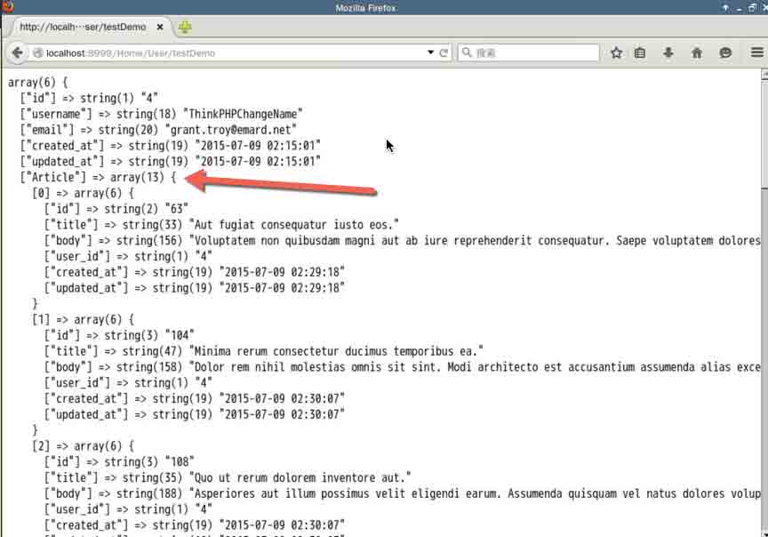

## 作业：

1.  设计一个`think_profile`的数据库表结构，使得可以于`think_user`表形成`一对一`的关系，在模型中给出对应关系的定义。
2.  考虑如果是`多对多`的关系，比如有`think_article`和`think_tag`这两个表，如果实现多对多的对应关系

## 参考文档

本试验课程基于 ThinkPHP 的官方文档模型篇

http://document.thinkphp.cn/manual*3*2.html#define_model

## 实验简介

本节实验课程主要学习 ThinkPHP 的视图配置，设置主题，变量赋值等知识点。

### 实验环境初始化

本实验与前一节具有连续性，如果是直接开始本实验，则需要对实验环境进行初始化，部署安装 ThinkPHP。直接执行初始化脚本：

```php
curl -s http://labfile.oss.aliyuncs.com/courses/352/install_thinkphp.sh | sh - 
```

## 视图 (View)

本节主要是讲解 ThinkPHP 的视图管理系统，从视图的基本概念，配置到赋值，渲染等。

在 ThinkPHP 中，每个模块的模板文件是独立的，为了对模板文件更加有效的管理，ThinkPHP 对模板文件进行目录划分，默认的模板文件定义规则是：

```php
视图目录/[模板主题/]控制器名/操作名+模板后缀 
```

默认的视图目录是模块的`View/`目录（一个模块可以有多个视图文件目录，这取决于你的应用需要），框架的默认视图文件后缀是`.html`。 新版模板主题默认是空（表示不启用模板主题功能），即在没有主题的情况之下：

```php
视图目录/控制器名/操作名+模板后缀 
```

在每个模板主题下面，是以模块(常用的`/Home/Controller`就是一个模块)下面的控制器名为目录，然后是每个控制器的具体操作模板文件，例如:

`Index`控制器的`index`操作 对应的视图文件就应该是：`/Application/Home/View/Index/index.html`

`注意与控制器相对应的文件夹大小写，就像上例第一个的 Index 一样需要大写`

比如我们要为`ArticleController`的`show()`方法渲染一个视图文件，这个视图文件应该在：

`./Application/Home/View/Article/show.html`

视图文件的默认后缀的情况是`.html`，也可以通过 `TMPL_TEMPLATE_SUFFIX` 来配置成其他的。例如，我们可以配置：

```php
'TMPL_TEMPLATE_SUFFIX'=>'.tpl' 
```

定义后，`Index`控制器的`index()`操作 对应的视图文件就变成是： `/Application/Home/View/Index/index.tpl`

## 模板主题

一个模块如果需要支持多套视图文件的话，就可以使用模板主题功能。 默认情况下，没有开启模板主题功能，如果需要开启，设置 DEFAULT_THEME 参数即可：

```php
'DEFAULT_THEME'    =>    'default' 
```

采用视图主题后，需要在视图目录(`View/`)下面创建对应的主题目录，和不启用模板主题的情况相比，模板文件只是多了一层目录：

```php
View/Index/index.html // before using a theme

View/default/Index/index.html // after using a theme 
```

## 模板赋值

如果要在视图文件中输出变量，必须在在控制器中把变量传递给视图，系统提供了`assign()`方法对视图变量赋值，无论何种变量类型都统一使用`assign()`赋值，比如在`IndexController`中`index()`操作之中。

```php
public function index(){

        $user = D('User');

        $userInfo = $user->find(2);

        $this->assign('user',$userInfo);

        $this->display();

    } 
```

`assign()`方法必须在`display()`和`show()`方法之前调用，并且系统只会输出设定的变量，其它变量不会输出（系统变量例外），一定程度上保证了变量的安全性。如果要保证上面的代码正常运行，我们需要创建一个对应的视图文件，根据上面的规律就是：

```php
/Application/Home/View/Index/index.html 
```

在模板里写上简单的 HTML：

```php
<html>
<head><title>IndexController index</title></head>
<body>
<h1>This is IndexController index view !!!</h1>
</body>
</html> 
```

访问首页，你就会看到一串`This is IndexController index view !!!`。

既然有了赋值，那就可以在视图文件中输出变量了，如果使用的是内置模板的话，就可以这样输出： `{$user['email']}`，后面章节会具体讲到。

## 模板渲染

视图正确定义后就可以渲染视图输出，系统也支持直接渲染内容输出，就像上面说到的一样，视图赋值`assign()`必须在模板渲染`display()和 show()`之前操作。

渲染视图文件输出最常用的是使用`display()`方法，调用格式：

```php
display('[视图文件]'[,'字符编码'][,'输出类型']) 
```

视图的经典用法就是不带任何参数，就像在视图赋值部分看到的一样：

```php
$this->display(); 
```

上面这行代码表示，系统会自动寻找在这个控制器之下的具体操作的视图(`跟方法名一样的视图文件`)，比如上面的`Index`控制器`index()`操作视图。

如果没有按照模板定义规则来定义视图文件（或者需要调用其他控制器下面的某个视图文件），可以使用：

```php
$this->display('edit'); 
```

如果我们使用了模板主题功能，那么也可以支持跨主题调用，使用：

```php
$this->theme('blue')->display('Index:edit'); 
```

表示调用`blue`主题下面的`Index`控制器的`edit`视图文件。

## 作业

为`Article`控制器的各个方法创建默认视图。

## 参考文档

本试验课程基于 ThinkPHP 官方文档视图篇

http://document.thinkphp.cn/manual*3*2.html#template_define