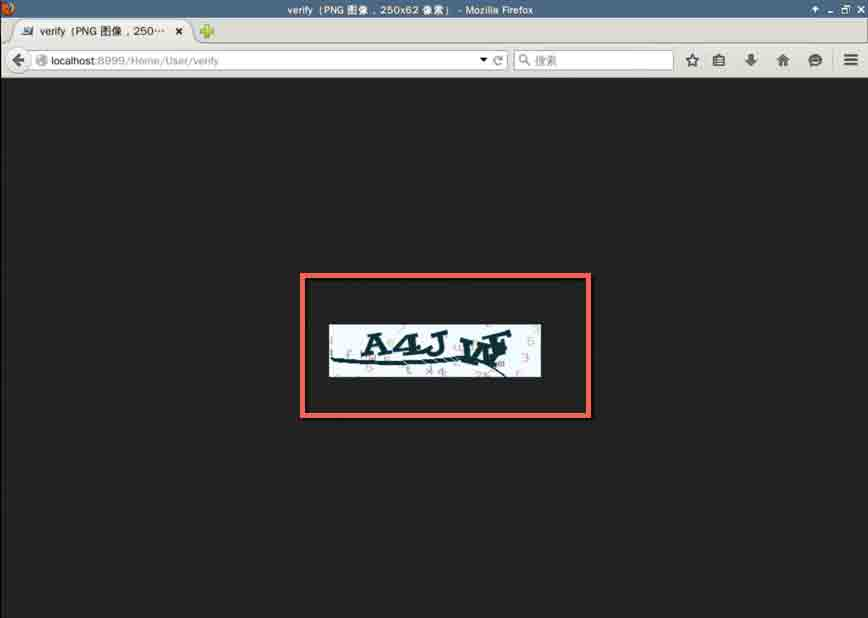
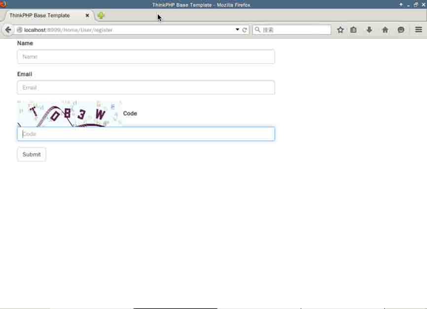
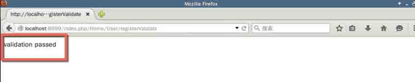
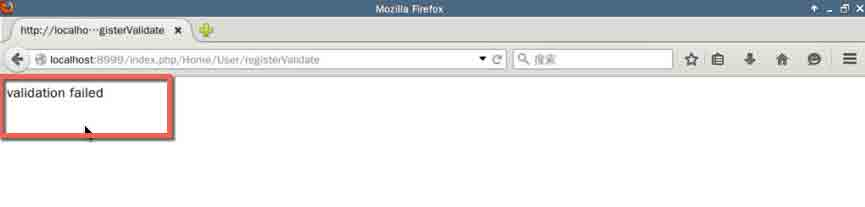

## 实验简介

本节实验课程主要学习 ThinkPHP 的模版知识，包括变量输出，变量的各种操作，内置标签和模板的继承与布局等。

### 实验环境初始化

本实验与前一节具有连续性，如果是直接开始本实验，则需要对实验环境进行初始化，部署安装 ThinkPHP。直接执行初始化脚本：

```php
curl -s http://labfile.oss.aliyuncs.com/courses/352/install_thinkphp.sh | sh - 
```

# 第 6 节 模板 (Template)

在上面的视图中，我们曾提到过给视图赋值，那时没有详细讲解时因为就单单 ThinkPHP 的模板知识也牵涉到比较多的知识点，故本节将详细讲解 ThinkPHP 的模板。

## 变量输出

在赋值给模板之后，在模板中输出变量很简单，如在前面，我们将查询到的用户信息赋给了`index`模板：

```php
public function index(){

        $user = D('User');

        $userInfo = $user->find(2);

        $this->assign('user',$userInfo);

        $this->display();

    } 
```

那么在`index`模板中就可以这样输出变量，

```php
<html>
<head><title>IndexController index</title></head>
<body>
<h1>Hello {$user['username']} !</h1>
</body>
</html> 
```

将变量值包含在一对大括号内，系统就会自动编译输出变量值，编译后其实是这样的：

```php
Hello,<?php echo($user['username']);?>！ 
```

注意`{`和`$user`之间是没有空格的，如果两者存在空格，写出`{ $user['username']}`，系统就不采用编译机制，而是直接输出字符串`$user['username']`。

普通标签默认开始标记是`{`，结束标记是 `}`。也可以通过设置`TMPL_L_DELIM`和`TMPL_R_DELIM`进行更改。例如，我们在项目配置文件中定义：

```php
'TMPL_L_DELIM'=>'{{',
'TMPL_R_DELIM'=>'}}', 
```

那么，上面的变量输出标签就应该改成：

```php
Hello {{$user['username']}} ! 
```

当然如果你觉得`{$user['username']}`不太符合口味，你还可以使用以下类似取属性方式输出变量值：

```php
Hello {$user.username} ! 
```

两者都会得到一样的效果。

## 变量操作

对于赋值给模板的变量，我们可以对其进行一些常规的操作和运算，包括对变量的`+`，`–` ，`*`，`/`和`%`等

比如：

```php
{$a + $b} 
```

```php
{$a % $b} 
```

```php
{$a ++} 
```

不过需要注意的是，在进行变量计算操作的时候，`变量不再支持上述的类似取属性的方法(就是点语法)`，所以下面的语法是`错`的：

```php
{$user.score+10} 
```

正确的写法是：

```php
{$user['score']+10} 
```

## 使用三元运算符

在模板中也支持使用三元运算符，不过在这里`也不支持点语法`

```php
{$status?'published':'archive'} 
```

```php
{$info['status']?$info['msg']:$info['error']} 
```

## 默认值输出

这很好地解决了当我们输出的值为`空`值的时候，我们可以在模板处为它设置默认值，比如：

```php
{$user.username|default="Harry"} 
```

## 模板标签库

内置的模板引擎除了支持普通变量的输出之外，更强大的地方在于标签库功能。 标签库类似于 Java 的 Struts 中的 JSP 标签库，每一个标签库是一个独立的标签库文件，标签库中的每一个标签完成某个功能，采用 XML 标签方式（包括开放标签和闭合标签）。 标签库分为内置和扩展标签库，内置标签库是 Cx 标签库

## 内置标签

内置标签库无需导入即可使用，并且不需要加 XML 中的标签库前缀，ThinkPHP 内置的标签库是 Cx 标签库，所以，Cx 标签库中的所有标签，我们可以在模板文件中直接使用，我们可以这样使用：

```php
<eq name="status" value="1 >
normal
</eq> 
```

## volist 标签

`volist`标签通常用于查询数据集（`select()`方法）的结果输出，通常模型的`select()`方法返回的结果是一个二维数组，可以直接使用`volist`标签进行输出。 在控制器中首先对模版赋值

```php
$user = M('User');
$list = $user->limit(10)->select();
$this->assign('list',$list); 
```

在模版定义如下，循环输出用户的`用户名`和`邮箱`：

```php
<volist name="list" id="vo">
{$vo.username}:{$vo.email}
<br/>
</volist> 
```

`Volist`标签的`name`属性表示模板赋值的`变量名称$this->assign('list',$list)中的 list`，因此不可随意在模板文件中改变。`id`表示当前的循环变量，可以随意指定，但确保不要和`name`属性冲突，例如

```php
<volist name="list" id="data">
{$data.username}:{$data.email}
<br/>
</volist> 
```

## IF 标签

```php
<if condition="($name eq 1) OR ($name gt 100) "> value1
<elseif condition="$name eq 2"/>value2
<else /> value3
</if> 
```

在`condition`属性中可以支持`eq 等判断表达式`，同上面的比较标签，但是不支持带有`>`、`<`等符号的用法，因为会混淆模板解析，所以下面的用法是错误的：

```php
<if condition="$id < 5 ">value1
    <else /> value2
</if> 
```

必须改成：

```php
<if condition="$id lt 5 ">value1
<else /> value2
</if> 
```

由于`if 标签`的`condition`属性里面基本上使用的是 php 语法，尽可能使用判断标签和`Switch 标签`会更加简洁，原则上来说，能够用`switch`和比较标签解决的尽量不用`IF 标签`完成。因为`switch`和`比较标签`可以使用变量调节器和系统变量。如果某些特殊的要求下面，`IF 标签`仍然无法满足要求的话，可以使用原生 php 代码或者`PHP 标签`来直接书写代码

## switch 标签

`switch 标签`的格式如下：

```php
<switch name="变量" >
<case value="值 1" break="0 或 1">输出内容 1</case>
<case value="值 2">输出内容 2</case>
<default />默认情况
</switch> 
```

上面的中文是问了便于理解。

使用方法：

```php
<switch name="User.level">
    <case value="1">value1</case>
    <case value="2">value2</case>
    <default />default
</switch> 
```

对于`case`的`value 属性`可以支持多个条件的判断，使用`|`进行分割，而且`case 标签`还有一个`break`属性，表示是否需要`break`，默认是会自动添加`break`，如果不要`break`，可以使用：

```php
<switch name="Think.get.type">
    <case value="gif|png|jpg" break="0">Images</case>
    <case value=mp4|mov|flv">Videos</case>
    <default />Other format
</switch> 
```

## Foreach 标签

`foreach 标签`类似与`volist 标签`，只是更加简单，没有太多额外的属性，例如： {$vo.id}:{$vo.name} `name`表示数据源 `item`表示循环变量

```php
<foreach name="list" item="vo" >
    {$key}|{$vo}
</foreach> 
```

也可以定义索引的变量名

```php
<foreach name="list" item="vo" key="k" >
   {$k}|{$vo}
</foreach> 
```

## 模板继承

模板继承是一项更加灵活的模板布局方式，模板继承不同于模板布局，甚至来说，应该在模板布局的上层。模板继承其实并不难理解，就好比类的继承一样，模板也可以定义一个基础模板（或者是布局），并且其中定义相关的区块（block），然后继承（extend）该基础模板的子模板中就可以对基础模板中定义的区块进行重载。 因此，模板继承的优势其实是设计基础模板中的区块（block）和子模板中替换这些区块。 每个区块由<block></block>标签组成。 下面就是基础模板中的一个典型的区块设计（用于设计网站标题）：

```php
<block name="title"><title>Website title</title></block> 
```

`block`标签必须指定`name 属性`来标识当前区块的名称，这个标识在当前模板中应该是`唯一`的，`block`标签中可以包含任何模板内容，包括其他`标签`和`变量`，例如

```php
<block name="title"><title>{$web_title}</title></block> 
```

一个模板中可以定义任意多个名称标识不重复的区块，例如下面我们在`View/Index`中定义了一个`base.html`基础模板：

```php
<!DOCTYPE html>
<html lang="zh-CN">
<head>
<meta charset="utf-8">
    <meta http-equiv="X-UA-Compatible" content="IE=edge">
    <meta name="viewport" content="width=device-width, initial-scale=1">
<block name="title"><title>ThinkPHP Base Template</title></block>

<import type='css' file='css.bootstrap'/>
</head>
<body>
<div class="container">
<div class="col-md-2"></div>
<block name="menu"></block>
<div class="row">
  <div class="col-md-2"><block name="left"></block></div>
  <div class="col-md-8"><block name="main"></block></div>
  <div class="col-md-2"><block name="right"></block></div>
</div>

<div class="col-md-2"></div>
<block name="footer"></block>
</div>
</body>
</html> 
```

如果你仔细看了前面在自动验证那一节内容的 HTML 表单代码，你就会理解之前`<extend name="Index/base" />`是什么意思了：其实就是当时的 HTML 表单的模板继承了上面的`base.html`

这里需要注意的地方是，在继承模板的时候，注意名字要一一对应，也就是确保和 base.html 的`block`区块的`name`属性一致。

## 作业

1.  查阅更多 ThinkPHP 的内置模板标签：http://document.thinkphp.cn/manual*3*2.html#inner_tag
2.  仔细阅读文档`模版继承`的部分，理解模板的`继承`和`布局`：http://document.thinkphp.cn/manual*3*2.html#template_extend

## 参考文档

本试验课程基于 ThinkPHP 的官方稳定模板篇：

http://document.thinkphp.cn/manual*3*2.html#var_output

## 实验简介

本节实验课程主要学习 ThinkPHP 的内置一些重要的专题，包括文件上传，图片操作和验证码知识等。

### 实验环境初始化

本实验与前一节具有连续性，如果是直接开始本实验，则需要对实验环境进行初始化，部署安装 ThinkPHP。直接执行初始化脚本：

```php
curl -s http://labfile.oss.aliyuncs.com/courses/352/install_thinkphp.sh | sh - 
```

## 文件上传

在 ThinkPHP 中使用上传功能无需进行特别处理。例如，下面是一个带有附件上传的表单提交：

```php
<form action="__URL__/upload" enctype="multipart/form-data" method="post" >
<input type="text" name="name" />
<input type="file" name="photo" />
<input type="submit" value="提交" >
</form> 
```

如果是`多文件`上传，推荐使用下面的写法：

```php
<input type='file'  name='photo[]'>
<input type='file'  name='photo[]'>
<input type='file'  name='photo[]'> 
```

实际例子：我们在`UserController`中添加一个`uploadDemo()`方法，用来渲染视图

```php
public function uploadDemo()
    {
        $this->display();
    } 
```

默认渲染的是`View\User\uploadDemo.html`,所以创建该文件：

```php
<extend name="Index/base" />
<block name="main" >
    <form method="post" action="__URL__/upload" enctype="multipart/form-data">

        <div class="form-group">
            <label for="exampleInputFile">Choose File</label>
            <input type="file" name="file" id="exampleInputFile">
            <p class="help-block">Choose your file to upload</p>
        </div>

        <button type="submit" class="btn btn-default">Submit</button>
    </form>
</block> 
```

代码跟之前自动验证的那节差不多，只是注意上传文件的时候指定`enctype="multipart/form-data"`，上面视图也是继承于`Index\base.html`，表单提交到当前控制器的`uploadFile()`方法，所以，我们在`UserController`中实现之：

```php
public function uploadFile(){
    $upload = new \Think\Upload();
    $upload->maxSize   =     3145728 ;
    $upload->exts      =     array('jpg', 'gif', 'png', 'jpeg');
    $upload->rootPath  =     './Uploads/';
    $upload->savePath  =     'images/';
    $info   =   $upload->upload();
    if(!$info) {
        $this->error($upload->getError());
    }else{
        $this->success('upload done！');
        // redirect some where
    }
} 
```

实例化上传类之后，我们可以指定上传文件的大小，文件类型，保存路径等。需要注意的是保存上传文件的根路径`./Uploads/`需要手动创建，不然上传文件会失败。上传的文件 ThinkPHP 会默认在`savePath`之下根据日期创建文件夹，文件名也会跟着系统的默认方法来命名，在上传成功后`$this->success('upload done！')`只是简单的提示上传成功，在实际项目中，如果用户上传的是头像，你可以跳转到用户的主页等;

## 图片处理

上面说到了图片的上传，实际的项目中，我们需要对上传的文件进行多种多样的处理，像是在用户上传头像的时候进行裁剪，像是在微博中上传图片的时候加上水印等。这些技术的实现在 ThinkPHP 里面很简单，我们仔细来看看

ThinkPHP 使用`Think\Image`类进行图像处理功能，支持 Gd 库和 Imagick 库，包括对 GIf 图像处理的支持

```php
$image = new \Think\Image(); 
```

默认使用 GD 库进行图像操作，如果需要使用 Imagick 库操作的话，需要改成：

>如果需要使用 Imagick 库，请先通过`apt-get install -y php5-imagick`来安装。

```php
$image = new \Think\Image(\Think\Image::IMAGE_IMAGICK);

//or

$image = new \Think\Image('Imagick'); 
```

## 裁剪图片

使用`crop()`和`save()`方法完成裁剪图片功能。再次将目光回到`UserController`的`testDemo()`方法，我们还是在这里测试：

```php
$image = new \Think\Image();

$image->open('./shiyanlou.png');

$crop = $image->crop(400, 400)->save('./Uploads/images/crop.png'); 
```

首先使用`open()`方法打开一张图片，假设当前入口文件目录下面有一个`shiyanlou.png`文件。然后使用`crop()`裁剪，最后执行`save()`保存图片。在浏览器访问`http://localhost:8999/index.php/Home/User/testDemo`，然后查看`./Uploads/images/`文件夹，你就会看到裁剪出来的照片了。

`crop()`还支持坐标式裁剪，坐标参数`x`， `y`作为`crop()`第三，第四两个参数传入：

## 生成缩略图

使用`thumb()`方法生成缩略图

```php
$image->thumb(256,256)->save('./Uploads/images/thumb.png'); 
```

回到`./Uploads/images/`查看`thumb.png`，我们看到实际生成的缩略图并不是 256*256，因为默认采用原图等比例缩放的方式生成缩略图，最大宽度是 256。当然，ThinkPHP 还可以支持其他类型的缩略图生成，具体参考下面的参数，可以将其作为第三个参数传入`thumb()`方法：

```php
IMAGE_THUMB_SCALE     =   1 ; //等比例缩放类型
IMAGE_THUMB_FILLED    =   2 ; //缩放后填充类型
IMAGE_THUMB_CENTER    =   3 ; //居中裁剪类型
IMAGE_THUMB_NORTHWEST =   4 ; //左上角裁剪类型
IMAGE_THUMB_SOUTHEAST =   5 ; //右下角裁剪类型
IMAGE_THUMB_FIXED     =   6 ; //固定尺寸缩放类型 
```

## 添加图片水印

```php
$image->open('./shiyanlou.png')->water('./logo.png')->save("./Uploads/images/water_mark.png"); 
```

到保存文件的文件夹中查看`water_mark.png`，你会看到右下角的地方打上实验楼的 logo。

## 验证码

`Think\Verify`类可以支持验证码的生成和验证功能。

在 web 应用中常常会看到验证码的应用，通常是在登录或注册的时候使用，我们看看 ThinkPHP 时怎么实现这个功能的。

## 生成验证码：

在`UserController`中增加下面的`verify()`方法，后面我们会用到：

```php
public function verify()
    {
        $Verify = new \Think\Verify();
        $Verify->entry();
    } 
```

首先你可以通过直接访问来体验一下 ThinkPHP 的验证码：`http://localhost:8999/index.php/Home/User/verify`。你应该会开到一张验证码图片。



## 配置个性化的验证码：

```php
$config =    array(
    'fontSize'    =>    30,    // 验证码字体大小
    'length'      =>    3,     // 验证码位数
    'useNoise'    =>    false, // 关闭验证码杂点
);
$Verify =     new \Think\Verify($config);
$Verify->entry(); 
```

更多详情配置可以到官网查看：

http://document.thinkphp.cn/manual*3*2.html#verify

作业：看了官方文档之后，设置一个中文验证码试试。

## 验证码检测

可以用`Think\Verify`类的`check()`方法检测验证码的输入是否正确。结合前面在注册页面的自动验证的例子，我们为其加上验证码验证。

首先在`./Application/Home/View/User/register.html`下加入验证码的表单：

```php
 <div class="form-group">
        <label for="exampleInputEmail">Email</label>
        <input type="email" name="email" class="form-control" id="exampleInputEmail" placeholder="Email">
    </div>
    <div class="form-group">
        
        <label for="exampleInputCode">Code</label>
        <input type="text" name="captcha" class="form-control" id="exampleInputCode" placeholder="Code">
    </div> 
```

表单中最后一个输入框就是验证码的输入框，其中``中的`src="__URL__/verify"`表示验证码图片的地址，也就是当前控制器`(UserController)`的`verify()`方法。



然后在`UserController`再添加一个`checkVerify()`，用于检验验证码是否通过。这个方法的核心其实就是调用`\Think\Verify`类的`check()`方法

```php
function checkVerify($code, $id = '')
    {
        $verify = new \Think\Verify();

        return $verify->check($code, $id);
    } 
```

这些都准备好之后，我们可以来到`UserController`下的`registerValidate()`中，稍微修改一下代码：

```php
public function registerValidate()
    {
        $data['username'] = $_POST['username'];
        $data['email'] = $_POST['email'];

        if ( $this->checkVerify($_POST['captcha']) ) {
            $user = D("User");
            if ( !$user->create($data) ) {
                exit($user->getError());
            }
            // validation passes, add data to database and redirect somewhere
            echo 'validation passed';
        }else{    

        echo 'validation failed';

    }
    } 
```

其他的几乎都没有改变，就直接在创建用户数据的外面加上`if`条件判断，只有在验证通过的情况下我们才创建用户数据。

访问：`http://localhost:8999/index.php/Home/User/register` 分别尝试填写正确的验证码和错误的验证码，你会看到不一样的返回结果。 正确的是这样的：



错误的是这样的：



作业：

1.  实现多文件上传
2.  实现图片的居中裁剪和坐标式裁剪
3.  实现中文验证码