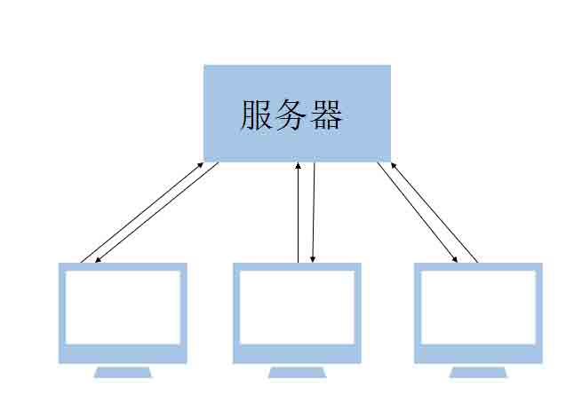
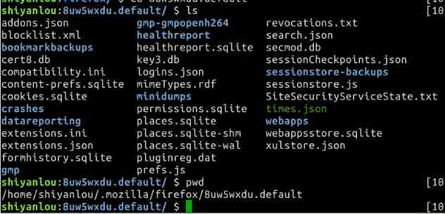
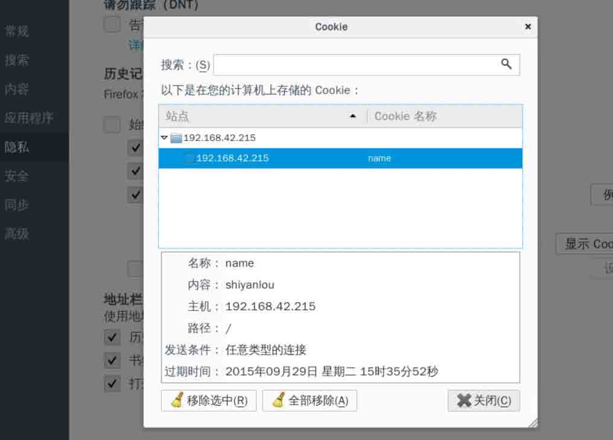
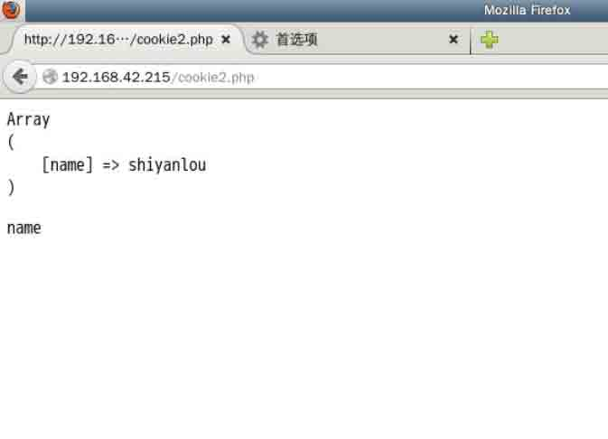

# 第 1 节 写在前面

```php
cookies 和 seeion 是 web 开发中比较重要的知识点，在编程中都是贯穿始终的。 
```

## 什么是会话

```php
会话可以简单理解为：用户打开一个浏览器，点击多个超链接，访问服务器多个 web 资源，然后关闭浏览器，整个过程称之为一个会话。 
```

### 问题场景

每个用户在使用浏览器与服务器进行和会话的过程中。都会产生一些数据。比如购物车，每个用户查看购物车的时候，都能看到自己的选择，但是他们用的都是一套系统（简单的说都是访问的后台的相同 php 文件），那么如何才能让不同的人看到自己的购物车里面的内容呢。

思路：保存在数据库里面， 这是一个不错的方案，它的优缺点我们在后面再讨论.

还有那么一些视频网站，可以保存你上次看过电影(在你还没有登陆的时候)，如何解决？

### 解决之道

#### 会话技术

*   cookies
*   session

这两个东西是有千丝万缕的联系的，我们先讲 cookies 然后讲 session.
session 与 http 协议有着莫大的关系，如果你之前了解 http 协议的话，你会有一个深入的了解，如果没有基础也没关系，比如 http://www.baidu.com 前面为什么要加 http？是因为在网络传输中有着各种各样的协议，就像双方（发送方和接受方）达成约定。我们开始吧。

#### 分析

大家在访问某个网站的时候，是否能看到提示你上次登陆网站的时间，比如一些银行，邮箱，或者 qq，都会提示你曾经在什么时候登陆过。如何实现的？ 还有在浏览比如淘宝京东的时候，提示你上次浏览的商品有哪些，不同用户浏览过的商品肯定不一样，这是怎么实现的呢

如何提示用户上次登录网站的时间。如何保存上次用户浏览的信息，如何保证用户在一定时间内，不用反复登陆

## cookie

在英文中是小甜饼的意思，它是一种客户端技术，服务器把每个用户的数据以 cookies 的形式写给用户各自的浏览器。哈哈~平时是不是经常在浏览器中看见清除（cookies)之类的提示啊。当用户通过一个浏览器再去访问服务器中的 web 资源时，就会带着各自的数据区，这样！web 处理的就是用户各自的数据了！ 

**简单的说**
服务器在客户端保存用户的信息，这些信息就像是小甜饼一样，数据量并不大，服务器端在需要的时候可以从客户端读取，保存在客户端的浏览器缓存目录下，都很小！！一般在 2~3k 之内

cookie 可以用来做什么？

1.  保存上次登陆时间信息等等
2.  保存用户名，密码，在一定时间不用重新登陆
3.  记录用户访问网站的喜欢，比如 google 打开首页，自定义首页 .....

## cookies 的基本使用

cookie 在客户机的某一个目录
根据你的浏览器，会有不同的保存方式，保存的路径还与操作系统有关
如果是 IE 浏览器就是在 C:\Doucumemt and Settings\用户名\cookie，以 txt 保存。

这里我们以实验楼 linux 系统 火狐浏览器为例子
进入 firefox 的目录（需要先打开一次浏览器）

```php
cd ~/.mozilla/firefox   #然后进入第一个文件夹 
```


可以看到里面有个 cookie.sqlite 文件，这个是一个数据库格式文件，可见火狐将字符串存入了数据库。 我们可以开打火狐浏览器

1.  选择设置
2.  选择“隐私”选项
3.  历史记录-选择“使用自定义历史记录”
4.  点“显示 cookies"

可以看见里面有各种站点显示的文件。
就是一个字符串
我们来写一个
关于用 php 操作 cookie 的函数，可以在 php 手册中查看 [php 手册](http://www.php.net/manual/zh/) 在手册里面的-其他服务-Network
其中一个方法加做，setcookies

### cookie 的存取

让我们来试一下

1.  启动 Apache2 服务器

```php
service apache2 start 
```

1.  进入目录

```php
cd /var/www/html 
```

1.  新建 cookie1.php，写入以下代码

```php
<?php  
//演示如何创建 cookies 信息
//把用户名和密码保存在客户端的 cookies
//这个函数用来保存 cookie
//key--value 的形式保存
setcookie("name","shiyanlou",time()+3600);
echo "success!";
?> 
```

1.  浏览器打开访问 php

然后，然后！我们打开刚刚火狐设置里面的 Cookie，就发现了多个一条记录



这是它的一个初步使用.
注意保存多少时间是 time()+3600，time()是当前时间。
代码说明：

1.  当浏览器访问 cookie1.php 页面的时候，我们的服务器就会以 Set-Cookie:name=xxx;expires=xxxx 回送 http 响应，当浏览器获取到该信息后，就会保存该 cookie 到新的 xxx 文件
2.  如果我们没有时间参数 cookie 不会保存到客户端，当浏览器的会话结束，我们的 cookie 就会失效。
3.  cookie 保存的信息形式
4.  客户端可以保存多个键值对
5.  cookie 可以保存中文，但是会进行 urlencode 编码
6.  cookie 可以有多个键值对(而 session 是统一的)，还可以给不同的键值对指定不同的有效时间

### 把 cookie 取出来(超时之后就取不出来了)

```php
//cookie2.php
<?php
//获取 cookie 信息
echo "<pre>";
print_r($_COOKIE);
echo "<pre>";
$name=$_COOKIES['name'];
echo "name".$name;
?> 
```



cookie 可以分别设置各个键值对保存的时间，如：setcookie('name','shiyahlou',time()+100),setcookie('age',10,time()+200).

#### `说明：`

cookie 时间到了就不能取出来了！可以实验一下。 把时间设置短一点，30 秒吧，将 cookie1.php 的时间设置为 time()+30
30 秒之后再执行 cookie2.php，cookies2.php 写入以下测试代码
就会发现，cookie 失效了

```php
if(!empty($_COOKIE['name'])){
    echo $name;
}else{
    echo "fail";
} 
```

为什么呢？其实这个跟 http 协议有关，它发包的时候没有带 cookie 了(因为超时过期了)，http 协议规定要携带网站 cookie，所有 web 开发都遵循此规范

这个机制是 http 协议规定的

可以保存多个数据，明文方式！！所以是比较危险的如果用来保存密码

```php
setcookie("name","passwd",time()+3600);
setcookies("name","shiyanlou1",time()+60);     //这个值在一分钟后会过期
setcookies("name","shiyanlou2",time()+3600);
setcookies("name","shiyanlou3",time()+3600);
setcookies("name","shiyanlou4",time()+3600); 
```