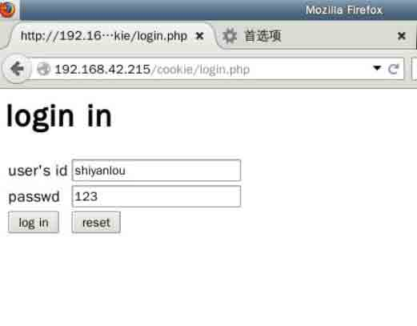

## cookie 的“增删改查”

用 cookie1，2，3，4 四个文件来说明 从这里开始第二节，其实就是围绕着“增删改查”来讲的，***增添和查询就是通过 cookie 的存取来实现的，在之前已经实践了***。这下我们来讲一下 cookie 的更新和删除

*   ###更新数据 如何更新 cookie 信息,首先必须是是针对一个用户，setcookie 会覆盖之间的记录，非常简单

```php
<?php
//更新
setcookie("name","chengdu",time()+300);
echo "new record"
?> 
```

自己可以试试哦，打开浏览器，发现果然变化了。

*   ###删除数据 其实删除数据是通过修改 cookie 的有效时间来实现的。

1.  删除指定键值对
2.  删除所有键值对 指定删除某一个 key<==>val
    说白了其实就是减少它存在的时间,让保存时间过期,时间减少多少都可以

```php
<?php
//删除指定键名 cookie
setcookie("key","",time()-200);
//删除所有，当全部删掉的时候，文件夹也会被删掉
foreach($_COOKIES as $key=>val){
    setcookies("key","",time()-1)
}
?> 
```

# 第 2 节 项目实践

有一个购物车项目，加入两个功能

1.  显示上次登录的时间
2.  自动填写用户名和密码

*   如果用户是第一次访问该页面，则提示“您是第一次访问”
*   如果不是第一次访问，则显示上一次登陆时间
*   实现打开登陆界面，自动填写用户名。
*   首先在前端界面添加一个复选框

## 1.显示上次登录的时间

实现这个需要一个前端界面，一个后端数据处理

## `前端：login.php`

```php
<html>
<head></head>
<body>
    <h1>xxxx 管理系统</h1>
    <form action="loginProcess.php" method="post">
        <table>
            <tr>
                <td>用户 id</td>
                <td><input type="text" name="id"/></td>
            </tr>
            <tr>
                <td>密码</td>
                <td><input type="passwd" name="password"></td>
            </tr>
            <tr>
                <td><input type="submit" value="用户登陆"/></td>
                <td><input type="reset" value="重新填写"/></td>
            </tr>
        </table>
    </form>
</body>
</html> 
```



### `后端：loginProcess.php`

这段代码的作用就是检验 cookie 是否为空，为空则说明是第一次登陆，不为空则说明不是第一次登陆，就把上次登陆的时间打印出来。然后这一段代码可以封装成为一个函数，用的时候再 require 一次。

```php
<?php
echo "welcome".$_GET['name']."login success!!";
echo "<br/><a href='login.php'>返回重新登陆</a>";
if(!empty($_COOKIE['lastVist'])){
    echo "你上次登录时间是".$_COOKIE['lastVist'];
    //更新时间
    setcookie("lastVist",date("Y-m-d H:i:s"),time()+24*3600*30); 
}else{
    //用户第一次登陆
    echo "你是第一次登陆";
    setcookie("lastVist",date("Y-m-d H:i:s"),time()+24*3600*30);
}
?> 
```

## 作业

###完成自动填写用户名和密码

思路和参考代码如下：

分为两个部分

1.  判断是否该填写（看用户有没有选中保存，用户有没有登陆过）
2.  自动填写（定义一个填写的函数）

在 login.php 加入复选框，加入自动填写函数

```php
<?php
function getCookieVal($key){
    if(empty($_COOKIE['$key'])){
        return "";
    }esle{
        return $_COOKIE['$key'];  
    }
}
?>

<html>
<head></head>
<body>
    <h1>xxxx 管理系统</h1>
    <form action="loginProcess.php" method="post">
        <table>
            <tr>
                <td>用户 id</td>
                <td>
                    <input type="text" name="id" value="<?php echo getCookieVal("id"); ?>"/>
                </td>
            </tr>
            <tr>
                <td>密码</td>
                <td><input type="passwd" name="password"></td>
            </tr>
            <tr>
                <td colspan="2">是否保存用户 id
                    <input type="checkbox" value="yes" name="keep">
                </td>
            <tr>
            <tr>
                <td><input type="submit" value="用户登陆"/></td>
                <td><input type="reset" value="重新填写"/></td>
            </tr>
        </table>
    </form>
</body>
</html> 
```

然后在 loginProcess.php 里面直接填写

```php
//接受用户数据
//1.获取 id
$id=$_POST['id'];
//2.获取密码
$password=$_POST['password'];
//3.获取用户是否选中了保存 id
if(empty($_POST['keep'])){
    echo "用户不保存";
    //判断是否存在保存 id 的 cookie，若存在则清理
    if(!empty($_COOKIE["id"])){
        setcookie("id",$id,time()-100);
    }
}else{
    echo "用户保存";
    setcookie("id",$id,time()+7*2*2*3600); 
} 
```