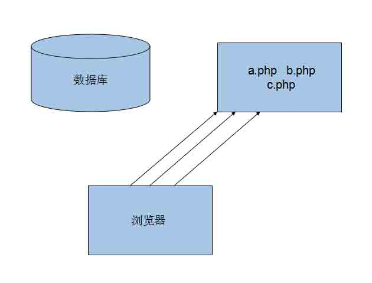
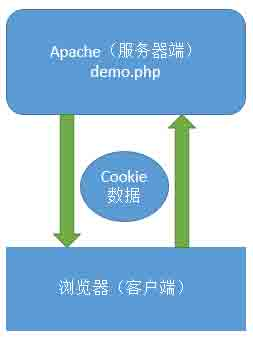
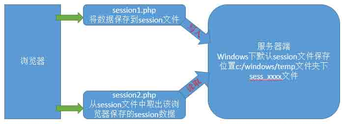
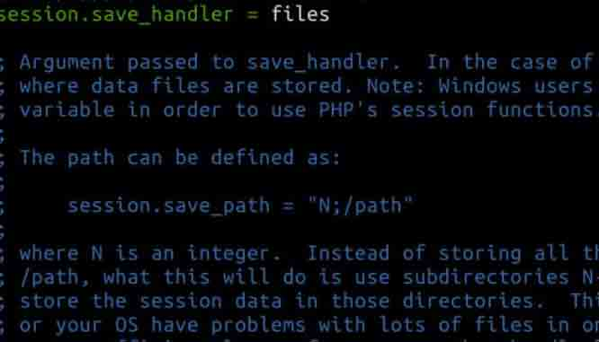
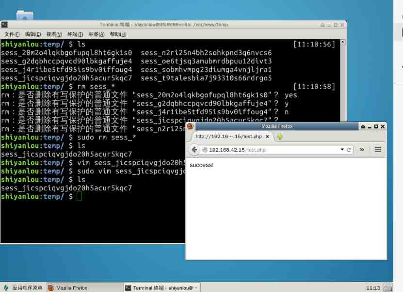
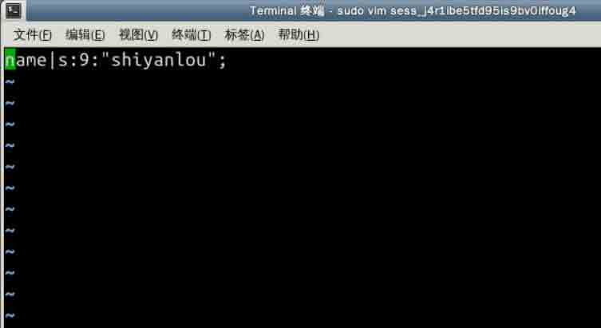

# 第 3 节 session 介绍

简单的说 cookie 是存在本地的，而 session 是存在服务器端的

## 思考问题

在网页跳转的时候，都可以显示登陆人的名字，比如上淘宝网，不管上哪个页面都可以把自己的数据取出来
不同的人可以看到自己不同的数据，查看登陆的名字
比如 A 和 B 在淘宝上买了不同的东西，他们能看见自己购物车里面的东西，而且在页面跳转的时候，不失效

### `数据库实现？`

在不同的页面之间的跳转，实现太复杂和麻烦，每一次查看调用数据库，服务器负荷太大 

### `cookies 实现？`

安全性不高
在网络传数据（带宽的浪费）


### `解决之道---session 技术（将用户数据保存在服务器端）`



这个 session1.php 可以把数据保存在 session 文件中，它会有自己的一套方案，放在了 session 文件的默认路径中 windows 下 c:/winodws/temp/sessionxxx,在写入的时候会建立，session2.php 可以从 session 文件中取出该浏览器保存的 session 数据。 通过案例来讲，因为会比较抽象。

### **Session 的初步介绍**

首先，他是一种服务器技术，session 在运行时候，会为每个用户的浏览器创建一个其独享的 session 文件。由于 session 为用户浏览器独享，所以用户在访问服务器的 web 资源时，可以把各自的数据放在各自的 session 中。
由于 session 为用户浏览器独享，所以用户在访问服务器的 web 资源时候，可以把各自的数据放在各自的 session 中，当用户再去访问服务器中的其他 web 资源时。其他 web 资源再从用户各自的 session 中取出数据为用户服务。

key points:

*   session 是服务端技术
*   原理示意图
*   增删改查

### **session 文件的保存位置 **

session 目录保存路径在 php.ini 配置文件里面
php.ini 这个文件在/etc/php5/apache2 里面,打开 php.ini 找到 session.save_path 发现被注释掉了 

我喜欢把路径写成

```php
session.save_path="/var/www/temp" 
```

但是要记住建立这个目录，就可以愉快的玩 session 了

## **session 的基本用法**

1.  启动 Apache2 服务器

```php
service apache2 start 
```

1.  进入目录

```php
cd /var/www/html 
```

1.  新建 php 文件或者 html，写代码

```php
<?php 
.......
?> 
```

1.  浏览器打开访问 php
2.  常见问题

```php
文件没有写入：一般就是 linux 下的权限问题
sudo chmod -R 777 /var/www/ 
```

### **增删改查（crud）**

```php
<?php
    echo "<br/>***演示如何保存 session 数据***<br/>";
    //1.初始化 session
    session_start();
    //2.保存数据
    $_SESSION['NAME']="shiyanlou";
    //session 文件中可以保存 double,inerger,bool,array,object;
    $_SESSION['age']=100;
    $_SESSION['isboy']=ture;
    //保存数据
    $arr1=array("成都","电子科技大学");
    $_SESSION['arr1']=$arr1;
    //保存一个对象到 session 文件
    echo "保存成功";
?> 
```

 

保存的数据格式
name|s:8:"shiyanou"

然后，我们就进入我们保存 session 的目录就可以看见了。
比如我保存的路径是/var/www/temp 这个目录
session 的储存方式是 key-value 这样的方式储存 name 就是 key
s:表示数据类型
8:数据大小

```php
保存一个对象到 session 文件
class Dog{
    private $name;
    private $age;
    private $intro;

    function __construct($name,$age,$intro){
        $this->name=$name;
        $shit->age=$age;
        $this->intro=$intro;
    }
    public function getName(){
        return $this->name;
    }
}
    $dog1=new Dog("大狗",5,"很好的一只狗");
    $_SESSION['dog1']=$dog1;
    echo "保存 OK"; 
```

session 中可以保存的数据有 string,integer,double,boolean,array,object

### **小结**

1.  要使用 session,都需要初始化 session_start();
2.  取出基本信息
3.  取对象

```php
<?php
    //获取 session
    echo "<br>获取 session 数据</br>";
    //1.把所有的 session 获取
    session_start();
    print_r($_SESSION);
    //2.通过 key 来指定获取某个值
    echo "名字是":$_SESSIOIN['name'];
    $arr1=$_SESSION['arr1'];
    foreach($arr1 as $key=>$val){
        echo "<br/>--$val";
    }
    //3.取出对象,因为是私有的，要提供一个 public 方法
    echo "<br/> dog'name is ".$xiaoguo->getName();
?> 
```

可能报错:对象不完整 因为在存 session 的时候，会把“类”这个概念丢失。不然不知道这是一个类，要在 session 取出来之前声明一下这个类的信息

```php
class Dog{
    private $name;
    private $age;
    private $intro;
    function _construct($name,$age,$intro){
        $this->name=$name;
        $this->age=$age;
        $this->intro=$intro;
    }
    public function getName(){
        return $this->name;
    }
}
    $xiaoguo=$_SESSION['dog1'];
    echo "<br/> dog'name is ".$xiaoguo->getName(); 
```

如果觉得麻烦，可以写成这样的
然后把 Dog 类封装
require_once "Dog.class.php"，注意写在 session 之前。

### **更新 session**

其实就是重新存入，刷新以前的数据;

```php
<?php
   //更新
   session_start();
   $_SESSION['name']="shiyanlou";
?> 
```

### **删除 session**

```php
//删除某一个 key<==>value
session_start();
unset($_SESSION['name']);     //unset 是释放给定变量;
echo "success";
//删除所有的 key<==>value
session_destroy();            //删除当前这个浏览器对应的 session 文件 
```

一个 session 对应的是一个浏览器中的一个会话

在写代码的时候 用 empty()去判断,session 文件的存在