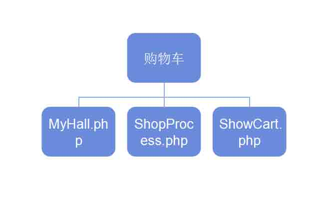
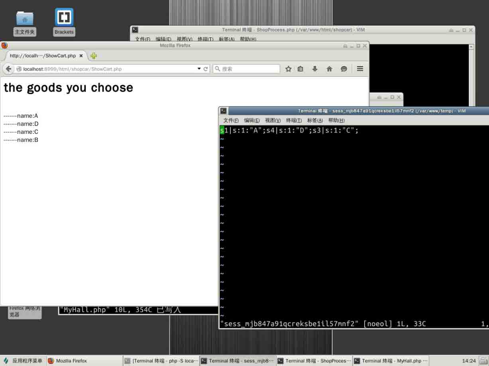
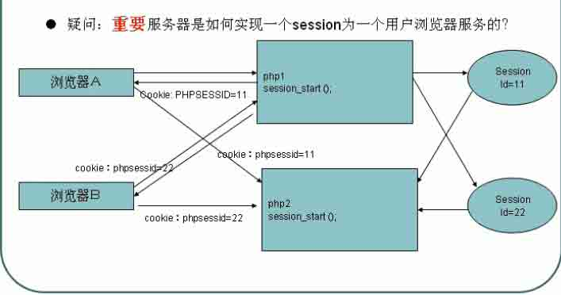

# 第 4 节 项目实践

## 结构图



## 环境

1.  启动 Apache2 服务器

```php
service apache2 start 
```

1.  进入目录

```php
cd /var/www/html 
```

1.  新建 php 文件或者 html，写代码

```php
<?php 
.......
?> 
```

1.  浏览器打开访问 php
2.  常见问题

```php
//文件没有写入：一般就是 linux 下的权限问题
sudo chmod -R 777 /var/www/ 
```

有三个页面

1.  MyHall.php --------购物大厅
2.  ShopProcess.php --------保存 session
3.  ShowCart.php ----------展示

### 第一个页面

MyHall.php ----------购物大厅

```php
<?php 
    //购物大厅
    echo "<h1>欢迎购买</h1>";
    echo "<a href='ShopProcess.php?bookid=s1&bookname=A'>A</a>";
    echo "<a href='ShopProcess.php?bookid=s2&bookname=B'>B</a>";
    echo "<a href='ShopProcess.php?bookid=s3&bookname=C'>C</a>";
    echo "<a href='ShopProcess.php?bookid=s4&bookname=D'>D</a>";
    echo "<hr/>";
    echo "<a href='ShowCart.php'>查看购买的商品列表</a>";
?> 
```

### 第二个页面

ShopProcess.php-----------处理请求

```php
<?php
//接受用户购买请求，并把书保存在 session 中
$bookid=$_GET['bookid'];
$bookname=$_GET['bookname'];
//保存到 session 中
session_start();
$_SESSION["$bookid"]=$bookname;
echo "<br/>购买商品成功!";
echo "<br/><a href='MyHall.php'>返回购物大厅</a>";
?> 
```

### 第三个页面

ShowCart.php-------------展示

```php
<?php
    session_start();
    echo "<h1>购物车商品有</h1>";
    foreach($_SESSION as $key=>$val){
        echo "<br/> -----------$val";
    }
?> 
```



***注意 session 中 key-value 的储存方式中，key 不能为数字***

## 思考：

如果用户禁用浏览器的 cookie 那么就不能在一次会话中用同一份 session

原因在于：在禁用 cookie 以后，的确是在服务器端创立了 session 文件， 服务器也的确是返回来 set cookie 的信息。但是因为浏览器禁用了 cookie 所以不会接受到。 所以每一次发送请求都会创建新的 session，

当用户禁用 cookie 以后，每次访问的时候，都会创建一个 session 后果就是无法让多个 php 页面去共享同一份 session 文件，糟糕了

## 解决方案：

从底层机制入手，首先要明白，为什么多个页面可以共享 session。 从 cookie session http 这三个方面入手解决事情。



在没有禁用 cookie 的时候，会传递一个 PHPSESSID 这个东西，所以我们可以先获取这个 PHPSESSID,然后我们自己来传递啊
然后叫服务器不要创建新的 session，而是获取那个 sessionId

在 MyHall.php 中添加如下东西

```php
session_start();               //开启 session
$sid=session_id();             //获取 sessionid
echo "<a href='ShopProcess.php?bookid=001&bookname=第一本书&PHPSESSID=&sid>第一本书</a><br/>"; 
```

在 ShowCart.php 中添加如下东西

```php
//不能让服务器创建一个新的 session
//注意：设置 session_id()必须在 session_start()之前调用
if(isset(&_GET['PHPSESSID'])){
    session_id($_GET['PHPSESSID']);
}
session_start(); 
```

### 总结问题

**请问客户端禁用了 cookie,怎么实现 session 技术共享多个页面**

答：

*   方案一 在每个超链接上添加一个 PHPSESSID=sessionId;
    同时在每个页面加入

```php
if(isset($_GET['PHPSESSID'])){
    // 设置 session_id
    session_id($_GET['PHPSESSID']);
}
session_start();.... 
```

*   方案二 使用常量 在超链接 action header("Location:xx")可以直接拼接 SID 常量即可
    echo "sid===".SID.; 直接传入 SID
*   方案三 透明的 SID 支持
    php.ini 配置选项，里面有一个 session.use*trans*sid=0 设置为 1
    (在 herf action header 会自动添加 SID,但是 js 跳转不会自动增加); 重启 apache 可以生效