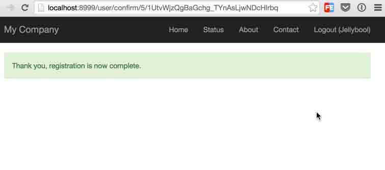

# 第 1 节 Yii 的安装

本课程基于 Yii 2.0 的`basic`版，参考文档来自于 Yii 官方文档：

http://www.yiiframework.com/doc-2.0/guide-index.html

## 实验说明

实验楼的环境已经将 Yii 安装好了，你可以直接把得到的`helloYii/`文件拖到 Brackets 编辑器进行代码编写。

## 安装步骤演示

你可以通过两种方法来安装 Yii(本教程中 Yii 如没有特殊说明，指的是 Yii 2.0)，使用 Composer 安装或者直接下载代码包。这里提倡大家都使用 Composer 来安装，因为这样对于后续的代码管理会方便很多，如果你对 Composer 还不太熟悉，请直接到官网看文档：

[`getcomposer.org/download/`](https://getcomposer.org/download/)

这里实验楼的环境已经安装好 Composer 环境，并且将 Yii 已经安装好了，下面的安装步骤说明是为了演示 Yii 的安装步骤，就是我们之前是怎么在 linux 上安装 Yii 的。

## Composer 安装 Yii

** composer 是什么？**

简单的说就是一个管理各种 php 插件的工具。

下面的命令需要环境具有联网权限，可以简单了解，直接到下一节下载安装即可。

在命令行中执行下面的两行命令：

```php
composer global require "fxp/composer-asset-plugin:~1.0.3"
composer create-project --prefer-dist yiisoft/yii2-app-basic helloYii 
```

这里的第一条命令会安装 `composer asset plugin`这个插件，这插件可以让我们通过 Composer 来管理我们的前端需要的 Bower 包和 NPM 包。第二条命令就是使用 Composer 的`create-project`命令来创建我们的项目，项目名称就是`helloYii`。这里需要注意的是：Yii 提供两个版本供我们下载，`advanced`和`basic`；而我们现在的版本是基于`basic`版：

```php
basic: Yii 框架的核心部分

advanced: Yii 的核心部分和 Yii 官方为你写好的前台(frontend)和后台(backend)部分。 
```

> 在安装的过程中，Composer 可能会需要你输入 Github token，这个时候你需要到 Github 账号去生成一个 token >

安装完成的时候，你大概会看到 Composer 的这些信息：

```php
Writing lock file
Generating autoload files
> yii\composer\Installer::postCreateProject
chmod('runtime', 0777)...done.
chmod('web/assets', 0777)...done.
chmod('yii', 0755)...done. 
```

## 直接下载压缩包安装

如果你还是坚持使用下载压缩包的形式来安装 Yii，你可以到这里来下载相应版本的压缩包：

http://www.yiiframework.com/download/

可以从下面的链接可以直接 wget 到实验楼的环境中：

```php
cd /home/shiyanlou/Desktop/

# 下载安装包
wget  http://labfile.oss.aliyuncs.com/courses/410/yii-basic-app-2.0.4.tgz

# 解压缩
tar zxvf yii-basic-app-2.0.4.tgz

# 修改名称
mv basic helloYii 
```

然后编辑`config/web.php`文件，填入`cookieValidationKey`，如果你没有`cookieValidationKey`，可以直接填入下面这个：

```php
'cookieValidationKey' => 'uQWHaivuRnsULO-7MBE405SPBuUbBHlZ' 
```

这两种安装方式都会给我们创建一个`helloYii/`文件夹，这个文件夹里面的文件目录大概是这样的：

```php
helloYii/                  应用根目录
    composer.json       Composer 配置文件, 描述包信息
    config/             应用配置及其它配置
        console.php     控制台应用配置信息
        web.php         Web 应用配置信息
    commands/           控制台命令类
    controllers/        控制器类
    models/             模型类
    runtime/            Yii 在运行时生成的文件，例如日志和缓存文件
    vendor/             已经安装的 Composer 包，包括 Yii 框架自身
    views/              视图文件
    web/                Web 应用根目录，包含 Web 入口文件
        assets/         Yii 发布的资源文件（javascript 和 css）
        index.php       应用入口文件
    yii 
```

这里我们需要注意的是 helloYii/web 这个文件夹，因为这是我们的应用可通过 url 来访问的文件夹，其他文件和文件的访问都会重定向。

既然安装好之后，我们现在来运行一下我们的应用，借助 PHP 内置的服务器，我们可以很快捷的访问我们的应用：

```php
cd helloYii/web

php -S localhost:8999 
```

以上的最后一行命令就是开启 PHP 的内置服务器，现在我们就可以通过浏览器地址栏访问`localhost:8999`来访问我们的应用了，如果不出意外，我们就可以看到 Yii 的欢迎页面了：


如果你在访问的时候出现报错的情况，你可以通过`http://localhost:8999/requirements.php`来查看可能是出了什么错误，或者你也可以直接使用命令行来检查：

```php
cd helloYii
php requirements.php 
```

如果这里给出一些提示，你可以按照提示去配置自己的 PHP，最重要的是 PHP 5.4 版本以上 PDO PHP 插件等。

## 配置服务器

上面使用 PHP 的内置服务器是为了开发方便，如果你需要对 Apache 或者 Nginx 进行配置，那么你可以考虑以下的两个配置信息：

**配置 Apache**

找到你的`httpd.conf`文件，然后将网址的根目录指向`helloYii/web`，这里请注意将`path/to/helloYii/web`换成你的实际目录

```php
# Set document root to be "helloYii/web"
DocumentRoot "path/to/helloYii/web"

<Directory "path/to/helloYii/web">
    # use mod_rewrite for pretty URL support
    RewriteEngine on
    # If a directory or a file exists, use the request directly
    RewriteCond %{REQUEST_FILENAME} !-f
    RewriteCond %{REQUEST_FILENAME} !-d
    # Otherwise forward the request to index.php
    RewriteRule . index.php

    # ...other settings...
</Directory> 
```

**配置 Nginx**

Nginx 最近几年的势头越来越猛，如果你也想使用 Nginx 的话，推荐你可以参考下面的配置：

```php
server {
    charset utf-8;
    client_max_body_size 128M;

    listen 80; ## listen for ipv4
    #listen [::]:80 default_server ipv6only=on; ## listen for ipv6

    server_name mysite.local;
    root        /path/to/helloYii/web;
    index       index.php;

    access_log  /path/to/helloYii/log/access.log;
    error_log   /path/to/helloYii/log/error.log;

    location / {
        # Redirect everything that isn't a real file to index.php
        try_files $uri $uri/ /index.php?$args;
    }

    # uncomment to avoid processing of calls to non-existing static files by Yii
    #location ~ \.(js|css|png|jpg|gif|swf|ico|pdf|mov|fla|zip|rar)$ {
    #    try_files $uri =404;
    #}
    #error_page 404 /404.html;

    location ~ \.php$ {
        include fastcgi_params;
        fastcgi_param SCRIPT_FILENAME $document_root/$fastcgi_script_name;
        fastcgi_pass   127.0.0.1:9000;
        #fastcgi_pass unix:/var/run/php5-fpm.sock;
        try_files $uri =404;
    }

    location ~ /\.(ht|svn|git) {
        deny all;
    }
} 
```

在上面的配置中，注意将`path/to/helloYii/web`换成你想对应的站点目录，

注意：在使用 Nginx 进行上述配置的时候，需要注意将`php.ini`的`cgi.fix_pathinfo=0`配置好。

安装完 Yii2 之后，进入到项目的 web 目录：

```php
cd helloYii/web 
```

开启 PHP 内置服务器：

```php
php -S localhost:8999 
```

然后再浏览器输入 localhost:8999，你就可以看到下面的页面了：


这里需要说明的是：我是在 mac 下进行的开发，并且处于便捷的原因，我后续也会一直使用 PHP 内置服务器，也就是说本教程的 localhost:8999 是我默认的首页地址。至于用 MAMP for OS X 的用户，你可以直接配置 MAMP

```php
cd /Applications/MAMP/htdocs
ln -s ~/Desktop/helloYii/ /Applications/MAMP/htdocs/helloYii 
```

然后你可以访问这样的地址：http://localhost:8888/helloYii/web，不出意外，你也可以看 Yii 默认的可爱首页了。

对于用 Windows 的同学，我建议你们直接用 WAMP，不过具体配置我倒是没有实际操作过，所以不做任何评论。

关于 Yii2

MVC 的支持就基本不用多说了，之前发过一篇文章粗略地说过一遍。而在这里我想说明的是：在 Yii2 中，我们的单入口文件是 web/index.php，所以刚刚在开启 PHP 内置服务器的时候需要来到这个目录，不过如果你直接指定也是可以的。这个文件负责将 Yii2 项目所需要的东西全部加载完成之后，最后通过 run 方法来使得整个项目可以跑起来：

```php
<?php

// comment out the following two lines when deployed to production
defined('YII_DEBUG') or define('YII_DEBUG', true);
defined('YII_ENV') or define('YII_ENV', 'dev');

require(__DIR__ . '/../vendor/autoload.php');
require(__DIR__ . '/../vendor/yiisoft/yii2/Yii.php');

$config = require(__DIR__ . '/../config/web.php');

(new yii\web\Application($config))->run(); 
```

默认的情况下，我们看到的 Yii2 首页是/controllers/SiteController.php 下的 Index 方法：

```php
public function actionIndex()
    {
        return $this->render('index');
    } 
```

通常情况下，控制器一般都会有比较多的方法来链接模型和视图之间的桥梁，但是方法虽多，很多时候都只是一些简单的代码和逻辑，所以，不用担心。

上面的 Index 方法渲染了 index 这个模版，而这个模板位于/views/site/index.php，至于控制器和视图之间的命名规则，参考这里：

```php
views/ControllerID/ViewName.php 
```

ControllerID : 表示控制器的 ID，也就是控制器去掉 Controller 的前缀，比如 SiteController 就对应 site

ViewName : 是对应方法的名字，但是不包括 action 字眼，比如 actionIndex 对应的是 index.php

而在使用 render 方法来渲染视图的时候，Yii2 默认地也会渲染载入/views/layouts/main.php 这个文件，而这个文件做的事就是载入一些 html 头部的共用文件，比如 js，css，导航栏和底部繁荣导航栏等。这里其实我们最值得关心的其实就是下面这段代码的`<?= $content ?>`：

```php
<?= Breadcrumbs::widget([
                'links' => isset($this->params['breadcrumbs']) ? $this->params['breadcrumbs'] : [],
            ]) ?>
            <?= $content ?>
        </div> 
```

这个`<?= $content ?>`可以说就是我们之后定义视图的内容，我们后续创建的视图文件会被读成字符串的形式赋给$content，然后进行渲染显示。

## Hello World

有了上面的安装和基本知识之后，我们就可以自己动手来创建一个页面了。不过在创建页面之前，我们先来做一点简单的配置：开启 Yii2 的 enablePrettyUrl 模式，因为这样对于后续的开发会便捷很多，而且开启之后，我们的 url 也会变得很简洁又好，不想现在这样：

```php
http://localhost:8999/index.php?r=site%2Fabout 
```

这是我点击首页导航栏的 About 出现的 url，一看到这个，我是拒绝的，所以来到/config/web.php 这个配置文件中，找到`'components' => []`这个数组，加入下面的两行代码：

```php
'urlManager' => [
            'showScriptName' => false,
            'enablePrettyUrl' => true
        ], 
```

加入之后，正确的代码配置是长成这个样子的：

```php
'components' => [
        'urlManager' => [
            'showScriptName' => false,
            'enablePrettyUrl' => true
        ],
        'request' => [ 
```

这样开启 enablePrettyUrl 模式之后，我们就可以通过 http://localhost:8999/site/about 来访问我们的 About 页面了，这里的规律是这样的：

```php
http://localhost:8999/ControllerID/ActionName 
```

比如，我们在/controllers/SiteController.php 创建一个 Say 方法：

```php
public function actionSay($target = 'World')
{
    return $this->render('say', ['target' => $target]);
} 
```

我们要访问这个方法的正确路径就是 http://localhost:8999/site/say 。

在 Yii 中使用 action 关键字前缀来区分用于 url 操作方法和其他方法，这里的 actionSay 接收一个参数$target，如果用户在访问的时候传入 target 参数，target 就为用户传入的值，而如果用户没有传入，我们将其默认值设为 World。有了控制器的方法，从$this->render('say', ['target' => $target])这行代码来看，我们需要需要创建一个 say 模板文件，这个文件是在哪里的呢？

根据前面说的视图模板规则，它应该位于：/views/site/say.php。在里面简单写上下面这一小段代码：

```php
<?php
use yii\helpers\Html;
?>
<h1>Hello <?= Html::encode($target) ?></h1>
<p>Welcome to your Yii2 demonstration application.</p> 
```

出于安全的因素考虑，我们在 say.php 这个模版文件中使用了 yii\helpers\Html 类来对用户传入的数据进行过滤，所以我们才有了这样的输出：

```php
<?= Html::encode($target) ?> 
```

我们来访问 http://localhost:8999/site/say 试试，不出意外这时你看到的是这样的：


然后我们再来访问 ： http://localhost:8999/site/say?target=%E5%B0%91%E5%B9%B4%EF%BC%8C%E8%BF%98%E6%98%AF%E7%94%A8Yii%E5%90%A7


上一篇文章我们简单地实现了 Yii2 框架安装和 Hello World，而在这一篇文章当中，我们会带着好奇之心去探索一下在 Yii2 中的几个重要的元素组成： MVC，Forms 和 Layouts。

本文的目标是创建一个小小的表单应用，就是实现一个简单的类似发微博的功能，但是我还不想牵扯到数据库那一块，因为其实数据库和表在 Yii2 框架之中其实还是有很多东西可以讲的，打算在下一篇的文章中会详细讲到。

## MVC


模型(Model)对于我个人的简单理解就是一个概念集合，在这个集合里面包含该概念集合的多种数据，比如一个 User 会有姓名，性别等多个属性，这个概念集合通常就是对于数据库的一张表（如果还没有对应的数据表，则可以看作是一个集合的属性）；而每一个具体的实例概念就对应一条数据记录。比如在这一篇文章之中我们会创建一个 Status 模型，代表状态（来源于生活：发一条状态），这个 Status 会有两个重要的属性，text 和 permissions，text 就是状态本身，permissions 是状态的权限。

视图(Views)通过控制器想模型请求数据，并将数据以某种特定的版式展示给用户。

控制器(Controller)可以向 Model 和 Views 发送不同的指令，一般是向 Model 取数据，然后读取视图文件来渲染输出数据。

在 Yii2 的应用中，一般是这样的：某个 URL 指向某个控制器的特定 action，然后控制器负责向特定的模型取数据，然后将数据分配给视图渲染输出。

在这里说一下我个人的观点，我觉得其实在 MVC 当中，可能应该做事最多的应该是 Model，与之相迎合的是，Controller 和 Views 则相对要轻一些，Controller 负责协调 Model 和 Views，Views 负责展示数据。

在 Yii2 的项目当中，我们将 models 文件放在/models/目录之下，所以我们在这个文件夹之下创建 Status.php：

```php
<?php

namespace app\models;

use yii\base\Model;

class Status extends Model
{
    const PERMISSIONS_PRIVATE = 10;
    const PERMISSIONS_PUBLIC = 20;

    public $text;
    public $permissions;

    public function rules()
    {
        return [
            [['text','permissions'], 'required'],
        ];
    }

    public function getPermissions() {
      return array (self::PERMISSIONS_PRIVATE=>'Private',self::PERMISSIONS_PUBLIC=>'Public');
    }

    public function getPermissionsLabel($permissions) {
      if ($permissions==self::PERMISSIONS_PUBLIC) {
        return 'Public';
      } else {
        return 'Private';        
      }
    }
} 
```

这里需要注意的是 rules()这个方法，它会触发 Yii 自带的表单验证规则，比如这里就是 text 和 permissions 这两个表单输入框都不能为空，至于 getPermissions()这个方法是为了在使用 dropdown 输入框的时候使用的。

Status 模型创建好之后，我们就可以接着创建对应的控制器和方法。在平时的开发中我习惯是为每一个模型都创建一个对应的控制器，里面一般都是包含几个最常见的方法：index create store update delete 等。这里我创建一个 StatusController.php，这个文件应该是位于/controllers/文件夹当中，而我们希望实现一个发表状态的功能，我们必须需要一个 create 操作方法，比如我们的目的是：在用户访问 http://localhost:8999/status/create 的时候，我们可以展示创建一条状态的页面给用户。

```php
<?php

namespace app\controllers;

use Yii;
use yii\web\Controller;
use app\models\Status;

class StatusController extends Controller
{
    public function actionCreate()
    {
        $model = new Status;

        if ($model->load(Yii::$app->request->post()) && $model->validate()) {
            //  $model 有 post 数据时直接展示
            return $this->render('view', ['model' => $model]);
        } else {
            // 没有数据的时候，直接渲染 create 视图
            return $this->render('create', ['model' => $model]);
        }
    }
} 
```

首先，根据 URL 的规则，我们创建了一个 actionCreate()方法，在这个方法里，我们通过条件判断来确定展示某个特定的视图。

创建好控制器和方法之后，我们就可以走到下一步了：创建视图。在 Yii2 中，视图文件的存放位置跟控制器的名字是息息相关的，比如上面我们创建了一个 StatusController，我们现在首先需要在 views/创建一个 status/文件夹，然后在这个文件夹里创建各个跟 StatusController 相关的视图文件，比如上面 actionCreate()中 return $this->render()两个视图：view.php 和 create.php

## Forms

首先，我们需要一个 Create 视图来展示我们创建 Status 的表单(create.php):

```php
<?php
  use yii\helpers\Html;
  use yii\widgets\ActiveForm;
  use app\models\Status;
?>
<?php $form = ActiveForm::begin();?>
    <?= $form->field($model, 'text')->textArea(['rows' => '4'])->label('Status Update'); ?>

    <?=
    $form->field($model, 'permissions')->dropDownList($model->getPermissions(), 
             ['prompt'=>'- Choose Your Permissions -']) ?>

    <div class="form-group">
        <?= Html::submitButton('Submit', ['class' => 'btn btn-primary']) ?>
    </div>

<?php ActiveForm::end(); ?> 
```

在我们平时开发 web 应用的时候，表单几乎总是每时每刻都得存在，只要是需要收集信息的地方就需要表单。而 Yii2 在对表单支持这方面做得非常不错，就如你看到的一样，上面的[Yii2 ActiveForm](http://www.yiiframework.com/doc-2.0/yii-widgets-activeform.html)就是 Yii2 内置的用来帮助我们生成表单的小组件，这里需要注意的是 dropDownList 这个输入框式怎么实现的，它直接使用了 getPermissions()，这个方法正好返回了一个我们需要的数组。

这时候访问：http://localhost:8999/status/create 就可以看到上面创建的表单了：


至于为什么就自动排版好了，不用我们写 css，那是因为 Yii2 默认会给我们加载 Bootstrap 的 css 文件，所以我们在使用的时候直接指定类名就 OK 了。而且很明显地，我们可以看到，一旦输入框在失去焦点的时候，如果里面没有输入任何内容，每个输入框就会有相应的错误提示，用户体验很不错。这个其实是得益于我们在 Status 模型中声明的 rules()方法，Yii2 会根据指定的规则通过 js 在前端给出相应的验证。

然后我们尝试填入一些内容，你就会看到输入框的变化了：


点击 Submit 按钮，表单会提交到 StatusController 的 actionCreate()方法，一旦有 post 数据传过来，就会渲染 view.php 视图：

 到这里，其实我们就走通整个 MVC 的过程，并且在这个过程中，我们顺带说了一下 Forms 的知识点。

## Layouts

为什么要说 Layouts 呢？因为 Layouts 在 Yii 中其实可以看作是视图中经常重复用到的部分，比如一个 HTML 文件的 header，navigation bar 和 footer 等，这些都是几乎是在每一个视图文件中都会用到，所以 Yii 采取了一种一劳永逸的方法来管理这些共用的部分：Layouts 就应运而生。这样你就不用在每一个 view 文件中重复不必要的代码了，而且又特别好管理。

Yii 允许你创建多个 Layouts，不过我貌似还没遇到那样的使用场景，所以还是无法给出有实证的说法，不管怎么说，一个 Layouts 就基本够用了。

最后，我们借着 Layouts 的东风来看看我们怎么修改一下 Yii2 的默认导航栏：添加一个新的导航。

在上一节我就提到过 views\layouts\main.php 这个文件，里面的具体结构你可以直打开来看看，我们这里改动的是 Nav::widget 这部分：

```php
 echo Nav::widget([
                'options' => ['class' => 'navbar-nav navbar-right'],
                'items' => [
                    ['label' => 'Home', 'url' => ['/site/index']],
                    [
                        'label' => 'Status',
                        'items' => [
                            ['label' => 'Create', 'url' => ['/status/create']],
                        ],
                    ],
                    ['label' => 'About', 'url' => ['/site/about']],
                    ['label' => 'Contact', 'url' => ['/site/contact']],
                    Yii::$app->user->isGuest ?
                        ['label' => 'Login', 'url' => ['/site/login']] :
                        ['label' => 'Logout (' . Yii::$app->user->identity->username . ')',
                            'url' => ['/site/logout'],
                            'linkOptions' => ['data-method' => 'post']],
                ],
            ]); 
```

我们在本来的基础之上添加了下面这个内容：

```php
 [
    'label' => 'Status',
    'items' => [
        ['label' => 'Create', 'url' => ['/status/create']],
    ],
], 
```

这样之后，刷新一下页面，你就可以看到我们的导航变化了。而且很神奇的是：这里还实现了 dropdown menu 的功能，这个其实就是使用 Bootstrap 的 dropdown menu 来实现的。


嗯，这篇文章貌似讲得差不多了，至少我不知道还改讲些什么了，接下来的文章我会尝试讲讲 Yii2 的数据库相关的内容。

上一篇文章我们理了一下 Yii2 的 MVC，Forms 和 Layouts，这篇文章就直接按照约定来说说 Yii2 与数据库相关的一些事情，如果你觉得不够的话，不急，更具体的用法我会在后续的教程给出，并且这里也会介绍 Yii2 的代码生成工具：强大的 Gii。

接着上一篇文章，我们的初衷还是没有改变：创建一个可以发表状态(status)的 web 小应用，你可以看成是 QQ 空间的说说的 mini 版，只不过之前我们没有将数据存在数据库里面而已。

## 创建一个数据库


由于我平时开发基本都是使用 Mysql，而且数据库管理工具我比较喜欢 Sequel Pro，所以，我就直接在 Sequel Pro 里面创建一个`hello`的数据库。当然，你也可以直接用命令行来创建数据库，大概是这样的：

```php
1\. 打开 mysql 
    sudo services mysql start
2\. 进入 mysql，实验楼里面的 root 密码是空
    mysql -u root -p
    回车
3\. CREATE DATABASE hello; 
```

有了数据库之后，我们就可以将我们的 Yii 应用与数据库进行连接了，Yii2 的数据库配置文件位于/config/db.php 中，我们可以打开它来进行相应的配置，请注意根据自己的实际情况进行相应的修改：

```php
<?php

return [
    'class' => 'yii\db\Connection',
    'dsn' => 'mysql:host=localhost;dbname=hello',
    'username' => 'root',
    'password' => 'password',
    'charset' => 'utf8',
]; 
```

## 创建 Migration

这里直接使用了 migration 这个单词，其实我不知道该翻译成什么才比较确切；所以本文就直接使用 migration 这个单词了，如果你知道有特别贴切的翻译，请大声对我说。其实 migration 的最大目的可能就是创建数据表了，但是我们为什么还要使用 migration 了？这可能都是受到 Rails 大法的影响，因为这样的好处其实很多，migration 不仅可以让开发人员动态创建和更新一个数据库表的 schema，还可以应对多个服务器的时候环境不同的问题，直接就避免导入 sql 文件的各种坑。

至于在代码中我们该怎么命名我们的数据表，我比较喜欢的是直接跟 Model 一样，如果是单复数问题也无所谓，这看个人，所以这里，我会选择创建一个 status 表，iTerm 命令行执行：

```php
cd Desktop/helloYii/

./yii migrate/create create_status_table 
```

过程当中会询问是否创建 migration，果断 yes，然后完成之后大概是这样的：


这条命令会在项目目录下创建一个 migrations/目录，里面就有刚刚我们创建的 migration 文件，名字大概是这样的：`m150804_035107_create_status_table.php`，然后我们就可以打开这个文件来一睹芳容了：

```php
<?php

use yii\db\Schema;
use yii\db\Migration;

class m150804_035107_create_status_table extends Migration
{
    public function up()
    {

    }

    public function down()
    {
        echo "m150804_035107_create_status_table cannot be reverted.\n";

        return false;
    } 
```

嗯，大概就是这样，up()方法是我们后面执行./yii migrate/up 命令的时候触发的，这里一般都是负责创建一个表，我们可以将表的 schema 写在这个方法里面。

## 创建 status 表

有了上面的 migration 之后，我们可以直接在 up()方法写上一些我们的字段和配置：

```php public function up() { $tableOptions = null; if ($this->db->driverName === 'mysql') { $tableOptions = 'CHARACTER SET utf8 COLLATE utf8*unicode*ci ENGINE=InnoDB'; }

```
 $this->createTable('{{%status}}', [
          'id' => Schema::TYPE_PK,
          'message' => Schema::TYPE_TEXT.' NOT NULL DEFAULT ""',
          'permissions' => Schema::TYPE_SMALLINT . ' NOT NULL DEFAULT 0',
          'created_at' => Schema::TYPE_INTEGER . ' NOT NULL',
          'updated_at' => Schema::TYPE_INTEGER . ' NOT NULL',
      ], $tableOptions);
  }

public function down()
{
  $this->dropTable('{{%status}}');
} 
```php

```

这里我们的 status 会有 5 个字段，id 为主键，message 和 permissions 就是上一篇我们的文本输入框输入的文本内容和下拉选择框的内容；这里我们还要两个 created*at 和 updated*at 字段，呃，你可以说我被 Laravel 洗脑了。

down()方法与 up()相对应，用来删除数据表的，我希望你不会用到。

更多详细内容参考这里：

[`www.yiiframework.com/doc-2.0/guide-db-migrations.html`](http://www.yiiframework.com/doc-2.0/guide-db-migrations.html)

有了表的 schema 之后，我们就可以来执行我们的 migrate 命令了，命令行执行：

```php ./yii migrate/up

```

过程中还是果断 yes，然后完成之后你就可以到到 hello 数据库去看 status 表了：


这里你还会看到一个 migration 的表，这是 Yii2 的 migrate 自动生成了，它是用来管理我们自己创建的 migration(这里指数据表)，你可以不用关心它。

使用 Yii2 的 migrate 创建完数据表之后，我们下一步就来上手一下 Yii2 的代码生成工具 Gii 了，因为我们会通过 Gii 来生成我们的 Model 和 Controller 等文件。

## 使用 Gii

Gii 作为 Yii 的一大特性，很多人喜欢 Yii 可能就是因为这个，据说底层代码写得很棒，不过我还没有仔细看过源码。

首先我们来使用 Gii 来为每一个数据表生成一个 Model，这里也就是生成 Status 这个模型。

怎么进入 Gii 的使用面板呢？直接在浏览器地址栏输入 http://localhost:8999/gii 访问就可以了。大概是长这个样子：


点击 Model Generator 的按钮，然后在 Table Name 输入框填入表名：status


点击下方 Preview 按钮，就可以看到 Yii 即将帮你生成的文件了'models/Status.php'，这里需要注意的一个地方是。因为在上一篇文章中我们手动创建了一个 Status 模型，所以这里请确定你将 Overwrite 这个选择框的小勾勾打上：


然后点击 Generate 按钮，生成的结果是这样的：


这时候打开'models/Status.php'，你会看到 Yii 会根据我们的数据表生成的验证规则和表单属性：

```php
<?php

namespace app\models;

use Yii;

/**
 * This is the model class for table "status".
 *
 * @property integer $id
 * @property string $message
 * @property integer $permissions
 * @property integer $created_at
 * @property integer $updated_at
 */
class Status extends \yii\db\ActiveRecord
{
    /**
     * @inheritdoc
     */
    public static function tableName()
    {
        return 'status';
    }

    /**
     * @inheritdoc
     */
    public function rules()
    {
        return [
            [['message', 'created_at', 'updated_at'], 'required'],
            [['message'], 'string'],
            [['permissions', 'created_at', 'updated_at'], 'integer']
        ];
    }

    /**
     * @inheritdoc
     */
    public function attributeLabels()
    {
        return [
            'id' => 'ID',
            'message' => 'Message',
            'permissions' => 'Permissions',
            'created_at' => 'Created At',
            'updated_at' => 'Updated At',
        ];
    }
} 
```

Status 模型生成好之后，该为它生成相应的视图和控制器了，这时候需要使用到的是 Gii 的 CRUD Generator 了，即：http://localhost:8999/gii/crud


在这个页面，分别填上对应的数据：

Model Class : app\models\Status

Search Model Class : app\models\StatusSearch

Controller Class : app\controllers\StatusController

View Path : 可以直接留空，默认就是 app/views/ControllerID

然后点击 Preview 预览一下，这里还是需要把 overwrite 勾选上，因为我们上一节也创建了两个同名的视图文件(create.php 和 view.php)：


最后还是点击生成，你会看到类似下面这个图片的内容：


到了这里，我们基本上可以感觉到 Gii 的强大了，生成代码简直都不算事。这时候如果我们访问 http://localhost:8999/status ，你会看到一个默认的 Status 的 CRUD 页面，因为我们的数据库里面还没有任何数据，所以这里看到的都是空的：


如果你还记得我们在上一篇在导航栏创建的 create 导航，点击 create，你就会看到类似下面这个页面一样的内容：


到这里，有没有觉得 Gii 实在太厉害了！要是上一篇我们直接用 Gii 来生成这些代码，那开发效率实在不是一般高。

## 与上一篇的结合

虽然 Gii 足够强大为我们生成了很多代码，但是现在有一小部分代码并不符合我们的要求，我们不用这么复杂。所以下面先来把代码先过过，以便用于满足我们自己的要求。

首先是对创建 Status 的表单进行改造，我们并不希望用户需要输入 created 和 updated 这两个字段，所以注释掉/views/Status/_form.php 中的下面的代码：

```php
<?= $form->field($model, 'created_at')->textInput() ?>

<?= $form->field($model, 'updated_at')->textInput() ?> 
```

然后 permissions 字段输入我们希望这是一个下拉选择框，还是在同一个文件中修改：

```php
<?=
    $form->field($model, 'permissions')->dropDownList($model->getPermissions(), 
             ['prompt'=>'- Choose Your Permissions -']) ?> 
```

我们把原来 permissions 的 textInput 换成了上面的 dropDownList，这里的 dropDownList 使用到 getPermissions()这个方法，但是由于刚刚在生成 Status 这个模型的时候我们覆盖了原来的 Status，所以我们还是需要加上 getPermissions()这个方法：

```php
const PERMISSIONS_PRIVATE = 10;
const PERMISSIONS_PUBLIC = 20;

// other codes ...

public function getPermissions() {
      return array (self::PERMISSIONS_PRIVATE=>'Private',self::PERMISSIONS_PUBLIC=>'Public');
    }

    public function getPermissionsLabel($permissions) {
      if ($permissions==self::PERMISSIONS_PUBLIC) {
        return 'Public';
      } else {
        return 'Private';        
      }
    } 
```

像上一篇提到的一样，我们将这些代码又写到了 Status.php 这里。然后刷新一下：http://localhost:8999/status/create

到这里，我们的表单改造旧完成了，跟我们之前的长得差不多了。但是这还没有完，因为我们还需要对我们的 controllers/StatusController.php 做一些些小改动，主要是在 actionCreate 的改动：

```php
public function actionCreate()
    {
        $model = new Status();

        if ($model->load(Yii::$app->request->post())) {
          $model->created_at = time();
          $model->updated_at = time();
           if ($model->save()) {             
             return $this->redirect(['view', 'id' => $model->id]);             
           } 
        } 
        return $this->render('create', [
            'model' => $model,
        ]);
    } 
```

在这里，我们添加下面这两行来保障我们在插入数据的时候，created*at 和 updated*at 不为空。

```php
$model->created_at = time();
$model->updated_at = time(); 
```

这里也是根据$model->load(Yii::$app->request->post())判断是否有 post 数据过来，然后如果数据成功保存到数据库，我们就使用 return $this->redirect(['view', 'id' => $model->id])重定向到 view 方法(controllers/StatusController.php 的 actionView 方法)。我们填上一些数据，然后创建一个 status 试试，不出意外你会看到这个可爱的页面：


终于到了这里了，我们现在再来修改一下我们的导航，在 Status 这个下来菜单下，我们增加一个菜单 view，修改 views/layouts/main.php 文件的 Nav::widget 部分：

```php
[
    'label' => 'Status',
    'items' => [
        ['label' => 'View', 'url' => ['/status/index']],
        ['label' => 'Create', 'url' => ['/status/create']],
    ],
], 
```

就直接在 Status 的 items 里面加一行：`['label' => 'View', 'url' => ['/status/index']]`，然后我们的导航栏就是这样的了：


点击下拉菜单的 View，然后我们就会来到：http://localhost:8999/status/index ，这里我们可以看到下面的页面了：


这个视图文件位于 views/status/index.php，如果你想修改一下，你可以直接修改这个文件。

啊，感觉这一篇文章的路走得好长，不过其实真正编码的时间并不过，真正可能也就几分钟而已，我们实现了对数据库的一些基本操作和领略 Gii 的强大。这一篇就先写到这里了，下一篇打算会写一点关于用户注册和登录的基本功能。

本期的用户注册和登录，我会使用一个很棒的 composer package ：[dektrium/yii2-user](https://github.com/dektrium/yii2-user)，下面就开始我们的故事吧。

## 用户的注册和登录

在现在的 Web 应用中，几乎每一个应用都会需要用户注册，不管是使用的第三方还是自建的注册登录系统，我们都需要通过某些表单来收集一些必要的用户数据。这些功能在 Yii2 之中实现起来并不难，而且有很多种方法，好像很多方法都是比较直接，简单粗暴。这可能是很多人喜欢 Yii 的原因，就像很多人喜欢 PHP 一样，就是简单粗暴！

其实在 Yii2 中，它本身就自带了一个登录的实现:


但是我们重复去制造这个轮子是因为我们需要一些更加实用性的改善，比如：在注册的时候，发送验证邮箱。这几乎是每一个 Web 应用在注册的时候都会考虑的内容。

如果你安装的是[Yii2 Advanced Application Template](http://www.yiiframework.com/doc-2.0/guide-tutorial-advanced-app.html)，那么 Yii2 其实就把这些功能都写好了，而且你还会有一个后台管理的模块。但是我们的教程是基于`Yii2's Basic Application Template`，而且我提倡大家来动手造一下这个轮子。

带上我们的作案工具，我们要来造轮子了。

## 安装 Yii2-User

我们这里的`Yii2-User`安装步骤参照`Yii2-User`的[官方安装文档](https://github.com/dektrium/yii2-user/blob/master/docs/getting-started.md)。我们直接使用 composer 来进行安装：

```php
composer require "dektrium/yii2-user:0.9.*@dev" 
```

稍微等待一下，安装完毕之后就可以进行对应的配置了，我们需要配置的文件是`config/web.php`，找到`components`，然后在与它同级的位置增加一个`modules`：

```php
'components' => [
        // other settings...
    ],
'modules' => [
        'user' => [
            'class' => 'dektrium\user\Module',
            'confirmWithin' => 21600,
            'cost' => 12,
            'admins' => ['admin']
        ],
    ], 
```

还有最后一步就是执行 Yii2-User 的`migration`了，在`helloYii/`目录下执行：

```php
php yii migrate/up --migrationPath=@vendor/dektrium/yii2-user/migrations 
```

然后你会看到：


果断`yes`


Bang，到这里 Yii2-User 安装和配置已经完成了。

## 配置 SwiftMailer

安装完 Yii2-User 之后我们先不急着去想怎么实现登录和注册(其实很是比较简单的)，我们之前说过的目标是实现用户在注册时候发送验证邮件的，这里我们先来配置一下我们的邮箱服务，因为 Yii2-User 可以直接使用邮箱来进行注册验证和密码找回等功能。在`config/web.php`找到`mailer`这个部分：

```php
'mailer' => [
    'class' => 'yii\swiftmailer\Mailer',
    // send all mails to a file by default. You have to set
    // 'useFileTransport' to false and configure a transport
    // for the mailer to send real emails.
    'useFileTransport' => true,
], 
```

修改成我们下面的这个样子：

```php
'mailer' => [
        'class' => 'yii\swiftmailer\Mailer',
        'viewPath' => '@app/mailer',
        'useFileTransport' => false,
        'transport' => [
            'class' => 'Swift_SmtpTransport',
            'host' => 'smtp.live.com',
            'username' => 'jellybool@outlook.com',
            'password' => 'your-password',
            'port' => '587',
            'encryption' => 'tls',
            ],
    ], 
```

这里由于我经常使用的是`outlook`，不要觉得我是奇葩。所以我在这里使用的是`outlook`的 SMTP 配置，各位可以根据自己的需要来进行相应的修改。

## 开始使用 Yii2-User

邮箱配置好了之后，我们就可以开始使用 Yii2-User 了，首先我们来修改一下我们的导航栏，因为我们想实现的就是我们常常看到的在导航栏的右侧的注册和登录按钮。在`/views/layouts/main.php`找到：

```php
echo Nav::widget([
            'options' => ['class' => 'navbar-nav navbar-right'],
            'items' => [
                ['label' => 'Home', 'url' => ['/site/index']],
                [
                    'label' => 'Status',
                    'items' => [
                        ['label' => 'View', 'url' => ['/status/index']],
                        ['label' => 'Create', 'url' => ['/status/create']],
                    ],
                ],
                ['label' => 'About', 'url' => ['/site/about']],
                ['label' => 'Contact', 'url' => ['/site/contact']],
                Yii::$app->user->isGuest ?
                    ['label' => 'Login', 'url' => ['/site/login']] :
                    ['label' => 'Logout (' . Yii::$app->user->identity->username . ')',
                        'url' => ['/site/logout'],
                        'linkOptions' => ['data-method' => 'post']],
            ],
        ]); 
```

上面的启示就是我们在上一篇文章修改过后的导航栏的代码，然后用下面的代码进行替换：

```php
$navItems=[
    ['label' => 'Home', 'url' => ['/site/index']],
    ['label' => 'Status', 'url' => ['/status/index']],
    ['label' => 'About', 'url' => ['/site/about']],
    ['label' => 'Contact', 'url' => ['/site/contact']]
  ];
  if (Yii::$app->user->isGuest) {
    array_push($navItems,['label' => 'Sign In', 'url' => ['/user/login']],['label' => 'Sign Up', 'url' => ['/user/register']]);
  } else {
    array_push($navItems,['label' => 'Logout (' . Yii::$app->user->identity->username . ')',
        'url' => ['/site/logout'],
        'linkOptions' => ['data-method' => 'post']]
    );
  }
echo Nav::widget([
    'options' => ['class' => 'navbar-nav navbar-right'],
    'items' => $navItems,
]); 
```

修改完成之后，我们直接访问：`http://localhost:8999/user/register`，你将会看到下面的类似页面：


有没有觉得很神奇？没错 Yii2-User 帮我们都全部写好了！然后我们输入相应的信息点击注册，之后就会看到这个信息提示页面：


提示新说表明验证邮箱已经发送，我们登录 qq 邮箱去看看，果然：


看到这个，相信大家都会很开心，有图有真相。直接点击邮件的验证链接，然后就会看到 Yii2-User 给我们反馈的验证成功的信息：



注意右上角，这个时候我们已经登录到应用了，如果点击 Logout 就会回到登录页面：


到这里，注册登录整个流程就实现完了，不过还有一个我们日常开发经常遇到的情况：忘记密码。嗯，对于这个情况，Yii2-User 直接就提供了这个功能！你可以直接访问：`http://localhost:8999/user/forgot` 就可以看到了：


嗯，就这样，很简单吧。借助 Yii2-User 这个强大的`composer package`，我们可以轻松实现用户注册，登录和忘记密码等各个功能。当然，Yii2-User 还有很多特性，我们这里只是用到了很小一部分，你可以直接到文档中查看：

https://github.com/dektrium/yii2-user/blob/master/docs/README.md

最后希望这一篇文章可以帮你解决一些问题。下一步我肯能会说一下用户权限控制和管理，因为这里实现的用户注册，所以下一篇显得是自然而然的。

上一篇文章所实现的功能还比较简单，可以发一条状态，但是不知道你注意到没有，如果是没有注册的用户也可以使用我们的应用(类似小微博)来发状态，这是不符合情理的。正确的做法是在用户没有注册，登录之前，我们甚至都不应该给没有注册的用户看到我们创建状态的页面，即是`http://localhost:8999/status/create`就不应该让游客看到，更不用说编辑和删除一条状态`(status)`了。

## 权限控制

什么是权限控制？个人觉得在一个 Web 应用当中，有以下几种常见的角色和权限控制：

```php
1\. 游客，也就是没有注册的用户，一般这个权限是最小的，对于一些需要登录访问的页面没有访问权限

2\. 用户，这里的用户特指注册用户，注册过后的用户一般可以使用整个 web 应用的主要功能，比如我们这里的发表一条状态(status)

3\. 作者，这个不知道确切应该使用什么名词来描述，作者是在用户注册之后的一个权限判断，比如 A 发表的 status 状态，B 君不能进行编辑，删除等，反之亦然。

4\. 管理员，这里的管理员通常会是应用的开发者(所有者，或者应该这么说)，几乎可以说是对站点的所有权限都有 
```

Yii2 自带的权限控制默认只支持两个角色：

1.  guest(游客，没有登录的，用`?`表示)

2.  authenticated (登录了的，用`@`表示)

在这里我们需要实现的是对这两种不同的角色指定不同的访问权限，就是为他们分配不同的可以访问的控制器或者方法。

目前我们如果直接点击导航栏的 Status，我们还是可以在没有登录的情况之下进行发表状态`(status)`，所以我们需要改一下我们的代码和逻辑，Yii2 在这方面的控制做得非常好，其实实现这个我们只需要修改一下`StatusController.php`里面的`behaviors()`方法而已，在这里面加入一段`access`设置：

```php
public function behaviors()
    {
        return [
            'verbs' => [
                'class' => VerbFilter::className(),
                'actions' => [
                    'delete' => ['post'],
                ],
            ],
            'access' => [
                'class' => AccessControl::className(),
                'only' => ['index','create','update','view'],
                'rules' => [
                    // allow authenticated users
                    [
                        'allow' => true,
                        'roles' => ['@'],
                    ],
                    // everything else is denied
                ],
            ],
        ];
    } 
```

加上 access 这一段之后，我们再次点击 Status，Yii2 就会将未登录的我重定向到登录页面。

而且，这个时候，一旦你登入进去，Yii 会默认自动跳转到上一个 url，也就是我们刚刚点击的`status/index`。

## 添加映射关系

用户一旦登录进来之后，我们就可以通过下面这行代码来获取用户的 id 了：

```php
Yii::$app->user->getId(); 
```

一旦用户的 id 获取到，我们可以做的事就很多了。这里我们先来将一条状态和用户联系起来，也就是添加用户与说说的映射关系。要实现这个目标我们需要先修改我们的数据表(体验一下当初设计数据表考虑不周全的情况)：

```php
./yii migrate/create extend_status_table_for_created_by
Yii Migration Tool (based on Yii v2.0.6)

Create new migration '/Users/jellybool/Desktop/helloYii/migrations/m150806_034325_extend_status_table_for_created_by.php'? (yes|no) [no]:yes

New migration created successfully. 
```

打开对应的`migration`文件，编辑`up()`和`down()`方法，如果你想加入数据库的事务管理功能，你可以使用`safeUp()`和`safeDown()`方法

```php
public function up()
    {
        $this->addColumn('{{%status}}','created_by',Schema::TYPE_INTEGER.' NOT NULL');
        $this->addForeignKey('fk_status_created_by', '{{%status}}', 'created_by', '{{%user}}', 'id', 'CASCADE', 'CASCADE');
    }

public function down()
{
    $this->dropForeignKey('fk_status_created_by','{{%status}}');
    $this->dropColumn('{{%status}}','created_by');
} 
```

我们需要为`status`表添加一个`created_by`字段，并且将它跟`user`表的`id`设为外键关系。

> 如果你在 status 表里面有一条数据记录，你需要先删除这一条记录，不然可能会报错。

执行`migrate/up`:

```php
./yii migrate/up
Yii Migration Tool (based on Yii v2.0.6)

Total 1 new migration to be applied:
    m150806_034325_extend_status_table_for_created_by

Apply the above migration? (yes|no) [no]:yes
*** applying m150806_034325_extend_status_table_for_created_by
    > add column created_by integer NOT NULL to table {{%status}} ... done (time: 0.032s)
    > add foreign key fk_status_created_by: {{%status}} (created_by) references {{%user}} (id) ... done (time: 0.014s)
*** applied m150806_034325_extend_status_table_for_created_by (time: 0.059s) 
```

数据表的外键设置好之后，我们就可以来声明`Status`和`User`的关系了，不过在开始之前需要修改一下`User.php`里面的内容：

```php
<?php
namespace app\models;

use dektrium\user\models\User as BaseUser;

class User extends BaseUser {

    public function register()
    {

    }
} 
```

直接将原来的 User 模型的代码都删掉，只需要我们上面的代码就可以了，因为我们使用了 Yii2-User， 这里就是使用`dektrium\user\models\User`这个模型，然后修改一下我们的`config/web.php`，再我们之前的 user 中加入几行代码：

```php
 'modules' => [
        'user' => [
            'class' => 'dektrium\user\Module',
            'confirmWithin' => 21600,
            // add the following 3 lines
            'modelMap' => [
                'User' => 'app\models\User',
            ],

            'cost' => 12,
            'admins' => ['admin']
        ],
    ], 
```

这样之后，我们的 User 和 Status 的对应关系就会建立起来。

然后我们在 Status.php 写上以下的说明：

```php
public function getUser()
    {
        return $this->hasOne(User::className(), ['id' => 'created_by']);
    } 
```

这里声明的映射关系为`hasOne`，也就是说，一条状态`status(说说)`对应一个用户(User)，我们通过`['id' => 'created_by']`来指定外键映射。

有了 Status 和 User 的对应关系之后，我们需要在用户发表状态的时候将用户的 id 保存到`Status`的`created_by`这一个字段中，所以我们需要在`StatusController`中的`actionCreate`方法中加上一行代码：

```php
if ($model->load(Yii::$app->request->post())) {
    $model->created_by = Yii::$app->user->getId();//add this line
    $model->created_at = time();
    $model->updated_at = time();
    if ($model->save()) {
        return $this->redirect(['view', 'id' => $model->id]);
    }
} 
```

这里需要确认的是，你需要保证`create`方法只能是登录进来的用户才能访问触发。

为了更好地展示一条状态`stutas`的信息，我们修改一下展示状态的视图文件：`status/view.php` :

```php
<?= DetailView::widget([
        'model' => $model,
        'attributes' => [
            'id',
            'user.email', // add this line
            'message:ntext',
            'created_by', // add this line
            'permissions',
            'created_at',
            'updated_at',
        ],
    ]) ?> 
```

上面的`user.email`中的`user`其实是触发`Status::getUser()`这个方法。

这样一刷新之后，我们就可以看到创建这条状态的用户`id`和`email`了。

## 探寻 RBAC

上面的一些列设置和代码更改，已经实现了一小部分的用户控制：登录的用户才能发表 status。然而这还不能满足我们在日常使用的需求，比如我们现在怎么确定一个用户能不能对某条状态进行修改和删除？或者说，管理员的角色在哪里体现呢？现在貌似都是平等的角色，相同的权限，对于登录的用户来说。

鉴于官方文档或者很多关于 Yii2 RBAC 的资料都是基于`Yii2 Advanced Template`，而我们一开始使用的是`Yii2 Basic Template`，并且我们也引入 Yii2-User，所以这里我们尝试来自己实现一点点的用户权限控制。

首先我们需要在 User 中定义一些跟`角色(role)`相关的规定，比如根据不同的用户角色来赋予不同的常量：

```php
class User extends BaseUser {
    const ROLE_USER = 10;
    const ROLE_MODERATOR = 20;
    const ROLE_ADMIN = 30;

} 
```

上面的代码写在 User 模型里面，这里定义了三种角色，`ROLE_USER`，`ROLE_MODERATOR`，`ROLE_ADMIN`，`USER`可以发表状态，`MODERATOR`可以修改但是不可以删除，`ADMIN`可以修改和删除。

然后在`helloYii/`目录之下创建一个`components/`目录，里面新建一个`AccessRule.php`文件：

```php
<?php

namespace app\components;

use app\models\User;
class AccessRule extends \yii\filters\AccessRule {

    /**
     * @inheritdoc
     */
    protected function matchRole($user)
    {
        if (count($this->roles) === 0) {
            return true;
        }
        foreach ($this->roles as $role) {
            if ($role === '?') {
                if ($user->getIsGuest()) {
                    return true;
                }
            } elseif ($role === User::ROLE_USER) {
                if (!$user->getIsGuest()) {
                    return true;
                }
                // Check if the user is logged in, and the roles match
            } elseif (!$user->getIsGuest() && $role === $user->identity->role) {
                return true;
            }
        }

        return false;
    }
} 
```

这里就直接借用 Yii2 自带的`\yii\filters\AccessRule`来控制权限规则。但是由于 Yii2-User 在创建 user 数据表的时候并没有`role`这个字段，所以我们需要手动添加，你可以直接在 mysql 敲命令行，或者也可以通过数据库管理工具来添加。

最后更新一下我们的`StatusController.php`文件，这里的`behaviors()`方法会做出一些调整：

```php
<?php

namespace app\controllers;

use Yii;
use app\models\Status;
use app\models\StatusSearch;
use yii\web\Controller;
use yii\web\NotFoundHttpException;
use yii\filters\VerbFilter;
use yii\filters\AccessControl;
use app\components\AccessRule;
use app\models\User;

/**
 * StatusController implements the CRUD actions for Status model.
 */
class StatusController extends Controller
{
    public function behaviors()
    {
        return [
            'verbs' => [
                'class' => VerbFilter::className(),
                'actions' => [
                    'delete' => ['post'],
                ],
            ],
            'access' => [
                'class' => AccessControl::className(),
                // We will override the default rule config with the new AccessRule class
                'ruleConfig' => [
                    'class' => AccessRule::className(),
                ],
                'only' => ['index','create', 'update', 'delete'],
                'rules' => [
                    [
                        'actions' => ['index','create'],
                        'allow' => true,
                        // Allow users, moderators and admins to create
                        'roles' => [
                            User::ROLE_USER,
                            User::ROLE_MODERATOR,
                            User::ROLE_ADMIN
                        ],
                    ],
                    [
                        'actions' => ['update'],
                        'allow' => true,
                        // Allow moderators and admins to update
                        'roles' => [
                            User::ROLE_MODERATOR,
                            User::ROLE_ADMIN
                        ],
                    ],
                    [
                        'actions' => ['delete'],
                        'allow' => true,
                        // Allow admins to delete
                        'roles' => [
                            User::ROLE_ADMIN
                        ],
                    ],
                ],
            ],
        ];
    } 
```

我们上面根据不同等级的用户赋予不同的访问权限，这时候，如果你先`logout`出来，再登录回去，你还是可以看到这些`status`，但是一旦你点击 **delete(删除按钮)**，你将会看到一个报错的页面：

我们手动创建的 role 是成功，但是我们怎么给一个注册的用户默认的权限呢，我们这里就是想实现在新用户注册的时候赋予用户 ROLE_USER 的角色和权限。由于 Yii2-User 是在`vendor\dektrium\yii2-user\models\RegistrationForm.php`这个文件里面进行创建新的用户的，我门这里只要修改一个小地方，找到`register()`方法：

```php
 public function register()
    {
        if ($this->validate()) {
            $user = $this->module->manager->createUser([
                'email'    => $this->email,
                'username' => $this->username,
                'password' => $this->password,
                'role'=>10, // add this line User::ROLE_USER;                
            ]);

            return $user->register();
        }

        return false;
    } 
```

添加`'role'=>10`就可以了。

如果你想证明一下我们的权限是否正确，你可以手动修改数据库中的 role 字段的数值，然后在进行修改和删除等操作，看看是否可以正确运行。

权限控制其实可以说是 Yii2 的一大特色和亮点，在这里可能并没有说得很清晰，只是简单地实现了一些规则，有机会借助`Yii2 Advanced Template`来实现一下。

## 下一节

下一节尝试集成一个编辑器和做一下 url 的美化，内容应该会比较简单

首先，很惭愧的是，前几天都出去外面玩了，没有及时更新教程，实在是太愧疚了，所以回来之后还是好好写完这个系列教程吧。

上一篇文章我们实现了简单的用户权限管理，至于更先进的 RBAC，我后面会单独出一篇文章来说说。在这一篇文章当中，我主要想写的是在 Yii2 中集成一个编辑器，因为在我们的实际开发当中，一个简单的 textarea 一般都是不能满足我们的需求的，因为我们需要多种多样的文本样式如标题，表格啦，并且很多时候我们在这些文本当中还需要插入图片和视频。而这些问题目前的最好解决方案就是集成一个编辑器，鉴于大家(这里不是指程序员)都是喜欢所见即所得，所以，这里我主要是演示怎么集成所见即所得的副文本编辑器。

## Redactor

既然是集成副文本编辑器，我们首先得找一个喜欢并且功能还不错的编辑器，而在我这里，我选择了[Redactor](http://imperavi.com/redactor/)这个编辑器，这不仅是因为[Redactor](http://imperavi.com/redactor/)有官方的 Yii2 插件 package，它还是一款在保存美观的同时又能给你提供强大功能的编辑器，在我个人的使用体验来说，这个编辑器给我的感受时最好的。

## 安装 Redactor

既然决定使用[Redactor](http://imperavi.com/redactor/)，我们首先要做就是来安装[Redactor](http://imperavi.com/redactor/)了，上面说过的，Yii2 有官方的插件 package，并且还提供了 composer 的安装方式(我最喜欢这种了)，

可以看看这里：https://github.com/yiidoc/yii2-redactor

所以我们可以通过下面的命令来安装 Redactor：

```php
composer require --prefer-dist yiidoc/yii2-redactor "*" 
```

坐等一会之后，你即将看到下面的类似信息：

```php
 - Installing yiidoc/yii2-redactor (2.0.1)
    Downloading: 100%

Writing lock file
Generating autoload files 
```

在这里可以看到 Redactor 给 Yii2 提供的插件目前的最新版是 2.0.1。安装完了之后，我们需要进行一些简单的配置，还是像前面的一样，来到`config/web.php`：

```php
'modules' => [
        'redactor' => 'yii\redactor\RedactorModule',
        'user' => [
            // here is the config for user
        ],
    ], 
```

我们直接在`modules`这里加上一行`'redactor' => 'yii\redactor\RedactorModule',`，这样就可以简单的实现[Redactor](http://imperavi.com/redactor/)提供的富文本编辑器功能了。

配置好之后，我们来将我们原先发表状态的`textarea`替换成[Redactor](http://imperavi.com/redactor/)的富文本编辑框，来到我们的`views/status/_form.php`文件中：

```php
<div class="status-form">

    <?php $form = ActiveForm::begin(); ?>

    <!--    
    <?//= $form->field($model, 'message')->textarea(['rows' => 6]) ?>
    -->
    <?= $form->field($model, 'message')->widget(\yii\redactor\widgets\Redactor::className()) ?> 
```

将原料的`$form->field($model, 'message')->textarea(['rows' => 6])`注释掉，然后替换成 Redactor 的文本框配置。

然后我们访问：`http://localhost:8999/status/create` ，就可以看到类似下面的可爱页面了：


没错，就是这么几行代码，我们就把富文本编辑器集成到我们的应用当中了。我们来试着创建一条状态试试：


由于 Redactor 提交的是 HTML 格式的文本(一般富文本编辑器应该也是这样)。所以我们会看到有`<p></p>`这个标签。

## 实现图片上传

上面的 Redactor 配置还不能正确地使用上传图片和管理图片的功能，那么我们这里就来实现一下。首先我们需要在`web/`目录下创建一个`uploads/`目录，这是 Redactor 默认的上传图片的存放目录；然后我们还需要修改一下`config/web.php`这个文件中的 Redactor 的配置：

```php
'modules' => [
        'redactor' => [
            'class' => 'yii\redactor\RedactorModule',
            'imageAllowExtensions'=>['jpg','png','gif']
        ], 
```

我们这里指定了上传图片的类型，演示时只支持`jpg`，`png` 和`gif`这三种，最后在`views/status/_form.php`中进行相应的设置：

```php
 <?= $form->field($model, 'message')->widget(\yii\redactor\widgets\Redactor::className(),
        [
            'clientOptions' => [
                'imageManagerJson' => ['/redactor/upload/image-json'],
                'imageUpload' => ['/redactor/upload/image'],
                'fileUpload' => ['/redactor/upload/file'],
                'lang' => 'zh_cn',
                'plugins' => ['clips', 'fontcolor','imagemanager']
            ]
        ]
        ) ?> 
```

我们这里加入了一些`clientOptions`，我这里配置了图片管理和上传，文件上传，显示语言，和一些小插件：字体颜色，字体背景色等。图片和文件的上传都是用的官方默认的上传配置，更多的配置和文档，你可以看看这里：

https://github.com/yiidoc/yii2-redactor

> tips: 市场关注 Github 上的文档更新呗

然后我们再来访问一下： `http://localhost:8999/status/create` ，试着上传一张图片试试：


这张图片是本人前几天去凤凰浪的时候拿手机拍的，然后我们点击发表，又可以看到我们的 status 的内容了，不过这里还是 HTMl 格式的文本。


最后可以查看一下你的 web/uploads/目录，看看图片是不是正确上传了。关于更多的上传图片和文件的安全配置信息，你可以看看这篇文章：

[How to Setup Secure Media Uploads](http://digwp.com/2012/09/secure-media-uploads/)

一路写下来，真的是觉得[Redactor](http://imperavi.com/redactor/)非常顺手，所以我还是很推荐大家在 Yii2 的项目中集成这个富文本编辑器，因为颜值和功能都很是 awesome!

## 下一节

我们的基本流程全部实现之后，下一节之后的教程，我会更注重讲解 Yii2 的一些特性如：Behaviors Validations 等。

这一篇文章的开头就无需多言了，紧接着上一篇的内容和计划，这一篇我们来说说 Yii2 的 Behavior 和 Validations。

## Behavior

首先我们来说说 Behavior，在 Yii2 中 Behavior 主要是可以用于一些常用的 Model 字段当中，对其进行自动化操作，比如自动添加一些时间戳字段等，这样我们就不用在每一个需要保存记录的地方分别写生成时间戳的代码了，比如前面我们在[Yii2 系列教程五：简单的用户权限管理](http://segmentfault.com/a/1190000003059939)中的`controllers/StatusController.php`的`actionCreate`方法实现的

```php
 $model->created_by = Yii::$app->user->getId();//add this line
    $model->created_at = time();
    $model->updated_at = time(); 
```

这些其实我们都是可以直接放在`Status`这个 Model 的`behaviors()`方法当中自动完成的。

OK，那既然这样，我们就来实现一下呗。

首先我们需要来喂我们的 status 表增加一个`updated_by`字段，用来记录是哪个用户对一条状态进行了更新：

```php
./yii migrate/create extend_status_table_for_updated_by 
```

执行完上面的命令之后，来到相对应的`migration`文件中，为其`up()`和`down()`方法增加下面的代码：

```php
public function up()
{
    $this->addColumn('{{%status}}','updated_by',Schema::TYPE_INTEGER.' NOT NULL');
    $this->addForeignKey('fk_status_updated_by', '{{%status}}', 'updated_by', '{{%user}}', 'id', 'CASCADE', 'CASCADE');
}

public function down()
{
    $this->dropForeignKey('fk_status_updated_by','{{%status}}');
    $this->dropColumn('{{%status}}','updated_by');
} 
```

这个时候先不急着运行`./yii migrate/up`，因为这时候你运行`./yii migrate/up`其实是会报错的，因为对于已创建的 status 来说，它`updated_by`字段会默认为 0，但是这个值在`user`这张表中并不存在。所以我们首先需要将`status`表中的几条数据删掉。鉴于这只是一个演示的小应用，为了保险起见，我将`stutas`这张表删除了，并且将`migration`这张表的于下面类似的两条记录删掉，以达到 Yii2 的 migration 重新创建`stutas`表的目的：

```php
m150804_035107_create_status_table
m150806_034325_extend_status_table_for_created_by 
```

然后再执行`./yii migrate/up`：

```php
./yii migrate/up

Yii Migration Tool (based on Yii v2.0.6)

Total 3 new migrations to be applied:
    m150804_035107_create_status_table
    m150806_034325_extend_status_table_for_created_by
    m150812_142736_extend_status_table_for_updated_by

Apply the above migrations? (yes|no) [no]:yes
*** applying m150804_035107_create_status_table
    > create table {{%status}} ... done (time: 0.025s)
*** applied m150804_035107_create_status_table (time: 0.033s)

*** applying m150806_034325_extend_status_table_for_created_by
    > add column created_by integer NOT NULL to table {{%status}} ... done (time: 0.036s)
    > add foreign key fk_status_created_by: {{%status}} (created_by) references {{%user}} (id) ... done (time: 0.014s)
*** applied m150806_034325_extend_status_table_for_created_by (time: 0.053s)

*** applying m150812_142736_extend_status_table_for_updated_by
    > add column updated_by integer NOT NULL to table {{%status}} ... done (time: 0.017s)
    > add foreign key fk_status_updated_by: {{%status}} (updated_by) references {{%user}} (id) ... done (time: 0.017s)
*** applied m150812_142736_extend_status_table_for_updated_by (time: 0.037s) 
```

数据表创建完成之后，我们需要在`Status`这个 Model 文件中增加我们的 behaviors 方法：

```php
public function behaviors()
    {
        return [
            [
                'class' => BlameableBehavior::className(),
                'createdByAttribute' => 'created_by',
                'updatedByAttribute' => 'updated_by',
            ],
            'timestamp' => [
                'class' => 'yii\behaviors\TimestampBehavior',
                'attributes' => [
                    ActiveRecord::EVENT_BEFORE_INSERT => ['created_at', 'updated_at'],
                    ActiveRecord::EVENT_BEFORE_UPDATE => ['updated_at'],
                ],
            ],
        ];
    } 
```

在`return`的数组当中，第一个就是使用 Yii2 的`BlameableBehavior`自动完成`created_by`和`updated_by`这两个字段，至于`timestamp`这个数组，就是使用 Yii2 的`TimestampBehavior`来自动完成 created_at 和`updated_at`字段，并且这会根据数据的`BEFORE_INSERT`和`BEFORE_UPDATE`两种情况来自动完成添加。

需要注意的是，我们这时候需要在`Status`中引入下面两个类：

```php
use yii\behaviors\BlameableBehavior;
use yii\db\ActiveRecord; 
```

这些工作都完成之后，我们就可以将我们原来在`controllers/StatusController.php`的`actionCreate`方法的相关那几行注释掉了：

```php
public function actionCreate()
    {
        $model = new Status();

        if ($model->load(Yii::$app->request->post())) {

           /* $model->created_by = Yii::$app->user->getId();
            $model->created_at = time();
            $model->updated_at = time();*/

            if ($model->save()) {
                return $this->redirect(['view', 'id' => $model->id]);
            }
        }
        return $this->render('create', [
            'model' => $model,
        ]);
    } 
```

注释掉之后，我们可以访问`http://localhost:8999/status/create` 来创建一条新的`status`来看看：


点击创建按钮，你依然可以看到下面这个可爱的页面：


到这里，我们的 Behavior 在 Yii2 中就已经实现完毕了。下面来看看 Validations

## Validations

Yii2 的 Validation 提供多种多样的验证机制，比如常见的 email，图片，数字等，更多的验证机制和条件，你可以到这里查看文档：

[`www.yiiframework.com/doc-2.0/yii-validators-validator.html`](http://www.yiiframework.com/doc-2.0/yii-validators-validator.html)

这里我想说明的一点是，在 Yii2 之中，Validation 通常都是通过`validate()`来实现的，那么这个`validate()`` 方法的背后其实是怎么样的呢？可以看看下面这个顺序：

```php
1\. 首先检测 Model 当中有没有`scenarios()`方法，如果该方法存在，则首先执行该方法里面对应的场景之下的验证规则

2\. 再检测 Model 当中的`rules()`方法，然后执行验证规则 
```

为了演示方便，我们来创建一个新的 Migrations：

```php
./yii migrate/create create_sample_table 
```

然后还是想之前一样，来到相对应的 migration 文件当中，实现`up()`和`down()`方法：

```php
public function up()
    {
        $tableOptions = null;
        if ($this->db->driverName === 'mysql') {
            $tableOptions = 'CHARACTER SET utf8 COLLATE utf8_unicode_ci ENGINE=InnoDB';
        }

        $this->createTable('{{%sample}}', [
            'id' => Schema::TYPE_PK,
            'thought' => Schema::TYPE_STRING.' NOT NULL DEFAULT ""',
            'goodness' => Schema::TYPE_SMALLINT . ' NOT NULL DEFAULT 0',
            'rank' => Schema::TYPE_INTEGER . ' NOT NULL',
            'censorship' => Schema::TYPE_STRING . ' NOT NULL',
            'occurred' => Schema::TYPE_DATE . ' NOT NULL',
        ], $tableOptions);
    }

    public function down()
    {
        $this->dropTable('{{%sample}}');
    } 
```

然后执行之：

```php
./yii migrate/up

Yii Migration Tool (based on Yii v2.0.6)

Total 1 new migration to be applied:
    m150812_153139_create_sample_table

Apply the above migration? (yes|no) [no]:yes
*** applying m150812_153139_create_sample_table
    > create table {{%sample}} ... done (time: 0.026s)
*** applied m150812_153139_create_sample_table (time: 0.037s) 
```

使用 Gii 生成 Model 文件：


再生成 CRUD 文件：


然后打开`SampleController.php`，你就可以看到 Yii2 为我们生成的`rules()`了：

```php
 public function rules()
    {
        return [
            [['goodness', 'rank'], 'integer'],
            [['rank', 'censorship', 'occurred'], 'required'],
            [['occurred'], 'safe'],
            [['thought', 'censorship'], 'string', 'max' => 255]
        ];
    } 
```

Default Value 验证

我门修改一下 rules()方法里面的 occurred 字段的验证，给它设置一个默认值：

```php
return [
            [['goodness', 'rank'], 'integer'],
            [['rank', 'censorship'], 'required'],
            // Gii generate this
            //[['occurred'], 'safe'],
            ['occurred', 'default', 'value' => date('Y-m-d')],
            [['thought', 'censorship'], 'string', 'max' => 255]
        ]; 
```

然后当我们创建一个新的 Sample 的时候，如果我们将`occurred`字段保留为空，那么这个字段就会默认取值为当天的日期。


Rank 填入 2，然后创建后是这样的：


至于另外的验证规则，你可以自己试着更改一下`rules()`方法里面的规则，然后进行相应的验证。