# 第 1 节 LAMP 部署

## 一、实验简介

LAMP 是一组常用来搭建动态网站或者服务器的开源软件组合，本身都是各自独立的程序，但是因为常被放在一起使用，拥有了很高的兼容性，并且非常的稳定，从而形成了一个构建强大的 Web 应用程序平台的组合。

LAMP 分别指的是 Linux（操作系统）、Apache（HTTP 服务器），MySQL（数据库）和 PHP（有时也是指 Perl 或 Python）的第一个字母。

本次实验通过配置 LAMP，来学习 Linux 的服务器搭建，并通过搭建一个[wordpress](https://cn.wordpress.org/)博客，切实体会到 LAMP 的效果。

### 1.1 相关知识点

*   安装及配置 Apache
*   安装及配置 MySQL
*   安装及配置 PHP
*   搭建及配置 wordpress

### 1.2 效果截图

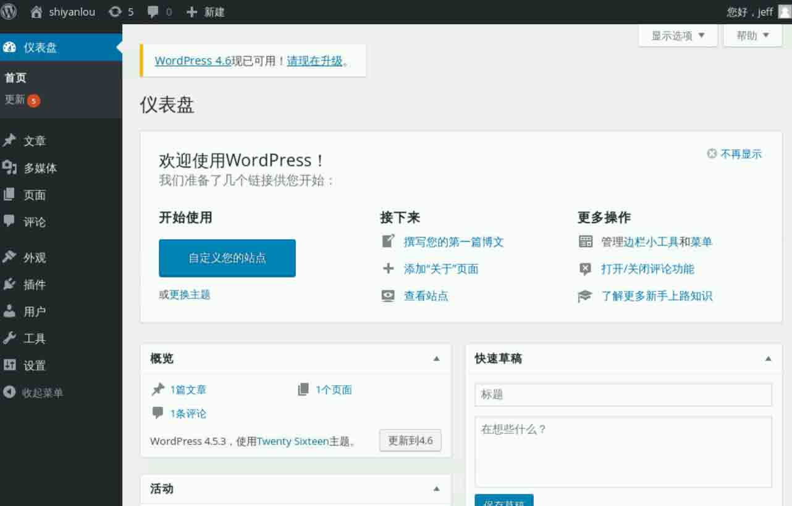

## 二、安装 Apache

Apache HTTP Server（简称 Apache）是 Apache 软件基金会的一个开放源码的网页服务器软件，是基于 NCSA httpd 服务器开发的，Apache 的发展开始于 1995 年初在 NCSA 之后。可以在大多数计算机操作系统中运行，由于其多平台和安全性被广泛使用，是最流行的 Web 服务器端软件之一。它快速、可靠并且可通过简单的 API 扩展。

在众多的 Web 服务端软件中，Apache 有这样的一些优点：

*   rewrite 的能力特别的强
*   模块特别的多，很容易找到
*   非常的稳定
*   因为长时间的发展，所以规范，文档，资料很多。并且社区活跃

请打开桌面上的 Xfce 终端，通过下面的命令安装 Apache：

```php
sudo apt-get update
sudo apt-get install apache2
sudo service apache2 start  #开启服务 
```

完成后，Apache 就安装好了，我们可以通过浏览器访问服务器的地址来查看是否成功的安装，或者服务是否有成功的启动，

查询本机的 IP 地址可以通过输入下面的指令：

```php
ifconfig eth0 | grep inet | awk '{ print $2 }' 
```

我们可以在浏览器的地址栏中输入 `127.0.0.1` 或者 `localhost` 亦或者使用刚刚查询到的本机的内网地址，便可得到这样的结果。


之所以会得到这样的结果是因为当我们访问一个网站时默认访问的 80 端口，并且在安装时 apache 在其文件根目录生成了一个 `index.html` 页面，以供测试使用。

这里的根目录是 apache 专门用于存放读取网页的目录，当然这个根目录可以通过配置文件来修改，若没有修改则默认位于 `/var/www/html/`，通过配置文件中 `DocumentRoot` 项我们可以了解到。


## 三、安装 MySQL

MySQL 是一个关系型数据库管理系统，由瑞典 MySQL AB 公司开发，目前属于 Oracle 旗下产品。在 WEB 应用方面 MySQL 是最好的 RDBMS (Relational Database Management System，关系数据库管理系统) 应用软件之一。

通过下面的命令安装 MySQL：

```php
#分别安装的 mysql 的服务端、以及 apache 调用 mysql 的模块，以及 php 调用 mysql 的模块
sudo apt-get install mysql-server libapache2-mod-auth-mysql php5-mysql 
```

安装好后，通过下面的指令来激活 MySQL：

```php
sudo mysql_install_db 
```

最后通过这个指令来设置数据库的账号和密码：

```php
sudo mysql_secure_installation 
```

若是遇到这样的错误，说明我们的 mysql 并没有启动起来，我们可以通过 `Ctrl+C` 退回到 Shell，然后通过 `service` 这个指令来验证我们的想法：

```php
sudo service mysql status 
```


此时我们只需要使用 `service` 命令启动 mysql 就可以解决问题啦。

```php
sudo service mysql start 
```

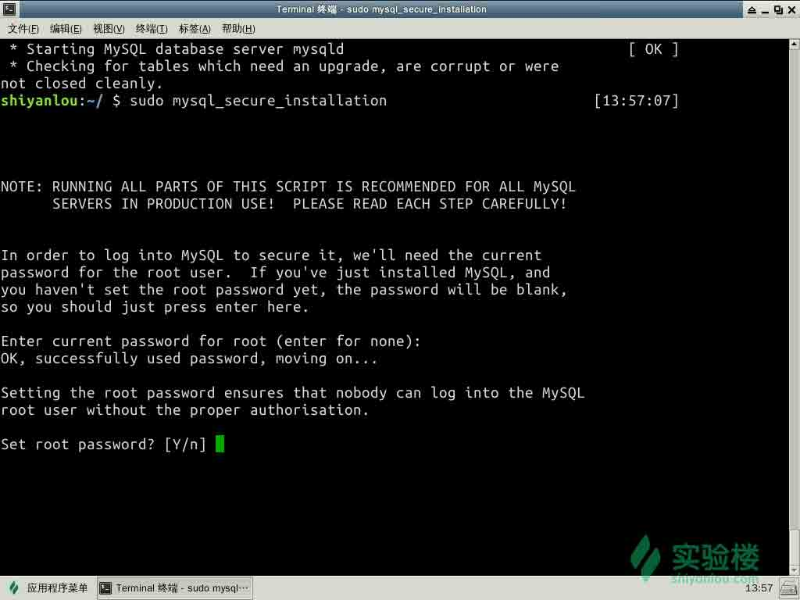

然后再启动 mysql 的安装：

```php
sudo mysql_secure_installation 
```

刚安装的时候没有设置 root 密码，点击 **ENTER** （回车键）,然后便是一个交互界面，询问一些关于密码设置与默认用户的设置。

```php
#提示让我们输入 root 用户的密码，此时我们并没有设置，所以为空，直接敲回车键即可
Enter current password for root (enter for none): 
OK, successfully used password, moving on...

Setting the root password ensures that nobody can log into the MySQL
root user without the proper authorisation.
#询问我们是否要设置密码
Set root password? [Y/n] y
#此处我选择的需要
New password: 
Re-enter new password: 
#成功的更新我们的 root 密码
Password updated successfully!
Reloading privilege tables..
 ... Success!

By default, a MySQL installation has an anonymous user, allowing anyone
to log into MySQL without having to have a user account created for
them.  This is intended only for testing, and to make the installation
go a bit smoother.  You should remove them before moving into a
production environment.
#在 mysql 安装时有创建一个默认的匿名用户，询问你是否删除，处于安全考虑我们选择的是 yes
Remove anonymous users? [Y/n] y
 ... Success!

Normally, root should only be allowed to connect from 'localhost'.  This
ensures that someone cannot guess at the root password from the network.
#mysql 支持远程的操作，这里询问我们在远程操作时是否可以使用 root 登陆
Disallow root login remotely? [Y/n] y
 ... Success!

By default, MySQL comes with a database named 'test' that anyone can
access.  This is also intended only for testing, and should be removed
before moving into a production environment.

#询问我们是否需要删除安装时存在的测试数据库
Remove test database and access to it? [Y/n] y

 - Dropping test database...

#因为我们并没有这个数据库，所以在这里报错，并没有什么影响
ERROR 1008 (HY000) at line 1: Can't drop database 'test'; database doesn't exist
 ... Failed!  Not critical, keep moving...
 - Removing privileges on test database...
 ... Success!

Reloading the privilege tables will ensure that all changes made so far
will take effect immediately.

Reload privilege tables now? [Y/n] y
 ... Success!

Cleaning up...

All done!  If you've completed all of the above steps, your MySQL
installation should now be secure.

Thanks for using MySQL! 
```

通过以上的操作，我们便完成了 MySQL 的一些简单的配置，接下来就要开始安装 PHP。

## 　四、安装　PHP

PHP 是一种设计来用于服务端开发的 server-side 脚本语言，但也作为通用的编程语言。最初由 Rasmus Lerdorf 在 1994 创造出来，现在主要由 zend 公司在维护。php 的语法吸收了 C 语言、Java 和 Perl 的特点，利于学习，使用广泛，主要适用于 Web 开发领域。

PHP 独特的语法混合了 C、Java、Perl 以及 PHP 自创的语法。它可以比 CGI 或者 Perl 更快速地执行动态网页。php 目前的最新版本是于 16 年的一月发布的 PHP7 正式版。有兴趣可以到 [php 社区](https://secure.php.net/manual/en/migration70.php)做更深入的了解。

通过下面的指令安装 PHP：

```php
#分别安装 php5（Linux 有自带）、apache 的 php 库文件以及 php 的加密库
sudo apt-get install php5 libapache2-mod-php5 php5-mcrypt 
```

PHP 有很多有用的库和模块，安装好后可以输入下面的指令查看：

```php
apt-cache search php5- 
```

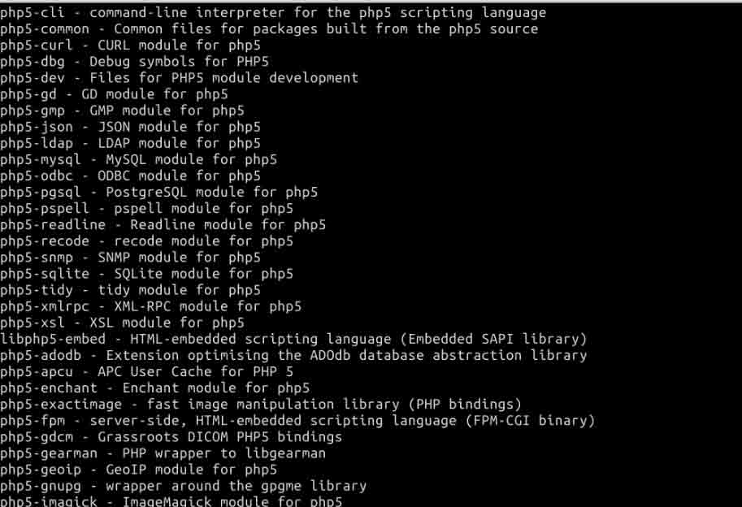

### 　4.1 检验

通过上面的安装，PHP 的安装也就完成了，我们来检验一下安装的效果如何：

首先编写一个文件, `sudo vim /var/www/html/info.php` ，在里面输入这样的一段 php 语句（用于显示 php 信息的一段语句）。

```php
<?php
phpinfo();
?> 
```

然后保存退出即可。

在浏览器里面输入 `http://localhost/info.php` 便可访问，如下图所示。

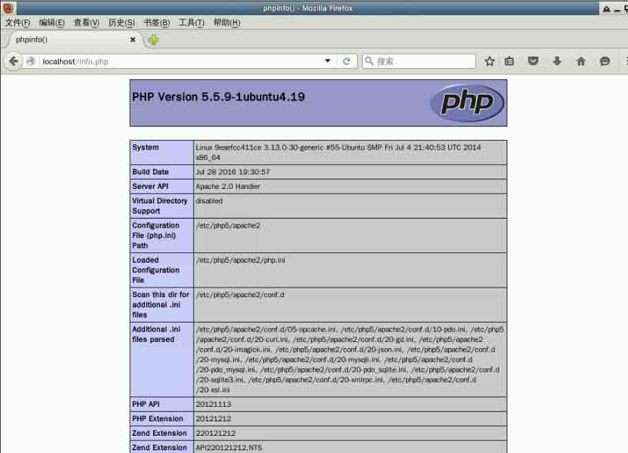

### 4.2 安装 phpmyadmin

对于刚刚接触 mysql 的同学，对 sql 语句并不是太熟悉，或者觉得字符界面效率过低，可以使用 phpmyadmin 这样的图形界面工具来管理数据库。

输入使用这个指令来安装 phpmyadmin 。

```php
sudo apt-get install phpmyadmin 
```

在安装的时候便会贴心的询问我们使用的哪种 web server 。


还会问我们用来管理数据库的话是否要一起配置了，若是需要配置则按着提示输入数据库密码。

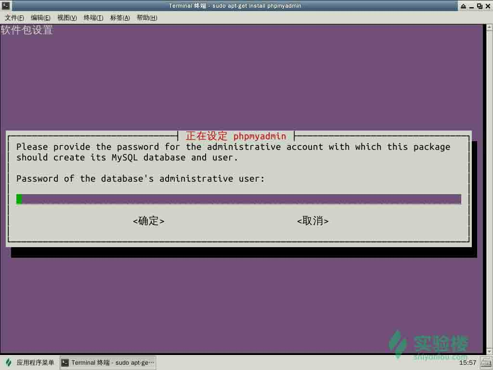

若是在配置的时候遇到 error 2002（HY000）的错误，如上文，你的 mysql 服务并没有正常的启动。

当安装完成之后，我们需要配置 apache 才能正常的访问该页面。

```php
sudo vim /etc/apache2/apache2.conf

#在配置文件中添加这句话,因为在安装的时候 phpmyadmin 为我们做好了配置文件，现在只需要包含进来即可
Include /etc/phpmyadmin/apache.conf

#修改配置文件之后，只有重新启动服务才能生效
sudo service apache2 restart 
```

然后我们只需要在浏览器的地址栏中输入 `localhost/phpmyadmin` 便可访问。

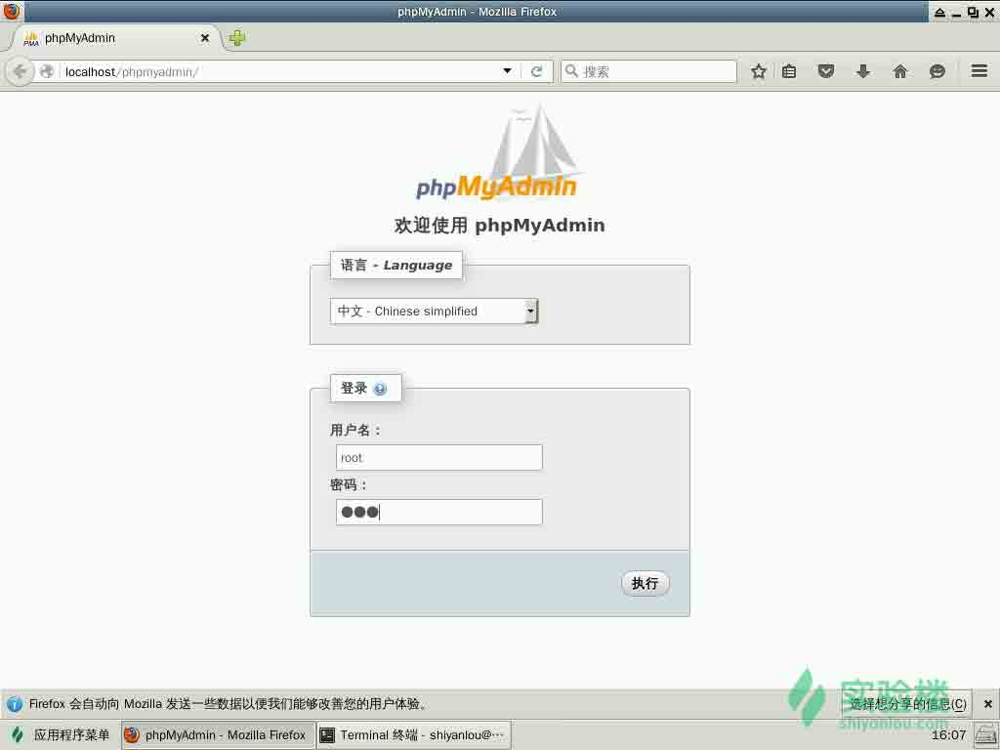

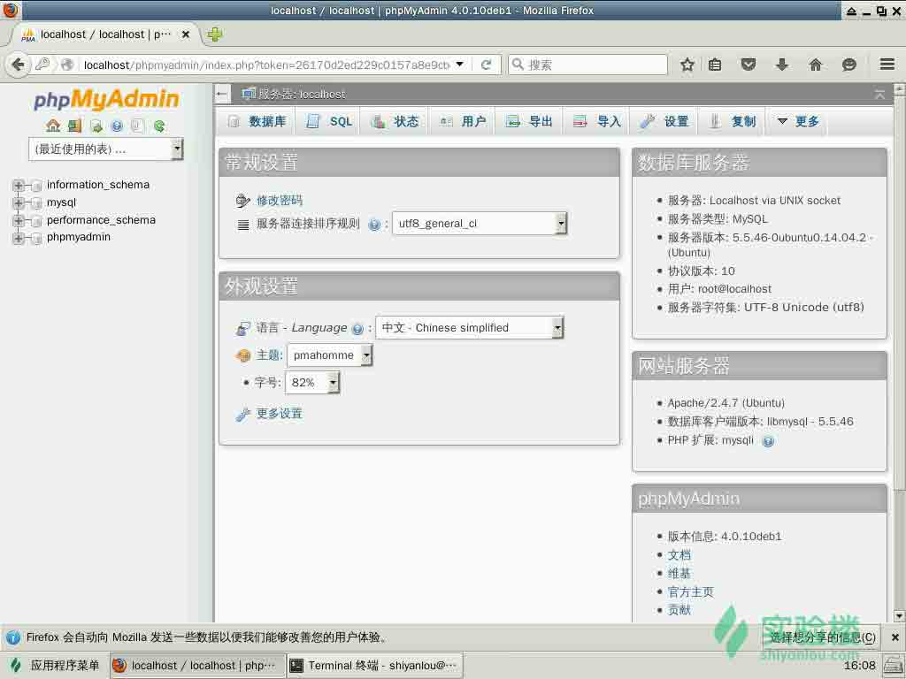

## 五、安装 wordpress

在完成上面的安装后，LAMP 的环境也就搭建好了，装好了它有什么用呢？ 就可以用它来搭建自己的网站了，但是没有学过 PHP 怎么办呢？ 我们可以基于 LAMP 环境来搭建 Wordpress。它是一种使用 PHP 语言开发的博客平台，用户可以在支持 PHP 和 MySQL 数据库的服务器上架设属于自己的博客网站。也可以把 WordPress 当作一个内容管理系统（CMS）来使用。

它有许多第三方开发的免费模板，安装方式简单易用。并且它支持中文版，同时有爱好者开发的第三方中文语言包，如 wopus 中文语言包。WordPress 拥有成千上万个各式插件和不计其数的主题模板样式。

### 5.1 添加数据库

我们可以通过在 MySQL 里添加 wordpress 需要的数据库。

首先在终端中进入 MySQL 命令行，需要输入密码。

```php
$ mysql -u root -p             #输入密码进入数据库 
```

然后输入 SQL 语句创建数据库。

```php
mysql > status;                  #检查联通性
mysql > create database wordpress_db;                #创建一个 wordpress_db 的数据库
mysql > show databases;                         #查看数据库
mysql > exit  #退出 mysql 的命令行 
```


当然我们也可以使用 phpmyadmin 来为我们添加这个数据库

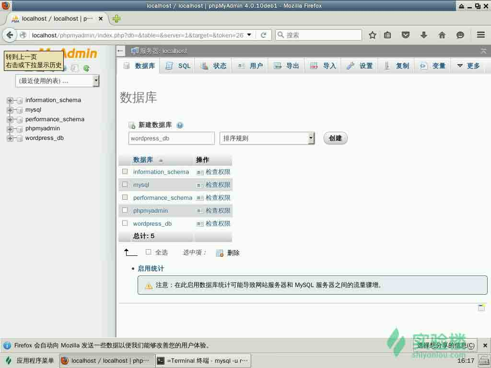

### 5.2　安装配置 wordpress

完成了 wordpress 数据库的准备工作，我们便开始安装 wordpress

```php
#下载 wordpress 源码包
wget http://labfile.oss.aliyuncs.com/courses/621/wordpress-4.5.3-zh_CN.zip

#将其解压
unzip wordpress-4.5.3-zh_CN.zip

#将页面都移至 apache 的根目录下
sudo mv wordpress /var/www/html/

#更新模板配置文件的文件名为可生效的文件名
mv /var/www/html/wordpress/wp-config-sample.php /var/www/html/wordpress/wp-config.php

#编辑配置文件中的参数，将 wordpress 与 mysql 连接起来
vim /var/www/html/wordpress/wp-config.php #编辑里面的一些参数 
```

我们需要把数据库的名称，数据库的用户和密码都添加进去：

```php
# WordPress 数据库的名称
define('DB_NAME', 'wordpress_db');
# MySQL 数据库用户名
define('DB_USER', 'root');
# MySQL 数据库密码
define('DB_PASSWORD', 'yourpasswd');
# MySQL 主机
define('DB_HOST', 'localhost');
$table_prefix  = 'wp_wordpress'； 
```


若是成功的配置，我们在浏览器的地址栏中输入 `localhost/wordpress` 即可得到这样的界面。

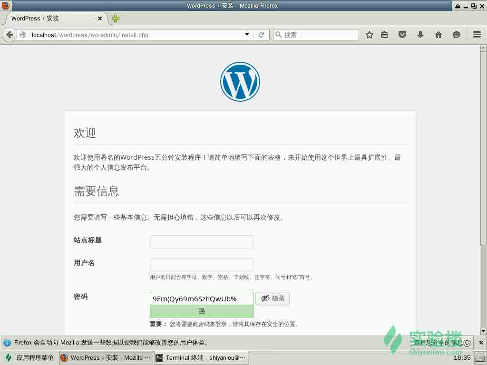

若是在配置文件中的数据库信息填写错误那么将会得到这样的界面。

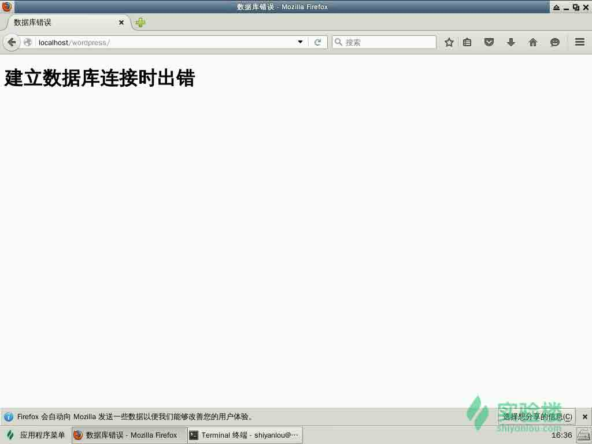

按照指导完成用户的注册，之后我们便可登陆，得到这样的页面，我们便可以开始我们的博文创作了。


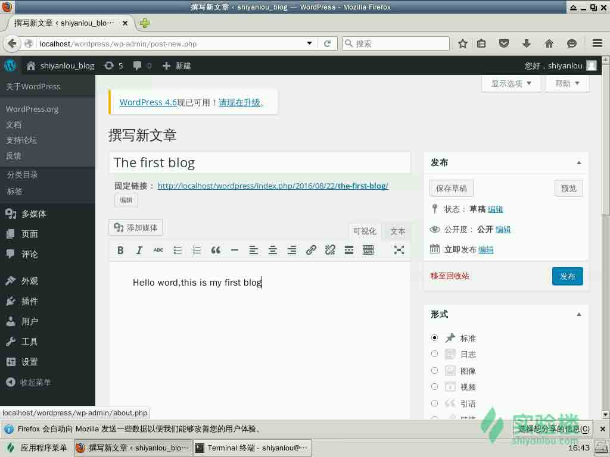

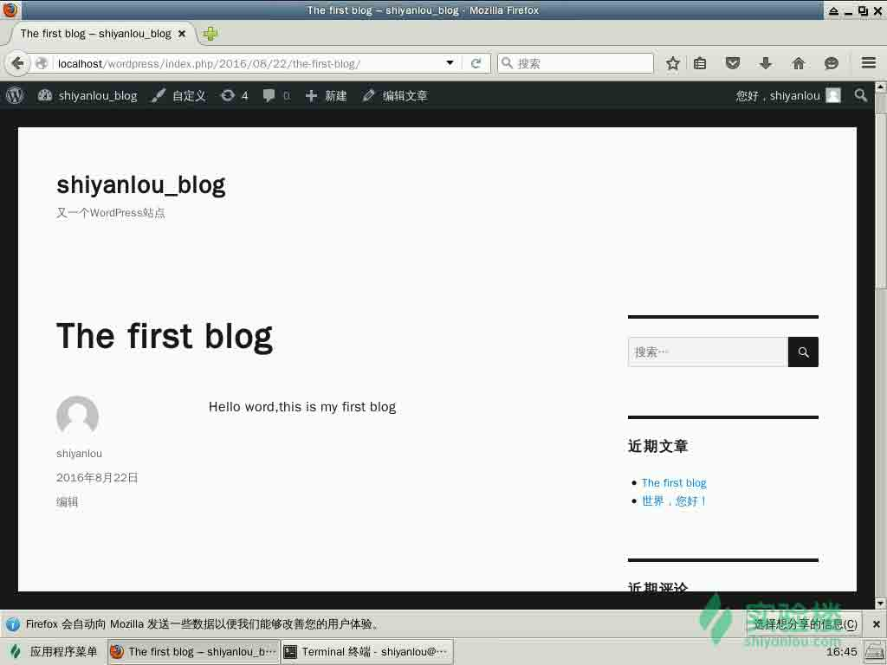

## 六、实验总结

通过本实验，我们了解了 LAMP 安装和配置的过程，并且成功地搭建了 wordpress 博客平台。

在学完了本节课后，就可以搭建自己的网站了.安装的过程很轻松，但是学到的东西却不少。而且每一个都可以继续深入学习，比如 Apache 服务器的管理，[MySQL](https://www.shiyanlou.com/courses/?course_type=all&tag=SQL) 的使用，，[PHP](https://www.shiyanlou.com/courses/?course_type=all&tag=PHP) 语言的学习。

在实验楼里也可以找到相关的课程，所以继续努力，好好做实验吧！

## 参考资料

*   [How To Install Linux, Apache, MySQL, PHP (LAMP) stack on Ubuntu](https://www.digitalocean.com/community/tutorials/how-to-install-linux-apache-mysql-php-lamp-stack-on-ubuntu)

*   [LAMP+WordPress 的搭建](http://xiao106347.blog.163.com/blog/static/215992078201452922522733/)