# 第 2 节 Apache 配置

## 一、实验简介

通过上一节的实验，我们学会了如何去部署一个 LAMP 环境。搭建好后的环境只是一个简单的默认配置，通过本实验我们将深入了解 Apache 的相关配置参数。

### 1.1 相关知识点

*   Apache 一般优化配置
*   Apache 日志格式配置
*   Apache 访问控制配置
*   Apache 虚拟主机配置

## 二、Apache 一般优化配置

在上节实验中，我们初步涉及到 Apache 的主要配置文件，接下来我们将详细的了解其常用的配置文件内容。

首先在 Xfce 终端中输入以下命令查看和编辑该配置文件。

```php
$ vim /etc/apache2/apache2.conf 
```

Apache 的主要配置文件是 `/etc/apache2/apache2.conf`，与其他的配置文件相同，`#` 开头的部分为注释，一般在注释中都是一些对配置文件的解说与介绍。

```php
#在注释中我们看到这么一条,指定 apache 服务器的配置文件存放的根目录。这是默认值
ServerRoot "/etc/apache2"

#超时时间，单位为秒，默认值为 300，意思是如果超过 300 秒仍未收到或者送出数据，则断开连接。
Timeout 300

#启用表示允许保持连接，让每次连接可以提出多个请求。建议关闭，因为保持连接会使会话常驻内存，如果连接数目较多则内存耗尽。想 syn flood 与 cc 攻击大多都可以利用这点。
KeepAlive On|Off

#保持连接最大数。0 表示无限数量，推荐的设置为 100
MaxKeepAliveRequests 100

#连续两个请求之间的时间如果超过 5 秒还未到达，则连接中断。
KeepAliveTimeout 5 
```

在配置文件中我们看到了一些环境变量如错误日志文件的位置，运行的用户名等等。

```php
# These need to be set in /etc/apache2/envvars
User ${APACHE_RUN_USER}
Group ${APACHE_RUN_GROUP}
ErrorLog ${APACHE_LOG_DIR}/error.log 
```

通过注释我们可以了解这些环境变量都在 `/etc/apache2/envvars` 中定义，若是需要修改，我们只需要修改这个文件里的内容，然后重启服务即可生效。

我还可以定义自己站点的配置文件，我们可以通过 `Include` 选项来让 apache 读取，如上个实验中我们使用这个参数将自定义的 phpmyadmin 的配置文件加载进来一样。

```php
Include /etc/phpmyadmin/apache.conf 
```

## 三、Apache 日志格式配置

在这个配置文件中还有一个特别重要的配置选项，那就是日志格式的配置,首先日志的输出是有等级的区别的。

LogLevel 记录日志等级有：

*   error 错误情况
*   warn 警告情况
*   info 普通信息
*   debug 出错级别信息

在配置文件中默认为 `warn` 级别：

```php
LogLevel warn  #错误日志记录等级 
```

我们还可以自定义 Apache 的日志格式，详细的日志信息能够帮助我们了解服务的状态，以及对 bug 的调试、对问题的分析。

```php
LogFormat "%v:%p %h %l %u %t \"%r\" %>s %O \"%{Referer}i\" \"%{User-Agent}i\"" vhost_combined
LogFormat "%h %l %u %t \"%r\" %>s %O \"%{Referer}i\" \"%{User-Agent}i\"" combined
LogFormat "%h %l %u %t \"%r\" %>s %O" common
LogFormat "%{Referer}i -> %U" referer
LogFormat "%{User-agent}i" agent 
```

其中各个选项对应的含义如下：

```php
|  参数   |   解释  |
|--------|--------|
|   %h   | 客户端的 ip 地址或主机名 |
|   %l   | 由客户端 identd 判断的 RFC 1413 身份，输出中的符号 "-" 表示此处信息无效|
|   %u   | 认证系统得到的访问该网页的客户端用户名。有认证时才有效，输出中的符号 "-" 表示此处信息无效 |
|   %t   | 服务器接收到请求的时间   |
|  "%r"  | 请求中的首行信息        |
|   %>s  | 服务器返回给客户端的最终状态的状态码 |
|   %O   | 发送的自己数，包含报头 |
|   %V   | 依照 UseCanonicalName 规范设置得到的服务器名字 |
| "%{Referer}i" | 此项指明了该请求是从被哪个网页提交过来的 |
| "%{User|Agent}i" | 此项是客户浏览器提供的浏览器信息|
```

还有更多的参数可以查看[官方文档](http://httpd.apache.org/docs/current/mod/mod_log_config.html#logformat)。

## 四、Apache 访问控制配置

在配置文件中我们还看到有 `<Directory>` `<DirectoryMatch>` 等等这样的参数，直接在配置文件中进行的配置选项会在整个服务器中生效，如果你希望让某些配置仅对服务器的部分目录或者文件生效，也就是对所做的这部分配置控制在某个作用域范围内，我们便可使用这个配置选项。

我们可以通过这样的一个例子来认识 <Directory> 选项的作用。

首先我们将访问文件的更目录更改为从 `/var/www/html` 改成 `/home/shiyanlou`。是否还记得我们在上节实验中提到了 apache 的文件根目录的配置选项 `DocumentRoot`。在新版本的 apache 中将该项移至在单独的虚拟主机选项配置文件中。

```php
#修改 80 端口的虚拟主机的访问文件根目录。
$ sudo vim /etc/apache2/site-enabled/000-default.conf 
```

在该配置文件中修改 DocumentRoot，让其访问/home/shiyanlou

```php
DocumentRoot /home/shiyanlou 
```

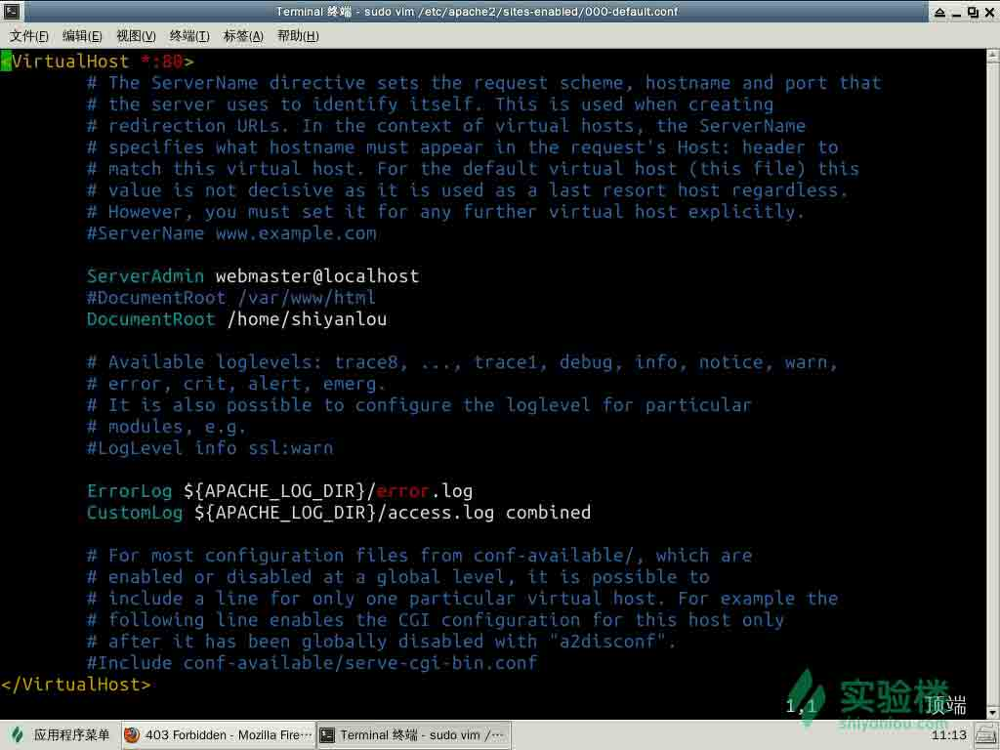

然后保存退出，并重启 apache 服务让其生效。

```php
$ sudo service apache2 restart 
```

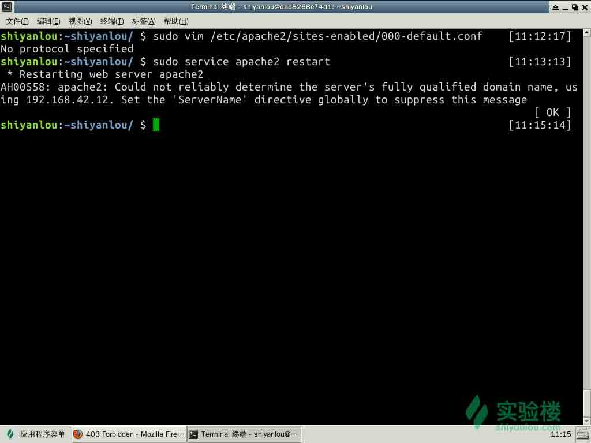

若是在末尾得到 `OK` 的标志标识成功重启，若是得到 `Fail` 的标志，表示重启失败，并告诉你失败的原因，有语法错误的文件与行数。

现在我们在次访问 `localhost`,我们发现我们得到一个 403 的 Forbidden 禁止访问的错误，错误提示：

```php
You don't have permission to access / on this server.
#你没有权限访问服务器上的 `/` 目录 
```

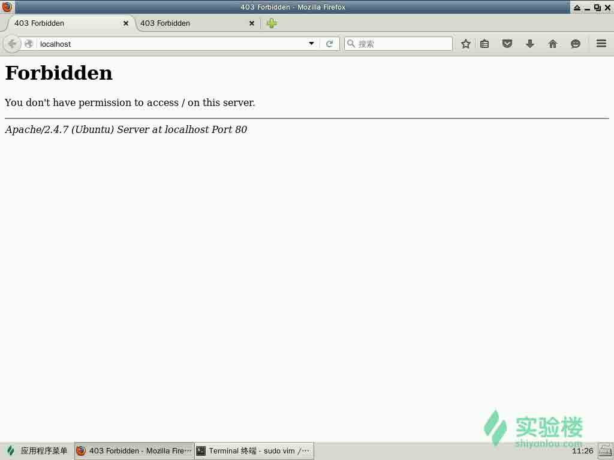

可是我们设置的是 `/home/shiyanlou` 这个目录，为什么说我们没有权限访问 `/` 目录，我们返回去看我们的主配置文件。

```php
#进入修改主配置文件
$ sudo vim /etc/apache2/apache2.conf 
```

在该配置文件的 154 行左右我们会发现这样的配置项：

```php
<Directory />
        Options FollowSymLinks
        AllowOverride None
        Require all denied
</Directory> 
```


该配置项也就是上文我们所提到的添加一些配置项但是只对部分的目录或者文件生效，而 `<Directory>` 的意思便是对部分的目录做出配置，它的语法格式是：

```php
<Directory 生效的目录路径>
        需要做的配置
</Directory> 
```

由上文我们可以了解到，在默认的配置文件中是对系统的根目录做了配置，而 `/home/shiyanlou` 也在 `/` 目录中，所以也被限制住了。

而在对根目录中所做的配置有哪些呢，其中我们可以看到有 `Options`、`AllowOverride`、`Require` 选项。

`Options` 是指定一些参数，而常用的参数有这些：

*   None:不支持任何选项。
*   Indexes：允许文件索引，意思所有的文件以索引的形式在网页上呈现。
*   FollowSynLinks： 允许符号链接指向的源文件。
*   Includes： 允许执行服务器包含（ssi）。
*   ExecCGI：允许执行 CGI 脚本。

`AllowOverride` 是指确定允许存在于 `.htaccess` 文件中的指令类型。通常利用 Apache 的 rewrite 模块对 URL 进行重写的时候， rewrite 规则会写在 .htaccess 文件里。一般设置为 `None` 来保证网站的安全性。

`Require` 是对资源的访问控制的参数，还可以与 `AuthName` 等类型的参数配合来使得部分目录只能通过某些用户登录来访问。

```php
#该目录无条件允许访问
Require all granted
#该目录无条件拒绝访问
Require all denied 
```

而反观我们的默认配置文件中 `/` 目录是无条件拒绝访问的，所以我们之前就曝出没有权限访问的错误，我们只需要单独问 `/home/shiyanlou` 目录配置一下给予权限访问即可。

我们在配置文件中添加这么几行来允许我们当前设置的 DocumentRoot 可以访问。

```php
<Directory /home/shiyanlou>
        AllowOverride None
        Require all denied
</Directory> 
```

若是只是这样的话你会发现和之前是一样的报错，这是因为在该目录下没有 `index.html` 这样的索引网页文件，所以我们该目录下添加这样一个文件即可访问了。

```php
$ vim /home/shiyanlou/index.html 
```

该文件内容为：

```php
hello shiyanlou 
```


但是我们若是想要读取里面的其他文件的话，我们可以修改成这样，并且删除 index.html 这个文件。

```php
$ vim /etc/apache2/apache2.conf 
```

修改的内容为：

```php
<Directory /home/shiyanlou>
        Options Indexes FollowSymLinks
        AllowOverride None
        Require all denied
</Directory> 
```


并且重启下我们的 apache 来使得配置文件生效：

```php
$ rm -rf index.html

$ sudo service apache2 restart 
```

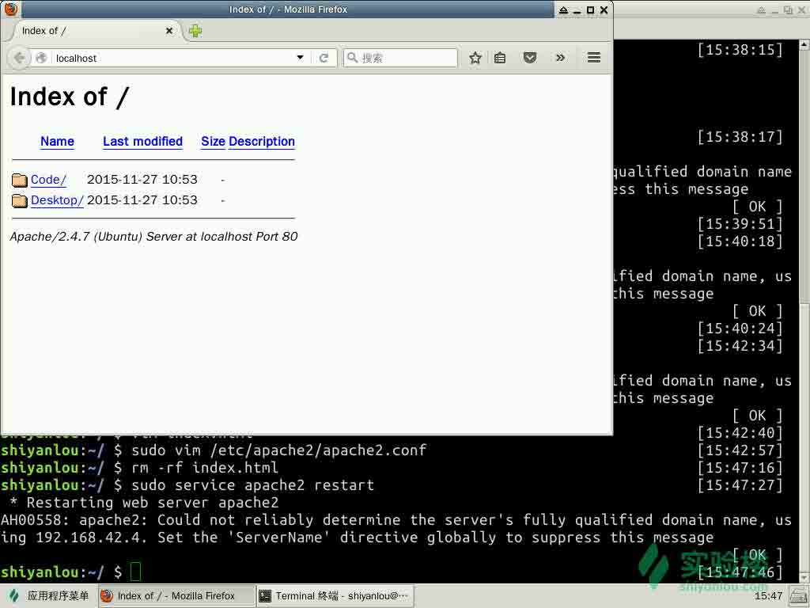

若是遇到某些敏感的文件，不适合允许所有的人随意的访问，我们还可以使用 `require` 参数来限制只允许某些 ip 访问，修改之后记得重启 apache2 服务哦。

```php
Require ip 这里填写 ip 地址范围

#例如，允许 192.168.0.0 这里面的所有网段都可以访问
Require ip 192.168

#但是允许本地的话比较特殊可以使用这两种方法中的一种
Require local
#或者是
Require ip localhost
Require ::1 
```


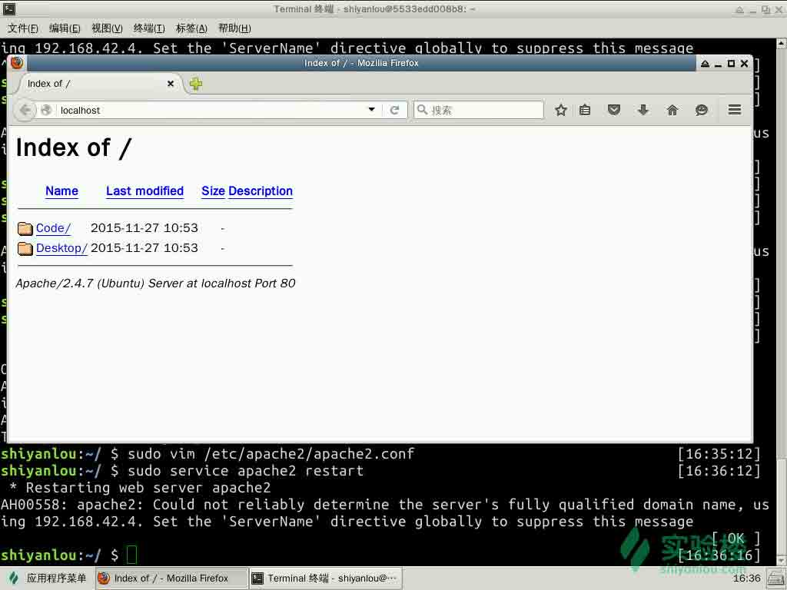

还有很多高级的用法，如上文提到的设置用户认证登陆等等，有兴趣深入学习可以多看看[官方文档](http://httpd.apache.org/docs/current/mod/mod_authz_core.html#require)。

与之类似的还有一个参数 `Order` 也可以做到访问控制的功能，但是只能在 IP 或者域名的层次上做限制，无法像 `Require` 那样做到控制用户访问。当然他们可以配合着使用也很强大。

`Order` 的用法类似于 `tcp wrappers`，依靠 `allow`、`deny` 来做访问的控制。

```php
#格式如下，allow 与 deny 位置没有要求，但是 `order` 后面谁放在前面谁的规则就先生效
Order Allow,Deny
#allow 的具体白名单
Allow from all(或者 ip)
#deny 的具体黑名单
Deny from all（或者 ip） 
```

`Order` 后面跟的 `Allow` 与 `Deny` 的顺序的两个作用：

*   哪个参数放在前面那个参数的规则便先生效，比如 `Order Allow,Deny` 的话则 allow 的规则先生效，deny 的规则后生效，其实他们的谁先生效并不会有什么影响
*   在缺省的情况下（也就是没有 Allow from 与 Deny from 的具体内容的话），谁在后面的话，默认拒绝或者生效所有，比如 `Order Allow,Deny` 的话便会拒绝所有，反之的话，则允许所有

我们可以在 `/home/shiyanlou/Code` 上做实验，在配置文件中添加这样的代码。

```php
<Directory /home/shiyanlou/Code>
        Options Indexes FollowSymLinks
        AllowOverride None
        Order Deny,Allow
        Deny from localhost
</Directory> 
```

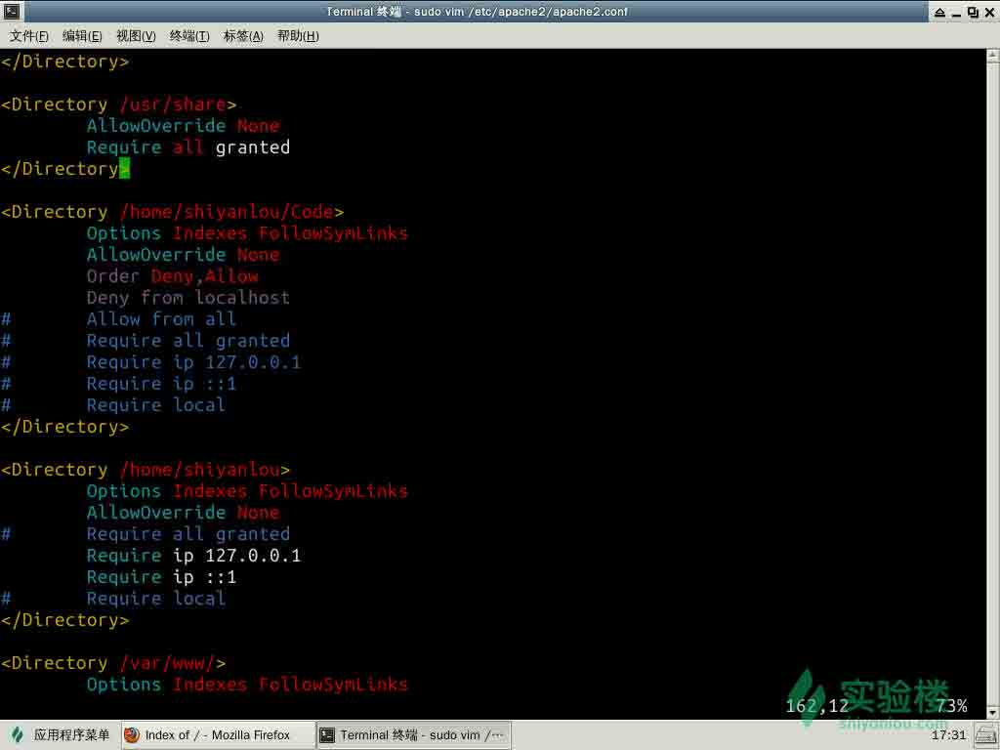

然后重启服务，让其生效之后我们可以看到这样的效果：


与 `<Directory>` 类似的但是侧重点不同的参数还有 `<DirectoryMatch>`、`<Files>`、`<FilesMatch>`、`<Location>`、`<LocationMatch>` 这些功能将不再一一列举，有兴趣的同学可以看看官方文档<http://httpd.apache.org/docs/current/mod/core.html#directory>。

## 五、Apache 虚拟主机配置

在 apache 还有一个很重要的配置，便是其虚拟主机的配置。

apache 为我们提供了一个网站运行平台，若是在一个物理主机上只有一个网站，我们称之为中心站点，若是我们需要在一台物理主机上运行多个网站（站点）的话，这时候我们就需要使用虚拟主机。

从上文我们可以体会到一个网站（站点）主要是访问 DocumentRoot 目录下的文件或者程序，而虚拟主机只要让用户访问不同的 DocumentRoot 即可，用户也不会感受到这是一台主机。

而虚拟主机的用处主要用于一些访问量不大，功能简单，不会消耗太多资源的展示类网站，这样我们就不需要多一台物理主机，消耗成本了。

虚拟主机主要有三种方式：

*   基于 IP 地址的虚拟主机
*   基于端口的虚拟主机
*   基于域名的虚拟主机

基于 IP 的虚拟主机用于当我们有多的 IP 地址资源的时候，比如我们有多张网卡的时候，或者设置网卡别名都可以的（网卡别名在本实验环境中无法实现）。

在本实验环境中我们可以做这样的一个时间，我们用 `ifconfig` 命令可以看到我们有两张网卡，一个是 `lo` 本地的回环网卡以及对外通信的 `eth0` 网卡。

接下来我们针对这两个网卡的 `ip` 地址做这样的实验：

```php
#设置站点虚拟主机的配置文件
sudo vim /etc/apache/site-enable/000-default.conf 
```

在这个配置文件中我们增加这样的一些内容（因为这个方式比较取巧，所以我们的把 eth0 的地址配置放在上面），记住这里的 `eth0` 的 ip 地址是我电脑上的，你们需要填写自己的 eth0 的 ip 地址。

比如这样的设置：

```php
<VirtualHost 192.168.42.2:80>
    DocumentRoot /home/shiyanlou
</VirtualHost>

<VirtualHost 127.0.0.1:80>
    DocumentRoot /var/www/html
</VirtualHost> 
```


当然这样的前提是在上面的小例子的基础上，也就是添加了 `/home/shiyanlou` 的访问权限的。


配置完成之后我们重启 apache 服务，再试试访问 `192.168.42.2` 与 `127.0.0.1` 这两个地址的效果。

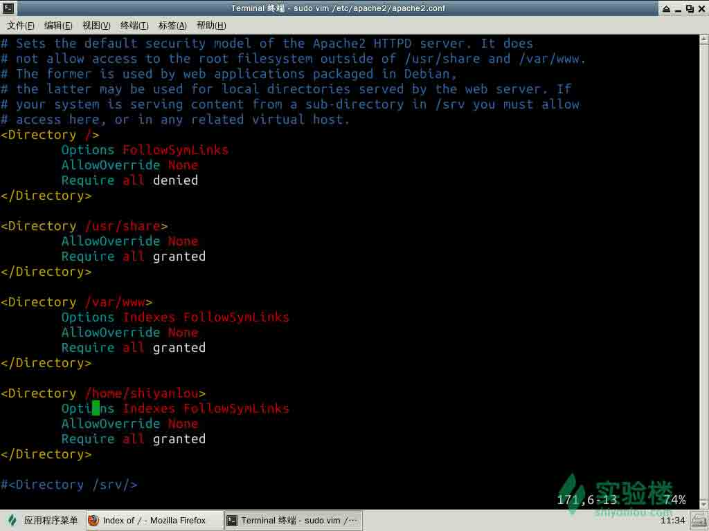

这便是基于 ip 地址的不同通过虚拟主机来实现两个站点。

除了基于 IP 的不同，我们还可以基于端口的不同来实现两个站点，针对端口的不同无非就是监听两个不同的端口，做出不同的响应。

首先我们需要在 port 的配置文件中添加对新端口的监听:

```php
sudo vim /etc/apache2/ports.conf 
```

```php
#添加新的端口监听
Listen 8080 
```

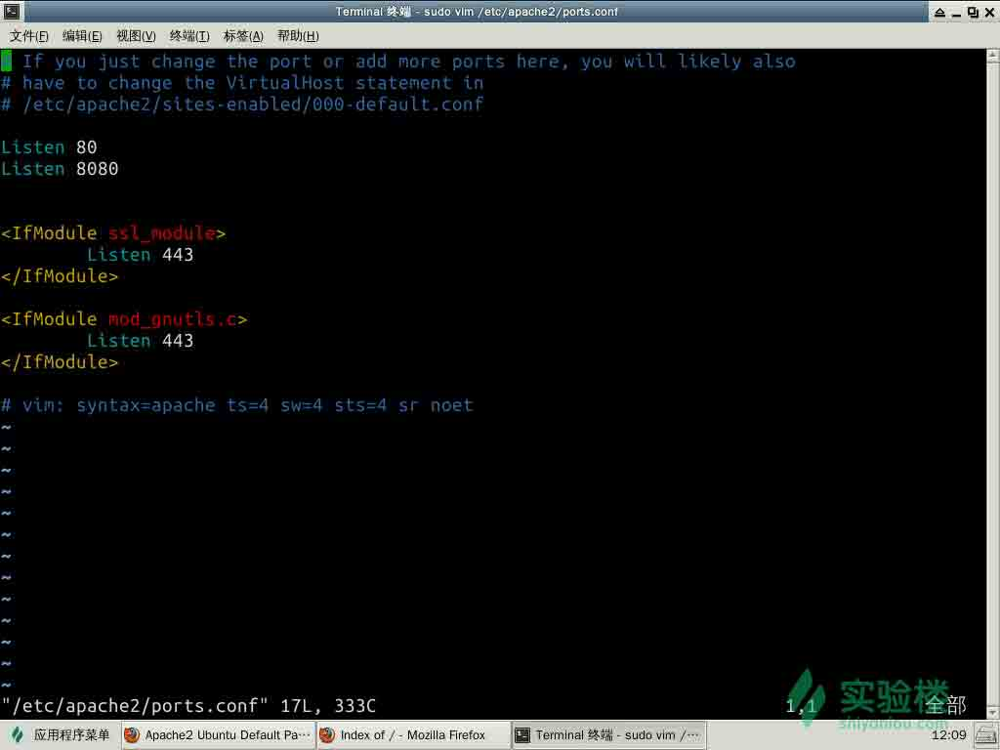

接下来便是对虚拟主机的配置了:

```php
#设置站点虚拟主机的配置文件
sudo vim /etc/apache/site-enable/000-default.conf 
```

```php
#添加这样的一些内容
<VirtualHost *:8080>
    DocumentRoot /home/shiyanlou
</VirtualHost>

<VirtualHost *:80>
    DocumentRoot /var/www/html
</VirtualHost> 
```

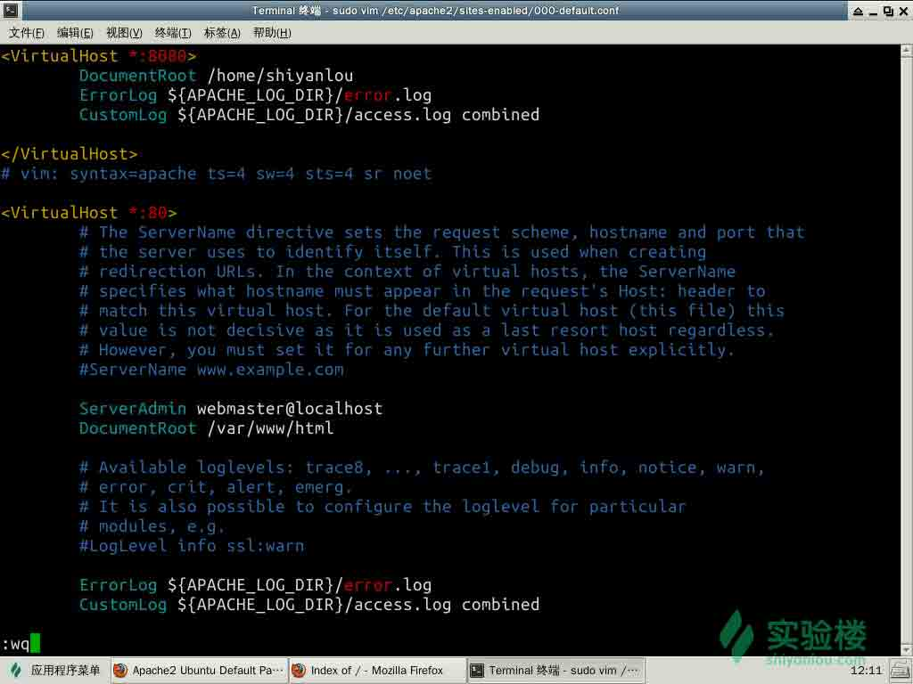

然后我们保存配置，重启 apache 服务，在分别来访问 `127.0.0.1:80` 与 `127.0.0.1:8080` 这两个地址，可以得到这样我们所预期的结果：


除了以上的两种方式我们还可基于域名来做虚拟主机的配置，同样我们需要对我们的站点配置文件做这样的修改。

```php
#设置站点虚拟主机的配置文件
sudo vim /etc/apache/site-enable/000-default.conf 
```

```php
#这是修改的内容
<VirtualHost *:80>
    DocumentRoot /home/shiyanlou
    ServerName www.shiyanlou1.com

</VirtualHost>

<VirtualHost *:80>
    DocumentRoot /var/www/html
    ServerName www.shiyanlou1.com
</VirtualHost> 
```


当然这样的域名是不存在的，我们需要在 hosts 文件中添加该域名的地址映射。

```php
#修改 hosts 文件
sudo vim /etc/hosts 
```

```php
#添加的内容，同样这里的 ip 地址应该是你们自己的 ip 地址
192.168.42.2 www.shiyanlou1.com
192.168.42.2 www.shiyanlou1.com 
```

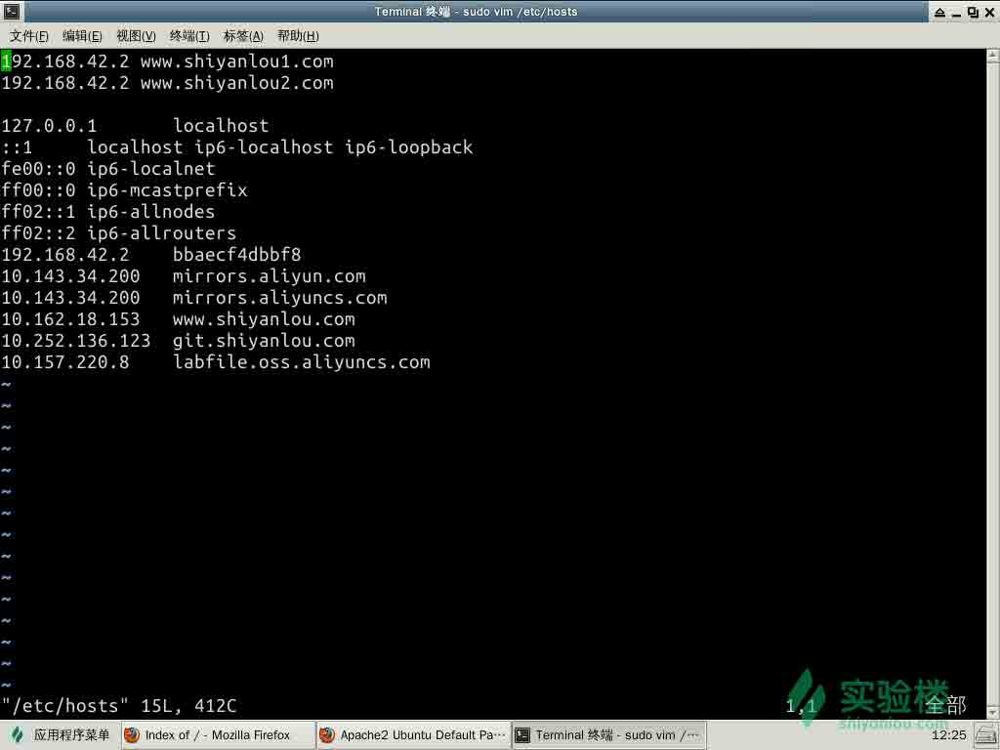

同样完成之后我们需要重启 apache 服务，我们可以得到这样的效果：

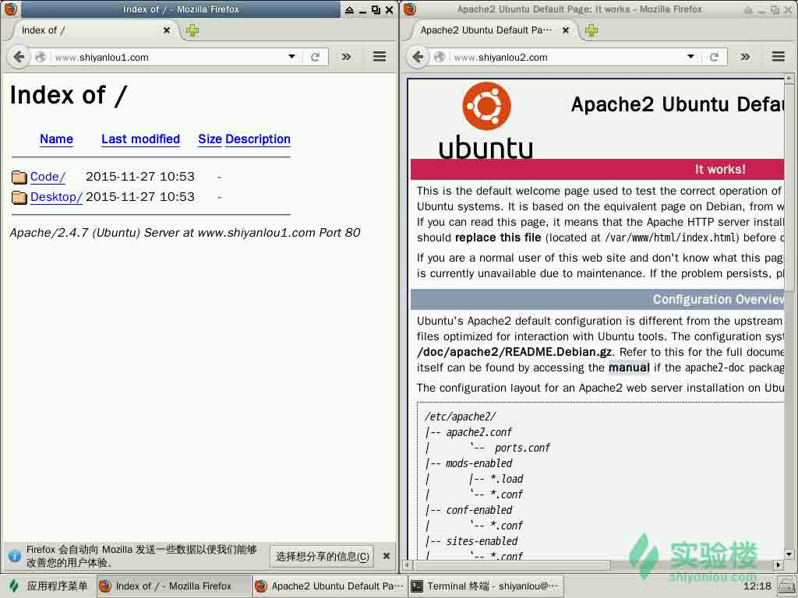

## 实验总结

通过本节的学习，我们对 apache 的配置有了更加深入的了解与学习，学习了 apache 的一些简单的特性，还有更多更高级的设置，大家可以多多查看官方文档进行学习。

### 参考文献

[1] apache logformat:<http://httpd.apache.org/docs/current/mod/mod*log*config.html#logformat> [2] apcache dirctory:<http://httpd.apache.org/docs/current/mod/core.html#directory>