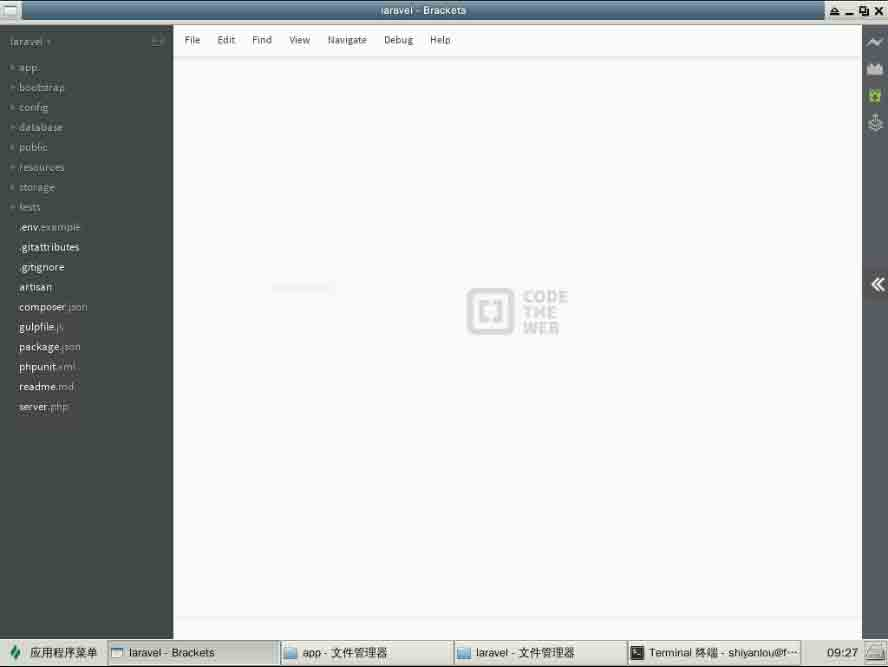
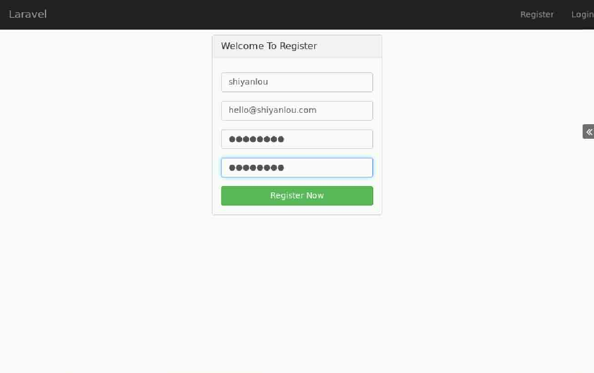
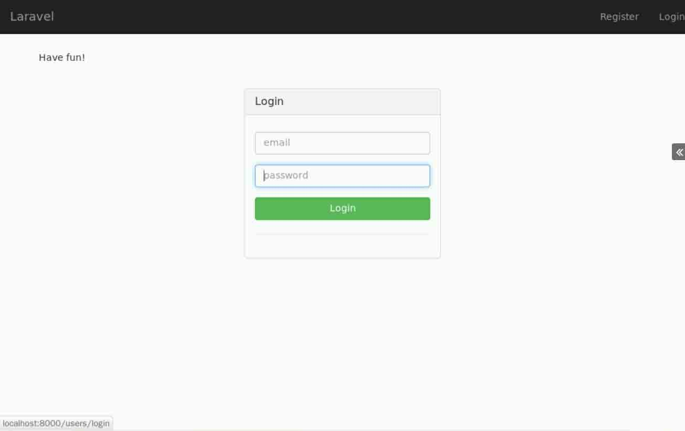
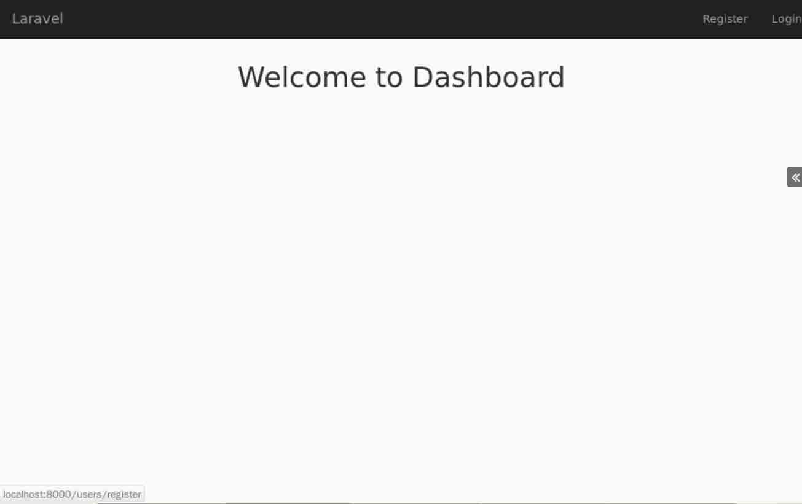
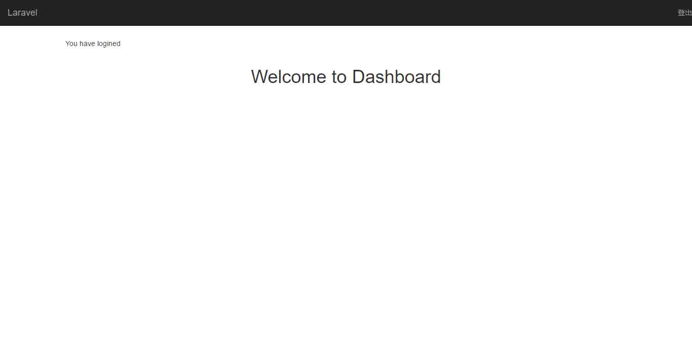
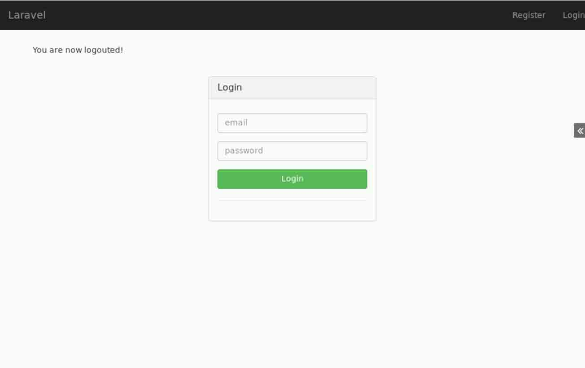

# 第 1 节 Laravel 实现用户注册登录

## ** 一、实验说明和介绍**

### 1\. 环境登录

无需密码自动登录，系统用户名 shiyanlou

### 2\. 环境介绍

本实验环境采用带桌面的 Ubuntu Linux 环境，实验中会用到桌面上的程序：

1.  Xfce 终端（XfceTerminal）: Linux 命令行终端，打开后会进入 Bash 环境，可以使用 Linux 命令

2.  Firefox：浏览器，可以用在需要前端界面的课程里，只需要打开环境里写的 HTML/JS 页面即可

3.  Bracket：非常好用的编辑器

4.  Composer：PHP 的包依赖关系管理工具，直接在 XfceTerminal 使用，用来安装 Laravel

### 3\. 环境使用

使用 Bracket 编辑器输入实验所需的代码及文件，使用 Xfce 终端（XfceTerminal）运行所需命令进行操作。

实验报告可以在个人主页中查看，其中含有每次实验的截图及笔记，以及每次实验的有效学习时间（指的是在实验桌面内操作的时间，如果没有操作，系统会记录为发呆时间）。这些都是您学习的真实性证明。

本课程部分源代码将会在最后做实例展示。

### 4\. 项目介绍

Laravel 最为最优雅的 PHP 框架，很多学习 PHP 的小伙伴早就对 Laravel 垂涎欲滴。我们今天就来实现你的愿望，让我们一起从零开始，利用 Laravel 实现 web 应用最常见的注册和登录功能。

首先我们来明确一下我们这个课程需要的东西：

*   Laravel 5.1(LTS)
*   Bootstrap 3.3.5

`Laravel` 就是我们关心的核心部分，`Bootstrap` 用来快速设置一些前端的 CSS 样式。

## **二、安装 Laravel**

安装 Laravel，在这里我们通过 Composer 来安装，打开命令行终端，执行：

```php
$ mkdir Sites
$ cd Sites 
```

`Sites` 就是 web 应用的根目录，你可以根据需要换成你自己的根目录，然后再执行：

```php
# 配置 composer 使用国内源
$ composer config -g repo.packagist composer https://packagist.phpcomposer.com

# 安装 laravel 5.1 若不指定版本,默认安装最新版
$ composer create-project laravel/laravel --prefer-dist laravel  5.1 
```

`laravel` 就是你的应用目录名，你可以取一个你喜欢的名字。执行上面的命令之后，等一段时间（毕竟在国内，网速是个大坑），安装完以后你会得到这一堆目录：



我们主要操作的目录：

```php
`app`目录：包含 Controller、Model、路由等在内的应用目录
`resources`目录：资源文件目录，包含视图文件等
这就是 MVC 的大致结构 
```

到这里，我们的前期工作已经准备好了。不过在进入下一步之前，我们得先确保我们的 `laravel/storage` 目录有相应的写入权限，所以在 `laravel` 目录，可以直接通过：

```php
$ chmod -R 775 storage 
```

这一步搞定之后我们就可以进入真正的开发阶段了。

## **三、配置数据库并建表**

在开始配置之前，我们要为我们的 laravel 应用创建一个数据库，我将它命名为 `laravel`：

```php
 $ sudo service mysql start 
```

再通过

```php
 $ mysql -u root 
```

进入数据库，执行:

```php
$ create database laravel; 
```

数据库创建成功。接下来就可以开始配置环境了。

```php
在全新安装的 Laravel 中，应用程序的根目录下都会有一个 .env.example 文件，如果你是通过 Composer 安装的 Laravel，这个文件将被自动重命名为 .env。如果没有，请手动重命名。

当应用程序收到一个请求时，.env 文件中的所有变量都会被加载到 PHP 的 $_ENV 超全局变量中。这时，你就可以通过 env 辅助函数来从该超全局变量中获取需要的配置了。实际上，如果你查看 Laravel 的配置文件，你会发现有几个配置项已经在使用这个辅助函数了。 
```

在编辑器中打开 .env 文件，修改配置如下：

```php
APP_ENV=local   运行环境配置
APP_DEBUG=true  是否开启调试模式，开发阶段建议开启，部署阶段建议关闭
APP_KEY=Fcs7fxV3pzEbafxqYviQ24jNAOf0ihXA    应用的秘钥，用来加密会话和其他数据（自动生成）
DB_HOST=localhost   数据库主机名
DB_DATABASE=laravel 数据库名
DB_USERNAME=root    用户名
DB_PASSWORD=        密码（默认为空） 
```

*   .env 文件里还有许多其他的配置参数，以后用到的地方再详细讲解。 关于数据库的配置参数，也可以在 config 文件夹找到 database.php，在其中编辑配置。

```php
'mysql' => [
    'driver'    => 'mysql',
    'host'      => env('DB_HOST', 'localhost'),
    'database'  => env('DB_DATABASE', 'forge'),
    'username'  => env('DB_USERNAME', 'forge'),
    'password'  => env('DB_PASSWORD', ''),
    'charset'   => 'utf8',
    'collation' => 'utf8_unicode_ci',
    'prefix'    => '',
    'strict'    => false,
],
可以看见，这里使用了 env() 辅助函数，配置值会优先使用 .env 文件中配置好的值，如果没有在 .env 文件中配置数据库，将会使用 env() 函数中的第二个参数作为默认值。因此，为了保证程序的健壮性，建议在此在此处再次配置数据库参数。 
```

*   连接完数据库之后，还得创建一个 Users 表，你可以直接在数据库中创建 Users 表，也可以利用 Laravel 的 artisan 来创建，这里我们使用 Laravel 的 artisan 来建表，顺便了解一点点关于 Laravel migrate 的知识。执行下面语句：

```php
$ php artisan make:migration create_users_table 
```

以上命令会创建一个 migrate 文件（文件位于 `database/migrations` 目录下），这个文件的名字就是 `xxx_create_users_table`，可以看到，此文件夹里有两个 `xxx_create_users_table` 文件，我们选取时间最近的那个 users 文件，删掉时间比较早的那个文件，然过编辑 users 文件来创建 Users 表，修改如下。

```php
public function up() {
    Schema::create('users', function($table){
      $table->increments('id');
      $table->string('username', 20);
      $table->string('email', 100)->unique();
      $table->string('password', 64);
      $table->string('remember_token',62)->default('default');
      $table->timestamps();
      });
} 
```

**上面的方法使用了 laravel 的 Schema Builder 类，上面这段代码使用 `up()` 方法的创建一个 users 表，这个表里有 5 个字段：**

```php
`id`自增 ，
`username` 长度 20 以内,
`email` 长度 100 以内并且是唯一的,
`password`长度 64 以内,
`remember_token` 是为了在登录的时候更方便,Laravel 会自动将 token 值填充进来,但在最开始你必须设一个默认值,
`timestamp` 当前的时间戳。 
```

**在这我们需要注意的一点是：最好在 `down()`加上下面的代码，以防某天我们需要删除 Users 这个表。**

```php
public function down()
{
    Schema::drop('users');
} 
```

上面的都做好以后，执行一下下面这一句神奇的命令：

```php
$ php artisan migrate 
```

这样执行之后我们数据库 `laravel` 就会生成 `users` 表了。

终于，我们的前奏搞完了，可以正式来启动 Laravel 了。

## **四、启动服务**

直接在 `laravel` 目录执行：

```php
$ php artisan serve 
```

打开浏览器，输入`localhost:8000`，回车，**Bingo！**

OK，先给自己三十秒的掌声时间，如果你顺利地走到了这一步的话。恭喜你，你已经进入 Laravel 的大门，更多惊喜我们再一个一个道来。

## **五、创建公用视图**

好了，我们现在开始了，首先在 `resources/views/` 文件夹下创建一个 `layouts` 文件夹，再再这个文件夹下新建一个 php 文件，命名为 `main.blade.php` ,在这个文件里写上下面这些代码：

```php
<!DOCTYPE html>
<html lang="en">
    <head>
        <meta charset="utf-8">
        <meta name="viewport" content="width=device-width, initial-scale=1.0">
        <title>Laravel 5</title>
    </head>

    <body>

    </body>
</html> 
```

>PS: `layouts` 文件夹通常用来存放视图文件的功用部分，比如一些网页的头部 `<header>` 和尾部`<footer>` ,这里就是存放了头部 `<header>` 部分

感觉 `main.blade.php` 的名字很奇怪？不用担心，Laravel 的视图文件命名遵循 `filename.blade.php`的规则，因为 Laravel 是用 Blade 这个模板引擎解析的，你不用深究，就照着上面的名字规则来命名视图文件就 OK 了。

为视图文件添加 CSS 样式：

```php
<!DOCTYPE html>
<html lang="en">
    <head>
        <meta charset="utf-8">
        <meta name="viewport" content="width=device-width, initial-scale=1.0">
        <title>Laravel 5</title>
        <link rel="stylesheet" type="text/css" href="{{asset('css/main.css')}}">
        <link rel="stylesheet" type="text/css" href="http://labfile.oss.aliyuncs.com/bootstrap/3.3.2/css/bootstrap.min.css">

    </head>

    <body>

    </body>
</html> 
```

没错，就是在原来的 `main.blade.php` 的基础上添加两行代码，这里用到了 laravel 的 URL 函数 asset(),其作用是使用当前请求的 scheme（HTTP 或 HTTPS）为前端资源生成一个 URL，具体用法可以查阅官方文档，boostrap 使用的是 cdn 上的资源，你也可以下载到本地；然后我们来创建我们的 `main.css` ,这个主要是用来放我们自己定义的样式。在 `public` 文件夹下创建 `css` 文件夹，在 `css` 文件夹创建 `main.css` 文件，大功告成。

添加导航栏。在 `main.blade.php` 文件的 `<body>` 标签中加上以下代码：

```php
<body>
    <div class="navbar navbar-inverse navbar-fixed-top">
        <div class="navbar-header">
            <a class="navbar-brand hidden-sm" href="/">Laravel</a>
        </div>
        <ul class="nav navbar-nav navbar-right hidden-sm">
            <li>
                <a href="{{URL::action('UsersController@getRegister')}}" title="">Register</a>
            </li>
            <li>
                <a href="{{URL::action('UsersController@getLogin')}}" title="">Login</a>
            </li>
        </ul>
    </div>
</body> 
```

上面只是引用了一些简单的 Bootstrap 的 class，也没什么特别复杂的部分。上面的代码还使用了 laravel 的 URL 函数，可以快速生成 url 链接，还有一些其他生成 url 的方法，可以自行了解。

到这里基本的功用部分就结束了，但是我们的追求从不会这么低，所以为了更好地与用户交互，我们希望在用户进行某个操作之后给出一些反馈，比如注册成功的时候提示：“你已成功注册本站，恭喜恭喜 等等”，于是乎，我们再为 `main.blade.php` 添加一点点代码：

```php
<div class="container">
  @if(Session::has('message'))
  <p class="alert">{{ Session::get('message') }}</p>
  @endif
</div> 
```

为了现实这些反馈信息给用户，我们得使用 `Session::get('message')` 方法，当然，我们得首先从逻辑上判断一下这个 `message` 是否存在，所以这里用了一个简单的 `if` 判断。

>在 blade 引擎的视图中 `if` 的使用格式是：

```php
@if(conditions) 
    #code...
@endif 
```

到这里就结束了么？NO，如果到这里就结束的话，其他的视图文件是怎么插入 `main.blade.php` 的`<body></body>` 之间的呢？所以，不要忘了还有一个重要的事： `@yield('content')` ,于是乎，上面的代码就变成了这样：

```php
<div class="container">
    @if(Session::has('message'))
        <p class="alert">{{ Session::get('message') }}</p>
    @endif
    @yield('content')
</div> 
```

这里用到了 `@yield('content')` ,了解过模板引擎的同学可能容易理解，这就是模板继承的用法，也可以联想到类的继承与多态，子类拥有父类的公共方法，不同的子类也可以重写父类的方法，展示出不同的结果， `@yield('content')` 的用法是指在公共模板页面上有一个 content 的内容区域，如果某个页面继承了这个 `main.blade.php`，就可以使用 `@secion('content')` 语法，重写其中的内容，然后那个页面就可以动态改变 `@yield('content')` 的内容了。具体了解可查阅官方文档。

创建完我们的公用视图 `main.blade.php` 后，我们先来为 `main.css` 添加我们的 CSS 样式：

```php
 body {
       padding-top: 60px;
   }
 .form-signup, .form-signin {
       margin: 0 auto;
   } 
```

因为我们在 `main.blade.php` 文件中使用了 `<div class="navbar navbar-inverse navbar-fixed-top">`，Bootstrap 的`navbar`高为`40px`，所以我将 `body` 样式设为 `padding-top: 60px;`避免下面的注册表单被 `navbar` 覆盖。

**从这里开始我们就开始进入 Laravel 的 Controller 世界了，更好的事情还在后头。**

## **六、创建 UsersController**

来到 `app/Http/Controllers` 文件夹，并在这里创建 `UsersController.php` 文件并加入下面的代码:

```php
 <?php 
       namespace App\Http\Controllers;

       use Illuminate\Http\Request;
       use App\Http\Requests;
       use App\Http\Controllers\Controller;

    class UsersController extends Controller {

    }
    ?> 
```

也可以通过 artisan 快速创建 Controller：

```php
$ php artisan make:controller UsersController   #创建完成之后删除其中自动生成的方法 
```

为了简单使用，我们可以使用`隐式控制器`。这个不太容易解释清楚，不过下面我们会见识到`隐式控制器`的方便之处。有兴趣的同学可以查阅官方文档 `控制器` 章节。

```php
Laravel 让你能够轻易地通过定义单个路由来处理控制器类中的各种行为。 
```

然后告诉我们的 `UsersController` 我们要使用 `main.blade.php` 作为我们的 layouts，所以：

```php
 <?php 
    class UsersController extends Controller {
        protected $layout = "layouts.main";
    }
    ?> 
```

这里使用了路径别名，你不用 `layouts/main.blade.php`，你只需要 `layouts.main`，Laravel 会自动帮你找到 `layouts` 下相应的文件。

## **七、实现注册**

接下来我们就需要为这个控制器添加注册的方法，由于我们使用的是隐式控制器，所以如果要在控制器中加入方法。方法的名称应由它们所响应的 HTTP 动词作为开头，紧跟着首字母大写的 URI 所组成：比如 `register` 方法，就需要写成 `getRegister` 或者 `postRegister`，分别表示通过 `get` 和 `post` 动作访问 `register` 方法。 接着为我们的 `UsersController` 添加用户注册时访问到的方法：

```php
 public function getRegister() {
       return view('users.register');
    } 
```

当 url 访问这个方法时，就会返回渲染 `register` 视图文件。

自然而然的，我们现在要做的就是创建 `users/register.blade.php` 这个文件了，来到 `views` 文件夹 ，创建一个新的文件夹 `users/` , 再在里面新建 `register.blade.php`，写上下面这些内容：

```php
@extends('layouts.main')
@section('content')
<div class="row">
    <div class="col-md-4 col-md-offset-4">
        <div class="panel panel-default">
            <div class="panel-heading">
                <h3 class="panel-title">Welcome To Register</h3>
            </div>
            <div class="panel-body">
            <form action="{{URL::action('UsersController@postCreate')}}" method="post" accept-charset="utf-8">
                <ul>
                    @foreach($errors->all() as $error)
                        <li>{{ $error }}</li><br>
                    @endforeach
                </ul>
                <input type="hidden" name="_token" value="<?php echo csrf_token(); ?>">
                <fieldset>
                    <div class="form-group">
                        <input type="text" name="username" class="form-control" placeholder="username">
                    </div>
                    <div class="form-group">
                        <input type="text" name="email" class="form-control" placeholder="email">
                    </div>
                    <div class="form-group">
                        <input type="password" name="password" class="form-control" placeholder="password">
                    </div>                       
                    <div class="form-group">
                        <input type="password" name="password_confirmation" class="form-control" placeholder="confirm password">
                    </div>
                    <button class="btn btn-large btn-success btn-block" type="submit" name="register">Register Now</button>
                </fieldset>
            </form>
            </div>
        </div>
    </div>
</div>
@endsection 
```

**`代码讲解：`**

*   模板继承

    **首先**，前面提到过，我们将会使用模板继承的相关用法。layouts/main.blade.php 是所有页面的公共模板，其他页面需要在它的基础上改写新增内容。因此需要在代码最顶端写下：`@extends('layouts.main')`,表明这个页面是继承于公共模板。

    **其次**，我们需要在这个页面覆写父模板中 `content` 那部分内容(还记得 `@yield('content')`么)，所以就需要用到 `@section('content')` 语法，这里的 `content` 并不是固定的，只是一个代号而已，只要两者代号相同就行。然后就可以开始写需要在 `content` 这部分展示的内容。这部分写完之后，一定要加上一个闭合的标签 `@endsection` ,就是如此的简单方便。

    **最后**，一般情况下，`@yield()`,`@extends()`,`@section()` 这三者都是相互关联的。

*   错误提示

    为了使注册界面更加人性化，我们需要加入错误提示功能，如果输入的数据有误或者不符合规范，就可以把这些错误消息展示出来。这里用到了 blade 模板引擎的 `froeach` 模板标签,具体用法参照上述代码，详情请查阅官方文档。

    ```php
    @foreach($errors->all() as $error)
        <li>{{ $error }}</li><br>
    @endforeach 
    ```

*   安全

    为了保证表单的安全，我们需要在表单中添加一段代码，用于抵御 CSRF（跨站请求伪造）式攻击,这是 Laravel 框架提供的一种简单的的防御方法。

    ```php
    <input type="hidden" name="_token" value="<?php echo csrf_token(); ?>"> 
    ```

*   表单

    这是使用了 bootstrap 的一些样式。

到这里我们就把注册页面搞定了，紧接下来就是正确地设置好我们的路由以使我们能正确访问到我们的`getRegister()` 方法。于是，我们打开 `app/Http/routes.php` 这个文件，首先可以将里面的：

```php
Route::get('/', function () {
    return view('welcome');
}); 
```

这几行代码你可以注释掉或者直接删了（建议是注释），然后再添上下面这一行代码；

```php
Route::controller('users', 'UsersController'); 
```

注意到第一个参数 `users` 没，这个告诉就是说我们在访问 `UsersController` 的方法的时候我们遵循下面这个格式：

```php
 /users/actionName 
```

比如我们想访问 `UsersController` 的 `getRegister()`，我们可以在浏览器地址栏输入的格式是：

```php
 /users/register 
```

于是，打开你的浏览器，在地址栏输入：

```php
 http://localhost:8000/users/register 
```

`不出意外的话，应该会报错的！` 因为在上面的 `mian.blade.php` 中使用了：`{{URL::action('UsersController@getRegister')}}` 和 `{{URL::action('UsersController@getLogin')}}` 来生成注册和登陆的链接，在 `register.blade.php` 中使用了 `{{URL::action('UsersController@postCreate')}}` 来生成表单的提交地址 ，但是我们的控制器目前只有 `getRegister` 方法，所以会报错，修改 `UsersController.php`，添加对应的方法：

```php
 /**
     * login page
     * @return [type] [description]
     */
    public function getLogin(){

    }
     /**
     * register
     * @param  Request $request [description]
     * @return [type]           [description]
     */
    public function postCreate(Request $request){

    } 
```

再次输入上面的 URL ，见证奇迹的时刻！



如果现在你在这个注册表单添上相应的注册信息，然后点击注册的话，你会得到一个空白页面，这是因为我们还没有为 `postCreate` 方法添加具体逻辑，接下来我们慢慢完善。

我们首先要在这里说明一点就是：`getRegister()` 和 `postCreate()` 的不同，没错前面的 `get` 或 `post` 就是代表 `http` 的提交方式，我们在注册表单中使用的是 `post` 方法，所以这里要使用 `postCreate()`。

说明上面的细节之后，我们还要做一件非常重要的事：[表单验证](http://www.golaravel.com/laravel/docs/5.1/validation/)。即是先在用户提交表单的时候验证其输入数据的合法性，以便于我们在数据库中能存储正确的数据，这里就联系到前面的：

```php
@foreach($errors->all() as $error)
    <li>{{ $error }}</li>
@endforeach 
```

这里的 `$error` 就是我们在用户输入数据不合法的时候返回给用户的错误提示信息。所以，我们现在`UsersController.php` 中添加我们的表单验证规则(也可以将验证规则放在模型 model 中)：

```php
public function postCreate(Request $request){
    $validator = Validator::make($request->all(),[
        'username'=>'required|alpha|min:2',
        'email'=>'required|email|unique:users',
        'password'=>'required|alpha_num|between:6,12|confirmed',
        'password_confirmation'=>'required|alpha_num|between:6,12'
    ]);
} 
```

上面的验证方法是创建一个 validator 实例并通过 Validator::make 方法在 facade 生成一个新的 validator 实例，因此还需要在类定义的上方加上一句：`use Validator;`，另外，也可以使用 `ValidatesRequests trait` 的 `validate` 方法。不清楚的同学可以查看官方文档。

**说明一下上面的一些规则表示什么意思:**

```php
required:必填的，不能为空
alpha:字母
email:邮件格式
unique:users:唯一，参考 users 表的设置
alpha_num:字母或数字
between:长度位于哪两个数字之间
confirmed:需要确认的 
```

在我们有了验证规则，我们再来完善我们的 `postCreate()`，即为其添加一些条件判断使用户在注册时可以保存用户的注册信息和进一步引导用户到登陆页面：

我们来一步一步地理清思路：首先判断用户提交的数据是否通过了验证

```php
 public function postCreate(Request $request){
        $validator = Validator::make($request->all(),[
            'username'=>'required|alpha|min:2',
            'email'=>'required|email|unique:users',
            'password'=>'required|alpha_num|between:6,12|confirmed',
            'password_confirmation'=>'required|alpha_num|between:6,12'
        ]);
        if ($validator->fails()) {
            //验证没通过就显示错误提示信息
        }else{
            // 验证通过就存储用户数据  
        }
    } 
```

上面我们通过 `$request->all()` 来获取表单传过来的值，确定验证规则，又调用 `Validator::make()` 实现验证，下面的判断语句就很清晰了，验证通过后干嘛，没通过又该干嘛。思路清晰就 OK。

接着我们再来完善我们的 `postCreate()`代码：

```php
if ($validator->passes()) {
    $user = new User;
    $user->username = $request->username;
    $user->email = $request->email;
    $user->password = Hash::make($request->password);
    $user->save();
    return Redirect::to('users/login')->with('message', 'Have fun!');   
} else {
    // 验证没通过就显示错误提示信息      
} 
```

上面的我们通过 `$request->fieldName` 来获得相应的表单输入框的值，这里需要注意的是我们对密码进行了加密，因为我们都是棒棒的工程师，不会像之前的 CSDN 一样保存明文密码的，所以在密码这一栏我们使用 `Hash::make()` 来加密传入的密码。然后我们通过 `$user->save()` 来将我们的数据保存到数据库中。数据保存之后，我们用 `Redirect::to()` 将页面跳转到 `users/login` ,并通过 width 将注册成功的信息返回给用户。这里用到了`User`,`Hash`和`Redirect`，`Validator` ，因此需要在类定义上方加上一下代码：

```php
use Redirect;
use Hash;
use App\User;
use Validator; 
```

>`Redirect::to()` 的参数规则是:`controller/action`。前面是控制起，后面就是具体的方法名。

上面是验证通过的情况，现在我们看看验证没有通过的情况：

```php
else{
    return Redirect::to('users/register')->with('message','Input data is incorrect, please try again!')->withErrors($validator)->withInput();          
} 
```

这里如果用户没有通过验证，我让其重定向到注册页，并通过 `withErrors($validator)` 将错误信息传到注册页面，通过 `withInput()` 将没有输错的数据也传给注册页面（正确来说是传给 register 方法，不过你可以根据上面那样理解，个人觉得也还 OK），这样一来，我们就有了错误信息和一些正确的表单信息（不用用户多次输入），以提高整个过程的用户体验。

## **八、实现登录**

接下来的一步就是创建 login 的视图文件了，我们依旧来到我们最熟悉的 `views/users/` 下，新建文件名为 `login.blade.php` 的文件，在里面放上以下的代码：

```php
@extends('layouts.main')
@section('content')
<div class="row">
    <div class="col-md-4 col-md-offset-4">
        <div class="panel panel-default">
            <div class="panel-heading">
                <h3 class="panel-title">Login</h3>
            </div>
            <div class="panel-body">
                <form action="{{URL::action('UsersController@postLogin')}}" method="post" accept-charset="utf-8">
                    <ul>
                        @foreach($errors->all() as $error)
                            <li>{{ $error }}</li><br>
                        @endforeach
                    </ul>
                    <input type="hidden" name="_token" value="<?php echo csrf_token(); ?>">
                    <fieldset>
                        <div class="form-group">
                            <input type="email" name="email" class="form-control" placeholder="email">
                        </div>
                        <div class="form-group">
                            <input type="password" name="password"  class="form-control" placeholder="password">
                        </div>
                        <button type="submit" class="btn btn-large btn-success btn-block">Login</button>
                    </fieldset>
                </form>
                <hr/>
            </div>
        </div>
    </div>
</div>
@endsection 
```

这里的一些要点跟 `register.blade.php` 一样，你不明白的话可以看看前面的。然后我们需要在 `UsersController` 里面定义 `getLogin()` 具体逻辑，由于我们上面使用了 `{{URL::action('UsersController@postLogin')}}` 用来生成表单提交的地址，所以我们还应该在控制器中添加对应方法：：

```php
public function getLogin(){
    return view('users.login');
}

public function postLogin(Request $request){

} 
```

这里也是指定的模版为 `users/login.blade.php` ，道理跟前面一样。 这时候我们就可以注册新用户了，如果你的浏览器还保留在 `http://localhost:8000/users/register`你可以试着输入你的用户名，邮箱，密码来注册一个，当然你也可以故意输错，看看会有什么信息返回给你。enjoy！

正常情况下，你注册完之后就会跳到登录界面（已经写好了），但是我们在登录的时候也需要验证，如果你仔细看上面的 `login.blade.php` 的话，你会发现我们在这里将用户的登录表单提交地址设置为 `users/signin'`，所以接下来的一步就是为 `UsersController` 补充 `postSignin()` 方法：

```php
public function postLogin(Request $request){
    if (Auth::attempt(array('email'=>$request->email, 'password'=>$request->password))) {
        return Redirect::to('users/dashboard')->with('message', 'You have logined');     //login success, redirect to dashboard
    } else {
        return Redirect::to('users/login')->with('message', 'username or password incorrect')->withInput();      //Login failed, return to the login screen and the output error message
    }
} 
```

这里我们使用 `Auth` 来验证用户输入的信息是否和数据库的信息一致，如果验证通过，那么我们就将用户重定向到`users/dashboard`，如果没通过，就重新跳回登录页，情况跟注册时候几乎一模一样，这里就不详细解释了。和上面一样，我们需要使用`Auth`,在类定义之前再添加一句：

```php
use Auth; 
```

既然是重定向到 `users/dashboard` 那么我们就来写写 `getDashboard()` 方法，到这里可能不用我说你都知道应该在 `UsersController` 添加下面的代码：

```php
public function getDashboard(){
    return view('users.dashboard');
} 
```

这里再多说一句，这个 `Dashboard` 的页面一般是在登录后才能看到的，为了限制一些没登录的人到处乱逛，我们只需要在 `UsersController` 中的 `getDashboard` 方法中加几行代码检测一下就行，如下所示：

```php
if (Auth::check()) {
   return view('users.dashboard'); 
}else{
    return Redirect::to('users/login');
} 
```

现在逻辑是不是很清晰，我们接下来的一步自然是创建 `dashboard.blade.php` 文件了，这个从`getDashboard()` 看出我们依然是将这个视图文件存在 `views/users/` 目录下，我们就简单地在 `dashboard.blade.php` 写上几行入门级的 HTML：

```php
@extends('layouts.main')
@section('content')
<div class="welcome">
      <center>
          <h1>Welcome to Dashboard</h1>
      </center>
</div>
@endsection 
```

**到这里就大功告成了，如果你之前注册了一个用户，请用你的邮箱和密码登陆：**

```php
 http://localhost:8000/users/login 
```



** `尝试登录一下，你会发现：登录进去了！`**



## **九、实现退出**

但是细心的你发现了没，我们还有一个需要完善的地方.....没错！就是我们的导航，我们已经登录进去了，它还是显示`登录`和`注册`，不科学啊！所以回到最初我们的 `main.blade.php` 在链接部分我们将它改为：

```php
<ul class="nav navbar-nav navbar-right hidden-sm">
    @if(!Auth::check())
        <li><a href="{{URL::action('UsersController@getRegister')}}" title="">Register</a></li>
        <li><a href="{{URL::action('UsersController@getLogin')}}" title="">Login</a></li>
    @else
        <li><a href="{{URL::action('UsersController@getLogout')}}" title="">Logout</a></li>
    @endif
 </ul> 
```

没错，我们为导航这里加入了条件判断语句，如果用户没有通过 `Auth::check()` ,也就是没有登录的话，我们显示 `login` 和 `register`，如果登录了就显示`logout`，



既然有了 `users/logout` 这个链接，那么我们就会想到在 `UsersController` 写这个 `getLogout()` 方法，而且这个方法是负责清理用户的登录信息的，所以：

```php
public function getLogout() {
    if(Auth::check())
    { 
        Auth::logout();
    } 
    return Redirect::to('users/login')->with('message','You are now logouted!'); 
} 
```

这里我们 `Auth::logout()` 将用户的登录信息（主要就是 session 信息）清除掉，然后再将用户重定向到登录界面。



## **十、作业思考**

考虑如何验证用户名（邮箱）的唯一性？

## **十一、实例代码**

```php
//UsersController.php
<?php
namespace App\Http\Controllers;

use Illuminate\Http\Request;
use Validator;
use Redirect;
use Auth;
use Hash;
use App\User;
use App\Http\Requests;
use Illuminate\View\View;

class UsersController extends Controller
{
    protected $layout = "layouts.main";
    /**
     * 注册页面
     * @return [type] [description]
     */
    public function getRegister() {
        return view('users.register');
    }
    /**
     * 创建用户
     * @param  Request $request [description]
     * @return [type]           [description]
     */
    public function postCreate(Request $request){
        $validator = Validator::make($request->all(),[
            'username'=>'required|alpha|min:2',
            'email'=>'required|email|unique:users',
            'password'=>'required|alpha_num|between:6,12|confirmed',
            'password_confirmation'=>'required|alpha_num|between:6,12'
        ]);
        if ($validator->fails()) {
            return Redirect::to('users/register')->with('message','输入数据有误，请重试！')->withErrors($validator)->withInput();
        }else{
            $user = new User;
            $user->username = $request->username;
            $user->email = $request->email;
            $user->password = Hash::make($request->password);
            $user->save();
            return Redirect::to('users/login')->with('message', 'Have fun!');           
        }
    }
    /**
     * 登陆界面
     * @return [type] [description]
     */
    public function getLogin(){
        return view('users.login');
    }
    /**
     * 登陆数据校验
     * @return [type] [description]
     */
    public function postSignin(Request $request){
        if (Auth::attempt(array('email'=>$request->email, 'password'=>$request->password))) {
            return Redirect::to('users/dashboard')->with('message', 'You have logined');     //登录成功，跳转至控制面板
        } else {
            return Redirect::to('users/login')->with('message', 'username or password incorrect')->withInput();      //登录失败，跳转至登陆界面并显示错消息
        }
    }
    /**
     * 登陆成功界面
     */
    public function getDashboard(){
        if (Auth::check()) {
           return view('users.dashboard'); 
        }else{
           return Redirect::to('users/login');
        }
    }
    /**
     * 登出
     * @return [type] [description]
     */
    public function getLogout(){
        if(Auth::check())
        { 
            Auth::logout();
        } 
        return Redirect::to('users/login')->with('message','You are now logouted!'); 
    }
} 
```

```php
<!--main.blade.php-->
<!DOCTYPE html>
<html lang="en">
    <head>
        <meta charset="utf-8">
        <meta name="viewport" content="width=device-width, initial-scale=1.0">
        <title>Laravel 5</title>
        <link rel="stylesheet" type="text/css" href="{{asset('css/main.css')}}">
        <link rel="stylesheet" type="text/css" href="http://labfile.oss.aliyuncs.com/bootstrap/3.3.2/css/bootstrap.min.css">
    </head>
    <body>
        <div class="navbar navbar-inverse navbar-fixed-top">
            <div class="navbar-header">
                <a class="navbar-brand hidden-sm" href="/">Laravel</a>
            </div>
            <ul class="nav navbar-nav navbar-right hidden-sm">
                @if(!Auth::check())
                    <li><a href="{{URL::action('UsersController@getRegister')}}" title="">注册</a></li>
                    <li><a href="{{URL::action('UsersController@getLogin')}}" title="">登录</a></li>
                @else
                    <li><a href="{{URL::action('UsersController@getLogout')}}" title="">登出</a></li>
                @endif
            </ul>
        </div>
        <div class="container">
            @if(Session::has('message'))
                <p class="alert">{{ Session::get('message') }}</p>
            @endif
            @yield('content')
        </div>
    </body>
</html> 
```

```php
<!--login.blade.php-->
@extends('layouts.main')
@section('content')
<div class="row">
    <div class="col-md-4 col-md-offset-4">
        <div class="panel panel-default">
            <div class="panel-heading">
                <h3 class="panel-title">Login</h3>
            </div>
            <div class="panel-body">
                <form action="{{URL::action('UsersController@postSignin')}}" method="post" accept-charset="utf-8">
                    <ul>
                        @foreach($errors->all() as $error)
                            <li>{{ $error }}</li><br>
                        @endforeach
                    </ul>
                    <input type="hidden" name="_token" value="<?php echo csrf_token(); ?>">
                    <fieldset>
                        <div class="form-group">
                            <input type="email" name="email" class="form-control" placeholder="email">
                        </div>
                        <div class="form-group">
                            <input type="password" name="password"  class="form-control" placeholder="password">
                        </div>
                        <button type="submit" class="btn btn-large btn-success btn-block">Login</button>
                    </fieldset>
                </form>
                <hr/>
            </div>
        </div>
    </div>
</div>
@endsection 
```

```php
<!--register.blade.php-->
@extends('layouts.main')
@section('content')
<div class="row">
    <div class="col-md-4 col-md-offset-4">
        <div class="panel panel-default">
            <div class="panel-heading">
                <h3 class="panel-title">Welcome To Register</h3>
            </div>
            <div class="panel-body">
            <form action="{{URL::action('UsersController@postCreate')}}" method="post" accept-charset="utf-8">
                <ul>
                    @foreach($errors->all() as $error)
                        <li>{{ $error }}</li><br>
                    @endforeach
                </ul>
                <input type="hidden" name="_token" value="<?php echo csrf_token(); ?>">
                <fieldset>
                    <div class="form-group">
                        <input type="text" name="username" class="form-control" placeholder="username">
                    </div>
                    <div class="form-group">
                        <input type="text" name="email" class="form-control" placeholder="email">
                    </div>
                    <div class="form-group">
                        <input type="password" name="password" class="form-control" placeholder="password">
                    </div>                       
                    <div class="form-group">
                        <input type="password" name="password_confirmation" class="form-control" placeholder="confirm password">
                    </div>
                    <button class="btn btn-large btn-success btn-block" type="submit" name="register">Register Now</button>
                </fieldset>
            </form>
            </div>
        </div>
    </div>
</div>
@endsection 
```

```php
<!--dashboard.blade.php-->
@extends('layouts.main')
@section('content')
<div class="welcome">
    <center>
        <h1>Welcome to Dashboard</h1>
    </center>
</div>
@endsection 
```