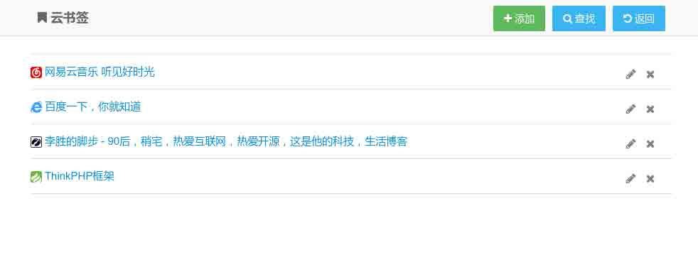

# 第 1 节 项目和实验概述

## 一、项目介绍

WEB 在线书签，可以添加，查询，修改，删除你的书签，通过该项目的学习和实现，你能了解够并掌握以下知识点 ：

*   利用 ThinkPHP 完成服务器端功能的开发，为前端提供接口，前后端完全分离
*   利用 PHP 的 HTML 解析器，获取网页的 title 和 icon
*   利用 AmazeUI，快速完成前端代码的书写
*   利用 jQuery，快速完成 ajax 的书写，使得前后端能够通信协作

最终效果： 

## 二、实验说明

### 1\. 环境登陆

无需密码自动登录，系统用户名 shiyanlou

### 2\. 环境介绍

本实验采用实验楼带的桌面的 Ubuntu Linux 环境，实验中会用到的桌面上的程序：

> * XfceTerminal：Linux 命令行终端，使用 Linux 命令 > * Firefox：浏览器
> * gedit：文本编辑器，利用它进行代码编辑

### 3\. 需要用的到资源（需要先下载到本地）

> ######1、ThinkPHP：http://labfile.oss.aliyuncs.com/thinkphp*3.2.3*full.zip > ######2、HTML 解析器：http://labfile.oss.aliyuncs.com/simple*html*dom.php > ######3、jQuery： http://labfile.oss.aliyuncs.com/jquery/1.11.1/jquery.min.js?ver=3.4.2 > ######4、AmazeUI：http://labfile.oss.aliyuncs.com/files0422/AmazeUI-1.0.1.zip > ######ps: jQuery 就不需要下载了，我们用在线的 CDN，不过你也可以下载，在 html 引用的时候注意下就行。

### 4\. 环境使用

使用 gedit 编辑代码，使用 LXTerminal 输入 linux 命令，主要是一些权限修改命令 `sudo chmod -R 777 *`

实验报告可以在个人主页中查看，其中含有每次实验的截图及笔记，以及每次实验的有效学习时间（指的是在实验桌面内操作的时间，如果没有操作，系统会记录为发呆时间）。这些都是您学习的真实性证明。

本课程中的所有源码可以通过以下方式下载：

```php
git clone https://github.com/lishengzxc/webbookmarker.git 
```

```php
git clone http://git.shiyanlou.com/shiyanlou/webbookmarker 
```

### 5\. 我的联系方式

###### 由于我自己也是第一次写这样的文档，所以文档中有什么不明白的地方，尽管联系我

###### Email：eric[at].lishengcn.cn

###### QQ：306009337

###### BLOG：http://www.lishengcn.cn