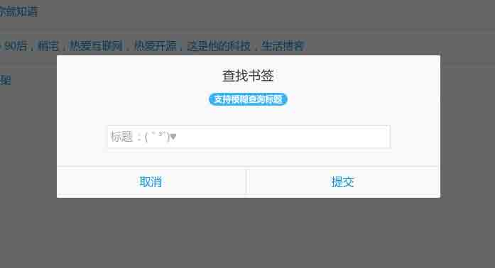

# 第 6 节 项目实战 5（前端交互功能的实现(JavaScript)） 和总结

## 一、前端交互功能的实现（JavaScript）

##### 下图为３个模拟框





##### 1)、在 `</body>` 前引入相关的 js 库

```php
<script type='text/javascript' src='http://labfile.oss.aliyuncs.com/jquery/1.11.1/jquery.min.js?ver=3.4.2'></script>
<script src="assets/js/amazeui.min.js"></script> 
```

##### 2)、页面加载完毕后，向服务器发送请求，加载书签信息，需要访问的服务器端接口是

##### `http://localhost/webbookmarker/index.php/Home/BookMarker/ShowAll`

```php
$(document).ready(function(){
        $.ajax({
            url: 'http://localhost/webbookmarker/index.php/Home/BookMarker/ShowAll',
            dataType: 'json',
            success: function(data){
                var len = data.length;
                var c = '';
                for (var i = 0; i < len; i++) {
                    c += '<li><a  id="' + data[i].id + '" style="font-size: 15px" href="' + data[i].href +
                        '" target="_blank"> ' + data[i].title + '</a><i><a class="modify" data-id="' + data[i].id + '"><span class="am-icon-pencil"></span></a> <a class="del" data-id="' + data[i].id + '"><span class="am-icon-times"></span></a></i></li>';
                }
                $("#marker_list").append(c);
            } 
        }) 
```

##### 3)、添加按钮的响应事件，访问服务器端接口是

##### `http://localhost/webbookmarker/index.php/Home/BookMarker/Add`

```php
 $('#add').on('click', function() {
            $('#add_prompt').modal({
                relatedTarget: this,
                onConfirm: function(e) {
                    $.ajax({
                        url: 'http://localhost/webbookmarker/index.php/Home/BookMarker/Add',
                        type: 'GET',
                        dataType: 'json',
                        cache: false,
                        data: {
                            title: e.data[0],
                            url: e.data[1]
                        },
                        success: function(data) {
                            if (data.code == 1) {
                                var c = '';
                                c = '<li><a href="' + data.content.href +
                                    '" target="_blank"> ' + data.content.title + '</a><i><a class="modify" data-id="' + data.content.id + '"><span class="am-icon-pencil"></span></a> <a class="del" data-id="' + data.content.id + '"><span class="am-icon-times"></span></a></i></li>'
                                $("#marker_list").prepend(c);
                            } else {
                                alert("无法添加该书签");
                            };
                        }
                    })
                },
                onCancel: function(e) {}
            });
        }); 
```

##### 4)、查询按钮的响应事件，访问服务器端接口是

##### `http://localhost/webbookmarker/index.php/Home/BookMarker/Search`

```php
 $('#search').on('click', function() {
            $('#search_prompt').modal({
                relatedTarget: this,
                onConfirm: function(e) {
                    $.ajax({
                        url: 'http://localhost/webbookmarker/index.php/Home/BookMarker/Search',
                        type: 'GET',
                        dataType: 'json',
                        cache: false,
                        data: {
                            keyworld: e.data
                        },
                        success: function(data) {
                            if (data.code == 1) {
                                var len = data.content.length;
                                var c = '';
                                for(var i = 0; i < len; i++) {
                                    c += '<li><a href="' + data.content[i].href +
                                        '" target="_blank"> ' +
                                        data.content[i].title + '</a></li>'; 
                                }
                                $("#marker_list").empty().prepend(c);
                            } else {
                                alert("没找到相关的书签");
                            };
                        }
                    })
                },
                onCancel: function(e) {}
            });
        }); 
```

##### 5)、返回按钮的响应事件，访问服务器端接口是

##### `http://localhost/webbookmarker/index.php/Home/BookMarker/ShowAll`

```php
 $('#back').on('click', function() {
            $.ajax({
                url: 'http://localhost/webbookmarker/index.php/Home/BookMarker/ShowAll',
                dataType: 'json',
                success: function(data){
                    var len = data.length;
                    var c = '';
                    for (var i = 0; i < len; i++) {
                        c += '<li><a  style="font-size: 15px" href="' + data[i].href +
                            '" target="_blank"> ' +
                            data[i].title + '</a><i><a class="modify" data-id="' + data[i].id + '"><span class="am-icon-pencil"></span></a> <a class="del" data-id="' + data[i].id + '"><span class="am-icon-times"></span></a></i></li>';
                    }
                    $("#marker_list").empty();
                    $("#marker_list").append(c);
                } 
            })
        }) 
```

##### 6)、删除按钮的响应事件，访问服务器端接口是

##### `http://localhost/webbookmarker/index.php/Home/BookMarker/Del`

```php
 $(".del").live("click", function() {
            var dataid = $(this).attr('data-id');
            $.ajax({
                url: 'http://localhost/webbookmarker/index.php/Home/BookMarker/Del',
                type: 'GET',
                dataType: 'json',
                data: {
                    id: dataid
                },
                success: function(data) {
                    if (data.code == 1) {
                        location.reload(true); 
                    } else {
                        alert("删除书签失败");
                    }
                }
            })
        }) 
```

##### 7)、修改按钮的响应事件，访问服务器端接口是

##### `http://localhost/webbookmarker/index.php/Home/BookMarker/Alter`

```php
 $(".modify").live("click", function() {

            var dataid = $(this).attr('data-id');
            var dtitle = $('#' + dataid).text().trim();
            var dhref = $('#' + dataid).attr('href');

            $("#m_title").val(dtitle);
            $("#m_href").val(dhref);
            $("#m_id").val(dataid);

            $('#modify_prompt').modal({
                relatedTarget: this,
                onConfirm: function(e) {
                    $.ajax({
                        url: 'http://localhost/webbookmarker/index.php/Home/BookMarker/Alter',
                        type: 'GET',
                        data: {
                            id: dataid,
                            title: e.data[0],
                            href: e.data[1]
                        },
                        success: function(data) {
                            location.reload(true);
                        }
                    })
                },
                onCancel: function(e) {}
            });
        })

    })
    </script> 
```

## 二、作业思考

我相信学习这个项目你的一定本身就对 PHP、JavaScript 有一定的了解，其实我们在开发过程中，为了降低程序的耦合度，都是这样开发的，服务器为客户端提供接口，客户端去访问服务器的接口，最后达到我们想要的功能。

作业：完成整个项目。

附件：源代码地址：

```php
git clone https://github.com/lishengzxc/webbookmarker.git
git clone http://git.shiyanlou.com/shiyanlou/webbookmarker 
```

###### 再次我的联系方式，欢迎你遇到问题可以问我

###### QQ：306009337

###### Email：eric[at]lishengcn.cn

###### Blog：http://www.lishengcn.cn