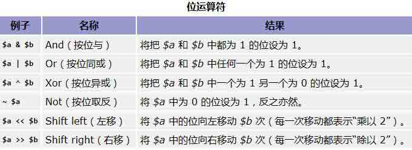
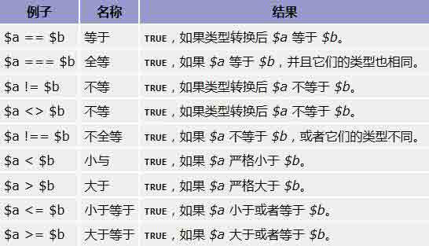
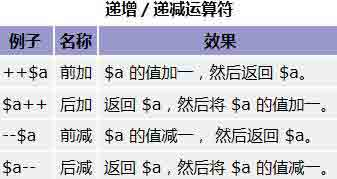

# 第 7 节 PHP 运算符

## 一、实验说明

### 1\. 环境登录

无需密码自动登录，系统用户名 shiyanlou

### 2\. 环境介绍

本实验环境采用 Ubuntu Linux 桌面环境，实验中会用到桌面上的程序：

1.命令行终端: Linux 命令行终端，打开后会进入 Bash 环境，可以使用 Linux 命令

2.Firefox 及 Opera：浏览器，可以用在需要前端界面的课程里，只需要打开环境里写的 HTML/JS 页面即可

3.gvim：非常好用的 Vim 编辑器，最简单的用法可以参考课程[Vim 编辑器](http://www.shiyanlou.com/courses/2)

4.gedit 及 Brackets：如果您对 gvim 的使用不熟悉，可以用这两个作为代码编辑器，其中 Brackets 非常适用于前端代码开发

### 3\. 环境使用

使用编辑器输入实验所需的代码及文件，使用命令行终端运行所需命令进行操作。

“实验记录”页面可以在“我的主页”中查看，每次实验的截图及笔记，以及有效学习时间（指的是在实验桌面内操作的时间，如果没有操作，系统会记录为发呆时间）。这些都是您在实验楼学习的真实性证明。

### 4\. 课程介绍

本节讲解 PHP 的运算符，它包含算术运算符、赋值运算符、位运算符、比较运算符、执行运算符、递增递减运算符、逻辑运算符、字符串运算符和数组运算符，它们之间的优先级也非常重要。

## 二、算术运算符

还记得学校里学到的基本数学知识吗？就和它们一样。

算术运算符


除法运算符总是返回浮点数。只有在下列情况例外：两个操作数都是整数（或字符串转换成的整数）并且正好能整除，这时它返回一个整数。

取模运算符的操作数在运算之前都会转换成整数（除去小数部分）。

取模运算符 % 的结果和被除数的符号（正负号）相同。即 \$a % \$b 的结果和 \$a 的符号相同。例如：

```php
<?php

echo (5 % 3)."\n";           // prints 2
echo (5 % -3)."\n";          // prints 2
echo (-5 % 3)."\n";          // prints -2
echo (-5 % -3)."\n";         // prints -2

?> 
```

## 三、赋值运算符

基本的赋值运算符是“=”。一开始可能会以为它是“等于”，其实不是的。它实际上意味着把右边表达式的值赋给左边的运算数。

赋值运算表达式的值也就是所赋的值。也就是说，“$a = 3”的值是 3。这样就可以做一些小技巧：

```php
<?php

$a = ($b = 4) + 5; // $a 现在成了 9，而 $b 成了 4。

?> 
```

对于数组 array，对有名字的键赋值是用“=>”运算符。此运算符的优先级和其它赋值运算符相同。 在基本赋值运算符之外，还有适合于所有二元算术，数组集合和字符串运算符的“组合运算符”，这样可以在一个表达式中使用它的值并把表达式的结果赋给它，例如：

```php
<?php

$a = 3;
$a += 5; // sets $a to 8, as if we had said: $a = $a + 5;
$b = "Hello ";
$b .= "There!"; // sets $b to "Hello There!", just like $b = $b . "There!";

?> 
```

注意赋值运算将原变量的值拷贝到新变量中（传值赋值），所以改变其中一个并不影响另一个。这也适合于在密集循环中拷贝一些值例如大数组。

**引用赋值**

PHP 支持引用赋值，使用“\$var = &$othervar;”语法。引用赋值意味着两个变量指向了同一个数据，没有拷贝任何东西。

```php
<?php
$a = 3;
$b = &$a; // $b 是 $a 的引用

print "$a\n"; // 输出 3
print "$b\n"; // 输出 3

$a = 4; // 修改 $a

print "$a\n"; // 输出 4
print "$b\n"; // 也输出 4，因为 $b 是 $a 的引用，因此也被改变
?> 
```

## 四、位运算符

位运算符允许对整型数中指定的位进行求值和操作。



**Example 1 整数的 AND，OR 和 XOR 位运算符**

```php
<?php
/*
 * Ignore the top section,
 * it is just formatting to make output clearer.
 */

$format = '(%1$2d = %1$04b) = (%2$2d = %2$04b)'
        . ' %3$s (%4$2d = %4$04b)' . "\n";

echo <<<EOH
 ---------     ---------  -- ---------
 result        value      op test
 ---------     ---------  -- ---------
EOH;

/*
 * Here are the examples.
 */

$values = array(0, 1, 2, 4, 8);
$test = 1 + 4;

echo "\n Bitwise AND \n";
foreach ($values as $value) {
    $result = $value & $test;
    printf($format, $result, $value, '&', $test);
}

echo "\n Bitwise Inclusive OR \n";
foreach ($values as $value) {
    $result = $value | $test;
    printf($format, $result, $value, '|', $test);
}

echo "\n Bitwise Exclusive OR (XOR) \n";
foreach ($values as $value) {
    $result = $value ^ $test;
    printf($format, $result, $value, '^', $test);
}
?> 
```

以上例程会输出：

```php
---------     ---------  -- ---------
 result        value      op test
 ---------     ---------  -- ---------
 Bitwise AND
( 0 = 0000) = ( 0 = 0000) & ( 5 = 0101)
( 1 = 0001) = ( 1 = 0001) & ( 5 = 0101)
( 0 = 0000) = ( 2 = 0010) & ( 5 = 0101)
( 4 = 0100) = ( 4 = 0100) & ( 5 = 0101)
( 0 = 0000) = ( 8 = 1000) & ( 5 = 0101)

 Bitwise Inclusive OR
( 5 = 0101) = ( 0 = 0000) | ( 5 = 0101)
( 5 = 0101) = ( 1 = 0001) | ( 5 = 0101)
( 7 = 0111) = ( 2 = 0010) | ( 5 = 0101)
( 5 = 0101) = ( 4 = 0100) | ( 5 = 0101)
(13 = 1101) = ( 8 = 1000) | ( 5 = 0101)

 Bitwise Exclusive OR (XOR)
( 5 = 0101) = ( 0 = 0000) ^ ( 5 = 0101)
( 4 = 0100) = ( 1 = 0001) ^ ( 5 = 0101)
( 7 = 0111) = ( 2 = 0010) ^ ( 5 = 0101)
( 1 = 0001) = ( 4 = 0100) ^ ( 5 = 0101)
(13 = 1101) = ( 8 = 1000) ^ ( 5 = 0101) 
```

## 五、比较运算符

比较运算符，如同它们名称所暗示的，允许对两个值进行比较。



如果比较一个数字和字符串或者比较涉及到数字内容的字符串，则字符串会被转换为数值并且比较按照数值来进行。此规则也适用于 switch 语句。当用 === 或 !== 进行比较时则不进行类型转换，因为此时类型和数值都要比对。

```php
<?php
var_dump(0 == "a"); // 0 == 0 -> true
var_dump("1" == "01"); // 1 == 1 -> true
var_dump("10" == "1e1"); // 10 == 10 -> true
var_dump(100 == "1e2"); // 100 == 100 -> true

switch ("a") {
case 0:
    echo "0";
    break;
case "a": // never reached because "a" is already matched with 0
    echo "a";
    break;
}
?> 
```


**标准数组比较代码**

```php
<?php
// 数组是用标准比较运算符这样比较的
function standard_array_compare($op1, $op2)
{
    if (count($op1) < count($op2)) {
        return -1; // $op1 < $op2
    } elseif (count($op1) > count($op2)) {
        return 1; // $op1 > $op2
    }
    foreach ($op1 as $key => $val) {
        if (!array_key_exists($key, $op2)) {
            return null; // uncomparable
        } elseif ($val < $op2[$key]) {
            return -1;
        } elseif ($val > $op2[$key]) {
            return 1;
        }
    }
    return 0; // $op1 == $op2
}
?> 
```

## 六、执行运算符

PHP 支持一个执行运算符：反引号（``）。注意这不是单引号！PHP 将尝试将反引号中的内容作为外壳命令来执行，并将其输出信息返回（例如，可以赋给一个变量而不是简单地丢弃到标准输出）。

```php
<?php
$output = `ls -al`;
echo "<pre>$output</pre>";
?> 
```

**Note: 反引号运算符在激活了安全模式或者关闭了 shell_exec() 时是无效的。**

## 七、递增/递减运算符

PHP 支持 C 风格的前后递增与递减运算符。

**Note: 递增／递减运算符不影响布尔值。递减 NULL 值也没有效果，但是递增 NULL 的结果是 1。**



一个简单的示例脚本：

```php
<?php
echo "<h3>Postincrement</h3>";
$a = 5;
echo "Should be 5: " . $a++ . "<br />\n";
echo "Should be 6: " . $a . "<br />\n";

echo "<h3>Preincrement</h3>";
$a = 5;
echo "Should be 6: " . ++$a . "<br />\n";
echo "Should be 6: " . $a . "<br />\n";

echo "<h3>Postdecrement</h3>";
$a = 5;
echo "Should be 5: " . $a-- . "<br />\n";
echo "Should be 4: " . $a . "<br />\n";

echo "<h3>Predecrement</h3>";
$a = 5;
echo "Should be 4: " . --$a . "<br />\n";
echo "Should be 4: " . $a . "<br />\n";
?> 
```

在处理字符变量的算术运算时，PHP 沿袭了 Perl 的习惯，而非 C 的。例如，在 Perl 中 'Z'+1 将得到 'AA'，而在 C 中，'Z'+1 将得到 ''（ord('Z') == 90，ord('[') == 91）。注意字符变量只能递增，不能递减，并且只支持纯字母（a-z 和 A-Z）。

**涉及字符变量的算数运算:**

```php
<?php
$i = 'W';
for ($n=0; $n<6; $n++) {
    echo ++$i . "\n";
}
?> 
```

以上例程会输出：

```php
X
Y
Z
AA
AB
AC 
```

## 八、逻辑运算符

![Alt text

“与”和“或”有两种不同形式运算符的原因是它们运算的优先级不同 **逻辑运算符示例：**

```php
<?php

// 下面的 foo() 不会被调用，因为它们被运算符“短路”了。
$a = (false && foo());
$b = (true  || foo());
$c = (false and foo());
$d = (true  or  foo());

// "||" 的优先级比 "or" 高
$e = false || true; // $e 被赋值为 (false || true)，结果为 true
$f = false or true; // $f 被赋值为 false [Altair 注："=" 的优先级比 "or" 高]
var_dump($e, $f);

// "&&" 的优先级比 "and"　高
$g = true && false; // $g 被赋值为 (true && false)，结果为 false
$h = true and false; // $h 被赋值为 true [Altair 注："=" 的优先级比 "and" 高]
var_dump($g, $h);
?> 
```

以上例程的输出类似于：

```php
bool(true)
bool(false)
bool(false)
bool(true) 
```

## 九、字符串运算符

有两个字符串运算符。第一个是连接运算符（“.”），它返回其左右参数连接后的字符串。第二个是连接赋值运算符（“.=”），它将右边参数附加到左边的参数后。

```php
<?php
$a = "Hello ";
$b = $a . "World!"; // now $b contains "Hello World!"

$a = "Hello ";
$a .= "World!";     // now $a contains "Hello World!"
?> 
```

## 十、数组运算符


+ 运算符把右边的数组元素（除去键值与左边的数组元素相同的那些元素）附加到左边的数组后面，但是重复的键值不会被覆盖。

```php
<?php
$a = array("a" => "apple", "b" => "banana");
$b = array("a" => "pear", "b" => "strawberry", "c" => "cherry");

$c = $a + $b; // Union of $a and $b
echo "Union of \$a and \$b: \n";
var_dump($c);

$c = $b + $a; // Union of $b and $a
echo "Union of \$b and \$a: \n";
var_dump($c);
?> 
```

执行后，此脚本会显示：

```php
Union of $a and $b:
array(3) {
  ["a"]=>
  string(5) "apple"
  ["b"]=>
  string(6) "banana"
  ["c"]=>
  string(6) "cherry"
}
Union of $b and $a:
array(3) {
  ["a"]=>
  string(4) "pear"
  ["b"]=>
  string(10) "strawberry"
  ["c"]=>
  string(6) "cherry"
} 
```

数组中的单元如果具有相同的键名和值则比较时相等。

## 十一、练习

请掌握各个运算符的优先级。

实验中有任何问题欢迎到[实验楼问答](http://www.shiyanlou.com/questions)提问。