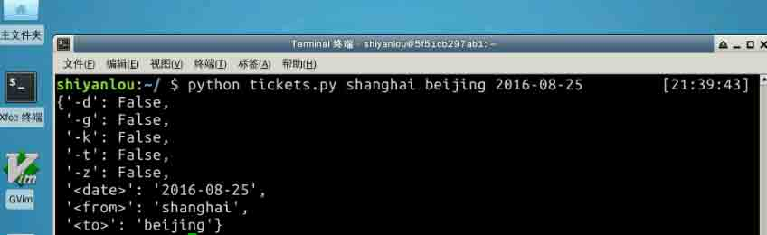

# 第 1 节 Python 实现火车票查询工具

## 一、实验简介

当你想查询一下火车票信息的时候，你还在上 12306 官网吗？或是打开你手机里的 APP？

下面让我们来用 Python 写一个命令行版的火车票查看器， 只要在命令行敲一行命令就能获得你想要的火车票信息！如果你刚掌握了 Python 基础，这将是个不错的小练习。

### 1.1 知识点

*   Python3 基础知识的综合运用
*   `docopt`、`requests` 及 `prettytable` 库的使用

## 1.2 效果截图


## 二、接口设计

一个应用写出来最终是要给人使用的，哪怕只是给你自己使用。

所以，首先应该想想你希望怎么使用它？让我们先给这个小应用起个名字吧，既然及查询票务信息，那就叫它 `tickets` 好了。

我们希望用户只要输入出发站，到达站以及日期就让就能获得想要的信息，比如要查看 8 月 25 号上海-北京的火车余票， 我们只需输入：

```py
$ tickets shanghai beijing 2016-08-25 
```

**注意：** 由于实验楼环境中无法输入中文，所以我们的参数设计为拼音的形式，在这里思考下使用拼音是否有什么弊端？

对这一接口进行抽象得到：

```py
$ tickets from to date 
```

另外，火车有各种类型，高铁、动车、特快、快速和直达，我们希望可以提供选项只查询特定的一种或几种的火车，所以，我们应该有下面这些选项：

*   -g 高铁
*   -d 动车
*   -t 特快
*   -k 快速
*   -z 直达

这几个选项应该能被组合使用，所以，最终我们的接口应该是这个样子的：

```py
$ tickets [-gdtkz] from to date 
```

接口已经确定好了，剩下的就是实现它了。

## 三、代码实现

首先安装一下实验需要用到的库：

```py
$ sodo pip install requests prettytable docopt 
```

*   requests, 不用不多介绍了吧，使用 Python 访问 HTTP 资源的必备库。
*   docopt, Python3 命令行参数解析工具。
*   prettytable, 格式化信息打印工具，能让你像 MySQL 那样打印数据。

### 3.1 解析参数

Python 有很多写命令行参数解析工具，如 `argparse`, `docopt`, `click`，这里我们选用的是 `docopt` 这个简单易用的工具。`docopt` 可以按我们在文档字符串中定义的格式来解析参数，比如我们在 `tickets.py`：

**注意：** 实验楼中无法输入中文，参数后的中文可以使用拼音代替。

```py
# coding: utf-8
"""Train tickets query via command-line.

Usage:
    tickets [-gdtkz] <from> <to> <date>

Options:
    -h,--help   显示帮助菜单
    -g          高铁
    -d          动车
    -t          特快
    -k          快速
    -z          直达

Example:
    tickets beijing shanghai 2016-08-25
"""
from docopt import docopt

def cli():
    """command-line interface"""
    arguments = docopt(__doc__)
    print(arguments)

if __name__ == '__main__':
    cli() 
```

下面我们运行一下这个程序：

```py
$ python3 tickets.py beijing shanghai 2016-08-25 
```

我们得到下面的结果：



### 3.2 获取数据

参数已经解析好了，下面就是如何获取数据了，这也是最主要的部分。首先我们打开 12306，进入余票查询页面，如果你使用 Chrome，那么按 `F12` 打开开发者工具，选中 `Network` 一栏，在查询框钟我们输入 `上海` 到 `北京`，日期 `2016-08-25`, 点击查询，我们在调试工具发现，查询系统实际上请求了这个 URL：

```py
https://kyfw.12306.cn/otn/lcxxcx/query?purpose_codes=ADULT&queryDate=2016-07-01&from_station=SHH&to_station=BJP 
```

并且返回的是`JSON`格式的数据！

接下来问题就简单了，我们只需要构建请求 URL 然后解析返回的 Json 数据就可以了。但是我们发现，URL 里面 `from_station` 和 `to_station` 并不是汉字或者拼音，而是一个代号，而我们想要输入的是汉字或者拼音，我们要如何获取代号呢？我们打开网页源码看看有没有什么发现。

果然，我们在网页里面找到了这个链接：`https://kyfw.12306.cn/otn/resources/js/framework/station_name.js?station_version=1.8955` 这里面貌似是包含了所有车站的中文名，拼音，简写和代号等信息。但是这些信息挤在一起，而我们只想要车站的拼音和大写字母的代号信息，怎么办呢？

正则表达式就是答案，我们写个小脚本来匹配提取出想要的信息吧, 在`parse_station.py`中：

```py
# coding: utf-8

import re
import requests
from pprint import pprint

url = 'https://kyfw.12306.cn/otn/resources/js/framework/station_name.js?station_version=1.8955'
r = requests.get(url, verify=False)
stations = re.findall(r'([A-Z]+)\|([a-z]+)', r.text)
stations = dict(stations)
stations = dict(zip(stations.values(), stations.keys()))
pprint(stations, indent=4) 
```

注意，上面的正则表达式匹配出的结果转为字典后，字典的键是大写字母大号，这显然不是我们想要的结果，于是，我们通过一个变换将键值反过来。 我们运行这个脚本，它将以字典的形式返回所有车站和它的大写字母代号, 我们将结果重定向到 `stations.py` 中，

```py
$ python3 parse_station.py > stations.py 
```

我们为这个字典加名字，`stations`, 最终，`stations.py`文件是这样的：


现在，用户输入车站的中文名，我们就可以直接从这个字典中获取它的字母代码了：

```py
...
from stations import stations

def cli():
    arguments = docopt(__doc__)
    from_staion = stations.get(arguments['<from>'])
    to_station = stations.get(arguments['<to>'])
    date = arguments['<date>']
    # 构建 URL
    url = 'https://kyfw.12306.cn/otn/lcxxcx/query?purpose_codes=ADULT&queryDate={}&from_station={}&to_station={}'.format(
        date, from_staion, to_station
    ) 
```

万事俱备，下面我们来请求这个 URL 获取数据吧！这里我们使用 `requests` 这个库, 它提供了非常简单易用的接口，

```py
...
import requests

def cli():
    ...
    # 添加 verify=False 参数不验证证书
    r = requests.get(url, verify=False)
    print(r.json()) 
```

从结果中，我们可以观察到，与车票有关的信息需要进一步提取：

```py
def cli():
    ...
    r = requsets.get(url);
    rows = r.json()['data']['datas'] 
```

### 3.3 解析数据

我们封装一个简单的类来解析数据：

```py
from prettytable import PrettyTable

class TrainCollection(object):

    # 显示车次、出发/到达站、 出发/到达时间、历时、一等坐、二等坐、软卧、硬卧、硬座
    header = 'train station time duration first second softsleep hardsleep hardsit'.split()

    def __init__(self, rows):
        self.rows = rows

    def _get_duration(self.row):
        """
        获取车次运行时间
        """
        duration = row.get('lishi').replace(':', 'h') + 'm'
        if duration.startswith('00'):
            return duration[4:]
        if duration.startswith('0'):
            return duration[1:]
        return duration

    @property
    def trains(self):
        for row in self.rows:
            train = [
                # 车次
                row['station_train_code'],
                # 出发、到达站
                '\n'.join([row['from_staion_name'], row['to_station_name']]),
                # 出发、到达时间
                '\n'.join([row['start_time'], row['arrive']]),
                # 历时
                self._get_duration(row),
                # 一等坐
                row['zy_num'],
                # 二等坐
                row['ze_num'],
                # 软卧
                row['rw_num'],
                # 软坐
                row['yw_num'],
                # 硬坐
                row['yz_num']
            ]
            yield train

    def pretty_print(self):
        """
        数据已经获取到了，剩下的就是提取我们要的信息并将它显示出来。
        `prettytable`这个库可以让我们它像 MySQL 数据库那样格式化显示数据。
        """
        pt = PrettyTable()
        # 设置每一列的标题
        pt._set_field_names(self.header)
        for train in self.trains:
            pt.add_row(train)
        print(pt) 
```

### 3.4 显示结果

最后，我们将上述过程进行汇总并将结果输出到屏幕上：

```py
...

class TrainCollection:
    ...
    ...

def cli():
    arguments = docopt(__doc__)
    from_staion = stations.get(arguments['<from>'])
    to_station = stations.get(arguments['<to>'])
    date = arguments['<date>']
    # 构建 URL
    url = 'https://kyfw.12306.cn/otn/lcxxcx/query?purpose_codes=ADULT&queryDate={}&from_station={}&to_station={}'.format(
        date, from_staion, to_station
    )
    r = requests.get(url, verify=False)
    rows = r.json()['data']['datas']
    trains = TrainCollection(rows)
    trains.pretty_print()

if __name__ == '__main__':
    cli() 
```

### 3.5 最后一米

至此， 程序的主体已经完成了， 但是上面打印出的结果是黑白的，很是乏味，我们来给它添加颜色吧：

```py
def colored(color, text):
    table = {
        'red': '\033[91m',
        'green': '\033[92m',
        # no color
        'nc': '\033[0'
    }
    cv = table.get(color)
    nc = table.get('nv')
    return ''.join([cv, text, nc]) 
```

修改一下程序，将出发车站与出发时间显示为红色， 将到达车站与到达时间显示为绿色：

```py
...
'\n'.join([colored('green', row['from_staion_name'])
           colored('red', row['to_station_name'])]),
'\n'.join([colored('green', row['start_time'])
           colored('red', row['arrive_time'])]),
... 
```

## 四、总结

本课程使用 Python3 抓取 12306 网站信息提供一个命令行的火车票查询工具。通过该项目的实现，可以学习并实践 Python3 基础及网络编程，以及 docopt，requests，prettytable 等库的使用。

感兴趣的同学可以实现更多扩展功能：

*   显示商务坐， 无坐
*   添加参数支持，用户可以指定火车类型
*   支持更多的时间格式，如：20161010

## 五、参考资料

本项目详细代码可以从下面链接获取：

*   [`github.com/protream/iquery`](https://github.com/protream/iquery)