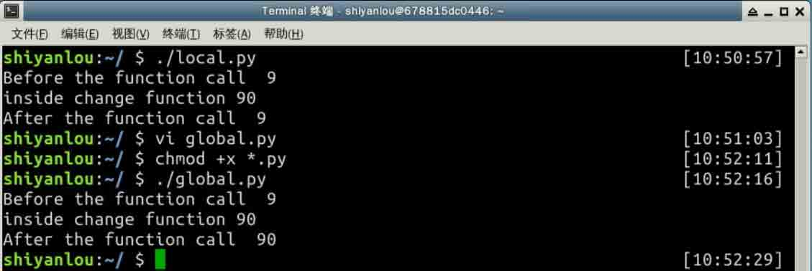
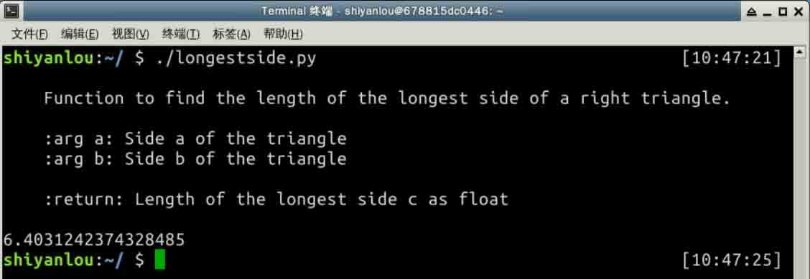

# 第 8 节 函数

我们经常需要在同一个程序里多次复用代码。函数可以很好的帮助我们完成这一点。我们在函数里写我们要重复做的事，然后我们在任何需要的时候调用它。我们已经看到一些内建的函数，比如 `len()`，`divmod()`。

## 知识点

*   函数的定义
*   局域/全局变量的概念
*   默认参数，关键字参数及强制关键字参数
*   文档字符串的使用
*   高阶函数，map() 函数

## 实验步骤

### 1\. 定义一个函数

我们使用关键字 `def` 来定义一个函数。

```py
def functionname(params):
    statement1
    statement2 
```

让我们编写一个函数，它将接受两个整数作为输入，然后返回总和。

```py
>>> def sum(a, b):
...     return a + b 
```

第二行有个 `return` 关键字，我们把 `a + b` 的值返回给调用者。

你必须像下面这样调用这个函数。

```py
>>> res = sum(234234, 34453546464)
>>> res
34453780698L 
```

还记得我们上一个实验讲过的回文检查程序么，让我们编写一个函数来检查给出的字符串是否为回文，然后返回 `True` 或者 `False`。

```py
#!/usr/bin/env python3
def palindrome(s):
    return s == s[::-1]
if __name__ == '__main__':
    s = input("Enter a string: ")
    if palindrome(s):
        print("Yay a palindrome")
    else:
        print("Oh no, not a palindrome") 
```

你可以运行试试 :）

### 2\. 局域或全局变量

我们通过两个例子来弄明白局域或全局变量。

```py
#!/usr/bin/env python3
def change():
    a = 90
    print(a)
a = 9
print("Before the function call ", a)
print("inside change function", end=' ')
change()
print("After the function call ", a) 
```

运行程序：


首先我们对 `a` 赋值 9，然后调用更改函数，这个函数里我们对 `a` 赋值 90，然后打印 `a` 的值。调用函数后我们再次打印 `a` 的值。当我们在函数里写 `a = 90` 时，它实际上创建了一个新的名为 `a` 的变量，这个变量只在函数里可用，并且会在函数完成时销毁。所以即使这两个变量的名字都相同，但事实上他们并不是同一个变量。

```py
#!/usr/bin/env python3
def change():
    global a
    a = 90
    print(a)
a = 9
print("Before the function call ", a)
print("inside change function", end=' ')
change()
print("After the function call ", a) 
```

这里通过关键字 `global` 来告诉 a 的定义是全局的，因此在函数内部更改了 `a` 的值，函数外 `a` 的值也实际上更改了。

运行程序：



### 3\. 默认参数值

函数的参数变量可以有默认值，也就是说如果我们对指定的参数变量没有给出任何值则会赋其默认值。

```py
>>> def test(a , b=-99):
...     if a > b:
...         return True
...     else:
...         return False 
```

在上面的例子里，我们在函数的参数列表写出 `b = -99`。这表示如果调用者未给出 `b` 的值，那么 `b` 的值默认为 `-99`。这是一个关于默认参数的非常简单的例子。

你可以通过调用函数测试代码。

```py
>>> test(12, 23)
False
>>> test(12)
True 
```

有两个非常重要的地方，第一个是具有默认值的参数后面不能再有普通参数，比如 `f(a,b=90,c)` 就是错误的。

第二个是默认值只被赋值一次，因此如果默认值是任何可变对象时会有所不同，比如列表、字典或大多数类的实例。例如，下面的函数在后续调用过程中会累积（前面）传给它的参数:

```py
>>> def f(a, data=[]):
...     data.append(a)
...     return data
...
>>> print(f(1))
[1]
>>> print(f(2))
[1, 2]
>>> print(f(3))
[1, 2, 3] 
```

要避免这个问题，你可以像下面这样：

```py
>>> def f(a, data=None):
...     if data is None:
...         data = []
...     data.append(a)
...     return data
...
>>> print(f(1))
[1]
>>> print(f(2))
[2] 
```

### 4\. 关键字参数

函数可以通过*关键字参数*的形式来调用，形如 `keyword = value`。如下：

```py
>>> def func(a, b=5, c=10):
...     print('a is', a, 'and b is', b, 'and c is', c)
...
>>> func(12, 24)
a is 12 and b is 24 and c is 10
>>> func(12, c = 24)
a is 12 and b is 5 and c is 24
>>> func(b=12, c = 24, a = -1)
a is -1 and b is 12 and c is 24 
```

在上面的例子中你能看见调用函数时使用了变量名，比如 `func(12,c = 24)`，这样我们将 `24` 赋给 `c` 且 `b` 具有默认值。

### 5\. 强制关键字参数

我们也能将函数的参数标记为只允许使用关键字参数。用户调用函数时将只能对每一个参数使用相应的关键字参数。

```py
>>> def hello(*, name='User'):
...     print("Hello", name)
...
>>> hello('shiyanlou')
Traceback (most recent call last):
  File "<stdin>", line 1, in <module>
TypeError: hello() takes 0 positional arguments but 1 was given
>>> hello(name='shiyanlou')
Hello Kushal 
```

了解更多，请阅读[PEP-3102](https://www.python.org/dev/peps/pep-3102/)。

### 6\. 文档字符串

在 Python 里我们使用文档字符串（*docstrings*）来说明如何使用代码，这在交互模式非常有用，也能用于自动创建文档。下面我们来看看使用文档字符串的例子。

```py
#!/usr/bin/env python3
import math

def longest_side(a, b):
    """
    Function to find the length of the longest side of a right triangle.

    :arg a: Side a of the triangle
    :arg b: Side b of the triangle

    :return: Length of the longest side c as float
    """
    return math.sqrt(a*a + b*b)

if __name__ == '__main__':
    print(longest_side.__doc__)
    print(longest_side(4,5)) 
```

运行程序：



### 7\. 高阶函数

高阶函数（*Higher-order function*）或仿函数（*functor*）是内部至少含有一个以下步骤的函数：

*   使用一个或多个函数作为参数
*   返回另一个函数作为输出

Python 里的任何函数都可以作为高阶函数。

```py
>>> def high(func, value):
...     return func(value)
...
>>> lst = high(dir, int)
>>> print(lst[-3:])
['imag', 'numerator', 'real'] 
```

阅读[官方文档](https://docs.python.org/3.5/faq/programming.html#how-do-you-make-a-higher-order-function-in-python)了解更多。

#### 7.1\. map 函数

`map` 是一个在 Python 里非常有用的高阶函数。它接受一个函数和一个序列（迭代器）作为输入，然后对序列（迭代器）的每一个值应用这个函数，返回一个序列（迭代器），其包含应用函数后的结果。

举例：

```py
>>> lst = [1, 2, 3, 4, 5]
>>> def square(num):
...     "返回所给数字的平方."
...     return num * num
...
>>> print(list(map(square, lst)))
[1, 4, 9, 16, 25] 
```

## 总结

经过本实验应当知道如何定义函数，局域变量和全局变量一定要弄清楚，参数默认值、关键字参数也需要掌握。

另外，其它高级语言常见的*函数重载*，Python 是没有的，这是因为 Python 有默认参数这个功能，*函数重载* 的功能大都可以使用默认参数达到。

在后面我们还介绍了高阶函数的概念并使用了 `map()` 函数。在 Python 中还有其它的高阶函数，如 [`sorted()`](https://docs.python.org/3/library/functions.html#sorted)、[`filter()`](https://docs.python.org/3/library/functions.html?highlight=sorted#filter) 以及 [`functools`](https://docs.python.org/3/library/functools.html) 模块中的函数，大家可以了解一下。