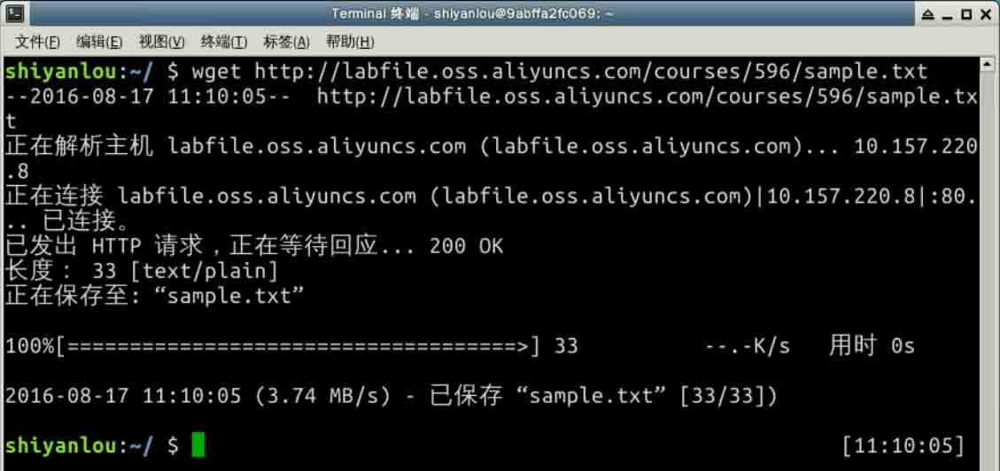

# 第 9 节 文件处理

文件是保存在计算机存储设备上的一些信息或数据。你已经知道了一些不同的文件类型，比如你的音乐文件，视频文件，文本文件。Python 给了你一些简单的方式操纵文件。通常我们把文件分为两类，文本文件和二进制文件。文本文件是简单的文本，二进制文件包含了只有计算机可读的二进制数据。

## 知识点

*   文件打开模式
*   文件读取与写入
*   `with` 语句
*   `lscpu` 命令的实现

## 实验步骤

### 1\. 文件打开

我们使用 `open()` 函数打开文件。它需要两个参数，第一个参数是文件路径或文件名，第二个是文件的打开模式。模式通常是下面这样的：

*   `"r"`，以只读模式打开，你只能读取文件但不能编辑/删除文件的任何内容
*   `"w"`，以写入模式打开，如果文件存在将会删除里面的所有内容，然后打开这个文件进行写入
*   `"a"`，以追加模式代开，写入到文件中的任何数据将自动添加到末尾

默认的模式为只读模式，也就是说如果你不提供任何模式，`open()` 函数将会以只读模式打开文件。我们将实验打开一个文件，不过要准备实验材料：

```py
$ wget http://labfile.oss.aliyuncs.com/courses/596/sample.txt 
```



然后进入 Python3 打开这个文件。

```py
>>> fobj = open("sample.txt")
>>> fobj
<open file 'sample.txt', mode 'r' at 0xb7f2d968> 
```

### 2\. 文件关闭

打开文件后我们应该总是关闭文件。我们使用方法 `close()` 完成这个操作。

```py
>>> fobj.close() 
```

始终确保你显式关闭每个打开的文件，一旦它的工作完成你没有任何理由保持打开文件。因为程序能打开的文件数量是有上限的。如果你超出了这个限制，没有任何可靠的方法恢复，因此程序可能会崩溃。每个打开的文件关联的数据结构（文件描述符/句柄/文件锁...）都要消耗一些主存资源。因此如果许多打开的文件没用了你可以结束大量的内存浪费，并且文件打开时始终存在数据损坏或丢失的可能性。

### 3\. 文件读取

使用 `read()` 方法一次性读取整个文件。

```py
>>> fobj = open("sample.txt")
>>> fobj.read()
'I love Python\nI love shiyanlou\n'
>>> fobj.close() 
```

如果你再一次调用 `read()`，它会返回空字符串因为它已经读取完整个文件。

`read(size)` 有一个可选的参数 `size`，用于指定字符串长度。如果没有指定 `size` 或者指定为负数，就会读取并返回整个文件。当文件大小为当前机器内存两倍时，就会产生问题。反之，会尽可能按比较大的 *size* 读取和返回数据。

`readline()` 能帮助你每次读取文件的一行。

```py
>>> fobj = open("sample.txt")
>>> fobj.readline()
'I love Python\n'
>>> fobj.readline()
'I love shiyanlou\n'
>>> fobj.close() 
```

使用 `readlines()` 方法读取所有行到一个列表中。

```py
>>> fobj = open('sample.txt')
>>> fobj.readlines()
['I love Python\n', 'I love shiyanlou\n']
>>> fobj.close() 
```

你可以循环遍历文件对象来读取文件中的每一行。

```py
>>> fobj = open('sample.txt')
>>> for x in fobj:
...     print(x, end = '')
... 
I love Python
I love shiyanlou
>>> fobj.close() 
```

让我们写一个程序，这个程序接受用户输入的字符串作为将要读取的文件的文件名，并且在屏幕上打印文件内容。

```py
#!/usr/bin/env python3
name = input("Enter the file name: ")
fobj = open(name)
print(fobj.read())
fobj.close() 
```

运行程序：

```py
$ ./test.py
Enter the file name: sample.txt
I love Python
I love shiyanlou 
```

### 4\. 文件写入

让我们通过 `write()` 方法打开一个文件然后我们随便写入一些文本。

```py
>>> fobj = open("ircnicks.txt", 'w')
>>> fobj.write('powerpork\n')
>>> fobj.write('indrag\n')
>>> fobj.write('mishti\n')
>>> fobj.write('sankarshan')
>>> fobj.close() 
```

现在读取我们刚刚创建的文件。

```py
>>> fobj = open('ircnicks.txt')
>>> s = fobj.read()
>>> fobj.close()
>>> print(s)
powerpork
indrag
mishti
sankarshan 
```

### 5\. 文件操作示例程序

#### 5.1\. 拷贝文件

在这个例子里我们拷贝给定的文本文件到另一个给定的文本文件。

```py
#!/usr/bin/env python3
import sys
if len(sys.argv) < 3:
    print("Wrong parameter")
    print("./copyfile.py file1 file2")
    sys.exit(1)
f1 = open(sys.argv[1])
s = f1.read()
f1.close()
f2 = open(sys.argv[2], 'w')
f2.write(s)
f2.close() 
```

运行程序：


你可以看到我们在这里使用了一个新模块 `sys`。`sys.argv` 包含所有命令行参数。这个程序的功能完全可以使用 shell 的 `cp` 命令替代：在 `cp` 后首先输入被拷贝的文件的文件名，然后输入新文件名。

`sys.argv` 的第一个值是命令自身的名字，下面这个程序打印命令行参数。

```py
#!/usr/bin/env python3
import sys
print("First value", sys.argv[0])
print("All values")
for i, x  in enumerate(sys.argv):
    print(i, x) 
```

运行程序：

```py
$ ./argvtest.py Hi there
First value ./argvtest.py
All values
0 ./argvtest.py
1 Hi
2 there 
```

这里我们用到了一个新函数 `enumerate(iterableobject)`，在序列中循环时，索引位置和对应值可以使用它同时得到。

#### 5.2\. 文本文件相关信息统计

让我们试着编写一个程序，对任意给定文本文件中的制表符、行、空格进行计数。

```py
#!/usr/bin/env python3

import os
import sys

def parse_file(path):
    """
    分析给定文本文件，返回其空格、制表符、行的相关信息

    :arg path: 要分析的文本文件的路径

    :return: 包含空格数、制表符数、行数的元组
    """
    fd = open(path)
    i = 0
    spaces = 0
    tabs = 0
    for i,line in enumerate(fd):
        spaces += line.count(' ')
        tabs += line.count('\t')
    # 现在关闭打开的文件
    fd.close()

    # 以元组形式返回结果
    return spaces, tabs, i + 1

def main(path):
    """
    函数用于打印文件分析结果

    :arg path: 要分析的文本文件的路径
    :return: 若文件存在则为 True，否则 False
    """
    if os.path.exists(path):
        spaces, tabs, lines = parse_file(path)
        print("Spaces {}. tabs {}. lines {}".format(spaces, tabs, lines))
        return True
    else:
        return False

if __name__ == '__main__':
    if len(sys.argv) > 1:
        main(sys.argv[1])
    else:
        sys.exit(-1)
    sys.exit(0) 
```

运行程序：


你可以看到程序有两个函数，`main()` 和 `parse_file()` ，`parse_file` 函数真正的分析文件并返回结果，然后在 `main()` 函数里打印结果。通过分割代码到一些更小的单元（函数）里，能帮助我们组织代码库并且也更容易为函数编写测试用例。

### 6\. 使用 `with` 语句

在实际情况中，我们应该尝试使用 `with` 语句处理文件对象，它会文件用完后会自动关闭，就算发生异常也没关系。它是 try-finally 块的简写：

```py
>>> with open('sample.txt') as fobj:
...     for line in fobj:
...         print(line, end = '')
... 
I love Python
I love shiyanlou 
```

### 7\. 实现 `lscpu` 命令

在 Linux 下你可以使用 `lscpu` 命令来查看当前电脑的 CPU 相关信息，如下图：


实际上 `lscpu` 命令是读取 `/proc/cpuinfo` 这个文件的信息并美化输出，现在你可以自己写一个 Python 程序以只读模式读取 `/proc/cpuinfo` 这个文件，然后打印出来，这样你就有自己的一个 Python 版本的 `lscpu` 命令了 :）

记得一行一行的读取文本文件，不要一次性读取整个文件，因为有时候你读取的文件可能比可用内存还大。

## 总结

本实验我们学习了文件的打开与读写，在读写完毕后一定要记得关闭文件，或者使用 with 语句也是极好的。在 Linux 中你还需要注意你操作的文件的权限。Linux 有一个思想是“一切接文件”，这在实验最后的 `lscpu` 的实现中得到了体现。