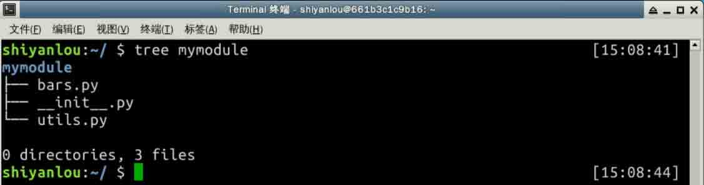
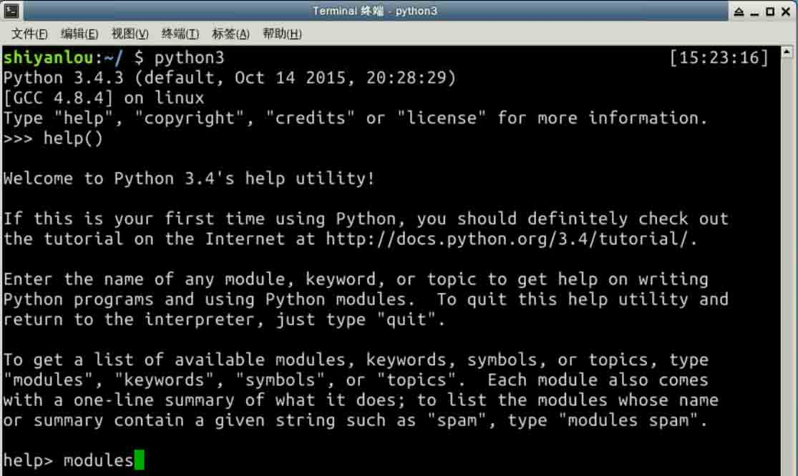
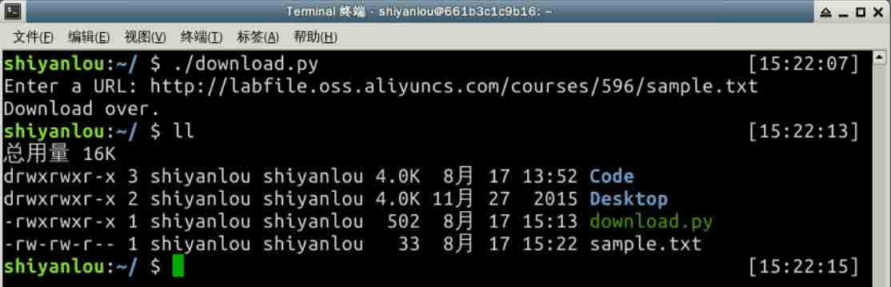
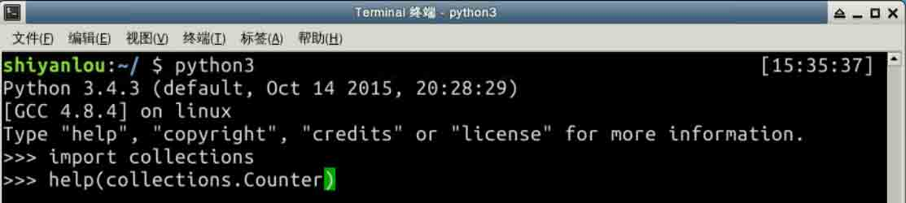
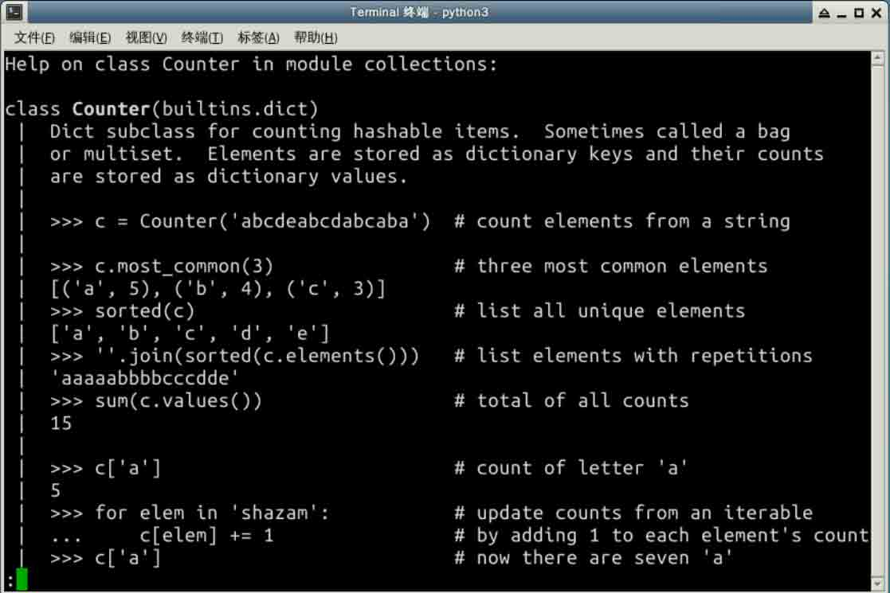

# 第 12 节 模块

在这个实验我们将要学习 Python 模块相关知识。

## 知识点

*   模块的导入
*   包
*   默认/第三方模块介绍
*   命令行参数

## 实验步骤

### 1\. 模块介绍

到目前为止，我们在 Python 解释器中写的所有代码都在我们退出解释器的时候丢失了。但是当人们编写大型程序的时候他们会倾向于将代码分为多个不同的文件以便使用，调试以及拥有更好的可读性。在 Python 中我们使用模块来到达这些目的。模块是包括 Python 定义和声明的文件。文件名就是模块名加上 `.py` 后缀。

你可以由全局变量 `__name__` 得到模块的模块名（一个字符串）。

现在我们来看看模块是怎样工作的。创建一个 `bars.py` 文件。文件内容如下：

```py
"""
Bars Module
============
这是一个打印不同分割线的示例模块
"""
def starbar(num):
    """打印 * 分割线

    :arg num: 线长
    """
    print('*' * num)

def hashbar(num):
    """打印 # 分割线

    :arg num: 线长
    """
    print('#' * num)

def simplebar(num):
    """打印 - 分割线

    :arg num: 线长
    """
    print('-' * num) 
```

现在我们启动解释器然后导入我们的模块。

```py
>>> import bars
>>> 
```

我们必须使用模块名来访问模块内的函数。

```py
>>> bars.hashbar(10)
##########
>>> bars.simplebar(10)
----------
>>> bars.starbar(10)
********** 
```

### 2\. 导入模块

有不同的方式导入模块。我们已经看到过一种了。你甚至可以从模块中导入指定的函数。这样做：

```py
>>> from bars import simplebar, starbar
>>> simplebar(20)
-------------------- 
```

你也可以使用 `from module import *` 导入模块中的所有定义，然而这并不是推荐的做法。

### 3\. 包

含有 `__init__.py` 文件的目录可以用来作为一个包，目录里的所有 `.py` 文件都是这个包的子模块，如下：



在这个例子中，`mymodule` 是一个包名并且 `bars` 和 `utils` 是里面的两个子模块。你可以使用 `touch` 命令创建一个空的 `__init__.py` 文件。

```py
$ touch mymodule/__init__.py 
```

如果 `__init__.py` 文件内有一个名为 `__all__` 的列表，那么只有在列表内列出的名字将会被公开。

因此如果 `mymodule` 内的 `__init__.py` 文件含有以下内容：

```py
from mymodule.bars import simplebar
__all__ = [simplebar, ] 
```

那么导入时将只有 `simplebar` 可用。

`from mymodule import *` 只能工作在模块级别的对象上，试图导入函数或类将导致 syntax error。

[参考资料](https://docs.python.org/3/tutorial/modules.html#packages)

### 4\. 默认模块

现在你安装 Python 的时候会附带安装不同的模块，你可以按需使用它们，也可以为其它特殊用途安装新模块。在下面的几个例子中，我们将要看到同样例子很多。



上面的例子展示了怎样获得你系统中安装的所有模块的列表。在这里就不粘贴它们了，因为这是一个很大的列表。

你也能在解释器里使用 `help()` 函数查找任何模块/类的文档。如果你想要知道字符串所有可用的方法，你可以像下面这样做：

```py
>>> help(str) 
```

#### 4.1\. os 模块

[`os`](http://docs.python.org/3/library/os.html#module-os) 模块提供了与操作系统相关的功能。你可以使用如下语句导入它：

```py
>>> import os 
```

`getuid()` 函数返回当前进程的有效用户 id。

```py
>>> os.getuid()
500 
```

`getpid()` 函数返回当前进程的 id。`getppid()` 返回父进程的 id。

```py
>>> os.getpid()
16150
>>> os.getppid()
14847 
```

`uname()` 函数返回识别操作系统的不同信息，在 Linux 中它返回的详细信息可以从 `uname -a` 命令得到。`uname()` 返回的对象是一个元组，`（sysname, nodename, release, version, machine）`。

```py
>>> os.uname()
('Linux', 'd80', '2.6.34.7-56.fc13.i686.PAE', '#1 SMP Wed Sep 15 03:27:15 UTC 2010', 'i686') 
```

getcwd() 函数返回当前工作目录。`chdir(path)` 则是更改当前目录到 path。在例子中我们首先看到当前工作目录是 `/home/shiyanlou`，然后我们更改当前工作目录到 `/Code` 并再一次查看当前工作目录。

```py
>>> os.getcwd()
'/home/shiyanlou'
>>> os.chdir('Code')
>>> os.getcwd()
'/home/shiyanlou/Code' 
```

所以现在让我们使用 os 模块提供的另一个函数来创建一个自己的函数，它将列出给定目录下的所有文件和目录。

```py
def view_dir(path='.'):
    """
    这个函数打印给定目录中的所有文件和目录
    :args path: 指定目录，默认为当前目录
    """
    names = os.listdir(path)
    names.sort()
    for name in names:
        print(name, end =' ')
    print() 
```

使用例子中的 `view_dir()` 函数。

```py
>>> view_dir('/')
.bashrc .dockerenv .profile bin boot dev etc home lib lib64 media mnt opt proc root run sbin srv sys tmp usr var 
```

os 模块还有许多非常有用的函数，你可以在[这里](https://docs.python.org/3/library/os.html)阅读相关内容。

### 5\. Requests 模块

[Requests](http://docs.python-requests.org/zh_CN/latest/) 是一个第三方 Python 模块，其官网的介绍如下：

> Requests 唯一的一个**非转基因**的 Python HTTP 库，人类可以安全享用。 > > **警告**：非专业使用其他 HTTP 库会导致危险的副作用，包括：安全缺陷症、冗余代码症、重新发明轮子症、啃文档症、抑郁、头疼、甚至死亡。

第三方模块并不是默认的模块，意味着你需要安装它，我们使用 `pip3` 安装它。

首先要安装 `pip3`：

```py
$ sudo apt-get update
$ sudo apt-get install python3-pip 
```

然后用 `pip3` 安装 `requests`

```py
$ sudo pip3 install requests 
```

上面的命令会在你的系统中安装 Python3 版本的 Requests 模块。

#### 5.1\. 获得一个简单的网页

你可以使用 `get()` 方法获取任意一个网页。

```py
>>> import requests
>>> req = requests.get('http://www.baidu.com')
>>> req.status_code
200 
```

`req` 的 `text` 属性存有服务器返回的 HTML 网页，由于 HTML 文本太长就不在这里贴出来了。

使用这个知识，让我们写一个能够从指定的 URL 中下载文件的程序。

```py
#!/usr/bin/env python3
import os
import os.path
import requests

def download(url):
    '''从指定的 URL 中下载文件并存储到当前目录

    :arg url: 要下载的文件的 URL
    '''
    req = requests.get(url)
    # 首先我们检查是否存在文件
    if req.status_code == 404:
        print('No such file found at %s' % url)
        return
    filename = url.split('/')[-1]
    with open(filename, 'wb') as fobj:
        fobj.write(req.content)
    print("Download over.")

if __name__ == '__main__':
    url = input('Enter a URL: ')
    download(url) 
```

测试一下程序：



可以看到目录下已经多了一个 sample.txt 文件。

你可能已经注意到了 `if __name__ == '__main__':` 这条语句，它的作用是，只有在当前模块名为 `__main__` 的时候（即作为脚本执行的时候）才会执行此 `if` 块内的语句。换句话说，当此文件以模块的形式导入到其它文件中时，`if` 块内的语句并不会执行。

你可以将上面的程序修改的更友好写。举个例子，你可以检查当前目录是否已存在相同的文件名。[os.path](http://docs.python.org/3/library/os.path.html#module-os.path) 模块可以帮助你完成这个。

### 6\. 命令行参数

你还记得 `ls` 命令吗，你可以传递不同的选项作为命令行参数。你也可以在你的程序里通过 `argparse` 模块做到这点，阅读这篇 [文档](https://docs.python.org/3/howto/argparse.html) 学习。

### 7\. TAB 补全

首先创建一个文件：`~/.pythonrc` ，文件内写入如下内容：

```py
import rlcompleter, readline
readline.parse_and_bind('tab: complete')

history_file = os.path.expanduser('~/.python_history')
readline.read_history_file(history_file)

import atexit
atexit.register(readline.write_history_file, history_file) 
```

下一步在 `~/.bashrc` 文件中设置 PYTHONSTARTUP 环境变量指向这个文件：

```py
$ export PYTHONSTARTUP=~/.pythonrc 
```

现在，从今以后每当你打开 bash shell，你将会有 TAB 补全和 Python 解释器中代码输入的历史记录。

要在当前 shell 中使用，source 这个 bashrc 文件。

```py
$ source ~/.bashrc 
```

## 总结

本实验了解了什么是模块，模块怎样导入，举例了 os 和 Requests 模块的使用。Python 吸引人的一点是其有众多的模块可以使用，对于自带模块，可以看看 Python3 的[官方文档](https://docs.python.org/3/library/index.html)，对于第三方模块，可以在 [PyPI](https://pypi.python.org/pypi) 上找找。很多时候你都能找到合适的包帮你优雅的完成部分工作。比如 `argparse` 模块帮你非常容易的编写用户友好的命令行接口。

## Collections 模块

## 知识点

*   Counter 类
*   defaultdict 类
*   namedtuple 类

在这个实验我们会学习 `Collections` 模块。这个模块实现了一些很好的数据结构，它们能帮助你解决各种实际问题。

```py
>>> import collections 
```

这是如何导入这个模块，现在我们来看看其中的一些类。

### 1\. Counter

`Counter` 是一个有助于 *hashable* 对象计数的 dict 子类。它是一个无序的集合，其中 *hashable* 对象的元素存储为字典的键，它们的计数存储为字典的值，计数可以为任意整数，包括零和负数。

我们可以这样查看 `Counter` 的帮助信息，事实上这些信息来源于 Counter 的文档字符串（`collections.Counter.__doc__`）。





下面我们来看一个例子，例子中我们查看 Python 的 LICENSE 文件中某些单词出现的次数。

#### 1.1\. Counter 示例

```py
>>> from collections import Counter
>>> import re
>>> path = '/usr/lib/python3.4/LICENSE.txt'
>>> words = re.findall('\w+', open(path).read().lower())
>>> Counter(words).most_common(10)
[('the', 80), ('or', 78), ('1', 66), ('of', 61), ('to', 50), ('and', 48), ('python', 46), ('in', 38), ('license', 37), ('any', 37)] 
```

Counter 对象有一个叫做 `elements()` 的方法，其返回的序列中，依照计数重复元素相同次数，元素顺序是无序的。

```py
>>> c = Counter(a=4, b=2, c=0, d=-2)
>>> list(c.elements())
['a', 'a', 'a', 'a', 'b', 'b'] 
```

`most_common()` 方法返回最常见的元素及其计数，顺序为最常见到最少。

```py
>>> Counter('abracadabra').most_common(3)
[('a', 5), ('r', 2), ('b', 2)] 
```

### 2\. defaultdict

`defaultdict` 是内建 `dict` 类的子类，它覆写了一个方法并添加了一个可写的实例变量。其余功能与字典相同。

`defaultdict()` 第一个参数提供了 `default_factory` 属性的初始值，默认值为 `None`，`default_factory` 属性值将作为字典的默认数据类型。所有剩余的参数与字典的构造方法相同，包括关键字参数。

同样的功能使用 `defaultdict` 比使用 `dict.setdefault` 方法快。

**defaultdict 用例**

```py
>>> from collections import defaultdict
>>> s = [('yellow', 1), ('blue', 2), ('yellow', 3), ('blue', 4), ('red', 1)]
>>> d = defaultdict(list)
>>> for k, v in s:
...     d[k].append(v)
...
>>> d.items()
dict_items([('blue', [2, 4]), ('red', [1]), ('yellow', [1, 3])]) 
```

在例子中你可以看到，即使 `defaultdict` 对象不存在某个*键*，它会自动创建一个空列表。

### 3\. namedtuple

命名元组有助于对元组每个位置赋予意义，并且让我们的代码有更好的可读性和自文档性。你可以在任何使用元组地方使用命名元组。在例子中我们会创建一个命名元组以展示为元组每个位置保存信息。

```py
>>> from collections import namedtuple
>>> Point = namedtuple('Point', ['x', 'y'])  # 定义命名元组
>>> p = Point(10, y=20)  # 创建一个对象
>>> p
Point(x=10, y=20)
>>> p.x + p.y
30
>>> p[0] + p[1]  # 像普通元组那样访问元素
30
>>> x, y = p     # 元组拆封
>>> x
10
>>> y
20 
```

## 总结

这个实验我们使用了 Collections 中的一些数据结构，可能你目前并用不上他，但希望你以后需要的时候会想起它们 : -)