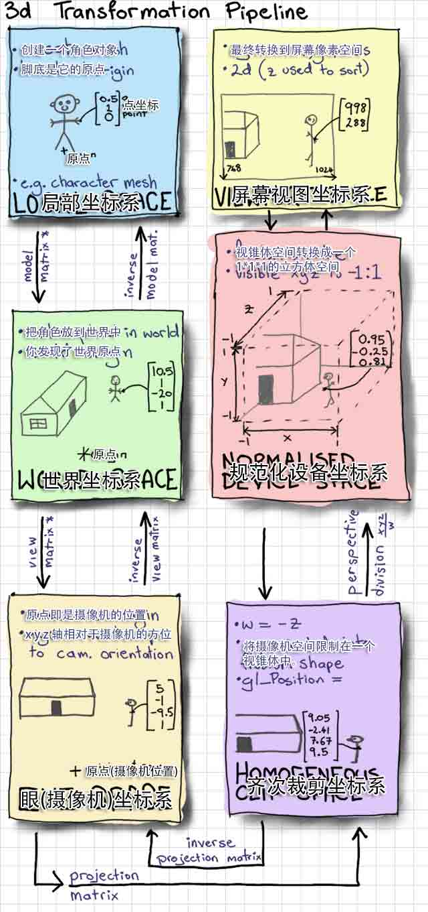
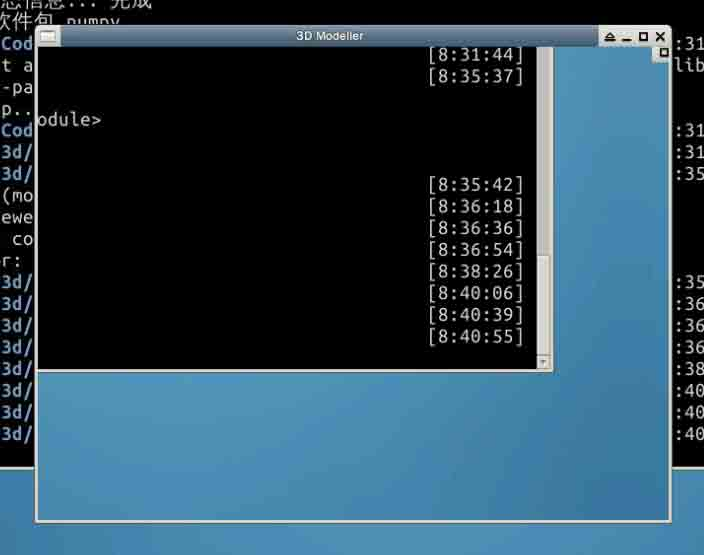
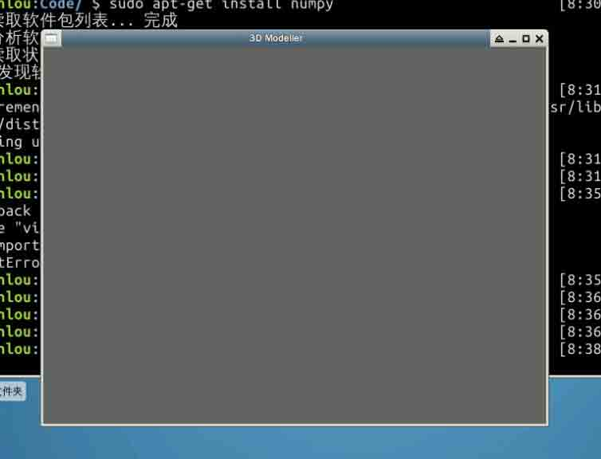
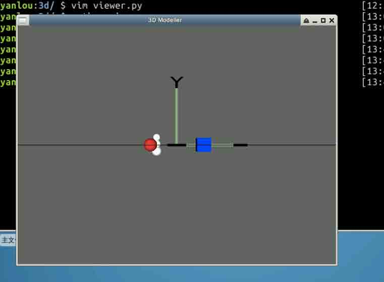

# 第 1 节 Python 实现 3D 建模工具

## 一、课程介绍

### 1\. 课程来源

本课程核心部分来自[《500 lines or less》](http://aosabook.org/en/500L/a-3d-modeller.html)项目，作者是 Erick，Erick 从事电子游戏，3D 特效软件，CAD 软件的开发，这是他的个人网站：erickdransch.com。项目代码使用 MIT 协议，项目文档使用 [`creativecommons.org/licenses/by/3.0/legalcode`](http://creativecommons.org/licenses/by/3.0/legalcode) 协议。

课程内容在原文档基础上做了许多修改，增加了部分原理介绍，步骤的拆解分析及源代码注释。

### 2\. 内容简介

本课程将基于 OpenGL 实现一般 CAD 软件都会具备的基础功能：渲染显示 3D 空间的画面并可以操作 3D 空间中物体。

### 3\. 课程知识点

本课程项目完成过程中，我们将学习：

1.  OpenGL 坐标系的转换
2.  实现简单的用户输入事件回调机制
3.  设计模式中组合模式的使用
4.  基于包围盒的碰撞检测

## 二、实验说明

### 1\. 背景介绍

人类是那么得有创造力，我们创造、发明、设计、生产了一切大自然没有直接给予我们的东西使我们的生活变得更轻松更美好。在过去，我们只能在图纸上进行产品的创造与设计，而现在，有了计算机的帮助，有了 CAD（计算机辅助设计）软件，大大节省了我们的精力与时间成本，使我们的工作更高效，能够拥有更多时间去思考设计本身。

那么 CAD 软件是如何写出来的呢？CAD 软件种类繁多，但它们有一个共同的特点，就是对三维世界的建模，对三维世界中物体的控制，对三维设计的展示。

这，就是本课程要实现的内容了。

### 2\. 实验工具

渲染流程决定了设计是如何呈现在屏幕上的，我们希望程序能为我们处理复杂的物体，同时我们也希望代码的复杂度能够尽可能得低。这些我们该如何做到呢？

在渲染画面之前，我们首先需要新建一个窗口，并且我们不希望直接操作图形驱动来生成画面，所以我们选择跨平台图形接口`OpenGL`与`OpenGL`的工具库`GLUT`来帮助我们管理窗口和渲染画面。

#### 关于 OpenGL

`OpenGL`是开发跨平台图形应用的接口标准，当前的`OpenGL`编程分为两类：现代`OpenGL`与传统`OpenGL`。

传统 OpenGL 采用固定管线的形式。通过对一系列全局变量的赋值，你可以启动或者禁止一些渲染流水线上的工作，比如光照，着色，隐面剔除等，之后自动地根据流水线进行画面渲染，固定管线的编程形式现在已经不推荐使用了。

现代`OpenGL`采用可编程管线的形式，我们只需编写称作`shaders`的小程序运行即可。可编程管线已经替代了固定管线。

但是在本课程中，我们仍然使用传统`OpenGL`，因为固定管线能够减少代码量，并且要求的线性代数知识也更少。

#### 关于 GLUT

在本课程中，`GLUT`负责创建窗口与注册用户接口的回调函数（处理键盘输入、鼠标输入等），如果需要一个功能更全面的窗口管理库，推荐使用`GTK`或者`QT`。

### 3\. 基础知识

#### 变换矩阵

在计算机图形学中，常常需要使用到不同的坐标系，比如世界坐标系、摄像机坐标系、视图坐标系等。坐标系之间的转换需要用到变换矩阵。我们可以不理会矩阵的细节，而将其看作一个函数，变换前的点的坐标作为函数的参数，通过这个公式： 我们就可以得到坐标系变换后的点的坐标了。虽然说是坐标系变换，其实只要认为坐标系是“固定不动”的，就可以看成是坐标系中的物体在坐标系中变换了。移动、旋转、缩放被称作仿射变换，其对应矩阵就是令物体在坐标系中变换使用的。

#### OpenGL 坐标系的转换

一个 3d 模型映射到屏幕上会经过 5 次空间变换，如下图漫画所示，左上角为起始点：



漫画右半部分的坐标系转换基本可以通过`OpenGL`自带的函数帮助我们处理，从摄像机坐标系到齐次裁减坐标系的矩阵转换由`gluPerspective`函数调用完成，到视图坐标系的矩阵转换由`glViewport`函数调用完成。转换矩阵最终会存在`GL_PROJECTION`中，在本项目中，不需要了解这方面的细节内容。

当然，漫画左半部分的坐标系转换就需要我们自己处理了，从对象坐标系到摄像机坐标系的转换矩阵称作`ModelView`矩阵。我们之后会将其存在`GL_MODELVIEW`中，`ModelView`矩阵的生成会在之后的实验步骤中讲到。

也许你会奇怪为什么有的坐标使用的是三元组有的坐标使用的四元组，三元组还可以理解，四元祖是怎么回事呢？这里我只能简短地说，物体要做平移变换必须使用四元组，四元组的第四个元素决定了该四元组究竟是一个向量还是空间中的一个点，想了解背后的数学知识可以看这篇博文：[OpenGL 学习脚印: 坐标和变换的数学基础(math-coordinates and transformations)](http://blog.csdn.net/wangdingqiaoit/article/details/51394238)

想了解更具体的变换过程可以参考这篇博文：[OpenGL 学习脚印: 坐标变换过程(vertex transformation)](http://blog.csdn.net/wangdingqiaoit/article/details/51594408)

## 三、实验环境

仅需安装`python-opengl`：

```py
sudo apt-get install python-opengl 
```

## 四、实验步骤

### Viewer 类

首先新建文件`viewer.py`，导入项目所需的库与方法：

```py
from OpenGL.GL import glCallList, glClear, glClearColor, glColorMaterial, glCullFace, glDepthFunc, glDisable, glEnable,\
                      glFlush, glGetFloatv, glLightfv, glLoadIdentity, glMatrixMode, glMultMatrixf, glPopMatrix, \
                      glPushMatrix, glTranslated, glViewport, \
                      GL_AMBIENT_AND_DIFFUSE, GL_BACK, GL_CULL_FACE, GL_COLOR_BUFFER_BIT, GL_COLOR_MATERIAL, \
                      GL_DEPTH_BUFFER_BIT, GL_DEPTH_TEST, GL_FRONT_AND_BACK, GL_LESS, GL_LIGHT0, GL_LIGHTING, \
                      GL_MODELVIEW, GL_MODELVIEW_MATRIX, GL_POSITION, GL_PROJECTION, GL_SPOT_DIRECTION
from OpenGL.constants import GLfloat_3, GLfloat_4
from OpenGL.GLU import gluPerspective, gluUnProject
from OpenGL.GLUT import glutCreateWindow, glutDisplayFunc, glutGet, glutInit, glutInitDisplayMode, \
                        glutInitWindowSize, glutMainLoop, \
                        GLUT_SINGLE, GLUT_RGB, GLUT_WINDOW_HEIGHT, GLUT_WINDOW_WIDTH
import numpy
from numpy.linalg import norm, inv 
```

我们将在`viewer.py`中实现`Viewer`类，`Viewer`类控制并管理整个程序的流程，它的`main_loop`方法是我们程序的入口。

`Viewer`的初始代码如下：

```py
class Viewer(object):
    def __init__(self):
        """ Initialize the viewer. """
        #初始化接口，创建窗口并注册渲染函数
        self.init_interface()
        #初始化 opengl 的配置
        self.init_opengl()
        #初始化 3d 场景
        self.init_scene()
        #初始化交互操作相关的代码
        self.init_interaction()

    def init_interface(self):
        """ 初始化窗口并注册渲染函数 """
        glutInit()
        glutInitWindowSize(640, 480)
        glutCreateWindow("3D Modeller")
        glutInitDisplayMode(GLUT_SINGLE | GLUT_RGB)
        #注册窗口渲染函数
        glutDisplayFunc(self.render)

    def init_opengl(self):
        """ 初始化 opengl 的配置 """
        #模型视图矩阵
        self.inverseModelView = numpy.identity(4)
        #模型视图矩阵的逆矩阵
        self.modelView = numpy.identity(4)

        #开启剔除操作效果
        glEnable(GL_CULL_FACE)
        #取消对多边形背面进行渲染的计算（看不到的部分不渲染）
        glCullFace(GL_BACK)
        #开启深度测试
        glEnable(GL_DEPTH_TEST)
        #测试是否被遮挡，被遮挡的物体不予渲染
        glDepthFunc(GL_LESS)
        #启用 0 号光源
        glEnable(GL_LIGHT0)
        #设置光源的位置
        glLightfv(GL_LIGHT0, GL_POSITION, GLfloat_4(0, 0, 1, 0))
        #设置光源的照射方向
        glLightfv(GL_LIGHT0, GL_SPOT_DIRECTION, GLfloat_3(0, 0, -1))
        #设置材质颜色
        glColorMaterial(GL_FRONT_AND_BACK, GL_AMBIENT_AND_DIFFUSE)
        glEnable(GL_COLOR_MATERIAL)
        #设置清屏的颜色
        glClearColor(0.4, 0.4, 0.4, 0.0)

    def init_scene(self):
        #初始化场景，之后实现
        pass

    def init_interaction(self):
        #初始化交互操作相关的代码，之后实现
        pass

    def main_loop(self):
        #程序主循环开始
        glutMainLoop()

    def render(self):
        #程序进入主循环后每一次循环调用的渲染函数
        pass

if __name__ == "__main__":
    viewer = Viewer()
    viewer.main_loop() 
```

这段代码给出了`Viewer`类的整体框架。目前只实现了窗口的创建与 OpenGL 的初始化。运行它，你会看见一个绘制背景的窗口。



因为我们的渲染函数里还什么都没写，显存的缓冲区没有更新，所以显示的是背景的画面，下面进行`render`函数的补完：

```py
def render(self):
    #初始化投影矩阵
    self.init_view()

    #启动光照
    glEnable(GL_LIGHTING)
    #清空颜色缓存与深度缓存
    glClear(GL_COLOR_BUFFER_BIT | GL_DEPTH_BUFFER_BIT)

    #设置模型视图矩阵，目前为止用单位矩阵就行了。
    glMatrixMode(GL_MODELVIEW)
    glPushMatrix()
    glLoadIdentity()

    #渲染场景
    #self.scene.render()

    #每次渲染后复位光照状态
    glDisable(GL_LIGHTING)
    glPopMatrix()
    #把数据刷新到显存上
    glFlush()

def init_view(self):
    """ 初始化投影矩阵 """
    xSize, ySize = glutGet(GLUT_WINDOW_WIDTH), glutGet(GLUT_WINDOW_HEIGHT)
    #得到屏幕宽高比
    aspect_ratio = float(xSize) / float(ySize)

    #设置投影矩阵
    glMatrixMode(GL_PROJECTION)
    glLoadIdentity()

    #设置视口，应与窗口重合
    glViewport(0, 0, xSize, ySize)
    #设置透视，摄像机上下视野幅度 70 度
    #视野范围到距离摄像机 1000 个单位为止。
    gluPerspective(70, aspect_ratio, 0.1, 1000.0)
    #摄像机镜头从原点后退 15 个单位
    glTranslated(0, 0, -15) 
```

渲染函数内涉及到了对场景的渲染，而我们的`viewer`现在还未实现`init_scene`。所以我暂时将那一行注释掉了，再运行看一下效果：



画面变成灰色了，那是因为我们将清屏颜色设置成了灰色，在每一次循环开始时，都会清空一遍颜色缓存，说明我们的`render`函数在正常工作了。

现在请将`self.scene.render()`的注释取消。

`scene`实例在`init_scene`方法中创建的。除了要得到`scene`实例，我们现在还希望在最初的场景中能有些看得见的东西。比如一个球体，它刚好在世界坐标系的正中央。就依照这个思路来实现最初的`init_scene`代码，设计需要的接口。

```py
def init_scene(self):
    #创建一个场景实例
    self.scene = Scene()
    #初始化场景内的对象
    self.create_sample_scene()

def create_sample_scene(self):
    #创建一个球体
    sphere_node = Sphere()
    #设置球体的颜色
    sphere_node.color_index = 2
    #将球体放进场景中，默认在正中央
    self.scene.add_node(sphere_node) 
```

这里的`Sphere`实例可以看作是场景内的一个节点，凡是置入场景之中的对象都应当被看作是场景内的节点。接下来我们就要实现场景类与节点类。

### 场景类

首先实现场景类，在工作目录下新建`scene.py`，初始代码如下：

```py
class Scene(object):

    #放置节点的深度，放置的节点距离摄像机 15 个单位
    PLACE_DEPTH = 15.0

    def __init__(self):
        #场景下的节点队列
        self.node_list = list()

    def add_node(self, node):
        """ 在场景中加入一个新节点 """
        self.node_list.append(node)

    def render(self):
        """ 遍历场景下所有节点并渲染 """
        for node in self.node_list:
            node.render() 
```

目前这么点代码就已经够用了。

### 节点类

场景下的对象皆为节点，因此需要抽象出所有类型的对象的基类：Node 类（节点类）。在工作目录下创建`node.py`文件，导入需要的库：

```py
import random
from OpenGL.GL import glCallList, glColor3f, glMaterialfv, glMultMatrixf, glPopMatrix, glPushMatrix, \
                      GL_EMISSION, GL_FRONT
import numpy 
```

实现节点类的初始代码：

```py
class Node(object):
    def __init__(self):
        #该节点的颜色序号
        self.color_index = random.randint(color.MIN_COLOR, color.MAX_COLOR)
        #该节点的平移矩阵，决定了该节点在场景中的位置
        self.translation_matrix = numpy.identity(4)
        #该节点的缩放矩阵，决定了该节点的大小
        self.scaling_matrix = numpy.identity(4)

    def render(self):
        """ 渲染节点 """
        glPushMatrix()
        #实现平移
        glMultMatrixf(numpy.transpose(self.translation_matrix))
        #实现缩放
        glMultMatrixf(self.scaling_matrix)
        cur_color = color.COLORS[self.color_index]
        #设置颜色
        glColor3f(cur_color[0], cur_color[1], cur_color[2])
        #渲染对象模型
        self.render_self()
        glPopMatrix()

    def render_self(self):
        raise NotImplementedError(
            "The Abstract Node Class doesn't define 'render_self'") 
```

注意到对象的平移与缩放操作都在基类`Node`的`render`方法中完成，当我们实现一个子类时，不需要再实现一遍平移与缩放，只需要专心考虑如何渲染模型本身就可以了，即子类必须实现`render_self`方法。

每一个节点都有自己的颜色属性，我们新建一个`color.py`文件，保存颜色信息。

```py
MAX_COLOR = 9
MIN_COLOR = 0
COLORS = { # RGB Colors
    0:  (1.0, 1.0, 1.0),
    1:  (0.05, 0.05, 0.9),
    2:  (0.05, 0.9, 0.05),
    3:  (0.9, 0.05, 0.05),
    4:  (0.9, 0.9, 0.0),
    5:  (0.1, 0.8, 0.7),
    6:  (0.7, 0.2, 0.7),
    7:  (0.7, 0.7, 0.7),
    8:  (0.4, 0.4, 0.4),
    9:  (0.0, 0.0, 0.0),
} 
```

同时在 `node.py`中引入`color`

```py
import color 
```

接着实现具体的球形类`Sphere`

```py
class Primitive(Node):
    def __init__(self):
        super(Primitive, self).__init__()
        self.call_list = None

    def render_self(self):
        glCallList(self.call_list)

class Sphere(Primitive):
    """ 球形图元 """
    def __init__(self):
        super(Sphere, self).__init__()
        self.call_list = G_OBJ_SPHERE 
```

咦？为什么球形类与节点类之间又多了一个`Primitive`类呢？`primitive`又称作图元，在这里，它是组成模型的基本单元，像是球体，立方体，三角等都属于图元。这些类的共通点在于它们的渲染都可以使用短小的 OpenGL 代码完成，同时对这些元素进行组合就可以组合出复杂的模型来，因此我们抽象出了`Primitive`这个类。

观察`Primitive`的渲染函数，发现它调用了`glCallList`方法，`glCallList`是 OpenGL 中一个使用起来非常便利的函数，正如它的名字，它会按序调用一个函数列表中的一系列函数，我们使用`glNewList(CALL_LIST_NUMBER, GL_COMPILE)`与`glEndList()`来标识一段代码的开始与结束，这段代码作为一个新的函数列表与一个数字关联起来，之后希望执行相同的操作时只需调用`glCallList(关联的数字)`就可以了，这样说也许有些抽象，在这个项目中，我们会这样应用：

```py
#标识代码段的数字
G_OBJ_SPHERE = 2

def make_sphere():
    #代码段的开始
    glNewList(G_OBJ_SPHERE, GL_COMPILE)
    #渲染球体模型
    quad = gluNewQuadric()
    gluSphere(quad, 0.5, 30, 30)
    gluDeleteQuadric(quad)
    #代码段的结束
    glEndList()

make_sphere() 
```

这样每一次只要调用`glCallList(G_OBJ_SPHERE)`就能够生成球形了，是不是很方便呢。

新建一个文件`primtive.py`，将渲染图元的函数列表写入文件中。

```py
from OpenGL.GL import glBegin, glColor3f, glEnd, glEndList, glLineWidth, glNewList, glNormal3f, glVertex3f, \
                      GL_COMPILE, GL_LINES, GL_QUADS
from OpenGL.GLU import gluDeleteQuadric, gluNewQuadric, gluSphere

G_OBJ_SPHERE = 2

def make_sphere():
    """ 创建球形的渲染函数列表 """
    glNewList(G_OBJ_SPHERE, GL_COMPILE)
    quad = gluNewQuadric()
    gluSphere(quad, 0.5, 30, 30)
    gluDeleteQuadric(quad)
    glEndList()

def init_primitives():
    """ 初始化所有的图元渲染函数列表 """
    make_sphere() 
```

将`init_primitives()` 添加到`Viewer`中

```py
from primitive import init_primitives

class Viewer(object):
    def __init__(self):
        self.init_interface()
        self.init_opengl()
        self.init_scene()
        self.init_interaction()
        init_primitives() 
```

在`node.py`中加入

```py
from primitive import G_OBJ_SPHERE 
```

确保`viewer.py`中导入了以下内容：

```py
import color 
from scene import Scene
from primitive import init_primitives
from node import Sphere 
```

运行代码看看：


### 平移与改变大小

设计实现能够平移或者改变节点大小的接口，新建`transformation.py`，实现生成平移矩阵与缩放矩阵的方法：

```py
import numpy

def translation(displacement):
    """ 生成平移矩阵 """
    t = numpy.identity(4)
    t[0, 3] = displacement[0]
    t[1, 3] = displacement[1]
    t[2, 3] = displacement[2]
    return t

def scaling(scale):
    """ 生成缩放矩阵 """
    s = numpy.identity(4)
    s[0, 0] = scale[0]
    s[1, 1] = scale[1]
    s[2, 2] = scale[2]
    s[3, 3] = 1
    return s 
```

在`Node`类中编写相应的平移与缩放的接口：

```py
from transformation import scaling, translation
...

class Node(object)
    ...
    def translate(self, x, y, z):
        self.translation_matrix = numpy.dot(self.translation_matrix, translation([x, y, z]))

    def scale(self, s):
        self.scaling_matrix = numpy.dot(self.scaling_matrix, scaling([s,s,s])) 
```

更新`Viewer`的`create_sample_scene`:

```py
def create_sample_scene(self):
    sphere_node = Sphere()
    sphere_node.color_index = 2
    sphere_node.translate(2,2,0)
    sphere_node.scale(4)
    self.scene.add_node(sphere_node) 
```

运行：


### 组合节点

就像之前说的，复杂的模型能够从简单的图元通过组合得到，组合后的模型也应该作为一个节点来看待。所以引入组合节点。

我们在`node.py`中创建`HierarchicalNode`类，这是一个包含子节点的的节点，它将子节点存储在`child_nodes`中，同时作为`Node`的子类，它也必须实现`render_self`， 它的`render_self`函数就是简单地遍历调用子节点的`render_self`。

```py
class HierarchicalNode(Node):
    def __init__(self):
        super(HierarchicalNode, self).__init__()
        self.child_nodes = []

    def render_self(self):
        for child in self.child_nodes:
            child.render() 
```

为了展示组合的效果，我们以小雪人`SnowFigure`类为例，小雪人是由 3 个不同大小球体组成的模型。

```py
class SnowFigure(HierarchicalNode):
    def __init__(self):
        super(SnowFigure, self).__init__()
        self.child_nodes = [Sphere(), Sphere(), Sphere()]
        self.child_nodes[0].translate(0, -0.6, 0) 
        self.child_nodes[1].translate(0, 0.1, 0)
        self.child_nodes[1].scale(0.8)
        self.child_nodes[2].translate(0, 0.75, 0)
        self.child_nodes[2].scale(0.7)
        for child_node in self.child_nodes:
            child_node.color_index = color.MIN_COLOR 
```

更新`create_sample_scene`：

```py
from node import SnowFigure
...
class Viewer(object):
    def create_sample_scene(self):
        sphere_node = Sphere()
        sphere_node.color_index = 2
        sphere_node.translate(2,2,0)
        sphere_node.scale(4)
        self.scene.add_node(sphere_node)
        #添加小雪人
        hierarchical_node = SnowFigure()
        hierarchical_node.translate(-2, 0, -2)
        hierarchical_node.scale(2)
        self.scene.add_node(hierarchical_node) 
```

运行：


你可能注意到了，这种组合会形成一种树形的的数据结构，叶子节点就是图元节点，每次渲染都会深度遍历这棵树，这就是设计模式中的组合模式了。一言以蔽之，节点的集合仍旧是节点，它们实现相同的接口，组合节点会在接口中遍历所有子节点的接口。


### 至今为止的代码

之前为了便于讲解基础部分，所以只实现了球体，下面给出这节课的完整代码。

`viewer.py`代码：

```py
#-*- coding:utf-8 -*-
from OpenGL.GL import glCallList, glClear, glClearColor, glColorMaterial, glCullFace, glDepthFunc, glDisable, glEnable,\
                      glFlush, glGetFloatv, glLightfv, glLoadIdentity, glMatrixMode, glMultMatrixf, glPopMatrix, \
                      glPushMatrix, glTranslated, glViewport, \
                      GL_AMBIENT_AND_DIFFUSE, GL_BACK, GL_CULL_FACE, GL_COLOR_BUFFER_BIT, GL_COLOR_MATERIAL, \
                      GL_DEPTH_BUFFER_BIT, GL_DEPTH_TEST, GL_FRONT_AND_BACK, GL_LESS, GL_LIGHT0, GL_LIGHTING, \
                      GL_MODELVIEW, GL_MODELVIEW_MATRIX, GL_POSITION, GL_PROJECTION, GL_SPOT_DIRECTION
from OpenGL.constants import GLfloat_3, GLfloat_4
from OpenGL.GLU import gluPerspective, gluUnProject
from OpenGL.GLUT import glutCreateWindow, glutDisplayFunc, glutGet, glutInit, glutInitDisplayMode, \
                        glutInitWindowSize, glutMainLoop, \
                        GLUT_SINGLE, GLUT_RGB, GLUT_WINDOW_HEIGHT, GLUT_WINDOW_WIDTH, glutCloseFunc
import numpy
from numpy.linalg import norm, inv
import random
from OpenGL.GL import glBegin, glColor3f, glEnd, glEndList, glLineWidth, glNewList, glNormal3f, glVertex3f, \
                      GL_COMPILE, GL_LINES, GL_QUADS
from OpenGL.GLU import gluDeleteQuadric, gluNewQuadric, gluSphere

import color 
from scene import Scene
from primitive import init_primitives, G_OBJ_PLANE
from node import Sphere, Cube, SnowFigure

class Viewer(object):
    def __init__(self):
        """ Initialize the viewer. """
        #初始化接口，创建窗口并注册渲染函数
        self.init_interface()
        #初始化 opengl 的配置
        self.init_opengl()
        #初始化 3d 场景
        self.init_scene()
        #初始化交互操作相关的代码
        self.init_interaction()
        init_primitives()

    def init_interface(self):
        """ 初始化窗口并注册渲染函数 """
        glutInit()
        glutInitWindowSize(640, 480)
        glutCreateWindow("3D Modeller")
        glutInitDisplayMode(GLUT_SINGLE | GLUT_RGB)
        #注册窗口渲染函数
        glutDisplayFunc(self.render)

    def init_opengl(self):
        """ 初始化 opengl 的配置 """
        #模型视图矩阵
        self.inverseModelView = numpy.identity(4)
        #模型视图矩阵的逆矩阵
        self.modelView = numpy.identity(4)

        #开启剔除操作效果
        glEnable(GL_CULL_FACE)
        #取消对多边形背面进行渲染的计算（看不到的部分不渲染）
        glCullFace(GL_BACK)
        #开启深度测试
        glEnable(GL_DEPTH_TEST)
        #测试是否被遮挡，被遮挡的物体不予渲染
        glDepthFunc(GL_LESS)
        #启用 0 号光源
        glEnable(GL_LIGHT0)
        #设置光源的位置
        glLightfv(GL_LIGHT0, GL_POSITION, GLfloat_4(0, 0, 1, 0))
        #设置光源的照射方向
        glLightfv(GL_LIGHT0, GL_SPOT_DIRECTION, GLfloat_3(0, 0, -1))
        #设置材质颜色
        glColorMaterial(GL_FRONT_AND_BACK, GL_AMBIENT_AND_DIFFUSE)
        glEnable(GL_COLOR_MATERIAL)
        #设置清屏的颜色
        glClearColor(0.4, 0.4, 0.4, 0.0)

    def init_scene(self):
        #创建一个场景实例
        self.scene = Scene()
        #初始化场景内的对象
        self.create_sample_scene()

    def create_sample_scene(self):
        cube_node = Cube()
        cube_node.translate(2, 0, 2)
        cube_node.color_index = 1
        self.scene.add_node(cube_node)

        sphere_node = Sphere()
        sphere_node.translate(-2, 0, 2)
        sphere_node.color_index = 3
        self.scene.add_node(sphere_node)

        hierarchical_node = SnowFigure()
        hierarchical_node.translate(-2, 0, -2)
        self.scene.add_node(hierarchical_node)

    def init_interaction(self):
        #初始化交互操作相关的代码，之后实现
        pass

    def main_loop(self):
        #程序主循环开始
        glutMainLoop()

    def render(self):
        #初始化投影矩阵
        self.init_view()

        #启动光照
        glEnable(GL_LIGHTING)
        #清空颜色缓存与深度缓存
        glClear(GL_COLOR_BUFFER_BIT | GL_DEPTH_BUFFER_BIT)

        #设置模型视图矩阵，这节课先用单位矩阵就行了。
        glMatrixMode(GL_MODELVIEW)
        glPushMatrix()
        glLoadIdentity()

        #渲染场景
        self.scene.render()

        #每次渲染后复位光照状态
        glDisable(GL_LIGHTING)
        glCallList(G_OBJ_PLANE)
        glPopMatrix()
        #把数据刷新到显存上
        glFlush()

    def init_view(self):
        """ 初始化投影矩阵 """
        xSize, ySize = glutGet(GLUT_WINDOW_WIDTH), glutGet(GLUT_WINDOW_HEIGHT)
        #得到屏幕宽高比
        aspect_ratio = float(xSize) / float(ySize)

        #设置投影矩阵
        glMatrixMode(GL_PROJECTION)
        glLoadIdentity()

        #设置视口，应与窗口重合
        glViewport(0, 0, xSize, ySize)
        #设置透视，摄像机上下视野幅度 70 度
        #视野范围到距离摄像机 1000 个单位为止。
        gluPerspective(70, aspect_ratio, 0.1, 1000.0)
        #摄像机镜头从原点后退 15 个单位
        glTranslated(0, 0, -15)

if __name__ == "__main__":
    viewer = Viewer()
    viewer.main_loop() 
```

`scene.py`代码：

```py
#-*- coding:utf-8 -*-
class Scene(object):

    #放置节点的深度，放置的节点距离摄像机 15 个单位
    PLACE_DEPTH = 15.0

    def __init__(self):
        #场景下的节点队列
        self.node_list = list()

    def add_node(self, node):
        """ 在场景中加入一个新节点 """
        self.node_list.append(node)

    def render(self):
        """ 遍历场景下所有节点并渲染 """
        for node in self.node_list:
            node.render() 
```

`node.py`代码：

```py
#-*- coding:utf-8 -*-
import random
from OpenGL.GL import glCallList, glColor3f, glMaterialfv, glMultMatrixf, glPopMatrix, glPushMatrix, \
                      GL_EMISSION, GL_FRONT
import numpy

from primitive import G_OBJ_CUBE, G_OBJ_SPHERE
from transformation import scaling, translation
import color

class Node(object):
    def __init__(self):
        #该节点的颜色序号
        self.color_index = random.randint(color.MIN_COLOR, color.MAX_COLOR)
        #该节点的平移矩阵，决定了该节点在场景中的位置
        self.translation_matrix = numpy.identity(4)
        #该节点的缩放矩阵，决定了该节点的大小
        self.scaling_matrix = numpy.identity(4)

    def render(self):
        """ 渲染节点 """
        glPushMatrix()
        #实现平移
        glMultMatrixf(numpy.transpose(self.translation_matrix))
        #实现缩放
        glMultMatrixf(self.scaling_matrix)
        cur_color = color.COLORS[self.color_index]
        #设置颜色
        glColor3f(cur_color[0], cur_color[1], cur_color[2])
        #渲染对象模型
        self.render_self()
        glPopMatrix()

    def render_self(self):
        raise NotImplementedError(
            "The Abstract Node Class doesn't define 'render_self'")

    def translate(self, x, y, z):
        self.translation_matrix = numpy.dot(self.translation_matrix, translation([x, y, z]))

    def scale(self, s):
        self.scaling_matrix = numpy.dot(self.scaling_matrix, scaling([s,s,s]))

class Primitive(Node):
    def __init__(self):
        super(Primitive, self).__init__()
        self.call_list = None

    def render_self(self):
        glCallList(self.call_list)

class Sphere(Primitive):
    """ 球形图元 """
    def __init__(self):
        super(Sphere, self).__init__()
        self.call_list = G_OBJ_SPHERE

class Cube(Primitive):
    """ 立方体图元 """
    def __init__(self):
        super(Cube, self).__init__()
        self.call_list = G_OBJ_CUBE

class HierarchicalNode(Node):
    def __init__(self):
        super(HierarchicalNode, self).__init__()
        self.child_nodes = []

    def render_self(self):
        for child in self.child_nodes:
            child.render()

class SnowFigure(HierarchicalNode):
    def __init__(self):
        super(SnowFigure, self).__init__()
        self.child_nodes = [Sphere(), Sphere(), Sphere()]
        self.child_nodes[0].translate(0, -0.6, 0) 
        self.child_nodes[1].translate(0, 0.1, 0)
        self.child_nodes[1].scale(0.8)
        self.child_nodes[2].translate(0, 0.75, 0)
        self.child_nodes[2].scale(0.7)
        for child_node in self.child_nodes:
            child_node.color_index = color.MIN_COLOR 
```

`primitive.py`代码：

```py
from OpenGL.GL import glBegin, glColor3f, glEnd, glEndList, glLineWidth, glNewList, glNormal3f, glVertex3f, \
                      GL_COMPILE, GL_LINES, GL_QUADS
from OpenGL.GLU import gluDeleteQuadric, gluNewQuadric, gluSphere

G_OBJ_PLANE = 1
G_OBJ_SPHERE = 2
G_OBJ_CUBE = 3

def make_plane():
    glNewList(G_OBJ_PLANE, GL_COMPILE)
    glBegin(GL_LINES)
    glColor3f(0, 0, 0)
    for i in xrange(41):
        glVertex3f(-10.0 + 0.5 * i, 0, -10)
        glVertex3f(-10.0 + 0.5 * i, 0, 10)
        glVertex3f(-10.0, 0, -10 + 0.5 * i)
        glVertex3f(10.0, 0, -10 + 0.5 * i)

    # Axes
    glEnd()
    glLineWidth(5)

    glBegin(GL_LINES)
    glColor3f(0.5, 0.7, 0.5)
    glVertex3f(0.0, 0.0, 0.0)
    glVertex3f(5, 0.0, 0.0)
    glEnd()

    glBegin(GL_LINES)
    glColor3f(0.5, 0.7, 0.5)
    glVertex3f(0.0, 0.0, 0.0)
    glVertex3f(0.0, 5, 0.0)
    glEnd()

    glBegin(GL_LINES)
    glColor3f(0.5, 0.7, 0.5)
    glVertex3f(0.0, 0.0, 0.0)
    glVertex3f(0.0, 0.0, 5)
    glEnd()

    # Draw the Y.
    glBegin(GL_LINES)
    glColor3f(0.0, 0.0, 0.0)
    glVertex3f(0.0, 5.0, 0.0)
    glVertex3f(0.0, 5.5, 0.0)
    glVertex3f(0.0, 5.5, 0.0)
    glVertex3f(-0.5, 6.0, 0.0)
    glVertex3f(0.0, 5.5, 0.0)
    glVertex3f(0.5, 6.0, 0.0)

    # Draw the Z.
    glVertex3f(-0.5, 0.0, 5.0)
    glVertex3f(0.5, 0.0, 5.0)
    glVertex3f(0.5, 0.0, 5.0)
    glVertex3f(-0.5, 0.0, 6.0)
    glVertex3f(-0.5, 0.0, 6.0)
    glVertex3f(0.5, 0.0, 6.0)

    # Draw the X.
    glVertex3f(5.0, 0.0, 0.5)
    glVertex3f(6.0, 0.0, -0.5)
    glVertex3f(5.0, 0.0, -0.5)
    glVertex3f(6.0, 0.0, 0.5)

    glEnd()
    glLineWidth(1)
    glEndList()

def make_sphere():
    glNewList(G_OBJ_SPHERE, GL_COMPILE)
    quad = gluNewQuadric()
    gluSphere(quad, 0.5, 30, 30)
    gluDeleteQuadric(quad)
    glEndList()

def make_cube():
    glNewList(G_OBJ_CUBE, GL_COMPILE)
    vertices = [((-0.5, -0.5, -0.5), (-0.5, -0.5, 0.5), (-0.5, 0.5, 0.5), (-0.5, 0.5, -0.5)),
                ((-0.5, -0.5, -0.5), (-0.5, 0.5, -0.5), (0.5, 0.5, -0.5), (0.5, -0.5, -0.5)),
                ((0.5, -0.5, -0.5), (0.5, 0.5, -0.5), (0.5, 0.5, 0.5), (0.5, -0.5, 0.5)),
                ((-0.5, -0.5, 0.5), (0.5, -0.5, 0.5), (0.5, 0.5, 0.5), (-0.5, 0.5, 0.5)),
                ((-0.5, -0.5, 0.5), (-0.5, -0.5, -0.5), (0.5, -0.5, -0.5), (0.5, -0.5, 0.5)),
                ((-0.5, 0.5, -0.5), (-0.5, 0.5, 0.5), (0.5, 0.5, 0.5), (0.5, 0.5, -0.5))]
    normals = [(-1.0, 0.0, 0.0), (0.0, 0.0, -1.0), (1.0, 0.0, 0.0), (0.0, 0.0, 1.0), (0.0, -1.0, 0.0), (0.0, 1.0, 0.0)]

    glBegin(GL_QUADS)
    for i in xrange(6):
        glNormal3f(normals[i][0], normals[i][1], normals[i][2])
        for j in xrange(4):
            glVertex3f(vertices[i][j][0], vertices[i][j][1], vertices[i][j][2])
    glEnd()
    glEndList()

def init_primitives():
    make_plane()
    make_sphere()
    make_cube() 
```

`transformation.py`代码：

```py
import numpy

def translation(displacement):
    t = numpy.identity(4)
    t[0, 3] = displacement[0]
    t[1, 3] = displacement[1]
    t[2, 3] = displacement[2]
    return t

def scaling(scale):
    s = numpy.identity(4)
    s[0, 0] = scale[0]
    s[1, 1] = scale[1]
    s[2, 2] = scale[2]
    s[3, 3] = 1
    return s 
```

`color.py`代码：

```py
MAX_COLOR = 9
MIN_COLOR = 0
COLORS = { # RGB Colors
    0:  (1.0, 1.0, 1.0),
    1:  (0.05, 0.05, 0.9),
    2:  (0.05, 0.9, 0.05),
    3:  (0.9, 0.05, 0.05),
    4:  (0.9, 0.9, 0.0),
    5:  (0.1, 0.8, 0.7),
    6:  (0.7, 0.2, 0.7),
    7:  (0.7, 0.7, 0.7),
    8:  (0.4, 0.4, 0.4),
    9:  (0.0, 0.0, 0.0),
} 
```

代码效果：



在本节课的完整版代码中，追加了立方体类节点与坐标平面图，但由于没有设置 ModelView，所以这个角度看不清坐标平面图，在下节课引入轨迹球后就能够全方位的观察这个世界啦。下节课见～