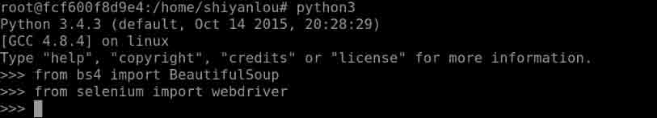

# 第 1 节 Python3 实现淘女郎照片爬虫

## 一、实验说明

### 1.1 实验介绍

本项目通过使用 Python 实现一个淘女郎图片收集爬虫，学习并实践 BeautifulSoup、Selenium Webdriver 及正则表达式等知识。在项目开发过程中采用瀑布流开发模型。

### 1.2 知识点

本项目中将会学习并实践以下知识点：

1.  Python3 编程
2.  使用 BeautifulSoup 解析 HTML 页面
3.  使用 Selenium Webdriver 爬取 Web 页面
4.  使用正则表达式提取所需的关键信息

### 1.3 实验效果

首先我们要爬取的目标页面如下：


爬取后的目录结构如下：


每个目录中都有一系列的图片：


## 二、基础工具

本节主要介绍和安装项目中将用到的几个基础工具。本实验使用实验楼的环境开发，中间部分步骤在不同版本的 Linux 环境下会有不同。

### 2.1 安装 pip3

首先，由于使用的工具都需要通过 pip3 进行安装，实验楼的环境中没有安装 pip3，所以需要先将 pip3 准备好。

打开桌面上的 Xfce 终端，输入下面的命令安装 pip3：

```py
sudo apt-get update
sudo apt-get install python3-pip 
```

### 2.2 安装 BeatifulSoup

#### 简介

`BeautifulSoup` 库的名字取自刘易斯·卡罗尔在《爱丽丝梦游仙境》里的同名歌词。就像故事中他在仙境中的说法一样，`BeautifulSoup` 试图化平淡为神奇。它通过定位 `HTML` 标签来去格式化和组织复杂的网络信息，用简单易用的 `Python` 对象为我们展现 XML 结构信息。

#### 安装

由于这次实验是在 `python3.X` 版本以上的所以，将拓展库安装到特定的库中使用 `pip3`，从而安装到 `python3` 的系统目录中，仍然是在实验楼中的 Xfce 终端执行命令：

```py
sudo pip3 install Beautifulsoup4 
```

`BeautifulSoup4` 是现今的最新版本，也是接下来重点使用的工具。

### 2.3 Selenium

#### 简介

[Selenium](http://www.seleniumhq.org/) 是一个强大的网络数据采集工具，最初是为网站自动化测试而开发的。近几年，他还被广泛用于获取精确的网站快照，因为他们可以直接运行在浏览器上。`Selenium` 可以让浏览器自动加载页面，获取需要的数据，甚至页面截屏，或者判断网站上某些动作上是否发生。

`Selenium` 自己不带浏览器，它需要与第三方浏览器结合在一起使用。例如，可以在实验楼桌面上的 `Firefox` 浏览器上运行 `Selenium`，可以直接看到一个 `FireFox` 窗口被打开，进入网站，然后执行你在代码中设置的动作。虽然使用 `Firefox` 浏览器看起来更清楚，但在本实验中我们采用 [PhantomJS](http://phantomjs.org/download.html)来代替真实的浏览器结合使用。

#### 安装

可以通过 [PyPI 网站](http://pypi.python.org/simple/selenium) 下载 Selenium 库，也可以通过第三方管理器（像 `pip3` ）用命令行下载安装：

```py
sudo pip3 install selenium 
```

测试是否都安装成功：



### 2.4 PhantomJS

#### 简介

一个 `无头` 的浏览器，`PhantomJS` 会把网站加载到内存并执行页面上的 `JavaScript`，但是不会向用户展示网页的图形化界面，可以用来处理 `cookie`、`JavaScript` 及 `header` 信息，以及任何你需要浏览器协助完成的事情。

#### 安装

`PhantomJS` 也可以从他的 [官方网站](http://phantomjs.org/download.html/)下载。因为 `PhantomJS` 是一个功能完善的浏览器，并非一个 `Python` 库，所以他不需要像 `Python` 的其他库一样安装，也不能用 `pip` 安装。

实验楼的环境是 Ubuntu，可以通过 `apt-get` 进行安装：

```py
sudo apt-get install phantomjs 
```


### 2.5 Ajax 信息加载

现在有很多页面都是采用 Ajax 加载数据，我们即将实验的目标网址也是这样的，例如：

*   [淘女郎](https://mm.taobao.com/search_tstar_model.htm?)：https://mm.taobao.com/search*tstar*model.htm?

如果我们用传统的方法采集这个页面，只能获取加载前的页面，而我们真正需要的信息（ Ajax 执行之后的页面）却抓不到，后续实验中可以看到效果的区别。

## 三、项目实现

### 3.1 本节目标

本节实验中我们将分别按照如下步骤：

1.  抓取淘宝 MM 的姓名，头像，年龄、所在城市等信息
2.  抓取每一个 MM 的资料以及写真图片
3.  把每一个 MM 的写真图片按照文件夹保存到本地

### 3.2 可行性分析

淘女郎首页上的源码信息是公开的，本次实验仅仅是用来技术实践，并不带盈利性目的，也不将图片用于其他商业环境，并不会产生商业上的产权纠纷，所以这个项目是可行的。

### 3.3 程序结构


### 3.4 流程说明

1.  通过 `Selenium Webdriver` 获得目标页面源码，之后通过 `BeautifulSoup` 解析概源码，通过正则表达式提取出模特名字、所在城市、身高、体重，个人主页、封面图片地址等信息，根据模特名字和城市建立文件夹。
2.  再次通过 `Selenium Webdriver` 获得模特个人主页的页面源码，之后通过 `BeautifulSoup` 解析源码，通过正则获得页面艺术照的地址信息。
3.  最后通过 `urllib` 内置库，打开图片地址，通过二进制读写的方式获得模特艺术照，并将艺术照存在相应文件夹里面。

### 3.5 获取信息模块实现

#### 获得页面源码

最简单的查看网页源码的方式就是在浏览器中右键选择审查元素，其他类型浏览器也是类似的：


而 Python 代码中的实现则是调用 `Selenium Webdriver` 和 `PhantomJS` 来模拟打开该页面源码，最后使用 `BeautifulSoup` 进行解析：

```py
driver = webdriver.PhantomJS(executable_path='/home/shiyanlou/phantomjs/bin/phantomjs')#浏览器的地址
driver.get("https://mm.taobao.com/search_tstar_model.htm?")#打开目标网页地址
bsObj=BeautifulSoup(driver.page_source,"lxml")#解析 html 语言 
```

这个过程就相当于右键的点击审查的过程。

```py
driver = webdriver.PhantomJS(executable_path='') 
```

这里的意思是实例化一个 `PhantomJS` 浏览器对象，括号里面填的是浏览器的安装路径信息，填在单引号里面。`selenium` 支持的浏览器类型有 `chrome`、`FireFox` 等，具体的自行查看 `webdriver` 的 API。

```py
bsObj=BeautifulSoup(driver.page_source,"lxml") 
```

这里的 `driver.page_source` 意思是网页的全部 HTML 源码，包含的具体内容，可以通过 `printf(driver.page_source)` 打印查看。

#### 获得 MM 个人信息

```py
driver.find_element_by_id('J_GirlsList').text #获得主页上的姓名、所在城市、身高、体重等信息 
```

上面的截图可以发现，整个图片层次是在 `<ul class="girls-list clearfix" id="J_GirlsList">` 里面的通过 `J_GirlsList` 定位到这个层次，之后选择 `text` 就会打印出来整个图片层次上所有非图片信息，这一点仍然可以通过以下命令验证：

```py
print(driver.find_element_by_id('J_GirlsList').text) 
```

#### 获得 MM 个人主页地址


```py
MMsinfoUrl = bsObj.findAll("a",{"href":re.compile("\/\/.*\.htm\?(userId=)\d*")}) #解析出 MM 的个人主页 
```

>BeautifulSoup 的具体内容我这里不会讲深入的，想详细了解的，可以去他们的官网查阅 API，用到的方法稍后会进行分析。

`findAll` 方法可以获得所有的你想通过定位获得的信息，括号里面的内容，可以写上 xml、xPath、正则表达式等语言，来进行精准定位，或者模糊定位，具体选择，看需求

```py
re.compile("\/\/.*\.htm\?(userId=)\d*") 
```

这里双引号里面各种斜杆和反斜杆的符号就是正则表达式，专门用来的做信息配对的，Python 的正则匹配引擎，有很多东西可以研究，大家有兴趣的话可以学习实验楼的[正则表达式](https://www.shiyanlou.com/courses/90)课程。

需要注意的是 `compile()` 方法，使用预编译代码对象要比使用字符串快，因为解释器在执行字符串形式的代码前必须先把它编译成代码对象。在模式匹配之前，正则表达式模式必须先被编译成 `regex` 对象。由于正则表达式在执行过程中，多次用于比较，因此建议通过使用预编译的方式，能有效提高执行性能。

#### 获得 MM 封面图片地址


```py
imagesUrl=bsObj.findAll("img",{"data-ks-lazyload":re.compile(".*\.jpg")}) #解析出 MM 的封面图片 
```

在 chrome 里面是 `` 但是通过 `PhantomJS` 打印出来就变样了，但并不妨碍我们通过 `BeautifulSoup` 进行处理，这个需要特别注意，否则会遇到奇怪的错误。

#### 建立相应文件夹

本部分代码用来创建保存照片的目录结构：

```py
def mkdir(path):
    # 判断路径是否存在
    isExists=os.path.exists(path)
    # 判断结果
    if not isExists:
        # 如果不存在则创建目录
        print ("[*]偷偷新建了名字叫做"+path+"的文件夹")
        # 创建目录操作函数
        os.makedirs(path)
    else:
        # 如果目录存在则不创建，并提示目录已存在
        print ("[+]名为"+path+'的文件夹已经创建成功') 
```

这里是一些基本的文件流操作，判断文件夹是否存在，存在则不创建，不存在就创建文件夹。

这里需要注意的是，要手动新建一个 `photo` 文件夹，不然，下载图片之后会存到整个桌面上。

#### 获得 MM 个人页面源码

这里前面的操作一样的原理，比较简单，可参考代码：

```py
owndriver = webdriver.PhantomJS(executable_path='/home/shiyanlou/phantomjs/bin/phantomjs')
owndriver.get(MMURL)
ownObj = BeautifulSoup(owndriver.page_source,"lxml") 
```

### 3.6 图片存储模块实现

#### 存储封面图片

下面的代码用于存储主页的封面图片：

```py
url = "https:"+str(imageUrl["data-ks-lazyload"])    
html = urlopen(url)
data = html.read()#解析图片的数据信息
fileName = '/home/shiyanlou/photo/mm'+str(number)+'.jpg'
fph = open(fileName,"wb")#通过二进制打开，存图片的一个途径之一
print("[+]Loadinging MM........... "+fileName)
fph.write(data)#将图片写进文件中
fph.close()
fph.flush() 
```

这里涉及几个基本的文件流操作：`open()`,`write()`,`close()` 其中介绍一下 `flush()`，这个是用来清空系统内存的，如果不这么做的话，系统则会在程序结束时才将内存清空，当数据量的太大时，会极大的降低程序的运行效率，甚至会导致系统崩溃。顺便说一句，实验楼提供的环境内存并不是特别大，需要在程序中注意内存使用率。

#### 存储个人艺术照

下面的代码用来存储个人艺术照片：

```py
ImgPath = "https:"+str(perMMimg["src"])#处理成标准的超文本访问信息
html = urlopen(ImgPath)
data = html.read()
fileName = MMpath+"/"+str(number)+'.jpg'
fp = open(fileName,'wb')
print("[+]Loading.......her photo as"+fileName)
fp.write(data) 
```

`ImgPath = "https:"+str(perMMimg["src"])` 这么做的原因是：我们获得的网址信息是不完整的，我们需要手动补充完整。

## 四、组装及调试

### 4.1 调试之前

前面已经所有模块拆分并解释得很详细，现在应该是从全局的角度审视这个项目，然后增加一些异常处理、存储操作，以增加软件运行的健壮性。

首先，我们需要增加相应的中间信息的存储。

#### 通过 txt 文档处理

通过将文本信息存储在 txt 文档里面，可以有效的减少对服务器的压力:

```py
driver = webdriver.PhantomJS(executable_path='/home/tree/phantomjs/bin/phantomjs')
driver.get("https://mm.taobao.com/search_tstar_model.htm?")
bsObj=BeautifulSoup(driver.page_source,"lxml")
fp = open('mm.txt','r+')
fp.write(driver.find_element_by_id('J_GirlsList').text) 
```

#### 存储在列表中

列表具有很棒的存储、查询优势，通过列表可以进行快速的遍历、查询操作。

```py
items = fp.readlines()#基本的文件流操作，按行读取
content1 = []
n = 0
m = 1
while(n<len(items)):#将 MM 的信息都集合在同一个容器中，方便查询操作
    content1.append([items[n].strip('\n'),items[m].strip('\n')])
    n += 3
    m += 3
content2 = []
for MMinfoUrl in MMsinfoUrl:
    content2.append(MMinfoUrl["href"]) 
```


** readlines()读取之后是存在一个列表中，缺点是带着'\n'所以得通过 strip('\n')来删除 **

```py
for MMinfoUrl in MMsinfoUrl:
    content2.append(MMinfoUrl["href"]) 
```


前面获取的 MM 个人页面地址，通过二次处理，精确的提取出地址信息，并存到列表里面 之后通过 `zip()` 语句将两个列表合并在一起，方便接下来的查询操作：

```py
contents = [[a,b] for a,b in zip(content1,content2)] 
```

### 4.2 组装各个模块

#### 新建存储图片的文件夹

读取 contents 列表，根据 MM 的姓名及所在居住地新建文件夹：

```py
i=0
while(i<5):
    print("[*]MM's name:"+contents[i][0][0]+" with "+contents[i][0][1])
    print("[*]saving......"+contents[i][0][0]+"in the folder")
    perMMpageUrl = "http:"+contents[i][1]
    #perMMpageUrl = getperMMpage(perMMpageUrl,)
    path = '/home/shiyanlou/photo/'+contents[i][0][0]
    mkdir(path)#建立相应文件夹
    getperMMpageImg(perMMpageUrl,path)
    i += 1
fp.flush()
fp.close() 
```

这里面循环条件只写 `i<5` 是主要是想保护一下实验楼的服务器带宽，练习为主，否则会非常耗时并且互相影响。

#### 存储个人封面

新建一个 MM 文件夹专门用来存储封面图片：

```py
number = 1
for imageUrl in imagesUrl:#将封面图片存入对应文件夹中
    url = "https:"+str(imageUrl["data-ks-lazyload"])    
    html = urlopen(url)
    data = html.read()
    fileName = '/home/shiyanlou/photo/mm'+str(number)+'.jpg'
    fph = open(fileName,"wb")
    print("[+]Loadinging MM........... "+fileName)
    fph.write(data)
    fph.flush()
    fph.close()
    number += 1
    if number == 5:
        break 
```

这里面循环条件只写`number == 5`是主要是想保护一下实验楼的服务器带宽，练习为主，意思一下就行拉

#### 将个人网页上的图片存储到相应的个人文件夹中

```py
def getperMMpageImg(MMURL,MMpath):
    owndriver = webdriver.PhantomJS(executable_path='/home/shiyanlou/phantomjs/bin/phantomjs')
    owndriver.get(MMURL)
    print("[*]Opening.....MM....................")
    ownObj = BeautifulSoup(owndriver.page_source,"lxml")
    perMMimgs = ownObj.findAll("img",{"src":re.compile(".*\.jpg")})#获得模特个人页面上的艺术照地址
    number = 2#图片计数器
    for perMMimg in perMMimgs:
        ImgPath = "https:"+str(perMMimg["src"])#处理成标准的超文本访问信息
        #print(ImgPath)
        try:
            html = urlopen(ImgPath)
            data = html.read()
            fileName = MMpath+"/"+str(number)+'.jpg'
            fp = open(fileName,'wb')
            print("[+]Loading.......her photo as"+fileName)
            fp.write(data)
            fp.close()
             fp.flush()
            number += 1
            if number == 5:
                break
        except Exception:
            print("[!]Address Error!!!!!!!!!!!!!!!!!!!!!1") 
```

这里需要关注的有两个：

1.正则表达式部分

```py
perMMimgs = ownObj.findAll("img",{"src":re.compile(".*\.jpg")}) 
```


用 `".*\.jpg"` 表示 `src="//img.alicdn.com/imgextra/i2/196332289/TB1p.QQKFXXXXX7aXXXXXXXXXXX_!!0-tstar.jpg` 这句语句。

2.异常处理

在在调试的时候，发现的淘宝库又给我们设施一些障碍，给第一个网页地址就有问题：


会造成爬取过程总是中断，所以打印下信息：


可以发现问题了。


所以我们应该做一下异常处理，使用 `try ... except ...` 异常处理语句。

`try` 里面是执行语句块，当发生 `error` 的时候，就会跳转到 `except` 里面，尽管可以用 `urllib.error.URLError` 代替 `Exception`，我在调试的过程中还发现 `valueErorr` 等报错信息，这里不做更复杂的异常处理，只是简单忽略，知道这里有错误，忽略它，继续进行。

至此，整个项目就完成啦。

## 五、整个项目源码

项目使用的完整代码供参考：

```py
#!/usr/bin/env python3
# coding=utf-8
#__author__='__tree__'
from bs4 import BeautifulSoup
from urllib.request import urlopen
from selenium import webdriver
import os
import threading
import re

def main():
    driver = webdriver.PhantomJS(executable_path='/home/shiyanlou/phantomjs/bin/phantomjs')#浏览器的地址
    driver.get("https://mm.taobao.com/search_tstar_model.htm?")#目标网页地址
    bsObj=BeautifulSoup(driver.page_source,"lxml")#解析 html 语言
    fp = open('mm.txt','r+')#用来将主页上的个人信息存储
    fp.write(driver.find_element_by_id('J_GirlsList').text)#获得主页上的姓名、所在城市、身高、体重等信息
    print("[*]OK GET MM's BOOK")
    MMsinfoUrl = bsObj.findAll("a",{"href":re.compile("\/\/.*\.htm\?(userId=)\d*")})#解析出 MM 的个人主页
    imagesUrl=bsObj.findAll("img",{"data-ks-lazyload":re.compile(".*\.jpg")})#解析出 MM 的封面图片
    #print(MMsinfoUrl)
    items = fp.readlines()
    content1 = []
    n = 0
    m = 1
    while(n<14):#将 MM 的信息都集合在同一个容器中，方便查询操作
        content1.append([items[n].strip('\n'),items[m].strip('\n')])
        n += 3
        m += 3
    #print (content1)
    content2 = []
    for MMinfoUrl in MMsinfoUrl:
        content2.append(MMinfoUrl["href"])
    #print(content2)
    contents = [[a,b] for a,b in zip(content1,content2)]
    #print(contents)
    i=0
    while(i<5):
        print("[*]MM's name:"+contents[i][0][0]+" with "+contents[i][0][1])
        print("[*]saving......"+contents[i][0][0]+"in the folder")
        perMMpageUrl = "http:"+contents[i][1]
        #perMMpageUrl = getperMMpage(perMMpageUrl,)
        path = '/home/shiyanlou/photo/'+contents[i][0][0]
        mkdir(path)#建立相应文件夹
        getperMMpageImg(perMMpageUrl,path)
        i += 1
    fp.flush()
    fp.close()
    number = 1
    for imageUrl in imagesUrl:#将封面图片存入对应文件夹中
        url = "https:"+str(imageUrl["data-ks-lazyload"])    
        html = urlopen(url)
        data = html.read()
        fileName = '/home/shiyanlou/photo/mm'+str(number)+'.jpg'
        fph = open(fileName,"wb")
        print("[+]Loadinging MM........... "+fileName)
        fph.write(data)
        fph.flush()
        fph.close()
        number += 1

    driver.close()

def mkdir(path):
    # 判断路径是否存在
    isExists=os.path.exists(path)
    # 判断结果
    if not isExists:
        # 如果不存在则创建目录
        print ("[*]偷偷新建了名字叫做"+path+"的文件夹")
        # 创建目录操作函数
        os.makedirs(path)
    else:
        # 如果目录存在则不创建，并提示目录已存在
        print ("[+]名为"+path+'的文件夹已经创建成功')

def getperMMpageImg(MMURL,MMpath):
    owndriver = webdriver.PhantomJS(executable_path='/home/shiyanlou/phantomjs/bin/phantomjs')
    owndriver.get(MMURL)
    print("[*]Opening.....MM....................")
    ownObj = BeautifulSoup(owndriver.page_source,"lxml")
    perMMimgs = ownObj.findAll("img",{"src":re.compile(".*\.jpg")})#获得模特个人页面上的艺术照地址
    number = 2#图片计数器
    for perMMimg in perMMimgs:
        ImgPath = "https:"+str(perMMimg["src"])#处理成标准的超文本访问信息
        #print(ImgPath)
        try:
            html = urlopen(ImgPath)
            data = html.read()
            fileName = MMpath+"/"+str(number)+'.jpg'
            fp = open(fileName,'wb')
            print("[+]Loading.......her photo as"+fileName)
            fp.write(data)
            fp.close()
             fp.flush()
            number += 1
        except Exception:
            print("[!]Address Error!!!!!!!!!!!!!!!!!!!!!1")

if __name__ == '__main__':
    main() 
```

最后在调试的时候，可能会获取不到淘宝页面的 `HTML` 源码。很大原因是实验楼的用户人数过多，出口带宽不足，所以多试几次，或者拿到自己电脑本地运行一下。

## 六、总结

这个小项目通过爬取淘女郎的照片来熟悉 `BeautifulSoap`、正则表达式、`Selenium Webdriver`、`Phantomjs`、文件流操作的基础知识，如果有兴趣可以对该程序进行扩展，一些扩展思路供参考：

1.  增强异常处理，使程序爬取的成功率更高，程序更加稳健。
2.  通过机器学习挑选长得好看 MM 照片
3.  增加多线程操作，以增加图片收集效率，但是从应用角度讲，这样会过度消耗服务器资源，这又是一种 DDOS 攻击
4.  继续衍生下去，爬取主页中详细的个人简历。