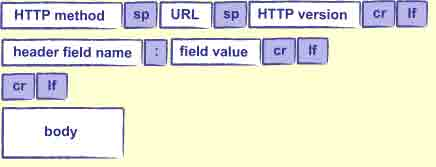
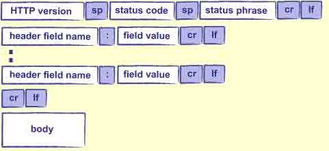
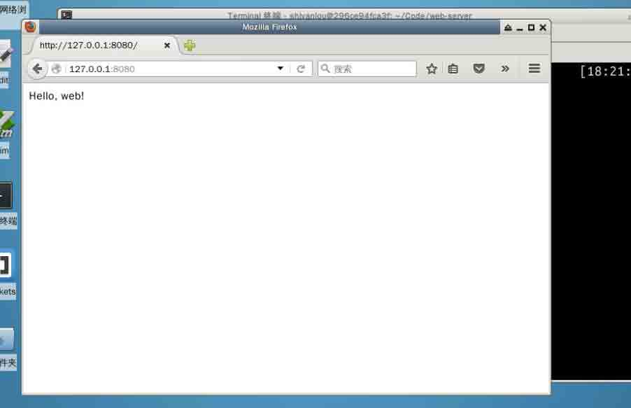
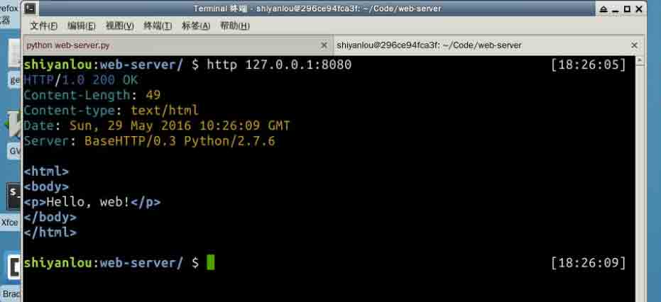
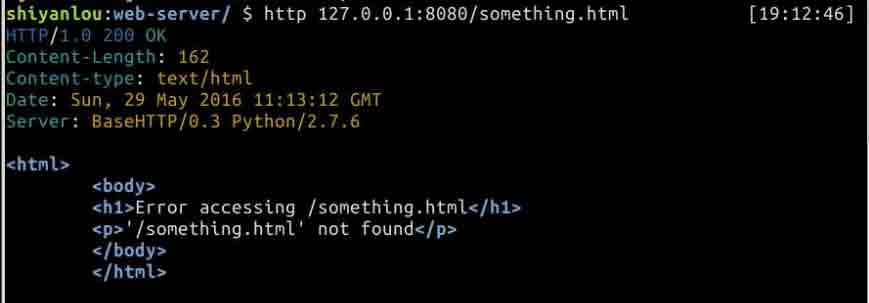
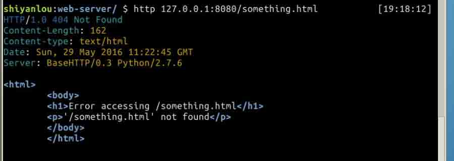

# 第 1 节 Python 实现简单的 Web 服务器

## 一、课程介绍

### 1\. 课程来源

本课程核心部分来自[《500 lines or less》](https://github.com/aosabook/500lines/blob/master/web-server)项目，作者是 Mozilla 的 Greg Wilson。项目代码使用 MIT 协议，项目文档使用 [`creativecommons.org/licenses/by/3.0/legalcode`](http://creativecommons.org/licenses/by/3.0/legalcode) 协议。

课程内容在原文档基础上做了稍许修改，增加了部分原理介绍，步骤的拆解分析及源代码注释。

### 2\. 内容简介

互联网在过去 20 年里已经大大地改变了我们的生活方式，影响着社会。但是反观互联网，它的基础－web 的核心原理并没有改变多少。大部分 web 系统仍旧遵守 Tim Berners-Lee 20 多年前提出的 W3C 标准，大部分 web 服务器接收的信息格式与接收的方式与过去并无二致。

本课程将通过使用 Python 语言实现一个 Web 服务器，探索 HTTP 协议和 Web 服务的基本原理，同时学习 Python 如何实现 Web 服务请求、响应、错误处理及 CGI 协议，最后会根据项目需求使用 Python 面向对象思路对代码进行重构。

### 3\. 课程知识点

本课程项目完成过程中，我们将学习：

1.  HTTP 协议基本原理
2.  简单的 Web 服务器框架
3.  Python 语言的网络开发
4.  Web 服务请求，响应及错误处理的实现
5.  CGI 协议的 Python 实现
6.  使用 Python 面向对象思想重构代码

## 二、实验环境

打开终端，进入 Code 目录，创建 web-server 文件夹, 并将其作为我们的工作目录。

```py
$ cd Code
$ mkdir web-server && cd web-server 
```

本实验使用`httpie`代替浏览器发送请求并在终端打印响应信息。

```py
$ sudo apt-get install httpie 
```

## 三、实验原理

想要了解 http 原理， [Introduction to HTTP](https://launchschool.com/books/http) 是一个不错的选择，也可以参考它的中文翻译版: [HTTP 下午茶](http://www.kancloud.cn/kancloud/tealeaf-http)

这里我们简单过一遍我们需要了解的部分。

一般我们的 web 程序都运行在 TCP/IP 协议上，程序之间使用 socket(套接字) 进行通信，它能够让计算机之间的通信就像写文件和读文件一样简单。 一个 tcp socket 由一个 IP 地址和端口号组成。

*   IP 地址是一个 32 位的二进制数，通常被分割为 4 个“8 位二进制数”,写成 10 进制的形式就是我们常见的 174.136.14.108。我们通过 IP 地址来标识所连接的主机。
*   端口号是一个范围在 0-65535 之间的数字，一台主机上可能同时有多个 sockets，因此需要端口号进行标识。端口号 0-1023 是保留给操作系统使用的，我们可以使用剩下的端口号。

超文本传输协议（HTTP）描述了一种程序之间交换数据的方法，它非常简单易用，在一个 socket 连接上，客户端首先发送请求说明它需要什么，然后服务器发送响应，并在响应中包含客户端的数据。响应数据也许是从本地磁盘上复制来的，也许是程序动态生成的。传输过程如图：


HTTP 请求就是一段文本，任何程序都能生成一个 http 请求，就像生成文本一样简单。这段文本需要包含以下这些部分：



*   HTTP method：HTTP 请求方法。最常用的就是 `GET`(抓取数据)与`POST`(更新数据或者上传文件)

*   URL：通常是客户端请求的文件的路径，比如 /research/experiments.html， 但是是否响应文件都是由服务器决定的。

*   HTTP version：HTTP 版本。通常是 HTTP/1.0 或 HTTP/1.1

*   header field：HTTP 头内的键值对，做一些基本设置，就像下面这样。

    # 客户端接受的数据类型

    Accept: text/html

    # 客户端接受的语言

    Accept-Language: en, fr
    If-Modified-Since: 16-May-2005

*   body： 一些与请求有关的负载数据了。比如在一个网站登陆的时候提交登陆表单，那负载数据就是你的账号与密码信息了。

HTTP 响应的结构类似于请求：



*   status code：状态码。请求成功响应 200，请求的文件找不到则响应 404。
*   status phrase：对状态码的描述。

## 四、实验步骤

### 1.你好, web

现在就来写我们第一个 web 服务器吧， 基本概念非常简单：

1.  等待某个人连接我们的服务器并向我们发送一个 HTTP 请求
2.  解析该请求
3.  了解该请求希望请求的内容
4.  服务器根据请求抓取需要的数据（从服务器本地文件中读或者程序动态生成）
5.  将数据格式化为请求需要的格式
6.  送回 HTTP 响应

步骤 1，2，6 的操作对所有 web 应用都是一样的，这部分内容 Python 标准库中的 `BaseHTTPServer` 模块可以帮助我们处理。我们只需要关注步骤 3～5。

首先在工作目录下创建 `server.py` 文件

```py
#-*- coding:utf-8 -*-
import BaseHTTPServer

class RequestHandler(BaseHTTPServer.BaseHTTPRequestHandler):
    '''处理请求并返回页面'''

    # 页面模板
    Page = '''\
        <html>
        <body>
        <p>Hello, web!</p>
        </body>
        </html>
    '''

    # 处理一个 GET 请求
    def do_GET(self):
        self.send_response(200)
        self.send_header("Content-Type", "text/html")
        self.send_header("Content-Length", str(len(self.Page)))
        self.end_headers()
        self.wfile.write(self.Page)

#----------------------------------------------------------------------

if __name__ == '__main__':
    serverAddress = ('', 8080)
    server = BaseHTTPServer.HTTPServer(serverAddress, RequestHandler)
    server.serve_forever() 
```

模块的 `BaseHTTPRequestHandler` 类会帮我们处理对请求的解析，并通过确定请求的方法来调用其对应的函数，比如方法是 `GET` ,该类就会调用名为 `do_GET` 的方法。`RequestHandler` 继承了 `BaseHTTPRequestHandler` 并重写了 `do_GET` 方法，其效果如代码所示是返回 `Page` 的内容。 `Content-Type` 告诉了客户端要以处理 html 文件的方式处理返回的内容。`end_headers` 方法会插入一个空白行，如之前的 request 结构图所示。

运行我们的第一个 web 服务器

```py
$ python server.py 
```

可以在浏览器地址输入 `127.0.0.1:8080` 进行查看



方便起见，还是让我们新开一个终端窗口，使用`httpie`来查看输出(之后都使用`httpie`来查看输出)

```py
$ http 127.0.0.1:8080 
```



`httpie`很贴心地显示了响应报文的全部内容。

### 2.显示请求的信息

修改之前的代码来显示请求的信息，同时重新整理一下代码：

```py
class RequestHandler(BaseHTTPServer.BaseHTTPRequestHandler):

    # ...页面模板...
    Page＝"..待设计.."

    def do_GET(self):
        page = self.create_page()
        self.send_content(page)

    def create_page(self):
        # ...待实现...

    def send_content(self, page):
        # ...待实现... 
```

`send_content` 与之前 `do_GET` 内的代码一样：

```py
def send_content(self, page):
    self.send_response(200)
    self.send_header("Content-type", "text/html")
    self.send_header("Content-Length", str(len(page)))
    self.end_headers()
    self.wfile.write(page) 
```

设计页面模版

```py
Page = '''\
<html>
<body>
<table>
<tr>  <td>Header</td>         <td>Value</td>          </tr>
<tr>  <td>Date and time</td>  <td>{date_time}</td>    </tr>
<tr>  <td>Client host</td>    <td>{client_host}</td>  </tr>
<tr>  <td>Client port</td>    <td>{client_port}</td> </tr>
<tr>  <td>Command</td>        <td>{command}</td>      </tr>
<tr>  <td>Path</td>           <td>{path}</td>         </tr>
</table>
</body>
</html>
''' 
```

实现`create_page`

```py
def create_page(self):
    values = {
        'date_time'   : self.date_time_string(),
        'client_host' : self.client_address[0],
        'client_port' : self.client_address[1],
        'command'     : self.command,
        'path'        : self.path
    }
    page = self.Page.format(**values)
    return page 
```

main 中的内容不用去修改它。

运行看看

```py
$ http 127.0.0.1:8080/something.html 
```

效果图：


注意到它仍旧返回了 200 OK 而不是 404 Not Found，即使 something.html 文件并不存在。那是因为我们现在的 web 服务器还没有实现找不到文件就返回 404 错误的功能。反过来说，只要我们想，可以通过编程实现任何我们想要的效果，像是随机返回一个维基百科的页面或是帮老王家订一个披萨(并不会)。

怎么解决返回 404 的问题呢，首先得有返回文件的功能吧。

### 3.响应静态页面

所以这一步就该处理静态页面了，处理静态页面就是根据请求的页面名得到磁盘上的页面文件并返回。

在当前目录下创建新文件 plain.html，这是我们测试用的静态页面

```py
<html>
<head>
<title>Plain Page</title>
</head>
<body>
<h1>Plain Page</h1>
<p>Nothin' but HTML.</p>
</body>
</html> 
```

在 `server.py` 中导入需要的库

```py
import sys, os, BaseHTTPServer 
```

为我们的服务器程序写一个异常类

```py
class ServerException(Exception):
    '''服务器内部错误'''
    pass 
```

重写 `do_GET` 函数：

```py
def do_GET(self):
    try:

        # 文件完整路径
        full_path = os.getcwd() + self.path

        # 如果该路径不存在...
        if not os.path.exists(full_path):
            #抛出异常：文件未找到
            raise ServerException("'{0}' not found".format(self.path))

        # 如果该路径是一个文件
        elif os.path.isfile(full_path):
            #调用 handle_file 处理该文件
            self.handle_file(full_path)

        # 如果该路径不是一个文件
        else:
            #抛出异常：该路径为不知名对象
            raise ServerException("Unknown object '{0}'".format(self.path))

    # 处理异常
    except Exception as msg:
        self.handle_error(msg) 
```

首先看完整路径的代码，`os.getcwd()` 是当前的工作目录，`self.path` 保存了请求的相对路径，不要忘了 `RequestHandler` 继承自 `BaseHTTPRequestHandler`，它已经帮我们将请求的相对路径保存在`self.path`中了。

编写文件处理函数：

```py
def handle_file(self, full_path):
    try:
        with open(full_path, 'rb') as reader:
            content = reader.read()
        self.send_content(content)
    except IOError as msg:
        msg = "'{0}' cannot be read: {1}".format(self.path, msg)
        self.handle_error(msg) 
```

注意到我们是以二进制模式打开文件的，这样读文件的时候就不会对读取的内容做多余的处理。

接着，实现我们的错误处理函数并设计错误页面模板

```py
Error_Page = """\
    <html>
    <body>
    <h1>Error accessing {path}</h1>
    <p>{msg}</p>
    </body>
    </html>
    """

def handle_error(self, msg):
    content = self.Error_Page.format(path=self.path, msg=msg)
    self.send_content(content) 
```

运行看看

```py
$ http 127.0.0.1:8080/plain.html 
```

效果图


再测试一下错误的路径

```py
$ http 127.0.0.1:8080/something.html 
```



确实返回了错误页面但同时注意到返回的是 200 状态码，我们希望它能够返回 404，所以还需要修改一下 `handle_error` 与 `send_content` 函数

```py
def handle_error(self, msg):
    content = self.Error_Page.format(path=self.path, msg=msg)
    self.send_content(content, 404)

def send_content(self, content, status=200):
    self.send_response(status)
    self.send_header("Content-type", "text/html")
    self.send_header("Content-Length", str(len(content)))
    self.end_headers()
    self.wfile.write(content) 
```

测试看看

```py
$ http 127.0.0.1:8080/something.html 
```

这回就对了。



至今为止的代码：

```py
#-*- coding:utf-8 -*-
import sys, os, BaseHTTPServer

class ServerException(Exception):
    '''服务器内部错误'''
    pass

class RequestHandler(BaseHTTPServer.BaseHTTPRequestHandler):

    Error_Page = """\
    <html>
    <body>
    <h1>Error accessing {path}</h1>
    <p>{msg}</p>
    </body>
    </html>
    """

    def do_GET(self):
        try:

            # 文件完整路径
            full_path = os.getcwd() + self.path

            # 如果该路径不存在...
            if not os.path.exists(full_path):
                #抛出异常：文件未找到
                raise ServerException("'{0}' not found".format(self.path))

            # 如果该路径是一个文件
            elif os.path.isfile(full_path):
                #调用 handle_file 处理该文件
                self.handle_file(full_path)

            # 如果该路径不是一个文件
            else:
                #抛出异常：该路径为不知名对象
                raise ServerException("Unknown object '{0}'".format(self.path))

        # 处理异常
        except Exception as msg:
            self.handle_error(msg)

    def handle_error(self, msg):
        content = self.Error_Page.format(path=self.path, msg=msg)
        self.send_content(content, 404)

    def send_content(self, content, status=200):
        self.send_response(status)
        self.send_header("Content-type", "text/html")
        self.send_header("Content-Length", str(len(content)))
        self.end_headers()
        self.wfile.write(content)

    def handle_file(self, full_path):
        try:
            with open(full_path, 'rb') as reader:
                content = reader.read()
            self.send_content(content)
        except IOError as msg:
            msg = "'{0}' cannot be read: {1}".format(self.path, msg)
            self.handle_error(msg)

if __name__ == '__main__':
    serverAddress = ('', 8080)
    server = BaseHTTPServer.HTTPServer(serverAddress, RequestHandler)
    server.serve_forever() 
```

## 4\. 在根 url 显示首页内容

大部分时候我们都希望能够直接在`http://127.0.0.1:8080/` 显示主页内容。要怎么做呢，也许我们可以在`do_GET`那冗长的 if-elif-else 判断里再加一个判断请求地址是不是根地址的分支，也许我们可以找到一个更加聪明的方法。

比如说把每一种情况都单独写成一个条件类

```py
class case_no_file(object):
    '''该路径不存在'''

    def test(self, handler):
        return not os.path.exists(handler.full_path)

    def act(self, handler):
        raise ServerException("'{0}' not found".format(handler.path))

class case_existing_file(object):
    '''该路径是文件'''

    def test(self, handler):
        return os.path.isfile(handler.full_path)

    def act(self, handler):
        handler.handle_file(handler.full_path)

class case_always_fail(object):
    '''所有情况都不符合时的默认处理类'''

    def test(self, handler):
        return True

    def act(self, handler):
        raise ServerException("Unknown object '{0}'".format(handler.path)) 
```

`test`方法用来判断是否符合该类指定的条件，`act`则是符合条件时的处理函数。其中的`handler`是对`RequestHandler`实例的引用，通过它，我们就能调用`handle_file`进行响应。

将原先的 if-elif-else 分支替换成遍历所有的条件类来看一下区别。

替换前：

```py
def do_GET(self):
    try:

        # 文件完整路径
        full_path = os.getcwd() + self.path

        # 如果该路径不存在...
        if not os.path.exists(full_path):
            #抛出异常：文件未找到
            raise ServerException("'{0}' not found".format(self.path))

        # 如果该路径是一个文件
        elif os.path.isfile(full_path):
            #调用 handle_file 处理该文件
            self.handle_file(full_path)

        # 如果该路径不是一个文件
        else:
            #抛出异常：该路径为不知名对象
            raise ServerException("Unknown object '{0}'".format(self.path))

    # 处理异常
    except Exception as msg:
        self.handle_error(msg) 
```

替换后：

```py
# 所有可能的情况
Cases = [case_no_file(),
         case_existing_file(),
         case_always_fail()]

def do_GET(self):
    try:

        # 文件完整路径
        full_path = os.getcwd() + self.path

        #遍历所有可能的情况
        for case in self.Cases:
            handler = case()
            #如果满足该类情况
            if handler.test(self):
                #调用相应的 act 函数
                handler.act(self)
                break

    # 处理异常
    except Exception as msg:
        self.handle_error(msg) 
```

这样每当我们需要考虑一个新的情况时，只要新写一个条件处理类然后加到 `Cases` 中去就行了，是不是比原先在 if-elif-else 中添加条件的做法看起来更加干净更加清楚呢，毕竟修改原有的代码是一件很有风险的事情，调试起来也非常麻烦。在做功能扩展的同时尽量不要修改原代码是软件开发过程中需要牢记的一点。

回到正题，我们希望浏览器访问根 url 的时候能返回工作目录下 index.html 的内容，那就需要再多加一个条件判断啦。

写一个新的条件处理类

```py
class case_directory_index_file(object):

    def index_path(self, handler):
        return os.path.join(handler.full_path, 'index.html')

    #判断目标路径是否是目录&&目录下是否有 index.html
    def test(self, handler):
        return os.path.isdir(handler.full_path) and \
               os.path.isfile(self.index_path(handler))

    #响应 index.html 的内容
    def act(self, handler):
        handler.handle_file(self.index_path(handler)) 
```

加到`Cases`中

```py
Cases = [case_no_file(),
         case_existing_file(),
         case_directory_index_file(),
         case_always_fail()] 
```

在工作目录下添加`index.html`文件

```py
<html>
<head>
<title>Index Page</title>
</head>
<body>
<h1>Index Page</h1>
<p>Welcome to my home.</p>
</body>
</html> 
```

测试一下

```py
$ http 127.0.0.1:8080 
```

效果图


### 5.CGI 协议

当然，大部分人都不希望每次给服务器加新功能都要到服务器的源代码里进行修改。如果程序能独立在另一个脚本文件里运行那就再好不过了。[什么是 CGI？](http://www.biaodianfu.com/cgi-fastcgi-wsgi.html) 本小节会实现 CGI 的效果。

接下来的例子中，我们会在 html 页面上显示当地时间。

创建新文件 time.py

```py
from datetime import datetime
print '''\
<html>
<body>
<p>Generated {0}</p>
</body>
</html>'''.format(datetime.now()) 
```

新建一个处理脚本文件的条件类：

```py
class case_cgi_file(object):
    '''脚本文件处理'''

    def test(self, handler):
        return os.path.isfile(handler.full_path) and \
               handler.full_path.endswith('.py')

    def act(self, handler):
        ##运行脚本文件
        handler.run_cgi(handler.full_path) 
```

实现运行脚本文件的函数

```py
import subprocess

def run_cgi(self, full_path):
    data = subprocess.check_output(["python", handler.full_path])
    self.send_content(data) 
```

不要忘了加到`Cases`中去

```py
Cases = [case_no_file(),
         case_cgi_file(),
         case_existing_file(),
         case_directory_index_file(),
         case_always_fail()] 
```

查看效果

```py
$ http 127.0.0.1:8080/time.py 
```


### 6.代码重构

回头看看我们的代码，注意到一个新的问题了吗？虽然条件判断已经被我们整理到几个类中去了，但是像`run_cgi`只有在路径为 py 文件的条件下才使用的函数是放在 `RequestHandler`下的，那以后再加几个新功能，但是这类函数都放到 `RequestHandler`下的话可想而知`RequestHandler` 会变的臃肿不堪。当然你会想这算什么问题嘛，把它放到各自的条件类下不就好了噢。

各自的代码归各自是个好办法，但有时候不同的条件类内可能会有功能相同的函数，这时候我们都知道重复相同的代码是软件开发里很忌讳的一件事情，那么怎么处理重复的代码呢？

可以抽象出一个基类嘛，遇到重复的内容就放在基类的下面，所有的条件类都继承这个基类。

```py
class base_case(object):
    '''条件处理基类'''

    def handle_file(self, handler, full_path):
        try:
            with open(full_path, 'rb') as reader:
                content = reader.read()
            handler.send_content(content)
        except IOError as msg:
            msg = "'{0}' cannot be read: {1}".format(full_path, msg)
            handler.handle_error(msg)

    def index_path(self, handler):
        return os.path.join(handler.full_path, 'index.html')
    #要求子类必须实现该接口
    def test(self, handler):
        assert False, 'Not implemented.'

    def act(self, handler):
        assert False, 'Not implemented.' 
```

子类继承基类，依此类推进行修改

```py
class case_directory_index_file(base_case):

    def test(self, handler):
        return os.path.isdir(handler.full_path) and \
               os.path.isfile(self.index_path(handler))

    def act(self, handler):
        self.handle_file(handler, self.index_path(handler)) 
```

重构后的全部代码

```py
#-*- coding:utf-8 -*-
import sys, os, BaseHTTPServer, subprocess

#-------------------------------------------------------------------------------

class ServerException(Exception):
    '''服务器内部错误'''
    pass

#-------------------------------------------------------------------------------

class base_case(object):
    '''条件处理基类'''

    def handle_file(self, handler, full_path):
        try:
            with open(full_path, 'rb') as reader:
                content = reader.read()
            handler.send_content(content)
        except IOError as msg:
            msg = "'{0}' cannot be read: {1}".format(full_path, msg)
            handler.handle_error(msg)

    def index_path(self, handler):
        return os.path.join(handler.full_path, 'index.html')

    def test(self, handler):
        assert False, 'Not implemented.'

    def act(self, handler):
        assert False, 'Not implemented.'

#-------------------------------------------------------------------------------

class case_no_file(base_case):
    '''文件或目录不存在'''

    def test(self, handler):
        return not os.path.exists(handler.full_path)

    def act(self, handler):
        raise ServerException("'{0}' not found".format(handler.path))

#-------------------------------------------------------------------------------

class case_cgi_file(base_case):
    '''可执行脚本'''

    def run_cgi(self, handler):
        data = subprocess.check_output(["python", handler.full_path])
        handler.send_content(data)

    def test(self, handler):
        return os.path.isfile(handler.full_path) and \
               handler.full_path.endswith('.py')

    def act(self, handler):
        self.run_cgi(handler)

#-------------------------------------------------------------------------------

class case_existing_file(base_case):
    '''文件存在的情况'''

    def test(self, handler):
        return os.path.isfile(handler.full_path)

    def act(self, handler):
        self.handle_file(handler, handler.full_path)

#-------------------------------------------------------------------------------

class case_directory_index_file(base_case):
    '''在根路径下返回主页文件'''

    def test(self, handler):
        return os.path.isdir(handler.full_path) and \
               os.path.isfile(self.index_path(handler))

    def act(self, handler):
        self.handle_file(handler, self.index_path(handler))

#-------------------------------------------------------------------------------

class case_always_fail(base_case):
    '''默认处理'''

    def test(self, handler):
        return True

    def act(self, handler):
        raise ServerException("Unknown object '{0}'".format(handler.path))

#-------------------------------------------------------------------------------

class RequestHandler(BaseHTTPServer.BaseHTTPRequestHandler):
    '''
    请求路径合法则返回相应处理
    否则返回错误页面
    '''

    Cases = [case_no_file(),
             case_cgi_file(),
             case_existing_file(),
             case_directory_index_file(),
             case_always_fail()]

    # 错误页面模板
    Error_Page = """\
        <html>
        <body>
        <h1>Error accessing {path}</h1>
        <p>{msg}</p>
        </body>
        </html>
        """

    def do_GET(self):
        try:

            # 得到完整的请求路径
            self.full_path = os.getcwd() + self.path

            # 遍历所有的情况并处理
            for case in self.Cases:
                if case.test(self):
                    case.act(self)
                    break

        # 处理异常
        except Exception as msg:
            self.handle_error(msg)

    def handle_error(self, msg):
        content = self.Error_Page.format(path=self.path, msg=msg)
        self.send_content(content, 404)

    # 发送数据到客户端
    def send_content(self, content, status=200):
        self.send_response(status)
        self.send_header("Content-type", "text/html")
        self.send_header("Content-Length", str(len(content)))
        self.end_headers()
        self.wfile.write(content)

#-------------------------------------------------------------------------------

if __name__ == '__main__':
    serverAddress = ('', 8080)
    server = BaseHTTPServer.HTTPServer(serverAddress, RequestHandler)
    server.serve_forever() 
```

## 五、讨论

通过重构我们发现，真正实施行为(Action)的代码逻辑可以抽出来进行封装(封装成各种条件处理类)，而 RequestHandler 类 或是 basecase 类 提供了供条件处理类使用的接口，它们可以看作是一系列服务(Service)，在软件设计中我们常常会把业务代码进行分层，将行为与服务分开，降低耦合，更有利于我们开发维护代码。

通过统一接口，以及 cgi 程序，我们的代码功能扩展变的更加容易，可以专心于编写功能代码，而不用去关心其他部分。case 的添加虽然仍在 server 代码中，但我们也可以把它放到配置文件中，由 server 读取配置文件。

我们的 server 现在还是一个在新手村里打史莱姆的小菜鸡，你会给它添加什么功能让它成长成什么样子呢？

## 六、参考资料

*   [A Simple Web Server](http://aosabook.org/en/500L/a-simple-web-server.html)
*   [500 Lines or Less](https://github.com/aosabook/500lines)
*   [Introduction to HTTP](https://launchschool.com/books/http)
*   [HTTP 下午茶](http://www.kancloud.cn/kancloud/tealeaf-http)