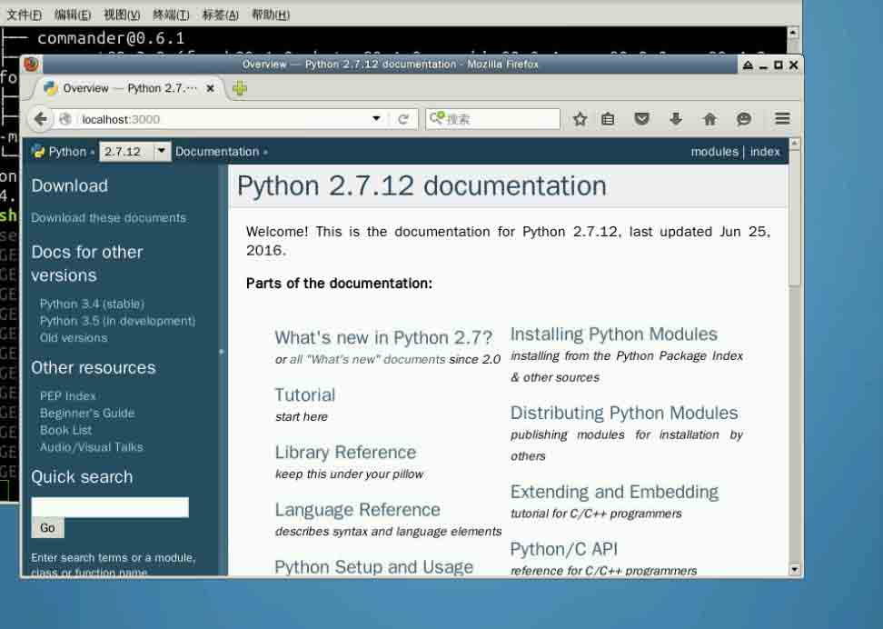
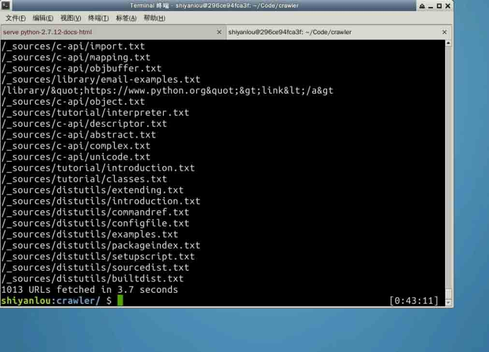
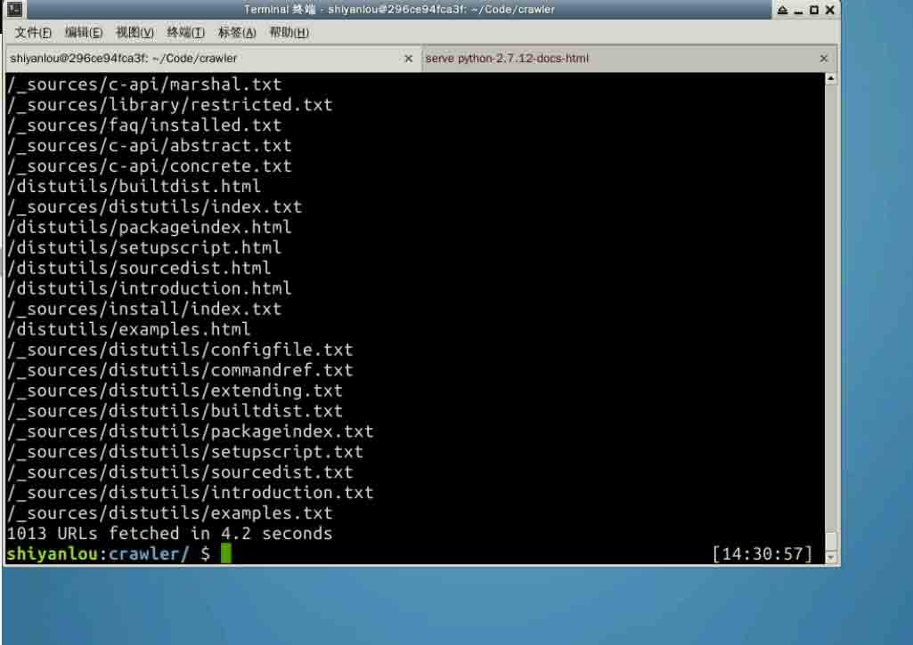
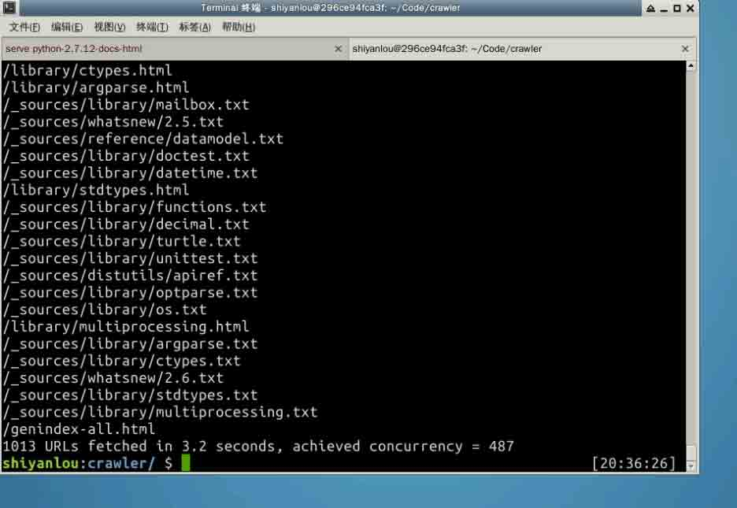
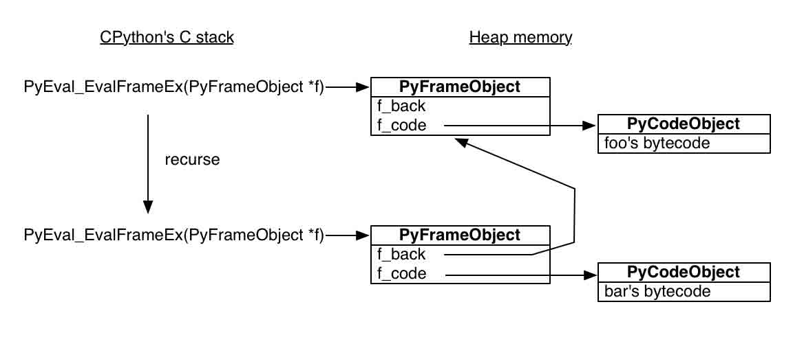
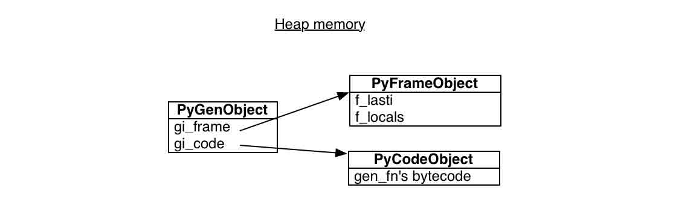
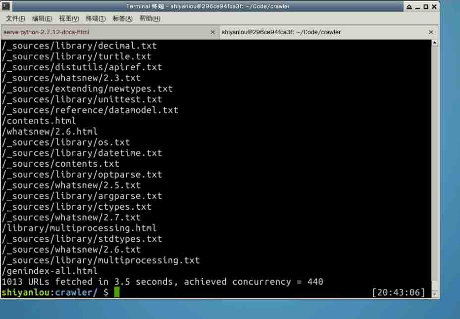

# 第 1 节 Python 实现基于协程的异步爬虫

## 一、课程介绍

### 1\. 课程来源

本课程核心部分来自[《500 lines or less》](https://github.com/aosabook/500lines/blob/master/crawler)项目，作者是来自 MongoDB 的工程师 A. Jesse Jiryu Davis 与 Python 之父 Guido van Rossum。项目代码使用 MIT 协议，项目文档使用 [`creativecommons.org/licenses/by/3.0/legalcode`](http://creativecommons.org/licenses/by/3.0/legalcode) 协议。

课程内容在原文档基础上做了稍许修改，增加了部分原理介绍，步骤的拆解分析及源代码注释。

### 2\. 内容简介

传统计算机科学往往将大量精力放在如何追求更有效率的算法上。但如今大部分涉及网络的程序，它们的时间开销主要并不是在计算上，而是在维持多个 Socket 连接上。亦或是它们的事件循环处理的不够高效导致了更多的时间开销。对于这些程序来说，它们面临的挑战是如何更高效地等待大量的网络事件并进行调度。目前流行的解决方式就是使用异步 I/O。

本课程将探讨几种实现爬虫的方法，从传统的线程池到使用协程，每节课实现一个小爬虫。另外学习协程的时候，我们会从原理入手，以 ayncio 协程库为原型，实现一个简单的异步编程模型。

本课程实现的爬虫为爬一个整站的爬虫，不会爬到站点外面去，且功能较简单，主要目的在于学习原理，提供实现并发与异步的思路，并不适合直接改写作为日常工具使用。

### 3\. 课程知识点

本课程项目完成过程中，我们将学习：

1.  线程池实现并发爬虫
2.  回调方法实现异步爬虫
3.  协程技术的介绍
4.  一个基于协程的异步编程模型
5.  协程实现异步爬虫

## 二、实验环境

本课程使用`Python 3.4`，所以本课程内运行`py`脚本都是使用`python3`命令。

打开终端，进入 `Code` 目录，创建 `crawler` 文件夹, 并将其作为我们的工作目录。

```py
$ cd Code
$ mkdir crawler && cd crawler 
```

环保起见，测试爬虫的网站在本地搭建。

我们使用 Python 2.7 版本官方文档作为测试爬虫用的网站

```py
wget http://labfile.oss.aliyuncs.com/courses/574/python-doc.zip
unzip python-doc.zip 
```

安装`serve`，一个用起来很方便的静态文件服务器：

```py
sudo npm install -g serve 
```

启动服务器：

```py
serve python-doc 
```

如果访问不了`npm`的资源，也可以用以下方式开启服务器：

```py
ruby -run -ehttpd python-doc -p 3000 
```

访问`localhost:3000`查看网站：



## 三、实验原理

### 什么是爬虫？

网络爬虫（又被称为网页蜘蛛，网络机器人，在 FOAF 社区中间，更经常的称为网页追逐者），是一种按照一定的规则，自动地抓取万维网信息的程序或者脚本。

### 爬虫的工作流程

网络爬虫基本的工作流程是从一个根 URL 开始，抓取页面，解析页面中所有的 URL，将还没有抓取过的 URL 放入工作队列中，之后继续抓取工作队列中的 URL，重复抓取、解析，将解析到的 url 放入工作队列的步骤，直到工作队列为空为止。

### 线程池、回调、协程

我们希望通过并发执行来加快爬虫抓取页面的速度。一般的实现方式有三种：

1.  线程池方式：开一个线程池，每当爬虫发现一个新链接，就将链接放入任务队列中，线程池中的线程从任务队列获取一个链接，之后建立 socket，完成抓取页面、解析、将新连接放入工作队列的步骤。
2.  回调方式：程序会有一个主循环叫做事件循环，在事件循环中会不断获得事件，通过在事件上注册解除回调函数来达到多任务并发执行的效果。缺点是一旦需要的回调操作变多，代码就会非常散，变得难以维护。
3.  协程方式：同样通过事件循环执行程序，利用了`Python` 的生成器特性，生成器函数能够中途停止并在之后恢复，那么原本不得不分开写的回调函数就能够写在一个生成器函数中了，这也就实现了协程。

## 四、实验一：线程池实现爬虫

使用`socket`抓取页面需要先建立连接，之后发送`GET`类型的`HTTP`报文，等待读入，将读到的所有内容存入响应缓存。

```py
def fetch(url):
    sock = socket.socket()
    sock.connect(('localhost.com', 3000))
    request = 'GET {} HTTP/1.0\r\nHost: localhost\r\n\r\n'.format(url)
    sock.send(request.encode('ascii'))
    response = b''
    chunk = sock.recv(4096)
    while chunk:
        response += chunk
        chunk = sock.recv(4096)

    links = parse_links(response)
    q.add(links) 
```

默认的`socket`连接与读写是阻塞式的，在等待读入的这段时间的 CPU 占用是被完全浪费的。

### 多线程

默认这部分同学们都是学过的，所以就粗略记几个重点，没学过的同学可以直接参考廖雪峰的教程：[廖雪峰的官方网站-Python 多线程](http://www.liaoxuefeng.com/wiki/0014316089557264a6b348958f449949df42a6d3a2e542c000/00143192823818768cd506abbc94eb5916192364506fa5d000)

导入线程库：

```py
import threading 
```

开启一个线程的方法：

```py
t = 你新建的线程
t.start()   #开始运行线程
t.join()    #你的当前函数就阻塞在这一步直到线程运行完 
```

建立线程的两种方式：

```py
#第一种:通过函数创建线程
def 函数 a():
    pass
t = threading.Thread(target=函数 a,name=自己随便取的线程名字)

#第二种:继承线程类
class Fetcher(threading.Thread):
    def __init__(self):
        Thread.__init__(self):
        #加这一步后主程序中断退出后子线程也会跟着中断退出
        self.daemon = True
    def run(self):
        #线程运行的函数
        pass
t = Fetcher() 
```

线程同时操作一个全局变量时会产生线程竞争所以需要锁：

```py
lock = threading.Lock()

lock.acquire()      #获得锁
#..操作全局变量..
lock.release()      #释放锁 
```

### 多线程同步－队列

默认这部分同学们都是学过的，所以就粗略记几个重点，没学过的同学可以直接参考[PyMOTW3-queue — Thread-safe FIFO Implementation](https://pymotw.com/3/queue/index.html)：[中文翻译版](https://harveyqing.gitbooks.io/python-read-and-write/content/python_basic/fifo_queue.html)

多线程同步就是多个线程竞争一个全局变量时按顺序读写，一般情况下要用锁，但是使用标准库里的`Queue`的时候它内部已经实现了锁，不用程序员自己写了。

导入队列类：

```py
from queue import Queue 
```

创建一个队列：

```py
q = Queue(maxsize=0) 
```

maxsize 为队列大小，为 0 默认队列大小可无穷大。

队列是先进先出的数据结构：

```py
q.put(item) #往队列添加一个 item，队列满了则阻塞
q.get(item) #从队列得到一个 item，队列为空则阻塞 
```

还有相应的不等待的版本，这里略过。

队列不为空，或者为空但是取得 item 的线程没有告知任务完成时都是处于阻塞状态

```py
q.join()    #阻塞直到所有任务完成 
```

线程告知任务完成使用`task_done`

```py
q.task_done() #在线程内调用 
```

### 实现线程池

创建`thread.py`文件作为爬虫程序的文件。

我们使用`seen_urls`来记录已经解析到的`url`地址：

```py
seen_urls = set(['/']) 
```

创建`Fetcher`类：

```py
class Fetcher(Thread):
    def __init__(self, tasks):
        Thread.__init__(self)
        #tasks 为任务队列
        self.tasks = tasks
        self.daemon = True    
        self.start()

    def run(self):
        while True:
            url = self.tasks.get()
            print(url)
            sock = socket.socket()
            sock.connect(('localhost', 3000))
            get = 'GET {} HTTP/1.0\r\nHost: localhost\r\n\r\n'.format(url)
            sock.send(get.encode('ascii'))
            response = b''
            chunk = sock.recv(4096)
            while chunk:
                response += chunk
                chunk = sock.recv(4096)

            #解析页面上的所有链接
            links = self.parse_links(url, response)

            lock.acquire()
            #得到新链接加入任务队列与 seen_urls 中
            for link in links.difference(seen_urls):
                self.tasks.put(link)
            seen_urls.update(links)    
            lock.release()
            #通知任务队列这个线程的任务完成了
            self.tasks.task_done() 
```

使用正则库与 url 解析库来解析抓取的页面，这里图方便用了正则，同学也可以用`Beautifulsoup`等专门用来解析页面的 Python 库：

```py
import urllib.parse
import re 
```

在`Fetcher`中实现`parse_links`解析页面:

```py
def parse_links(self, fetched_url, response):
    if not response:
        print('error: {}'.format(fetched_url))
        return set()
    if not self._is_html(response):
        return set()

    #通过 href 属性找到所有链接
    urls = set(re.findall(r'''(?i)href=["']?([^\s"'<>]+)''',
                          self.body(response)))

    links = set()
    for url in urls:
        #可能找到的 url 是相对路径，这时候就需要 join 一下，绝对路径的话就还是会返回 url
        normalized = urllib.parse.urljoin(fetched_url, url)
        #url 的信息会被分段存在 parts 里
        parts = urllib.parse.urlparse(normalized)
        if parts.scheme not in ('', 'http', 'https'):
            continue
        host, port = urllib.parse.splitport(parts.netloc)
        if host and host.lower() not in ('localhost'):
            continue
        #有的页面会通过地址里的#frag 后缀在页面内跳转，这里去掉 frag 的部分
        defragmented, frag = urllib.parse.urldefrag(parts.path)
        links.add(defragmented)

    return links

#得到报文的 html 正文
def body(self, response):
    body = response.split(b'\r\n\r\n', 1)[1]
    return body.decode('utf-8')

def _is_html(self, response):
    head, body = response.split(b'\r\n\r\n', 1)
    headers = dict(h.split(': ') for h in head.decode().split('\r\n')[1:])
    return headers.get('Content-Type', '').startswith('text/html') 
```

实现线程池类与`main`的部分：

```py
class ThreadPool:
    def __init__(self, num_threads):
        self.tasks = Queue()
        for _ in range(num_threads):
            Fetcher(self.tasks)

    def add_task(self, url):
        self.tasks.put(url)

    def wait_completion(self):
        self.tasks.join()

if __name__ == '__main__':
    start = time.time()
    #开 4 个线程
    pool = ThreadPool(4)
    #从根地址开始抓取页面
    pool.add_task("/")
    pool.wait_completion()
    print('{} URLs fetched in {:.1f} seconds'.format(len(seen_urls),time.time() - start)) 
```

### 运行效果

这里先贴出完整代码：

```py
from queue import Queue 
from threading import Thread, Lock
import urllib.parse
import socket
import re
import time

seen_urls = set(['/'])
lock = Lock()

class Fetcher(Thread):
    def __init__(self, tasks):
        Thread.__init__(self)
        self.tasks = tasks
        self.daemon = True

        self.start()

    def run(self):
        while True:
            url = self.tasks.get()
            print(url)
            sock = socket.socket()
            sock.connect(('localhost', 3000))
            get = 'GET {} HTTP/1.0\r\nHost: localhost\r\n\r\n'.format(url)
            sock.send(get.encode('ascii'))
            response = b''
            chunk = sock.recv(4096)
            while chunk:
                response += chunk
                chunk = sock.recv(4096)

            links = self.parse_links(url, response)

            lock.acquire()
            for link in links.difference(seen_urls):
                self.tasks.put(link)
            seen_urls.update(links)    
            lock.release()

            self.tasks.task_done()

    def parse_links(self, fetched_url, response):
        if not response:
            print('error: {}'.format(fetched_url))
            return set()
        if not self._is_html(response):
            return set()
        urls = set(re.findall(r'''(?i)href=["']?([^\s"'<>]+)''',
                              self.body(response)))

        links = set()
        for url in urls:
            normalized = urllib.parse.urljoin(fetched_url, url)
            parts = urllib.parse.urlparse(normalized)
            if parts.scheme not in ('', 'http', 'https'):
                continue
            host, port = urllib.parse.splitport(parts.netloc)
            if host and host.lower() not in ('localhost'):
                continue
            defragmented, frag = urllib.parse.urldefrag(parts.path)
            links.add(defragmented)

        return links

    def body(self, response):
        body = response.split(b'\r\n\r\n', 1)[1]
        return body.decode('utf-8')

    def _is_html(self, response):
        head, body = response.split(b'\r\n\r\n', 1)
        headers = dict(h.split(': ') for h in head.decode().split('\r\n')[1:])
        return headers.get('Content-Type', '').startswith('text/html')

class ThreadPool:
    def __init__(self, num_threads):
        self.tasks = Queue()
        for _ in range(num_threads):
            Fetcher(self.tasks)

    def add_task(self, url):
        self.tasks.put(url)

    def wait_completion(self):
        self.tasks.join()

if __name__ == '__main__':
    start = time.time()
    pool = ThreadPool(4)
    pool.add_task("/")
    pool.wait_completion()
    print('{} URLs fetched in {:.1f} seconds'.format(len(seen_urls),time.time() - start)) 
```

运行`python3 thread.py`命令查看效果（记得先开网站服务器）：



### 使用标准库中的线程池

线程池直接使用`multiprocessing.pool`中的`ThreadPool`：

代码更改如下：

```py
from multiprocessing.pool import ThreadPool

#...省略中间部分...
#...去掉 Fetcher 初始化中的 self.start()
#...删除自己实现的 ThreadPool...

if __name__ == '__main__':
    start = time.time()
    pool = ThreadPool()
    tasks = Queue()
    tasks.put("/")
    Workers = [Fetcher(tasks) for i in range(4)]
    pool.map_async(lambda w:w.run(), Workers)
    tasks.join() 
    pool.close()

    print('{} URLs fetched in {:.1f} seconds'.format(len(seen_urls),time.time() - start)) 
```

使用`ThreadPool`时，它处理的对象可以不是线程对象，实际上`Fetcher`的线程部分`ThreadPool`根本用不到。因为它自己内部已开了几个线程在等待任务输入。这里偷个懒就只把`self.start()`去掉了。可以把`Fetcher`的线程部分全去掉，效果是一样的。

`ThreadPool`活用了`map`函数，这里它将每一个`Fetcher`对象分配给线程池中的一个线程，线程调用了`Fetcher`的`run`函数。这里使用`map_async`是因为不希望它在那一步阻塞，我们希望在任务队列`join`的地方阻塞，那么到队列为空且任务全部处理完时程序就会继续执行了。

运行`python3 thread.py`命令查看效果：



### 线程池实现的缺陷

我们希望爬虫的性能能够进一步提升，但是我们没办法开太多的线程，因为线程的内存开销很大，每创建一个线程可能需要占用 50k 的内存。以及还有一点，网络程序的时间开销往往花在 I/O 上，socket I/O 阻塞时的那段时间是完全被浪费了的。那么要如何解决这个问题呢？

下节课你就知道啦，下节课见～

## 五、实验二：事件驱动-回调函数实现爬虫

承接上一节课，我们在上节课中提到，socket I/O 阻塞时的那段时间完全被浪费了，那么要如何节省下那一段时间呢？

### 非阻塞 I/O

如果使用非阻塞 I/O，它就不会傻傻地等在那里(比如等连接、等读取)，而是会返回一个错误信息，虽然说是说错误信息，它其实就是叫你过一会再来的意思，编程的时候都不把它当错误看。

非阻塞 I/O 代码如下：

```py
sock = socket.socket()
sock.setblocking(False)
try:
    sock.connect(('xkcd.com', 80))
except BlockingIOError:
    pass 
```

这里抛出的异常无视掉就可以了。

### 单线程上的多 I/O

有了非阻塞 I/O 这个特性，我们就能够实现单线程上多个`sockets`的处理了，学过 C 语言网络编程的同学应该都认识`select`这个函数吧？不认识也不要紧，`select`函数如果你不设置它的超时时间它就是默认一直阻塞的，只有当有 I/O 事件发生时它才会被激活，然后告诉你哪个`socket`上发生了什么事件（读|写|异常），在`Python`中也有`select`，还有跟`select`功能相同但是更高效的`poll`，它们都是底层 C 函数的`Python`实现。

不过这里我们不使用`select`，而是用更简单好用的`DefaultSelector`，是`Python 3.4`后才出现的一个模块里的类，你只需要在非阻塞`socket`和事件上绑定回调函数就可以了。

代码如下：

```py
from selectors import DefaultSelector, EVENT_WRITE

selector = DefaultSelector()

sock = socket.socket()
sock.setblocking(False)
try:
    sock.connect(('localhost', 3000))
except BlockingIOError:
    pass

def connected():
    selector.unregister(sock.fileno())
    print('connected!')

selector.register(sock.fileno(), EVENT_WRITE, connected) 
```

这里看一下`selector.register`的原型

```py
register(fileobj, events, data=None) 
```

其中`fileobj`可以是文件描述符也可以是文件对象（通过`fileno`得到），`events`是位掩码，指明发生的是什么事件，`data` 则是与指定文件（也就是我们的 socket）与指定事件绑定在一起的数据。

如代码所示，`selector.register` 在该`socket`的写事件上绑定了回调函数`connected`（这里作为数据绑定）。在该`socket`上第一次发生的写事件意味着连接的建立，`connected`函数在连接建立成功后再解除了该`socket`上所有绑定的数据。

### 事件驱动

看了以上`selector`的使用方式，我想你会发现它很适合写成事件驱动的形式。

我们可以创建一个事件循环，在循环中不断获得 I/O 事件：

```py
def loop():
    while True:
     events = selector.select()
        #遍历事件并调用相应的处理
        for event_key, event_mask in events:
         callback = event_key.data
            callback() 
```

其中`events_key`是一个`namedtuple`，它的结构大致如下(fileobj,fd,events,data)，我们从 data 得到之前绑定的回调函数并调用。 `event_mask`则是事件的位掩码。

关于`selectors`的更多内容，可参考官方文档： [`docs.python.org/3.4/library/selectors.html`](https://docs.python.org/3.4/library/selectors.html)

### 完成后续工作

现在我们已经明白了基于回调函数实现事件驱动是怎么一回事了，接着来完成我们的爬虫吧。

首先创建两个 set，一个是待处理 url 的集合，一个是已抓取 url 的集合，同时初始化为根 url '/'

```py
urls_todo = set(['/'])
seen_urls = set(['/']) 
```

抓取一个页面会需要许多回调函数。比如`connected`，它会在连接建立成功后向服务器发送一个`GET`请求请求页面。当然它不会干等着服务器响应（那就阻塞了），而是再绑定另一个接收响应的回调函数`read_response`。如果`read_response`在事件触发时无法一次性读取完整的响应，那么就会等下次事件触发时继续读取，直到读取到了完整的响应才解除绑定。

我们将这些回调函数封装在 `Fetcher` 类中。它有三个成员变量：抓取的`url`、`socket`对象与得到的服务器响应`response`。

```py
class Fetcher:
    def __init__(self, url):
        self.response = b'' 
        self.url = url
        self.sock = None 
```

实现`fetch`函数，绑定`connected`：

```py
 # 在 Fetcher 类中实现
    def fetch(self):
        self.sock = socket.socket()
        self.sock.setblocking(False)
        try:
            self.sock.connect(('xkcd.com', 80))
        except BlockingIOError:
            pass

        selector.register(self.sock.fileno(),
                          EVENT_WRITE,
                          self.connected) 
```

注意到`fetch`函数在内部调用`connect`尝试建立`socket`连接并绑定回调函数，I/O 的处理则都是交给事件循环控制的。`Fetcher`与事件循环的关系如下：

```py
# Begin fetching http://xkcd.com/353/
fetcher = Fetcher('/353/')
fetcher.fetch()

# 事件循环
while True:
    events = selector.select()
    for event_key, event_mask in events:
        callback = event_key.data
        callback(event_key, event_mask) 
```

`connected`的实现：

```py
def connected(self, key, mask):
    print('connected!')
    #解除该 socket 上的所有绑定
    selector.unregister(key.fd)
    request = 'GET {} HTTP/1.0\r\nHost: xkcd.com\r\n\r\n'.format(self.url)
    self.sock.send(request.encode('ascii'))

    # 连接建立后绑定读取响应的回调函数
    selector.register(key.fd,
                      EVENT_READ,
                      self.read_response) 
```

`read_response`的实现：

```py
def read_response(self, key, mask):
    global stopped

    chunk = self.sock.recv(4096)  # 每次接收最多 4K 的信息
    if chunk:
        self.response += chunk
    else:
        selector.unregister(key.fd)  # 完成接收则解除绑定
        links = self.parse_links()

        # Python set-logic:
        for link in links.difference(seen_urls):
            urls_todo.add(link)
            Fetcher(link).fetch()  # 抓取新的 url

        seen_urls.update(links)
        urls_todo.remove(self.url)
        if not urls_todo:
            stopped = True         # 当抓取队列为空时结束事件循环 
```

`parse_links` 如上一节课，它的作用是返回抓取到的页面中的所有发现的 url 的集合。 `parse_links` 之后，遍历了每一个没抓取过的 url 并为其创建一个新的`Fetcher` 对象并调用`fetch` 函数开始抓取。

`parse_links`等其它函数的实现：

```py
def body(self):
    body = self.response.split(b'\r\n\r\n', 1)[1]
    return body.decode('utf-8')

def parse_links(self):
    if not self.response:
        print('error: {}'.format(self.url))
        return set()
    if not self._is_html():
        return set()
    urls = set(re.findall(r'''(?i)href=["']?([^\s"'<>]+)''',
                          self.body()))

    links = set()
    for url in urls:
        normalized = urllib.parse.urljoin(self.url, url)
        parts = urllib.parse.urlparse(normalized)
        if parts.scheme not in ('', 'http', 'https'):
            continue
        host, port = urllib.parse.splitport(parts.netloc)
        if host and host.lower() not in ('xkcd.com', 'www.xkcd.com'):
            continue
        defragmented, frag = urllib.parse.urldefrag(parts.path)
        links.add(defragmented)

    return links

def _is_html(self):
    head, body = self.response.split(b'\r\n\r\n', 1)
    headers = dict(h.split(': ') for h in head.decode().split('\r\n')[1:])
    return headers.get('Content-Type', '').startswith('text/html') 
```

将事件循环改为 stopped 时停止：

```py
start = time.time()
stopped = False

def loop():
    while not stopped:
        events = selector.select()
        for event_key, event_mask in events:
            callback = event_key.data
            callback()

print('{} URLs fetched in {:.1f} seconds'.format(
    len(seen_urls), time.time() - start)) 
```

### 运行效果

这里先奉上完整代码：

```py
from selectors import *
import socket
import re
import urllib.parse
import time

urls_todo = set(['/'])
seen_urls = set(['/'])
#追加了一个可以看最高并发数的变量
concurrency_achieved = 0
selector = DefaultSelector()
stopped = False

class Fetcher:
    def __init__(self, url):
        self.response = b''
        self.url = url
        self.sock = None

    def fetch(self):
        global concurrency_achieved
        concurrency_achieved = max(concurrency_achieved, len(urls_todo))

        self.sock = socket.socket()
        self.sock.setblocking(False)
        try:
            self.sock.connect(('localhost', 3000))
        except BlockingIOError:
            pass
        selector.register(self.sock.fileno(), EVENT_WRITE, self.connected)

    def connected(self, key, mask):
        selector.unregister(key.fd)
        get = 'GET {} HTTP/1.0\r\nHost: localhost\r\n\r\n'.format(self.url)
        self.sock.send(get.encode('ascii'))
        selector.register(key.fd, EVENT_READ, self.read_response)

    def read_response(self, key, mask):
        global stopped

        chunk = self.sock.recv(4096)  # 4k chunk size.
        if chunk:
            self.response += chunk
        else:
            selector.unregister(key.fd)  # Done reading.
            links = self.parse_links()
            for link in links.difference(seen_urls):
                urls_todo.add(link)
                Fetcher(link).fetch()

            seen_urls.update(links)
            urls_todo.remove(self.url)
            if not urls_todo:
                stopped = True
            print(self.url)

    def body(self):
        body = self.response.split(b'\r\n\r\n', 1)[1]
        return body.decode('utf-8')

    def parse_links(self):
        if not self.response:
            print('error: {}'.format(self.url))
            return set()
        if not self._is_html():
            return set()
        urls = set(re.findall(r'''(?i)href=["']?([^\s"'<>]+)''',
                              self.body()))

        links = set()
        for url in urls:
            normalized = urllib.parse.urljoin(self.url, url)
            parts = urllib.parse.urlparse(normalized)
            if parts.scheme not in ('', 'http', 'https'):
                continue
            host, port = urllib.parse.splitport(parts.netloc)
            if host and host.lower() not in ('localhost'):
                continue
            defragmented, frag = urllib.parse.urldefrag(parts.path)
            links.add(defragmented)

        return links

    def _is_html(self):
        head, body = self.response.split(b'\r\n\r\n', 1)
        headers = dict(h.split(': ') for h in head.decode().split('\r\n')[1:])
        return headers.get('Content-Type', '').startswith('text/html')

start = time.time()
fetcher = Fetcher('/')
fetcher.fetch()

while not stopped:
    events = selector.select()
    for event_key, event_mask in events:
        callback = event_key.data
        callback(event_key, event_mask)

print('{} URLs fetched in {:.1f} seconds, achieved concurrency = {}'.format(
    len(seen_urls), time.time() - start, concurrency_achieved)) 
```

输入`python3 callback.py`命令查看效果。不要忘了先开网站的服务器哦。



### 基于回调函数实现的缺陷

想想之前从建立连接到读取响应到解析新的 url 到工作队列中，这一切都能够在一个函数中完成，就像下面这样：

```py
def fetch(url):
    sock = socket.socket()
    sock.connect(('localhost', 3000))
    request = 'GET {} HTTP/1.0\r\nHost: localhost\r\n\r\n'.format(url)
    sock.send(request.encode('ascii'))
    response = b''
    chunk = sock.recv(4096)
    while chunk:
        response += chunk
        chunk = sock.recv(4096)

    links = parse_links(response)
    q.add(links) 
```

而用回调函数实现，整个整体就支离破碎了，哪里阻塞就又不得不在那里把函数一切为二，代码会显得非常乱，维护也变的很麻烦。更麻烦的是如果在回调函数中抛出了异常，你根本得不到什么有用的信息：

```py
Traceback (most recent call last):
  File "loop-with-callbacks.py", line 111, in <module>
    loop()
  File "loop-with-callbacks.py", line 106, in loop
    callback(event_key, event_mask)
  File "loop-with-callbacks.py", line 51, in read_response
    links = self.parse_links()
  File "loop-with-callbacks.py", line 67, in parse_links
    raise Exception('parse error')
Exception: parse error 
```

你看不到这个回调函数的上下文是什么，你只知道它在事件循环里。你想在这个函数外抓取它的异常都没地方下手。但是这又是回调实现无法避免的缺陷，那我们想实现并发异步应该怎么办咧？

下节课见～

## 六、实验三：事件驱动-协程实现爬虫

### 什么是协程？

协程其实是比起一般的子例程而言更宽泛的存在，子例程是协程的一种特例。

子例程的起始处是惟一的入口点，一旦退出即完成了子例程的执行，子例程的一个实例只会返回一次。

协程可以通过`yield`来调用其它协程。通过`yield`方式转移执行权的协程之间不是调用者与被调用者的关系，而是彼此对称、平等的。

协程的起始处是第一个入口点，在协程里，返回点之后是接下来的入口点。子例程的生命期遵循后进先出（最后一个被调用的子例程最先返回）；相反，协程的生命期完全由他们的使用的需要决定。

还记得我们什么时候会用到`yield`吗，就是在生成器(generator)里，在迭代的时候每次执行 next(generator)生成器都会执行到下一次`yield`的位置并返回，可以说生成器就是例程。

一个生成器的例子：

```py
#定义生成器函数
def fib():
    a, b = 0, 1
    while(True):
            yield a
            a, b = b, a + b
#获得生成器
fib = fib()

next(fib)     # >> 0
next(fib)     # >> 1 
```

### 生成器是如何工作的？

在考察生成器前，我们需要先了解一般的 python 函数是如何运行的。当一个函数调用子函数时，控制就会交给子函数，直到子函数返回或者抛出异常时才会将控制交还给调用函数。

自定义两个函数：

```py
>>> def foo():
...     bar()
...
>>> def bar():
...     pass 
```

标准`Python`解释器`CPython`中的`PyEval_EvalFrameEx`方法会取得栈帧和待运行的字节码，并在得到的栈帧的上下文环境下计算字节码的结果。以下是`foo`函数的字节码：

从字节码可以看出`foo`函数加载`bar`到栈上之后通过`CALL_FUNCTION`调用，`bar`返回后弹出`bar`的返回值，加载`None`到栈上并将其作为`foo`的返回值返回。

当`PyEval_EvalFrameEx`遇到`CALL_FUNCTION`字节码时，它创建一个新的`Python`栈帧。

需要了解的一点是`Python`的栈帧是存在于堆上的。`CPython`作为一个普通的 C 程序，它的栈帧就在栈上，但是`CPython`所控制的`Python`的栈帧却是在堆上的，所以`Python`的栈帧在函数调用结束后是仍能够保持存在。我们设置一个全局变量`frame`，将`bar`的栈帧赋给`frame`。

```py
>>> import inspect
>>> frame = None
>>> def foo():
...     bar()
...
>>> def bar():
...     global frame
...     frame = inspect.currentframe()
...
>>> foo()
>>> #得到'bar'的栈帧
>>> frame.f_code.co_name
'bar'
>>> # 它的返回指针指向 foo 的栈
>>> caller_frame = frame.f_back
>>> caller_frame.f_code.co_name
'foo' 
```



现在让我们考察一下生成器的结构，先定义一个生成器函数：

```py
>>> def gen_fn():
...     result = yield 1
...     print('result of yield: {}'.format(result))
...     result2 = yield 2
...     print('result of 2nd yield: {}'.format(result2))
...     return 'done' 
```

当 `Python` 将 `gen_fn` 编译为字节码时，它会检查有没有`yield`，有的话那就是生成器函数了，编译器会在该函数的`flag`上打上标识：

```py
>>> # 生成器的标识位是第 5 位.
>>> generator_bit = 1 << 5
>>> bool(gen_fn.__code__.co_flags & generator_bit)
True 
```

调用生成器函数时会生成一个生成器对象：

```py
>>> gen = gen_fn()
>>> type(gen)
<class 'generator'> 
```

生成器对象会封装一个栈帧和一个对代码的引用：

```py
>>> gen.gi_code.co_name
'gen_fn' 
```

所有来自同一个生成器函数的生成器对象都会引用同一份代码，但是却会拥有各自不同的栈帧，生成器对象结构图如下：



帧拥有`f_lasti`指针，它指向之前最新一次运行的指令。它初始化的时候为-1，说明生成器还没有开始运行。

```py
>>> gen.gi_frame.f_lasti
-1 
```

当我们对生成器执行`send`方法时，生成器会运行到第一次`yield`的位置并停止。在这里它返回 1，正如我们编写的代码预期的那样。

```py
>>> gen.send(None)
1 
```

现在`f_lasti`指向 3 了，比最开始前进了 4 个字节码，以及可以发现这个函数一共生成了 56 个字节码：

```py
>>> gen.gi_frame.f_lasti
3
>>> len(gen.gi_code.co_code)
56 
```

生成器能够停止，也能够在任意时刻通过任意函数恢复，这也是因为栈帧是在堆上而不是栈上，所以不用遵守函数调用的先进后出原则。

我们可以`send`"hello"字符串给生成器，它会在之前停止的`yield`那里得到并赋值给`result`，之后生成器继续运行直到下一个`yield`位置停止并返回。

```py
>>> gen.send('hello')
result of yield: hello
2 
```

查看生成器的局部变量：

```py
>>> gen.gi_frame.f_locals
{'result': 'hello'} 
```

当我们再次调用`send`的时候，生成器从它第二次 yield 的地方继续运行，到最后已经没有`yield`了，所以出现了`StopIteration`异常：

```py
>>> gen.send('goodbye')
result of 2nd yield: goodbye
Traceback (most recent call last):
  File "<input>", line 1, in <module>
StopIteration: done 
```

可以看到，该异常的值是生成器最后返回的值，在这里就是字符串"done"

### 生成器实现协程模型

虽然生成器拥有一个协程该有的特性，但光这样是不够的，做异步编程仍是困难的，我们需要先用生成器实现一个协程异步编程的简单模型，它同时也是`Python`标准库`asyncio`的简化版，正如`asyncio`的实现，我们会用到生成器,`Future`类，以及`yield from`语句。

首先实现`Future`类， `Future`类可以认为是专门用来存储将要发送给协程的信息的类。

```py
class Future:
    def __init__(self):
        self.result = None
        self._callbacks = []

    def add_done_callback(self, fn):
        self._callbacks.append(fn)

    def set_result(self, result):
        self.result = result
        for fn in self._callbacks:
            fn(self) 
```

`Future`对象最开始处在挂起状态，当调用`set_result`时被激活，并运行注册的回调函数，该回调函数多半是对协程发送信息让协程继续运行下去的函数。

我们改造一下之前从`fetch`到`connected`的函数，加入`Future`与`yield`。

这是之前回调实现的`fetch`：

```py
class Fetcher:
    def fetch(self):
        self.sock = socket.socket()
        self.sock.setblocking(False)
        try:
            self.sock.connect(('localhost', 3000))
        except BlockingIOError:
            pass
        selector.register(self.sock.fileno(),
                          EVENT_WRITE,
                          self.connected)

    def connected(self, key, mask):
        print('connected!')
        # ...后面省略... 
```

改造后，我们将连接建立后的部分也放到了`fetch`中。

```py
class Fetcher:
    def fetch(self):
        sock = socket.socket()
        sock.setblocking(False)
        try:
            sock.connect(('localhost', 3000))
        except BlockingIOError:
            pass

        f = Future()

        def on_connected():
            #连接建立后通过 set_result 协程继续从 yield 的地方往下运行
            f.set_result(None)

        selector.register(sock.fileno(),
                          EVENT_WRITE,
                          on_connected)
        yield f
        selector.unregister(sock.fileno())
        print('connected!') 
```

`fetcher`是一个生成器函数，我们创建一个`Future`实例，yield 它来暂停`fetch`的运行直到连接建立`f.set_result(None)`的时候，生成器才继续运行。那`set_result`时运行的回调函数是哪来的呢？这里引入`Task`类：

```py
class Task:
    def __init__(self, coro):
        #协程
        self.coro = coro
        #创建并初始化一个为 None 的 Future 对象
        f = Future()
        f.set_result(None)
        #步进一次（发送一次信息）
        #在初始化的时候发送是为了协程到达第一个 yield 的位置，也是为了注册下一次的步进
        self.step(f)

    def step(self, future):
        try:
            #向协程发送消息并得到下一个从协程那 yield 到的 Future 对象
            next_future = self.coro.send(future.result)
        except StopIteration:
            return

        next_future.add_done_callback(self.step)

fetcher = Fetcher('/')
Task(fetcher.fetch())

loop() 
```

流程大致是这样的，首先`Task`初始化，向`fetch`生成器发送`None`信息（也可以想象成`step`调用了`fetch`，参数是 None），`fetch`得以从开头运行到第一个`yield`的地方并返回了一个`Future`对象给`step`的`next_future`，然后`step`就在这个得到的`Future`对象注册了`step`。当连接建立时`on_connected`就会被调用，再一次向协程发送信息，协程就会继续往下执行了。

### 使用`yield from`分解协程

一旦`socket`连接建立成功，我们发送`HTTP GET`请求到服务器并在之后读取服务器响应。现在这些步骤不用再分散在不同的回调函数里了，我们可以将其放在同一个生成器函数中：

```py
def fetch(self):
    # ... 省略连接的代码
    sock.send(request.encode('ascii'))

    while True:
        f = Future()

        def on_readable():
            f.set_result(sock.recv(4096))

        selector.register(sock.fileno(),
                          EVENT_READ,
                          on_readable)
        chunk = yield f
        selector.unregister(sock.fileno())
        if chunk:
            self.response += chunk
        else:
            # 完成读取
            break 
```

但是这样代码也会越积越多，可不可以分解生成器函数的代码呢，从协程中提取出子协程？`Python 3` 的`yield from`能帮助我们完成这部分工作。：

```py
>>> def gen_fn():
...     result = yield 1
...     print('result of yield: {}'.format(result))
...     result2 = yield 2
...     print('result of 2nd yield: {}'.format(result2))
...     return 'done'
... 
```

使用`yield from`在一个生成器中调用另一个生成器：

```py
>>> # Generator function:
>>> def caller_fn():
...     gen = gen_fn()
...     rv = yield from gen
...     print('return value of yield-from: {}'
...           .format(rv))
...
>>> # Make a generator from the
>>> # generator function.
>>> caller = caller_fn() 
```

给`caller`生成器发送消息，消息送到了`gen`生成器那里，在`gen`还没返回前`caller`就停在`rv = yield from gen`这条语句上了。

```py
>>> caller.send(None)
1
>>> caller.gi_frame.f_lasti
15
>>> caller.send('hello')
result of yield: hello
2
>>> caller.gi_frame.f_lasti  # 可以发现指令没有前进
15
>>> caller.send('goodbye')
result of 2nd yield: goodbye
return value of yield-from: done
Traceback (most recent call last):
  File "<input>", line 1, in <module>
StopIteration 
```

对于我们来说，于外，我们无法判断发送消息时`yield`的值是来自`caller`还是`caller`内的子协程（比如`gen`），于内，我们也不用关心`gen`所得到的消息是从哪里传送来的，`gen`只用负责在上一次`yield`时得到消息输入，运行到下一个 yield 时返回输出，重复这个模式到最后`return`就可以了。

`yield from`得到的子协程最后`return`的返回值：

```py
rv = yield from gen 
```

想一想之前我们抱怨回调函数抛出异常时看不到上下文，这回我们看看协程是怎么样的：

```py
>>> def gen_fn():
...     raise Exception('my error')
>>> caller = caller_fn()
>>> caller.send(None)
Traceback (most recent call last):
  File "<input>", line 1, in <module>
  File "<input>", line 3, in caller_fn
  File "<input>", line 2, in gen_fn
Exception: my error 
```

清楚多了，栈跟踪显示在`gen_fn`抛出异常时消息是从`caller_fn`委派到`gen_fn`的。

协程处理异常的手段跟普通函数也是一样的：

```py
>>> def gen_fn():
...     yield 1
...     raise Exception('uh oh')
...
>>> def caller_fn():
...     try:
...         yield from gen_fn()
...     except Exception as exc:
...         print('caught {}'.format(exc))
...
>>> caller = caller_fn()
>>> caller.send(None)
1
>>> caller.send('hello')
caught uh oh 
```

现在让我们从`fetch`协程上分解出一些子协程。（注意分离出的子协程并不是`Fetcher`的成员协程）

实现`read`协程接收一个数据块：

```py
def read(sock):
    f = Future()

    def on_readable():
        #在 socket 可读时读取消息并向协程发送一个数据快
        f.set_result(sock.recv(4096))

    selector.register(sock.fileno(), EVENT_READ, on_readable)
    #yield f 停止协程，等到可读时，从 f 那得到数据块。
    chunk = yield f  
    selector.unregister(sock.fileno())
    return chunk 
```

实现`read_all`协程接收整个消息：

```py
def read_all(sock):
    response = []
    chunk = yield from read(sock)
    while chunk:
        response.append(chunk)
        chunk = yield from read(sock)

    return b''.join(response) 
```

如果将`yield from`去掉，看上去就跟之前实现阻塞式 I/O 读取差不多呢。

现在在`fetch`中调用`read_all`：

```py
class Fetcher:
    def fetch(self):
         # ... 省略连接的代码:
        sock.send(request.encode('ascii'))
        self.response = yield from read_all(sock) 
```

嗯，现在看上去代码短多了，但是可以做的更好。 从之前的代码可以看到当我们等一个`Future`返回时使用的是`yield`，而等一个子协程返回却是使用`yield from`，我们可以让两者统一起来。得益于生成器与迭代器在 Python 中的一致性，我们实现`Future`方法同时让它成为一个生成器：

```py
def __iter__(self):
    yield self
    return self.result 
```

这样`yield f`与`yield from f`的效果就同样是输入`Future`返回`Future`的结果了。 统一的好处是什么呢？统一之后无论你是调用一个返回`Future`的协程还是返回值的协程都可以统一用`yield from`应对了，当你想改变协程的实现时也不用担心对调用函数(or 协程)产生影响。

## 完成后续工作

我们将连接的逻辑也从`fetch`中分离出来：

```py
def connect(sock, address):
    f = Future()
    sock.setblocking(False)
    try:
        sock.connect(address)
    except BlockingIOError:
        pass

    def on_connected():
        f.set_result(None)

    selector.register(sock.fileno(), EVENT_WRITE, on_connected)
    yield from f
    selector.unregister(sock.fileno()) 
```

`fetch`现在长这个样子：

```py
def fetch(self):
    global stopped

    sock = socket.socket()
    yield from connect(sock, ('xkcd.com', 80))
    get = 'GET {} HTTP/1.0\r\nHost: xkcd.com\r\n\r\n'.format(self.url)
    sock.send(get.encode('ascii'))
    self.response = yield from read_all(sock)

    self._process_response()
    urls_todo.remove(self.url)
    if not urls_todo:
        stopped = True
    print(self.url) 
```

将上一节课中的`parse_links` 改名 `_process_response` 并稍作修改：

```py
def _process_response(self):
    if not self.response:
        print('error: {}'.format(self.url))
        return
    if not self._is_html():
        return
    urls = set(re.findall(r'''(?i)href=["']?([^\s"'<>]+)''',
                          self.body()))

    for url in urls:
        normalized = urllib.parse.urljoin(self.url, url)
        parts = urllib.parse.urlparse(normalized)
        if parts.scheme not in ('', 'http', 'https'):
            continue
        host, port = urllib.parse.splitport(parts.netloc)
        if host and host.lower() not in ('xkcd.com', 'www.xkcd.com'):
            continue
        defragmented, frag = urllib.parse.urldefrag(parts.path)
        if defragmented not in urls_seen:
            urls_todo.add(defragmented)
            urls_seen.add(defragmented)
            Task(Fetcher(defragmented).fetch()) 
```

主循环部分：

```py
start = time.time()
fetcher = Fetcher('/')
Task(fetcher.fetch())

while not stopped:
    events = selector.select()
    for event_key, event_mask in events:
        callback = event_key.data
        callback()

print('{} URLs fetched in {:.1f} seconds'.format(
    len(urls_seen), time.time() - start)) 
```

### 运行效果

这里先奉上完整代码：

```py
from selectors import *
import socket
import re
import urllib.parse
import time

class Future:
    def __init__(self):
        self.result = None
        self._callbacks = []

    def result(self):
        return self.result

    def add_done_callback(self, fn):
        self._callbacks.append(fn)

    def set_result(self, result):
        self.result = result
        for fn in self._callbacks:
            fn(self)

    def __iter__(self):
        yield self 
        return self.result

class Task:
    def __init__(self, coro):
        self.coro = coro
        f = Future()
        f.set_result(None)
        self.step(f)

    def step(self, future):
        try:
            next_future = self.coro.send(future.result)
        except StopIteration:
            return

        next_future.add_done_callback(self.step)

urls_seen = set(['/'])
urls_todo = set(['/'])
#追加了一个可以看最高并发数的变量
concurrency_achieved = 0
selector = DefaultSelector()
stopped = False

def connect(sock, address):
    f = Future()
    sock.setblocking(False)
    try:
        sock.connect(address)
    except BlockingIOError:
        pass

    def on_connected():
        f.set_result(None)

    selector.register(sock.fileno(), EVENT_WRITE, on_connected)
    yield from f
    selector.unregister(sock.fileno())

def read(sock):
    f = Future()

    def on_readable():
        f.set_result(sock.recv(4096))  # Read 4k at a time.

    selector.register(sock.fileno(), EVENT_READ, on_readable)
    chunk = yield from f
    selector.unregister(sock.fileno())
    return chunk

def read_all(sock):
    response = []
    chunk = yield from read(sock)
    while chunk:
        response.append(chunk)
        chunk = yield from read(sock)

    return b''.join(response)

class Fetcher:
    def __init__(self, url):
        self.response = b''
        self.url = url

    def fetch(self):
        global concurrency_achieved, stopped
        concurrency_achieved = max(concurrency_achieved, len(urls_todo))

        sock = socket.socket()
        yield from connect(sock, ('localhost', 3000))
        get = 'GET {} HTTP/1.0\r\nHost: localhost\r\n\r\n'.format(self.url)
        sock.send(get.encode('ascii'))
        self.response = yield from read_all(sock)

        self._process_response()
        urls_todo.remove(self.url)
        if not urls_todo:
            stopped = True
        print(self.url)

    def body(self):
        body = self.response.split(b'\r\n\r\n', 1)[1]
        return body.decode('utf-8')

    def _process_response(self):
        if not self.response:
            print('error: {}'.format(self.url))
            return
        if not self._is_html():
            return
        urls = set(re.findall(r'''(?i)href=["']?([^\s"'<>]+)''',
                              self.body()))

        for url in urls:
            normalized = urllib.parse.urljoin(self.url, url)
            parts = urllib.parse.urlparse(normalized)
            if parts.scheme not in ('', 'http', 'https'):
                continue
            host, port = urllib.parse.splitport(parts.netloc)
            if host and host.lower() not in ('localhost'):
                continue
            defragmented, frag = urllib.parse.urldefrag(parts.path)
            if defragmented not in urls_seen:
                urls_todo.add(defragmented)
                urls_seen.add(defragmented)
                Task(Fetcher(defragmented).fetch())

    def _is_html(self):
        head, body = self.response.split(b'\r\n\r\n', 1)
        headers = dict(h.split(': ') for h in head.decode().split('\r\n')[1:])
        return headers.get('Content-Type', '').startswith('text/html')

start = time.time()
fetcher = Fetcher('/')
Task(fetcher.fetch())

while not stopped:
    events = selector.select()
    for event_key, event_mask in events:
        callback = event_key.data
        callback()

print('{} URLs fetched in {:.1f} seconds, achieved concurrency = {}'.format(
    len(urls_seen), time.time() - start, concurrency_achieved)) 
```

运行`python3 coroutine.py`命令查看效果：



## 七、总结

至此，我们在学习的过程中掌握了：

1.  线程池实现并发爬虫
2.  回调方法实现异步爬虫
3.  协程技术的介绍
4.  一个基于协程的异步编程模型
5.  协程实现异步爬虫

三种爬虫的实现方式中线程池是最坏的选择，因为它既占用内存，又有线程竞争的危险需要程序员自己编程解决，而且产生的 I/O 阻塞也浪费了 CPU 占用时间。再来看看回调方式，它是一种异步方法，所以 I/O 阻塞的问题解决了，而且它是单线程的不会产生竞争，问题好像都解决了。然而它引入了新的问题，它的问题在于以这种方式编写的代码不好维护，也不容易 debug。看来协程才是最好的选择，我们实现的协程异步编程模型使得一个单线程能够很容易地改写为协程。那是不是每一次做异步编程都要实现`Task`、`Future`呢？不是的，你可以直接使用`asyncio`官方标准协程库，它已经帮你把`Task`、`Future`封装好了，你根本不会感受到它们的存在，是不是很棒呢？如果你使用`Python 3.5`那更好，已经可以用原生的协程了，`Python 3.5`追加了`async def`，`await`等协程相关的关键词。这些会在今后的课程中再一一展开，下一个发布的课程就是 asyncio 库实现网络爬虫啦。

## 八、参考资料

*   [A Web Crawler With asyncio Coroutines](http://aosabook.org/en/500L/a-web-crawler-with-asyncio-coroutines.html)
*   [A Web Crawler With asyncio Coroutines 源代码](https://github.com/aosabook/500lines/tree/master/crawler)
*   [廖雪峰的官方网站-Python 多线程](http://www.liaoxuefeng.com/wiki/0014316089557264a6b348958f449949df42a6d3a2e542c000/00143192823818768cd506abbc94eb5916192364506fa5d000)
*   [PyMOTW3-queue — Thread-safe FIFO Implementation](https://pymotw.com/3/queue/index.html)
*   [PyMOTW3-queue — Thread-safe FIFO Implementation 中文](https://harveyqing.gitbooks.io/python-read-and-write/content/python_basic/fifo_queue.html)
*   [Python Thread Pool (Python recipe)](http://code.activestate.com/recipes/577187-python-thread-pool/)
*   [Python's undocumented ThreadPool](http://lucasb.eyer.be/snips/python-thread-pool.html)
*   [Python 3.4 官方文档 - selectors](https://docs.python.org/3.4/library/selectors.html)