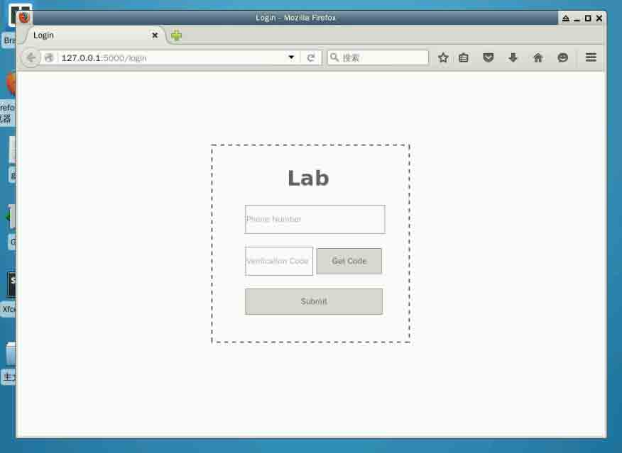
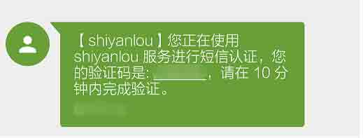
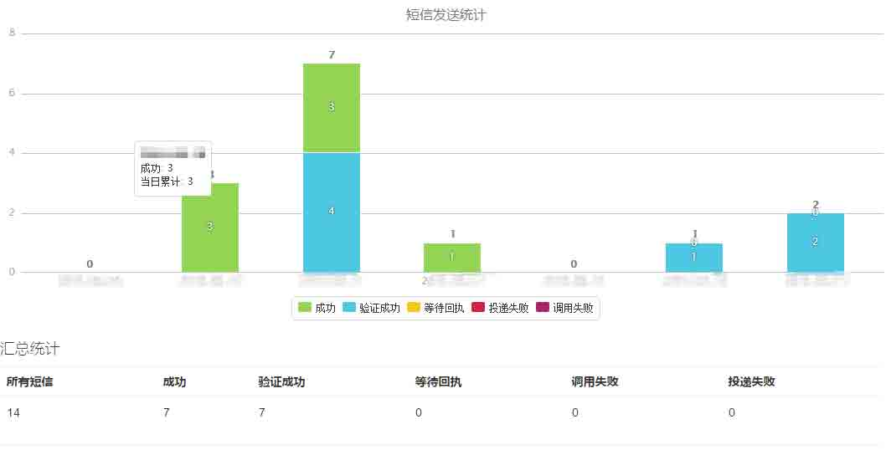
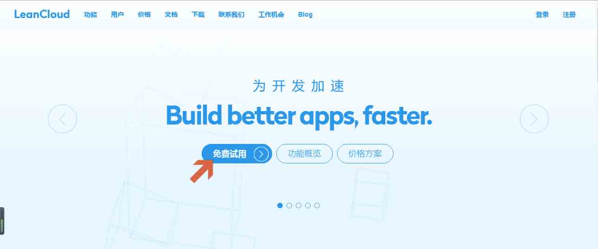
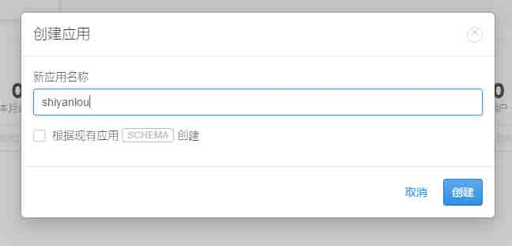
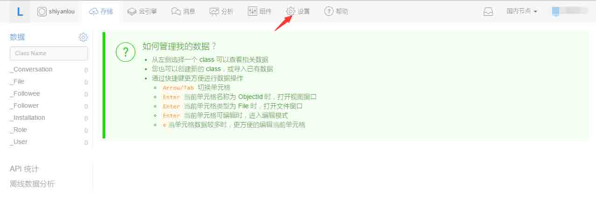
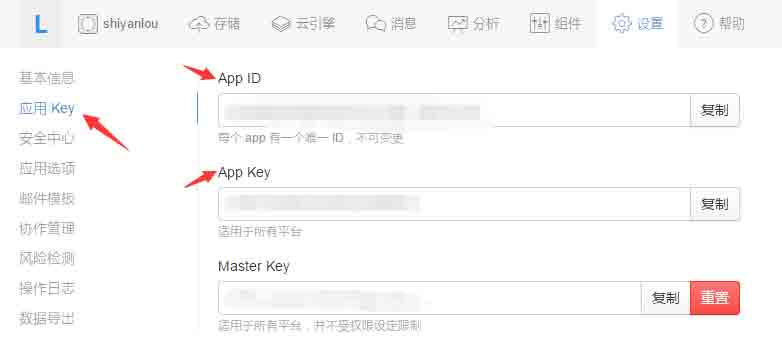
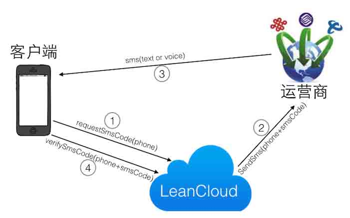
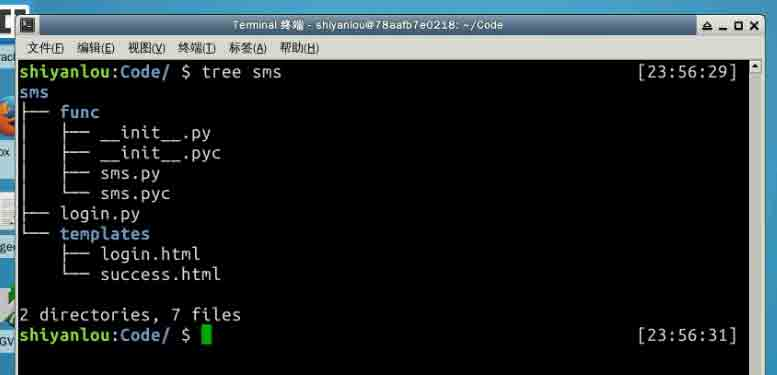
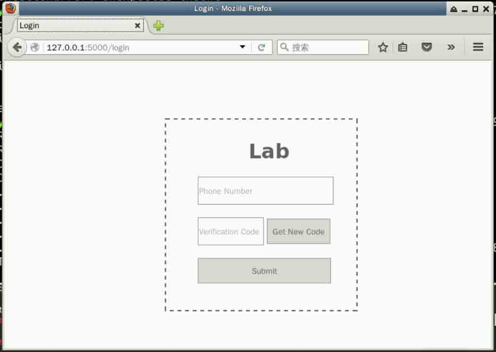

# 第 1 节 基于 Python + LeanCloud 的短信验证

## 一、课程介绍

现在我们每天的生活中几乎都离不开这样的场景：手机新下载了一个 app，在注册的时候使用到手机短信验证进行绑定；在使用某个银行 app 进行特约取款的时候要通过短信的方式获取验证码；使用动态密码登录 CMCC 的时候，动态密码也是通过短信的方式进行发送等等。

因此短信验证也仿佛成了一个人除了身份证之外的另一道有效验证工具。那么肯定有人好奇这种短信验证方式究竟是怎么实现的，事实上要实现这个并不复杂，甚至还非常简单。

接下来这门课就是要向你展示如何去利用 [LeanCloud](https://leancloud.cn/) 提供的 API 来实现一个简单短信验证网页。

### 1.1 课程知识点

通过本次课程的学习，我们将接触到以下知识：

*   LeanCloud 的 REST API 中的短信验证 API 的使用
*   使用 Requests 模块发送 HTTP POST 请求
*   使用 Flask 框架实现简单的网页后台
*   使用 Ajax 实现网页的异步处理
*   使用 JavaScript 实现倒计时

注意：本次课程主要使用语言是 Python 2.7，如果没学过 Python 的同学可以先移步到课程《[Python 快速教程](https://www.shiyanlou.com/courses/214)》学习一些基础的 Python 语法，再回来继续进行本课程。

### 1.2 实验主要流程

1.  注册 LeanCloud
2.  编写后台程序
3.  编写前端程序

### 1.3 所需安装模块

需要安装 Flask 和 requests 模块。

```py
$ sudo pip install flask 
```

```py
$ sudo pip install requests 
```

### 1.4 效果截图

最终效果如下图，因为主要是为了学习 LeanCloud 的短信验证 API ，界面就做的很简单了，大家在学习过程中完全可以按照自己的想法去实现登录界面，然后截图到实验报告里。



手机获取到验证码。



服务器后台打印出收到的请求，以及响应状态。


LeanCloud 控制台的应用界面中可以看到短信验证请求记录。




### 1.5 操作流程

如上图所示，第一栏填写手机号码，然后点击第二栏的 `Get Code` 获取短信验证码，然后输入验证码进行提交验证。

## 二、注册 LeanCloud

首先当然要介绍一下 LeanCloud：

> LeanCloud 是国内领先的针对移动应用的一站式云端服务，BaaS 领域的先行者，专注于为应用开发者提供一流的工具和平台。 > > 以一个 10 万日活的微博类应用为例。按每天 50 万次数据请求（其中 80% 是文本，20% 是图片；文本平均大小 2 KB，图片平均大小 200 KB），后端需要 6 台服务器（2 台应用服务器＋2 台缓存、队列服务器＋2 台数据库）来估算。而 LeanCloud 可以帮助企业抛开后端系统开发负担，专注用户体验和前端实现，加速产品开发进度，更快赢得市场。 > > 参考：[`leancloud.cn/intro.html`](https://leancloud.cn/intro.html)

### 2.1 注册 LeanCloud 获取 Key 和 ID

使用 LeanCloud 提供的 API 需要先进行注册，并创建应用，然后每个应用中都会有相应的 Key 与 ID，在调用 API 的时候需要利用这些信息进行验证，因此我们首先点击下方链接进入 LeanCloud 的官网进行注册。

[**LeanCloud 官方网址**](https://leancloud.cn/)



注册好之后进入“控制台”页面创建应用 "shiyanlou" （应用的名字可以随意起，但是最好是 3 到 11 个字符，因为只有这样 LeanCloud 才能将应用名作为短信签名，此处以 "shiyanlou" 为例）



之后点击刚创建好的应用 "shiyanlou" ，进入到 "shiyanlou" 应用的后台管理界面。



进入“**设置**”页面，我们所需的 Key 与 ID 就在“**应用 Key**”一栏。



至此我们就已经获得了调用 API 所需的 Key 与 ID 了。

### 2.2 短信服务 REST API 简介

> REST API 可以让任何支持发送 HTTP 请求的设备与 LeanCloud 进行交互。使用短信服务 REST API 可以完成很多事情，比如：给指定手机号码发送短信验证码；验证手机号和短信验证码是否匹配；使用手机号和验证码进行登录等等。
> > 想获取更多的关于 REST API 的信息可以自行查看[官方文档](https://leancloud.cn/docs/rest_sms_api.html)。

LeanCloud 的短信验证流程的逻辑比较简单：

> 在短信验证码发送过程中，一共有三方参与：客户端、LeanCloud 和电信运营商（移动、联通、电信），发送、验证短信验证码的过程如下图所示： >  > 1\. 首先是应用客户端向 LeanCloud 请求向特定手机号码发送验证码；
> 2\. LeanCloud 云端收到请求后，生成验证码，然后将完整短信内容发送到运营商通道；
> 3\. 运营商下发短信（或语音）；
> 4\. 应用客户端收到验证码短信后，再向 LeanCloud 验证手机号码和短信验证码的合法性。 > > 参考：[短信服务 REST API 详解](https://leancloud.cn/docs/rest_sms_api.html)

在本次课程中，我们主要要做的事情就是：

1.  给指定手机号码发送短信验证码；
2.  验证手机号和短信验证码是否匹配。

因此用到的 API 主要有两个，如下图，它们的域名为 `https://leancloud.cn`。


但是使用这些 API 前需要在 [控制台 > 设置 > 应用选项 > 其他](https://leancloud.cn/app.html?appid=Vm93P0E4y0kqVX1McT41TENi-gzGzoHsz#/permission) 中开启 启用通用的短信验证码服务（开放 requestSmsCode 和 verifySmsCode 接口） 选项。


#### 2.2.1 给指定手机号码发送短信验证码

参考官方文档可知，要给某个手机号码发送验证短信，可通过如下请求完成：

```py
 curl -X POST \
      -H "X-LC-Id: Vm00P0E4y0kqVX1McT44TENi-gzGzoHac" \
      -H "X-LC-Key: Y5aex4LQOvapYVdyhGrHR8MX" \
      -H "Content-Type: application/json" \
      -d '{"mobilePhoneNumber": "186xxxxxxxx"}' \
      https://api.leancloud.cn/1.1/requestSmsCode 
```

通过分析以上的请求命令可知在使用 `requestSmsCode` API 的时候：

*   请求的 url 为 `https://api.leancloud.cn/1.1/requestSmsCode`
*   发送请求的方式为 `HTTP POST`
*   `headers` 中的内容包括 `X-LC-Id`,`X-LC-Key`,`Content-Type` 。
*   `data` 要求为 JSON 格式，内容为：


> PS: **Curl 或者 cURL**是一个利用 URL 语法在命令行下工作的文件传输工具，1997 年首次发行。它支持文件上传和下载，所以是综合传输工具，但按传统，习惯称 Curl 为下载工具。
> > 参考：维基百科[`zh.wikipedia.org/wiki/CURL`](https://zh.wikipedia.org/wiki/CURL)

#### 2.2.2 验证手机号和短信验证码是否匹配

对于校验验证码的操作，官方文档给出了这样一段命令：

```py
 curl -X POST \
      -H "X-LC-Id: Vm00P0E4y0kqVX1McT44TENi-gzGzoHac" \
      -H "X-LC-Key: Y5aex4LQOvapYVdyhGrHR8MX" \
      -H "Content-Type: application/json" \
      "https://api.leancloud.cn/1.1/verifySmsCode/6 位数字验证码?mobilePhoneNumber=186xxxxxxxx" 
```

分析可知，在使用 `verifySmsCode` API 的时候

*   请求的 url 为 `https://api.leancloud.cn/1.1/verifySmsCode/6 位数字验证码?mobilePhoneNumber=186xxxxxxxx` 。
*   发送请求的方式为 `HTTP POST` 。
*   `headers` 中的内容包括 `X-LC-Id`,`X-LC-Key`,`Content-Type` 。
*   不需要 `data` 内容。

至此所有准备工作与基础知识我们都已经准备好了，接下来就可以开始正式编程实现了。

## 三、编写后台程序

接下来我们要开始编写后台程序，后台程序负责的工作包括：

1.  对浏览器的 GET 或者 POST 请求做出相应的响应。
2.  获取表单中电话号码，发送 POST 请求给 `requestSmsCode` API ，请求给指定电话号码发送验证短信。
3.  获取表单中电话号码与验证码发送给 `requestSmsCode` API 进行验证。

### 3.1 创建项目列表

打开实验桌面，在 `shiyanlou/Code/` 目录底下创建项目文件夹 `sms` ，之后本项目所有文件都位于该文件夹之下。


之后在 `shiyanlou/Code/sms` 目录下创建以下目录文件，其中 `.pyc` 是 `.py` 文件编译产生的二进制文件，不需要自行创建。



创建目录可以使用 `mkdir` 命令，创建文件可以使用 `touch` 命令。

待创建的目录及文件详解：

*   func/：放置自定义模块
    *   __init__.py：使得该目录可以被当作模块导入，虽然 __init__.py 只是一个空文件
    *   sms.py：实现获取短信验证码以及校验验证码
*   login.py：基于 Flask 的简单后台，能响应 GET 与 POST 请求
*   templates：网页渲染模板
    *   login.html：登录验证界面
    *   success.html：验证成功界面

### 3.2 安装 Flask， requests 模块

按照如下指令安装所需模块，之前如果安装过了则跳过此步：

```py
$ sudo pip install flask 
```

```py
$ sudo pip install requests 
```

### 3.3 开始编写后台程序

#### 3.3.1 请求发送验证短信及校验验证码

`sms.py` 主要包含了两个函数：

1.  发送 POST 请求给 `requestSmsCode` API ，请求给指定电话号码发送验证短信的 `send_message()` 。
2.  发送 POST 请求给 `verifySmsCode` API ， 请求校验验证码与手机号的 `verify()`。

> requests 模块 POST 方法的详细用法参考：[requests quick start](http://docs.python-requests.org/en/master/user/quickstart/#make-a-request)

你可以使用 GEdit 或者 Sublime Text 来打开和编写这些源代码文件。

**sms.py：**

```py
import json
import requests

# 请求的头部内容
# 以下的 Id 与 Key 都是无效的仅做示范，在实际试验中请替换成自己的 Id 与 Key
headers = {
    "X-LC-Id": "请替换成自己的 App ID",
    "X-LC-Key": "请替换成自己的 App Key",
    "Content-Type": "application/json",
}

# 请求发送验证码 API
REQUEST_SMS_CODE_URL = 'https://api.leancloud.cn/1.1/requestSmsCode'

# 请求校验验证码 API
VERIFY_SMS_CODE_URL = 'https://api.leancloud.cn/1.1/verifySmsCode/'

def send_message(phone):
    """
    通过 POST 请求 requestSmsCode API 发送验证码到指定手机
    :param phone: 通过网页表单获取的电话号
    :return: 
    """
    data = {
        "mobilePhoneNumber": phone,
    }

    # post 方法参数包含三部分，如我们之前分析 API 所述
    # REQUEST_SMS_CODE_URL: 请求的 URL
    # data: 请求的内容，另外要将内容编码成 JSON 格式
    # headers: 请求的头部，包含 Id 与 Key 等信息
    r = requests.post(REQUEST_SMS_CODE_URL, data=json.dumps(data), headers=headers)

    # 响应 r 的 status_code 值为 200 说明响应成功
    # 否则失败
    if r.status_code == 200:
        return True
    else:
        return False

def verify(phone, code):
    """
    发送 POST 请求到 verifySmsCode API 获取校验结果
    :param phone: 通过网页表单获取的电话号
    :param code: 通过网页表单获取的验证码
    :return: 
    """
    # 使用传进的参数 code 与 phone 拼接出完整的 URL
    target_url = VERIFY_SMS_CODE_URL + "%s?mobilePhoneNumber=%s" % (code, phone)

    # 这里的 POST 方法只传入了两个参数
    # target_url： 请求的 URL
    # headers: 请求的头部，包含 Id 与 Key 等信息
    r = requests.post(target_url, headers=headers)

    # 响应 r 的 status_code 值为 200 说明验证成功
    # 否则失败
    if r.status_code == 200:
        return True
    else:
        return False 
```

#### 3.3.2 编写基于 Flask 框架的网页后台

`login.py` 使用了 Flask 框架，但是涉及的并不深入，所以不懂得这个框架的同学也不用慌，参考下边的快速入门链接，花个十几分钟学会如何使用 Flask 框架写出 `Hello World` 便足够看懂以下代码。

> 补充：Flask 是一个使用 Python 编写的轻量级 Web 应用框架。基于 Werkzeug WSGI 工具箱和 Jinja2 模板引擎。 Flask 使用 BSD 授权。 > > Flask 也被称为“microframework”，因为它使用简单的核心，用 extension 增加其他功能。Flask 没有默认使用的数据库、窗体验证工具。然而，Flask 保留了扩增的弹性，可以用 Flask-extension 加入这些功能：ORM、窗体验证工具、文件上传、各种开放式身份验证技术。
> > 参考 1：[维基百科 Flask](https://zh.wikipedia.org/wiki/Flask)
> 参考 2：[Flask 快速入门](http://docs.jinkan.org/docs/flask/quickstart.html)

**login.py：**

```py
from flask import *
from func import sms

app = Flask(__name__)

@app.route("/login", methods=['POST', 'GET'])
def do_login():
    """
    进行登录验证
    :return:
    """
    error_msg = None
    if request.method == 'GET':
        # 获取 GET 请求参数
        phone_number = request.args.get('mobile_phone_number')
        if phone_number is not None:
            if sms.send_message(phone_number):
                return render_template('login.html')
            else:
                error_msg = 'Failed to get the verification code!'
    elif request.method == 'POST':
        phone_number = request.form['phone']
        code = request.form['code']
        if code == '':
            error_msg = 'Please input the verification code!'
        elif sms.verify(phone_number, code):
            return redirect(url_for('success'))
        else:
            error_msg = 'Your code is wrong, please check again!'
    return render_template('login.html', error_msg=error_msg)

@app.route("/success")
def success():
    return render_template('success.html')

if __name__ == "__main__":
    # 在调试模式下启动本地开发服务器
    app.run(debug=True) 
```

## 四、编写前端程序

前端涉及的主要是 HTML、JavaScript 和 CSS 的知识，既然本次实验是以学习 LeanCloud 的短信验证 API 为主，那么这些就不是我们要关心的重点。

前端的实现中使用到了简单的 **Ajax 异步处理**和 **JavaScript 的倒计时**，这里提供源代码，感兴趣的同学不妨看看，而不想写前端的同学也可以直接复制使用。

> 补充：AJAX = Asynchronous JavaScript and XML（异步的 JavaScript 和 XML）。 AJAX 不是新的编程语言，而是一种使用现有标准的新方法。 AJAX 是在不重新加载整个页面的情况下与服务器交换数据并更新部分网页的技术。
> > 参考：[AjAX](http://www.w3school.com.cn/ajax/)

**login.html：**

```py
<!DOCTYPE html>
<html lang="en">
<head>
    <meta charset="UTF-8">
    <title>Login</title>

    <script type="text/javascript">
    var cur_count;
    var count = 60; // 重复发送验证码的周期(s)
    var InterValObj;
    var phone_number;
    function send_message()
    {
        // 获取用户输入的手机号码
        // 如果手机号码为空则弹窗提醒
        // 否则使用 ajax 将号码提交给后台，并且开始倒计时
        phone_number = document.getElementById("phone").value
        if(phone_number)
        {
            cur_count = count;

            // 设置按钮属性，使按钮不能响应点击事件
            document.getElementById("getCode").setAttribute("disabled", "true");
            document.getElementById("getCode").value = "waiting for "+cur_count+"s";

            // HTML DOM setInterval() 方法可以按照指定的周期（毫秒单位）来调用函数或计算表达式
            // 这里我们以 1000 毫秒为周期重复调用 set_remain_time() 函数实现倒计时
            InterValObj = window.setInterval(set_remain_time, 1000);

            // 发送请求
            loadXMLDoc();
        }
        else
        {
            alert('Please input phone number!')
        }
    }

    function set_remain_time()
    {
        if (cur_count == 0)
        {
            // 将 InterValObj 传递给 clearInterval， 从而取消对 set_remian_time() 的重复调用
            window.clearInterval(InterValObj);

            // 恢复按钮响应点击事件
            document.getElementById("getCode").removeAttribute("disabled");
            document.getElementById("getCode").value = "Get New Code";
        }else
        {
            cur_count--;
            document.getElementById("getCode").value = "waiting for "+cur_count+"s";
        }
    }

    function loadXMLDoc()
    {
        var xmlhttp = new XMLHttpRequest();
        xmlhttp.open("GET", "login?mobile_phone_number=" + phone_number, true);
        xmlhttp.send();
    }
    </script>

    <style>
        #phone{
            position:relative;
            top:10px;
            left:50px;
            width:210px;
        }
        #code{
            position:relative;
            top:30px;
            left:50px;
            width:100px;
        }
        #getCode{
            position:relative;
            top:30px;
            left:50px;
            width:100px;
        }
        #submit{
            position:relative;
            top:50px;
            left:50px;
            width:210px;
        }
        #getCode:hover,#submit:hover{
            cursor:pointer;
            background-color:#666;
            color:#FFF;
        }
        input,button{
            border:1px solid #999;
            height:40px;
            color:#666;
        }
        .h1{
            position:relative;
            top:10px;
            left:130px;
            color:#666;
        }
        .box{
            top:20%;
            left:33%;
            height:300px;
            width:300px;
            border:dashed 2px #666;
            position:absolute;
        }
        .warning{
            position:absolute;
            left:33%;
            top:80%;
        }
    </style>
</head>

<body>
<div class="box">
    <h1 class="h1">Lab</h1>
    <form action="#" method="post">
    <div>
        <input type="text" id="phone" name="phone" placeholder="Phone Number">
    </div>
    <div>
        <input type="text" id="code" name="code" placeholder="Verification Code">
        <input type="button" id ="getCode" onclick="send_message()" value = "Get Code"/>
    </div>
    <div>
        <button type="submit" id="submit">Submit</button>
    </div>
    </form>

</div>

    <p style="color:red" class="warning" >{{ error_msg }}</p>

    <p class="warning"></p>

</body>
</html> 
```

**success.html：**

```py
<!DOCTYPE html>
<html lang="en">
<head>
    <meta charset="UTF-8">
    <title>Title</title>
</head>
<body>
    <h1>success!</h1>
</body>
</html> 
```

## 五、运行

在整个实验完成后，进入 `shiyanlou/Code/sms` 文件夹中，运行命令：

```py
$ python login.py 
```


然后打开浏览器访问 `127.0.0.1:5000/login` 进行测试。

> 注意：访问的完整 URL 是 `http://127.0.0.1:5000/login`。



## 六、实验总结

通过这门课程，我们学习了如何利用 LeanCloud 提供的 REST API 来实现短信验证，这个 API 的使用相对来说还是比较简单。

此外 LeanCloud 还提供了数据存储、消息推送、实时通信等 API 给开发者使用，善用这些 API 可以给我们在开发过程中减去不少工作量。

> 温馨提示：
> 同学们要记得在实验之后及时完成实验报告并且上传，有不懂的问题欢迎留言交流和讨论。

你还可以通过以下命令获取实验源码：

```py
$ wget http://labfile.oss.aliyuncs.com/courses/609/sms.tar 
```

> 温馨提示：
> 下载之后记得先将 `func/sms.py` 文件中 `X-LC-Id` 和 `X-LC-Key` 替换成你自己申请所得到的相应值，否则程序将无法正常完成验证。

## 参考资料

*   Python requests 快速入门 - [`docs.python-requests.org/zh_CN/latest/user/quickstart.html`](http://docs.python-requests.org/zh_CN/latest/user/quickstart.html)
*   Flash 快速入门 - [`docs.jinkan.org/docs/flask/quickstart.html`](http://docs.jinkan.org/docs/flask/quickstart.html)
*   Ajax 介绍 - [`www.w3school.com.cn/ajax/index.asp`](http://www.w3school.com.cn/ajax/index.asp)
*   LeanCloud 官网 - [`leancloud.cn/`](https://leancloud.cn/)