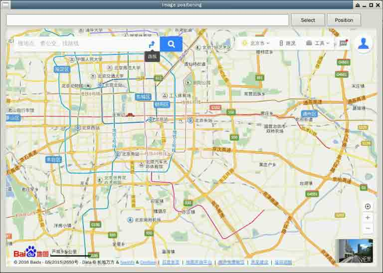
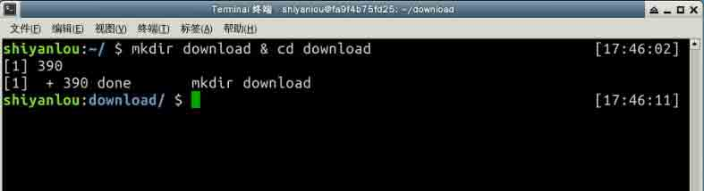
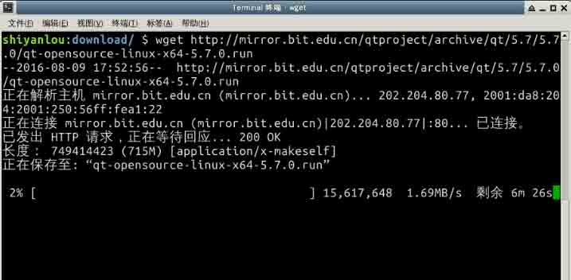
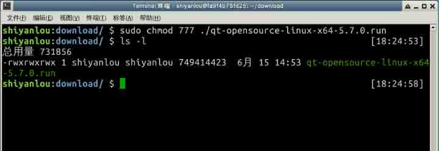
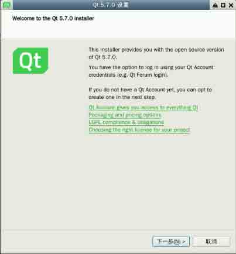
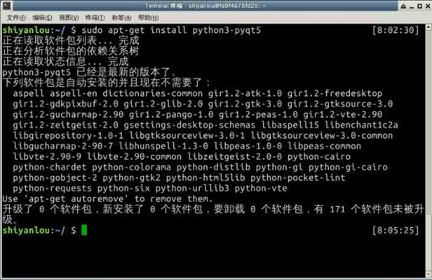
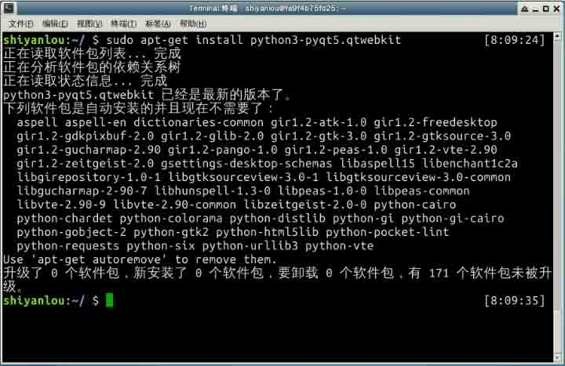
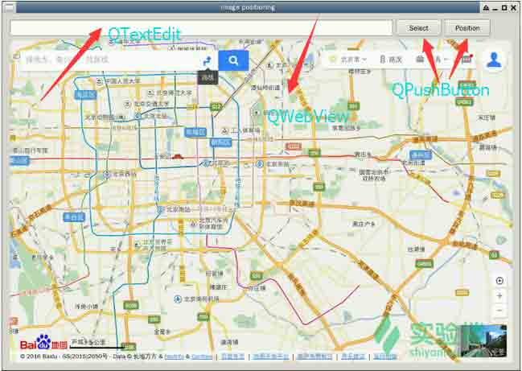
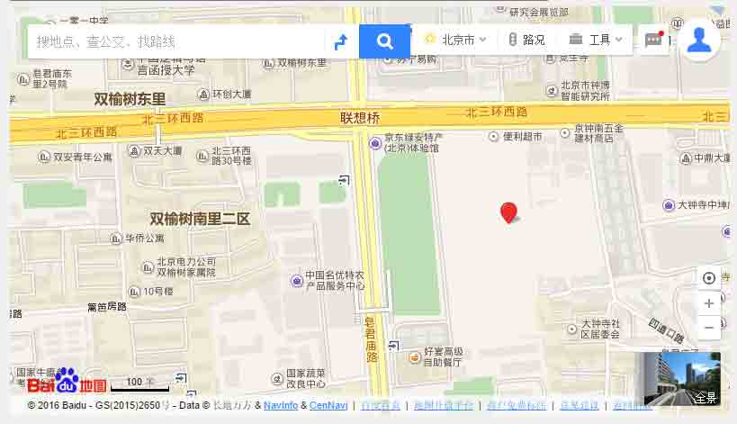

# 第 1 节 基于 PyQt5 实现地图中定位相片拍摄位置

## 一、实验说明

### 1\. 实验介绍

本次实验主要学习了如何查找相片中的 Exif 信息，并通过 Exif 信息中的 GPS 数据在百度地图中进行定位标点，以确定相片的拍摄地点。本次实验的目的旨在通过包含 GPS 信息的相片进行取证调查，当然个人娱乐也可以！

### 2\. Python 版本

*   Python 3.x

### 3\. 知识点

实验中将会学习并实践以下知识点：

*   PyQt5 框架基本 GUI 组件的使用
*   PyQt5 中信号和槽的用法
*   PyQt5 中 QWebView 的基本用法
*   百度地图 URL API 标点功能的用法
*   利用 piexif 库实现相片 GPS 信息的提取

### 4\. 效果图



## 二、理论基础

以下内容整理自百度百科、维基百科，参考链接：

*   [Exif](http://baike.baidu.com/link?url=-WWoCjmdk8sQnxeWkOz6BogljYOMDdanzWsXWd2cqEDdgwFVNgaXlqq17DiGJ8eWga7dX_XNHZEJd5Q6pjFsMq)
*   [PyQt5](https://en.wikipedia.org/wiki/PyQt)
*   [Qt](http://wiki.qt.io/Main)
*   [百度地图-URI API](http://lbsyun.baidu.com/index.php?title=uri)

### 1\. Exif

Exif 是一种图像文件格式，它的数据存储与 JPEG 格式是完全相同的。实际上 Exif 格式就是在 JPEG 格式头部插入了数码照片的信息，包括拍摄时的光圈、快门、白平衡、ISO、焦距、日期时间等各种和拍摄条件以及相机品牌、型号、色彩编码、拍摄时录制的声音以及 GPS 全球定位系统数据、缩略图等。这节课我们只用到了 Exif 中的 ** GPS 信息**，将 ****GPS 信息 提取出之后，我们就可以用 **经纬度** 来定位相片拍摄的位置了。

### 2\. PyQt5

PyQt 是由 Phil Thompson 开发的一个创建 GUI 应用程序的工具包。它是 Python 编程语言和 Qt 库的成功融合。目前有两个分支，分别是 PyQt5 和 PyQt4。PyQt4 基于 Qt4 开发，PyQt5 则是 Python 基于 Qt5 开发的。由于 Qt5 相对于 Qt4 来说增加了很多新特性，所以这次实验我们将采用 PyQt5 来实现本次实验的 GUI。

### 3\. 信号与槽

**信号** 与 **槽**是 Qt 中的 **核心机制**。在创建事件循环之后，通过建立信号与槽的连接可以实现对象之间的通信。当信号发射时，连接的槽函数将会自动执行。在 **PyQt5** 中信号和槽通过 `object.signal.connect()` 的方式连接。

### 4\. 百度地图-URI API

百度地图 URI API 是为开发者提供直接调起百度地图产品（百度 Web 地图、百度地图手机客户端）以满足特定业务场景下应用需求的程序接口，我们只需按照接口规范构造一条标准的 URI，就可以在 PC 和移动端浏览器或移动开发应用中调起百度地图产品，进行地图展示和检索、线路查询、导航等功能，无需进行复杂的地图功能开发。在本次试验中，我们只需要用到百度地图-URI API 中的 **反地址解析** 接口，调用该接口可调起 PC 或 Web 百度地图，经过逆地理编码后，以标注形式显示出位置和地址信息，详细文档请参考[web 端 URI API](http://lbsyun.baidu.com/index.php?title=uri/api/web)。使用方法如下：

服务地址

> http://api.map.baidu.com/geocoder //PC&Webapp 服务地址

参数说明

```py
| 参数名称     | 参数说明       | 是否必选 | 备注 |
| ------------ |:-------------:|:-------------:| -----:|
| location  | lat<纬度>,lng<经度>| 必选         |  |
| output    | 表示输出类型，web 上必须指定为 html 才能展现地图产品结果。| 必选          | 手机客户端忽略此参数 |
| coord_type| 坐标类型，可选参数，默认为 bd09 经纬度坐标。允许的值为 bd09ll、bd09mc、gcj02、wgs84。bd09ll 表示百度经纬度坐标，bd09mc 表示百度墨卡托坐标，gcj02 表示经过国测局加密的坐标，wgs84 表示 gps 获取的坐标。| 可选          |   |
| zoom      | 展现地图的级别，默认为视觉最优级别。| 可选          |   |
| src       | appName| 必选  | 此参数不传值，不保证服务。  |
```

示例

> http://api.map.baidu.com/geocoder?location=39.990912172420714,116.32715863448607&coord_type=gcj02&output=html&src=yourCompanyName|yourAppName

## 三、环境配置

`工欲善其事，必先利其器`，现在我们就来把我们的开发环境搭建起来。PyQt5 依赖 Qt5,我们先把 Qt 安装上。

新建个下载目录：

```py
mkdr download & cd download 
```



下载 Qt 5.7.0：

```py
wget http://mirror.bit.edu.cn/qtproject/archive/qt/5.7/5.7.0/qt-opensource-linux-x64-5.7.0.run 
```



下载下来可能没有执行权限，我们更改一下权限：

```py
sudo chmod 777 qt-opensource-linux-x64-5.7.0.run 
```



开始安装，一路 next 就可以了：

```py
./qt-opensource-linux-x64-5.7.0.run 
```



接下来安装 PyQt5：

```py
sudo apt-get install python3-pyqt5 
```



这样安装完 PyQt5 默认不带 `QWebKit` 模块，现在我们需要手动安装一下：

```py
sudo apt-get install python3-pyqt5.qtwebkit 
```



至此我们的开发环境就搭建好了。

## 四、代码实现

在代码实现之前我们先看一下我们要实现的效果：



界面用到了 `QLineEdit`、`QPushButton` 以及 `QWebView`。

`QLineEdit` 允许用户输入或者编辑单行的纯文本，我们用它来显示我们的图片路径。

`QPushButon` 是一个按钮，当用户点击的时候会发射 clicked()信号。我们用它来实现一个选择图片的按钮和定位的按钮。

`QWebView` 是一个可以显示和编辑 Web 文档的组件，相当于一个最简单的浏览器，我们用它来加载地图，实现定位功能。

现在我们来实现主界面，先导入我们要用到的库：

```py
from PyQt5.QtWebKitWidgets import *
from PyQt5.QtWidgets import *
from PyQt5.QtCore import *
from PyQt5 import QtWidgets,QtCore,QtGui
import piexif
import sys 
```

实现一个 `MainWindow` 类,用作主界面， GUI 的组件我们在`MainWindow` 的 `__init__()` 函数中布局：

```py
class MainWindow(QWidget):                                  #继承 QWidget
    def __init__(self):
        super(MainWindow,self).__init__()
        self.lat = ''                                          #纬度
        self.lng = ''                                          #经度
        self.fileName = ''                                     #图片路径
        self.setWindowTitle('Image positioning')               #设置窗口标题
        self.verticalLayout_2 = QtWidgets.QVBoxLayout()        #创建垂直布局
        self.verticalLayout = QtWidgets.QVBoxLayout()
        self.horizontalLayout = QtWidgets.QHBoxLayout()        #创建水平布局

        # 创建 QTextEdit
        self.textEdit = QtWidgets.QTextEdit()
        # 设置布局尺寸
        sizePolicy = QtWidgets.QSizePolicy(QtWidgets.QSizePolicy.Expanding, QtWidgets.QSizePolicy.Fixed)
        sizePolicy.setHorizontalStretch(0)
        sizePolicy.setVerticalStretch(0)
        sizePolicy.setHeightForWidth(self.textEdit.sizePolicy().hasHeightForWidth())
        self.textEdit.setSizePolicy(sizePolicy)
        self.textEdit.setMaximumSize(QtCore.QSize(16777215, 30))
        self.horizontalLayout.addWidget(self.textEdit)          #将 QTextEdit 添加到水平布局中

        # 创建 selectButton
        self.selectButton = QtWidgets.QPushButton('Select')
        sizePolicy = QtWidgets.QSizePolicy(QtWidgets.QSizePolicy.Preferred, QtWidgets.QSizePolicy.Preferred)
        sizePolicy.setHorizontalStretch(0)
        sizePolicy.setVerticalStretch(0)
        sizePolicy.setHeightForWidth(self.selectButton.sizePolicy().hasHeightForWidth())
        self.selectButton.setSizePolicy(sizePolicy)
        self.horizontalLayout.addWidget(self.selectButton)

        # 创建 positionButton
        self.positionButton = QtWidgets.QPushButton('Position')
        sizePolicy = QtWidgets.QSizePolicy(QtWidgets.QSizePolicy.Preferred, QtWidgets.QSizePolicy.Preferred)
        sizePolicy.setHorizontalStretch(0)
        sizePolicy.setVerticalStretch(0)
        sizePolicy.setHeightForWidth(self.positionButton.sizePolicy().hasHeightForWidth())
        self.positionButton.setSizePolicy(sizePolicy)
        self.horizontalLayout.addWidget(self.positionButton)
        spacerItem = QtWidgets.QSpacerItem(40, 20, QtWidgets.QSizePolicy.Preferred, QtWidgets.QSizePolicy.Minimum)
        self.horizontalLayout.addItem(spacerItem)
        self.verticalLayout.addLayout(self.horizontalLayout)

        #创建 QWebView
        self.webView = QWebView()
        self.webView.load(QUrl('http://map.baidu.com/'))
        self.verticalLayout.addWidget(self.webView)
        self.verticalLayout_2.addLayout(self.verticalLayout)
        self.setLayout(self.verticalLayout_2)

        self.positionButton.clicked.connect(self.reload)        #连接 clicked 信号到 self.reload()槽
        self.selectButton.clicked.connect(self.getPosition)     #连接 clicked 信号到 self.getPosition()槽 
```

在 `MainWindow` 的构造函数中我们创建了 `QTextEdit`、`QPushButon` 和 `QWebView` 对象，将 `QWebView` 默认加载了[百度地图首页](http://map.baidu.com/)，并完成了相应的布局。在这个函数最后我们还连接了两个槽函数。分别是`reload()`槽和`getPosition()`槽。这里的槽其实就是一个`普通的函数`，实现我们想要的功能即可。

至此我们的界面就写完了，现在我们来实现 `reload()` 槽,用于 `QWebView` 重新加载指定的 URI：

```py
 #QWebView 加载 URI
        def reload(self):  
        self.webView.load(QUrl('http://api.map.baidu.com/geocoder?location= %s,%s&coord_type=gcj02&output=html&src=personal|img_pos' % (self.lat,self.lng))) 
```

可以看到 `QWebView` 加载一个页面非常简单，我们只需要把地址传递给 `QWebView` 的 `load()` 函数即可。URI 参数这里我们用字符串格式化的方式来替换我们预先计算好 `lat` 和 `lng` 参数,公司名和应用名这里随便起一个就可以，但是一定要有！

现在我们来实现 `getPosition()` 槽，`getPosition()` 中需要实现选择图片，并且获 GPS 信息，这里我们需要用到 Python 的一个第三方库 `piexif`,这个库可以读取和修改相片中的 Exif 信息：

```py
 def getPosition(self): #获取相片中的经纬度并通过 QWebView 调用百度 URI API 实现定位功能
        fileDialog = QFileDialog()          #创建文件对话框对象
        self.fileName = fileDialog.getOpenFileName()[0]     #打开文件对话框并获取选择的相片路径
        self.textEdit.setText(self.fileName)                #将相片路径名显示到 QTextEdit 上
        exifData = piexif.load(self.fileName)               #加载图片并返回 Exif 数据字典
        if exifData['GPS']:                                 #判断是否包含 GPS 数据

            for k,v in exifData['GPS'].items():
                print('-->>',k,v)
            try:
                self.lat = self.d2l(exifData['GPS'][2])     #获取 GPS 信息中的纬度（度分秒）
                self.lng = self.d2l(exifData['GPS'][4])     #获取 GPS 信息中的经度（度分秒）
                print('lat:',self.lat)
                print('lng:',self.lng)
            except:
                msg = QMessageBox.information(self,'Error','To locate failure!') #消息提示框
        else:
            msg = QMessageBox.information(self, 'warning', "This picture doesn't contain the GPS information!") 
```

在 `getPosition()` 槽中，我们首先创建了一个 `QFileDialog()` 对象，用来选择相片路径。接下来用 `piexif.load()` 函数加载相片，并返回包含 Exif 信息的字典。如果 Exif 中包含 GPS 信息，我们直接将 GPS 字典中下标为 **2** 的纬度和下标为 **4** 的经度取出来，由于取出的经纬度值是 **度、分、秒** 的格式，我们通过 `d2l()` 方法将 **度、分、秒** 格式的经纬度转换成 **度**。

现在我们来看一下 `d2l()` 方法：

```py
 def d2l(self,gpsData):  #GPS 经纬度元组转经纬度
        d = gpsData[0][0] / gpsData[0][1]   #度
        m = gpsData[1][0] / gpsData[1][1]   #分
        s = gpsData[2][0] / gpsData[2][1]   #秒
        return str(d + (m + s / 60) / 60) 
```

这个方法接收 GPS 数据数组，并返回 **度、分、秒** 格式的数组转换成 **度** 的值。

至此，我们的实现就完成了。整个过程就是使用 `piexif` 库获取图片 Exif 信息中的 GPS 数据，并通过 PyQt5 中的 `QWebView` 显示百度地图，并根据百度地图提供的 **URI API** 在百度地图中定位我们获得的经纬度。

## 五、代码整合

接下来我们把上面写好的代码整合起来，先看实现：

```py
#!/usr/bin/env python3
# -*- coding: utf-8 -*-

from PyQt5.QtWebKitWidgets import *
from PyQt5.QtWidgets import *
from PyQt5.QtCore import *
from PyQt5 import QtWidgets,QtCore,QtGui
import piexif
import sys

class MainWindow(QWidget):                                  #继承 QWidget
    def __init__(self):
        super(MainWindow,self).__init__()
        self.lat = ''                                          #纬度
        self.lng = ''                                          #经度
        self.fileName = ''                                     #图片路径
        self.setWindowTitle('Image positioning')               #设置窗口标题
        self.verticalLayout_2 = QtWidgets.QVBoxLayout()        #创建垂直布局
        self.verticalLayout = QtWidgets.QVBoxLayout()
        self.horizontalLayout = QtWidgets.QHBoxLayout()        #创建水平布局

        # 创建 QTextEdit
        self.textEdit = QtWidgets.QTextEdit()
        # 设置布局尺寸
        sizePolicy = QtWidgets.QSizePolicy(QtWidgets.QSizePolicy.Expanding, QtWidgets.QSizePolicy.Fixed)
        sizePolicy.setHorizontalStretch(0)
        sizePolicy.setVerticalStretch(0)
        sizePolicy.setHeightForWidth(self.textEdit.sizePolicy().hasHeightForWidth())
        self.textEdit.setSizePolicy(sizePolicy)
        self.textEdit.setMaximumSize(QtCore.QSize(16777215, 30))
        self.horizontalLayout.addWidget(self.textEdit)          #将 QTextEdit 添加到水平布局中

        # 创建 selectButton
        self.selectButton = QtWidgets.QPushButton('Select')
        sizePolicy = QtWidgets.QSizePolicy(QtWidgets.QSizePolicy.Preferred, QtWidgets.QSizePolicy.Preferred)
        sizePolicy.setHorizontalStretch(0)
        sizePolicy.setVerticalStretch(0)
        sizePolicy.setHeightForWidth(self.selectButton.sizePolicy().hasHeightForWidth())
        self.selectButton.setSizePolicy(sizePolicy)
        self.horizontalLayout.addWidget(self.selectButton)

        # 创建 positionButton
        self.positionButton = QtWidgets.QPushButton('Position')
        sizePolicy = QtWidgets.QSizePolicy(QtWidgets.QSizePolicy.Preferred, QtWidgets.QSizePolicy.Preferred)
        sizePolicy.setHorizontalStretch(0)
        sizePolicy.setVerticalStretch(0)
        sizePolicy.setHeightForWidth(self.positionButton.sizePolicy().hasHeightForWidth())
        self.positionButton.setSizePolicy(sizePolicy)
        self.horizontalLayout.addWidget(self.positionButton)
        spacerItem = QtWidgets.QSpacerItem(40, 20, QtWidgets.QSizePolicy.Preferred, QtWidgets.QSizePolicy.Minimum)
        self.horizontalLayout.addItem(spacerItem)
        self.verticalLayout.addLayout(self.horizontalLayout)

        #创建 QWebView
        self.webView = QWebView()
        self.webView.load(QUrl('http://map.baidu.com/'))
        self.verticalLayout.addWidget(self.webView)
        self.verticalLayout_2.addLayout(self.verticalLayout)
        self.setLayout(self.verticalLayout_2)

        self.positionButton.clicked.connect(self.reload)        #连接 clicked 信号到 self.reload()槽
        self.selectButton.clicked.connect(self.getPosition)     #连接 clicked 信号到 self.getPosition()槽

    def d2l(self,gpsData):  #GPS 经纬度元组转经纬度
        d = gpsData[0][0] / gpsData[0][1]   #度
        m = gpsData[1][0] / gpsData[1][1]   #分
        s = gpsData[2][0] / gpsData[2][1]   #秒
        return str(d + (m + s / 60) / 60)

    def getPosition(self): #获取相片中的经纬度并通过 QWebView 调用百度 URI API 实现定位功能
        fileDialog = QFileDialog()          #创建文件对话框对象
        self.fileName = fileDialog.getOpenFileName()[0]     #打开文件对话框并获取选择的相片路径
        self.textEdit.setText(self.fileName)                #将相片路径名显示到 QTextEdit 上
        exifData = piexif.load(self.fileName)               #加载图片并返回 Exif 数据字典
        if exifData['GPS']:                                 #判断是否包含 GPS 数据

            for k,v in exifData['GPS'].items():
                print('-->>',k,v)
            try:
                self.lat = self.d2l(exifData['GPS'][2])     #获取 GPS 信息中的纬度（度分秒）
                self.lng = self.d2l(exifData['GPS'][4])     #获取 GPS 信息中的经度（度分秒）
                print('lat:',self.lat)
                print('lng:',self.lng)
            except:
                msg = QMessageBox.information(self,'Error','To locate failure!') #消息提示框
        else:
            msg = QMessageBox.information(self, 'warning', "This picture doesn't contain the GPS information!")

    #QWebView 加载 URI
        def reload(self):  
        self.webView.load(QUrl('http://api.map.baidu.com/geocoder?location= %s,%s&coord_type=gcj02&output=html&src=personal|img_pos' % (self.lat,self.lng)))

if __name__ == '__main__':
    app = QtWidgets.QApplication(sys.argv)
    window = MainWindow()
    window.show()
    app.exec() 
```

这里我们在脚本执行的开始，创建了一个 `QtWidgets.QApplication(sys.argv)` 对象,这个对象负责管理图形用户界面应用程序的 **控制流** 和 **主要设置**，并包含主线程的 **事件循环**。事件循环类似于 Windows 程序设计中的 **消息队列**，负责处理信号和槽之间的关系调用，也就是说没有事件循环，信号和槽连接之后也是没有效果的。`app.exec()` 就是开启了主线程中的事件循环。至此，我们的脚本就全部实现完了。

现在来看一下相片定位的效果，同学们最好用自己手机拍摄出的图片来测试。因为上传到网络上的图片一般都会进行处理，Exif 信息可能会丢失，也就无法完成相片拍摄位置的定位。



可以看到地图中标注了一个 **红点**，这个就是我测试相片的拍摄位置。

## 六、总结

通过本次实验我们应该对 PyQt5 这个 GUI 库有所了解，并能了解 GUI 应用程序的开发思路。同时应该了解如何从相片中获取 Exif 信息，以及如何用 `QWebView` 加载百度地图。当然这次实验仅仅利用了 GPS 信息，同学们还可以通过其他信息来扩展一下思路，写一个有用处的脚本。

## 七、参考文献

*   《Python 绝技--运用 Python 成为顶级黑客》
*   《Python 黑帽子-- 黑客与渗透测试编程之道》