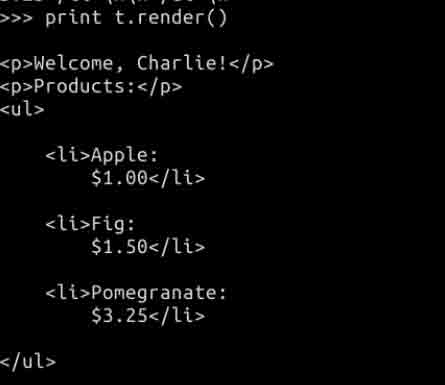
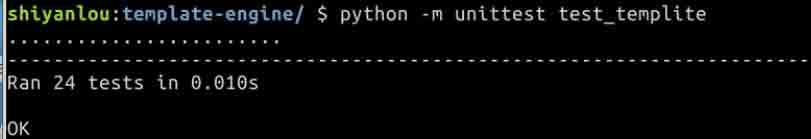

# 第 1 节 Python 实现模板引擎

## 一、课程介绍

### 1\. 课程来源

本课程核心部分来自[《500 lines or less》](https://github.com/aosabook/500lines/tree/master/template-engine)项目，作者是来自 edX 的工程师 Ned Batchelder，这是他的博客：http://nedbatchelder.com 。项目代码使用 MIT 协议，项目文档使用 [`creativecommons.org/licenses/by/3.0/legalcode`](http://creativecommons.org/licenses/by/3.0/legalcode) 协议。

课程内容在原文档基础上做了稍许修改，增加了部分原理介绍，步骤的拆解分析及源代码注释。

### 2\. 内容简介

模版引擎使得用户界面能够与业务数据分离，前端与后端分离，它通常用于渲染页面文件。本课程将使用`Python`实现一个具备基础功能的模板引擎。

### 3\. 课程知识点

本课程项目完成过程中，我们将学习：

1.  实现模版引擎的原理与方法
2.  如何编写程序生成代码

## 二、实验环境

打开终端，进入 `Code` 目录，创建 `template-engine` 文件夹, 并将其作为我们的工作目录。

```py
$ cd Code
$ mkdir template-engine && cd template-engine 
```

## 三、实验原理

### 模板介绍

大部分程序都存在大量的逻辑设计和少部分的文字数据，编程语言为此而生。但有时候也会遇到只需要少部分逻辑设计但却要处理大量文字数据的情况，对于这类，还是有一个专门的工具来处理比较好，模板引擎为此而生。

以`Web`应用为例，它在服务器端生成`html`页面由客户端的浏览器解析渲染。因为大量的页面存在用户名、商品列表、朋友圈动态等动态数据，所以就需要程序动态地生成页面。并且我们也希望静态文本(`html`标记)的部分能够完全交由前端设计师完成，后端只用专心负责动态文本的生成。

先从一个简单的例子开始，我们想要生成以下`HTML`文本：

```py
<p>Welcome, Charlie!</p>
<p>Products:</p>
<ul>
    <li>Apple: $1.00</li>
    <li>Fig: $1.50</li>
    <li>Pomegranate: $3.25</li>
</ul> 
```

其中出现的动态文本有用户姓名，商品名，商品售价。同时商品种类的数量也并不是固定的。

为了生成这段`HTML`文本，我们将静态文本作为字符串常量存储，动态文本通过`format`格式化进字符串：

```py
# 页面的主要文本，其中 name 和 products 是动态的部分
PAGE_HTML = """
<p>Welcome, {name}!</p>
<p>Products:</p>
<ul>
{products}
</ul>
"""

# 商品项的的主要文本，prodname 与 price 是动态部分
PRODUCT_HTML = "<li>{prodname}: {price}</li>\n"

def make_page(username, products):
    #存储商品列表文本
    product_html = ""
    for prodname, price in products:
        product_html += PRODUCT_HTML.format(
            prodname=prodname, price=format_price(price))
    html = PAGE_HTML.format(name=username, products=product_html)
    return html 
```

虽然这段代码奏效了，但是看上去有点混乱。静态文本被分成了`PAGE_HTML`与`PRODUCT_HTML`两部分，而且动态数据格式化的细节操作都在`Python`代码中，使得前端设计师不得不去修改`Python`文件。随着代码量的增多，这段代码也会渐渐变得难以维护。

更好的做法是使用模板，整个`html`文件就可以作为一个模板，需要动态文本填充的部分就使用标签标识。

模板化后的模板文件（html 文件）：

```py
<p>Welcome, {{user_name}}!</p>
<p>Products:</p>
<ul>

    <li>{{ product.name }}:
        {{ product.price|format_price }}</li>

</ul> 
```

对比之前的代码是`HTML`文本嵌在`Python`代码中，现在的代码是把`HTML`文本的部分完全拿了出来而在其中嵌了少许逻辑。

我们知道字符串可以通过`format`函数将数据代入，而模板将`format`的功能进行了扩展，它可以支持条件判断与循环等逻辑，因此模版也可以看作是`format`的高级版吧。

想要在程序中使用`HTML`模板，首先需要一个模板引擎，模版引擎能够结合`HTML`模板与上下文环境（包括准备导入的数据等）生成完整的 html 页面，它的工作就是解析模板，将其中动态的部分与数据进行替换。

当然模板引擎不一定非用在生成`html`页面上，它就是一个生成文本的引擎，用在什么类型的文本上都是合适的。

### 模板使用的语法

模板引擎因其支持的语法而异，本课程中使用的引擎语法基于`Django` - 一个非常流行的 web 框架。

代入数据使用双花括号：

```py
<p>Welcome, {{user_name}}!</p> 
```

有时候我们希望传入一个对象或者词典，那在模板中要怎么取得对象的属性或者词典的键值呢。

如果是在`Python`中，取得的语法都是不一样的。

```py
dict["key"]
obj.attr
obj.method() 
```

而在模版中，则是统一使用点：

```py
dict.key
obj.attr
obj.method 
```

用例如下：

```py
<p>The price is: {{product.price}}, with a {{product.discount}}% discount.</p> 
```

你可以使用过滤器过滤修改数据，过滤器使用管道符号调用，用例如下：

```py
<p>Short name: {{story.subject|slugify|lower}}</p> 
```

在模板中使用条件判断：

```py

    <p>Welcome, {{ user.name }}!</p>
 
```

在模板中使用`for`循环：

```py
<p>Products:</p>
<ul>

    <li>{{ product.name }}: {{ product.price|format_price }}</li>

</ul> 
```

就像一般的程序一样，判断与循环可以嵌套组成更复杂的逻辑。

在模版中使用注释：

```py
{# This is the best template ever! #} 
```

### 引擎的实现方法

大方向上，模板的处理流程可以分为两部分：解析阶段与渲染阶段。

渲染模板需要考虑以下几方面：

*   管理数据来源（即上下文环境）
*   处理逻辑（条件判断、循环）的部分
*   实现点取得成员属性或者键值的功能、实现过滤器调用

问题的关键在于从解析阶段到渲染阶段是如何过渡的。解析得到了什么？渲染又是在渲染什么？解析阶段可能有两种不同的做法：解释或者是编译，这正对应了我们的程序语言的实现方式。

在解释型模型中，解析阶段最后会生成能够反映模板结构的数据结构。渲染阶段会遍历整个数据结构并基于预设的指令集生成最后的结果文本。`Django`使用的模板引擎使用的就是这种方式。

在编译模型中，解析阶段最后会生成某种可直接运行的代码。渲染阶段可直接运行代码得到结果文本。`Jinja2`与`Mako`就是使用这种方式的两个典型。

我们使用第二种，也就是编译的方式来实现我们的模板引擎：我们会先将模板编译成`Python`代码，然后再通过运行这段代码生成结果文本。

### 编译生成 Python 函数

先来看一个从模板到`Python`函数的例子，还是拿之前的例子举例。

模版文本：

```py
<p>Welcome, {{user_name}}!</p>
<p>Products:</p>
<ul>

    <li>{{ product.name }}:
        {{ product.price|format_price }}</li>

</ul> 
```

模板编译后生成的`Python`函数：

```py
def render_function(context, do_dots):
    c_user_name = context['user_name']
    c_product_list = context['product_list']
    c_format_price = context['format_price']

    result = []
    append_result = result.append
    extend_result = result.extend
    to_str = str

    extend_result([
        '<p>Welcome, ',
        to_str(c_user_name),
        '!</p>\n<p>Products:</p>\n<ul>\n'
    ])
    for c_product in c_product_list:
        extend_result([
            '\n    <li>',
            to_str(do_dots(c_product, 'name')),
            ':\n        ',
            to_str(c_format_price(do_dots(c_product, 'price'))),
            '</li>\n'
        ])
    append_result('\n</ul>\n')
    return ''.join(result) 
```

每一个模版都会被转换为`render_function`函数，其中`context`上下文环境存储导入的数据词典。`do_dots`存储用来取得对象属性或者词典键值的函数。

我们从头开始分析这段代码，最开始是对输入的数据词典进行解包，得到的每个变量都使用`c_`作为前缀。先使用队列来存储结果，`append`与`extend`可能会在在代码中多次用到，所以使用`append_result`与`extend_result`来引用它们，这样会比平时直接使用`append`少一次检索的开销。之后就是使用`append_result`与`extend_result`把结果串起来，其中需要替换的部分就用输入数据替换，最后把队列合成一个字符串作为结果文本返回。

使用变量引用`append`来得到一点点性能上的优化（微优化）可以算是某种奇技淫巧，它是以牺牲可读性为代价的，新手程序员尽量不要在这类型的优化上花太多功夫，这类优化只推荐在已经被前人证明确实能够提升性能且是有益的情况下使用。

你可能还注意到了`to_str = str`这句，它也是一种微优化，`Python`检索局部空间比检索内置空间早，所以把`str`存储在局部变量中也是一种优化。

## 四、实验步骤

在了解了原理与方法后，就可以开始编写代码了。创建`templite.py`文件，模板引擎所有的代码都将在这个文件内完成。

首先导入需要的库：

```py
import re 
```

### Templite 类

模板引擎的控制核心在于`Templite`类。(Templite(轻模板) = Template(模板) + Lite(轻))

`Templite`类的接口很简单，就是输入模板文本和可能会用到的函数或者常量组成的词典来初始化对象，稍后调用`render`函数导入上下文得到结果文本：

```py
# 创建 Templite 对象
templite = Templite('''
    <h1>Hello {{name|upper}}!</h1>
    
        <p>You are interested in {{topic}}.</p>
    
    ''',
    {'upper': str.upper},
)

# 稍后调用 render 导入数据
text = templite.render({
    'name': "Ned",
    'topics': ['Python', 'Geometry', 'Juggling'],
}) 
```

`Templite`类会在之后实现，我们需要先完成代码构建器的编写。

### 代码构建器

代码构建器是为了方便`Templite`生成代码而编写的小工具，它的工作主要有添加代码、控制缩进、返回完整的代码字符串等。

我们创建`CodeBuilder`类作为代码构建器。

```py
class CodeBuilder(object):

    def __init__(self, indent=0):
        self.code = []
        self.indent_level = indent 
```

`add_line` 添加一行代码，它会自动缩进：

```py
def add_line(self, line):
    self.code.extend([" " * self.indent_level, line, "\n"]) 
```

`indent` 与 `dedent` 分别表示增长与减小缩进等级：

```py
INDENT_STEP = 4      # PEP8 标准 4 空格缩进

def indent(self):
    """增加一级缩进"""
    self.indent_level += self.INDENT_STEP

def dedent(self):
    """减小一级缩进"""
    self.indent_level -= self.INDENT_STEP 
```

`add_section`会在`code`上追加一个`section`(`CodeBuilder`对象)并返回，可以理解为`section`在`code`中先占一个位置，其中的代码会在之后通过操作返回的`section`(`CodeBuilder`对象)补上。

```py
def add_section(self):
    section = CodeBuilder(self.indent_level)
    self.code.append(section)
    return section 
```

`__str__` 返回生成的代码字符串，遍历`code`的内容时如果遇到`CodeBuilder`对象，则会递归调用该对象的`__str__`方法。

```py
def __str__(self):
    return "".join(str(c) for c in self.code) 
```

`get_globals`返回代码的运行结果：

```py
def get_globals(self):
    """运行代码并返回名字空间词典"""
    # 检查缩进，保证所有块（block）都已经处理完
    assert self.indent_level == 0
    # 得到生成的代码
    python_source = str(self)
    # 运行代码后得到的名字空间(变量词典)
    global_namespace = {}
    #如果没有 local_namespace 参数，则 global_namespace 会同时包含局部与全局的变量
    exec(python_source, global_namespace)
    return global_namespace 
```

举一个使用`exec`的例子：

```py
python_source = """\
SEVENTEEN = 17

def three():
    return 3
"""
global_namespace = {}
exec(python_source, global_namespace) 
```

### 实现 Templite 类

`Templite`类的代码分为编译与渲染两个阶段。

#### 编译

首先保存上下文：

```py
class Templite(object):

    def __init__(self, text, *contexts):
        """`text`是输入的模板

        `contexts`是输入的数据与过滤器函数

        """
        self.context = {}
        for context in contexts:
            self.context.update(context) 
```

注意到我们使用的是`*contexts`，这意味着可以输入多个上下文，下面这些做法都是有效的：

```py
t = Templite(template_text)
t = Templite(template_text, context1)
t = Templite(template_text, context1, context2) 
```

创建变量名集合：

```py
 #所有的变量名
    self.all_vars = set()
    #属于循环的变量名
    self.loop_vars = set() 
```

创建`CodeBuilder`对象，开始往里面添加代码。

```py
 code = CodeBuilder()

    code.add_line("def render_function(context, do_dots):")
    code.indent()
    #先加个 section 占位，从上下文提取变量的代码在之后实现
    vars_code = code.add_section()
    code.add_line("result = []")
    code.add_line("append_result = result.append")
    code.add_line("extend_result = result.extend")
    code.add_line("to_str = str") 
```

为什么提取变量的代码要在之后实现呢？因为输入的变量不一定全都用得上，我们只提取要用的部分，这得通过分析完模板才能确定下来。

为什么添这些代码？可以参照之前的那个例子：

```py
def render_function(context, do_dots):
    c_user_name = context['user_name']
    c_product_list = context['product_list']
    c_format_price = context['format_price']

    result = []
    append_result = result.append
    extend_result = result.extend
    to_str = str

    extend_result([
        '<p>Welcome, ',
        to_str(c_user_name),
        '!</p>\n<p>Products:</p>\n<ul>\n'
    ])
    for c_product in c_product_list:
        extend_result([
            '\n    <li>',
            to_str(do_dots(c_product, 'name')),
            ':\n        ',
            to_str(c_format_price(do_dots(c_product, 'price'))),
            '</li>\n'
        ])
    append_result('\n</ul>\n')
    return ''.join(result) 
```

接下来在`__init__`内定义一个`flush_output`函数，分析模板时，分析的结果会暂存在一段缓冲区中，每分析完一段就会通过`flush_output`根据缓存的内容往`code`中添加新代码。

```py
 buffered = []
    def flush_output():
        #如果追加的代码段只有一个使用 append
        if len(buffered) == 1:
            code.add_line("append_result(%s)" % buffered[0])
        #其余则使用 extend
        elif len(buffered) > 1:
            code.add_line("extend_result([%s])" % ", ".join(buffered))
        #清空缓存
        del buffered[:] 
```

因为分析控制结构的表达式时会有明确的开始标签与关闭标签，我们需要栈`ops_stack`来检查是否嵌套得正确。

```py
 ops_stack = [] 
```

举个例子，当我们遇到``时就会往栈内压入一个`if`，当遇到``时`if`就会从栈上被弹出。

接下来就是分析模板的工作了，我们使用正则表达式将模板文本分解成一系列`token`。

```py
 tokens = re.split(r"(?s)({{.*?}}||{#.*?#})", text) 
```

简单解释一下，括起来的标签或者表达式会把字符串分割，括起来的部分本身也是保留下来的。 `(?s)`是一个 flag，它表示`.`同样可以匹配一个`\n`。

这里举个例子，如果输入以下文本：

```py
<p>Topics for {{name}}: {{t}}, </p> 
```

那么正则后会得到：

```py
[
    '<p>Topics for ',               # 文本
    '{{name}}',                     # 表达式
    ': ',                           # 文本
    '',        # 标签
    '',                             # 文本 (空)
    '{{t}}',                        # 表达式
    ', ',                           # 文本
    '',                 # 标签
    '</p>'                          # 文本
] 
```

一旦文本被被分割成了一系列的`token`，我们就能遍历`token`一段一段处理了：

```py
 for token in tokens: 
```

注意得到的`token`类型可能有四种：

*   文本
*   注释：{# ... #}
*   数据替换：{{ ... }}
*   控制结构：

因此我们使用分支结构分别处理。

**处理注释`{# ... #}`**

其中注释`{# ... #}`是最好处理的，它的处理方式就是不处理。

```py
 if token.startswith('{#'):
            continue 
```

**处理数据替换`{{ ... }}`**

我们将花括号切掉，然后调用`_expr_code()`得到结果，`_expr_code()`的作用是将模板内的表达式转换成`Python`表达式，它会在之后实现：

```py
 elif token.startswith('{{'):
            # 得到 Python 表达式
            expr = self._expr_code(token[2:-2].strip())
            buffered.append("to_str(%s)" % expr) 
```

**处理控制结构``**

需要对`token`内的表达式进一步分割进行分析：

```py
 elif token.startswith('{%'):
            flush_output()
            words = token[2:-2].strip().split() 
```

控制结构表达式有三种标签：`if`，`for`，`end`，可以通过读取`words[0]`进行判断。

处理`if` 标签：

```py
 if words[0] == 'if':
                if len(words) != 2:
                    self._syntax_error("Don't understand if", token)
                ops_stack.append('if')
                code.add_line("if %s:" % self._expr_code(words[1]))
                code.indent() 
```

这里的`if`只能支持一个表达式，所以如果`words`大于 2 就直接报错。我们往栈中弹入一个`if`标签，直到找到一个`endif`标签才弹出。`_syntax_error`是一个报语法错误异常的函数，它会在之后实现。注意`words[1]`同样需要利用`_expr_code`将其从模板表达式转换成`Python`表达式。

处理`for` 标签：

```py
 elif words[0] == 'for':
                if len(words) != 4 or words[2] != 'in':
                    self._syntax_error("Don't understand for", token)
                ops_stack.append('for')
                self._variable(words[1], self.loop_vars)
                code.add_line(
                    "for c_%s in %s:" % (
                        words[1],
                        self._expr_code(words[3])
                    )
                )
                code.indent() 
```

其中`_variable`函数的作用是检查变量名是否合法，如果合法则将变量名存入变量集中，这里的变量集是`loop_vars`，否则会报语法错误，它也会在之后实现。还记得代码开始的时候使用`section`占位吧？`_variable`就是为了补充变量集，最后补完`section`内的代码而存在的。

`words[1]`作为变量名加上`c_`前缀。`words[3]`是迭代表达式需要经过`_expr_code`转换。

处理`end`标签：

主要工作就是`ops_stack`弹出检查和取消一级缩进：

```py
 elif words[0].startswith('end'):
                if len(words) != 1:
                    self._syntax_error("Don't understand end", token)
                end_what = words[0][3:]
                if not ops_stack:
                    self._syntax_error("Too many ends", token)
                start_what = ops_stack.pop()
                if start_what != end_what:
                    self._syntax_error("Mismatched end tag", end_what)
                code.dedent() 
```

如果弹出的不是以上任意一种则报错：

```py
 else:
                self._syntax_error("Don't understand tag", words[0]) 
```

**处理文本**

文本追加进`buffered`就行。

```py
 else:
            if token:
                buffered.append(repr(token)) 
```

注意需要使用`repr`函数在字符串外面加一层引号：

```py
print repr('abc')     # => 'abc' 
```

这是因为`buffered`内的内容都是转换好的`Python`代码，如果我们直接追加`abc`不带引号，那么`abc`就会被理解成变量名而不是字符串了。`repr`还有自动帮我们添加反斜杠转义特殊字符的功能。

在解析完所有的模板文本之后，检查栈是否为空，最后将缓存刷新到结果之中。

```py
 if ops_stack:
        self._syntax_error("Unmatched action tag", ops_stack[-1])

    flush_output() 
```

还剩下开头`section`的代码需要我们补完，它是怎么工作的呢？

再看一眼模板文本：

```py
<p>Welcome, {{user_name}}!</p>
<p>Products:</p>
<ul>

    <li>{{ product.name }}:
        {{ product.price }}</li>

</ul> 
```

可以看到模板中存在三个变量`user_name`、`product_list`与`product`，`all_vars`会包含以上所有的变量名，`loop_vars`只会包含`product`。所以我们根据它们的差集提取数据，`vars_code`就是之前`add_section`得到的`CodeBuilder`对象：

```py
 for var_name in self.all_vars - self.loop_vars:
        vars_code.add_line("c_%s = context[%r]" % (var_name, var_name)) 
```

函数返回：

```py
 code.add_line("return ''.join(result)")
    code.dedent() 
```

调用`code`的`get_globals`方法会运行我们编译好的代码（注意，代码只是定义了渲染函数，并没有运行该函数），然后我们能够从它返回的名字空间中得到渲染函数：

```py
 self._render_function = code.get_globals()['render_function'] 
```

得到渲染函数了就可以进入渲染阶段了。但是先等等，让我们先实现之前代码中出现的几个函数：

实现`_expr_code`函数：

`_expr_code`的功能是将模板内的表达式转换为`Python`表达式。

它处理的对象可能只是一个简单的数据名：

```py
{{user_name}} 
```

也可能是需要包括一系列的属性检索和过滤：

```py
{{user.name.localized|upper|escape}} 
```

因为复杂的表达式可以由简单的表达式组成，所以我们将`_expr_code`设计成递归调用的函数。

```py
def _expr_code(self, expr):
    """根据`expr`生成 Python 表达式.""" 
```

首先需要考虑模板表达式中有没有管道符号`|`，如果有则需要将表达式拆解放入队列，第一个管道前的表达式就是数据源，我们递归调用`_expr_code`得到数据源的`Python`表达式。

```py
 if "|" in expr:
        pipes = expr.split("|")
        code = self._expr_code(pipes[0])
        for func in pipes[1:]:
            self._variable(func, self.all_vars)
            code = "c_%s(%s)" % (func, code) 
```

管道的剩余部分都是过滤器，我们将过滤器函数更新进`all_vars`，将模板表达式转换为函数调用的形式，很明显这项操作是可嵌套的，所以通过循环嵌套上了所有过滤器。

接下来处理过滤器中的点操作，因为有了`do_dots`这个函数的帮助（在渲染阶段实现，之后会具体讲），只要将诸如`a.b.c.d`形式的表达式转换成`do_dots(a,'b','c','d')`就可以了：

```py
 elif "." in expr:
        dots = expr.split(".")
        code = self._expr_code(dots[0])
        args = ", ".join(repr(d) for d in dots[1:])
        code = "do_dots(%s, %s)" % (code, args) 
```

在表达式不存在管道和点操作的情况下，直接更新`all_vars`并返回渲染函数内的变量名。

```py
 else:
        self._variable(expr, self.all_vars)
        code = "c_%s" % expr
    return code 
```

实现编译阶段的其它函数：

实现`_syntax_error`函数用于异常报错：

```py
def _syntax_error(self, msg, thing):
    """抛出一个语法错误"""
    raise TempliteSyntaxError("%s: %r" % (msg, thing)) 
```

实现`_variable`函数帮助我们将变量存入指定的变量集中，同时帮我们验证变量名的有效性：

```py
def _variable(self, name, vars_set):
    if not re.match(r"[_a-zA-Z][_a-zA-Z0-9]*$", name):
        self._syntax_error("Not a valid name", name)
    vars_set.add(name) 
```

#### 渲染

渲染阶段几乎没什么工作，只需要实现`render`与`_do_dots`就可以了。

实现`render`几乎就是把`_render_function`封装一下

```py
def render(self, context=None):
    render_context = dict(self.context)
    if context:
        render_context.update(context)
    return self._render_function(render_context, self._do_dots) 
```

针对每一次渲染也可以指定这一次渲染用的输入数据。

接着实现`_do_dots`：

```py
def _do_dots(self, value, *dots):
    """Evaluate dotted expressions at runtime."""
    for dot in dots:
        try:
            value = getattr(value, dot)
        except AttributeError:
            value = value[dot]
        if callable(value):
            value = value()
    return value 
```

在编译阶段，一个模板表达式`x.y.z`会被编译为`do_dots(x, 'y', 'z')`。`_do_dots`同时实现了取属性与取词典键值，同时如果`value`能够被调用则调用并更新`value`。

我们为什么不在编译阶段就把点操作都转换好然后编译进渲染代码里呢？主要是因为这段代码并不为特定的模板服务，所有的模板都需要它，这样实现能够使得代码更干净。

至此我们就已经实现了模板引擎的全部代码。

### 完整代码

完整代码如下：

```py
"""A simple Python template renderer, for a nano-subset of Django syntax."""

# Coincidentally named the same as http://code.activestate.com/recipes/496702/

import re

class TempliteSyntaxError(ValueError):
    """Raised when a template has a syntax error."""
    pass

class CodeBuilder(object):
    """Build source code conveniently."""

    def __init__(self, indent=0):
        self.code = []
        self.indent_level = indent

    def __str__(self):
        return "".join(str(c) for c in self.code)

    def add_line(self, line):
        """Add a line of source to the code.
        Indentation and newline will be added for you, don't provide them.
        """
        self.code.extend([" " * self.indent_level, line, "\n"])

    def add_section(self):
        """Add a section, a sub-CodeBuilder."""
        section = CodeBuilder(self.indent_level)
        self.code.append(section)
        return section

    INDENT_STEP = 4      # PEP8 says so!

    def indent(self):
        """Increase the current indent for following lines."""
        self.indent_level += self.INDENT_STEP

    def dedent(self):
        """Decrease the current indent for following lines."""
        self.indent_level -= self.INDENT_STEP

    def get_globals(self):
        """Execute the code, and return a dict of globals it defines."""
        # A check that the caller really finished all the blocks they started.
        assert self.indent_level == 0
        # Get the Python source as a single string.
        python_source = str(self)
        # Execute the source, defining globals, and return them.
        global_namespace = {}
        exec(python_source, global_namespace)
        return global_namespace

class Templite(object):
    """A simple template renderer, for a nano-subset of Django syntax.
    Supported constructs are extended variable access::
        {{var.modifer.modifier|filter|filter}}
    loops::
        ...
    and ifs::
        ...
    Comments are within curly-hash markers::
        {# This will be ignored #}
    Construct a Templite with the template text, then use `render` against a
    dictionary context to create a finished string::
        templite = Templite('''
            <h1>Hello {{name|upper}}!</h1>
            
                <p>You are interested in {{topic}}.</p>
            
            ''',
            {'upper': str.upper},
        )
        text = templite.render({
            'name': "Ned",
            'topics': ['Python', 'Geometry', 'Juggling'],
        })
    """
    def __init__(self, text, *contexts):
        """Construct a Templite with the given `text`.
        `contexts` are dictionaries of values to use for future renderings.
        These are good for filters and global values.
        """
        self.context = {}
        for context in contexts:
            self.context.update(context)

        self.all_vars = set()
        self.loop_vars = set()

        # We construct a function in source form, then compile it and hold onto
        # it, and execute it to render the template.
        code = CodeBuilder()

        code.add_line("def render_function(context, do_dots):")
        code.indent()
        vars_code = code.add_section()
        code.add_line("result = []")
        code.add_line("append_result = result.append")
        code.add_line("extend_result = result.extend")
        code.add_line("to_str = str")

        buffered = []
        def flush_output():
            """Force `buffered` to the code builder."""
            if len(buffered) == 1:
                code.add_line("append_result(%s)" % buffered[0])
            elif len(buffered) > 1:
                code.add_line("extend_result([%s])" % ", ".join(buffered))
            del buffered[:]

        ops_stack = []

        # Split the text to form a list of tokens.
        tokens = re.split(r"(?s)({{.*?}}||{#.*?#})", text)

        for token in tokens:
            if token.startswith('{#'):
                # Comment: ignore it and move on.
                continue
            elif token.startswith('{{'):
                # An expression to evaluate.
                expr = self._expr_code(token[2:-2].strip())
                buffered.append("to_str(%s)" % expr)
            elif token.startswith('{%'):
                # Action tag: split into words and parse further.
                flush_output()
                words = token[2:-2].strip().split()
                if words[0] == 'if':
                    # An if statement: evaluate the expression to determine if.
                    if len(words) != 2:
                        self._syntax_error("Don't understand if", token)
                    ops_stack.append('if')
                    code.add_line("if %s:" % self._expr_code(words[1]))
                    code.indent()
                elif words[0] == 'for':
                    # A loop: iterate over expression result.
                    if len(words) != 4 or words[2] != 'in':
                        self._syntax_error("Don't understand for", token)
                    ops_stack.append('for')
                    self._variable(words[1], self.loop_vars)
                    code.add_line(
                        "for c_%s in %s:" % (
                            words[1],
                            self._expr_code(words[3])
                        )
                    )
                    code.indent()
                elif words[0].startswith('end'):
                    # Endsomething.  Pop the ops stack.
                    if len(words) != 1:
                        self._syntax_error("Don't understand end", token)
                    end_what = words[0][3:]
                    if not ops_stack:
                        self._syntax_error("Too many ends", token)
                    start_what = ops_stack.pop()
                    if start_what != end_what:
                        self._syntax_error("Mismatched end tag", end_what)
                    code.dedent()
                else:
                    self._syntax_error("Don't understand tag", words[0])
            else:
                # Literal content.  If it isn't empty, output it.
                if token:
                    buffered.append(repr(token))

        if ops_stack:
            self._syntax_error("Unmatched action tag", ops_stack[-1])

        flush_output()

        for var_name in self.all_vars - self.loop_vars:
            vars_code.add_line("c_%s = context[%r]" % (var_name, var_name))

        code.add_line("return ''.join(result)")
        code.dedent()
        self._render_function = code.get_globals()['render_function']

    def _expr_code(self, expr):
        """Generate a Python expression for `expr`."""
        if "|" in expr:
            pipes = expr.split("|")
            code = self._expr_code(pipes[0])
            for func in pipes[1:]:
                self._variable(func, self.all_vars)
                code = "c_%s(%s)" % (func, code)
        elif "." in expr:
            dots = expr.split(".")
            code = self._expr_code(dots[0])
            args = ", ".join(repr(d) for d in dots[1:])
            code = "do_dots(%s, %s)" % (code, args)
        else:
            self._variable(expr, self.all_vars)
            code = "c_%s" % expr
        return code

    def _syntax_error(self, msg, thing):
        """Raise a syntax error using `msg`, and showing `thing`."""
        raise TempliteSyntaxError("%s: %r" % (msg, thing))

    def _variable(self, name, vars_set):
        """Track that `name` is used as a variable.
        Adds the name to `vars_set`, a set of variable names.
        Raises an syntax error if `name` is not a valid name.
        """
        if not re.match(r"[_a-zA-Z][_a-zA-Z0-9]*$", name):
            self._syntax_error("Not a valid name", name)
        vars_set.add(name)

    def render(self, context=None):
        """Render this template by applying it to `context`.
        `context` is a dictionary of values to use in this rendering.
        """
        # Make the complete context we'll use.
        render_context = dict(self.context)
        if context:
            render_context.update(context)
        return self._render_function(render_context, self._do_dots)

    def _do_dots(self, value, *dots):
        """Evaluate dotted expressions at runtime."""
        for dot in dots:
            try:
                value = getattr(value, dot)
            except AttributeError:
                value = value[dot]
            if callable(value):
                value = value()
        return value 
```

使用以下代码看一下效果：

```py
from templite import Templite
from collections import namedtuple

template_text = """
<p>Welcome, {{user_name}}!</p>
<p>Products:</p>
<ul>

    <li>{{ product.name }}:
        {{ product.price|format_price}}</li>

</ul>
"""

Product = namedtuple("Product",["name", "price"])
product_list = [Product("Apple", 1), Product("Fig", 1.5), Product("Pomegranate", 3.25)]

def format_price(price):
    return "$%.2f" % price

t = Templite(template_text, {"user_name":"Charlie", "product_list":product_list}, {"format_price":format_price}) 
```

运行结果：



## 五、测试

我们的测试文件覆盖了所有的行为与条件边界，它甚至比模版引擎的代码还长。但这在实际生产中也是很典型很常见的，说明代码有被好好测试过。这里给出测试文件。

```py
wget http://labfile.oss.aliyuncs.com/courses/583/test_templite.py 
```

测试命令：

```py
python -m unittest test_templite 
```

测试结果：



## 六、可探索的部分

实际生产中使用的模板引擎会具有更多的功能特性，但为了使代码简短易于学习，我们只挑出了核心的部分进行讲解，同学如果有兴趣对引擎功能进行拓展，有以下几个方面可以参考：

*   模版的继承与导入别的模板
*   自定义标签
*   自动转义
*   过滤器加入参数
*   复杂的条件逻辑比如`else`与`elif`
*   循环逻辑中处理超过 1 个循环变量
*   空格控制

## 七、总结

短短 252 行，我们得到了一个精简但是好用的模板引擎。实际生产中使用的模板引擎会具有更多的功能特性，但它们的核心归结下来还是这两部分：

1.  解析模板，编译生成渲染代码
2.  配合上下文执行渲染代码得到目标文本

## 八、参考资料

*   [A Template Engine](http://aosabook.org/en/500L/a-template-engine.html)
*   [A Template Engine 源代码](https://github.com/aosabook/500lines/tree/master/template-engine)