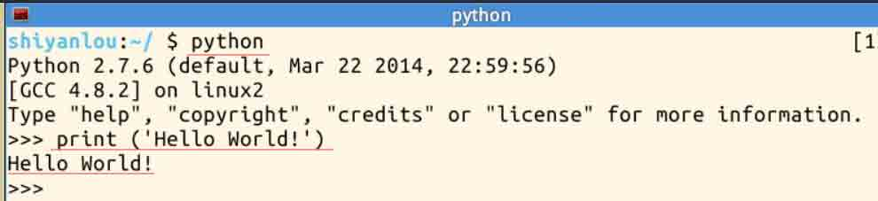
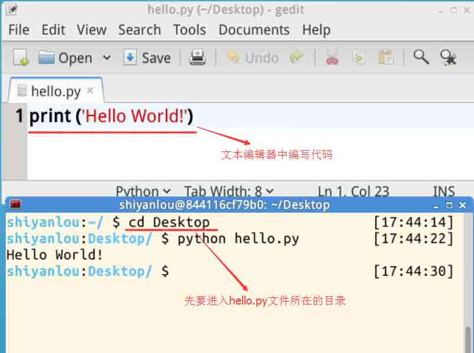
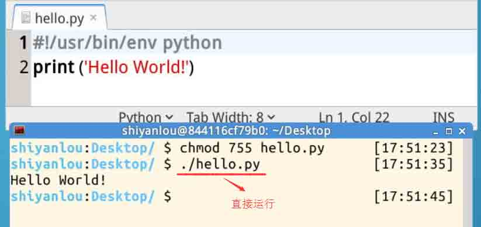

# 第 1 节 Python 基础（上）

## 实验简介

**小提醒**

*   教程将专注于 Python 基础，语法基于 Python 2.7 (我会提醒 Python 3.x 中有变化的地方，以方便读者适应 3.X 的情况)。测试环境为 Linux。标准库的一些包不适用于 Windows 平台。如果文中的程序无法在你的平台上运行，欢迎讨论。

*   我将专注于 Python 的主干，以便读者能以最快时间对 Python 形成概念。

*   Linux 命令行将以 \$ 开始，比如 \$ls, $python

*   Python 命令行将以 >>> 开始，比如 >>>print 'Hello World!'

*   注释会以 # 开始

**建议**

*   将教程中的命令敲到 Python 中看看效果。

*   看过教程之后，可以进行一些练习。

*   参与实验楼讨论区的讨论，可以更好的积累经验。

## 一、实验说明

### 1\. 环境登录

无需密码自动登录，系统用户名 shiyanlou

### 2\. 环境介绍

本实验环境采用 Ubuntu Linux 桌面环境，实验中会用到桌面上的程序：

1.命令行终端: Linux 命令行终端，打开后会进入 Bash 环境，可以使用 Linux 命令；

2.Python：实验楼环境已经安装好 Python 2.7.6；

3.GVim：非常好用的 Vim 编辑器，最简单的用法可以参考课程[Vim 编辑器](http://www.shiyanlou.com/courses/2)；

4.Gedit 及 Brackets：如果您对 GVim 的使用不熟悉，可以用这两个作为代码编辑器，其中 Brackets 非常适用于前端代码开发。

### 3\. 环境使用

使用命令行终端运行所需命令进行操作，使用编辑器输入实验所需的代码及文件。

“实验记录”页面可以在“我的主页”中查看，每次实验的截图及笔记，以及有效学习时间（指的是在实验桌面内操作的时间，如果没有操作，系统会记录为发呆时间）。这些都是您在实验楼学习的真实性证明。

## 二、Hello World!

### 1、Python 命令行

实验环境已经安装好了 Python, 在 Linux 命令行输入:

```py
$python 
```

将直接进入 python。然后在命令行提示符>>>后面输入:

```py
>>>print('Hello World!') 
```

可以看到，随后在屏幕上输出:

```py
Hello World! 
```



print 是一个常用函数，其功能就是输出括号中得字符串。

> （在 Python 2.x 中，print 还可以是一个关键字，可写成 print 'Hello World!'，但这在 3.x 中行不通 ）

### 2、写一段小程序

另一个使用 Python 的方法，是写一个 Python 程序。用文本编辑器写一个 .py 结尾的文件，比如说 hello.py

在 hello.py 中写入如下，并保存:

```py
print('Hello World!') 
```

退出文本编辑器，然后在命令行输入:

```py
$python hello.py 
```

来运行 hello.py。可以看到 Python 随后输出:

```py
Hello World! 
```



### 3、脚本

我们还可以把 Python 程序 hello.py 改成一个可执行的脚本，可以直接执行：

```py
#!/usr/bin/env python
print('Hello World!') 
```

需要修改上面程序的权限为可执行：

```py
chmod 755 hello.py 
```

然后再命令行中，输入：

```py
./hello.py 
```

就可以直接运行了：



## 三、基本数据类型

### 1、变量不需要声明

Python 的变量不需要声明，你可以直接输入：

```py
>>>a = 10 
```

那么你的内存里就有了一个变量 a， 它的值是 10，它的类型是 integer (整数)。 在此之前你不需要做什么特别的声明，而数据类型是 Python 自动决定的。

```py
>>>print a

>>>print type(a) 
```

那么会有如下输出：

```py
10
<type 'int'> 
```

这里，我们学到一个内置函数 type(), 用以查询变量的类型。

### 2、回收变量名

如果你想让 a 存储不同的数据，你不需要删除原有变量就可以直接赋值。

```py
>>>a = 1.3

>>>print a,type(a) 
```

会有如下输出：

```py
1.3 <type 'float'> 
```

我们看到**print 的另一个用法**，也就是 print 后跟多个输出，**以逗号分隔**。

### 3、常用数据类型

```py
|变量        |数据类型          |
|:----------|:----------------|
| a=10       | int 整数         |
| a=1.3      | float 浮点数     |
| a=True     | 真值(True/False) |
| a='Hello!' | 字符串           |
```

以上是最常用的数据类型，对于字符串来说，也可以用双引号。

> （此外还有分数，字符，复数等其他数据类型，有兴趣的可以学习一下）

## 四、序列

sequence(序列)是一组**有顺序**的**元素**的**集合**

(严格的说，是对象的集合，但鉴于我们还没有引入“对象”概念，暂时说元素)

序列可以包含一个或多个**元素**，也可以没有任何元素。

我们之前所说的基本数据类型，都可以作为序列的元素。元素还可以是另一个序列，以及我们以后要介绍的其他对象。

序列有两种：tuple（**定值表**； 也有翻译为**元组**） 和 list (**表**)

```py
>>>s1 = (2, 1.3, 'love', 5.6, 9, 12, False)         # s1 是一个 tuple

>>>s2 = [True, 5, 'smile']                          # s2 是一个 list

>>>print s1,type(s1)

>>>print s2,type(s2) 
```

tuple 和 list 的主要区别在于，一旦建立，**tuple 的各个元素不可再变更，而 list 的各个元素可以再变更**。

一个序列作为另一个序列的元素：

```py
>>>s3 = [1,[3,4,5]] 
```

空序列：

```py
>>>s4 = [] 
```

### 1、元素的引用

序列元素的下标从 0 开始：

```py
>>>print s1[0]

>>>print s2[2]

>>>print s3[1][2] 
```

由于 list 的元素可变更，你可以对 list 的某个元素赋值：

```py
>>>s2[1] = 3.0

>>>print s2 
```

如果你对 tuple 做这样的操作，会得到错误提示。

所以，可以看到，序列的引用通过 s[int]实现，(int 为下标)。

### 2、其他引用方式

范围引用： 基本样式 **[下限:上限:步长]**

```py
>>>print s1[:5]             # 从开始到下标 4 （下标 5 的元素 不包括在内）

>>>print s1[2:]             # 从下标 2 到最后

>>>print s1[0:5:2]          # 从下标 0 到下标 4 (下标 5 不包括在内)，每隔 2 取一个元素 （下标为 0，2，4 的元素）

>>>print s1[2:0:-1]         # 从下标 2 到下标 1 
```

从上面可以看到，在范围引用的时候，如果写明上限，那么**这个上限本身不包括在内**。

尾部元素引用：

```py
>>>print s1[-1]             # 序列最后一个元素

>>>print s1[-3]             # 序列倒数第三个元素 
```

同样，如果 s1[0:-1], 那么最后一个元素不会被引用 （再一次，**不包括上限元素本身**）。

### 3、字符串是元组

字符串是一种特殊的元素，因此可以执行元组的相关操作。

```py
>>>str = 'abcdef'

>>>print str[2:4] 
```

## 五、运算

暂时只介绍这些运算符的基本用法，方便我们展开后面的内容，高级应用暂时不介绍。

### 1、数学运算

```py
>>>print 1+9        # 加法

>>>print 1.3-4      # 减法

>>>print 3*5        # 乘法

>>>print 4.5/1.5    # 除法

>>>print 3**2       # 乘方     

>>>print 10%3       # 求余数 
```

### 2、判断

判断是真还是假，返回 True/False:

```py
>>>print 5==6               # =， 相等

>>>print 8.0!=8.0           # !=, 不等

>>>print 3<3, 3<=3          # <, 小于; <=, 小于等于

>>>print 4>5, 4>=0          # >, 大于; >=, 大于等于

>>>print 5 in [1,3,5]       # 5 是 list [1,3,5]的一个元素 
```

> 还有 is, is not 等, 暂时不深入。

### 3、逻辑运算

True/False 之间的运算：

```py
>>>print True and True, True and False      # and, “与”运算， 两者都为真才是真

>>>print True or False                      # or, "或"运算， 其中之一为真即为真

>>>print not True                           # not, “非”运算， 取反 
```

可以和上一部分结合做一些练习，比如：

```py
>>>print 5==6 or 3>=3 
```

## 六、缩进和选择

### 1、缩进

Python 最具特色的是用缩进来标明成块的代码。我下面以 if 选择结构来举例。if 后面跟随条件，如果条件成立，则执行归属于 if 的一个代码块。

先看 C 语言的表达方式（注意，**这是 C，不是 Python!**）

```py
if ( i > 0 )
{
    x = 1;
    y = 2;
} 
```

如果 i > 0 的话，我们将进行括号中所包括的两个赋值操作。括号中包含的就是块操作，它隶属于 if。

在 Python 中，同样的目的，这段话是这样的：

```py
if i > 0:
    x = 1
    y = 2 
```

在 Python 中， 去掉了 i > 0 周围的括号，去除了每个语句句尾的分号，表示块的花括号也消失了。

多出来了 if ...之后的 **:(冒号)**, 还有就是 x = 1 和 y =2 前面有**四个空格的缩进**。通过缩进，Python 识别出这两个语句是隶属于 if。

Python 这样设计的理由纯粹是为了程序好看。

### 2、if 语句

写一个完整的程序，命名为 ifDemo.py。这个程序用于实现 if 结构。

```py
i = 1
x = 1
if i > 0:
    x = x+1
print x 
```

用 cd 命令进入该文件所在目录，然后输入命令运行它：

```py
$python ifDemo.py  # 运行 
```

程序运行到 if 的时候，条件为 True，因此执行**x = x+1**。

**print x**语句没有缩进，那么就是 if 之外。

如果将第一句改成 i = -1，那么 if 遇到假值 (False), **x = x+1**隶属于 if , 这一句跳过。**print x**没有缩进，是 if 之外，不跳过，继续执行。

这种以**四个空格**的缩进来表示**隶属关系**的书写方式，以后还会看到。强制缩进增强了程序的**可读性**。

复杂一些的 if 选择：

```py
i = 1

if i > 0:
    print 'positive i'
    i = i + 1
elif i == 0:
    print 'i is 0'
    i = i * 10
else:
    print 'negative i'
    i = i - 1

print 'new i:',i 
```

这里有三个块，分别属于**if，elif，else**引领。

Python 检测条件，如果发现 if 的条件为假，那么跳过后面紧跟的块，检测下一个 elif 的条件； 如果还是假，那么执行 else 块。

通过上面的结构将程序分出三个分支。程序根据条件，只执行三个分支中的一个。

整个 if 可以放在另一个 if 语句中，也就是 if 结构的嵌套使用：

```py
i  = 5
if i > 1:
    print 'i bigger than 1'
    print 'good'
    if i > 2:
        print 'i bigger than 2'
        print 'even better' 
```

if i > 2 后面的块相对于该 if 缩进了四个空格，以表明其隶属于该 if ，而不是外层的 if 。

## 作业

按照过程在实验楼环境中把本节内容中的 Python 代码全部运行一遍，并截图保存。