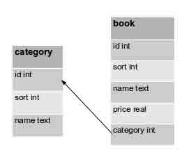

# 第 10 节 Python 标准库（下）

作者：Vamei 出处：http://www.cnblogs.com/vamei 欢迎转载，也请保留这段声明。谢谢！

## 一、多进程探索 (multiprocessing 包)

上一节的最后，初步了解 Python 多进程，现在我们可以继续探索 multiprocessing 包中更加高级的工具。这些工具可以让我们更加便利地实现多进程。

### 1、进程池

进程池 (**Process Pool**)可以创建**多个进程**。这些进程就像是随时待命的士兵，准备执行任务(程序)。一个进程池中可以容纳多个待命的士兵：


比如下面的程序:

```py
import multiprocessing as mul

def f(x):
    return x**2

pool = mul.Pool(5)
rel  = pool.map(f,[1,2,3,4,5,6,7,8,9,10])
print(rel) 
```

我们创建了一个容许 5 个进程的进程池 (Process Pool) 。Pool 运行的每个进程都执行 f()函数。我们利用**map()**方法，将 f()函数作用到表的每个元素上。这与 built-in 的 map()函数类似，只是这里用 5 个进程**并行**处理。如果进程运行结束后，还有需要处理的元素，那么的进程会被用于重新运行 f()函数。除了 map()方法外，Pool 还有下面的常用方法。

*   apply_async(func,args) 从进程池中取出一个进程执行 func，args 为 func 的参数。它将返回一个 AsyncResult 的对象，你可以对该对象调用**get()**方法以获得结果。

*   close() 进程池不再创建新的进程

*   join() wait 进程池中的全部进程。必须对 Pool 先调用 close()方法才能 join。

### 2、共享资源

我们在 Python 多进程初步已经提到，我们应该尽量避免多进程共享资源。多进程共享资源必然会带来进程间相互竞争。而这种竞争又会造成 race condition，我们的结果有可能被竞争的不确定性所影响。但如果需要，我们依然可以通过共享内存和 Manager 对象这么做。


#### 共享内存

我们已经讲述了共享内存(shared memory)的原理，这里给出用 Python 实现的例子:

```py
# modified from official documentation
import multiprocessing

def f(n, a):
    n.value   = 3.14
    a[0]      = 5

num   = multiprocessing.Value('d', 0.0)
arr   = multiprocessing.Array('i', range(10))

p = multiprocessing.Process(target=f, args=(num, arr))
p.start()
p.join()

print num.value
print arr[:] 
```

这里我们实际上只有主进程和 Process 对象代表的进程。我们在主进程的内存空间中创建共享的内存，也就是**Value**和**Array**两个对象。对象 Value 被设置成为双精度数(d), 并初始化为 0.0。而 Array 则类似于 C 中的数组，有固定的类型(i, 也就是整数)。在 Process 进程中，我们修改了 Value 和 Array 对象。回到主程序，打印出结果，主程序也看到了两个对象的改变，说明资源确实在两个进程之间共享。

#### Manager

Manager 对象类似于**服务器与客户**之间的通信 (server-client)，与我们在 Internet 上的活动很类似。我们用一个进程作为服务器，建立 Manager 来真正存放资源。其它的进程可以通过参数传递或者根据**地址**来访问 Manager，建立连接后，操作服务器上的资源。在防火墙允许的情况下，我们完全可以将 Manager 运用于多计算机，从而模仿了一个真实的网络情境。下面的例子中，我们对 Manager 的使用类似于 shared memory，但可以共享更丰富的对象类型。

```py
import multiprocessing

def f(x, arr, l):
    x.value = 3.14
    arr[0] = 5
    l.append('Hello')

server = multiprocessing.Manager()
x    = server.Value('d', 0.0)
arr  = server.Array('i', range(10))
l    = server.list()

proc = multiprocessing.Process(target=f, args=(x, arr, l))
proc.start()
proc.join()

print(x.value)
print(arr)
print(l) 
```

Manager 利用**list()**方法提供了表的共享方式。实际上你可以利用**dict()**来共享词典，**Lock()**来共享 threading.Lock(注意，我们共享的是 threading.Lock，而不是进程的 mutiprocessing.Lock。后者本身已经实现了进程共享)等。 这样 Manager 就允许我们共享更多样的对象。

## 二、数学与随机数 (math 包，random 包)

我们已经在 Python 运算中看到 Python 最基本的数学运算功能。此外，**math 包**补充了更多的函数。当然，如果想要更加高级的数学功能，可以考虑选择标准库之外的**numpy**和**scipy**项目，它们不但支持数组和矩阵运算，还有丰富的数学和物理方程可供使用。

此外，**random 包**可以用来生成**随机数**。随机数不仅可以用于数学用途，还经常被嵌入到算法中，用以提高算法效率，并提高程序的安全性。

### 1、math 包

math 包主要处理数学相关的运算。math 包定义了两个常数:

```py
math.e   # 自然常数 e
math.pi  # 圆周率 pi 
```

此外，math 包还有各种运算函数 (下面函数的功能可以参考数学手册)：

```py
math.ceil(x)       # 对 x 向上取整，比如 x=1.2，返回 2
math.floor(x)      # 对 x 向下取整，比如 x=1.2，返回 1
math.pow(x,y)      # 指数运算，得到 x 的 y 次方
math.log(x)        # 对数，默认基底为 e。可以使用 base 参数，来改变对数的基地。比如 math.log(100,base=10)
math.sqrt(x)       # 平方根 
```

三角函数: math.sin(x), math.cos(x), math.tan(x), math.asin(x), math.acos(x), math.atan(x)

这些函数都接收一个弧度(radian)为单位的 x 作为参数。

角度和弧度互换: math.degrees(x), math.radians(x)

双曲函数: math.sinh(x), math.cosh(x), math.tanh(x), math.asinh(x), math.acosh(x), math.atanh(x)

特殊函数： math.erf(x), math.gamma(x)

### 2、random 包

如果你已经了解伪随机数(psudo-random number)的原理，那么你可以使用如下:

```py
random.seed(x) 
```

来改变随机数生成器的种子 seed。**如果你不了解其原理，你不必特别去设定 seed，Python 会帮你选择 seed。**

#### (1)、随机挑选和排序

```py
random.choice(seq)   # 从序列的元素中随机挑选一个元素，比如 random.choice(range(10))，从 0 到 9 中随机挑选一个整数。
random.sample(seq,k) # 从序列中随机挑选 k 个元素
random.shuffle(seq)  # 将序列的所有元素随机排序 
```

#### (2)、随机生成实数

下面生成的实数符合均匀分布(uniform distribution)，意味着某个范围内的每个数字出现的概率相等:

```py
random.random()          # 随机生成下一个实数，它在[0,1)范围内。
random.uniform(a,b)      # 随机生成下一个实数，它在[a,b]范围内。 
```

下面生成的实数符合其它的分布 (你可以参考一些统计方面的书籍来了解这些分布):

```py
random.gauss(mu,sigma)    # 随机生成符合高斯分布的随机数，mu,sigma 为高斯分布的两个参数。 
random.expovariate(lambd) # 随机生成符合指数分布的随机数，lambd 为指数分布的参数。 
```

此外还有对数分布，正态分布，Pareto 分布，Weibull 分布，可参考下面链接:

http://docs.python.org/library/random.html

假设我们有一群人参加舞蹈比赛，为了公平起见，我们要随机排列他们的出场顺序。我们下面利用 random 包实现：

```py
import random
all_people = ['Tom', 'Vivian', 'Paul', 'Liya', 'Manu', 'Daniel', 'Shawn']
random.shuffle(all_people)
for i,name in enumerate(all_people):
    print(i,':'+name) 
```

## 三、循环器 (itertools)

在循环对象和函数对象中，我们了解了**循环器(iterator)**的功能。循环器是对象的容器，包含有多个对象。通过调用循环器的 next()方法 (__next__()方法，在 Python 3.x 中)，循环器将依次返回一个对象。直到所有的对象遍历穷尽，循环器将举出**StopIteration**错误。

itertools 的工具都可以自行实现。itertools 只是提供了更加成形的解决方案。

在 for i in iterator 结构中，循环器每次返回的对象将赋予给 i，直到循环结束。使用**iter()**内置函数，我们可以将诸如表、字典等容器变为循环器。比如：

```py
for i in iter([2, 4, 5, 6]):
    print(i) 
```

标准库中的**itertools**包提供了更加灵活的生成循环器的工具。这些工具的输入大都是已有的循环器。另一方面，这些工具完全可以自行使用 Python 实现，该包只是提供了一种比较标准、高效的实现方式。这也符合 Python“只有且最好只有解决方案”的理念。

```py
# import the tools
from itertools import * 
```

### 1、无穷循环器

```py
count(5, 2)     #从 5 开始的整数循环器，每次增加 2，即 5, 7, 9, 11, 13, 15 ...
cycle('abc')    #重复序列的元素，既 a, b, c, a, b, c ...
repeat(1.2)     #重复 1.2，构成无穷循环器，即 1.2, 1.2, 1.2, ... 
```

repeat 也可以有一个次数限制:

```py
repeat(10, 5)   #重复 10，共重复 5 次 
```

### 2、函数式工具

函数式编程是将函数本身作为处理对象的编程范式。在 Python 中，函数也是对象，因此可以轻松的进行一些函数式的处理，比如 map(), filter(), reduce()函数。

itertools 包含类似的工具。这些函数接收函数作为参数，并将结果返回为一个循环器。

比如：

```py
from itertools import *

rlt = imap(pow, [1, 2, 3], [1, 2, 3])

for num in rlt:
    print(num) 
```

上面显示了 imap 函数。该函数与 map()函数功能相似，只不过返回的不是序列，而是一个循环器。包含元素 1, 4, 27，即 1**1, 2**2, 3**3 的结果。函数 pow(内置的乘方函数)作为第一个参数。pow()依次作用于后面两个列表的每个元素，并收集函数结果，组成返回的循环器。

此外，还可以用下面的函数:

```py
starmap(pow, [(1, 1), (2, 2), (3, 3)])     #pow 将依次作用于表的每个 tuple。 
```

ifilter 函数与 filter()函数类似，只是返回的是一个循环器。

```py
ifilter(lambda x: x > 5, [2, 3, 5, 6, 7]) #将 lambda 函数依次作用于每个元素，如果函数返回 True，则收集原来的元素。6, 7。 
```

此外：

```py
ifilterfalse(lambda x: x > 5, [2, 3, 5, 6, 7])     #与上面类似，但收集返回 False 的元素。2, 3, 5 
```

```py
takewhile(lambda x: x < 5, [1, 3, 6, 7, 1])     #当函数返回 True 时，收集元素到循环器。一旦函数返回 False，则停止。1, 3 
```

```py
dropwhile(lambda x: x < 5, [1, 3, 6, 7, 1])     #当函数返回 False 时，跳过元素。一旦函数返回 True，则开始收集剩下的所有元素到循环器。6, 7, 1 
```

### 3、组合工具

我们可以通过组合原有循环器，来获得新的循环器。

```py
chain([1, 2, 3], [4, 5, 7])      # 连接两个循环器成为一个。1, 2, 3, 4, 5, 7 
```

```py
product('abc', [1, 2])   # 多个循环器集合的笛卡尔积。相当于嵌套循环 
```

```py
for m, n in product('abc', [1, 2]):
    print m, n 
```

```py
permutations('abc', 2)   # 从'abc'中挑选两个元素，比如 ab, bc, ... 将所有结果排序，返回为新的循环器。 
```

注意，上面的组合分顺序，即 ab, ba 都返回。

```py
combinations('abc', 2)   # 从'abcd'中挑选两个元素，比如 ab, bc, ... 将所有结果排序，返回为新的循环器。 
```

注意，上面的组合不分顺序，即 ab, ba 的话，只返回一个 ab。

```py
combinations_with_replacement('abc', 2) # 与上面类似，但允许两次选出的元素重复。即多了 aa, bb, cc 
```

### 4、groupby()

将 key 函数作用于原循环器的各个元素。根据 key 函数结果，将拥有相同函数结果的元素分到一个新的循环器。每个新的循环器以函数返回结果为标签。

这就好像一群人的身高作为循环器。我们可以使用这样一个 key 函数: 如果身高大于 180，返回"tall"；如果身高底于 160，返回"short";中间的返回"middle"。最终，所有身高将分为三个循环器，即"tall", "short", "middle"。

```py
def height_class(h):
    if h > 180:
        return "tall"
    elif h < 160:
        return "short"
    else:
        return "middle"

friends = [191, 158, 159, 165, 170, 177, 181, 182, 190]

friends = sorted(friends, key = height_class)
for m, n in groupby(friends, key = height_class):
    print(m)
    print(list(n)) 
```

注意，groupby 的功能类似于 UNIX 中的 uniq 命令。分组之前需要使用**sorted()**对原循环器的元素，根据 key 函数进行排序，让同组元素先在位置上靠拢。

### 5、其它工具

```py
compress('ABCD', [1, 1, 1, 0])  # 根据[1, 1, 1, 0]的真假值情况，选择第一个参数'ABCD'中的元素。A, B, C
islice()                        # 类似于 slice()函数，只是返回的是一个循环器
izip()                          # 类似于 zip()函数，只是返回的是一个循环器。 
```

## 四、数据库 (sqlite3)

Python 自带一个轻量级的关系型数据库 SQLite。这一数据库使用 SQL 语言。SQLite 作为后端数据库，可以搭配 Python 建网站，或者制作有数据存储需求的工具。SQLite 还在其它领域有广泛的应用，比如 HTML5 和移动端。Python 标准库中的 sqlite3 提供该数据库的接口。

我将创建一个简单的关系型数据库，为一个书店存储书的分类和价格。数据库中包含两个表：category 用于记录分类，book 用于记录某个书的信息。一本书归属于某一个分类，因此 book 有一个外键(foreign key)，指向 catogory 表的主键 id。



sqlite3 只是一个 SQLite 的接口。想要熟练的使用 SQLite 数据库，还需要学习更多的关系型数据库的知识。

### 1、创建数据库

我首先来创建数据库，以及数据库中的表。在使用 connect()连接数据库后，我就可以通过定位指针 cursor，来执行 SQL 命令：

```py
import sqlite3

# test.db is a file in the working directory.
conn = sqlite3.connect("test.db")

c = conn.cursor()

# create tables
c.execute('''CREATE TABLE category
      (id int primary key, sort int, name text)''')
c.execute('''CREATE TABLE book
      (id int primary key, 
       sort int, 
       name text, 
       price real, 
       category int,
       FOREIGN KEY (category) REFERENCES category(id))''')

# save the changes
conn.commit()

# close the connection with the database
conn.close() 
```

SQLite 的数据库是一个磁盘上的文件，如上面的 test.db，因此整个数据库可以方便的移动或复制。test.db 一开始不存在，所以 SQLite 将自动创建一个新文件。

利用 execute()命令，我执行了两个 SQL 命令，创建数据库中的两个表。创建完成后，保存并断开数据库连接。

### 2、插入数据

上面创建了数据库和表，确立了数据库的抽象结构。下面将在同一数据库中插入数据：

```py
import sqlite3

conn = sqlite3.connect("test.db")
c    = conn.cursor()

books = [(1, 1, 'Cook Recipe', 3.12, 1),
            (2, 3, 'Python Intro', 17.5, 2),
            (3, 2, 'OS Intro', 13.6, 2),
           ]

# execute "INSERT" 
c.execute("INSERT INTO category VALUES (1, 1, 'kitchen')")

# using the placeholder
c.execute("INSERT INTO category VALUES (?, ?, ?)", [(2, 2, 'computer')])

# execute multiple commands
c.executemany('INSERT INTO book VALUES (?, ?, ?, ?, ?)', books)

conn.commit()
conn.close() 
```

插入数据同样可以使用 execute()来执行完整的 SQL 语句。SQL 语句中的参数，使用"?"作为替代符号，并在后面的参数中给出具体值。这里不能用 Python 的格式化字符串，如"%s"，因为这一用法容易受到 SQL 注入攻击。

我也可以用 executemany()的方法来执行多次插入，增加多个记录。每个记录是表中的一个元素，如上面的 books 表中的元素。

### 3、查询

在执行查询语句后，Python 将返回一个循环器，包含有查询获得的多个记录。你循环读取，也可以使用 sqlite3 提供的 fetchone()和 fetchall()方法读取记录：

```py
import sqlite3

conn = sqlite3.connect('test.db')
c = conn.cursor()

# retrieve one record
c.execute('SELECT name FROM category ORDER BY sort')
print(c.fetchone())
print(c.fetchone())

# retrieve all records as a list
c.execute('SELECT * FROM book WHERE book.category=1')
print(c.fetchall())

# iterate through the records
for row in c.execute('SELECT name, price FROM book ORDER BY sort'):
    print(row) 
```

### 4、更新与删除

你可以更新某个记录，或者删除记录：

```py
conn = sqlite3.connect("test.db")
c = conn.cursor()

c.execute('UPDATE book SET price=? WHERE id=?',(1000, 1))
c.execute('DELETE FROM book WHERE id=2')

conn.commit()
conn.close() 
```

你也可以直接删除整张表：

```py
c.execute('DROP TABLE book') 
```

如果删除 test.db，那么整个数据库会被删除。

## 作业

#### 1、有下面一个文件 download.txt：

```py
www.shiyanlou.com
www.163.com
www.baidu.com
www.36kr.com
www.cnblogs.com
www.douban.com 
```

使用包含 3 个进程的进程池下载文件中网站的首页。(你可以使用 subprocess 调用 wget 或者 curl 等下载工具执行具体的下载任务)

#### 2、设计下面两种彩票号码生成器:

1.  从 1 到 22 中随机抽取 5 个整数 （这 5 个数字不重复）

2.  随机产生一个 8 位数字，每位数字都可以是 1 到 6 中的任意一个整数。