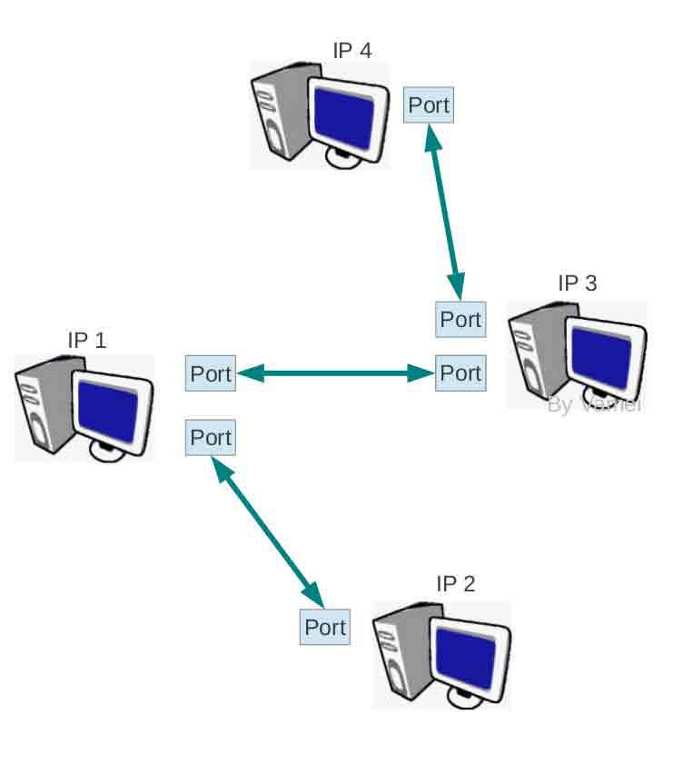
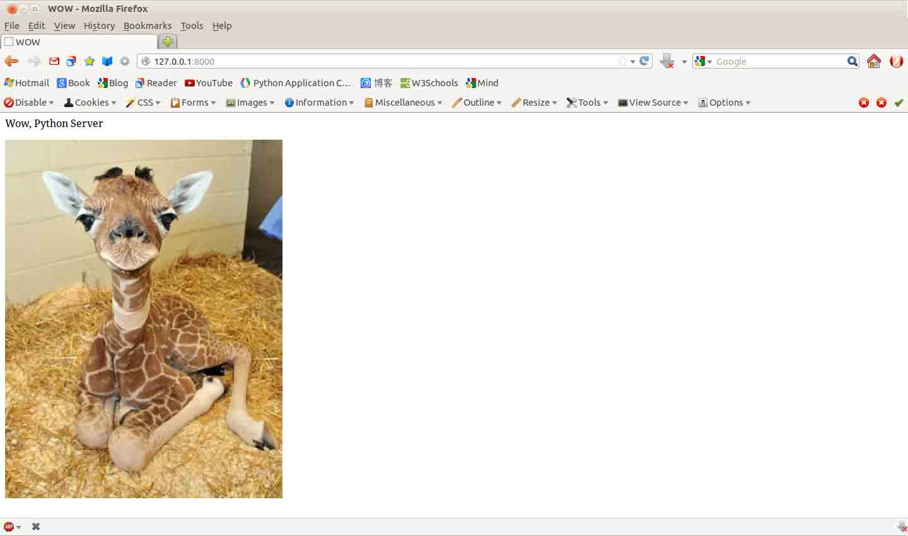
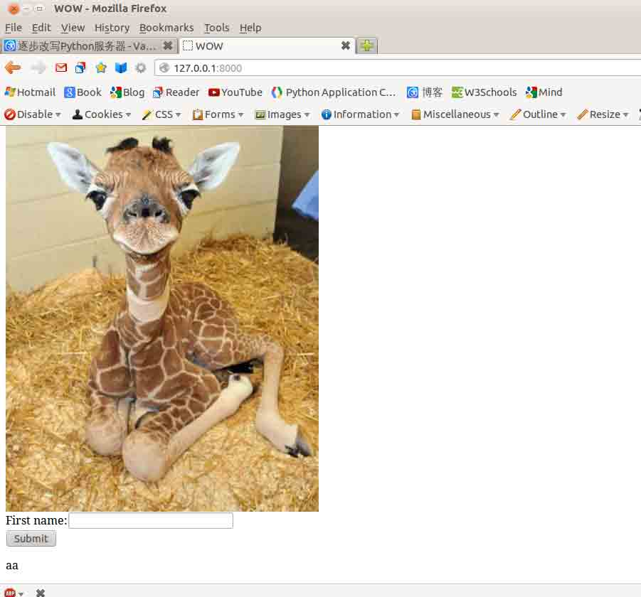
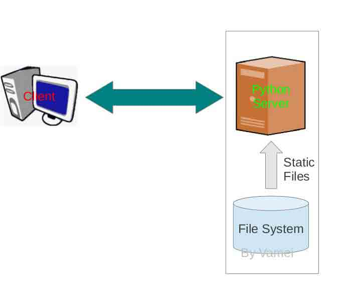
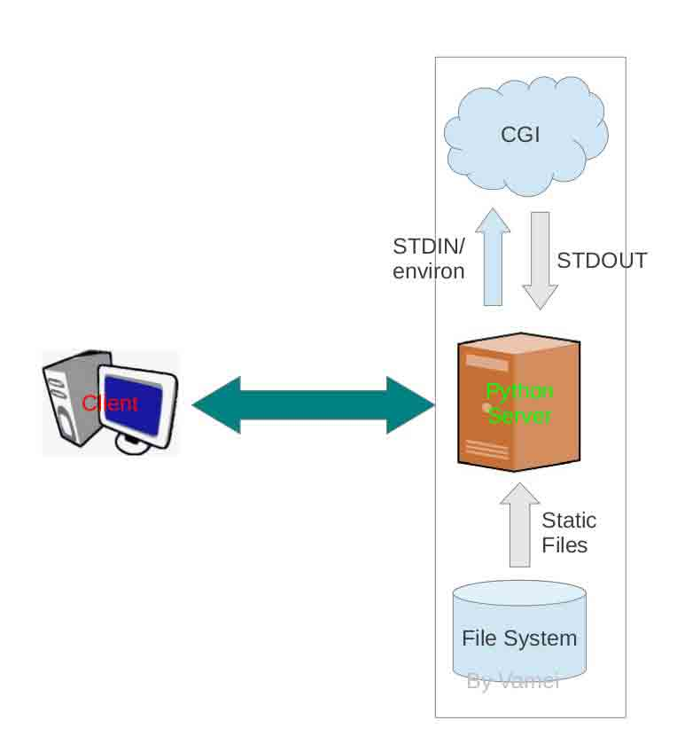

# 第 11 节 Python 网络

作者：Vamei 出处：http://www.cnblogs.com/vamei 欢迎转载，也请保留这段声明。谢谢！

## 一、原始 Python 服务器

有人表示，只学 Python 没有用，必须学会一个框架(比如 Django 和 web.py)才能找到工作。而我的想法是，掌握一个类似于框架的高级工具是有用的，但是基础的东西可以让你永远不被淘汰。不要被工具限制了自己的发展。今天，我在这里想要展示的，就是不使用框架，甚至不使用 Python 标准库中的高级包，只使用标准库中的 socket 接口，写一个 Python 服务器。

在当今 Python 服务器框架 (framework, 比如 Django, Twisted, web.py 等等) 横行的时代，从底层的 socket 开始写服务器似乎是一个出力不讨好的笨方法。框架的意义在于掩盖底层的细节，提供一套对于开发人员更加友好的 API，并处理诸如 MVC 的布局问题。框架允许我们快速的构建一个成型而且成熟的 Python 服务器。然而，框架本身也是依赖于底层(比如 socket)。对于底层 socket 的了解，不仅可以帮助我们更好的使用框架，更可以让我们明白框架是如何设计的。更进一步，如果拥有良好的底层 socket 编程知识和其他系统编程知识，你完全可以设计并开发一款自己的框架。如果你可以从底层 socket 开始，实现一个完整的 Python 服务器，支持用户层的协议，并处理好诸如 MVC(Model-View-Control)、多线程(threading)等问题，并整理出一套清晰的函数或者类，作为**接口(API)**呈现给用户，你就相当于设计了一个框架。

socket 接口是实际上是**操作系统**提供的**系统调用**。socket 的使用并不局限于 Python 语言，你可以用 C 或者 JAVA 来写出同样的 socket 服务器，而所有语言使用 socket 的方式都类似(Apache 就是使用 C 实现的服务器)。而你不能跨语言的使用框架。框架的好处在于帮你处理了一些细节，从而实现快速开发，但同时受到 Python 本身性能的限制。我们已经看到，许多成功的网站都是利用动态语言(比如 Python, Ruby 或者 PHP，比如 twitter 和 facebook)快速开发，在网站成功之后，将代码转换成诸如 C 和 JAVA 这样一些效率比较高的语言，从而让服务器能更有效率的面对每天亿万次的请求。在这样一些时间，底层的重要性，就远远超过了框架。

下面的一篇文章虽然是在谈 JAVA，但我觉得也适用于 Python 的框架之争：http://yakovfain.com/2012/10/11/the-degradation-of-java-developers/

### 1、TCP/IP 和 socket

我们需要对网络传输，特别是**TCP/IP**协议和**socket**有一定的了解。socket 是**进程间通信**的一种方法，它是基于网络传输协议的上层接口。socket 有许多种类型，比如基于 TCP 协议或者 UDP 协议(两种网络传输协议)。其中又以**TCP socket**最为常用。TCP socket 与双向管道(duplex PIPE)有些类似，一个进程向 socket 的一端写入或读取文本流，而另一个进程可以从 socket 的另一端读取或写入，比较特别是，这两个建立 socket 通信的进程**可以分别属于两台不同的计算机**。所谓的 TCP 协议，就是规定了一些通信的守则，以便在网络环境下能够有效实现上述进程间通信过程。双向管道(duplex PIPE)存活于同一台电脑中，所以不必区分两个进程的所在计算机的地址，而 socket 必须包含有地址信息，以便实现网络通信。一个 socket 包含四个地址信息: 两台计算机的 IP 地址和两个进程所使用的端口(port)。IP 地址用于**定位计算机**，而 port 用于**定位进程** (一台计算机上可以有多个进程分别使用不同的端口)。

一个 TCP socket 连接的网络：



### 2、TCP socket

在互联网上，我们可以让某台计算机作为服务器。**服务器**开放自己的端口，**被动**等待其他计算机连接。当其他计算机作为**客户**，**主动**使用 socket 连接到服务器的时候，服务器就开始为客户提供服务。

在 Python 中，我们使用标准库中的**socket 包**来进行底层的 socket 编程。

首先是**服务器端**，我们使用**bind()**方法来赋予 socket 以固定的地址和端口，并使用**listen()**方法来被动的监听该端口。当有客户尝试用 connect()方法连接的时候，服务器使用**accept()**接受连接，从而建立一个连接的 socket：

```py
# Written by Vamei
# Server side
import socket

# Address
HOST = ''
PORT = 8000

reply = 'Yes'

# Configure socket
s      = socket.socket(socket.AF_INET, socket.SOCK_STREAM)
s.bind((HOST, PORT))

# passively wait, 3: maximum number of connections in the queue
s.listen(3)
# accept and establish connection
conn, addr = s.accept()
# receive message
request    = conn.recv(1024)

print 'request is: ',request
print 'Connected by', addr
# send message
conn.sendall(reply)
# close connection
conn.close() 
```

socket.socket()创建一个 socket 对象，并说明 socket 使用的是 IPv4(AF_INET，IP version 4)和 TCP 协议(SOCK_STREAM)。

然后用另一台电脑作为**客户**，我们主动使用**connect()**方法来搜索服务器端的 IP 地址(在 Linux 中，你可以用$ifconfig 来查询自己的 IP 地址)和端口，以便客户可以找到服务器，并建立连接:

```py
# Written by Vamei
# Client side
import socket

# Address
HOST = '172.20.202.155'
PORT = 8000

request = 'can you hear me?'

# configure socket
s       = socket.socket(socket.AF_INET, socket.SOCK_STREAM)
s.connect((HOST, PORT))

# send message
s.sendall(request)
# receive message
reply   = s.recv(1024)
print 'reply is: ',reply
# close connection
s.close() 
```

在上面的例子中，我们对 socket 的两端都可以调用**recv()**方法来接收信息，调用**sendall()**方法来发送信息。这样，我们就可以在分处于两台计算机的两个进程间进行通信了。当通信结束的时候，我们使用**close()**方法来关闭 socket 连接。

> (如果没有两台计算机做实验，也可以将客户端 IP 想要 connect 的 IP 改为**"127.0.0.1"**，这是个特殊的 IP 地址，用来连接当地主机。)

### 3、基于 TCP socket 的 HTTP 服务器

上面的例子中，我们已经可以使用 TCP socket 来为两台远程计算机建立连接。然而，socket 传输自由度太高，从而带来很多安全和兼容的问题。我们往往利用一些应用层的协议(比如 HTTP 协议)来规定 socket **使用规则**，以及所传输信息的**格式**。

**HTTP**协议利用**请求-回应(request-response)**的方式来使用 TCP socket。客户端向服务器发一段文本作为 request，服务器端在接收到 request 之后，向客户端发送一段文本作为 response。在完成了这样一次 request-response 交易之后，TCP socket 被废弃。下次的 request 将建立新的 socket。request 和 response 本质上说是两个文本，只是 HTTP 协议对这两个文本都有一定的格式要求。

request-response cycle：


现在，我们写出一个 HTTP 服务器端：

```py
import socket

# Address
HOST = ''
PORT = 8000

# Prepare HTTP response
text_content = '''HTTP/1.x 200 OK  
Content-Type: text/html

<head>
<title>WOW</title>
</head>
<html>
<p>Wow, Python Server</p>

</html>
'''

# Read picture, put into HTTP format
f = open('test.jpg','rb')
pic_content = '''
HTTP/1.x 200 OK  
Content-Type: image/jpg

'''
pic_content = pic_content + f.read()
f.close()

# Configure socket
s    = socket.socket(socket.AF_INET, socket.SOCK_STREAM)
s.bind((HOST, PORT))

# infinite loop, server forever
while True:
    # 3: maximum number of requests waiting
    s.listen(3)
    conn, addr = s.accept()
    request    = conn.recv(1024)
    method    = request.split(' ')[0]
    src            = request.split(' ')[1]

    # deal with GET method
    if method == 'GET':
        # ULR    
        if src == '/test.jpg':
            content = pic_content
        else: content = text_content

        print 'Connected by', addr
        print 'Request is:', request
        conn.sendall(content)
    # close connection
    conn.close() 
```

### 4、深入 HTTP 服务器程序

如我们上面所看到的，服务器会根据 request 向客户传输的两条信息 text_content 和 pic_content 中的一条，作为 response 文本。整个 response 分为**起始行**(start line), **头信息**(head)和**主体**(body)三部分。起始行就是第一行:

```py
HTTP/1.x 200 OK 
```

它实际上又由空格分为三个片段，HTTP/1.x 表示所使用的 HTTP 版本，200 表示状态(status code)，200 是 HTTP 协议规定的，表示服务器正常接收并处理请求，OK 是供人来阅读的 status code。

头信息跟随起始行，它和主体之间有一个**空行**。这里的 text_content 或者 pic_content 都只有一行的头信息，text_content 用来表示主体信息的类型为 html 文本：

```py
Content-Type: text/html 
```

而 pic_content 的头信息(Content-Type: image/jpg)说明主体的类型为 jpg 图片(image/jpg)。

主体信息为 html 或者 jpg 文件的内容。

> (注意，对于 jpg 文件，我们使用'rb'模式打开，是为了与 windows 兼容。因为在 windows 下，jpg 被认为是二进制(binary)文件，在 UNIX 系统下，则不需要区分文本文件和二进制文件。)

我们并没有写客户端程序，后面我们会用浏览器作为客户端。request 由客户端程序发给服务器。尽管 request 也可以像 response 那样分为三部分，request 的格式与 response 的格式并不相同。request 由客户发送给服务器，比如下面是一个 request：

```py
GET /test.jpg HTTP/1.x
Accept: text/* 
```

起始行可以分为三部分，第一部分为请求方法(**request method**)，第二部分是**URL**，第三部分为 HTTP 版本。request method 可以有 GET， PUT， POST， DELETE， HEAD。最常用的为 GET 和 POST。GET 是请求服务器发送资源给客户，POST 是请求服务器接收客户送来的数据。当我们打开一个网页时，我们通常是使用 GET 方法；当我们填写表格并提交时，我们通常使用 POST 方法。第二部分为 URL，它通常指向一个资源(服务器上的资源或者其它地方的资源)。像现在这样，就是指向当前服务器的当前目录的 test.jpg。

按照 HTTP 协议的规定，服务器需要根据请求执行一定的操作。正如我们在服务器程序中看到的，我们的 Python 程序先检查了 request 的方法，随后根据 URL 的不同，来生成不同的 response(text_content 或者 pic_content)。随后，这个 response 被发送回给客户端。

### 5、使用浏览器实验

为了配合上面的服务器程序，我已经在放置 Python 程序的文件夹里，保存了一个 test.jpg 图片文件。我们在终端运行上面的 Python 程序，作为服务器端，再打开一个**浏览器**作为客户端。(如果有时间，你也完全可以用 Python 写一个客户端。原理与上面的 TCP socket 的客户端程序相类似。)

在浏览器的地址栏输入：127.0.0.1:8000

(当然，你也可以用另一台电脑，并输入服务器的 IP 地址。) 我得到下面的结果:



OK，我已经有了一个用 Python 实现的，并从 socket 写起的服务器了。

从终端，我们可以看到，浏览器实际上发出了两个请求。第一个请求为 (关键信息在**起始行**，这一个请求的主体为空):

```py
GET / HTTP/1.1
Host: 127.0.0.1:8000
User-Agent: Mozilla/5.0 (X11; Ubuntu; Linux x86_64; rv:14.0) Gecko/20100101 Firefox/14.0.1
Accept: text/html,application/xhtml+xml,application/xml;q=0.9,*/*;q=0.8
Accept-Language: en-us,en;q=0.5
Accept-Encoding: gzip, deflate
Connection: keep-alive 
```

我们的 Python 程序根据这个请求，发送给服务器 text_content 的内容。

浏览器接收到 text_content 之后，发现正文的 html 文本中有，知道需要获得 text.jpg 文件来补充为图片，立即发出了第二个请求:

```py
GET /test.jpg HTTP/1.1
Host: 127.0.0.1:8000
User-Agent: Mozilla/5.0 (X11; Ubuntu; Linux x86_64; rv:14.0) Gecko/20100101 Firefox/14.0.1
Accept: image/png,image/*;q=0.8,*/*;q=0.5
Accept-Language: en-us,en;q=0.5
Accept-Encoding: gzip, deflate
Connection: keep-alive
Referer: http://127.0.0.1:8000/ 
```

我们的 Python 程序分析过起始行之后，发现/test.jpg 符合 if 条件，所以将 pic_content 发送给客户。

最后，浏览器根据 html 语言的语法，将 html 文本和图画以适当的方式显示出来。(html 可参考 http://www.w3schools.com/html/default.asp)

### 6、探索的方向

*   1) 在我们上面的服务器程序中，我们用 while 循环来让服务器一直工作下去。实际上，我们还可以根据我之前介绍的多线程的知识，将 while 循环中的内容改为多进程或者多线程工作。

*   2) 我们的服务器程序还不完善，我们还可以让我们的 Python 程序调用 Python 的其他功能，以实现更复杂的功能。比如说制作一个时间服务器，让服务器向客户返回日期和时间。你还可以使用 Python 自带的数据库，来实现一个完整的 LAMP 服务器。

*   3) socket 包是比较底层的包。Python 标准库中还有高层的包，比如 SocketServer，SimpleHTTPServer，CGIHTTPServer，cgi。这些都包都是在帮助我们更容易的使用 socket。如果你已经了解了 socket，那么这些包就很容易明白了。利用这些高层的包，你可以写一个相当成熟的服务器。

*   4) 在经历了所有的辛苦和麻烦之后，你可能发现，框架是那么的方便，所以决定去使用框架。或者，你已经有了参与到框架开发的热情。

## 二、Python 服务器进化

> 注意，在 Python 3.x 中，BaseHTTPServer, SimpleHTTPServer, CGIHTTPServer 整合到 http.server 包，SocketServer 改名为 socketserver，请注意查阅官方文档。

刚才，我们使用 socket 接口，制作了一个处理 HTTP 请求的 Python 服务器。任何一台装有操作系统和 Python 解释器的计算机，都可以作为 HTTP 服务器使用。我将在这里不断改写上一篇文章中的程序，引入更高级的 Python 包，以写出更成熟的 Python 服务器。

### 1、支持 POST

我首先增加该服务器的功能。这里增添了表格，以及处理表格提交数据的"POST"方法。你会发现这里只是比刚才用 socket 写的 Python 服务器增加很少的一点内容。

原始程序:

```py
# A messy HTTP server based on TCP socket 

import socket

# Address
HOST = ''
PORT = 8000

text_content = '''
HTTP/1.x 200 OK  
Content-Type: text/html

<head>
<title>WOW</title>
</head>
<html>
<p>Wow, Python Server</p>

<form name="input" action="/" method="post">
First name:<input type="text" name="firstname"><br>
<input type="submit" value="Submit">
</form> 
</html>
'''

f = open('test.jpg','rb')
pic_content = '''
HTTP/1.x 200 OK  
Content-Type: image/jpg

'''
pic_content = pic_content + f.read()

# Configure socket
s    = socket.socket(socket.AF_INET, socket.SOCK_STREAM)
s.bind((HOST, PORT))

# Serve forever
while True:
    s.listen(3)
    conn, addr = s.accept()                    
    request    = conn.recv(1024)         # 1024 is the receiving buffer size
    method     = request.split(' ')[0]
    src        = request.split(' ')[1]

    print 'Connected by', addr
    print 'Request is:', request

    # if GET method request
    if method == 'GET':
        # if ULR is /test.jpg
        if src == '/test.jpg':
            content = pic_content
        else: content = text_content
        # send message
        conn.sendall(content)
    # if POST method request
    if method == 'POST':
        form = request.split('\r\n')
        idx = form.index('')             # Find the empty line
        entry = form[idx:]               # Main content of the request

        value = entry[-1].split('=')[-1]
        conn.sendall(text_content + '\n <p>' + value + '</p>')
        ######
        # More operations, such as put the form into database
        # ...
        ######
    # close connection
    conn.close() 
```

服务器进行的操作很简单，即从 POST 请求中提取数据，再显示在屏幕上。

运行上面 Python 服务器，使用一个浏览器打开：



页面新增了表格和提交(submit)按钮。在表格中输入 aa 并提交，页面显示出 aa。

下一步要用一些高级包，来简化之前的代码。

### 2、使用 SocketServer

首先使用 SocketServer 包来方便的架设服务器。在上面使用 socket 的过程中，我们**先设置了 socket 的类型，然后依次调用 bind(),listen(),accept()，最后使用 while 循环来让服务器不断的接受请求**。上面的这些步骤可以通过 SocketServer 包来简化。

SocketServer：

```py
# Written by Vamei
# use TCPServer

import SocketServer

HOST = ''
PORT = 8000

text_content = '''
HTTP/1.x 200 OK  
Content-Type: text/html

<head>
<title>WOW</title>
</head>
<html>
<p>Wow, Python Server</p>

<form name="input" action="/" method="post">
First name:<input type="text" name="firstname"><br>
<input type="submit" value="Submit">
</form> 
</html>
'''

f = open('test.jpg','rb')
pic_content = '''
HTTP/1.x 200 OK  
Content-Type: image/jpg

'''
pic_content = pic_content + f.read()

# This class defines response to each request
class MyTCPHandler(SocketServer.BaseRequestHandler):
    def handle(self):
        # self.request is the TCP socket connected to the client
        request = self.request.recv(1024)

        print 'Connected by',self.client_address[0]
        print 'Request is', request

        method     = request.split(' ')[0]
        src        = request.split(' ')[1]

        if method == 'GET':
            if src == '/test.jpg':
                content = pic_content
            else: content = text_content
            self.request.sendall(content)

        if method == 'POST':
            form = request.split('\r\n')
            idx = form.index('')             # Find the empty line
            entry = form[idx:]               # Main content of the request

            value = entry[-1].split('=')[-1]
            self.request.sendall(text_content + '\n <p>' + value + '</p>')
            ######
            # More operations, such as put the form into database
            # ...
            ######

# Create the server
server = SocketServer.TCPServer((HOST, PORT), MyTCPHandler)
# Start the server, and work forever
server.serve_forever() 
```

我建立了一个 TCPServer 对象，即一个使用 TCP socket 的服务器。在建立 TCPServe 的同时，设置该服务器的 IP 地址和端口。使用 server_forever()方法来让服务器不断工作(就像原始程序中的 while 循环一样)。

我们传递给 TCPServer 一个 MyTCPHandler 类。这个类定义了如何操作 socket。MyTCPHandler 继承自 BaseRequestHandler。改写 handler()方法，来具体规定不同情况下服务器的操作。

在 handler()中，通过 self.request 来查询通过 socket 进入服务器的请求 (正如我们在 handler()中对 socket 进行 recv()和 sendall()操作)，还使用 self.address 来引用 socket 的客户端地址。

经过 SocketServer 的改造之后，代码还是不够简单。 我们上面的通信基于 TCP 协议，而不是 HTTP 协议。因此，我们必须手动的解析 HTTP 协议。我们将建立基于 HTTP 协议的服务器。

### 3、SimpleHTTPServer: 使用静态文件来回应请求

HTTP 协议基于 TCP 协议，但增加了更多的规范。这些规范，虽然限制了 TCP 协议的功能，但大大提高了信息封装和提取的方便程度。

对于一个 HTTP 请求(request)来说，它包含有两个重要信息：请求方法和 URL。

```py
| 请求方法(request method) | URL       | 操作                |
|:-------------------------|:----------|:--------------------|
| GET                      | /         | 发送 text*content    |
| GET                      | /text.jpg | 发送 pic*content     |
| POST                     | /         | 分析 request 主体中包含的 value(实际上是我们填入表格的内容); 发送 text_content 和 value |
```

根据请求方法和 URL 的不同，一个大型的 HTTP 服务器可以应付成千上万种不同的请求。在 Python 中，我们可以使用 SimpleHTTPServer 包和 CGIHTTPServer 包来规定针对不同请求的操作。其中，SimpleHTTPServer 可以用于处理 GET 方法和 HEAD 方法的请求。它读取 request 中的 URL 地址，找到对应的**静态文件**，分析文件类型，用 HTTP 协议将文件发送给客户。

SimpleHTTPServer：



我们将 text*content 放置在 index.html 中，并单独存储 text.jpg 文件。如果 URL 指向 index*html 的母文件夹时，SimpleHTTPServer 会读取该文件夹下的 index.html 文件。

我在当前目录下生成 index.html 文件:

```py
<head>
<title>WOW</title>
</head>
<html>
<p>Wow, Python Server</p>

<form name="input" action="/" method="post">
First name:<input type="text" name="firstname"><br>
<input type="submit" value="Submit">
</form>
</html> 
```

改写 Python 服务器程序。使用 SimpleHTTPServer 包中唯一的类 SimpleHTTPRequestHandler:

```py
# Written by Vamei
# Simple HTTPsERVER

import SocketServer
import SimpleHTTPServer

HOST = ''
PORT = 8000

# Create the server, SimpleHTTPRequestHander is pre-defined handler in SimpleHTTPServer package
server = SocketServer.TCPServer((HOST, PORT), SimpleHTTPServer.SimpleHTTPRequestHandler)
# Start the server
server.serve_forever() 
```

这里的程序**不能处理 POST 请求**。我会在后面使用 CGI 来弥补这个缺陷。值得注意的是，Python 服务器程序变得非常简单。将内容存放于静态文件，并根据 URL 为客户端提供内容，这让内容和服务器逻辑分离。每次更新内容时，我可以只修改静态文件，而不用停止整个 Python 服务器。

这些改进也付出代价。在原始程序中，request 中的 URL 只具有指导意义，我可以规定任意的操作。在 SimpleHTTPServer 中，操作与 URL 的指向密切相关。我用自由度，换来了更加简洁的程序。

### 4、CGIHTTPServer：使用静态文件或者 CGI 来回应请求

CGIHTTPServer 包中的 CGIHTTPRequestHandler 类继承自 SimpleHTTPRequestHandler 类，所以可以用来代替上面的例子，来提供静态文件的服务。此外，CGIHTTPRequestHandler 类还可以用来运行**CGI 脚本**。

CGIHTTPServer：



先看看什么是**CGI** (Common Gateway Interface)。CGI 是服务器和应用脚本之间的一套接口标准。它的功能是让服务器程序运行**脚本程序**，将**程序的输出**作为 response 发送给客户。总体的效果，是允许服务器动态的生成回复内容，而不必局限于静态文件。

支持 CGI 的服务器程接收到客户的请求，根据请求中的 URL，运行对应的脚本文件。服务器会将 HTTP 请求的信息和 socket 信息传递给脚本文件，并等待脚本的输出。脚本的输出封装成合法的 HTTP 回复，发送给客户。CGI 可以充分发挥服务器的可编程性，让服务器变得“更聪明”。

服务器和 CGI 脚本之间的通信要符合 CGI 标准。CGI 的实现方式有很多，比如说使用 Apache 服务器与 Perl 写的 CGI 脚本，或者 Python 服务器与 shell 写的 CGI 脚本。

为了使用 CGI，我们需要使用 BaseHTTPServer 包中的**HTTPServer**类来构建服务器。Python 服务器的改动很简单。

CGIHTTPServer:

```py
# Written by Vamei
# A messy HTTP server based on TCP socket 

import BaseHTTPServer
import CGIHTTPServer

HOST = ''
PORT = 8000

# Create the server, CGIHTTPRequestHandler is pre-defined handler
server = BaseHTTPServer.HTTPServer((HOST, PORT), CGIHTTPServer.CGIHTTPRequestHandler)
# Start the server
server.serve_forever() 
```

CGIHTTPRequestHandler 默认当前目录下的 cgi-bin 和 ht-bin 文件夹中的文件为 CGI 脚本，而存放于其他地方的文件被认为是静态文件。因此，我们需要修改一下 index.html，将其中 form 元素指向的 action 改为 cgi-bin/post.py。

```py
<head>
<title>WOW</title>
</head>
<html>
<p>Wow, Python Server</p>

<form name="input" action="cgi-bin/post.py" method="post">
First name:<input type="text" name="firstname"><br>
<input type="submit" value="Submit">
</form>
</html> 
```

我创建一个 cgi-bin 的文件夹，并在 cgi-bin 中放入如下 post.py 文件，也就是我们的**CGI 脚本**：

```py
#!/usr/bin/env python
# Written by Vamei
import cgi
form = cgi.FieldStorage()

# Output to stdout, CGIHttpServer will take this as response to the client
print "Content-Type: text/html"     # HTML is following
print                               # blank line, end of headers
print "<p>Hello world!</p>"         # Start of content
print "<p>" +  repr(form['firstname']) + "</p>" 
```

> (post.py 需要有执行权限，chmod +x cgi-bin/post.py)

第一行说明了脚本所使用的语言，即 Python。 cgi 包用于提取请求中包含的表格信息。脚本只负责将所有的结果输出到标准输出(使用 print)。CGIHTTPRequestHandler 会收集这些输出，封装成 HTTP 回复，传送给客户端。

对于**POST**方法的请求，它的 URL 需要指向一个 CGI 脚本(也就是在 cgi-bin 或者 ht-bin 中的文件)。CGIHTTPRequestHandler 继承自 SimpleHTTPRequestHandler，所以也可以处理**GET**方法和**HEAD**方法的请求。此时，如果 URL 指向 CGI 脚本时，服务器将脚本的运行结果传送到客户端；当此时 URL 指向静态文件时，服务器将文件的内容传送到客户端。

更进一步，我可以让 CGI 脚本执行数据库操作，比如将接收到的数据放入到数据库中，以及更丰富的程序操作。相关内容从略。

我使用了 Python 标准库中的一些高级包简化了 Python 服务器。最终的效果分离静态内容、CGI 应用和服务器，降低三者之间的耦合，让代码变得简单而容易维护。

希望你享受在自己的电脑上架设服务器的过程。

## 作业

将本节内容里的两种 Python 服务器在实验楼环境中运行实现，并截图。